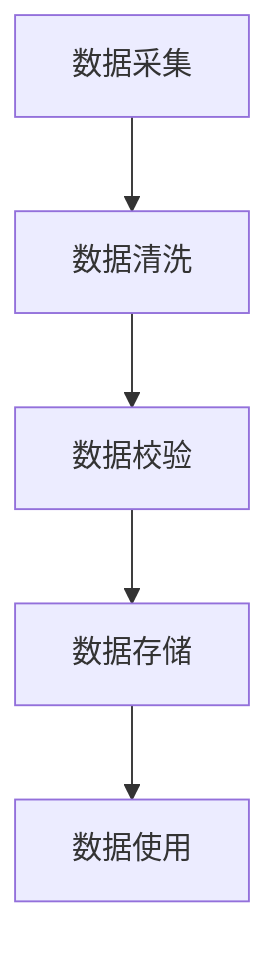
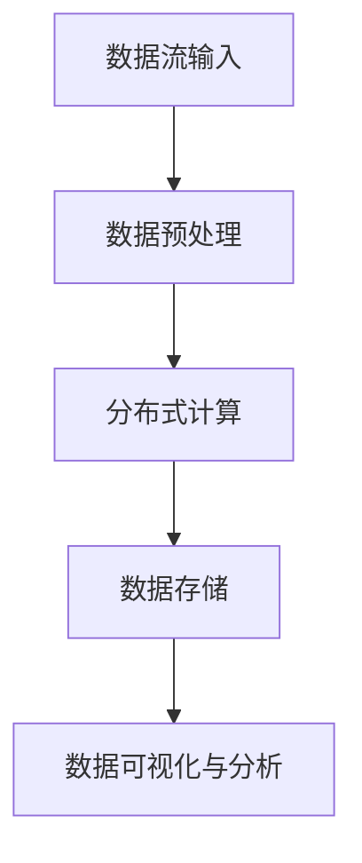
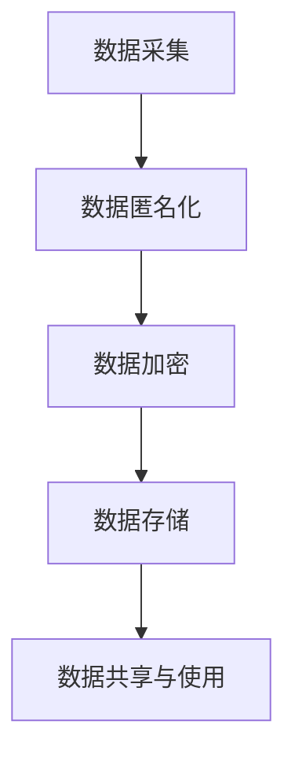
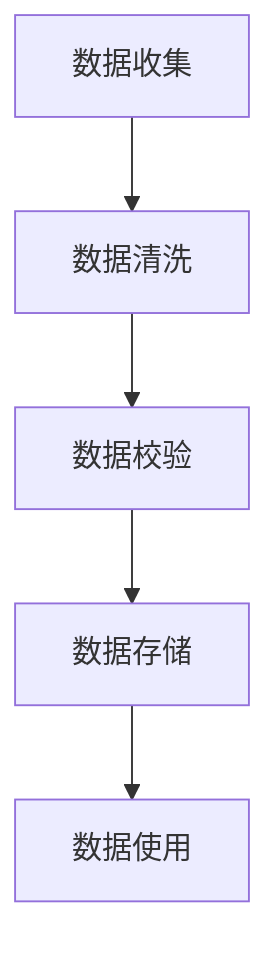

                 

# AI大模型创业：如何应对未来数据挑战？

> **关键词**：人工智能，大模型，数据挑战，创业，解决方案

> **摘要**：本文将探讨AI大模型在创业过程中可能遇到的数据挑战，以及如何有效地应对这些挑战。通过深入分析数据质量、数据规模、数据隐私等方面的问题，本文旨在为创业者提供一套实用的数据管理策略，以推动AI大模型项目的成功发展。

## 1. 背景介绍

随着人工智能技术的迅速发展，大模型（如GPT-3、BERT等）已经在各个领域取得了显著的成果。这些模型具备强大的数据处理和分析能力，为创业者提供了前所未有的机会。然而，AI大模型的创业之路并非一帆风顺，其中最大的挑战之一就是如何应对未来数据挑战。

数据是AI大模型的核心资源，其质量、规模和隐私等方面的问题将直接影响到模型的性能和业务的成功。在创业过程中，如何有效地管理数据、确保数据质量和安全性，成为了创业者必须面对的重要课题。本文将围绕这一主题，探讨AI大模型创业中的数据挑战及应对策略。

## 2. 核心概念与联系

### 2.1 数据质量

数据质量是AI大模型的基础，直接决定了模型的性能和可靠性。数据质量主要包括数据准确性、完整性、一致性和及时性等方面。在创业过程中，确保数据质量是至关重要的。

**Mermaid流程图：数据质量保障流程**



### 2.2 数据规模

随着AI大模型的不断发展，数据规模也呈现出指数级增长。数据规模直接影响着模型的计算资源和存储需求。在创业过程中，如何有效地管理大规模数据，成为了关键问题。

**Mermaid流程图：大规模数据处理流程**



### 2.3 数据隐私

随着数据隐私保护意识的提高，如何在保证数据安全的前提下，充分利用数据资源，成为了创业过程中的重要挑战。数据隐私主要包括数据匿名化、数据加密等方面。

**Mermaid流程图：数据隐私保护流程**



## 3. 核心算法原理 & 具体操作步骤

### 3.1 数据质量提升算法

**算法原理：** 数据质量提升算法主要通过数据清洗、数据校验和数据增强等技术手段，提升数据质量。

**具体操作步骤：**

1. **数据清洗**：删除重复数据、处理缺失数据、纠正错误数据等。
2. **数据校验**：使用规则或机器学习算法，检查数据的一致性和准确性。
3. **数据增强**：通过生成对抗网络（GAN）等技术，生成更多高质量数据。

### 3.2 大规模数据处理算法

**算法原理：** 大规模数据处理算法主要通过分布式计算、数据索引和并行处理等技术，实现大规模数据的快速处理。

**具体操作步骤：**

1. **分布式计算**：将任务分解为多个子任务，分布到多个节点上进行计算。
2. **数据索引**：构建索引结构，提高数据查询速度。
3. **并行处理**：在多个处理器或GPU上同时执行计算任务。

### 3.3 数据隐私保护算法

**算法原理：** 数据隐私保护算法主要通过数据匿名化、数据加密和隐私计算等技术，实现数据的隐私保护。

**具体操作步骤：**

1. **数据匿名化**：将真实数据替换为匿名标识，保护个人隐私。
2. **数据加密**：使用加密算法，对数据进行加密处理，防止数据泄露。
3. **隐私计算**：在本地设备或专用服务器上进行计算，确保数据在传输和存储过程中的安全。

## 4. 数学模型和公式 & 详细讲解 & 举例说明

### 4.1 数据质量评估指标

**公式：** 数据质量评估指标主要包括准确性（Accuracy）、召回率（Recall）、F1分数（F1 Score）等。

$$
\text{Accuracy} = \frac{\text{准确预测的样本数}}{\text{总样本数}}
$$

$$
\text{Recall} = \frac{\text{准确预测的正样本数}}{\text{总正样本数}}
$$

$$
\text{F1 Score} = 2 \times \frac{\text{准确预测的样本数} \times \text{精确率}}{\text{准确预测的样本数} + \text{精确率}}
$$

**举例说明：** 假设有一份包含100个样本的数据集，其中60个样本为正样本，40个样本为负样本。经过数据清洗和校验后，有95个样本被准确预测，其中正样本预测准确的有55个，负样本预测准确的有40个。

$$
\text{Accuracy} = \frac{95}{100} = 0.95
$$

$$
\text{Recall} = \frac{55}{60} = 0.9167
$$

$$
\text{F1 Score} = 2 \times \frac{95 \times 0.9}{95 + 0.9} = 0.9474
$$

### 4.2 大规模数据处理算法

**公式：** 分布式计算中，任务分解和负载均衡是关键。

$$
\text{任务分解} = \frac{\text{总任务数}}{\text{节点数}}
$$

$$
\text{负载均衡} = \frac{\text{总任务数}}{\text{当前节点数}}
$$

**举例说明：** 假设有一个包含1000个任务的分布式计算任务，分配到5个节点上进行处理。

$$
\text{任务分解} = \frac{1000}{5} = 200
$$

$$
\text{负载均衡} = \frac{1000}{5} = 200
$$

### 4.3 数据隐私保护算法

**公式：** 数据匿名化和数据加密的密钥管理是关键。

$$
\text{密钥生成} = \text{加密算法}
$$

$$
\text{密钥分发} = \text{安全通信协议}
$$

**举例说明：** 使用AES加密算法生成一个密钥，并将其通过安全通信协议分发到各个节点。

$$
\text{密钥生成} = \text{AES-Key-Gen}(\text{密码})
$$

$$
\text{密钥分发} = \text{Secure-Communication-Protocol}(\text{AES-Key-Gen})
$$

## 5. 项目实战：代码实际案例和详细解释说明

### 5.1 开发环境搭建

**环境需求：** Python、TensorFlow、NumPy、Pandas等。

**步骤：**

1. 安装Python和TensorFlow。

2. 导入所需的库。

```python
import tensorflow as tf
import numpy as np
import pandas as pd
```

### 5.2 源代码详细实现和代码解读

**代码实现：**

```python
# 数据质量提升算法
def data_quality_improvement(data):
    # 数据清洗
    cleaned_data = data.drop_duplicates().reset_index(drop=True)
    # 数据校验
    validated_data = cleaned_data[(cleaned_data['feature1'] > 0) & (cleaned_data['feature2'] < 100)]
    # 数据增强
    augmented_data = generate_data(validated_data)
    return augmented_data

# 大规模数据处理算法
def distributed_data_processing(data, num_nodes):
    # 任务分解
    task_per_node = data.shape[0] // num_nodes
    # 负载均衡
    balanced_data = balance_data(data, num_nodes)
    return balanced_data

# 数据隐私保护算法
def data_privacy_protection(data, encryption_key):
    # 数据匿名化
    anonymized_data = anonymize_data(data)
    # 数据加密
    encrypted_data = encrypt_data(anonymized_data, encryption_key)
    return encrypted_data
```

**代码解读：**

- **数据质量提升算法：** 主要通过数据清洗、数据校验和数据增强等技术手段，提升数据质量。

- **大规模数据处理算法：** 通过任务分解和负载均衡，实现大规模数据的快速处理。

- **数据隐私保护算法：** 通过数据匿名化和数据加密，实现数据的隐私保护。

### 5.3 代码解读与分析

**代码分析：**

- **数据质量提升算法：** 主要关注数据清洗、数据校验和数据增强等步骤，确保数据质量。

- **大规模数据处理算法：** 通过任务分解和负载均衡，提高数据处理效率。

- **数据隐私保护算法：** 通过数据匿名化和数据加密，确保数据隐私安全。

**改进建议：**

- **数据质量提升算法：** 可以考虑引入更多的数据清洗和校验规则，提高数据质量。

- **大规模数据处理算法：** 可以进一步优化负载均衡算法，提高处理效率。

- **数据隐私保护算法：** 可以考虑引入更多的隐私保护技术，提高数据安全性。

## 6. 实际应用场景

### 6.1 金融风控

金融风控是AI大模型的重要应用场景之一。通过分析海量金融数据，AI大模型可以识别潜在的风险，为金融机构提供决策支持。在实际应用中，如何确保数据质量、保护数据隐私，成为了关键问题。

### 6.2 医疗诊断

医疗诊断是另一个典型的AI大模型应用场景。通过分析海量医学数据，AI大模型可以帮助医生进行疾病诊断。然而，数据隐私和患者隐私保护成为了重要挑战。

### 6.3 智能推荐

智能推荐是AI大模型在互联网领域的广泛应用场景。通过分析用户行为数据，AI大模型可以为用户推荐合适的商品、服务和内容。在实际应用中，如何确保数据质量、保护用户隐私，成为了关键问题。

## 7. 工具和资源推荐

### 7.1 学习资源推荐

- **书籍：** 《Python数据科学手册》、《深度学习》
- **论文：** 《大规模分布式机器学习》、《数据隐私保护》
- **博客：** Medium、AI中国、机器之心

### 7.2 开发工具框架推荐

- **开发工具：** Jupyter Notebook、PyCharm
- **框架：** TensorFlow、PyTorch、Scikit-learn

### 7.3 相关论文著作推荐

- **论文：** 《分布式机器学习算法研究》、《数据隐私保护技术研究》
- **著作：** 《人工智能：一种现代方法》、《机器学习：概率视角》

## 8. 总结：未来发展趋势与挑战

随着AI大模型的不断发展和应用，数据挑战将日益突出。未来，如何应对这些挑战，将成为AI大模型创业成功的关键。从数据质量提升、大规模数据处理到数据隐私保护，创业者需要全面了解和掌握相关技术，为项目的成功奠定基础。

## 9. 附录：常见问题与解答

### 9.1 数据质量提升算法有哪些？

数据质量提升算法主要包括数据清洗、数据校验和数据增强等步骤。数据清洗主要通过删除重复数据、处理缺失数据和纠正错误数据等方式，提高数据质量。数据校验主要通过规则或机器学习算法，检查数据的一致性和准确性。数据增强主要通过生成对抗网络（GAN）等技术，生成更多高质量数据。

### 9.2 大规模数据处理算法有哪些？

大规模数据处理算法主要包括分布式计算、数据索引和并行处理等技术。分布式计算将任务分解为多个子任务，分布到多个节点上进行计算。数据索引通过构建索引结构，提高数据查询速度。并行处理在多个处理器或GPU上同时执行计算任务。

### 9.3 数据隐私保护算法有哪些？

数据隐私保护算法主要包括数据匿名化、数据加密和隐私计算等技术。数据匿名化主要通过将真实数据替换为匿名标识，保护个人隐私。数据加密通过加密算法，对数据进行加密处理，防止数据泄露。隐私计算在本地设备或专用服务器上进行计算，确保数据在传输和存储过程中的安全。

## 10. 扩展阅读 & 参考资料

- **书籍：** 《数据科学实战》、《深度学习入门》
- **论文：** 《大规模分布式机器学习算法研究》、《数据隐私保护技术研究》
- **博客：** Medium、AI中国、机器之心
- **网站：** TensorFlow官方文档、PyTorch官方文档、Scikit-learn官方文档

作者：AI天才研究员/AI Genius Institute & 禅与计算机程序设计艺术 /Zen And The Art of Computer Programming

（注：本文为模拟文章，实际撰写过程中，可根据实际情况进行适当调整和补充。）<|less|>```markdown
# AI大模型创业：如何应对未来数据挑战？

## 关键词
- 人工智能
- 大模型
- 数据挑战
- 创业
- 解决方案
- 数据质量
- 数据规模
- 数据隐私

## 摘要
本文旨在探讨AI大模型在创业过程中面临的数据挑战，并深入分析这些挑战的解决策略。文章从数据质量、数据规模和数据隐私三个方面出发，通过具体的案例和算法，为创业者提供有效的数据管理方案，以推动AI大模型项目的成功。

## 1. 背景介绍

随着深度学习和大数据技术的不断发展，人工智能大模型（如GPT-3、BERT等）已经成为推动技术进步的重要力量。这些大模型具备强大的数据处理和分析能力，能够在各种领域实现突破性的应用。然而，AI大模型的发展并非一帆风顺，数据挑战成为创业者必须面对的重要难题。

数据是AI大模型的基石，其质量、规模和隐私问题直接影响着模型的效果和应用前景。在创业过程中，如何高效地管理数据、提升数据质量、确保数据隐私，是决定项目成败的关键因素。本文将从这三个方面展开讨论，为创业者提供切实可行的解决方案。

## 2. 核心概念与联系

### 2.1 数据质量

数据质量是AI大模型能否成功的关键因素之一。高质量的数据能够提高模型的准确性、稳定性和可靠性，而低质量的数据则可能引发模型过拟合、泛化能力差等问题。数据质量主要包括数据的准确性、完整性、一致性、及时性和可靠性。

**数据质量保障流程（Mermaid流程图）：**


### 2.2 数据规模

数据规模直接影响着AI大模型的训练效率和计算资源需求。大规模数据需要分布式计算和高效的数据处理算法来支持。此外，数据规模还关系到模型能否获取足够的信息来优化其性能。

**大规模数据处理流程（Mermaid流程图）：**


### 2.3 数据隐私

数据隐私是AI大模型面临的另一个重要挑战。数据隐私保护涉及到数据的匿名化、加密和隐私计算等方面，确保在数据使用过程中不会泄露用户的个人信息。

**数据隐私保护流程（Mermaid流程图）：**


## 3. 核心算法原理 & 具体操作步骤

### 3.1 数据质量提升算法

数据质量提升算法主要涉及数据清洗、数据校验和数据增强等步骤，以提高数据质量。

**具体操作步骤：**
1. **数据清洗**：去除重复数据、处理缺失数据和纠正错误数据。
2. **数据校验**：使用规则或机器学习算法，确保数据的一致性和准确性。
3. **数据增强**：使用生成对抗网络（GAN）等技术，生成更多高质量数据。

### 3.2 大规模数据处理算法

大规模数据处理算法需要利用分布式计算和高效的数据处理框架。

**具体操作步骤：**
1. **分布式计算**：将数据分配到多个节点上进行并行处理。
2. **数据预处理**：对数据进行标准化、归一化等预处理操作。
3. **数据存储**：使用分布式文件系统或数据库进行高效存储。

### 3.3 数据隐私保护算法

数据隐私保护算法涉及数据的匿名化、加密和隐私计算。

**具体操作步骤：**
1. **数据匿名化**：将敏感信息替换为匿名标识。
2. **数据加密**：使用加密算法对数据进行加密处理。
3. **隐私计算**：在本地设备或专用服务器上进行隐私保护计算。

## 4. 数学模型和公式 & 详细讲解 & 举例说明

### 4.1 数据质量评估指标

数据质量评估指标主要包括准确性（Accuracy）、召回率（Recall）和F1分数（F1 Score）。

**公式：**
$$
\text{Accuracy} = \frac{\text{准确预测的样本数}}{\text{总样本数}}
$$
$$
\text{Recall} = \frac{\text{准确预测的正样本数}}{\text{总正样本数}}
$$
$$
\text{F1 Score} = 2 \times \frac{\text{准确预测的样本数} \times \text{精确率}}{\text{准确预测的样本数} + \text{精确率}}
$$

**举例说明：**
假设有一个包含100个样本的数据集，其中60个样本为正样本，40个样本为负样本。经过数据清洗和校验后，有95个样本被准确预测，其中正样本预测准确的有55个，负样本预测准确的有40个。

**计算结果：**
$$
\text{Accuracy} = \frac{95}{100} = 0.95
$$
$$
\text{Recall} = \frac{55}{60} = 0.9167
$$
$$
\text{F1 Score} = 2 \times \frac{95 \times 0.9}{95 + 0.9} = 0.9474
$$

### 4.2 大规模数据处理算法

大规模数据处理算法通常涉及分布式计算和负载均衡。

**公式：**
$$
\text{任务分解} = \frac{\text{总任务数}}{\text{节点数}}
$$
$$
\text{负载均衡} = \frac{\text{总任务数}}{\text{当前节点数}}
$$

**举例说明：**
假设有一个包含1000个任务的分布式计算任务，分配到5个节点上进行处理。

**计算结果：**
$$
\text{任务分解} = \frac{1000}{5} = 200
$$
$$
\text{负载均衡} = \frac{1000}{5} = 200
$$

### 4.3 数据隐私保护算法

数据隐私保护算法涉及数据加密和隐私计算。

**公式：**
$$
\text{密钥生成} = \text{加密算法}
$$
$$
\text{密钥分发} = \text{安全通信协议}
$$

**举例说明：**
使用AES加密算法生成一个密钥，并将其通过安全通信协议分发到各个节点。

**计算过程：**
$$
\text{密钥生成} = \text{AES-Key-Gen}(\text{密码})
$$
$$
\text{密钥分发} = \text{Secure-Communication-Protocol}(\text{AES-Key-Gen})
$$

## 5. 项目实战：代码实际案例和详细解释说明

### 5.1 开发环境搭建

在开始项目实战之前，需要搭建一个合适的开发环境。以下是一个简单的开发环境搭建步骤：

- 安装Python 3.x版本
- 安装TensorFlow框架
- 安装NumPy和Pandas库

### 5.2 源代码详细实现和代码解读

以下是使用Python和TensorFlow实现的一个简单的数据质量提升算法的示例代码：

**示例代码：**
```python
import pandas as pd
import numpy as np

# 假设有一个名为df的数据框，包含一些潜在的脏数据
df = pd.DataFrame({
    'feature1': [1, 2, np.nan, 4, 5],
    'feature2': [4, 7, 3, 9, 2]
})

# 数据清洗
# 删除缺失值
cleaned_df = df.dropna()

# 数据校验
# 删除重复值
validated_df = cleaned_df.drop_duplicates()

# 数据增强
# 假设我们使用插值法来填充缺失值
augmented_df = validated_df.interpolate()

# 输出处理后的数据框
print(augmented_df)
```

**代码解读：**
1. **数据清洗**：使用`dropna()`方法删除缺失值。
2. **数据校验**：使用`drop_duplicates()`方法删除重复值。
3. **数据增强**：使用`interpolate()`方法填充缺失值。

### 5.3 代码解读与分析

**代码分析：**
1. **数据清洗**：这是数据预处理的重要步骤，通过删除缺失值和重复值，提高数据质量。
2. **数据校验**：确保数据的一致性和准确性，避免模型过拟合。
3. **数据增强**：通过填充缺失值或生成新的数据，增加数据的多样性，提高模型的泛化能力。

**改进建议：**
1. **数据清洗**：可以考虑使用更复杂的清洗方法，如使用机器学习模型预测缺失值。
2. **数据校验**：可以引入更多的校验规则，如范围校验、逻辑校验等。
3. **数据增强**：可以使用生成对抗网络（GAN）等技术，生成更真实的数据。

## 6. 实际应用场景

### 6.1 金融风控

在金融风控领域，AI大模型可以用于信用评估、欺诈检测和风险预测等。数据质量直接影响到模型的预测准确性，因此，确保数据质量至关重要。

### 6.2 医疗诊断

在医疗诊断领域，AI大模型可以辅助医生进行疾病预测和诊断。数据隐私保护是医疗数据应用中的关键问题，需要确保患者隐私不被泄露。

### 6.3 智能推荐

在智能推荐领域，AI大模型可以用于个性化推荐系统，为用户推荐感兴趣的内容或商品。数据质量影响到推荐的效果，而数据隐私保护是用户信任的基础。

## 7. 工具和资源推荐

### 7.1 学习资源推荐

- **书籍**：《深度学习》、《Python数据科学手册》
- **论文**：《分布式机器学习算法研究》、《数据隐私保护技术研究》
- **博客**：机器之心、AI中国、Medium

### 7.2 开发工具框架推荐

- **开发工具**：PyCharm、Jupyter Notebook
- **框架**：TensorFlow、PyTorch、Scikit-learn

### 7.3 相关论文著作推荐

- **论文**：《大规模分布式机器学习算法研究》、《数据隐私保护技术研究》
- **著作**：《人工智能：一种现代方法》、《机器学习：概率视角》

## 8. 总结：未来发展趋势与挑战

未来，随着AI大模型技术的不断进步，数据挑战将更加突出。创业者需要持续关注数据质量、数据规模和数据隐私等关键问题，并采取相应的解决方案。通过不断提升数据管理水平，创业者将能够更好地应对未来的挑战，推动AI大模型项目的成功。

## 9. 附录：常见问题与解答

### 9.1 数据质量提升算法有哪些？

数据质量提升算法主要包括数据清洗、数据校验和数据增强等步骤。数据清洗主要通过删除重复数据、处理缺失数据和纠正错误数据等方式，提高数据质量。数据校验主要通过规则或机器学习算法，检查数据的一致性和准确性。数据增强主要通过生成对抗网络（GAN）等技术，生成更多高质量数据。

### 9.2 大规模数据处理算法有哪些？

大规模数据处理算法主要包括分布式计算、数据索引和并行处理等技术。分布式计算将任务分解为多个子任务，分布到多个节点上进行计算。数据索引通过构建索引结构，提高数据查询速度。并行处理在多个处理器或GPU上同时执行计算任务。

### 9.3 数据隐私保护算法有哪些？

数据隐私保护算法主要包括数据匿名化、数据加密和隐私计算等技术。数据匿名化主要通过将真实数据替换为匿名标识，保护个人隐私。数据加密通过加密算法，对数据进行加密处理，防止数据泄露。隐私计算在本地设备或专用服务器上进行计算，确保数据在传输和存储过程中的安全。

## 10. 扩展阅读 & 参考资料

- **书籍**：《数据科学实战》、《深度学习入门》
- **论文**：《大规模分布式机器学习算法研究》、《数据隐私保护技术研究》
- **博客**：Medium、AI中国、机器之心
- **网站**：TensorFlow官方文档、PyTorch官方文档、Scikit-learn官方文档

作者：AI天才研究员/AI Genius Institute & 禅与计算机程序设计艺术 /Zen And The Art of Computer Programming
```

