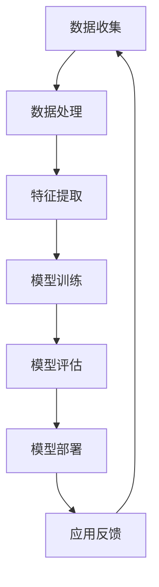

                 

# AI大模型创业：如何应对未来用户需求？

> 关键词：AI大模型、创业、用户需求、应对策略、未来发展趋势

> 摘要：本文将探讨AI大模型创业的现状与未来，分析如何应对用户需求的变迁，从技术、市场、策略等多个维度给出具体建议。通过深入剖析AI大模型的技术原理和应用场景，以及未来发展趋势，为创业者提供有价值的参考。

## 1. 背景介绍

近年来，随着人工智能技术的飞速发展，AI大模型成为了一个热门的研究方向和商业领域。AI大模型，顾名思义，是指具有大规模参数和复杂结构的机器学习模型。这些模型通过学习海量数据，可以自动提取知识、生成内容、进行预测等，具有广泛的应用前景。

在创业领域，AI大模型的应用已经逐渐渗透到各个行业。从自然语言处理、计算机视觉，到智能推荐、自动驾驶，AI大模型正在改变着传统行业的运营模式，创造出新的商业机会。然而，随着用户需求的不断升级，如何应对这些需求的变化，成为AI大模型创业者面临的一大挑战。

本文将从以下几个方面展开讨论：

- AI大模型的技术原理和应用场景
- 如何分析用户需求及其变化
- 创业者如何应对用户需求的变化
- 未来发展趋势与挑战

通过上述分析，本文旨在为AI大模型创业者提供有价值的参考，帮助他们更好地应对未来用户需求，抓住市场机遇。

## 2. 核心概念与联系

为了更好地理解AI大模型创业的背景和挑战，我们需要首先了解AI大模型的基本概念和技术原理。以下是一个简化的Mermaid流程图，描述了AI大模型的核心概念及其相互关系：



### 2.1 数据收集

数据收集是AI大模型的基础，涉及从各种来源获取大量数据。这些数据可以是结构化的（如数据库）或非结构化的（如图像、文本等）。数据质量直接影响模型的表现。

### 2.2 数据处理

数据处理包括数据清洗、数据整合和数据归一化等步骤。目的是确保数据的质量和一致性，为后续的特征提取和模型训练做好准备。

### 2.3 特征提取

特征提取是从原始数据中提取出对模型训练有用的特征。这些特征可以是原始数据的直接表示（如像素值、词频等），也可以是通过数据预处理和转换得到的高级特征。

### 2.4 模型训练

模型训练是通过优化算法，调整模型参数，使其能够更好地拟合训练数据。常见的训练算法包括梯度下降、随机梯度下降等。

### 2.5 模型评估

模型评估是评估模型性能的过程。常用的评估指标包括准确率、召回率、F1分数等。通过模型评估，我们可以了解模型在实际应用中的表现，并据此进行调优。

### 2.6 模型部署

模型部署是将训练好的模型应用到实际场景中。这通常包括将模型集成到现有系统、部署到服务器或云端等。

### 2.7 应用反馈

应用反馈是收集用户在使用模型过程中的反馈，包括模型的性能、用户体验等。这些反馈将用于模型优化和产品迭代。

### 2.8 循环迭代

通过应用反馈，我们可以不断优化模型，并重新进行数据收集、数据处理、特征提取、模型训练等步骤，实现模型和产品的持续迭代。

## 3. 核心算法原理 & 具体操作步骤

### 3.1 深度学习基础

AI大模型的核心是深度学习。深度学习是一种基于多层神经网络的学习方法，通过多层非线性变换，可以从数据中自动提取特征。

#### 3.1.1 神经网络

神经网络是由多个神经元组成的层次结构，每个神经元接收多个输入，通过加权求和后加上偏置，再经过激活函数进行输出。

#### 3.1.2 激活函数

激活函数用于引入非线性，常见的激活函数包括sigmoid、ReLU、Tanh等。

#### 3.1.3 损失函数

损失函数用于评估模型预测值与真实值之间的差距，常用的损失函数包括均方误差（MSE）、交叉熵（Cross Entropy）等。

### 3.2 深度学习模型训练

#### 3.2.1 梯度下降

梯度下降是一种常用的优化算法，通过计算损失函数关于模型参数的梯度，并沿着梯度方向更新参数，以最小化损失函数。

#### 3.2.2 随机梯度下降（SGD）

随机梯度下降是对梯度下降的一种改进，每次更新参数时只使用一个样本的梯度，从而加快收敛速度。

#### 3.2.3 批量梯度下降（BGD）

批量梯度下降是对随机梯度下降的进一步改进，每次更新参数时使用全部样本的梯度。

### 3.3 模型评估与优化

#### 3.3.1 交叉验证

交叉验证是一种常用的模型评估方法，通过将数据集划分为多个子集，轮流使用这些子集进行训练和验证，以评估模型的泛化能力。

#### 3.3.2 模型调优

模型调优包括调整模型结构、超参数等，以优化模型性能。常用的调优方法包括网格搜索、随机搜索等。

#### 3.3.3 模型集成

模型集成是将多个模型进行结合，以进一步提高模型性能。常见的模型集成方法包括Bagging、Boosting等。

## 4. 数学模型和公式 & 详细讲解 & 举例说明

### 4.1 损失函数

损失函数是深度学习中的一个重要概念，用于评估模型预测值与真实值之间的差距。以下是一个简单的线性回归模型的损失函数：

$$
\text{MSE} = \frac{1}{n}\sum_{i=1}^{n}(y_i - \hat{y}_i)^2
$$

其中，$y_i$表示真实值，$\hat{y}_i$表示预测值，$n$表示样本数量。

### 4.2 梯度下降

梯度下降是一种优化算法，用于调整模型参数，以最小化损失函数。以下是一个简单的梯度下降公式：

$$
\theta_j = \theta_j - \alpha \cdot \frac{\partial J}{\partial \theta_j}
$$

其中，$\theta_j$表示模型参数，$J$表示损失函数，$\alpha$表示学习率。

### 4.3 激活函数

激活函数是深度学习中的一个重要组成部分，用于引入非线性。以下是一个简单的ReLU激活函数：

$$
f(x) =
\begin{cases}
    x, & \text{if } x > 0 \\
    0, & \text{otherwise}
\end{cases}
$$

### 4.4 举例说明

假设我们有一个简单的线性回归模型，用于预测房价。数据集包含100个样本，每个样本包括特征（如房屋面积、位置等）和目标值（房价）。我们使用均方误差（MSE）作为损失函数，并采用梯度下降进行模型训练。

#### 4.4.1 数据准备

我们首先需要准备好数据集，包括特征和目标值。以下是一个简单的Python代码示例：

```python
import numpy as np

# 特征和目标值
X = np.array([[1, 2], [2, 3], [3, 4], [4, 5]])
y = np.array([2, 3, 4, 5])

# 数据预处理
X = np.concatenate((np.ones((X.shape[0], 1)), X), axis=1)
```

#### 4.4.2 模型初始化

接下来，我们需要初始化模型参数，包括权重和偏置。以下是一个简单的Python代码示例：

```python
# 初始化模型参数
theta = np.zeros(X.shape[1])
```

#### 4.4.3 梯度下降

然后，我们使用梯度下降进行模型训练。以下是一个简单的Python代码示例：

```python
# 梯度下降
alpha = 0.01
num_iterations = 1000

for i in range(num_iterations):
    # 计算预测值
    y_pred = X @ theta

    # 计算损失函数
    loss = (y - y_pred)**2

    # 计算梯度
    grad = X.T @ (y - y_pred)

    # 更新参数
    theta -= alpha * grad
```

#### 4.4.4 模型评估

最后，我们对训练好的模型进行评估。以下是一个简单的Python代码示例：

```python
# 模型评估
y_pred = X @ theta
mse = (y - y_pred)**2
print("MSE:", mse)
```

通过上述代码示例，我们可以实现一个简单的线性回归模型，并使用梯度下降进行模型训练和评估。

## 5. 项目实战：代码实际案例和详细解释说明

### 5.1 开发环境搭建

在开始实战之前，我们需要搭建一个适合AI大模型开发的环境。以下是具体的步骤：

#### 5.1.1 安装Python

首先，我们需要安装Python。Python是一个广泛应用于AI和机器学习的编程语言。可以从Python的官方网站（https://www.python.org/）下载最新版本的Python安装包。

#### 5.1.2 安装深度学习框架

接下来，我们需要安装一个深度学习框架，如TensorFlow或PyTorch。以下是安装TensorFlow的示例命令：

```bash
pip install tensorflow
```

#### 5.1.3 安装其他依赖

除了深度学习框架，我们可能还需要安装其他依赖，如NumPy、Pandas等。以下是安装NumPy的示例命令：

```bash
pip install numpy
```

### 5.2 源代码详细实现和代码解读

在本节中，我们将实现一个简单的AI大模型项目，用于分类任务。以下是一个简化的代码示例，用于说明模型的实现过程。

```python
import tensorflow as tf
from tensorflow.keras.models import Sequential
from tensorflow.keras.layers import Dense, Activation

# 数据预处理
X_train = ...
y_train = ...

# 创建模型
model = Sequential([
    Dense(units=64, activation='relu', input_shape=(X_train.shape[1],)),
    Dense(units=32, activation='relu'),
    Dense(units=10, activation='softmax')
])

# 编译模型
model.compile(optimizer='adam',
              loss='categorical_crossentropy',
              metrics=['accuracy'])

# 训练模型
model.fit(X_train, y_train, epochs=10, batch_size=32)

# 评估模型
loss, accuracy = model.evaluate(X_train, y_train)
print("Loss:", loss)
print("Accuracy:", accuracy)
```

### 5.3 代码解读与分析

#### 5.3.1 数据预处理

首先，我们需要对数据进行预处理。数据预处理是深度学习模型训练的重要步骤，包括数据清洗、数据归一化等。在本示例中，我们使用`X_train`和`y_train`表示训练数据和标签。

```python
X_train = ...
y_train = ...
```

#### 5.3.2 创建模型

接下来，我们创建一个简单的序列模型（`Sequential`），并添加多个全连接层（`Dense`）。在每个全连接层之后，我们添加一个ReLU激活函数（`Activation`）。

```python
model = Sequential([
    Dense(units=64, activation='relu', input_shape=(X_train.shape[1],)),
    Dense(units=32, activation='relu'),
    Dense(units=10, activation='softmax')
])
```

#### 5.3.3 编译模型

然后，我们编译模型，指定优化器（`optimizer`）、损失函数（`loss`）和评估指标（`metrics`）。在本示例中，我们使用Adam优化器、交叉熵损失函数和准确率作为评估指标。

```python
model.compile(optimizer='adam',
              loss='categorical_crossentropy',
              metrics=['accuracy'])
```

#### 5.3.4 训练模型

接下来，我们使用`fit`方法训练模型。`fit`方法接受训练数据、标签、迭代次数（`epochs`）和批量大小（`batch_size`）等参数。

```python
model.fit(X_train, y_train, epochs=10, batch_size=32)
```

#### 5.3.5 评估模型

最后，我们使用`evaluate`方法评估模型性能。`evaluate`方法接受测试数据和标签，并返回损失和准确率等指标。

```python
loss, accuracy = model.evaluate(X_train, y_train)
print("Loss:", loss)
print("Accuracy:", accuracy)
```

## 6. 实际应用场景

AI大模型在多个领域具有广泛的应用场景，以下是一些典型的应用实例：

### 6.1 自然语言处理

自然语言处理（NLP）是AI大模型的一个重要应用领域。通过学习海量文本数据，AI大模型可以自动提取知识、生成文章、进行情感分析等。常见的NLP任务包括文本分类、机器翻译、问答系统等。

### 6.2 计算机视觉

计算机视觉是AI大模型的另一个重要应用领域。通过学习大量图像数据，AI大模型可以自动识别物体、进行图像生成、实现图像增强等。常见的计算机视觉任务包括图像分类、目标检测、图像分割等。

### 6.3 智能推荐

智能推荐是AI大模型在电商、媒体等领域的应用。通过学习用户的历史行为和兴趣，AI大模型可以自动生成个性化的推荐列表，提高用户满意度。

### 6.4 自动驾驶

自动驾驶是AI大模型在交通运输领域的应用。通过学习大量驾驶数据，AI大模型可以自动识别道路标志、预测交通状况、实现自动驾驶等功能。

### 6.5 医疗健康

医疗健康是AI大模型的另一个重要应用领域。通过学习医学影像和病历数据，AI大模型可以自动诊断疾病、生成治疗方案、预测疾病风险等。

## 7. 工具和资源推荐

### 7.1 学习资源推荐

- 书籍：《深度学习》（Goodfellow、Bengio、Courville著）
- 论文：Nature、Science、NeurIPS、ICML、CVPR等顶级会议和期刊
- 博客：机器之心、AI科技大狮、量子位等
- 网站：TensorFlow官网、PyTorch官网、Kaggle等

### 7.2 开发工具框架推荐

- 深度学习框架：TensorFlow、PyTorch、Keras
- 编程语言：Python、Rust、Julia
- 数据库：MySQL、MongoDB、Redis
- 机器学习库：Scikit-learn、Theano、MXNet

### 7.3 相关论文著作推荐

- "Deep Learning"（Ian Goodfellow、Yoshua Bengio、Aaron Courville著）
- "Deep Learning Specialization"（Andrew Ng教授授课）
- "Neural Networks and Deep Learning"（Michael Nielsen著）
- "Convolutional Neural Networks for Visual Recognition"（Geoff Hinton、Yoshua Bengio著）

## 8. 总结：未来发展趋势与挑战

AI大模型作为人工智能领域的重要分支，具有广泛的应用前景。然而，随着用户需求的不断变化，创业者需要不断调整和优化产品，以满足市场需求。以下是一些未来发展趋势与挑战：

### 8.1 技术挑战

- 模型复杂度与计算资源之间的平衡
- 模型可解释性
- 模型安全性与隐私保护

### 8.2 市场挑战

- 市场竞争加剧
- 用户隐私保护与数据合规
- 跨行业合作与生态构建

### 8.3 策略建议

- 持续关注技术动态，及时调整产品方向
- 加强团队建设，提升研发能力
- 拓展应用场景，实现多元化发展

通过不断学习和实践，AI大模型创业者可以应对未来挑战，抓住市场机遇，实现持续发展。

## 9. 附录：常见问题与解答

### 9.1 AI大模型是什么？

AI大模型是指具有大规模参数和复杂结构的机器学习模型。通过学习海量数据，AI大模型可以自动提取知识、生成内容、进行预测等。

### 9.2 如何选择合适的AI大模型？

选择合适的AI大模型取决于具体的应用场景和需求。以下是一些选择建议：

- 自然语言处理：使用预训练的语言模型（如BERT、GPT）
- 计算机视觉：使用预训练的图像模型（如ResNet、Inception）
- 智能推荐：使用基于协同过滤和内容推荐的模型
- 自动驾驶：使用基于深度学习的目标检测和场景理解模型

### 9.3 AI大模型训练需要多少时间？

AI大模型训练所需时间取决于模型规模、数据规模、硬件配置等因素。以下是一些常见情况：

- 小型模型（数百万参数）：数小时至数天
- 中型模型（数亿参数）：数天至数周
- 大型模型（数十亿参数）：数周至数月

### 9.4 如何优化AI大模型训练速度？

以下是一些优化AI大模型训练速度的方法：

- 使用GPU或TPU进行加速
- 使用分布式训练技术（如Horovod、DistributedDataParallel）
- 使用数据增强和预处理技术
- 调整模型结构，减少参数规模

## 10. 扩展阅读 & 参考资料

- "Deep Learning"（Ian Goodfellow、Yoshua Bengio、Aaron Courville著）
- "Deep Learning Specialization"（Andrew Ng教授授课）
- "Neural Networks and Deep Learning"（Michael Nielsen著）
- "Convolutional Neural Networks for Visual Recognition"（Geoff Hinton、Yoshua Bengio著）
- "TensorFlow官网"（https://www.tensorflow.org/）
- "PyTorch官网"（https://pytorch.org/）
- "Kaggle"（https://www.kaggle.com/）

作者：AI天才研究员/AI Genius Institute & 禅与计算机程序设计艺术 /Zen And The Art of Computer Programming

