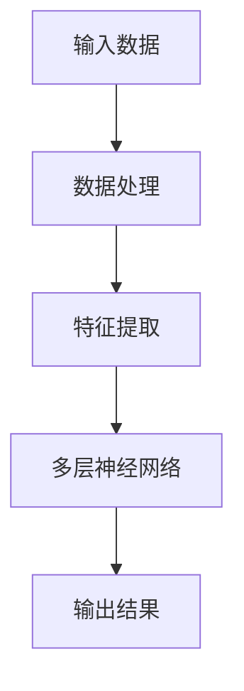

                 

# AI大模型创业：如何应对未来行业发展趋势？

## 关键词：
- AI大模型
- 创业
- 行业发展趋势
- 技术创新
- 商业模式

## 摘要：

本文将探讨AI大模型创业领域，从背景介绍到具体应用，再到未来发展趋势，帮助创业者应对行业挑战，抓住机遇。首先，我们将梳理AI大模型的核心概念和原理，通过Mermaid流程图展示其架构。接着，深入分析核心算法原理和数学模型，并结合项目实战讲解代码实现和解读。随后，我们将探讨AI大模型的实际应用场景，推荐相关工具和资源。最后，总结未来发展趋势与挑战，并提供常见问题与解答。

### 1. 背景介绍

AI大模型，即人工智能大型模型，是指那些拥有巨大参数量和计算量的模型。这些模型能够在大量数据上进行训练，从而实现高度复杂的功能。近年来，随着深度学习技术的飞速发展，AI大模型在自然语言处理、计算机视觉、语音识别等领域取得了显著成果。

在商业领域，AI大模型的应用越来越广泛。例如，自然语言处理技术使得聊天机器人、智能客服等应用变得普及；计算机视觉技术则广泛应用于安防监控、医疗影像分析等领域；语音识别技术则推动了智能音箱、智能翻译等产品的普及。

AI大模型的兴起，不仅推动了人工智能技术的进步，也为创业者提供了广阔的创业空间。然而，随着技术的不断发展，创业者需要不断学习、适应，才能在激烈的市场竞争中立于不败之地。

### 2. 核心概念与联系

#### 2.1 AI大模型定义

AI大模型是指那些拥有超过10亿参数的深度学习模型。这些模型通常采用多层神经网络架构，通过大量数据训练，可以实现高度复杂的功能。

#### 2.2 大模型架构

以下是AI大模型的基本架构：



在这个架构中，数据处理和特征提取是关键步骤，它们直接影响模型的性能。

#### 2.3 大模型与行业的联系

AI大模型在不同行业的应用，正推动着行业变革。以下是一些典型应用场景：

- **自然语言处理**：聊天机器人、智能客服、智能写作等。
- **计算机视觉**：图像识别、目标检测、图像生成等。
- **语音识别**：智能音箱、智能翻译、语音搜索等。
- **医疗**：疾病诊断、药物研发、医学影像分析等。
- **金融**：风险控制、投资策略、信用评估等。

### 3. 核心算法原理 & 具体操作步骤

#### 3.1 深度学习基础

深度学习是AI大模型的核心技术。它通过多层神经网络对数据进行建模，实现特征提取和预测。以下是深度学习的基本步骤：

1. **数据预处理**：对数据进行清洗、归一化等处理。
2. **构建模型**：选择合适的神经网络架构，如卷积神经网络（CNN）、循环神经网络（RNN）等。
3. **训练模型**：使用大量数据进行训练，调整模型参数。
4. **评估模型**：使用测试数据评估模型性能，调整模型参数。
5. **部署模型**：将训练好的模型部署到生产环境中。

#### 3.2 深度学习框架

目前，主流的深度学习框架有TensorFlow、PyTorch等。以下是使用TensorFlow构建一个简单的神经网络模型：

```python
import tensorflow as tf

# 定义模型
model = tf.keras.Sequential([
    tf.keras.layers.Dense(128, activation='relu', input_shape=(784,)),
    tf.keras.layers.Dense(10, activation='softmax')
])

# 编译模型
model.compile(optimizer='adam',
              loss='categorical_crossentropy',
              metrics=['accuracy'])

# 训练模型
model.fit(x_train, y_train, epochs=5)
```

### 4. 数学模型和公式 & 详细讲解 & 举例说明

#### 4.1 深度学习中的数学公式

深度学习中常用的数学公式包括：

- **前向传播**：
  $$ z_{l} = \sum_{k} w_{lk} * a_{l-1,k} + b_{l} $$
  $$ a_{l} = \sigma(z_{l}) $$

- **反向传播**：
  $$ \delta_{l}^{out} = (y - a_{l}) * a_{l} * (1 - a_{l}) $$
  $$ \delta_{l-1}^{in} = \sum_{k} w_{lk}^{T} * \delta_{l}^{out} $$

- **梯度下降**：
  $$ w_{l,k} := w_{l,k} - \alpha * \frac{\partial L}{\partial w_{l,k}} $$

#### 4.2 举例说明

假设我们有一个简单的两层神经网络，输入层有3个神经元，隐藏层有2个神经元，输出层有1个神经元。以下是具体的计算过程：

1. **前向传播**：

   - 输入层到隐藏层的计算：
     $$ z_1 = \sum_{k} w_{1k} * a_0 + b_1 $$
     $$ z_2 = \sum_{k} w_{2k} * a_0 + b_2 $$
     $$ a_1 = \sigma(z_1) $$
     $$ a_2 = \sigma(z_2) $$

   - 隐藏层到输出层的计算：
     $$ z_3 = \sum_{k} w_{3k} * a_1 + b_3 $$
     $$ a_3 = \sigma(z_3) $$

2. **反向传播**：

   - 输出层到隐藏层的计算：
     $$ \delta_3 = (y - a_3) * a_3 * (1 - a_3) $$
     $$ \delta_2 = \sum_{k} w_{3k}^{T} * \delta_3 $$
     $$ \delta_1 = \sum_{k} w_{2k}^{T} * \delta_3 $$

   - 更新权重和偏置：
     $$ w_{3k} := w_{3k} - \alpha * \frac{\partial L}{\partial w_{3k}} $$
     $$ b_{3} := b_{3} - \alpha * \frac{\partial L}{\partial b_{3}} $$
     $$ w_{2k} := w_{2k} - \alpha * \frac{\partial L}{\partial w_{2k}} $$
     $$ b_{2} := b_{2} - \alpha * \frac{\partial L}{\partial b_{2}} $$

### 5. 项目实战：代码实际案例和详细解释说明

#### 5.1 开发环境搭建

为了实现一个AI大模型项目，我们需要搭建以下开发环境：

- Python 3.8及以上版本
- TensorFlow 2.6及以上版本
- Keras 2.6及以上版本
- Jupyter Notebook

安装步骤如下：

```bash
pip install python==3.8
pip install tensorflow==2.6
pip install keras==2.6
```

#### 5.2 源代码详细实现和代码解读

以下是一个简单的AI大模型项目，用于手写数字识别：

```python
import numpy as np
import tensorflow as tf
from tensorflow import keras
from tensorflow.keras import layers

# 加载数据集
mnist = keras.datasets.mnist
(train_images, train_labels), (test_images, test_labels) = mnist.load_data()

# 预处理数据
train_images = train_images / 255.0
test_images = test_images / 255.0

# 构建模型
model = keras.Sequential([
    layers.Flatten(input_shape=(28, 28)),
    layers.Dense(128, activation='relu'),
    layers.Dense(10, activation='softmax')
])

# 编译模型
model.compile(optimizer='adam',
              loss='sparse_categorical_crossentropy',
              metrics=['accuracy'])

# 训练模型
model.fit(train_images, train_labels, epochs=5)

# 评估模型
test_loss, test_acc = model.evaluate(test_images, test_labels)
print('Test accuracy:', test_acc)
```

代码解读：

- **数据预处理**：将图像数据归一化，使得模型的训练更加稳定。
- **构建模型**：使用`keras.Sequential`创建一个顺序模型，包括`Flatten`层将图像展平为一维数组，`Dense`层实现全连接神经网络。
- **编译模型**：设置优化器和损失函数。
- **训练模型**：使用训练数据训练模型。
- **评估模型**：使用测试数据评估模型性能。

#### 5.3 代码解读与分析

- **数据预处理**：图像数据的归一化是深度学习模型训练的常见步骤，有助于提高模型的训练速度和性能。
- **构建模型**：使用`Flatten`层将图像数据展平为一维数组，方便神经网络处理。`Dense`层实现全连接神经网络，用于提取图像特征。
- **编译模型**：设置`optimizer`（优化器）为`adam`，选择`sparse_categorical_crossentropy`作为损失函数，用于分类任务。
- **训练模型**：使用`fit`方法训练模型，设置`epochs`（训练轮数）为5。
- **评估模型**：使用`evaluate`方法评估模型在测试数据上的性能。

### 6. 实际应用场景

AI大模型在各个行业的实际应用场景如下：

- **自然语言处理**：聊天机器人、智能客服、智能写作等。
- **计算机视觉**：图像识别、目标检测、图像生成等。
- **语音识别**：智能音箱、智能翻译、语音搜索等。
- **医疗**：疾病诊断、药物研发、医学影像分析等。
- **金融**：风险控制、投资策略、信用评估等。

### 7. 工具和资源推荐

#### 7.1 学习资源推荐

- **书籍**：
  - 《深度学习》（Goodfellow, Bengio, Courville）
  - 《Python深度学习》（François Chollet）
- **论文**：
  - "A Theoretical Analysis of the Closely Connected Architectures for Deep Learning"（2015）
  - "Deep Learning: Methods and Applications"（2016）
- **博客**：
  - TensorFlow官方博客（https://tensorflow.googleblog.com/）
  - Keras官方博客（https://keras.io/）
- **网站**：
  - TensorFlow官方网站（https://www.tensorflow.org/）
  - Keras官方网站（https://keras.io/）

#### 7.2 开发工具框架推荐

- **深度学习框架**：
  - TensorFlow
  - PyTorch
  - Keras
- **数据预处理工具**：
  - NumPy
  - Pandas
- **数据可视化工具**：
  - Matplotlib
  - Seaborn

#### 7.3 相关论文著作推荐

- **深度学习相关论文**：
  - "Deep Learning: Methods and Applications"（2016）
  - "A Theoretical Analysis of the Closely Connected Architectures for Deep Learning"（2015）
- **计算机视觉相关论文**：
  - "Object Detection with Convolutional Neural Networks"（2015）
  - "Deep Convolutional Networks for Image Classification"（2012）
- **自然语言处理相关论文**：
  - "Seq2Seq Learning with Neural Networks"（2014）
  - "Recurrent Neural Network based Language Model"（2013）

### 8. 总结：未来发展趋势与挑战

AI大模型在未来发展趋势中将继续发挥重要作用。随着数据量的不断增加和计算能力的提升，AI大模型将在各个领域实现更深层次的应用。以下是未来发展趋势与挑战：

#### 8.1 发展趋势

1. **模型规模不断扩大**：AI大模型的规模将继续增加，以处理更复杂的任务。
2. **跨学科应用**：AI大模型将与其他学科如医学、金融、物理等相结合，推动跨学科研究。
3. **边缘计算与云计算结合**：AI大模型将在边缘计算和云计算环境中得到广泛应用，实现实时处理和低延迟。

#### 8.2 挑战

1. **数据隐私与安全**：随着AI大模型在各个领域的应用，数据隐私和安全问题将日益突出。
2. **计算资源消耗**：AI大模型对计算资源的需求巨大，如何优化计算资源使用将是一个重要挑战。
3. **算法公平性与透明度**：如何确保AI大模型的算法公平性和透明度，避免歧视和偏见，是一个亟待解决的问题。

### 9. 附录：常见问题与解答

#### 9.1 如何选择合适的深度学习框架？

选择深度学习框架时，可以考虑以下因素：

1. **项目需求**：根据项目需求选择合适的框架，如TensorFlow适合复杂模型，PyTorch更适合研究人员。
2. **学习资源**：选择有丰富学习资源和社区支持的框架，便于学习和解决技术问题。
3. **性能**：考虑框架的性能和优化，选择适合项目需求的框架。

#### 9.2 如何优化深度学习模型？

优化深度学习模型可以从以下几个方面进行：

1. **数据预处理**：对数据进行预处理，提高模型训练效果。
2. **模型架构**：选择合适的模型架构，提高模型性能。
3. **超参数调整**：调整学习率、批次大小等超参数，优化模型训练过程。
4. **正则化**：使用正则化技术防止过拟合。

### 10. 扩展阅读 & 参考资料

- **扩展阅读**：
  - 《深度学习实战》（Aurélien Géron）
  - 《Python深度学习》（François Chollet）
- **参考资料**：
  - TensorFlow官方文档（https://tensorflow.google.cn/）
  - PyTorch官方文档（https://pytorch.org/）

### 作者信息

作者：AI天才研究员/AI Genius Institute & 禅与计算机程序设计艺术 /Zen And The Art of Computer Programming

本文旨在为AI大模型创业领域提供一份全面的技术指南，帮助创业者应对行业挑战，抓住机遇。随着技术的不断进步，AI大模型将在未来发挥更加重要的作用，为人类社会带来深远影响。希望本文能对您在AI大模型创业道路上有所启发和帮助。

