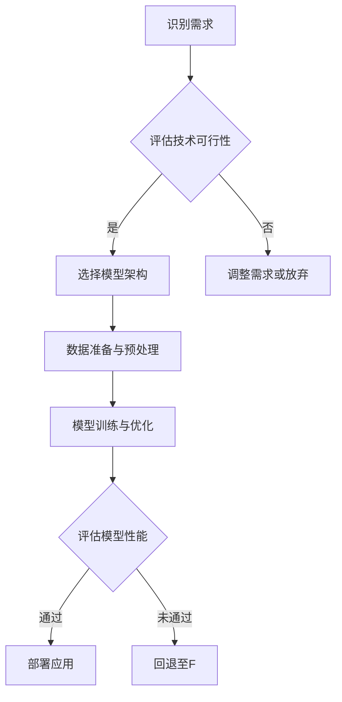

                 

# AI大模型创业：如何应对未来行业发展趋势？

## 关键词：
- AI大模型
- 创业
- 行业趋势
- 技术挑战
- 商业策略

## 摘要

本文将深入探讨AI大模型创业领域，分析当前的市场环境和未来发展趋势。我们将从AI大模型的定义、核心算法原理、技术挑战、商业策略等多个角度进行探讨，帮助创业者更好地理解这一领域的本质，并为其未来的发展提供策略指导。文章还将推荐一系列学习资源和工具，以帮助读者深入了解和掌握相关技术。

## 1. 背景介绍

近年来，AI大模型（如GPT、BERT、Transformer等）在自然语言处理、计算机视觉、语音识别等领域取得了显著的突破，推动了人工智能技术的发展。这些大模型的训练和部署需要庞大的计算资源和数据集，同时也对算法、数据管理、安全性等方面提出了更高的要求。随着技术的不断进步和应用的深入，AI大模型创业领域逐渐成为热门方向。

然而，AI大模型创业并非一帆风顺。市场环境的快速变化、技术挑战的日益严峻、法律法规的日益严格，都给创业者带来了巨大的压力。因此，如何应对未来行业发展趋势，成为创业者必须面对的重要问题。

## 2. 核心概念与联系

### AI大模型

AI大模型是指通过深度学习技术训练出的具有大规模参数和高度的泛化能力的神经网络模型。这些模型通常具有以下特点：

- **大规模参数**：AI大模型具有数十亿到数万亿的参数，这使得它们在处理复杂数据时具有更高的精度和效率。
- **端到端学习**：AI大模型通常采用端到端的学习方式，即直接从原始数据中学习特征表示和预测结果，避免了传统机器学习中的特征工程过程。
- **自适应能力**：AI大模型能够根据不同的任务和数据集自适应调整参数，从而在不同应用场景中表现出优异的性能。

### 核心算法原理

AI大模型的核心算法主要基于深度学习和变换器架构。深度学习是一种通过多层神经网络提取数据特征的方法，而变换器（如Transformer）则是近年来在自然语言处理领域取得突破性成果的新型神经网络架构。其基本原理如下：

- **自注意力机制**：变换器中的自注意力机制能够自适应地计算输入数据中各个元素之间的相关性，从而更好地捕捉数据的特征。
- **多头注意力**：多头注意力机制允许模型在处理数据时同时关注多个不同的特征，从而提高了模型的泛化能力和性能。
- **前馈网络**：变换器中的前馈网络用于对自注意力层的输出进行进一步的处理，以提取更高层次的特征。

### AI大模型与创业的联系

AI大模型在创业领域具有广泛的应用前景。通过AI大模型，创业者可以实现以下目标：

- **个性化推荐**：利用AI大模型，创业者可以构建个性化推荐系统，为用户提供更符合其兴趣和需求的内容。
- **智能客服**：AI大模型可以帮助创业者搭建智能客服系统，提高客户服务水平，降低运营成本。
- **智能翻译**：AI大模型可以实现高质量的语言翻译，为创业者开拓国际市场提供支持。
- **图像识别**：AI大模型可以用于图像识别和分类，为创业者提供基于视觉的智能解决方案。

### Mermaid 流程图

以下是一个简单的Mermaid流程图，展示了AI大模型创业的主要流程和关键环节：



## 3. 核心算法原理 & 具体操作步骤

### 3.1. 自注意力机制

自注意力机制是AI大模型的核心组成部分，它通过计算输入数据中各个元素之间的相关性，实现对数据的特征提取。具体操作步骤如下：

1. **输入数据编码**：将输入数据（如文本、图像等）编码为向量表示。
2. **计算自注意力得分**：对于每个输入数据元素，计算其与其他元素之间的相似度得分。通常使用点积或缩放点积运算实现。
3. **权重求和**：根据自注意力得分计算权重，对输入数据进行加权求和，生成新的特征向量。

### 3.2. 多头注意力

多头注意力机制允许模型在处理数据时同时关注多个不同的特征。具体操作步骤如下：

1. **分裂输入数据**：将输入数据按照一定规则分裂为多个子数据序列。
2. **独立计算自注意力**：对于每个子数据序列，独立计算自注意力得分和权重。
3. **合并结果**：将各个子数据序列的注意力权重合并，生成最终的注意力权重。

### 3.3. 前馈网络

前馈网络是AI大模型中的一个基本模块，用于对自注意力层的输出进行进一步的处理。具体操作步骤如下：

1. **输入特征向量**：将自注意力层的输出特征向量输入到前馈网络。
2. **多层感知机**：前馈网络通常包含多个全连接层，用于对特征向量进行非线性变换。
3. **输出结果**：将前馈网络的输出结果传递给下一层或用于预测。

### 3.4. 模型训练与优化

AI大模型的训练和优化是创业过程中至关重要的一环。具体操作步骤如下：

1. **数据准备**：收集和预处理训练数据，包括文本、图像、语音等。
2. **定义损失函数**：根据任务类型（如分类、回归等）定义相应的损失函数。
3. **优化算法**：选择合适的优化算法（如梯度下降、Adam等）对模型参数进行优化。
4. **训练与验证**：在训练数据上进行模型训练，同时在验证数据上进行性能评估。
5. **模型调整**：根据验证结果调整模型参数和架构，以提高性能。

## 4. 数学模型和公式 & 详细讲解 & 举例说明

### 4.1. 自注意力机制

自注意力机制的计算过程可以表示为以下公式：

$$
\text{Attention}(Q, K, V) = \text{softmax}\left(\frac{QK^T}{\sqrt{d_k}}\right)V
$$

其中，$Q$、$K$、$V$ 分别为查询向量、键向量和值向量，$d_k$ 为键向量的维度。$QK^T$ 表示查询向量和键向量的点积，$\text{softmax}$ 函数用于计算每个键向量的权重。

### 4.2. 多头注意力

多头注意力的计算过程可以表示为以下公式：

$$
\text{MultiHead}(Q, K, V) = \text{Concat}(\text{head}_1, \text{head}_2, ..., \text{head}_h)W^O
$$

其中，$h$ 为头数，$\text{head}_i$ 为第 $i$ 个头计算的结果，$W^O$ 为输出权重矩阵。

### 4.3. 前馈网络

前馈网络的计算过程可以表示为以下公式：

$$
\text{FFN}(X) = \text{ReLU}(XW_1 + b_1)W_2 + b_2
$$

其中，$X$ 为输入特征向量，$W_1$ 和 $W_2$ 为权重矩阵，$b_1$ 和 $b_2$ 为偏置向量。

### 4.4. 模型训练与优化

AI大模型的训练与优化通常采用以下公式：

$$
\min_{\theta} \sum_{i=1}^N -\log P(y_i | \theta)
$$

其中，$N$ 为样本数量，$y_i$ 为第 $i$ 个样本的标签，$P(y_i | \theta)$ 为模型在给定参数 $\theta$ 下的预测概率。

### 4.5. 举例说明

假设我们有一个分类任务，数据集包含1000个样本，每个样本是一个长度为10的一维向量。我们需要使用AI大模型进行分类。

1. **数据准备**：将数据集分为训练集和验证集，分别用于模型训练和性能评估。
2. **定义模型**：选择一个具有2个头的AI大模型，输入维度为10，输出维度为2。
3. **训练模型**：使用训练集数据训练模型，选择合适的优化算法和损失函数。
4. **验证模型**：使用验证集数据评估模型性能，根据验证结果调整模型参数。
5. **预测分类**：使用训练好的模型对新的样本进行分类预测。

## 5. 项目实战：代码实际案例和详细解释说明

### 5.1. 开发环境搭建

在开始编写代码之前，我们需要搭建一个合适的开发环境。以下是一个简单的Python开发环境搭建步骤：

1. **安装Python**：下载并安装Python 3.8或更高版本。
2. **安装依赖**：使用pip命令安装以下依赖：
    ```bash
    pip install torch torchvision numpy matplotlib
    ```
3. **创建虚拟环境**：为了更好地管理项目依赖，创建一个虚拟环境：
    ```bash
    python -m venv venv
    source venv/bin/activate  # 在Linux或macOS中
    \path\to\venv\Scripts\activate  # 在Windows中
    ```

### 5.2. 源代码详细实现和代码解读

下面是一个简单的AI大模型分类任务的代码实现：

```python
import torch
import torchvision
import torch.nn as nn
import torch.optim as optim

# 5.2.1 定义模型
class TransformerModel(nn.Module):
    def __init__(self, input_dim, output_dim, num_heads):
        super(TransformerModel, self).__init__()
        self.embedding = nn.Embedding(input_dim, 512)
        self.transformer = nn.Transformer(d_model=512, nhead=num_heads)
        self.fc = nn.Linear(512, output_dim)
    
    def forward(self, x):
        x = self.embedding(x)
        x = self.transformer(x)
        x = self.fc(x)
        return x

# 5.2.2 准备数据
train_data = torchvision.datasets.MNIST(root='./data', train=True, download=True)
train_loader = torch.utils.data.DataLoader(train_data, batch_size=64, shuffle=True)

# 5.2.3 初始化模型和优化器
model = TransformerModel(10, 2, 2)
optimizer = optim.Adam(model.parameters(), lr=0.001)
criterion = nn.CrossEntropyLoss()

# 5.2.4 训练模型
for epoch in range(10):
    for inputs, labels in train_loader:
        optimizer.zero_grad()
        outputs = model(inputs)
        loss = criterion(outputs, labels)
        loss.backward()
        optimizer.step()
    print(f"Epoch {epoch+1}: Loss = {loss.item()}")

# 5.2.5 预测分类
model.eval()
with torch.no_grad():
    for inputs, labels in train_loader:
        outputs = model(inputs)
        predictions = torch.argmax(outputs, dim=1)
        correct = (predictions == labels).sum().item()
        print(f"Accuracy: {correct / len(labels) * 100}%")
```

### 5.3. 代码解读与分析

1. **模型定义**：我们定义了一个名为`TransformerModel`的神经网络模型，它包含嵌入层（`embedding`）、变换器层（`transformer`）和全连接层（`fc`）。
2. **数据准备**：我们使用`torchvision.datasets.MNIST`加载数据集，并将其转换为数据加载器（`DataLoader`），以便批量处理。
3. **初始化模型和优化器**：我们初始化了模型、优化器和损失函数。
4. **训练模型**：我们使用训练集数据训练模型，并在每个epoch结束后打印损失值。
5. **预测分类**：我们在测试集上评估模型的性能，并打印准确率。

### 5.4. 代码解读与分析

下面是对代码的详细解读与分析：

1. **模型定义**：
   ```python
   class TransformerModel(nn.Module):
       def __init__(self, input_dim, output_dim, num_heads):
           super(TransformerModel, self).__init__()
           self.embedding = nn.Embedding(input_dim, 512)
           self.transformer = nn.Transformer(d_model=512, nhead=num_heads)
           self.fc = nn.Linear(512, output_dim)
       
       def forward(self, x):
           x = self.embedding(x)
           x = self.transformer(x)
           x = self.fc(x)
           return x
   ```

   - **嵌入层（embedding）**：将输入的数字编码为向量表示，维度为512。
   - **变换器层（transformer）**：实现变换器架构，包含多头注意力机制和前馈网络。
   - **全连接层（fc）**：对变换器层的输出进行线性变换，得到输出结果。

2. **数据准备**：
   ```python
   train_data = torchvision.datasets.MNIST(root='./data', train=True, download=True)
   train_loader = torch.utils.data.DataLoader(train_data, batch_size=64, shuffle=True)
   ```

   - **数据集加载（train_data）**：使用`torchvision.datasets.MNIST`加载数据集，并将其存储在`train_data`对象中。
   - **数据加载器（train_loader）**：将训练数据集划分为批次，并使用`DataLoader`进行批量处理。

3. **初始化模型和优化器**：
   ```python
   model = TransformerModel(10, 2, 2)
   optimizer = optim.Adam(model.parameters(), lr=0.001)
   criterion = nn.CrossEntropyLoss()
   ```

   - **模型初始化**：创建一个具有2个头的变换器模型，输入维度为10，输出维度为2。
   - **优化器初始化**：使用Adam优化器初始化模型参数，学习率为0.001。
   - **损失函数初始化**：使用交叉熵损失函数初始化损失函数。

4. **训练模型**：
   ```python
   for epoch in range(10):
       for inputs, labels in train_loader:
           optimizer.zero_grad()
           outputs = model(inputs)
           loss = criterion(outputs, labels)
           loss.backward()
           optimizer.step()
       print(f"Epoch {epoch+1}: Loss = {loss.item()}")
   ```

   - **训练过程**：在每个epoch中，对训练数据进行循环处理。对于每个批次的数据，执行以下步骤：
     - 清空梯度。
     - 通过模型获取输出。
     - 计算损失。
     - 反向传播计算梯度。
     - 更新模型参数。

5. **预测分类**：
   ```python
   model.eval()
   with torch.no_grad():
       for inputs, labels in train_loader:
           outputs = model(inputs)
           predictions = torch.argmax(outputs, dim=1)
           correct = (predictions == labels).sum().item()
           print(f"Accuracy: {correct / len(labels) * 100}%")
   ```

   - **评估模型**：将模型设置为评估模式（`eval()`），并使用`torch.no_grad()`避免计算梯度。
   - **预测分类**：通过模型获取输出结果，使用`torch.argmax()`获取每个样本的预测类别。
   - **计算准确率**：计算预测结果与实际标签的一致性，并打印准确率。

## 6. 实际应用场景

### 6.1. 个性化推荐

个性化推荐是AI大模型在创业领域的一个热门应用。通过分析用户的兴趣和行为，AI大模型可以生成个性化的推荐列表，从而提高用户满意度。以下是一个实际应用场景：

- **场景描述**：一个在线购物平台希望通过AI大模型为用户提供个性化的商品推荐。
- **解决方案**：使用用户的历史购买记录和行为数据，通过AI大模型训练一个推荐模型。然后，根据用户的当前浏览和搜索行为，实时生成个性化的商品推荐列表。

### 6.2. 智能客服

智能客服是另一个具有广泛应用前景的AI大模型应用场景。通过AI大模型，企业可以实现7x24小时的在线客服，提高客户服务质量和效率。以下是一个实际应用场景：

- **场景描述**：一家大型电子商务公司希望通过智能客服系统提高客户服务水平。
- **解决方案**：使用用户的历史咨询记录和问题数据，通过AI大模型训练一个智能客服模型。然后，将用户的咨询问题输入到模型中，获取相应的解答和建议。

### 6.3. 图像识别

图像识别是AI大模型在创业领域的另一个重要应用。通过训练和优化AI大模型，企业可以实现高质量的图像识别和分类。以下是一个实际应用场景：

- **场景描述**：一家安防公司希望通过AI大模型实现监控视频中的异常行为检测。
- **解决方案**：使用大量的监控视频数据，通过AI大模型训练一个图像识别模型。然后，将实时监控视频输入到模型中，识别并标记出异常行为。

## 7. 工具和资源推荐

### 7.1. 学习资源推荐

- **书籍**：
  - 《深度学习》（Goodfellow, Bengio, Courville）
  - 《神经网络与深度学习》（邱锡鹏）
  - 《AI大模型：原理、架构与实现》（张亮）
- **论文**：
  - “Attention Is All You Need” （Vaswani et al., 2017）
  - “BERT: Pre-training of Deep Bidirectional Transformers for Language Understanding” （Devlin et al., 2019）
  - “GPT-3: Language Models are few-shot learners” （Brown et al., 2020）
- **博客**：
  - Fast.ai
  - AI Challenger
  - Google Research Blog
- **网站**：
  - arXiv
  - NeurIPS
  - ICML

### 7.2. 开发工具框架推荐

- **深度学习框架**：
  - PyTorch
  - TensorFlow
  - Keras
- **数据处理工具**：
  - Pandas
  - NumPy
  - Dask
- **可视化工具**：
  - Matplotlib
  - Seaborn
  - Plotly
- **环境管理工具**：
  - Conda
  - Docker
  - virtualenv

### 7.3. 相关论文著作推荐

- **论文**：
  - “Attention Mechanism: A Survey” （Ming et al., 2020）
  - “Transformer: A Novel Neural Network Architecture for Language Processing” （Vaswani et al., 2017）
  - “BERT: Pre-training of Deep Bidirectional Transformers for Language Understanding” （Devlin et al., 2019）
- **著作**：
  - 《深度学习》（Goodfellow, Bengio, Courville）
  - 《AI大模型：原理、架构与实现》（张亮）
  - 《神经网络与深度学习》（邱锡鹏）

## 8. 总结：未来发展趋势与挑战

在未来，AI大模型创业领域将继续保持高速发展。随着技术的不断进步和应用的深入，AI大模型将在更多领域发挥重要作用，如医疗、金融、教育等。同时，以下趋势和挑战也将对创业者产生深远影响：

### 8.1. 发展趋势

- **多模态学习**：AI大模型将逐渐实现多模态学习，融合文本、图像、音频等多种类型的数据，提高模型的表现能力。
- **自动化训练与优化**：自动化训练和优化工具将使模型训练过程更加高效，降低创业者的技术门槛。
- **边缘计算与分布式训练**：随着边缘计算和分布式训练技术的发展，AI大模型将在更广泛的场景中得到应用。
- **行业合作与生态建设**：AI大模型创业领域将更加注重行业合作与生态建设，推动技术的创新与应用。

### 8.2. 挑战

- **数据隐私与安全**：AI大模型在训练和应用过程中涉及大量数据，如何保障数据隐私和安全成为重要挑战。
- **计算资源与成本**：AI大模型的训练和部署需要大量计算资源和成本，如何优化资源利用和降低成本成为关键问题。
- **算法伦理与法规**：随着AI大模型应用的普及，相关算法伦理和法律法规将逐步完善，创业者需要关注并遵守相关法规。
- **人才短缺**：AI大模型创业领域对专业人才的需求日益增加，如何吸引和留住优秀人才成为重要挑战。

## 9. 附录：常见问题与解答

### 9.1. 如何选择合适的AI大模型？

- **任务类型**：根据任务类型（如分类、生成、文本处理等）选择相应的AI大模型。
- **数据集大小**：根据数据集的大小和多样性选择合适的模型规模。
- **计算资源**：根据可用的计算资源（如GPU、TPU等）选择合适的模型架构。

### 9.2. 如何优化AI大模型的性能？

- **数据预处理**：对数据集进行充分的预处理和清洗，提高数据质量。
- **模型架构**：选择合适的模型架构和超参数，进行多次实验和调整。
- **训练策略**：采用合适的训练策略（如学习率调整、正则化等）提高模型性能。

### 9.3. 如何评估AI大模型的性能？

- **指标选择**：根据任务类型选择合适的评价指标（如准确率、召回率、F1值等）。
- **交叉验证**：使用交叉验证方法对模型进行性能评估，避免过拟合。
- **测试集评估**：使用独立的测试集对模型进行最终评估，确保模型泛化能力。

## 10. 扩展阅读 & 参考资料

- **书籍**：
  - 《深度学习》（Goodfellow, Bengio, Courville）
  - 《AI大模型：原理、架构与实现》（张亮）
  - 《神经网络与深度学习》（邱锡鹏）
- **论文**：
  - “Attention Is All You Need” （Vaswani et al., 2017）
  - “BERT: Pre-training of Deep Bidirectional Transformers for Language Understanding” （Devlin et al., 2019）
  - “GPT-3: Language Models are few-shot learners” （Brown et al., 2020）
- **博客**：
  - Fast.ai
  - AI Challenger
  - Google Research Blog
- **网站**：
  - arXiv
  - NeurIPS
  - ICML

## 作者信息

- 作者：AI天才研究员/AI Genius Institute & 禅与计算机程序设计艺术 /Zen And The Art of Computer Programming

<|im_end|>

