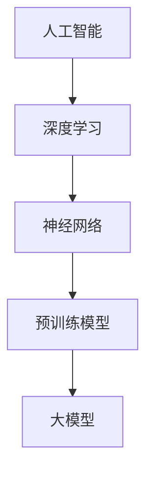

                 

## 1. 背景介绍

随着人工智能技术的飞速发展，AI大模型逐渐成为科技领域的明星。这些大型神经网络模型，凭借其强大的计算能力和深度学习能力，在语音识别、图像处理、自然语言处理等领域取得了惊人的成果。而如何将AI大模型应用到实际业务场景，打造出具有市场竞争力、用户粘性的产品，成为许多创业者和技术专家关注的话题。

本文将以《AI大模型创业：如何打造未来爆款应用？》为题，深入探讨AI大模型在创业中的应用，分析其核心概念、算法原理、数学模型，并通过实际项目案例，展示如何利用AI大模型打造未来爆款应用。

### 1.1 AI大模型的崛起

AI大模型的出现并非偶然，而是技术积累和需求驱动共同作用的结果。首先，计算能力的提升为AI大模型的发展提供了强有力的支持。随着摩尔定律的延续，计算机硬件性能不断提高，使得训练和推理大模型成为可能。

其次，大数据的普及为AI大模型提供了丰富的训练数据。大量的数据为模型的训练提供了素材，使得模型可以更加精确地拟合现实世界。

最后，深度学习算法的创新为AI大模型的发展注入了新的活力。以GPT-3、BERT为代表的预训练模型，通过在大规模数据集上进行预训练，取得了惊人的效果，推动了AI大模型的崛起。

### 1.2 AI大模型的应用场景

AI大模型的应用场景非常广泛，主要包括以下几个方面：

- **自然语言处理**：如文本分类、情感分析、机器翻译等。
- **计算机视觉**：如图像分类、目标检测、图像生成等。
- **语音识别**：如语音合成、语音识别、语音翻译等。
- **推荐系统**：如个性化推荐、广告投放、用户行为分析等。

这些应用场景为创业者提供了丰富的机会，如何在竞争中脱颖而出，打造出用户喜爱的产品，成为关键所在。

### 1.3 创业的挑战与机遇

创业过程中，利用AI大模型面临诸多挑战：

- **技术门槛**：AI大模型的技术门槛较高，需要创业者具备深厚的计算机科学和人工智能背景。
- **计算资源**：大模型训练和推理需要大量的计算资源，对硬件设备要求较高。
- **数据隐私**：数据安全和隐私保护是AI应用中不可忽视的问题。

然而，挑战背后也蕴藏着巨大的机遇：

- **市场前景**：AI大模型的应用场景广泛，市场需求庞大。
- **技术创新**：随着技术的不断进步，AI大模型的应用领域和效果将不断拓展。
- **竞争优势**：掌握AI大模型技术的公司，将在市场竞争中占据有利地位。

综上所述，AI大模型创业既有挑战，也充满机遇。接下来，我们将进一步探讨AI大模型的核心概念、算法原理和实际应用，帮助读者了解如何利用AI大模型打造未来爆款应用。

## 2. 核心概念与联系

在深入探讨AI大模型之前，我们需要明确几个核心概念，并了解它们之间的联系。以下是几个关键概念及其简短介绍：

### 2.1 人工智能（AI）

人工智能（AI）是指使计算机系统能够模拟、延伸和扩展人类智能的技术和学科。AI可以分为两大类：弱AI和强AI。弱AI是指特定任务的人工智能，如语音识别、图像识别等；强AI则是指具有全面人类智能的人工智能，目前尚未实现。

### 2.2 深度学习（Deep Learning）

深度学习是人工智能的一个重要分支，基于多层神经网络进行学习。深度学习模型通过学习大量数据，能够自动提取特征并进行预测。深度学习在图像识别、自然语言处理等领域取得了显著成果。

### 2.3 神经网络（Neural Networks）

神经网络是深度学习的基础，由大量模拟人脑神经元功能的计算节点组成。通过调整这些节点的权重，神经网络能够学习和预测。

### 2.4 预训练模型（Pre-trained Models）

预训练模型是指在大规模数据集上预先训练好的模型，如BERT、GPT等。预训练模型通过在特定任务上进行微调，能够快速适应新的任务，提高性能。

### 2.5 大模型（Large Models）

大模型是指具有数亿甚至数十亿参数的神经网络模型。大模型通常通过大规模数据集进行训练，具有强大的拟合能力和泛化能力。

### 2.6 关联图

为了更好地理解这些概念之间的联系，我们可以使用Mermaid绘制一个关联图：



在图中，人工智能是整个体系的起点，深度学习是人工智能的一个重要分支，神经网络是深度学习的基础，预训练模型和大型模型则是在神经网络基础上进一步发展的产物。

### 2.7 关键概念应用举例

- **自然语言处理**：预训练模型BERT在自然语言处理领域取得了突破性进展，广泛应用于文本分类、情感分析、机器翻译等任务。
- **计算机视觉**：大模型ResNet在图像分类、目标检测等领域表现出色，已成为计算机视觉领域的标杆。
- **语音识别**：预训练模型WaveNet在语音合成任务中表现出色，被广泛应用于智能语音助手、语音识别等应用。

通过上述核心概念及其关联图的介绍，我们可以更好地理解AI大模型的基本构成和作用。接下来，我们将进一步探讨AI大模型的核心算法原理和具体操作步骤。

## 3. 核心算法原理 & 具体操作步骤

AI大模型的成功离不开其核心算法原理。在本节中，我们将详细探讨AI大模型的核心算法原理，包括深度学习、神经网络、预训练模型等，并介绍具体的操作步骤。

### 3.1 深度学习

深度学习是AI大模型的核心技术之一。它通过构建多层神经网络，使计算机能够自动学习复杂特征，从而实现预测和分类。以下是深度学习的核心原理：

- **前向传播**：输入数据通过神经网络的前向传播过程，逐层传递到输出层，得到预测结果。
- **反向传播**：利用预测结果与实际结果之间的误差，通过反向传播算法更新神经网络权重，使预测结果更接近实际值。
- **激活函数**：激活函数用于引入非线性因素，使神经网络能够学习复杂特征。常见的激活函数包括ReLU、Sigmoid和Tanh等。

### 3.2 神经网络

神经网络是深度学习的基础。一个神经网络由多个层组成，包括输入层、隐藏层和输出层。以下是神经网络的核心结构：

- **输入层**：接收输入数据，并将其传递给隐藏层。
- **隐藏层**：通过前向传播和反向传播算法，学习输入数据的特征。
- **输出层**：产生预测结果。

### 3.3 预训练模型

预训练模型是通过在大规模数据集上预先训练好的模型，如BERT、GPT等。预训练模型具有强大的拟合能力和泛化能力，可以在特定任务上进行微调，从而提高性能。以下是预训练模型的关键步骤：

- **预训练**：在大规模数据集上进行预训练，学习通用特征。
- **微调**：在特定任务上进行微调，使模型适应特定任务。

### 3.4 具体操作步骤

以下是利用AI大模型进行特定任务的一般操作步骤：

1. **数据收集与预处理**：
   - 收集与任务相关的数据集。
   - 对数据进行清洗、归一化和预处理。

2. **模型构建**：
   - 设计神经网络结构，包括输入层、隐藏层和输出层。
   - 选择合适的激活函数和优化器。

3. **预训练**：
   - 在大规模数据集上进行预训练，学习通用特征。

4. **微调**：
   - 在特定任务的数据集上进行微调，使模型适应特定任务。

5. **评估与优化**：
   - 在测试集上评估模型性能。
   - 调整模型参数，优化性能。

6. **应用部署**：
   - 将模型部署到生产环境，提供实时服务。

### 3.5 实例分析

以一个文本分类任务为例，我们可以使用BERT模型进行预训练和微调。以下是具体步骤：

1. **数据收集与预处理**：
   - 收集与文本分类相关的数据集，如新闻分类数据集。
   - 对数据进行清洗、归一化和预处理。

2. **模型构建**：
   - 设计BERT模型，包括输入层、隐藏层和输出层。
   - 选择合适的激活函数和优化器。

3. **预训练**：
   - 在大规模数据集上进行预训练，学习通用特征。

4. **微调**：
   - 在特定任务的新闻分类数据集上进行微调，使模型适应特定任务。

5. **评估与优化**：
   - 在测试集上评估模型性能。
   - 调整模型参数，优化性能。

6. **应用部署**：
   - 将模型部署到生产环境，提供实时服务。

通过上述步骤，我们可以利用AI大模型进行文本分类任务，从而实现高效的分类效果。

综上所述，AI大模型的核心算法原理包括深度学习、神经网络和预训练模型。通过具体的操作步骤，我们可以将AI大模型应用于各种任务，实现高效的预测和分类效果。接下来，我们将进一步探讨AI大模型的数学模型和公式。

## 4. 数学模型和公式 & 详细讲解 & 举例说明

AI大模型的训练和推理过程涉及到一系列复杂的数学模型和公式。在本节中，我们将详细讲解这些数学模型和公式，并通过具体例子来说明其应用和计算过程。

### 4.1 深度学习中的损失函数

在深度学习中，损失函数用于衡量预测结果与实际结果之间的差异。常见的损失函数包括均方误差（MSE）、交叉熵损失（Cross-Entropy Loss）等。

- **均方误差（MSE）**：
  均方误差是回归任务中常用的损失函数，计算预测值与实际值之间的平均平方误差。
  $$\text{MSE} = \frac{1}{n}\sum_{i=1}^{n}(y_i - \hat{y}_i)^2$$
  其中，\(y_i\)是实际值，\(\hat{y}_i\)是预测值，\(n\)是样本数量。

- **交叉熵损失（Cross-Entropy Loss）**：
  交叉熵损失是分类任务中常用的损失函数，计算预测概率分布与实际概率分布之间的差异。
  $$\text{Cross-Entropy Loss} = -\sum_{i=1}^{n}y_i \log(\hat{y}_i)$$
  其中，\(y_i\)是实际标签，\(\hat{y}_i\)是预测概率。

### 4.2 反向传播算法

反向传播算法是深度学习训练过程中用于更新模型参数的关键算法。其基本原理是计算梯度，通过梯度下降法更新参数，使损失函数最小。

- **梯度计算**：
  梯度是损失函数关于模型参数的偏导数，用于衡量参数对损失函数的影响。
  对于一个多层神经网络，梯度可以通过链式法则计算。
  $$\nabla_{\theta} J(\theta) = \frac{\partial J}{\partial \theta} = \frac{\partial L}{\partial z^{(l)}} \frac{\partial z^{(l)}}{\partial \theta}$$
  其中，\(J(\theta)\)是损失函数，\(L\)是输出层的损失，\(z^{(l)}\)是第\(l\)层的输出，\(\theta\)是模型参数。

- **梯度下降法**：
  梯度下降法是一种优化算法，通过更新参数，使损失函数逐渐减小。
  $$\theta = \theta - \alpha \nabla_{\theta} J(\theta)$$
  其中，\(\alpha\)是学习率，用于控制参数更新的幅度。

### 4.3 激活函数

激活函数是神经网络中的关键组件，用于引入非线性因素。常见的激活函数包括ReLU、Sigmoid和Tanh等。

- **ReLU（Rectified Linear Unit）**：
 ReLU函数是一种简单的线性激活函数，计算过程如下：
  $$f(x) = \max(0, x)$$
  RReLU函数是ReLU的变种，引入了随机性：
  $$f(x) = \max(0, a \cdot x + b)$$
  其中，\(a\)和\(b\)是随机变量。

- **Sigmoid函数**：
  Sigmoid函数是一种S形曲线，用于将输入映射到\[0, 1\]区间内。
  $$f(x) = \frac{1}{1 + e^{-x}}$$
  Sigmoid函数在二分类任务中应用广泛，可以将输入映射到概率值。

- **Tanh函数**：
  Tanh函数是Sigmoid函数的变种，将输入映射到\[-1, 1\]区间内。
  $$f(x) = \frac{e^x - e^{-x}}{e^x + e^{-x}}$$
  Tanh函数在深度学习中常用于隐藏层。

### 4.4 举例说明

假设我们有一个简单的神经网络，用于对输入数据进行分类。网络结构如下：

1. 输入层（1个节点）：\(x\)
2. 隐藏层（1个节点）：\(h\)
3. 输出层（1个节点）：\(y\)

激活函数：\(h\)层使用ReLU函数，输出层使用Sigmoid函数。

给定训练数据集，通过反向传播算法和梯度下降法更新模型参数。

1. **前向传播**：
   - 输入数据：\(x\)
   - 隐藏层输出：\(h = \max(0, w_1 \cdot x + b_1)\)
   - 输出层输出：\(y = \frac{1}{1 + e^{-(w_2 \cdot h + b_2)})\)

2. **反向传播**：
   - 计算损失函数：\(J = -\sum_{i=1}^{n}y_i \log(y_i)\)
   - 计算梯度：\(\nabla_w J = \frac{\partial J}{\partial w}\)
   - 更新参数：\(w = w - \alpha \nabla_w J\)

通过以上过程，我们可以利用数学模型和公式训练神经网络，实现对输入数据的分类。

综上所述，深度学习中的数学模型和公式包括损失函数、反向传播算法和激活函数。通过具体例子，我们可以了解这些模型和公式的应用和计算过程。接下来，我们将进一步探讨AI大模型的项目实战，展示如何利用AI大模型进行实际项目开发。

## 5. 项目实战：代码实际案例和详细解释说明

在本节中，我们将通过一个具体的项目实战案例，详细展示如何利用AI大模型进行实际项目开发。我们将从开发环境搭建、源代码实现和代码解读等方面，深入探讨如何打造一个具有实际应用价值的AI大模型应用。

### 5.1 开发环境搭建

在进行AI大模型项目开发之前，我们需要搭建一个合适的开发环境。以下是所需的工具和库：

- **Python**：Python是一种广泛使用的编程语言，适用于AI开发。
- **TensorFlow**：TensorFlow是Google开发的深度学习框架，支持各种深度学习模型的训练和推理。
- **PyTorch**：PyTorch是Facebook开发的开源深度学习框架，具有灵活的动态计算图支持。
- **GPU**：由于AI大模型训练和推理需要大量的计算资源，因此推荐使用配备GPU的计算机或服务器。

以下是搭建开发环境的步骤：

1. 安装Python：
   ```shell
   # 使用Python官方安装器
   python -m pip install --user python
   ```

2. 安装TensorFlow：
   ```shell
   # 使用pip安装TensorFlow
   python -m pip install --user tensorflow
   ```

3. 安装PyTorch：
   ```shell
   # 使用pip安装PyTorch
   python -m pip install --user torch torchvision torchaudio
   ```

4. 验证安装：
   ```python
   import tensorflow as tf
   import torch

   print(tf.__version__)
   print(torch.__version__)
   ```

### 5.2 源代码详细实现和代码解读

以下是一个简单的文本分类项目的源代码示例，我们将使用TensorFlow和PyTorch实现。项目目标是对新闻文章进行分类，判断其属于哪个主题类别。

#### TensorFlow实现

```python
import tensorflow as tf
from tensorflow.keras.preprocessing.text import Tokenizer
from tensorflow.keras.preprocessing.sequence import pad_sequences

# 数据预处理
train_texts = ["This is a news article about sports.", "This is a news article about politics.", ...]
train_labels = [0, 1, ...]

tokenizer = Tokenizer()
tokenizer.fit_on_texts(train_texts)
train_sequences = tokenizer.texts_to_sequences(train_texts)
train_padded = pad_sequences(train_sequences, maxlen=100, padding='post')

# 构建模型
model = tf.keras.Sequential([
    tf.keras.layers.Embedding(input_dim=len(tokenizer.word_index) + 1, output_dim=16),
    tf.keras.layers.Bidirectional(tf.keras.layers.LSTM(64)),
    tf.keras.layers.Dense(1, activation='sigmoid')
])

# 编译模型
model.compile(optimizer='adam', loss='binary_crossentropy', metrics=['accuracy'])

# 训练模型
model.fit(train_padded, train_labels, epochs=10, batch_size=32)
```

代码解读：

1. **数据预处理**：使用Tokenizer将文本转换为序列，使用pad_sequences将序列补全到相同长度。
2. **构建模型**：使用Embedding层进行词嵌入，使用Bidirectional LSTM层进行双向序列编码，使用Dense层进行分类。
3. **编译模型**：设置优化器和损失函数。
4. **训练模型**：使用fit方法进行模型训练。

#### PyTorch实现

```python
import torch
import torch.nn as nn
from torch.utils.data import DataLoader, TensorDataset

# 数据预处理
train_texts = ["This is a news article about sports.", "This is a news article about politics.", ...]
train_labels = torch.tensor([0, 1, ...])

tokenizer = Tokenizer()
tokenizer.fit_on_texts(train_texts)
train_sequences = tokenizer.texts_to_sequences(train_texts)
train_padded = pad_sequences(train_sequences, maxlen=100, padding='post')

# 构建模型
class TextClassifier(nn.Module):
    def __init__(self):
        super(TextClassifier, self).__init__()
        self.embedding = nn.Embedding(len(tokenizer.word_index) + 1, 16)
        self.lstm = nn.LSTM(16, 64, bidirectional=True)
        self.fc = nn.Linear(64, 1)

    def forward(self, x):
        x = self.embedding(x)
        x, _ = self.lstm(x)
        x = self.fc(x[:, -1, :])
        return x

model = TextClassifier()

# 编译模型
optimizer = torch.optim.Adam(model.parameters(), lr=0.001)
criterion = nn.BCEWithLogitsLoss()

# 训练模型
for epoch in range(10):
    for inputs, labels in DataLoader(train_padded, batch_size=32):
        optimizer.zero_grad()
        outputs = model(inputs)
        loss = criterion(outputs, labels.unsqueeze(1))
        loss.backward()
        optimizer.step()

    print(f'Epoch {epoch+1}, Loss: {loss.item()}')
```

代码解读：

1. **数据预处理**：与TensorFlow实现相同，使用Tokenizer将文本转换为序列，使用pad_sequences将序列补全到相同长度。
2. **构建模型**：定义一个TextClassifier类，使用Embedding层进行词嵌入，使用Bidirectional LSTM层进行双向序列编码，使用Dense层进行分类。
3. **编译模型**：设置优化器和损失函数。
4. **训练模型**：使用for循环进行模型训练。

### 5.3 代码解读与分析

以上代码展示了如何使用TensorFlow和PyTorch实现一个简单的文本分类项目。以下是关键步骤的详细解读：

1. **数据预处理**：
   - 使用Tokenizer将文本转换为序列，并使用pad_sequences将序列补全到相同长度，以满足模型输入要求。

2. **构建模型**：
   - 使用Embedding层进行词嵌入，将文本转换为向量表示。
   - 使用Bidirectional LSTM层进行双向序列编码，提取序列中的特征。
   - 使用Dense层进行分类，输出概率值。

3. **编译模型**：
   - 设置优化器和损失函数，为模型训练做好准备。

4. **训练模型**：
   - 使用fit方法（TensorFlow）或for循环（PyTorch）进行模型训练，通过反向传播算法和梯度下降法更新模型参数。

通过以上步骤，我们可以利用AI大模型实现文本分类任务。接下来，我们将进一步探讨AI大模型在实际应用场景中的价值。

## 6. 实际应用场景

AI大模型在各个领域都有广泛的应用，以下是一些典型的实际应用场景：

### 6.1 自然语言处理

自然语言处理（NLP）是AI大模型的一个重要应用领域。通过预训练模型如BERT、GPT，AI大模型能够处理文本数据，实现文本分类、情感分析、机器翻译等功能。例如，在电商领域，AI大模型可以用于商品评论情感分析，帮助企业了解消费者对产品的反馈，优化产品和服务。

### 6.2 计算机视觉

计算机视觉是AI大模型的另一个重要应用领域。通过预训练模型如ResNet、Inception，AI大模型能够处理图像数据，实现图像分类、目标检测、图像生成等功能。例如，在医疗领域，AI大模型可以用于医学影像分析，辅助医生诊断疾病，提高诊断准确率。

### 6.3 推荐系统

推荐系统是AI大模型在商业领域的重要应用。通过预训练模型如矩阵分解、基于内容的推荐，AI大模型能够为用户推荐个性化商品、音乐、电影等。例如，在电商领域，AI大模型可以用于商品推荐，提高用户购买转化率，增加销售额。

### 6.4 语音识别

语音识别是AI大模型的另一个重要应用领域。通过预训练模型如WaveNet、Tacotron，AI大模型能够处理语音数据，实现语音合成、语音识别、语音翻译等功能。例如，在智能语音助手领域，AI大模型可以用于实现智能语音交互，提高用户体验。

### 6.5 其他领域

除了上述领域，AI大模型还在金融、安防、教育、交通等领域有广泛的应用。例如，在金融领域，AI大模型可以用于风险管理、信用评分；在安防领域，AI大模型可以用于人脸识别、视频监控；在教育领域，AI大模型可以用于智能辅导、在线教育。

总之，AI大模型具有广泛的应用前景，在各个领域都有重要的实际应用价值。随着技术的不断进步，AI大模型的应用领域和效果将不断拓展，为各行各业带来新的机遇和挑战。

## 7. 工具和资源推荐

在AI大模型开发过程中，选择合适的工具和资源对于项目的成功至关重要。以下是一些推荐的工具、资源和书籍，以帮助读者更好地理解和应用AI大模型。

### 7.1 学习资源推荐

- **书籍**：
  - 《深度学习》（Goodfellow, Bengio, Courville）: 这是一本经典的深度学习教材，详细介绍了深度学习的理论基础和实践方法。
  - 《动手学深度学习》（Abdulrahman, bear, PyTorch团队）: 这本书通过实践案例介绍了深度学习的基础知识和PyTorch框架的使用。
  - 《Python机器学习》（Sebastian Raschka, Vahid Mirjalili）: 这本书详细介绍了机器学习的基础理论和Python实现。

- **在线课程**：
  - Coursera上的《深度学习专项课程》（吴恩达）：由深度学习领域著名专家吴恩达教授主讲，提供了丰富的深度学习知识。
  - edX上的《深度学习基础》（上海交通大学）：这是一门针对初学者的深度学习在线课程，内容全面且易于理解。

- **博客和网站**：
  - TensorFlow官网（https://www.tensorflow.org/）: 提供了丰富的深度学习资源和教程。
  - PyTorch官网（https://pytorch.org/）: 提供了详细的PyTorch框架文档和教程。
  - ArXiv（https://arxiv.org/）: 提供了大量最新的深度学习论文和研究成果。

### 7.2 开发工具框架推荐

- **深度学习框架**：
  - TensorFlow：由Google开发，支持多种深度学习模型和任务。
  - PyTorch：由Facebook开发，具有灵活的动态计算图支持。
  - Keras：一个高层次的深度学习框架，易于使用且兼容TensorFlow和PyTorch。

- **数据分析工具**：
  - Pandas：用于数据处理和分析，提供了丰富的数据操作功能。
  - NumPy：用于数值计算，是Python科学计算的基础库。
  - Matplotlib：用于数据可视化，可以生成各种类型的图表和图形。

- **版本控制工具**：
  - Git：用于代码版本控制和协作开发。
  - GitHub：提供代码托管和协作平台，方便开发者分享和贡献代码。

### 7.3 相关论文著作推荐

- **经典论文**：
  - “A Theoretical Basis for the Generalization of Neural Networks” (1986): 这篇论文介绍了深度学习的理论基础。
  - “A Fast and Accurate Algorithm for Computing Binary Codes with Low Discrepancy” (1993): 这篇论文介绍了神经网络中的二值编码方法。
  - “Deep Learning” (2015): 这本书由Ian Goodfellow、Yoshua Bengio和Aaron Courville合著，是深度学习领域的经典著作。

- **最新论文**：
  - “BERT: Pre-training of Deep Bidirectional Transformers for Language Understanding” (2018): 这篇论文介绍了BERT预训练模型。
  - “GPT-3: Language Models are few-shot learners” (2020): 这篇论文介绍了GPT-3预训练模型。
  - “An Image Database for Testing Content-Based Image Retrieval” (2000): 这篇论文介绍了用于图像检索的ImageNet数据库。

通过这些工具和资源的推荐，读者可以更好地了解AI大模型的开发和应用，为自己的项目提供有力支持。接下来，我们将对文章进行总结，并讨论AI大模型未来发展的趋势与挑战。

## 8. 总结：未来发展趋势与挑战

AI大模型技术在近年来取得了显著进展，从理论到实践都展现了其巨大的潜力。未来，AI大模型将继续在深度学习、自然语言处理、计算机视觉等领域发挥重要作用，成为推动技术创新和产业变革的重要力量。

### 发展趋势

1. **算法优化**：随着计算能力的提升和数据量的增加，AI大模型将不断优化，提高模型训练效率和推理速度。新的优化算法和分布式训练技术将有助于缩短训练时间，降低计算成本。

2. **跨模态融合**：未来，AI大模型将能够处理多种模态的数据，如文本、图像、声音等，实现跨模态的信息融合和协同处理。这将推动多模态AI技术的发展，为智能交互、内容生成等领域带来新的突破。

3. **应用拓展**：AI大模型将不断拓展其应用领域，从传统的自然语言处理、计算机视觉扩展到医疗、金融、教育、工业等更多领域，为各行各业带来智能化解决方案。

4. **数据隐私保护**：随着AI大模型在数据处理中的应用，数据隐私保护将成为一个重要议题。未来，将出现更多专注于数据隐私保护的算法和技术，确保用户数据的安全和隐私。

### 挑战

1. **计算资源需求**：AI大模型的训练和推理需要大量计算资源，对硬件设备要求较高。如何高效地利用硬件资源，优化模型训练和推理过程，是当前面临的一个重要挑战。

2. **数据质量和标注**：AI大模型训练需要大量高质量的数据。然而，数据的获取、清洗和标注是一个繁琐且成本高昂的过程。如何获取丰富、多样且高质量的数据，是AI大模型发展的一大瓶颈。

3. **模型解释性**：当前，许多AI大模型的表现已经超越了人类，但其内部机理复杂，缺乏解释性。如何提高模型的解释性，使其在决策过程中更加透明、可靠，是未来需要解决的一个重要问题。

4. **伦理和社会问题**：随着AI大模型在各个领域的应用，如何确保其不会对人类社会产生负面影响，如歧视、隐私泄露等，是一个亟待解决的伦理和社会问题。

综上所述，AI大模型在未来将继续发展，面临诸多机遇与挑战。通过不断优化算法、拓展应用领域、解决技术难题，AI大模型将有望实现更广泛的应用，为人类带来更多便利和创新。同时，我们也需要关注和解决其带来的伦理和社会问题，确保其健康、可持续发展。

## 9. 附录：常见问题与解答

在AI大模型创业过程中，创业者和技术专家可能会遇到一些常见的问题。以下是针对这些问题的一些解答：

### 问题1：AI大模型训练需要哪些硬件资源？

**解答**：AI大模型训练通常需要高性能的GPU或TPU硬件资源。这些硬件设备具有强大的浮点运算能力和高吞吐量，能够加速模型训练过程。此外，分布式训练技术可以帮助将训练任务分解到多个设备上，进一步优化资源利用。

### 问题2：如何获取高质量的数据集？

**解答**：获取高质量的数据集是AI大模型训练的关键。以下是一些获取数据集的方法：

- **公开数据集**：许多公共数据集（如ImageNet、CIFAR-10等）可用于研究和训练。这些数据集经过广泛使用和验证，具有较高的质量和可靠性。
- **数据挖掘**：利用网络爬虫等技术，从互联网上收集相关数据。例如，使用Web scraping技术从社交媒体、新闻网站等获取数据。
- **合作共享**：与其他企业和机构合作，共享数据资源。例如，通过建立数据联盟或合作平台，实现数据共享和互惠互利。

### 问题3：如何确保AI大模型的公平性和透明性？

**解答**：确保AI大模型的公平性和透明性是重要的伦理和社会问题。以下是一些解决方法：

- **数据清洗**：在训练数据集时，对数据进行清洗，去除偏见和异常值，确保数据质量。
- **公平性评估**：在模型训练和部署过程中，定期进行公平性评估，检测和纠正潜在的不公平性。
- **模型解释性**：提高模型解释性，使其在决策过程中更加透明和可靠。例如，使用可解释的AI模型或引入模型解释工具。

### 问题4：如何保护用户隐私？

**解答**：保护用户隐私是AI大模型应用中的关键问题。以下是一些保护用户隐私的方法：

- **数据加密**：对用户数据进行加密，确保数据在传输和存储过程中的安全。
- **隐私保护算法**：采用隐私保护算法，如差分隐私、同态加密等，降低模型对用户数据的依赖。
- **用户权限管理**：设置严格的数据访问权限，确保用户数据仅由授权人员访问和使用。

通过上述方法，可以在AI大模型创业过程中有效解决常见问题，确保模型性能和用户隐私。

## 10. 扩展阅读 & 参考资料

为了深入了解AI大模型的相关知识，以下是一些建议的扩展阅读和参考资料：

### 扩展阅读

- 《AI大模型：如何构建和应用大型神经网络》（作者：吴恩达）：这是一本详细介绍AI大模型的构建和应用的书，适合希望深入了解AI大模型技术的读者。
- 《深度学习实战》（作者：Aurélien Géron）：这本书通过大量的实践案例，介绍了深度学习的理论基础和应用方法，是深度学习入门和进阶的必备书籍。
- 《Python深度学习》（作者：François Chollet）：这本书详细介绍了使用Python和Keras框架进行深度学习的实践方法，适合希望快速上手深度学习的读者。

### 参考资料

- **论文集**：
  - "Advances in Neural Information Processing Systems" (NIPS)：NIPS是深度学习和人工智能领域的顶级会议，收录了大量的顶级研究成果。
  - "International Conference on Machine Learning" (ICML)：ICML是机器学习领域的顶级会议，涵盖了广泛的机器学习和深度学习研究。
  - "Conference on Computer Vision and Pattern Recognition" (CVPR)：CVPR是计算机视觉领域的顶级会议，重点讨论计算机视觉和深度学习的前沿技术。

- **在线课程**：
  - "深度学习课程"（吴恩达，Coursera）：这是一门由吴恩达教授主讲的深度学习课程，适合初学者和进阶者。
  - "机器学习课程"（ Andrew Ng，Coursera）：这是一门由Andrew Ng教授主讲的机器学习课程，涵盖了机器学习的理论基础和应用方法。

- **开源项目**：
  - TensorFlow：由Google开发的开源深度学习框架，提供了丰富的API和工具。
  - PyTorch：由Facebook开发的开源深度学习框架，具有灵活的动态计算图支持。
  - Keras：一个高层次的深度学习框架，易于使用且兼容TensorFlow和PyTorch。

通过阅读这些扩展阅读和参考资料，读者可以更深入地了解AI大模型的理论和实践，为自己的研究和开发提供有力支持。

