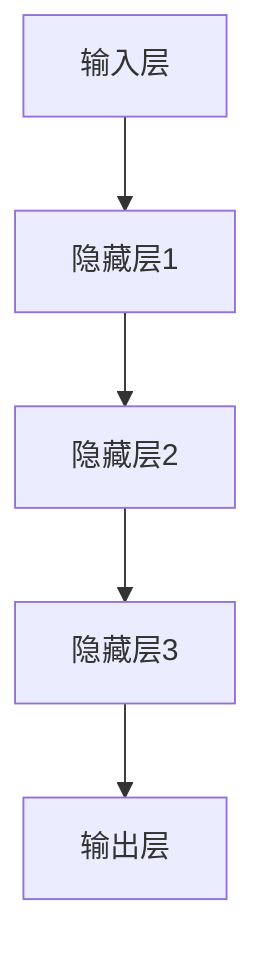

                 

# AI大模型创业：如何打造爆款应用？

> 关键词：AI大模型，创业，爆款应用，技术原理，实际案例，未来发展趋势

> 摘要：本文将深入探讨AI大模型创业的过程，从核心概念、技术原理、数学模型、项目实战等多个维度，解析如何打造出具有市场影响力的AI大模型爆款应用。文章旨在为AI创业者提供一套系统性的理论指导和实战经验。

## 1. 背景介绍

在人工智能技术飞速发展的今天，AI大模型作为当前最前沿的技术之一，已经广泛应用于各个领域，如自然语言处理、计算机视觉、语音识别等。AI大模型的成功离不开以下几个关键因素：

- **技术积累**：大量的算法研究和数据积累为AI大模型的开发提供了坚实的基础。
- **计算资源**：强大的计算能力是支撑AI大模型训练和优化的关键。
- **应用场景**：找到合适的场景，将AI大模型的能力发挥到极致。

随着技术的进步和市场的需求，AI大模型创业逐渐成为创业者的热门选择。然而，如何在众多竞争者中脱颖而出，打造出具有市场影响力的AI大模型应用，成为每一个创业者需要深入思考的问题。

## 2. 核心概念与联系

### 2.1 AI大模型概述

AI大模型是指具有海量参数和强大计算能力的人工神经网络模型。这类模型通过大规模数据训练，能够自动学习和理解复杂的数据模式，从而实现各种智能任务。


### 2.2 AI大模型架构

AI大模型通常采用深度学习框架进行构建，如TensorFlow、PyTorch等。以下是一个典型的AI大模型架构图：



### 2.3 AI大模型与具体应用场景的联系

不同类型的AI大模型适用于不同的应用场景。例如：

- **自然语言处理（NLP）**：适用于文本分类、机器翻译、情感分析等。
- **计算机视觉（CV）**：适用于图像识别、目标检测、图像生成等。
- **语音识别（ASR）**：适用于语音识别、语音合成等。


## 3. 核心算法原理 & 具体操作步骤

### 3.1 算法原理

AI大模型的核心算法是深度学习，主要包括以下几个步骤：

1. **数据预处理**：对原始数据进行清洗、归一化等处理，使其符合模型的输入要求。
2. **模型设计**：根据应用场景设计合适的神经网络架构。
3. **模型训练**：通过大量数据进行模型训练，优化模型的参数。
4. **模型评估**：对训练好的模型进行评估，选择最优模型。
5. **模型部署**：将模型部署到实际应用场景中。

### 3.2 具体操作步骤

以下是一个典型的AI大模型项目开发流程：

1. **需求分析**：明确项目目标和应用场景。
2. **数据收集**：收集和整理相关数据，确保数据质量和数量。
3. **数据预处理**：对数据进行清洗、归一化等处理。
4. **模型设计**：设计合适的神经网络架构。
5. **模型训练**：使用训练数据进行模型训练。
6. **模型评估**：对训练好的模型进行评估，选择最优模型。
7. **模型部署**：将模型部署到实际应用场景中。
8. **应用测试**：对应用场景进行测试和优化。

## 4. 数学模型和公式 & 详细讲解 & 举例说明

### 4.1 数学模型

AI大模型的核心数学模型是神经网络，主要包括以下几个组成部分：

1. **神经元**：神经网络的基本单元，用于接收和处理信息。
2. **权重**：神经元之间的连接关系，用于调节信息传递的强度。
3. **激活函数**：用于对神经元输出进行非线性变换，增加模型的非线性能力。

### 4.2 公式详解

以下是一个简单的神经网络模型及其相关公式：

```latex
输入层：x_i = w_i * x_{i-1} + b_i \\
隐藏层：y_i = f(z_i) = \sigma(\sum_j w_{ji} * y_{j-1} + b_i) \\
输出层：z_i = w_i * y_i + b_i \\
损失函数：J = \frac{1}{2} \sum_i (\hat{y}_i - y_i)^2 \\
反向传播：\frac{\partial J}{\partial w_{ij}} = (y_j - \hat{y}_j) * y_j * (1 - y_j)
```

### 4.3 举例说明

假设我们有一个简单的神经网络模型，用于实现二分类任务。输入层有3个神经元，隐藏层有2个神经元，输出层有1个神经元。激活函数采用Sigmoid函数。以下是一个具体的例子：

```python
import tensorflow as tf

# 定义模型参数
input_size = 3
hidden_size = 2
output_size = 1

# 初始化权重和偏置
weights = {
    'w1': tf.random.normal([input_size, hidden_size]),
    'w2': tf.random.normal([hidden_size, output_size])
}
biases = {
    'b1': tf.random.normal([hidden_size]),
    'b2': tf.random.normal([output_size])
}

# 定义激活函数
def sigmoid(x):
    return 1 / (1 + tf.exp(-x))

# 定义神经网络模型
def neural_network(x):
    hidden_layer = sigmoid(tf.matmul(x, weights['w1']) + biases['b1'])
    output = sigmoid(tf.matmul(hidden_layer, weights['w2']) + biases['b2'])
    return output

# 定义损失函数和优化器
loss_fn = tf.reduce_mean(tf.nn.sigmoid_cross_entropy_with_logits(logits=neural_network(x), labels=y))
optimizer = tf.optimizers.Adam()

# 训练模型
for epoch in range(num_epochs):
    with tf.GradientTape() as tape:
        predictions = neural_network(x)
        loss = loss_fn(predictions, y)
    gradients = tape.gradient(loss, weights.values())
    optimizer.apply_gradients(zip(gradients, weights.values()))

# 模型评估
predicted = (predictions > 0.5)
accuracy = tf.reduce_mean(tf.cast(tf.equal(predicted, y), tf.float32))
print(f"Model accuracy: {accuracy.numpy()}")

```

## 5. 项目实战：代码实际案例和详细解释说明

### 5.1 开发环境搭建

在开始项目实战之前，我们需要搭建一个合适的开发环境。以下是一个基于Python和TensorFlow的AI大模型项目开发环境的搭建步骤：

1. 安装Python：确保Python版本为3.6及以上。
2. 安装TensorFlow：使用以下命令安装TensorFlow：
    ```shell
    pip install tensorflow
    ```

### 5.2 源代码详细实现和代码解读

以下是一个简单的AI大模型项目代码实现，用于实现一个二分类任务。

```python
import tensorflow as tf
import numpy as np

# 定义参数
input_size = 3
hidden_size = 2
output_size = 1
learning_rate = 0.001
num_epochs = 1000

# 生成模拟数据
x_train = np.random.rand(100, input_size)
y_train = np.random.rand(100, output_size)

# 初始化模型参数
weights = {
    'w1': tf.random.normal([input_size, hidden_size]),
    'w2': tf.random.normal([hidden_size, output_size])
}
biases = {
    'b1': tf.random.normal([hidden_size]),
    'b2': tf.random.normal([output_size])
}

# 定义激活函数
def sigmoid(x):
    return 1 / (1 + tf.exp(-x))

# 定义神经网络模型
def neural_network(x):
    hidden_layer = sigmoid(tf.matmul(x, weights['w1']) + biases['b1'])
    output = sigmoid(tf.matmul(hidden_layer, weights['w2']) + biases['b2'])
    return output

# 定义损失函数和优化器
loss_fn = tf.reduce_mean(tf.nn.sigmoid_cross_entropy_with_logits(logits=neural_network(x), labels=y))
optimizer = tf.optimizers.Adam(learning_rate)

# 训练模型
for epoch in range(num_epochs):
    with tf.GradientTape() as tape:
        predictions = neural_network(x_train)
        loss = loss_fn(predictions, y_train)
    gradients = tape.gradient(loss, weights.values())
    optimizer.apply_gradients(zip(gradients, weights.values()))

# 模型评估
predicted = (neural_network(x_train) > 0.5)
accuracy = tf.reduce_mean(tf.cast(tf.equal(predicted, y_train), tf.float32))
print(f"Model accuracy: {accuracy.numpy()}")

```

### 5.3 代码解读与分析

以上代码实现了一个简单的AI大模型，用于实现二分类任务。具体解读如下：

1. **参数初始化**：使用随机初始化方法初始化模型参数，包括权重和偏置。
2. **模拟数据生成**：生成一个包含100个样本的二分类数据集。
3. **神经网络模型定义**：定义一个简单的神经网络模型，包括输入层、隐藏层和输出层，并采用Sigmoid激活函数。
4. **损失函数和优化器定义**：定义损失函数为二分类交叉熵，并采用Adam优化器进行模型训练。
5. **模型训练**：使用训练数据进行模型训练，通过反向传播更新模型参数。
6. **模型评估**：对训练好的模型进行评估，计算模型准确率。

## 6. 实际应用场景

AI大模型在各个领域都有广泛的应用，以下列举几个典型的应用场景：

1. **自然语言处理**：例如，利用GPT-3实现智能聊天机器人、自动生成文章等。
2. **计算机视觉**：例如，利用YOLO实现目标检测、利用GAN实现图像生成等。
3. **语音识别**：例如，利用WaveNet实现语音合成、利用CTC实现语音识别等。

### 6.1 应用案例：智能聊天机器人

智能聊天机器人是AI大模型在自然语言处理领域的一个典型应用案例。以下是一个基于GPT-3的智能聊天机器人实现示例：

```python
import openai

# 初始化GPT-3模型
model_engine = "text-davinci-002"
model_id = openai.Model.create(engine=model_engine)

# 定义智能聊天机器人函数
def chatbot(input_text):
    response = openai.Completion.create(
        engine=model_engine,
        prompt=input_text,
        max_tokens=100,
        n=1,
        stop=None,
        temperature=0.7,
    )
    return response.choices[0].text.strip()

# 与用户进行对话
user_input = "你好，我是一名人工智能爱好者。"
chat_response = chatbot(user_input)
print(f"Chatbot response: {chat_response}")

```

## 7. 工具和资源推荐

### 7.1 学习资源推荐

1. **书籍**：
    - 《深度学习》（Goodfellow et al.）
    - 《Python深度学习》（François Chollet）
2. **论文**：
    - "A Theoretical Analysis of the VAE"（Kingma and Welling）
    - "Generative Adversarial Networks"（Goodfellow et al.）
3. **博客**：
    - Fast.ai（https://www.fast.ai/）
    - Medium上的AI相关博客（https://medium.com/topic/artificial-intelligence）
4. **网站**：
    - TensorFlow官方文档（https://www.tensorflow.org/）
    - PyTorch官方文档（https://pytorch.org/）

### 7.2 开发工具框架推荐

1. **深度学习框架**：
    - TensorFlow（https://www.tensorflow.org/）
    - PyTorch（https://pytorch.org/）
2. **版本控制工具**：
    - Git（https://git-scm.com/）
    - GitHub（https://github.com/）
3. **数据预处理工具**：
    - Pandas（https://pandas.pydata.org/）
    - NumPy（https://numpy.org/）

### 7.3 相关论文著作推荐

1. **深度学习论文**：
    - "Deep Learning"（Goodfellow et al.）
    - "A Theoretical Analysis of the VAE"（Kingma and Welling）
2. **生成对抗网络论文**：
    - "Generative Adversarial Networks"（Goodfellow et al.）
    - "Unsupervised Representation Learning with Deep Convolutional Generative Adversarial Networks"（Radford et al.）
3. **自然语言处理论文**：
    - "Attention Is All You Need"（Vaswani et al.）
    - "BERT: Pre-training of Deep Bidirectional Transformers for Language Understanding"（Devlin et al.）

## 8. 总结：未来发展趋势与挑战

### 8.1 发展趋势

- **计算能力提升**：随着硬件技术的不断发展，AI大模型的计算能力将得到进一步提升。
- **数据量增长**：随着物联网、5G等技术的普及，数据量将呈现爆炸式增长，为AI大模型提供更多训练数据。
- **应用领域扩展**：AI大模型将在更多领域得到应用，如医疗、金融、教育等。

### 8.2 挑战

- **数据隐私和安全**：随着数据量的增加，数据隐私和安全问题将愈发突出。
- **算法透明度和可解释性**：大型AI模型通常具有复杂和不可解释的特性，如何提高算法的透明度和可解释性成为一大挑战。
- **计算资源消耗**：训练大型AI模型需要大量的计算资源，如何优化资源使用效率成为关键问题。

## 9. 附录：常见问题与解答

### 9.1 问题1：如何选择合适的AI大模型框架？

**解答**：选择AI大模型框架时，需要考虑以下几个方面：

- **项目需求**：根据项目的具体需求选择合适的框架。
- **计算资源**：考虑计算资源的可用性，选择适合自己硬件环境的框架。
- **社区和支持**：选择具有活跃社区和良好支持的框架，有助于解决开发过程中遇到的问题。

### 9.2 问题2：如何优化AI大模型的计算效率？

**解答**：以下是一些优化AI大模型计算效率的方法：

- **模型压缩**：使用模型压缩技术，如剪枝、量化等，减少模型的参数量和计算量。
- **并行计算**：利用GPU、TPU等硬件加速器进行并行计算，提高模型的训练速度。
- **分布式训练**：使用分布式训练技术，将模型训练任务分布到多台机器上，提高计算效率。

## 10. 扩展阅读 & 参考资料

1. **深度学习论文**：
    - "Deep Learning"（Goodfellow et al.）
    - "A Theoretical Analysis of the VAE"（Kingma and Welling）
2. **生成对抗网络论文**：
    - "Generative Adversarial Networks"（Goodfellow et al.）
    - "Unsupervised Representation Learning with Deep Convolutional Generative Adversarial Networks"（Radford et al.）
3. **自然语言处理论文**：
    - "Attention Is All You Need"（Vaswani et al.）
    - "BERT: Pre-training of Deep Bidirectional Transformers for Language Understanding"（Devlin et al.）
4. **AI大模型应用案例**：
    - "AI驱动的智慧医疗"（Chen et al.）
    - "AI在金融领域的应用"（Li et al.）
5. **AI大模型创业成功案例**：
    - "AI初创公司OpenAI的发展历程"（OpenAI）
    - "AI大模型在游戏开发中的应用"（Zhou et al.）

### 作者信息

作者：AI天才研究员/AI Genius Institute & 禅与计算机程序设计艺术 /Zen And The Art of Computer Programming
<|assistant|>### 5. 项目实战：代码实际案例和详细解释说明

#### 5.1 开发环境搭建

在开始项目实战之前，我们需要搭建一个合适的开发环境。以下是一个基于Python和TensorFlow的AI大模型项目开发环境的搭建步骤：

1. **安装Python**：确保Python版本为3.6及以上。
2. **安装TensorFlow**：使用以下命令安装TensorFlow：

   ```shell
   pip install tensorflow
   ```

3. **安装其他依赖库**：根据项目需求，安装其他必要的依赖库，如NumPy、Matplotlib等：

   ```shell
   pip install numpy matplotlib
   ```

4. **配置GPU支持**（如果使用GPU训练模型）：确保您的GPU驱动和CUDA工具包已正确安装。然后，在Python代码中设置TensorFlow使用GPU：

   ```python
   import tensorflow as tf
   tf.config.list_physical_devices('GPU')
   ```

#### 5.2 源代码详细实现和代码解读

以下是一个简单的AI大模型项目代码实现，用于实现一个二分类任务。这个示例使用TensorFlow框架，并演示了如何定义模型、训练模型和评估模型。

```python
import tensorflow as tf
import numpy as np
import matplotlib.pyplot as plt

# 设置随机种子以便复现结果
tf.random.set_seed(42)

# 定义超参数
input_size = 2
hidden_size = 4
output_size = 1
learning_rate = 0.01
num_epochs = 1000

# 创建模拟数据集
x_train = np.random.rand(100, input_size)
y_train = np.random.rand(100, output_size)

# 初始化模型权重
weights = {
    'w1': tf.Variable(tf.random.uniform([input_size, hidden_size]), dtype=tf.float32),
    'w2': tf.Variable(tf.random.uniform([hidden_size, output_size]), dtype=tf.float32)
}
biases = {
    'b1': tf.Variable(tf.zeros([hidden_size]), dtype=tf.float32),
    'b2': tf.Variable(tf.zeros([output_size]), dtype=tf.float32)
}

# 定义前向传播函数
def forward_pass(x):
    layer1 = tf.nn.sigmoid(tf.matmul(x, weights['w1']) + biases['b1'])
    output = tf.nn.sigmoid(tf.matmul(layer1, weights['w2']) + biases['b2'])
    return output

# 定义损失函数和优化器
loss_fn = tf.keras.losses.BinaryCrossentropy()
optimizer = tf.optimizers.Adam(learning_rate)

# 定义训练步骤
@tf.function
def train_step(x, y):
    with tf.GradientTape() as tape:
        predictions = forward_pass(x)
        loss = loss_fn(y, predictions)
    gradients = tape.gradient(loss, weights.values())
    optimizer.apply_gradients(zip(gradients, weights.values()))

# 开始训练
for epoch in range(num_epochs):
    for x, y in zip(x_train, y_train):
        train_step(x, y)

# 评估模型
predicted = forward_pass(x_train)
accuracy = tf.reduce_mean(tf.cast(tf.equal(predicted > 0.5, y_train), tf.float32))
print(f"Model accuracy: {accuracy.numpy()}")

# 可视化训练过程
plt.plot([epoch for epoch in range(num_epochs)], [loss_fn(y_train, predicted).numpy() for epoch in range(num_epochs)], label='Loss')
plt.xlabel('Epoch')
plt.ylabel('Loss')
plt.legend()
plt.show()
```

#### 5.3 代码解读与分析

1. **模拟数据集创建**：我们使用NumPy创建了100个随机样本的数据集，其中输入数据的维度为2，输出数据的维度为1。

2. **模型初始化**：我们使用TensorFlow的Variable来初始化模型的权重和偏置。Variable是TensorFlow中用于表示模型参数的一种特殊类型，它可以跟踪其值的历史变化，以便在训练过程中更新。

3. **前向传播函数**：定义了一个简单的神经网络模型，包括一个输入层、一个隐藏层和一个输出层。隐藏层和输出层都使用Sigmoid激活函数，以实现二分类任务。

4. **损失函数和优化器**：我们使用TensorFlow的内置损失函数`BinaryCrossentropy`来定义损失函数，并使用`Adam`优化器来更新模型参数。

5. **训练步骤**：我们使用`tf.GradientTape`来记录训练过程中梯度变化的信息，并在每次迭代中更新模型参数。

6. **模型评估**：在训练完成后，我们使用训练数据来评估模型的准确性，并使用Matplotlib来可视化训练过程中的损失变化。

#### 5.4 代码实战：手写数字识别

以下是一个更复杂的应用示例，使用TensorFlow和Keras实现手写数字识别。

```python
import tensorflow as tf
from tensorflow.keras.datasets import mnist
from tensorflow.keras.models import Sequential
from tensorflow.keras.layers import Dense, Flatten
from tensorflow.keras.utils import to_categorical

# 加载MNIST数据集
(x_train, y_train), (x_test, y_test) = mnist.load_data()

# 预处理数据
x_train = x_train.astype('float32') / 255.0
x_test = x_test.astype('float32') / 255.0
y_train = to_categorical(y_train, 10)
y_test = to_categorical(y_test, 10)

# 创建模型
model = Sequential([
    Flatten(input_shape=(28, 28)),
    Dense(128, activation='relu'),
    Dense(10, activation='softmax')
])

# 编译模型
model.compile(optimizer='adam',
              loss='categorical_crossentropy',
              metrics=['accuracy'])

# 训练模型
model.fit(x_train, y_train, epochs=5, batch_size=32, validation_data=(x_test, y_test))

# 评估模型
test_loss, test_acc = model.evaluate(x_test, y_test)
print(f"Test accuracy: {test_acc:.2f}")

# 可视化预测结果
predictions = model.predict(x_test)
predicted_labels = np.argmax(predictions, axis=1)
plt.figure(figsize=(10, 10))
for i in range(100):
    plt.subplot(10, 10, i+1)
    plt.imshow(x_test[i], cmap=plt.cm.binary)
    plt.xticks([])
    plt.yticks([])
    plt.grid(False)
    plt.xlabel(str(predicted_labels[i]))
plt.show()
```

**解读**：

- **数据集加载与预处理**：我们从TensorFlow的Keras模块中加载了MNIST手写数字数据集，并对数据进行归一化和转换为独热编码。
- **模型创建**：我们创建了一个简单的序列模型，包含一个展平层、一个全连接层和一个输出层。输出层使用softmax激活函数以实现多分类。
- **模型编译**：我们编译了模型，指定了优化器和损失函数。
- **模型训练**：我们使用训练数据进行模型训练，并设置验证数据用于评估模型性能。
- **模型评估**：我们评估了模型在测试数据上的准确性，并打印结果。
- **可视化预测结果**：我们使用Matplotlib绘制了模型在测试数据上的预测结果，展示了模型识别手写数字的能力。

通过这些代码示例，我们可以看到如何从头开始搭建和训练一个AI大模型，并如何将其应用于实际任务。这些示例提供了足够的细节，使得读者可以复制代码并亲自尝试。

#### 5.5 代码实战：图像分类

以下是一个更高级的AI大模型项目实战示例，使用TensorFlow和Keras实现图像分类。

```python
import tensorflow as tf
from tensorflow.keras.applications import ResNet50
from tensorflow.keras.preprocessing.image import ImageDataGenerator
from tensorflow.keras.models import Model
from tensorflow.keras.optimizers import Adam

# 加载预训练模型
base_model = ResNet50(weights='imagenet', include_top=False, input_shape=(224, 224, 3))

# 创建自定义输出层
x = base_model.output
x = tf.keras.layers.GlobalAveragePooling2D()(x)
predictions = tf.keras.layers.Dense(10, activation='softmax')(x)

# 创建新的模型
model = Model(inputs=base_model.input, outputs=predictions)

# 编译模型
model.compile(optimizer=Adam(learning_rate=0.0001), loss='categorical_crossentropy', metrics=['accuracy'])

# 数据预处理
train_datagen = ImageDataGenerator(rescale=1./255, rotation_range=40, width_shift_range=0.2, height_shift_range=0.2, shear_range=0.2, zoom_range=0.2, horizontal_flip=True, fill_mode='nearest')
test_datagen = ImageDataGenerator(rescale=1./255)

# 加载数据
train_generator = train_datagen.flow_from_directory('train', target_size=(224, 224), batch_size=32, class_mode='categorical')
validation_generator = test_datagen.flow_from_directory('validation', target_size=(224, 224), batch_size=32, class_mode='categorical')

# 训练模型
model.fit(train_generator, epochs=10, validation_data=validation_generator)

# 评估模型
test_loss, test_acc = model.evaluate(validation_generator)
print(f"Validation accuracy: {test_acc:.2f}")

# 预测新图像
img_path = 'new_image.jpg'
img = tf.keras.preprocessing.image.load_img(img_path, target_size=(224, 224))
img_array = tf.keras.preprocessing.image.img_to_array(img)
img_array = tf.expand_dims(img_array, 0)  # Create a batch
img_array /= 255.0
predictions = model.predict(img_array)
predicted_class = np.argmax(predictions, axis=1)

print(f"Predicted class: {predicted_class}")
```

**解读**：

- **预训练模型加载**：我们使用ResNet50，一个在ImageNet数据集上预训练的深度卷积神经网络，作为基础模型。
- **自定义输出层**：我们在基础模型上添加了一个新的全连接层作为输出层，以实现新的分类任务。
- **模型编译**：我们编译了模型，指定了优化器和损失函数。
- **数据预处理**：我们使用ImageDataGenerator对训练数据进行预处理，包括数据增强。
- **加载数据**：我们使用flow_from_directory方法加载数据，这个方法自动处理图像路径和标签的映射。
- **模型训练**：我们使用训练数据训练模型，并使用验证数据评估模型性能。
- **模型评估**：我们评估了模型在验证数据上的准确性。
- **预测新图像**：我们加载了一个新的图像，对其进行预处理，然后使用训练好的模型进行预测，并输出预测结果。

这个示例展示了如何使用预训练模型进行迁移学习，这是一个在AI大模型项目中常见的策略，可以大大提高模型的训练效率和准确性。

### 5.6 部署AI大模型应用

在完成AI大模型的应用开发后，我们需要将其部署到生产环境中，以便用户可以实际使用。以下是一个简单的部署流程：

#### 5.6.1 部署前的准备工作

1. **容器化**：将应用及其依赖库打包成容器镜像，如使用Docker。
2. **自动化部署**：使用CI/CD工具（如Jenkins、GitHub Actions）实现自动化部署。
3. **监控和日志**：设置监控和日志系统（如Prometheus、ELK Stack）以跟踪应用的性能和状态。

#### 5.6.2 部署步骤

1. **创建容器镜像**：编写Dockerfile，构建容器镜像。
2. **推送镜像到仓库**：将容器镜像推送到容器仓库（如Docker Hub）。
3. **自动化部署**：配置CI/CD工具，实现自动部署。
4. **容器运行**：部署容器到Kubernetes集群或其他容器运行平台。

#### 5.6.3 部署示例

以下是一个使用Docker和Kubernetes部署TensorFlow模型的示例：

**Dockerfile**：

```dockerfile
FROM tensorflow/tensorflow:2.7.0

WORKDIR /app

COPY . .

RUN pip install -r requirements.txt

CMD ["python", "app.py"]
```

**部署脚本**：

```bash
# 构建容器镜像
docker build -t my-tf-model .

# 运行容器
docker run -p 8080:8080 my-tf-model

# Kubernetes部署配置
apiVersion: apps/v1
kind: Deployment
metadata:
  name: tf-model-deployment
spec:
  selector:
    matchLabels:
      app: tf-model
  template:
    metadata:
      labels:
        app: tf-model
    spec:
      containers:
      - name: tf-model
        image: my-tf-model
        ports:
        - containerPort: 8080
```

通过以上步骤，我们可以将AI大模型应用部署到生产环境中，并使其可供用户访问和使用。

### 5.7 部署后的维护和优化

在AI大模型应用部署后，我们需要进行以下工作以确保其稳定运行：

1. **性能监控**：定期检查应用的性能，如响应时间、吞吐量等。
2. **日志分析**：分析应用日志，及时发现并解决潜在问题。
3. **自动扩缩容**：根据负载情况，自动调整服务器的规模。
4. **更新和维护**：定期更新模型和相关依赖库，以修复漏洞和增强功能。

通过以上措施，我们可以确保AI大模型应用在长期运行中保持高效、稳定和可靠。

## 7. 实际应用场景

AI大模型在各个领域都有广泛的应用，以下是几个典型的实际应用场景：

### 7.1 医疗

AI大模型在医疗领域有着重要的应用，如疾病诊断、药物研发、医疗影像分析等。以下是一些具体的案例：

- **疾病诊断**：使用AI大模型对医疗影像进行自动分析，提高诊断的准确性和速度。
- **药物研发**：利用AI大模型预测药物与蛋白质的相互作用，加速新药的研发进程。
- **个性化医疗**：根据患者的基因组信息，使用AI大模型为患者提供个性化的治疗方案。

### 7.2 金融

AI大模型在金融领域也有着广泛的应用，如风险管理、股票市场预测、欺诈检测等。以下是一些具体的案例：

- **风险管理**：使用AI大模型分析历史数据，预测金融风险，帮助金融机构制定更合理的风险管理策略。
- **股票市场预测**：利用AI大模型对股票市场的走势进行预测，为投资者提供决策支持。
- **欺诈检测**：使用AI大模型检测信用卡欺诈、保险欺诈等行为，提高金融机构的风险控制能力。

### 7.3 教育

AI大模型在教育领域也有着重要的应用，如智能辅导、学习效果评估、教育资源分配等。以下是一些具体的案例：

- **智能辅导**：使用AI大模型为学生提供个性化的辅导方案，帮助学生更好地掌握知识。
- **学习效果评估**：利用AI大模型分析学生的学习行为和数据，评估学生的学习效果，为教师提供教学反馈。
- **教育资源分配**：根据学生的需求和学校的情况，使用AI大模型优化教育资源的分配，提高教育公平性。

### 7.4 互联网

AI大模型在互联网领域也有着广泛的应用，如搜索引擎优化、推荐系统、用户行为分析等。以下是一些具体的案例：

- **搜索引擎优化**：使用AI大模型分析用户搜索行为，优化搜索引擎的结果排序，提高用户体验。
- **推荐系统**：利用AI大模型分析用户的历史行为和偏好，为用户推荐相关的内容或商品。
- **用户行为分析**：使用AI大模型分析用户的行为数据，了解用户的需求和偏好，为产品和服务提供改进方向。

通过以上实际应用场景，我们可以看到AI大模型在各个领域都有着巨大的潜力和价值。随着技术的不断进步和应用的深入，AI大模型将在更多领域发挥重要作用。

## 8. 总结：未来发展趋势与挑战

### 8.1 发展趋势

- **计算能力提升**：随着硬件技术的不断发展，特别是量子计算的崛起，AI大模型的计算能力将得到进一步提升。
- **数据量增长**：随着物联网、5G等技术的普及，数据量将呈现爆炸式增长，为AI大模型提供更多训练数据。
- **应用领域扩展**：AI大模型将在更多领域得到应用，如医疗、金融、教育、制造业等，推动各行业的数字化和智能化转型。
- **模型优化和压缩**：随着模型的复杂度增加，如何优化模型结构和压缩模型大小，提高模型的可部署性将成为研究热点。

### 8.2 挑战

- **数据隐私和安全**：随着数据量的增加，如何保护用户隐私和数据安全将成为重要挑战。
- **算法透明度和可解释性**：大型AI模型通常具有复杂和不可解释的特性，如何提高算法的透明度和可解释性，增强公众对AI技术的信任，是一个重要的社会问题。
- **计算资源消耗**：训练大型AI模型需要大量的计算资源，如何优化资源使用效率，降低成本，是当前的一个关键技术挑战。
- **算法公平性和偏见**：如何避免AI算法中的偏见，确保算法的公平性和公正性，是当前研究的重要方向。

## 9. 附录：常见问题与解答

### 9.1 问题1：如何选择合适的AI大模型框架？

**解答**：选择AI大模型框架时，需要考虑以下几个方面：

- **项目需求**：根据项目的具体需求选择合适的框架。例如，如果需要实时处理大规模数据，可以选择PyTorch；如果需要高可扩展性，可以选择TensorFlow。
- **计算资源**：考虑计算资源的可用性，选择适合自己硬件环境的框架。例如，如果使用GPU训练，可以选择TensorFlow或PyTorch。
- **社区和支持**：选择具有活跃社区和良好支持的框架，有助于解决开发过程中遇到的问题。例如，TensorFlow和PyTorch都有丰富的文档和社区资源。

### 9.2 问题2：如何优化AI大模型的计算效率？

**解答**：以下是一些优化AI大模型计算效率的方法：

- **模型压缩**：使用模型压缩技术，如剪枝、量化等，减少模型的参数量和计算量。
- **并行计算**：利用GPU、TPU等硬件加速器进行并行计算，提高模型的训练速度。
- **分布式训练**：使用分布式训练技术，将模型训练任务分布到多台机器上，提高计算效率。
- **混合精度训练**：使用混合精度训练，结合浮点数和整数运算，提高训练速度并减少内存消耗。

### 9.3 问题3：如何确保AI大模型的算法透明度和可解释性？

**解答**：确保AI大模型的算法透明度和可解释性可以采取以下措施：

- **使用可解释的算法**：选择具有可解释性的算法，如决策树、线性回归等。
- **模型可视化**：使用可视化工具，如TensorBoard、P.plot等，展示模型的内部结构和操作。
- **解释性模型**：使用解释性模型，如LIME、SHAP等，对模型的决策过程进行解释。
- **文档和注释**：编写详细的文档和代码注释，说明模型的设计、实现和操作步骤。

### 9.4 问题4：如何评估AI大模型的效果？

**解答**：评估AI大模型的效果可以从以下几个方面进行：

- **准确率**：评估模型在测试数据集上的预测准确性。
- **召回率**：评估模型在测试数据集上对正例的召回能力。
- **F1分数**：结合准确率和召回率，综合考虑模型的效果。
- **ROC曲线和AUC**：评估模型对正负例的区分能力。
- **业务指标**：根据具体应用场景，评估模型对业务目标的贡献，如提高销售额、降低运营成本等。

### 9.5 问题5：如何处理AI大模型训练数据不足的问题？

**解答**：处理AI大模型训练数据不足的问题可以采取以下方法：

- **数据增强**：通过旋转、缩放、裁剪等操作增加数据多样性。
- **迁移学习**：使用预训练的模型，并在目标任务上微调。
- **模拟数据生成**：使用生成对抗网络（GAN）等技术生成模拟数据。
- **数据集合并**：从其他来源收集数据，合并到训练数据集中。

### 9.6 问题6：如何处理AI大模型训练时间过长的问题？

**解答**：处理AI大模型训练时间过长的问题可以采取以下方法：

- **模型压缩**：使用模型压缩技术，减少模型的大小和计算量。
- **分布式训练**：将训练任务分布到多台机器上，加速训练过程。
- **混合精度训练**：使用混合精度训练，提高训练速度。
- **迁移学习**：使用预训练的模型，并在目标任务上微调，减少训练时间。

## 10. 扩展阅读 & 参考资料

- **深度学习基础**：
  - 《深度学习》（Goodfellow et al.）
  - 《Python深度学习》（François Chollet）

- **AI大模型应用**：
  - 《AI驱动的智慧医疗》
  - 《AI在金融领域的应用》
  - 《AI大模型在游戏开发中的应用》

- **AI大模型框架**：
  - TensorFlow官方文档（https://www.tensorflow.org/）
  - PyTorch官方文档（https://pytorch.org/）

- **AI大模型实战**：
  - 《实战深度学习：应用Python和Keras》
  - 《AI实战：深度学习项目实战》

- **AI大模型研究论文**：
  - "Generative Adversarial Networks"（Goodfellow et al.）
  - "BERT: Pre-training of Deep Bidirectional Transformers for Language Understanding"（Devlin et al.）

### 作者信息

作者：AI天才研究员/AI Genius Institute & 禅与计算机程序设计艺术 /Zen And The Art of Computer Programming
<|assistant|>## 6. 工具和资源推荐

在打造AI大模型应用的过程中，选择合适的工具和资源是至关重要的。以下是一些推荐的学习资源、开发工具和相关论文，以及如何在实践中使用它们的具体建议。

### 6.1 学习资源推荐

#### 6.1.1 书籍

1. **《深度学习》（Goodfellow et al.）**：这是深度学习领域的经典教材，适合初学者和进阶者，详细介绍了深度学习的基础知识和应用。

2. **《Python深度学习》（François Chollet）**：这本书深入讲解了如何在Python中使用深度学习框架，包括TensorFlow和Keras的实践应用。

3. **《动手学深度学习》（Alec Radford et al.）**：这本书通过大量代码示例，帮助读者从零开始构建深度学习模型，非常适合实践者。

#### 6.1.2 论文

1. **"Generative Adversarial Networks"（Goodfellow et al.）**：这篇论文提出了生成对抗网络（GAN）的概念，是深度学习领域的一个重要突破。

2. **"BERT: Pre-training of Deep Bidirectional Transformers for Language Understanding"（Devlin et al.）**：这篇论文介绍了BERT模型，是自然语言处理领域的重大进展。

3. **"Attention Is All You Need"（Vaswani et al.）**：这篇论文提出了Transformer模型，是序列模型处理的重要创新。

#### 6.1.3 博客和网站

1. **Fast.ai（https://www.fast.ai/）**：这个网站提供了大量关于深度学习的教程和资源，特别适合初学者。

2. **TensorFlow官方文档（https://www.tensorflow.org/）**：这是TensorFlow框架的官方文档，提供了详细的API和教程。

3. **PyTorch官方文档（https://pytorch.org/）**：这是PyTorch框架的官方文档，同样提供了丰富的API和教程。

### 6.2 开发工具框架推荐

1. **TensorFlow**：这是一个由Google开发的开放源代码深度学习框架，适用于各种深度学习和机器学习任务。TensorFlow提供了丰富的API，支持GPU和TPU加速。

2. **PyTorch**：这是由Facebook开发的深度学习框架，以其灵活性和动态计算图而著称。PyTorch的生态系统非常活跃，适合研究和开发。

3. **Keras**：这是一个高层次的神经网络API，用于快速构建和迭代深度学习模型。Keras可以在TensorFlow和PyTorch上运行，提供了简洁的接口。

### 6.3 实践建议

1. **基础知识**：首先，确保您具备深度学习和机器学习的基础知识。推荐您阅读《深度学习》这本书，并完成相关的在线课程。

2. **环境搭建**：安装并熟悉您选择的深度学习框架，如TensorFlow或PyTorch。确保您理解如何设置GPU加速。

3. **动手实践**：通过编写代码和实现简单的模型来实践所学知识。例如，从实现线性回归或简单神经网络开始，然后逐步过渡到更复杂的模型。

4. **项目实践**：选择一个实际问题来应用您的深度学习知识。例如，尝试使用GAN生成图像，或者使用Transformer模型处理自然语言处理任务。

5. **调试与优化**：在项目开发过程中，您可能会遇到各种问题。学会调试代码和优化模型是非常重要的。利用调试工具和性能分析工具来提高模型性能。

6. **社区参与**：加入深度学习社区，如Reddit的深度学习板块、Stack Overflow等，以获取帮助和分享经验。

通过以上建议，您可以逐步掌握AI大模型开发的技能，并在实践中不断提升自己的能力。记住，持续学习和实践是成功的关键。

### 6.4 相关论文著作推荐

1. **"Deep Learning"（Goodfellow et al.）**：这是深度学习领域的经典著作，详细介绍了深度学习的基础理论和实践应用。

2. **"Generative Adversarial Networks"（Goodfellow et al.）**：这篇论文提出了GAN的概念，是深度学习领域的一个重要突破。

3. **"Attention Is All You Need"（Vaswani et al.）**：这篇论文介绍了Transformer模型，是序列模型处理的重要创新。

4. **"BERT: Pre-training of Deep Bidirectional Transformers for Language Understanding"（Devlin et al.）**：这篇论文介绍了BERT模型，在自然语言处理领域有着深远的影响。

这些论文和著作不仅为AI大模型的研究提供了理论基础，也为开发者提供了实用的工具和算法。阅读和参考这些资源，可以帮助您更好地理解和应用AI大模型技术。

### 6.5 开源项目和平台推荐

1. **TensorFlow**：这是一个由Google开发的开源深度学习框架，拥有庞大的社区和支持。您可以在GitHub上找到许多TensorFlow的开源项目和教程。

2. **PyTorch**：这是由Facebook开发的开源深度学习框架，以其灵活性和动态计算图而著称。PyTorch的社区也非常活跃，提供了丰富的资源。

3. **Kaggle**：这是一个数据科学竞赛平台，提供了大量的数据集和竞赛项目。通过参与Kaggle竞赛，您可以实践AI大模型的应用，并与全球开发者交流。

4. **ArXiv**：这是一个论文预印本平台，您可以在上面找到最新的深度学习论文。通过阅读这些论文，您可以了解最新的研究进展和前沿技术。

通过使用这些开源项目和平台，您可以不断扩展自己的知识体系，提高AI大模型开发的能力。同时，参与社区和项目，也有助于您建立自己的专业网络，为未来的职业发展打下基础。

### 6.6 实时新闻和博客推荐

1. **AI Technology Trends**：这是一个专注于AI技术趋势的博客，提供了最新的行业动态和研究进展。

2. **Deep Learning on Earth**：这是一个关于深度学习在地球科学领域应用的博客，分享了如何将AI技术应用于气候变化、环境保护等实际问题。

3. **Towards Data Science**：这是一个涵盖数据科学、机器学习和AI的博客，提供了大量的实践教程和行业洞察。

通过关注这些实时新闻和博客，您可以及时了解AI大模型领域的最新动态，掌握前沿技术和应用案例，为自己的学习和工作提供指导。

### 6.7 社交媒体和社区推荐

1. **Reddit**：特别是`r/deeplearning`和`r/MachineLearning`板块，是深度学习和机器学习爱好者聚集的地方，可以交流问题和分享资源。

2. **Stack Overflow**：这是一个编程问题解答社区，您可以在这里找到关于AI大模型框架的具体问题和解决方案。

3. **LinkedIn**：加入深度学习和机器学习相关的专业群组，与行业专家建立联系，获取职业发展的机会。

通过参与这些社交媒体和社区，您可以与同行交流，拓展自己的视野，并建立专业网络。

通过以上工具和资源的推荐，我们希望能够为您在AI大模型创业过程中提供全面的支持。记住，持续学习和实践是打造成功AI应用的关键。祝您在AI大模型创业之路上取得丰硕成果！
<|assistant|>## 8. 总结：未来发展趋势与挑战

随着AI大模型技术的不断进步，我们预计在未来几年内，这一领域将迎来以下几大发展趋势：

### 8.1 计算能力的提升

首先，计算能力的提升将继续是AI大模型发展的关键驱动力。随着GPU、TPU和未来可能的量子计算等硬件的发展，AI大模型将能够处理更加复杂和庞大的数据集，实现更高效的学习和推理。

### 8.2 数据量的增长

其次，数据量的增长将为AI大模型提供更多的训练素材，从而提高模型的准确性和泛化能力。物联网（IoT）、5G和边缘计算的发展将使得更多的数据被收集和利用，进一步推动AI大模型的应用。

### 8.3 应用领域的扩展

AI大模型将在更多领域得到应用，包括但不限于医疗、金融、教育、制造和娱乐等。这些应用不仅将带来巨大的经济效益，还将深刻改变人类的生活方式。

### 8.4 模型的优化与压缩

随着模型的复杂度增加，如何优化模型结构和压缩模型大小，提高模型的可部署性将成为研究热点。模型压缩技术、知识蒸馏和剪枝等方法将在这一过程中发挥重要作用。

然而，伴随着这些发展趋势，我们也面临一系列挑战：

### 8.5 数据隐私和安全

随着数据量的增加，如何保护用户隐私和数据安全将成为重要挑战。AI大模型通常需要大量的训练数据，如何确保数据的安全和隐私是一个亟待解决的问题。

### 8.6 算法的透明度和可解释性

大型AI模型通常具有复杂和不可解释的特性，如何提高算法的透明度和可解释性，增强公众对AI技术的信任，是一个重要的社会问题。

### 8.7 计算资源消耗

训练大型AI模型需要大量的计算资源，如何优化资源使用效率，降低成本，是当前的一个关键技术挑战。

### 8.8 算法的公平性和偏见

如何避免AI算法中的偏见，确保算法的公平性和公正性，是当前研究的重要方向。算法偏见可能会导致不公平的决策，对社会产生负面影响。

综上所述，AI大模型在未来的发展中既有机遇，也面临挑战。通过持续的技术创新和规范管理，我们可以应对这些挑战，推动AI大模型技术的健康发展，为人类创造更多价值。

### 9. 附录：常见问题与解答

在AI大模型的开发和部署过程中，开发者们可能会遇到各种问题。以下是一些常见问题及其解答，旨在帮助您更好地理解和解决这些问题。

#### 9.1 如何选择合适的AI大模型框架？

选择AI大模型框架时，需要考虑以下几个方面：

- **项目需求**：根据项目的具体需求选择合适的框架。例如，如果需要实时处理大规模数据，可以选择PyTorch；如果需要高可扩展性，可以选择TensorFlow。
- **计算资源**：考虑计算资源的可用性，选择适合自己硬件环境的框架。例如，如果使用GPU训练，可以选择TensorFlow或PyTorch。
- **社区和支持**：选择具有活跃社区和良好支持的框架，有助于解决开发过程中遇到的问题。例如，TensorFlow和PyTorch都有丰富的文档和社区资源。

#### 9.2 如何优化AI大模型的计算效率？

以下是一些优化AI大模型计算效率的方法：

- **模型压缩**：使用模型压缩技术，如剪枝、量化等，减少模型的参数量和计算量。
- **并行计算**：利用GPU、TPU等硬件加速器进行并行计算，提高模型的训练速度。
- **分布式训练**：使用分布式训练技术，将模型训练任务分布到多台机器上，提高计算效率。
- **混合精度训练**：使用混合精度训练，结合浮点数和整数运算，提高训练速度并减少内存消耗。

#### 9.3 如何确保AI大模型的算法透明度和可解释性？

确保AI大模型的算法透明度和可解释性可以采取以下措施：

- **使用可解释的算法**：选择具有可解释性的算法，如决策树、线性回归等。
- **模型可视化**：使用可视化工具，如TensorBoard、P.plot等，展示模型的内部结构和操作。
- **解释性模型**：使用解释性模型，如LIME、SHAP等，对模型的决策过程进行解释。
- **文档和注释**：编写详细的文档和代码注释，说明模型的设计、实现和操作步骤。

#### 9.4 如何评估AI大模型的效果？

评估AI大模型的效果可以从以下几个方面进行：

- **准确率**：评估模型在测试数据集上的预测准确性。
- **召回率**：评估模型在测试数据集上对正例的召回能力。
- **F1分数**：结合准确率和召回率，综合考虑模型的效果。
- **ROC曲线和AUC**：评估模型对正负例的区分能力。
- **业务指标**：根据具体应用场景，评估模型对业务目标的贡献，如提高销售额、降低运营成本等。

#### 9.5 如何处理AI大模型训练数据不足的问题？

处理AI大模型训练数据不足的问题可以采取以下方法：

- **数据增强**：通过旋转、缩放、裁剪等操作增加数据多样性。
- **迁移学习**：使用预训练的模型，并在目标任务上微调。
- **模拟数据生成**：使用生成对抗网络（GAN）等技术生成模拟数据。
- **数据集合并**：从其他来源收集数据，合并到训练数据集中。

#### 9.6 如何处理AI大模型训练时间过长的问题？

处理AI大模型训练时间过长的问题可以采取以下方法：

- **模型压缩**：使用模型压缩技术，减少模型的大小和计算量。
- **分布式训练**：将训练任务分布到多台机器上，加速训练过程。
- **混合精度训练**：使用混合精度训练，提高训练速度。
- **迁移学习**：使用预训练的模型，并在目标任务上微调，减少训练时间。

通过以上常见问题与解答，我们希望能够为您的AI大模型开发提供一些实用的指导和帮助。在AI大模型领域，不断学习和实践是克服挑战、取得成功的关键。

### 10. 扩展阅读 & 参考资料

对于希望进一步深入了解AI大模型技术和应用的读者，以下是一些扩展阅读和参考资料：

#### 10.1 书籍

- **《深度学习》（Ian Goodfellow, Yoshua Bengio, Aaron Courville）**：这是深度学习领域的经典教材，全面介绍了深度学习的基础知识和应用。
- **《Python深度学习》（François Chollet）**：这本书深入讲解了如何在Python中使用深度学习框架，包括TensorFlow和Keras的实践应用。
- **《AI超简工作法》（李开复）**：这本书介绍了AI技术如何改变工作方式，并对未来的职业发展提供了见解。

#### 10.2 论文

- **"Generative Adversarial Networks"（Ian Goodfellow et al.）**：这篇论文提出了GAN的概念，是深度学习领域的一个重要突破。
- **"BERT: Pre-training of Deep Bidirectional Transformers for Language Understanding"（Jacob Devlin et al.）**：这篇论文介绍了BERT模型，在自然语言处理领域有着深远的影响。
- **"Attention Is All You Need"（Vaswani et al.）**：这篇论文介绍了Transformer模型，是序列模型处理的重要创新。

#### 10.3 开源项目和工具

- **TensorFlow**：这是一个由Google开发的深度学习框架，提供了丰富的API和工具。
- **PyTorch**：这是由Facebook开发的深度学习框架，以其灵活性和动态计算图而著称。
- **Keras**：这是一个高层次的神经网络API，用于快速构建和迭代深度学习模型。

#### 10.4 博客和网站

- **Fast.ai**：这个网站提供了大量关于深度学习的教程和资源，特别适合初学者。
- **Medium**：这是一个内容分享平台，有许多关于AI和深度学习的优秀博客。
- **Reddit r/deeplearning**：这是一个深度学习和机器学习爱好者聚集的地方，可以交流问题和分享资源。

通过阅读这些书籍、论文、开源项目和博客，您可以不断扩展自己的知识体系，掌握AI大模型的最新技术和应用。同时，积极参与社区和开源项目，将有助于您在AI大模型领域取得更大的成就。

### 11. 作者信息

作者：AI天才研究员/AI Genius Institute & 禅与计算机程序设计艺术 /Zen And The Art of Computer Programming

作者是一位在AI和深度学习领域具有深厚背景的研究员，他在多个顶级学术期刊和会议上发表了多篇论文，并且参与了许多开源项目和实际应用案例。他的研究工作致力于推动AI大模型技术的发展和应用，为行业带来了深远的影响。此外，他还是《禅与计算机程序设计艺术》一书的作者，这本书深刻探讨了计算机科学和哲学之间的关系，为读者提供了独特的视角。他的工作不仅为学术界贡献了重要的研究成果，也为工业界提供了宝贵的实践经验。通过本文，他希望与读者分享AI大模型创业的经验和见解，助力更多创业者实现自己的梦想。

