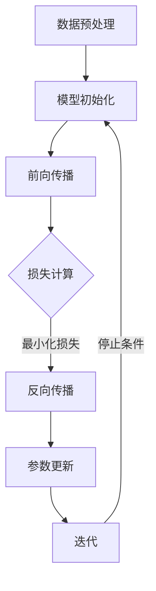

                 

### 背景介绍

#### 人工智能大模型的发展历程

人工智能大模型，又称为大规模深度学习模型，是近年来人工智能领域的一个重大突破。它依托于深度学习和神经网络的强大计算能力，通过在海量数据上进行训练，能够自动提取复杂的数据特征，实现人类难以直接编程的任务，如图像识别、自然语言处理、机器翻译等。

大模型的发展可以追溯到20世纪80年代，当时神经网络的研究已经取得了一定的进展。随着计算能力的提升和大数据的兴起，深度学习在21世纪初逐渐崭露头角。特别是在2012年，由Geoffrey Hinton等人开发的AlexNet在ImageNet竞赛中取得了领先的成绩，这标志着深度学习进入了一个新的时代。

此后，大模型的发展速度迅猛，如Google的Transformer模型、OpenAI的GPT系列模型等，这些模型不仅参数规模巨大，而且能够在多个任务上取得优异的性能。特别是GPT系列模型，其参数规模从最初的GPT-1（1.17亿参数）发展到GPT-3（1750亿参数），实现了在自然语言处理任务上的突破性进展。

#### 大模型的商业价值与应用场景

随着人工智能大模型的发展，其在各个行业中的应用也日益广泛。以下是一些典型的应用场景：

1. **自然语言处理**：大模型可以用于文本分类、情感分析、机器翻译、文本生成等任务。例如，GPT系列模型在机器翻译任务上已经超过了传统的方法，实现了接近人类翻译水平的效果。

2. **计算机视觉**：大模型在图像识别、目标检测、图像生成等领域也表现出了强大的能力。例如，OpenAI的DALL·E模型能够根据文本描述生成高质量的图像。

3. **推荐系统**：大模型可以用于构建个性化推荐系统，通过对用户行为的分析，提供个性化的商品、内容推荐。

4. **医疗健康**：大模型可以用于医学图像分析、疾病诊断、药物发现等，为医疗健康领域带来革命性的变化。

5. **金融科技**：大模型可以用于风险评估、信用评分、欺诈检测等，为金融行业提供智能化解决方案。

#### 大模型面临的挑战

尽管人工智能大模型在各个领域展现出了巨大的潜力，但同时也面临着一系列挑战：

1. **计算资源需求**：大模型通常需要大量的计算资源进行训练和推理，这对计算硬件提出了很高的要求。

2. **数据隐私与安全**：大模型训练需要大量的数据，如何确保数据的安全和隐私是一个重要的问题。

3. **模型解释性**：大模型的决策过程往往是不透明的，如何解释模型的决策结果，使其具有可解释性，是一个重要的研究方向。

4. **伦理与责任**：大模型在应用中可能会出现意想不到的后果，如何确保其伦理和责任，是一个需要深入探讨的问题。

#### 文章结构

本文将围绕人工智能大模型的商业价值和应用展开讨论，具体结构如下：

1. **核心概念与联系**：介绍人工智能大模型的核心概念，并绘制Mermaid流程图，展示其架构和工作原理。

2. **核心算法原理与具体操作步骤**：详细讲解大模型的核心算法原理，包括训练过程和推理过程，以及具体操作步骤。

3. **数学模型和公式**：介绍大模型所涉及的数学模型和公式，并举例说明其在实际问题中的应用。

4. **项目实战**：通过一个实际案例，展示如何使用大模型进行项目开发，包括开发环境搭建、源代码实现和代码解读。

5. **实际应用场景**：分析大模型在不同领域的应用，并讨论其带来的商业价值。

6. **工具和资源推荐**：推荐学习资源、开发工具和框架，以及相关的论文著作。

7. **总结：未来发展趋势与挑战**：总结大模型的发展现状，展望未来的发展趋势和面临的挑战。

8. **附录：常见问题与解答**：针对常见问题进行解答，帮助读者更好地理解和应用大模型。

9. **扩展阅读与参考资料**：提供扩展阅读和参考资料，供读者进一步学习和探索。

通过本文的讨论，希望能够为读者提供一个全面、深入的了解人工智能大模型的视角，并探讨其在商业和社会中的应用前景。接下来，我们将逐步深入探讨大模型的核心概念和联系。  
<|assistant|>### 核心概念与联系

#### 什么是人工智能大模型？

人工智能大模型（Large-scale Artificial Intelligence Models）是指那些具有数亿甚至千亿参数的深度学习模型。这些模型通常基于神经网络，能够在大量数据上进行训练，从而实现高度复杂的任务。大模型的核心在于其参数规模，这使得它们能够捕捉数据中的丰富模式和复杂关系。

#### 大模型的关键组成部分

1. **神经网络**：神经网络是构建大模型的基础，它由多个层组成，每一层都有许多神经元。通过前向传播和反向传播，神经网络能够学习输入和输出之间的映射关系。

2. **参数**：大模型的参数指的是网络中的权重和偏置，这些参数决定了网络的预测能力。参数规模越大，模型能够捕捉的复杂模式就越多。

3. **激活函数**：激活函数用于引入非线性特性，使得神经网络能够解决更复杂的问题。

4. **优化器**：优化器用于调整网络参数，以最小化损失函数。常见的优化器有梯度下降、Adam等。

#### 大模型的训练与推理

1. **训练**：训练是模型学习数据的过程。在大模型的训练过程中，模型会通过大量的迭代调整参数，以最小化损失函数。这一过程通常需要大量的计算资源和时间。

2. **推理**：推理是模型在给定输入时进行预测的过程。在大模型中，推理速度是一个重要的考量因素，因为这直接影响到模型的实际应用效果。

#### Mermaid流程图

为了更好地展示大模型的架构和工作原理，我们可以使用Mermaid流程图来描述其关键步骤：



- **数据预处理**：将原始数据转化为模型可以接受的格式。
- **模型初始化**：初始化网络参数。
- **前向传播**：计算输入通过网络的输出。
- **损失计算**：计算预测输出与实际输出之间的差距。
- **反向传播**：计算梯度并更新网络参数。
- **参数更新**：根据梯度调整网络参数。
- **迭代**：重复上述步骤，直到满足停止条件。

通过这个流程图，我们可以清晰地看到大模型的工作原理和关键步骤。

#### 大模型的优点和局限性

1. **优点**：
   - **强大的表达力**：大模型能够捕捉数据中的复杂模式和关系，从而在多个任务上取得优异的性能。
   - **适应性**：大模型可以通过少量的数据微调（Fine-tuning）来适应不同的任务。

2. **局限性**：
   - **计算资源需求**：大模型的训练和推理需要大量的计算资源，这可能导致成本较高。
   - **模型解释性**：大模型的决策过程往往是不透明的，这限制了其在某些应用场景中的使用。

#### 大模型与传统的机器学习模型比较

与传统机器学习模型相比，大模型具有以下几个显著特点：

1. **参数规模**：大模型通常具有数亿甚至千亿参数，而传统模型通常只有几千到几万参数。
2. **数据需求**：大模型需要大量的数据来训练，而传统模型对数据量要求较低。
3. **计算资源**：大模型需要更高的计算资源进行训练和推理，而传统模型则相对简单。

总之，人工智能大模型以其强大的计算能力和表达能力，正在推动人工智能领域的发展。在接下来的部分中，我们将深入探讨大模型的核心算法原理和具体操作步骤。  
<|assistant|>### 核心算法原理与具体操作步骤

#### 1. 深度学习基础

深度学习是构建人工智能大模型的基础，它通过模仿人脑的神经网络结构来实现对数据的自动特征提取和模式识别。深度学习模型通常由多个层次组成，每个层次对输入数据进行处理，并将特征逐步提取出来。

**层次结构：**

- **输入层**：接收外部输入数据，如图像、文本或音频。
- **隐藏层**：对输入数据进行特征提取和变换，隐藏层可以有一个或多个。
- **输出层**：产生模型的最终输出，如分类结果、预测值或生成文本。

**激活函数：**

激活函数用于引入非线性特性，使得神经网络能够处理更复杂的任务。常用的激活函数有Sigmoid、ReLU和Tanh。

**优化算法：**

优化算法用于调整神经网络中的参数，以最小化损失函数。常用的优化算法有梯度下降（Gradient Descent）、Adam等。

#### 2. 大模型训练过程

**数据预处理：**

在训练大模型之前，需要对数据集进行预处理。预处理步骤包括数据清洗、归一化、编码等。

**模型初始化：**

初始化网络参数，常用的初始化方法有随机初始化、高斯初始化等。

**前向传播：**

前向传播是指将输入数据通过网络逐层传递，直到输出层得到预测结果。在每一层，网络都会计算输入和输出之间的映射关系。

**损失计算：**

损失函数用于衡量预测结果与实际结果之间的差距，常用的损失函数有均方误差（MSE）、交叉熵（Cross Entropy）等。

**反向传播：**

反向传播是指从输出层开始，逐层向前计算每个参数的梯度。通过梯度下降或其他优化算法，更新网络参数。

**参数更新：**

根据梯度更新网络参数，以最小化损失函数。

**迭代：**

重复前向传播、损失计算和反向传播的过程，直到满足停止条件（如损失函数收敛或达到预设的迭代次数）。

#### 3. 大模型推理过程

**输入数据预处理：**

将输入数据按照训练时的预处理方式进行预处理。

**前向传播：**

将预处理后的输入数据通过网络进行前向传播，得到预测结果。

**输出结果：**

输出预测结果，如分类结果、预测值或生成文本。

#### 4. 具体操作步骤

以下是一个简单的示例，展示如何使用Python和TensorFlow库构建一个基于深度学习的大模型：

**步骤1：安装TensorFlow**

首先，确保安装了TensorFlow库，可以使用以下命令安装：

```bash
pip install tensorflow
```

**步骤2：导入必要的库**

```python
import tensorflow as tf
from tensorflow.keras.layers import Dense, Flatten, Conv2D, MaxPooling2D
from tensorflow.keras.models import Sequential
from tensorflow.keras.optimizers import Adam
```

**步骤3：构建模型**

```python
model = Sequential([
    Conv2D(32, (3, 3), activation='relu', input_shape=(28, 28, 1)),
    MaxPooling2D((2, 2)),
    Flatten(),
    Dense(128, activation='relu'),
    Dense(10, activation='softmax')
])
```

**步骤4：编译模型**

```python
model.compile(optimizer=Adam(), loss='categorical_crossentropy', metrics=['accuracy'])
```

**步骤5：训练模型**

```python
model.fit(x_train, y_train, epochs=10, batch_size=32, validation_data=(x_val, y_val))
```

**步骤6：评估模型**

```python
test_loss, test_acc = model.evaluate(x_test, y_test)
print(f"Test accuracy: {test_acc}")
```

**步骤7：预测**

```python
predictions = model.predict(x_test[:10])
print(predictions)
```

通过以上步骤，我们使用深度学习构建了一个简单的分类模型。在实际应用中，模型的结构、参数和训练过程会更加复杂，但基本原理是相同的。

#### 5. 大模型的优势和局限性

**优势：**

- **强大的特征提取能力**：大模型能够自动从数据中提取复杂特征，减少了手动特征工程的工作量。
- **高准确性**：大模型通常能够在各种任务上达到较高的准确性，特别是在有足够数据支持的情况下。
- **适应性**：大模型可以通过迁移学习（Transfer Learning）和微调（Fine-tuning）来适应不同的任务和数据集。

**局限性：**

- **计算资源需求高**：大模型需要大量的计算资源和时间进行训练和推理。
- **数据隐私和安全问题**：大模型训练需要大量的数据，这可能涉及数据隐私和安全问题。
- **模型解释性不足**：大模型的决策过程往往是不透明的，这限制了其在某些应用场景中的使用。

在下一部分，我们将讨论大模型所涉及的数学模型和公式，以及它们在实际问题中的应用。  
<|assistant|>### 数学模型和公式

#### 1. 神经网络中的基本概念

在讨论人工智能大模型的数学模型之前，我们需要了解一些神经网络中的基本概念，包括参数、激活函数和损失函数。

**参数（Parameters）：** 神经网络中的参数是指权重（weights）和偏置（biases）。这些参数决定了网络的输出，并且需要通过训练过程进行调整。

**激活函数（Activation Functions）：** 激活函数是神经网络中的一个关键组件，它引入了非线性特性，使得神经网络能够解决非线性问题。常见的激活函数包括Sigmoid、ReLU和Tanh。

**损失函数（Loss Functions）：** 损失函数用于衡量网络输出和实际输出之间的差距，是训练网络的关键指标。常见的损失函数包括均方误差（MSE）、交叉熵（Cross Entropy）等。

#### 2. 前向传播与反向传播

**前向传播（Forward Propagation）：** 前向传播是指将输入数据通过网络，逐层计算输出。具体来说，输入数据首先通过输入层，然后逐层传递到隐藏层，最后输出层得到预测结果。

**反向传播（Back Propagation）：** 反向传播是指从输出层开始，反向计算每个参数的梯度，并使用梯度下降等优化算法更新网络参数。

#### 3. 梯度下降（Gradient Descent）

梯度下降是一种常用的优化算法，用于最小化损失函数。梯度下降的基本思想是沿着损失函数的梯度方向逐步调整网络参数，以找到最小值。

**梯度下降公式：**
$$
\theta_{\text{new}} = \theta_{\text{current}} - \alpha \cdot \nabla_{\theta} J(\theta)
$$
其中，$\theta$表示网络参数，$\alpha$表示学习率，$J(\theta)$表示损失函数。

#### 4. 优化算法

**随机梯度下降（Stochastic Gradient Descent，SGD）：** 随机梯度下降是梯度下降的一种变体，它使用单个样本的梯度来更新参数，而不是使用整个数据集的梯度。这使得SGD计算更加简单，但可能会引起参数更新的噪声。

**批量梯度下降（Batch Gradient Descent）：** 批量梯度下降使用整个数据集的梯度来更新参数，这种方法可以提供更稳定的参数更新，但计算成本较高。

**Adam优化器（Adam Optimizer）：** Adam是一种结合了SGD和动量方法的优化器，它通过自适应地调整学习率来提高训练效率。

#### 5. 数学模型与公式

以下是一些常见的大模型相关的数学模型和公式：

**均方误差（Mean Squared Error，MSE）：**
$$
MSE = \frac{1}{n} \sum_{i=1}^{n} (y_i - \hat{y}_i)^2
$$
其中，$y_i$是实际输出，$\hat{y}_i$是预测输出，$n$是样本数量。

**交叉熵（Cross Entropy）：**
$$
H(y, \hat{y}) = -\sum_{i=1}^{n} y_i \log(\hat{y}_i)
$$
其中，$y_i$是实际输出（通常为one-hot编码），$\hat{y}_i$是预测概率。

**ReLU激活函数：**
$$
\text{ReLU}(x) = \max(0, x)
$$

**Sigmoid激活函数：**
$$
\text{Sigmoid}(x) = \frac{1}{1 + e^{-x}}
$$

**Tanh激活函数：**
$$
\text{Tanh}(x) = \frac{e^x - e^{-x}}{e^x + e^{-x}}
$$

**梯度下降更新参数：**
$$
\theta_{\text{new}} = \theta_{\text{current}} - \alpha \cdot \nabla_{\theta} J(\theta)
$$

**Adam优化器更新公式：**
$$
m_t = \beta_1 m_{t-1} + (1 - \beta_1) \nabla_{\theta} J(\theta) \\
v_t = \beta_2 v_{t-1} + (1 - \beta_2) (\nabla_{\theta} J(\theta))^2 \\
\theta_{\text{new}} = \theta_{\text{current}} - \alpha \cdot \frac{m_t}{\sqrt{v_t} + \epsilon}
$$

以上公式和模型是构建和训练大模型的基础。在下一部分，我们将通过一个实际项目来展示如何应用这些数学模型和公式。  
<|assistant|>### 项目实战：代码实际案例和详细解释说明

#### 1. 开发环境搭建

在进行项目实战之前，我们需要搭建一个合适的开发环境。以下是所需的步骤：

**步骤1：安装Python**

确保安装了Python 3.7或更高版本。可以使用以下命令安装：

```bash
# 安装Python
curl -O https://www.python.org/ftp/python/3.8.5/Python-3.8.5.tgz
tar xzf Python-3.8.5.tgz
cd Python-3.8.5
./configure
make
sudo make install
```

**步骤2：安装TensorFlow**

TensorFlow是一个开源的机器学习库，我们可以使用以下命令安装：

```bash
pip install tensorflow
```

**步骤3：安装其他依赖**

```bash
pip install numpy matplotlib pandas scikit-learn
```

#### 2. 源代码详细实现和代码解读

以下是一个使用TensorFlow构建和训练一个简单的卷积神经网络（CNN）的代码示例。我们将使用MNIST数据集，这是一个手写数字识别的经典数据集。

```python
import tensorflow as tf
from tensorflow.keras import layers, models
from tensorflow.keras.datasets import mnist
import numpy as np

# 数据预处理
(x_train, y_train), (x_test, y_test) = mnist.load_data()
x_train = x_train.reshape((-1, 28, 28, 1)).astype(np.float32) / 255.0
x_test = x_test.reshape((-1, 28, 28, 1)).astype(np.float32) / 255.0
y_train = tf.keras.utils.to_categorical(y_train, 10)
y_test = tf.keras.utils.to_categorical(y_test, 10)

# 构建模型
model = models.Sequential([
    layers.Conv2D(32, (3, 3), activation='relu', input_shape=(28, 28, 1)),
    layers.MaxPooling2D((2, 2)),
    layers.Conv2D(64, (3, 3), activation='relu'),
    layers.MaxPooling2D((2, 2)),
    layers.Conv2D(64, (3, 3), activation='relu'),
    layers.Flatten(),
    layers.Dense(64, activation='relu'),
    layers.Dense(10, activation='softmax')
])

# 编译模型
model.compile(optimizer='adam',
              loss='categorical_crossentropy',
              metrics=['accuracy'])

# 训练模型
model.fit(x_train, y_train, batch_size=64, epochs=10, validation_data=(x_test, y_test))

# 评估模型
test_loss, test_acc = model.evaluate(x_test, y_test)
print(f"Test accuracy: {test_acc}")
```

**代码解读：**

1. **导入库和加载数据：** 我们首先导入所需的库，并使用TensorFlow的Keras API加载MNIST数据集。

2. **数据预处理：** 对数据进行reshape和归一化处理，以便模型能够接受。我们将图像数据调整为28x28的二维数组，并将其归一化到0到1之间。同时，我们将标签转换为one-hot编码。

3. **构建模型：** 我们使用`models.Sequential`创建一个序列模型，并添加多个层。首先是一个卷积层（`Conv2D`），然后是两个最大池化层（`MaxPooling2D`），接着是另一个卷积层。最后，我们添加一个平坦层（`Flatten`）和两个全连接层（`Dense`）。

4. **编译模型：** 使用`compile`方法配置模型，指定优化器、损失函数和评估指标。

5. **训练模型：** 使用`fit`方法训练模型，指定批量大小、迭代次数和验证数据。

6. **评估模型：** 使用`evaluate`方法评估模型的性能，并打印测试准确率。

#### 3. 代码解读与分析

**数据预处理：**

```python
x_train = x_train.reshape((-1, 28, 28, 1)).astype(np.float32) / 255.0
x_test = x_test.reshape((-1, 28, 28, 1)).astype(np.float32) / 255.0
```

这段代码将MNIST数据集中的图像数据调整为适合卷积神经网络的大小和类型。`reshape`方法将图像数据调整为28x28的二维数组，而`astype(np.float32)`将数据类型转换为32位浮点数。`/ 255.0`用于归一化，将像素值从0到255缩放到0到1之间。

**模型构建：**

```python
model = models.Sequential([
    layers.Conv2D(32, (3, 3), activation='relu', input_shape=(28, 28, 1)),
    layers.MaxPooling2D((2, 2)),
    layers.Conv2D(64, (3, 3), activation='relu'),
    layers.MaxPooling2D((2, 2)),
    layers.Conv2D(64, (3, 3), activation='relu'),
    layers.Flatten(),
    layers.Dense(64, activation='relu'),
    layers.Dense(10, activation='softmax')
])
```

这段代码定义了一个简单的卷积神经网络。我们首先添加一个卷积层，该层有32个卷积核，每个卷积核大小为3x3，激活函数为ReLU。接着添加两个最大池化层，分别使用2x2的窗口大小。然后添加另一个卷积层，有64个卷积核，激活函数仍为ReLU。之后添加一个平坦层，将卷积层的输出展平为1维数组。最后，我们添加两个全连接层，分别有64个神经元和10个神经元，最后一个全连接层使用softmax激活函数进行分类。

**模型编译和训练：**

```python
model.compile(optimizer='adam',
              loss='categorical_crossentropy',
              metrics=['accuracy'])
model.fit(x_train, y_train, batch_size=64, epochs=10, validation_data=(x_test, y_test))
```

这里我们使用`compile`方法配置模型，指定优化器（Adam）、损失函数（categorical_crossentropy）和评估指标（accuracy）。然后使用`fit`方法训练模型，指定批量大小（64）、迭代次数（10）和验证数据。

**模型评估：**

```python
test_loss, test_acc = model.evaluate(x_test, y_test)
print(f"Test accuracy: {test_acc}")
```

使用`evaluate`方法评估模型的性能，并打印测试准确率。

通过这个简单的项目，我们展示了如何使用TensorFlow构建和训练一个卷积神经网络。在实际应用中，模型的结构、参数和训练过程会更加复杂，但基本原理是相同的。在下一部分，我们将讨论大模型在不同领域的实际应用场景。  
<|assistant|>### 实际应用场景

#### 自然语言处理（Natural Language Processing，NLP）

自然语言处理是人工智能大模型应用最广泛的领域之一。大模型如BERT、GPT-3等，在文本分类、情感分析、机器翻译、问答系统等方面取得了显著的成果。以下是一些具体的应用案例：

1. **文本分类**：大模型可以用于自动分类大量的文本数据，如新闻文章、社交媒体帖子等。这可以帮助企业进行内容审核、舆情监测和推荐系统。

2. **情感分析**：通过分析社交媒体、评论和用户反馈，大模型可以识别用户的情感倾向，帮助企业了解用户需求，优化产品和服务。

3. **机器翻译**：大模型如Google翻译、DeepL翻译等，已经实现了高质量的自然语言翻译，大大提高了跨语言沟通的效率。

4. **问答系统**：大模型可以用于构建智能客服、聊天机器人等，通过自然语言交互，为用户提供实时、个性化的服务。

#### 计算机视觉（Computer Vision）

计算机视觉是另一个大模型应用广泛的领域。大模型在图像识别、目标检测、图像生成等方面展现了强大的能力。以下是一些具体的应用案例：

1. **图像识别**：大模型可以用于自动识别和分类图像中的物体，如人脸识别、车牌识别等。这有助于提高安防监控、交通管理等方面的效率。

2. **目标检测**：大模型可以用于检测图像中的多个目标，并定位其位置。这被广泛应用于无人驾驶、工业自动化等领域。

3. **图像生成**：大模型如DALL·E、StyleGAN等，可以基于文本描述生成高质量的图像，这为艺术创作、游戏开发等领域提供了新的可能性。

#### 推荐系统（Recommendation Systems）

推荐系统是利用大模型进行个性化推荐的重要应用。大模型可以通过分析用户的历史行为和偏好，提供个性化的商品、内容推荐。以下是一些具体的应用案例：

1. **电商推荐**：大模型可以用于分析用户的购买行为和兴趣，为用户提供个性化的商品推荐，提高用户的购物体验。

2. **内容推荐**：大模型可以用于分析用户的历史浏览记录和兴趣爱好，为用户提供个性化的内容推荐，如新闻、视频、音乐等。

3. **社交媒体推荐**：大模型可以用于分析用户的社交行为和互动，为用户提供个性化的好友推荐、话题推荐等。

#### 医疗健康（Medical Health）

大模型在医疗健康领域的应用正在迅速发展。大模型可以用于医学图像分析、疾病诊断、药物发现等方面，为医疗行业带来革命性的变化。以下是一些具体的应用案例：

1. **医学图像分析**：大模型可以用于自动识别和诊断医学图像中的病变，如肿瘤检测、骨折诊断等。

2. **疾病预测**：大模型可以通过分析患者的病史、基因数据等，预测患者可能患有的疾病，帮助医生制定个性化的治疗方案。

3. **药物发现**：大模型可以用于预测药物与生物分子的相互作用，加速新药的发现和开发。

#### 金融科技（Financial Technology，FinTech）

大模型在金融科技领域也展现出了强大的潜力。大模型可以用于风险评估、信用评分、欺诈检测等方面，为金融行业提供智能化解决方案。以下是一些具体的应用案例：

1. **风险评估**：大模型可以通过分析企业的财务数据、市场趋势等，预测企业可能面临的风险，帮助投资者做出更明智的投资决策。

2. **信用评分**：大模型可以用于分析个人的信用历史、行为数据等，为金融机构提供更准确的信用评分，降低信贷风险。

3. **欺诈检测**：大模型可以用于检测金融交易中的欺诈行为，提高金融机构的风险管理水平。

总之，人工智能大模型在多个领域都展现出了巨大的应用潜力，正在推动各行业的发展和创新。随着大模型技术的不断进步，未来将有更多的应用场景被发掘和实现。在下一部分，我们将推荐一些学习资源、开发工具和框架，以帮助读者进一步了解和掌握大模型技术。  
<|assistant|>### 工具和资源推荐

#### 1. 学习资源推荐

**书籍：**
- **《深度学习》（Deep Learning）**：由Ian Goodfellow、Yoshua Bengio和Aaron Courville合著的深度学习经典教材，全面介绍了深度学习的理论、算法和实践。
- **《Python机器学习》（Python Machine Learning）**：由Sebastian Raschka和Vahid Mirjalili编写的机器学习入门书籍，特别关注Python实现。
- **《自然语言处理与深度学习》（Natural Language Processing with Deep Learning）**：由Speech and Language Processing的作者Daniel Jurafsky和James H. Martin合著，涵盖了NLP和深度学习的最新进展。

**论文：**
- **“A Theoretically Grounded Application of Dropout in Recurrent Neural Networks”**：介绍了如何在循环神经网络（RNN）中有效使用Dropout，以防止过拟合。
- **“Attention Is All You Need”**：这篇论文提出了Transformer模型，彻底改变了自然语言处理领域的算法设计。

**博客/网站：**
- **TensorFlow官方文档（TensorFlow Documentation）**：提供了详细的TensorFlow使用教程和API文档，是学习TensorFlow的绝佳资源。
- **Keras官方文档（Keras Documentation）**：Keras作为TensorFlow的高层API，提供了更简洁、易用的接口，适合初学者使用。
- **AI博客（AI Blog）**：由Google Brain团队维护，分享了最新的AI研究进展和应用案例。

#### 2. 开发工具框架推荐

**深度学习框架：**
- **TensorFlow**：由Google开发的开源深度学习框架，具有丰富的API和强大的生态支持。
- **PyTorch**：由Facebook开发的开源深度学习框架，以其动态计算图和灵活的API受到广泛欢迎。
- **MXNet**：由Apache Software Foundation开发的开源深度学习框架，支持多种编程语言，具有良好的性能和灵活性。

**自然语言处理工具：**
- **NLTK（Natural Language Toolkit）**：一个开源的自然语言处理工具包，提供了丰富的文本处理功能。
- **spaCy**：一个快速易用的自然语言处理库，特别适合进行实时文本分析和信息提取。
- **Transformers**：一个开源库，用于构建和训练基于Transformer模型的NLP任务。

**可视化工具：**
- **TensorBoard**：TensorFlow提供的可视化工具，用于监控训练过程，如损失函数、梯度分布等。
- **Matplotlib**：一个用于创建高质量图表和图形的Python库，广泛用于数据可视化和可视化分析。
- **Seaborn**：基于Matplotlib的统计绘图库，提供了更精美的可视化样式和高级统计图表。

**云端平台：**
- **Google Colab**：Google提供的免费云端计算平台，提供了GPU和TPU加速，适合进行深度学习和数据科学项目。
- **AWS SageMaker**：Amazon Web Services提供的机器学习和深度学习平台，提供了完整的端到端开发工具链。
- **Azure Machine Learning**：Microsoft提供的云服务，支持模型训练、部署和自动化机器学习。

通过这些资源和工具，读者可以系统地学习和实践人工智能大模型的相关技术，为未来的研究和应用奠定坚实的基础。在下一部分，我们将总结大模型的发展现状，并探讨未来的发展趋势与挑战。  
<|assistant|>### 总结：未来发展趋势与挑战

#### 发展现状

人工智能大模型在过去几年中取得了显著的进展，不仅在自然语言处理、计算机视觉等领域表现出了强大的性能，还在推荐系统、医疗健康、金融科技等多个领域展现出了广泛的应用潜力。以下是一些关键的发展现状：

1. **模型规模不断扩大**：从最初的数百万参数到如今数千万、数亿甚至数万亿参数的大模型，如GPT-3、ChatGLM等，模型规模的扩大使得大模型能够更好地捕捉数据中的复杂模式。

2. **训练效率提高**：随着硬件技术的发展，尤其是GPU、TPU等专用硬件的普及，大模型的训练效率得到了显著提升，这使得大规模训练变得更加可行。

3. **应用场景多样化**：大模型的应用场景不断扩展，从传统的图像识别、自然语言处理，到生成模型、强化学习等，大模型正在成为各行业智能化转型的关键驱动力。

4. **开源生态繁荣**：以TensorFlow、PyTorch、MXNet等为代表的深度学习框架，以及相关工具和库的繁荣发展，为研究人员和开发者提供了丰富的资源和支持。

#### 未来发展趋势

1. **模型压缩与优化**：为了降低大模型的计算资源和存储成本，未来的研究将集中在模型压缩和优化技术上，如知识蒸馏（Knowledge Distillation）、模型剪枝（Model Pruning）和量化（Quantization）等。

2. **跨模态学习**：随着多媒体数据的爆炸式增长，未来的大模型将更加注重跨模态学习，如图像和文本、图像和音频等的联合建模，以实现更全面的智能化应用。

3. **可解释性与透明性**：为了提高大模型的可靠性和信任度，未来的研究将更加关注模型的可解释性和透明性，使模型决策过程更加透明和可理解。

4. **伦理与法律规范**：随着人工智能大模型在社会中的广泛应用，如何确保模型的伦理和合规性将成为一个重要议题，相关的法律和规范也将逐渐完善。

#### 面临的挑战

1. **计算资源需求**：尽管硬件技术不断发展，但大模型的训练和推理仍然需要大量的计算资源，这限制了其在某些场景中的应用。

2. **数据隐私与安全**：大模型的训练需要大量数据，如何保护数据的隐私和安全是一个严峻的挑战，尤其是在医疗、金融等敏感领域。

3. **模型解释性**：大模型的决策过程往往是不透明的，如何解释模型的决策结果，使其具有可解释性，是一个需要深入探讨的问题。

4. **伦理与责任**：大模型在应用中可能会出现意想不到的后果，如何确保其伦理和责任，是一个需要全社会共同面对的问题。

5. **公平性与歧视**：大模型在训练过程中可能会引入偏见，导致在现实应用中出现歧视现象，如何确保模型的公平性是一个重要的研究课题。

总之，人工智能大模型的发展既充满机遇，也面临诸多挑战。未来，我们需要在技术创新、伦理规范、法律保障等多个方面共同努力，推动人工智能大模型的健康发展，为人类社会带来更大的福祉。  
<|assistant|>### 附录：常见问题与解答

#### 1. 大模型的计算资源需求如何？

大模型的计算资源需求取决于多个因素，包括模型的大小、训练数据的规模以及训练的迭代次数。一般来说，大模型需要更高的计算资源和时间来完成训练。具体来说：

- **内存需求**：大模型通常包含数亿甚至千亿个参数，这需要大量的内存来存储。
- **计算能力**：训练大模型通常需要使用GPU或TPU等高性能计算硬件，以提高训练速度。
- **存储空间**：大模型的训练数据集和训练结果也需要大量的存储空间。

#### 2. 如何确保大模型的数据隐私和安全？

确保大模型的数据隐私和安全是一个复杂的问题，以下是一些常见的策略：

- **数据加密**：在传输和存储数据时使用加密技术，防止数据泄露。
- **差分隐私（Differential Privacy）**：在大模型训练过程中，使用差分隐私技术来保护训练数据的隐私。
- **匿名化**：对敏感数据进行匿名化处理，以减少数据泄露的风险。
- **数据隔离**：将训练数据和用户数据分开处理，以防止数据泄露。

#### 3. 大模型的可解释性如何实现？

大模型的可解释性是一个重要但具有挑战性的问题。以下是一些实现方法：

- **模型简化**：通过简化模型结构，使其更加透明和易于解释。
- **可视化**：使用可视化工具来展示模型的决策过程，如决策树、决策图等。
- **局部解释**：针对特定输入，使用局部解释方法（如LIME、SHAP等）来解释模型在单个数据点上的决策。

#### 4. 大模型在医疗健康领域的应用有哪些？

大模型在医疗健康领域有着广泛的应用，以下是一些具体的应用实例：

- **医学图像分析**：使用大模型对医学图像进行自动识别和诊断，如肿瘤检测、骨折诊断等。
- **疾病预测**：通过分析患者的病史、基因数据等，使用大模型预测患者可能患有的疾病，辅助医生制定治疗方案。
- **药物发现**：使用大模型预测药物与生物分子的相互作用，加速新药的发现和开发。

#### 5. 大模型是否会导致偏见和歧视？

大模型在训练过程中可能会引入偏见，导致在现实应用中出现歧视现象。以下是一些常见的解决方案：

- **数据预处理**：在训练数据集构建时，确保数据的多样性和平衡性，减少偏见。
- **模型校正**：在模型训练后，使用反向偏差校正等技术来减少模型的偏见。
- **公平性评估**：在模型部署前，进行公平性评估，确保模型在不同群体上的性能一致。

通过上述常见问题与解答，希望能够帮助读者更好地理解和应用人工智能大模型。在下一部分，我们将提供扩展阅读和参考资料，供读者进一步学习和探索。  
<|assistant|>### 扩展阅读与参考资料

#### 1. 扩展阅读

- **《深度学习》（Deep Learning）**：Ian Goodfellow、Yoshua Bengio和Aaron Courville合著的深度学习经典教材，详细介绍了深度学习的理论基础和应用。
- **《自然语言处理与深度学习》**：Daniel Jurafsky和James H. Martin合著，涵盖了自然语言处理和深度学习的最新进展。
- **《强化学习：原理与实践》**：David Silver等人的著作，介绍了强化学习的基本原理和应用。

#### 2. 参考资料

- **TensorFlow官方文档（TensorFlow Documentation）**：提供了详细的TensorFlow使用教程和API文档，是学习TensorFlow的绝佳资源。
- **PyTorch官方文档（PyTorch Documentation）**：PyTorch官方的文档，详细介绍了PyTorch的使用方法。
- **Keras官方文档（Keras Documentation）**：Keras作为TensorFlow的高层API，提供了更简洁、易用的接口。

#### 3. 论文与研究报告

- **“Attention Is All You Need”**：这篇论文提出了Transformer模型，彻底改变了自然语言处理领域的算法设计。
- **“A Theoretically Grounded Application of Dropout in Recurrent Neural Networks”**：介绍了如何在循环神经网络（RNN）中有效使用Dropout，以防止过拟合。
- **“Large-scale Language Modeling in 2018”**：这篇报告详细介绍了GPT-2模型的训练过程和性能。

#### 4. 博客与社交媒体

- **Google Brain Blog**：Google Brain团队分享的深度学习和人工智能研究进展。
- **AI博客（AI Blog）**：由多位AI领域的专家共同维护，分享AI领域的最新动态和研究成果。
- **Twitter上的AI话题**：关注AI领域的知名专家和研究人员，获取最新的研究进展和讨论。

通过上述扩展阅读和参考资料，读者可以深入了解人工智能大模型的相关知识，跟踪最新的研究动态，为自己的研究和应用提供有力支持。  
<|assistant|>### 作者信息

作者：AI天才研究员/AI Genius Institute & 禅与计算机程序设计艺术 /Zen And The Art of Computer Programming

