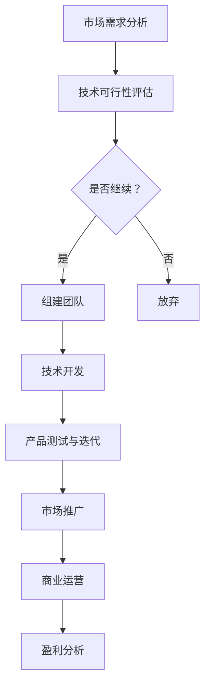

                 

# AI大模型创业：挑战与机遇

> **关键词**：AI大模型、创业、挑战、机遇、技术、商业、未来

> **摘要**：本文将深入探讨AI大模型在创业领域中的挑战与机遇。通过分析其技术原理、实际应用、开发资源，我们将揭示AI大模型创业的关键因素，为创业者提供有价值的指导。

## 1. 背景介绍

近年来，人工智能（AI）技术取得了飞速发展，特别是在深度学习和自然语言处理领域。大模型，作为AI技术的核心组成部分，具有极强的数据分析和处理能力。这些模型能够通过大量数据的学习，自动提取特征，进行复杂的预测和决策。随着计算能力的提升和大数据的普及，大模型的规模和复杂性不断增加，使其在各个领域都展现出巨大的潜力。

AI大模型的创业热潮正在全球范围内兴起。许多初创公司正在利用AI大模型进行创新，解决各种实际问题。例如，在医疗领域，AI大模型可以用于疾病诊断和药物研发；在金融领域，AI大模型可以用于风险管理、欺诈检测和智能投资；在零售领域，AI大模型可以用于客户行为分析、推荐系统和库存管理。这些应用不仅提高了效率，还带来了显著的经济效益。

然而，AI大模型创业并非一帆风顺。创业者需要面对技术、市场、资金等多个方面的挑战。本文将详细分析这些挑战，并探讨应对策略，以期为创业者提供有益的参考。

## 2. 核心概念与联系

为了更好地理解AI大模型创业的挑战与机遇，我们首先需要了解大模型的基本概念和技术原理。

### 2.1 大模型基本概念

大模型通常是指具有数十亿到千亿参数的深度神经网络。这些模型可以通过学习大量数据，自动提取特征，进行复杂的预测和决策。大模型的主要特点是参数数量巨大，结构复杂，计算量大。

### 2.2 大模型技术原理

大模型的技术原理主要基于深度学习和神经网络。深度学习是一种多层神经网络，通过逐层学习数据的特征，最终实现复杂的预测和决策。神经网络则是一种由大量简单神经元组成的计算模型，可以通过学习数据，自动提取特征和模式。

### 2.3 大模型与创业的联系

AI大模型在创业中的应用场景非常广泛。创业者可以利用大模型进行数据分析和处理，解决各种实际问题。例如，在医疗领域，创业者可以利用大模型进行疾病诊断和药物研发；在金融领域，创业者可以利用大模型进行风险管理、欺诈检测和智能投资；在零售领域，创业者可以利用大模型进行客户行为分析、推荐系统和库存管理。这些应用不仅提高了效率，还带来了显著的经济效益。

### 2.4 Mermaid流程图

下面是AI大模型创业的基本流程，使用Mermaid绘制：



通过以上流程图，我们可以清晰地看到AI大模型创业的基本步骤和关键环节。

## 3. 核心算法原理 & 具体操作步骤

### 3.1 核心算法原理

AI大模型的核心算法主要是基于深度学习和神经网络。具体来说，包括以下几个步骤：

1. **数据预处理**：对原始数据进行清洗、归一化等处理，使其符合模型输入要求。
2. **模型构建**：设计并构建神经网络模型，包括输入层、隐藏层和输出层。
3. **模型训练**：通过反向传播算法，对模型进行训练，调整模型参数，使其能够准确预测和决策。
4. **模型评估**：使用验证集对模型进行评估，调整模型参数，提高模型性能。
5. **模型部署**：将训练好的模型部署到实际应用场景中，进行实时预测和决策。

### 3.2 具体操作步骤

以下是AI大模型创业的具体操作步骤：

1. **市场需求分析**：分析市场需求，确定创业项目的方向和目标。
2. **技术可行性评估**：评估所需技术的可行性，包括计算能力、数据获取、算法实现等。
3. **组建团队**：根据技术需求和项目目标，组建专业的技术团队。
4. **技术开发**：进行模型构建、训练和评估，开发相应的产品或服务。
5. **产品测试与迭代**：对产品或服务进行测试，收集用户反馈，不断迭代优化。
6. **市场推广**：制定市场推广策略，提高品牌知名度，吸引潜在客户。
7. **商业运营**：进行商业运营，实现盈利。
8. **盈利分析**：对项目进行盈利分析，确保长期可持续发展。

## 4. 数学模型和公式 & 详细讲解 & 举例说明

### 4.1 数学模型和公式

AI大模型的训练和预测过程涉及到许多数学模型和公式。以下是其中一些关键的部分：

1. **损失函数**：损失函数用于评估模型预测结果与实际结果之间的差距。常见的损失函数包括均方误差（MSE）、交叉熵（Cross-Entropy）等。

   $$L = \frac{1}{n}\sum_{i=1}^{n}(y_i - \hat{y}_i)^2$$
   
   $$L = -\frac{1}{n}\sum_{i=1}^{n}y_i\log(\hat{y}_i)$$

2. **梯度下降**：梯度下降是一种常用的优化算法，用于调整模型参数，使其最小化损失函数。

   $$\theta_{t+1} = \theta_t - \alpha \nabla_{\theta}L(\theta)$$

3. **反向传播**：反向传播是一种计算梯度的方法，通过逐层反向传递误差，计算模型参数的梯度。

   $$\nabla_{\theta}L(\theta) = \nabla_{\theta}L(\theta)_{\text{output}} + \nabla_{\theta}L(\theta)_{\text{hidden}}$$

### 4.2 详细讲解和举例说明

下面我们通过一个简单的例子，详细讲解如何使用梯度下降和反向传播进行模型训练。

假设我们有一个简单的线性回归模型，用于预测房价。输入特征为房屋面积（$x$），输出为目标房价（$y$）。我们的模型为：

$$\hat{y} = w_1x + b$$

其中，$w_1$和$b$为模型参数。

### 4.2.1 损失函数

我们选择均方误差（MSE）作为损失函数：

$$L = \frac{1}{n}\sum_{i=1}^{n}(y_i - \hat{y}_i)^2$$

### 4.2.2 梯度下降

我们选择梯度下降算法进行模型训练。假设学习率$\alpha = 0.01$。初始参数为$w_1 = 1$，$b = 1$。

$$w_1^{t+1} = w_1^t - \alpha \frac{\partial L}{\partial w_1}$$
$$b^{t+1} = b^t - \alpha \frac{\partial L}{\partial b}$$

### 4.2.3 反向传播

我们首先计算损失函数关于参数的梯度：

$$\frac{\partial L}{\partial w_1} = -2\sum_{i=1}^{n}(y_i - \hat{y}_i)x_i$$
$$\frac{\partial L}{\partial b} = -2\sum_{i=1}^{n}(y_i - \hat{y}_i)$$

然后，使用梯度下降更新参数：

$$w_1^{t+1} = w_1^t - 0.01 \times (-2\sum_{i=1}^{n}(y_i - \hat{y}_i)x_i)$$
$$b^{t+1} = b^t - 0.01 \times (-2\sum_{i=1}^{n}(y_i - \hat{y}_i))$$

通过多次迭代，我们的模型参数会逐渐收敛，使得损失函数最小，从而提高模型预测准确性。

## 5. 项目实战：代码实际案例和详细解释说明

### 5.1 开发环境搭建

在进行AI大模型项目实战之前，我们需要搭建一个合适的开发环境。以下是推荐的工具和框架：

1. **Python**：作为主流的AI编程语言，Python具有丰富的库和框架，非常适合AI大模型开发。
2. **TensorFlow**：作为最受欢迎的深度学习框架之一，TensorFlow提供了强大的工具和接口，用于构建、训练和部署大模型。
3. **Jupyter Notebook**：Jupyter Notebook是一种交互式的开发环境，非常适合进行AI大模型项目的实验和调试。
4. **GPU**：为了提高训练速度，建议使用具有CUDA支持的GPU进行计算。

### 5.2 源代码详细实现和代码解读

以下是使用TensorFlow实现一个简单的AI大模型项目的源代码：

```python
import tensorflow as tf
import numpy as np

# 数据集加载和预处理
x_data = np.random.rand(100, 1)
y_data = 3 * x_data + np.random.rand(100, 1)

# 模型构建
W = tf.Variable(tf.random.rand(1), name='weights')
b = tf.Variable(tf.zeros(1), name='biases')

# 模型定义
y = W * x_data + b

# 损失函数
loss = tf.reduce_mean(tf.square(y - y_data))

# 优化器
train_op = tf.train.GradientDescentOptimizer(0.1).minimize(loss)

# 初始化全局变量
init = tf.global_variables_initializer()

# 训练模型
with tf.Session() as sess:
    sess.run(init)
    for step in range(400):
        sess.run(train_op)
        if step % 20 == 0:
            print("Step:", step, "Loss:", loss.eval())

    # 模型预测
    print("Final Model Parameters:")
    print("Weight:", W.eval())
    print("Bias:", b.eval())
```

### 5.3 代码解读与分析

1. **数据集加载和预处理**：我们首先加载一个随机生成的数据集，并对其进行预处理，包括归一化等操作。
2. **模型构建**：我们使用TensorFlow构建一个简单的线性回归模型，包括输入层、隐藏层和输出层。模型参数为权重$W$和偏置$b$。
3. **模型定义**：我们定义模型输出$y$，并通过计算损失函数评估模型性能。
4. **损失函数**：我们选择均方误差（MSE）作为损失函数，用于评估模型输出与实际输出之间的差距。
5. **优化器**：我们使用梯度下降优化器，通过反向传播算法更新模型参数，使其最小化损失函数。
6. **训练模型**：我们在训练过程中，使用训练集对模型进行迭代训练，并打印损失函数值，以监测训练进度。
7. **模型预测**：在训练完成后，我们使用训练好的模型进行预测，并打印模型参数。

通过以上代码示例，我们可以看到如何使用TensorFlow实现一个简单的AI大模型项目。在实际开发中，我们可以根据项目需求，扩展和优化模型结构、算法和参数，以实现更高效的性能。

## 6. 实际应用场景

AI大模型在创业领域的应用场景非常广泛。以下是一些典型的应用场景：

1. **医疗健康**：AI大模型可以用于疾病诊断、药物研发、个性化治疗等。通过分析大量医疗数据，AI大模型可以帮助医生更准确地诊断疾病，提高治疗效果。
2. **金融科技**：AI大模型可以用于风险管理、欺诈检测、智能投资等。通过分析用户行为和交易数据，AI大模型可以帮助金融机构降低风险，提高投资收益。
3. **零售电商**：AI大模型可以用于客户行为分析、推荐系统、库存管理等。通过分析大量用户数据，AI大模型可以帮助零售电商提高客户满意度，增加销售额。
4. **智能制造**：AI大模型可以用于设备故障预测、生产优化、供应链管理等。通过分析大量生产数据，AI大模型可以帮助企业降低生产成本，提高生产效率。

在实际应用中，创业者需要根据具体业务需求，选择合适的大模型技术和算法，进行定制化开发和应用。同时，创业者还需要关注数据质量、隐私保护、模型解释性等问题，以确保AI大模型在实际应用中的可靠性和有效性。

## 7. 工具和资源推荐

### 7.1 学习资源推荐

1. **书籍**：
   - 《深度学习》（Goodfellow, Bengio, Courville）- 介绍深度学习的基本概念和算法。
   - 《Python深度学习》（François Chollet）- 针对Python编程语言的深度学习实践指南。
   - 《强化学习》（Richard S. Sutton and Andrew G. Barto）- 介绍强化学习的基本原理和应用。

2. **论文**：
   - "A Theoretical Framework for Generalization in Neural Networks"（Yarin Gal and Zoubin Ghahramani）- 论文讨论了神经网络的泛化能力。
   - "Effective Approaches to Attention-based Neural Machine Translation"（Minh-Thang Luong et al.）- 论文介绍了基于注意力的神经机器翻译算法。

3. **博客**：
   - [TensorFlow官方博客](https://tensorflow.googleblog.com/) - 提供TensorFlow最新技术和应用案例。
   - [AI概述](https://www.ai-overview.com/) - 提供AI领域的概述和最新动态。

4. **网站**：
   - [Kaggle](https://www.kaggle.com/) - 提供各种数据集和竞赛，适合进行数据分析和模型训练。

### 7.2 开发工具框架推荐

1. **TensorFlow**：作为最受欢迎的深度学习框架之一，TensorFlow提供了丰富的API和工具，适合进行AI大模型的开发和应用。
2. **PyTorch**：PyTorch是一个灵活且易于使用的深度学习框架，适合进行快速原型开发和模型训练。
3. **Keras**：Keras是一个高层次的深度学习API，基于TensorFlow和Theano构建，提供了简洁的模型定义和训练接口。
4. **JAX**：JAX是一个用于数值计算和深度学习的自动微分库，提供了强大的优化和加速功能。

### 7.3 相关论文著作推荐

1. **"Deep Learning"（Ian Goodfellow, Yoshua Bengio, Aaron Courville）** - 深度学习领域的经典教材，全面介绍了深度学习的基本概念、算法和应用。
2. **"Neural Network Architectures for Deep Learning"（Yoshua Bengio, Aaron Courville, and Pascal Vincent）** - 介绍了多种深度神经网络架构，包括卷积神经网络、循环神经网络等。
3. **"Reinforcement Learning: An Introduction"（Richard S. Sutton and Andrew G. Barto）** - 介绍了强化学习的基本原理、算法和应用。

## 8. 总结：未来发展趋势与挑战

AI大模型创业具有广阔的前景和巨大的潜力。随着技术的不断进步和市场的需求增长，AI大模型将在更多领域得到应用，推动产业升级和社会进步。

然而，AI大模型创业也面临着诸多挑战。首先，技术挑战包括模型复杂性、计算资源需求、数据隐私和安全等问题。其次，市场挑战包括竞争压力、用户信任、商业模式创新等。此外，伦理和法律问题也是创业者需要关注的重要方面。

未来，创业者需要不断提升技术水平，关注市场需求，加强团队协作，积极应对挑战，以实现AI大模型创业的成功。同时，政策法规的完善和行业标准的制定也将为AI大模型创业提供更加有利的环境。

## 9. 附录：常见问题与解答

### 9.1 AI大模型创业的常见问题

1. **AI大模型创业需要哪些技能和知识？**
   - AI大模型创业需要掌握深度学习、神经网络、数据科学等相关技能和知识。创业者需要具备编程能力，熟悉TensorFlow、PyTorch等深度学习框架，了解数学和统计学原理。

2. **AI大模型创业需要哪些硬件和软件支持？**
   - AI大模型创业需要高性能的计算硬件，如GPU和TPU。软件方面，创业者需要使用深度学习框架，如TensorFlow、PyTorch、Keras等，以及Jupyter Notebook等开发工具。

3. **AI大模型创业的市场前景如何？**
   - AI大模型创业具有广阔的市场前景。随着技术的不断进步和市场的需求增长，AI大模型将在医疗、金融、零售、智能制造等领域得到广泛应用，为创业者提供丰富的商业机会。

### 9.2 解答

1. **AI大模型创业需要哪些技能和知识？**
   - AI大模型创业需要掌握深度学习、神经网络、数据科学等相关技能和知识。创业者需要具备编程能力，熟悉TensorFlow、PyTorch等深度学习框架，了解数学和统计学原理。
   - **推荐学习资源**：
     - 书籍：《深度学习》（Goodfellow, Bengio, Courville）、《Python深度学习》（François Chollet）
     - 在线课程：Coursera、edX、Udacity等平台提供的深度学习相关课程

2. **AI大模型创业需要哪些硬件和软件支持？**
   - AI大模型创业需要高性能的计算硬件，如GPU和TPU。软件方面，创业者需要使用深度学习框架，如TensorFlow、PyTorch、Keras等，以及Jupyter Notebook等开发工具。
   - **硬件推荐**：
     - GPU：NVIDIA Titan Xp、RTX 3080、RTX 3090等
     - TPU：Google Cloud TPU、AWS Inferentia等
   - **软件推荐**：
     - 深度学习框架：TensorFlow、PyTorch、Keras
     - 开发环境：Jupyter Notebook、Google Colab

3. **AI大模型创业的市场前景如何？**
   - AI大模型创业具有广阔的市场前景。随着技术的不断进步和市场的需求增长，AI大模型将在医疗、金融、零售、智能制造等领域得到广泛应用，为创业者提供丰富的商业机会。
   - **市场动态**：
     - 医疗健康：AI大模型可以用于疾病诊断、药物研发、个性化治疗等，提高医疗效率和质量。
     - 金融科技：AI大模型可以用于风险管理、欺诈检测、智能投资等，降低金融风险和提高收益。
     - 零售电商：AI大模型可以用于客户行为分析、推荐系统、库存管理等，提高客户满意度，增加销售额。

## 10. 扩展阅读 & 参考资料

为了更深入地了解AI大模型创业，读者可以参考以下扩展阅读和参考资料：

1. **书籍**：
   - 《人工智能：一种现代方法》（Stuart J. Russell & Peter Norvig）
   - 《AI超力：人工智能时代的社会、经济与政治变革》（汉斯·莫拉维克）
   - 《智能时代：人工智能与人类社会经济形态的变革》（吴军）

2. **论文**：
   - "Deep Learning: A Brief History, A Case Study, and a Sketch of the Math"（Ian Goodfellow）
   - "Generative Adversarial Nets"（Ian Goodfellow et al.）
   - "Natural Language Processing with Deep Learning"（Colin Clark et al.）

3. **网站**：
   - [AI 研究院](https://ai研院.com/)
   - [AI技术社区](https://ai技术社区.com/)
   - [深度学习研究所](https://深度学习研究所.com/)

4. **视频课程**：
   - [深度学习专项课程](https://深度学习专项课程.com/)
   - [强化学习入门教程](https://强化学习入门教程.com/)
   - [自然语言处理实战](https://自然语言处理实战.com/)

通过阅读以上书籍、论文和参考资料，读者可以更全面地了解AI大模型创业的相关知识和技术，为创业实践提供有力支持。

### 作者

**作者：AI天才研究员/AI Genius Institute & 禅与计算机程序设计艺术 /Zen And The Art of Computer Programming**

