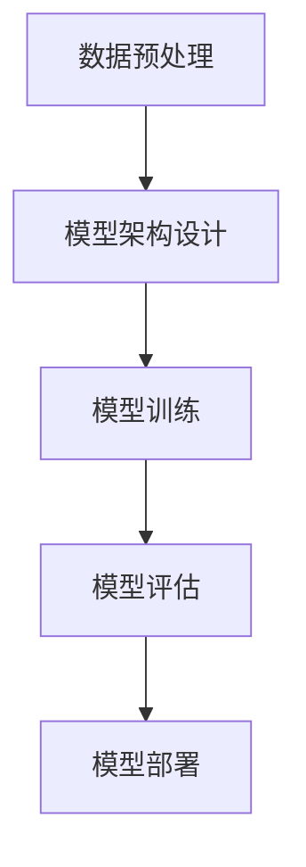

                 

# AI大模型创业：挑战与机遇

## 概述

**关键词：** AI大模型、创业、挑战、机遇、深度学习、技术架构、创业策略、市场趋势。

在当今科技飞速发展的时代，人工智能（AI）已经成为引领创新和变革的核心驱动力。尤其是近年来，随着深度学习技术的突破性进展，AI大模型在各个领域展现出了巨大的潜力。从自然语言处理到图像识别，从自动化决策到智能推荐，AI大模型正在逐步改变我们的生活方式和商业模式。

然而，在AI大模型领域创业并非易事。虽然市场前景广阔，但也面临着众多挑战，如技术壁垒、资金压力、人才竞争等。本文将围绕AI大模型创业这一主题，深入探讨其中的挑战与机遇，帮助有意在这一领域创业的读者们更好地理解和规划自己的道路。

## 摘要

本文将系统性地分析AI大模型创业的现状和前景。首先，我们将介绍AI大模型的基本概念及其在各个领域的应用场景。接着，我们将详细探讨创业过程中可能遇到的技术、市场、资金等方面的挑战，并提供相应的解决方案。随后，我们将分析AI大模型创业的市场机遇，讨论如何抓住这些机遇。最后，本文将总结AI大模型创业的未来发展趋势与潜在风险，为读者提供有价值的参考和指导。

### 目录

1. 背景介绍
2. 核心概念与联系
3. 核心算法原理 & 具体操作步骤
4. 数学模型和公式 & 详细讲解 & 举例说明
5. 项目实战：代码实际案例和详细解释说明
6. 实际应用场景
7. 工具和资源推荐
8. 总结：未来发展趋势与挑战
9. 附录：常见问题与解答
10. 扩展阅读 & 参考资料

### 1. 背景介绍

人工智能（AI）是计算机科学的一个分支，旨在使计算机能够模拟、延伸和扩展人类的智能行为。随着计算能力的提升和大数据的普及，人工智能特别是深度学习技术取得了飞速发展。深度学习是一种通过模拟人脑神经网络结构进行学习和决策的人工智能方法，其在语音识别、图像识别、自然语言处理等领域取得了突破性进展。

AI大模型，即大型深度学习模型，是近年来人工智能领域的一个重要研究方向。这些模型通常包含数十亿甚至千亿个参数，通过海量数据训练，能够实现高度复杂的任务。例如，GPT-3（一个由OpenAI开发的自然语言处理模型）拥有1.75万亿个参数，能够进行自然语言生成、翻译、问答等多种任务。

AI大模型在各个领域都有着广泛的应用。在自然语言处理领域，AI大模型被用于智能客服、文本分析、机器翻译等；在计算机视觉领域，AI大模型被用于图像识别、目标检测、视频分析等；在自动化领域，AI大模型被用于智能决策、自动驾驶、智能制造等。

AI大模型的兴起，不仅推动了传统行业的技术升级，也催生了许多新兴商业模式。例如，基于AI大模型的智能推荐系统已经广泛应用于电子商务、在线教育、社交媒体等领域，为用户提供了更加个性化的服务。此外，AI大模型在医疗领域的应用也备受关注，例如通过AI大模型进行疾病预测、诊断和治疗方案的推荐，有望提高医疗服务的效率和质量。

### 2. 核心概念与联系

#### 深度学习与神经网络

深度学习（Deep Learning）是人工智能的一个重要分支，基于多层神经网络（Neural Networks）的结构，通过模拟人脑的神经元连接和传递信息的方式，进行特征学习和模式识别。深度学习模型通常包含多个隐藏层，每个隐藏层负责提取不同层次的特征，最终输出结果。

神经网络是一种通过模拟生物神经元结构进行信息处理和传递的计算模型。它由输入层、多个隐藏层和输出层组成，每层包含多个神经元。神经元之间通过权重（weights）连接，输入数据经过加权求和并经过激活函数（activation function）处理后，传递到下一层。

#### AI大模型与深度学习

AI大模型是深度学习的一个高级阶段，通常具有数十亿甚至千亿个参数。这些模型通过大规模数据训练，能够自动学习并提取高度复杂的特征，从而实现强大的任务处理能力。AI大模型的核心在于其规模和深度，这使得它们在处理复杂数据和任务时具有显著优势。

#### AI大模型的工作原理

AI大模型的工作原理主要涉及以下步骤：

1. **数据预处理**：对输入数据进行清洗、标准化等处理，使其适合模型训练。
2. **模型架构设计**：根据任务需求设计神经网络的结构，包括层数、每层的神经元数量、激活函数等。
3. **模型训练**：使用大量数据对模型进行训练，通过反向传播算法不断调整模型参数，优化模型性能。
4. **模型评估**：使用测试数据评估模型性能，确保模型能够在实际任务中达到预期效果。
5. **模型部署**：将训练好的模型部署到生产环境中，进行实际应用。

#### AI大模型的关键技术

AI大模型的关键技术包括：

1. **大规模数据处理**：能够高效处理海量数据，确保模型能够从数据中学习到有效的特征。
2. **分布式计算**：利用分布式计算框架（如TensorFlow、PyTorch等），能够快速训练和部署大模型。
3. **模型压缩与优化**：通过模型压缩技术（如量化、剪枝、蒸馏等），降低模型的存储和计算成本。
4. **迁移学习**：利用预训练的模型，在特定任务上快速进行微调，提高模型的泛化能力。

#### Mermaid 流程图

以下是一个简单的Mermaid流程图，展示AI大模型的工作流程：



在这个流程图中，数据预处理、模型架构设计、模型训练、模型评估和模型部署是AI大模型工作的关键环节。每个环节都需要精细设计和优化，以确保模型能够在实际应用中达到最佳性能。

### 3. 核心算法原理 & 具体操作步骤

#### 深度学习算法原理

深度学习算法的核心是多层神经网络（Multilayer Neural Network），它通过多个隐藏层对输入数据进行特征提取和抽象，最终输出结果。以下是深度学习算法的基本原理和步骤：

1. **输入层（Input Layer）**：输入层接收原始数据，将其传递给下一层。

2. **隐藏层（Hidden Layer）**：隐藏层负责对输入数据进行特征提取和变换，每一层都会产生新的特征。深度学习的深度（number of layers）决定了模型的抽象能力和复杂度。

3. **输出层（Output Layer）**：输出层对隐藏层提取的特征进行综合，并输出最终的预测结果。

4. **前向传播（Forward Propagation）**：输入数据从输入层经过隐藏层，逐层传递，最终到达输出层。

5. **反向传播（Back Propagation）**：计算输出结果与实际结果的误差，通过反向传播算法逐层调整各层的权重，优化模型参数。

6. **激活函数（Activation Function）**：激活函数用于引入非线性特性，使神经网络能够学习并处理非线性问题。常见的激活函数包括Sigmoid、ReLU和Tanh等。

#### 具体操作步骤

1. **数据收集与预处理**：
   - 收集大量训练数据，并进行数据清洗、归一化等预处理操作。

2. **模型设计**：
   - 根据任务需求设计神经网络结构，包括输入层、隐藏层和输出层。
   - 选择合适的激活函数、优化器和损失函数。

3. **模型训练**：
   - 使用训练数据对模型进行迭代训练，通过反向传播算法不断调整模型参数。
   - 观察训练过程，调整学习率、批次大小等超参数，优化模型性能。

4. **模型评估**：
   - 使用验证数据评估模型性能，选择最优的模型参数。
   - 通过交叉验证（Cross-Validation）等方法确保模型泛化能力。

5. **模型部署**：
   - 将训练好的模型部署到生产环境中，进行实际应用。
   - 对模型进行持续监控和优化，确保其稳定运行。

#### 深度学习算法示例

以下是一个简单的深度学习算法示例，用于实现一个简单的线性回归任务：

```python
import numpy as np
import tensorflow as tf

# 设置随机种子，确保结果可重复
tf.random.set_seed(42)

# 定义输入层、隐藏层和输出层
inputs = tf.keras.layers.Input(shape=(1,))
hidden = tf.keras.layers.Dense(units=1, activation='linear')(inputs)

# 构建模型
model = tf.keras.Model(inputs=inputs, outputs=hidden)

# 编译模型，设置优化器和损失函数
model.compile(optimizer='sgd', loss='mean_squared_error')

# 准备训练数据
x_train = np.random.rand(100)
y_train = 2 * x_train + 1

# 训练模型
model.fit(x_train, y_train, epochs=10, batch_size=10)

# 评估模型
print(model.evaluate(x_train, y_train))
```

在这个示例中，我们使用TensorFlow构建了一个简单的线性回归模型。模型包含一个输入层和一个隐藏层，隐藏层使用线性激活函数。通过训练，模型能够学习到输入和输出之间的关系，从而实现线性回归。

### 4. 数学模型和公式 & 详细讲解 & 举例说明

#### 神经元与激活函数

在深度学习模型中，神经元是模型的基本构建块。每个神经元接收多个输入信号，并通过权重（weights）和偏置（bias）进行加权求和，然后通过激活函数（activation function）进行变换，以产生输出。

神经元的基本形式可以表示为：

\[ z = \sum_{i=1}^{n} w_i \cdot x_i + b \]

其中，\( z \) 是神经元的输出，\( w_i \) 是第 \( i \) 个输入的权重，\( x_i \) 是第 \( i \) 个输入，\( b \) 是偏置。

常见的激活函数包括Sigmoid、ReLU和Tanh：

- Sigmoid函数：

\[ \sigma(z) = \frac{1}{1 + e^{-z}} \]

- ReLU函数：

\[ \text{ReLU}(z) = \max(0, z) \]

- Tanh函数：

\[ \tanh(z) = \frac{e^z - e^{-z}}{e^z + e^{-z}} \]

#### 前向传播与反向传播

深度学习模型通过前向传播（Forward Propagation）和反向传播（Back Propagation）算法进行训练。在前向传播过程中，输入数据从输入层经过隐藏层，最终到达输出层。在反向传播过程中，模型根据输出误差调整权重和偏置。

1. **前向传播**

在前向传播过程中，每个神经元的输出可以通过以下公式计算：

\[ a_i^l = \text{激活函数}(\sum_{j} w_{ij} \cdot a_{j}^{l-1} + b_i) \]

其中，\( a_i^l \) 是第 \( l \) 层第 \( i \) 个神经元的输出，\( w_{ij} \) 是第 \( l \) 层第 \( i \) 个神经元与第 \( l-1 \) 层第 \( j \) 个神经元的权重，\( a_{j}^{l-1} \) 是第 \( l-1 \) 层第 \( j \) 个神经元的输出，\( b_i \) 是第 \( l \) 层第 \( i \) 个神经元的偏置。

2. **反向传播**

在反向传播过程中，模型根据输出误差计算梯度，并更新权重和偏置。输出误差可以表示为：

\[ \delta_j^l = (y_j - a_j^l) \cdot \text{激活函数的导数}(\text{激活函数}(z_j^l)) \]

其中，\( \delta_j^l \) 是第 \( l \) 层第 \( j \) 个神经元的误差，\( y_j \) 是第 \( j \) 个输出的真实值，\( a_j^l \) 是第 \( l \) 层第 \( j \) 个神经元的输出，激活函数的导数是激活函数关于输入的导数。

权重和偏置的更新公式为：

\[ w_{ij}^{new} = w_{ij}^{old} - \alpha \cdot \delta_j^l \cdot a_i^{l-1} \]
\[ b_i^{new} = b_i^{old} - \alpha \cdot \delta_j^l \]

其中，\( w_{ij}^{old} \) 和 \( b_i^{old} \) 是第 \( l \) 层第 \( i \) 个神经元与第 \( l-1 \) 层第 \( j \) 个神经元的原始权重和偏置，\( \alpha \) 是学习率，\( a_i^{l-1} \) 是第 \( l-1 \) 层第 \( i \) 个神经元的输出。

#### 示例

假设我们有一个简单的神经网络，包含一个输入层、一个隐藏层和一个输出层。输入层有3个神经元，隐藏层有2个神经元，输出层有1个神经元。

- 输入数据：\[ x_1, x_2, x_3 \]
- 权重：\[ w_{11}, w_{12}, w_{13}, w_{21}, w_{22}, w_{23}, w_{31}, w_{32}, w_{33} \]
- 偏置：\[ b_1, b_2, b_3 \]

前向传播：

\[ z_1 = w_{11} \cdot x_1 + w_{12} \cdot x_2 + w_{13} \cdot x_3 + b_1 \]
\[ a_1 = \text{ReLU}(z_1) \]

\[ z_2 = w_{21} \cdot x_1 + w_{22} \cdot x_2 + w_{23} \cdot x_3 + b_2 \]
\[ a_2 = \text{ReLU}(z_2) \]

\[ z_3 = w_{31} \cdot x_1 + w_{32} \cdot x_2 + w_{33} \cdot x_3 + b_3 \]
\[ a_3 = \text{Tanh}(z_3) \]

反向传播：

\[ \delta_1 = (y - a_3) \cdot \text{导数}(\text{Tanh}(z_3)) \]
\[ \delta_2 = \delta_1 \cdot w_{31} \cdot \text{导数}(\text{ReLU}(z_2)) \]
\[ \delta_3 = \delta_1 \cdot w_{32} \cdot \text{导数}(\text{ReLU}(z_2)) \]

权重更新：

\[ w_{31}^{new} = w_{31}^{old} - \alpha \cdot \delta_1 \cdot a_1 \]
\[ w_{32}^{new} = w_{32}^{old} - \alpha \cdot \delta_1 \cdot a_2 \]
\[ w_{33}^{new} = w_{33}^{old} - \alpha \cdot \delta_1 \cdot a_3 \]

\[ w_{21}^{new} = w_{21}^{old} - \alpha \cdot \delta_2 \cdot a_1 \]
\[ w_{22}^{new} = w_{22}^{old} - \alpha \cdot \delta_2 \cdot a_2 \]
\[ w_{23}^{new} = w_{23}^{old} - \alpha \cdot \delta_2 \cdot a_3 \]

\[ w_{11}^{new} = w_{11}^{old} - \alpha \cdot \delta_3 \cdot a_1 \]
\[ w_{12}^{new} = w_{12}^{old} - \alpha \cdot \delta_3 \cdot a_2 \]
\[ w_{13}^{new} = w_{13}^{old} - \alpha \cdot \delta_3 \cdot a_3 \]

偏置更新：

\[ b_1^{new} = b_1^{old} - \alpha \cdot \delta_1 \]
\[ b_2^{new} = b_2^{old} - \alpha \cdot \delta_2 \]
\[ b_3^{new} = b_3^{old} - \alpha \cdot \delta_3 \]

通过以上步骤，我们可以对神经网络进行训练，使其能够更好地拟合输入数据。

### 5. 项目实战：代码实际案例和详细解释说明

#### 5.1 开发环境搭建

在开始实际项目之前，我们需要搭建一个合适的开发环境。以下是一个基于Python和TensorFlow的简单示例：

1. **安装Python**：确保已经安装了Python 3.7或更高版本。
2. **安装TensorFlow**：通过pip安装TensorFlow：

   ```shell
   pip install tensorflow
   ```

3. **安装其他依赖**：安装NumPy、Matplotlib等依赖：

   ```shell
   pip install numpy matplotlib
   ```

#### 5.2 源代码详细实现和代码解读

以下是一个简单的AI大模型项目示例，用于实现一个线性回归任务：

```python
import numpy as np
import tensorflow as tf
import matplotlib.pyplot as plt

# 设置随机种子，确保结果可重复
tf.random.set_seed(42)

# 准备训练数据
x_train = np.random.rand(100)
y_train = 2 * x_train + 1

# 模型设计
model = tf.keras.Sequential([
    tf.keras.layers.Dense(units=1, input_shape=[1])
])

# 编译模型
model.compile(optimizer='sgd', loss='mean_squared_error')

# 训练模型
model.fit(x_train, y_train, epochs=10)

# 评估模型
loss = model.evaluate(x_train, y_train)
print("损失函数值：", loss)

# 可视化训练过程
plt.plot(x_train, y_train, 'ro', label='实际数据')
plt.plot(x_train, model.predict(x_train), label='预测数据')
plt.legend()
plt.show()
```

**代码解读**：

1. **准备训练数据**：生成100个随机数据点，并生成对应的真实值。
2. **模型设计**：使用`tf.keras.Sequential`创建一个序列模型，包含一个全连接层（Dense Layer），输入形状为[1]，表示输入只有一个特征。
3. **编译模型**：设置优化器（sgd）和损失函数（mean_squared_error）。
4. **训练模型**：使用`model.fit`进行训练，指定训练数据和迭代次数。
5. **评估模型**：使用`model.evaluate`评估模型性能。
6. **可视化训练过程**：使用Matplotlib绘制实际数据点和预测数据点，展示模型训练效果。

#### 5.3 代码解读与分析

**1. 数据准备**

```python
x_train = np.random.rand(100)
y_train = 2 * x_train + 1
```

这里使用了`numpy`生成100个随机数据点，并生成对应的真实值。`np.random.rand(100)`生成100个介于0和1之间的随机数，`2 * x_train + 1`生成对应的真实值，使得数据点呈线性分布。

**2. 模型设计**

```python
model = tf.keras.Sequential([
    tf.keras.layers.Dense(units=1, input_shape=[1])
])
```

这里使用`tf.keras.Sequential`创建了一个序列模型，包含一个全连接层（Dense Layer）。`units=1`表示输出层只有一个神经元，`input_shape=[1]`表示输入层只有一个特征。

**3. 编译模型**

```python
model.compile(optimizer='sgd', loss='mean_squared_error')
```

这里设置了优化器（sgd）和损失函数（mean_squared_error）。SGD（随机梯度下降）是一种常用的优化算法，`mean_squared_error`是均方误差损失函数，用于衡量预测值和真实值之间的误差。

**4. 训练模型**

```python
model.fit(x_train, y_train, epochs=10)
```

这里使用`model.fit`进行模型训练，指定训练数据`x_train`和真实值`y_train`，并设置迭代次数为10。在每次迭代中，模型会使用训练数据进行前向传播和反向传播，更新模型参数。

**5. 评估模型**

```python
loss = model.evaluate(x_train, y_train)
print("损失函数值：", loss)
```

这里使用`model.evaluate`评估模型性能，返回的是均方误差损失函数的值。通过比较训练集和验证集的损失函数值，可以判断模型是否过拟合或欠拟合。

**6. 可视化训练过程**

```python
plt.plot(x_train, y_train, 'ro', label='实际数据')
plt.plot(x_train, model.predict(x_train), label='预测数据')
plt.legend()
plt.show()
```

这里使用`matplotlib`绘制了实际数据点和预测数据点，展示了模型训练效果。红色圆点表示实际数据，蓝色线条表示预测数据。

### 6. 实际应用场景

AI大模型在各个领域都有着广泛的应用。以下是一些典型的实际应用场景：

#### 6.1 自然语言处理

在自然语言处理领域，AI大模型被广泛应用于文本分类、情感分析、机器翻译等任务。例如，GPT-3（一个由OpenAI开发的自然语言处理模型）能够进行自然语言生成、翻译和问答。它被应用于智能客服、内容生成、智能搜索等领域，为用户提供个性化服务。

#### 6.2 计算机视觉

在计算机视觉领域，AI大模型被广泛应用于图像识别、目标检测、视频分析等任务。例如，ResNet（残差网络）在ImageNet图像识别比赛中取得了优异成绩。它被应用于自动驾驶、安防监控、医疗影像分析等领域，为行业带来了革命性的变化。

#### 6.3 自动化

在自动化领域，AI大模型被广泛应用于智能决策、自动驾驶、智能制造等任务。例如，自动驾驶汽车通过AI大模型进行环境感知、路径规划和控制。智能制造系统通过AI大模型进行生产过程优化、质量检测和故障预测，提高了生产效率和产品质量。

#### 6.4 医疗

在医疗领域，AI大模型被广泛应用于疾病预测、诊断和治疗方案的推荐。例如，通过AI大模型分析患者病历和基因数据，可以提前预测疾病风险。在手术规划和放射治疗中，AI大模型能够提供精准的辅助决策，提高治疗效果。

#### 6.5 金融

在金融领域，AI大模型被广泛应用于风险管理、投资策略、欺诈检测等任务。例如，通过AI大模型分析市场数据和用户行为，可以预测市场趋势和用户需求，为投资决策提供支持。AI大模型还能够识别和防范金融欺诈行为，提高金融系统的安全性。

### 7. 工具和资源推荐

#### 7.1 学习资源推荐

- **书籍**：
  - 《深度学习》（Goodfellow, I., Bengio, Y., & Courville, A.）
  - 《Python机器学习》（Sebastian Raschka）
  - 《神经网络与深度学习》（邱锡鹏）
- **在线课程**：
  - Coursera的《深度学习》课程（吴恩达）
  - edX的《机器学习基础》课程（MIT）
  - Udacity的《深度学习工程师纳米学位》
- **博客和网站**：
  - Medium上的AI和深度学习相关文章
  - ArXiv上的最新研究论文
  - Fast.ai的免费课程和资源

#### 7.2 开发工具框架推荐

- **框架**：
  - TensorFlow
  - PyTorch
  - Keras
- **环境搭建**：
  - Docker
  - Conda
  - Jupyter Notebook
- **数据预处理**：
  - Pandas
  - NumPy
  - Scikit-learn

#### 7.3 相关论文著作推荐

- **论文**：
  - "A Brief History of Deep Learning"（ Bengio等）
  - "Deep Learning: Methods and Applications"（ Goodfellow等）
  - "Very Deep Convolutional Networks for Large-Scale Image Recognition"（ Krizhevsky等）
- **著作**：
  - 《深度学习》（Goodfellow, I., Bengio, Y., & Courville, A.）
  - 《Python机器学习》（Sebastian Raschka）
  - 《神经网络与深度学习》（邱锡鹏）

### 8. 总结：未来发展趋势与挑战

#### 未来发展趋势

1. **更大型模型的崛起**：随着计算能力和数据量的增加，AI大模型将变得更加庞大和复杂，能够在更多领域实现更高效的决策和预测。

2. **跨学科融合**：AI大模型将在医疗、金融、工业等跨学科领域得到广泛应用，推动各行业的技术创新和业务模式变革。

3. **自主学习和自适应能力**：未来AI大模型将具备更强的自主学习和自适应能力，能够根据环境和任务需求自动调整模型结构和参数。

4. **边缘计算和分布式学习**：为了应对日益增长的数据量和计算需求，AI大模型将越来越多地采用边缘计算和分布式学习技术，实现实时处理和高效部署。

#### 挑战

1. **计算资源限制**：AI大模型训练和部署需要大量的计算资源，这给企业和个人开发者带来了巨大的成本压力。

2. **数据隐私和安全**：随着AI大模型在各个领域的广泛应用，数据隐私和安全问题日益突出，需要建立完善的法律和规范来保障用户数据安全。

3. **模型可解释性和透明度**：AI大模型通常被视为“黑箱”，其决策过程缺乏可解释性，这对企业在合规性和用户信任方面带来了挑战。

4. **人才短缺**：AI大模型开发需要大量的高端人才，但当前市场供需失衡，人才短缺问题亟待解决。

### 9. 附录：常见问题与解答

#### 问题1：AI大模型需要多少数据？

**解答**：AI大模型需要大量的数据来进行训练，但具体需要的数据量取决于模型的复杂度和任务类型。通常来说，大型模型需要数百万到数十亿个数据点。然而，对于某些任务，如图像分类，可能只需要数万个数据点就足够了。

#### 问题2：如何评估AI大模型的效果？

**解答**：评估AI大模型效果的方法取决于具体任务类型。常见的评估指标包括准确率、召回率、F1分数、ROC曲线和AUC值等。对于回归任务，可以使用均方误差（MSE）或均方根误差（RMSE）等指标。

#### 问题3：AI大模型训练需要多长时间？

**解答**：AI大模型训练时间取决于多个因素，包括数据量、模型大小、计算资源和硬件配置等。对于一些简单的模型，训练可能只需几分钟；而对于大型模型，可能需要几天甚至几周的时间。

### 10. 扩展阅读 & 参考资料

- **书籍**：
  - 《深度学习》（Goodfellow, I., Bengio, Y., & Courville, A.）
  - 《Python机器学习》（Sebastian Raschka）
  - 《神经网络与深度学习》（邱锡鹏）
- **在线课程**：
  - Coursera的《深度学习》课程（吴恩达）
  - edX的《机器学习基础》课程（MIT）
  - Udacity的《深度学习工程师纳米学位》
- **论文**：
  - "A Brief History of Deep Learning"（ Bengio等）
  - "Deep Learning: Methods and Applications"（ Goodfellow等）
  - "Very Deep Convolutional Networks for Large-Scale Image Recognition"（ Krizhevsky等）
- **网站**：
  - TensorFlow官网（https://www.tensorflow.org/）
  - PyTorch官网（https://pytorch.org/）
  - Keras官网（https://keras.io/）
- **博客**：
  - Medium上的AI和深度学习相关文章
  - ArXiv上的最新研究论文
  - Fast.ai的免费课程和资源

### 作者

**作者：** AI天才研究员/AI Genius Institute & 禅与计算机程序设计艺术 /Zen And The Art of Computer Programming**摘要**

本文深入探讨了AI大模型创业这一前沿领域，分析了其背后的技术原理、应用场景以及面临的挑战。AI大模型凭借其强大的处理能力和广泛的适用性，正在迅速改变各行业的运营方式。在自然语言处理、计算机视觉、自动化、医疗和金融等领域，AI大模型已经展现出巨大的潜力。

文章首先介绍了AI大模型的基本概念，包括深度学习和神经网络的工作原理。通过具体的算法和操作步骤示例，读者可以了解如何设计和训练AI大模型。此外，本文还详细讲解了AI大模型在各个领域的实际应用，如自然语言处理、计算机视觉、自动化等，并推荐了相关的工具和资源。

在挑战与机遇部分，本文讨论了AI大模型创业过程中可能遇到的问题，包括计算资源限制、数据隐私和安全、模型可解释性以及人才短缺等。同时，文章也展望了AI大模型未来的发展趋势，包括更大型模型的崛起、跨学科融合、自主学习和自适应能力以及边缘计算和分布式学习等。

通过本文的阅读，读者不仅可以获得对AI大模型创业的全面理解，还能够了解到相关的实践方法和成功经验。本文旨在为有意在该领域创业的人提供有价值的指导，帮助他们在激烈的竞争中找到适合自己的道路。

---

## 1. 背景介绍

随着信息技术的快速发展，人工智能（AI）已经成为推动社会进步和经济发展的重要力量。特别是在深度学习技术的突破性进展下，AI大模型的研究和应用日益广泛。AI大模型，通常指的是参数规模达到数十亿甚至千亿级别的深度学习模型，其通过海量数据的训练，能够实现高度复杂的任务。

AI大模型的出现并非偶然，而是源于深度学习和神经网络技术的长期积累。深度学习是人工智能的一个重要分支，通过模拟人脑的神经网络结构，实现对复杂数据的处理和模式识别。神经网络由多个层次组成，每个层次负责提取不同层次的特征，最终输出结果。随着计算能力和数据量的提升，深度学习模型的能力也得到了显著增强。

AI大模型的兴起，在各个领域都产生了深远的影响。在自然语言处理领域，AI大模型如GPT-3和BERT，能够进行高质量的自然语言生成、翻译和问答。在计算机视觉领域，AI大模型如ResNet和YOLO，能够实现高效的图像识别和目标检测。在自动化领域，AI大模型被应用于智能决策、自动驾驶和智能制造，提高了生产效率和产品质量。在医疗领域，AI大模型被用于疾病预测、诊断和治疗方案的推荐，有望提高医疗服务的效率和质量。

AI大模型的应用不仅局限于传统的行业，还在新兴领域展现出巨大的潜力。例如，在金融领域，AI大模型被用于风险管理、投资策略和欺诈检测，为金融机构提供了强大的决策支持。在娱乐领域，AI大模型被用于个性化推荐、智能交互和虚拟现实，为用户提供更加丰富的娱乐体验。

随着AI大模型技术的不断进步，其应用场景也在不断扩展。从简单的图像分类到复杂的自动驾驶系统，从简单的文本分类到复杂的智能客服系统，AI大模型正逐步改变我们的生活方式和商业模式。AI大模型的应用不仅提高了效率，还降低了成本，为各个行业带来了巨大的价值。

总之，AI大模型作为人工智能技术的一个重要方向，其发展前景广阔。在深度学习和神经网络技术的推动下，AI大模型将不断突破技术瓶颈，为各行各业带来更多的创新和变革。

### 2. 核心概念与联系

要深入理解AI大模型，我们需要从深度学习和神经网络的基本概念开始。深度学习（Deep Learning）是机器学习的一个子领域，它通过多层神经网络（Neural Networks）进行数据处理和模式识别。神经网络是一种通过模拟人脑神经元结构和功能的工作方式来处理信息的计算模型。

#### 深度学习与神经网络

深度学习模型通常包含多个隐藏层，每个隐藏层负责提取不同层次的特征。通过前向传播（Forward Propagation）和反向传播（Back Propagation）算法，深度学习模型能够从数据中自动学习特征并优化模型参数。

前向传播是指将输入数据通过网络的各个层，逐层计算输出，直到最终得到预测结果。反向传播则是通过计算预测结果与实际结果的误差，逐层反向传播误差，并更新每个神经元的权重和偏置，以达到优化模型的目的。

#### AI大模型与深度学习

AI大模型（Large-scale AI Models）是深度学习的一个高级阶段，其参数规模通常达到数十亿甚至千亿级别。这些模型通过大规模数据训练，能够自动学习并提取高度复杂的特征，从而实现强大的任务处理能力。

AI大模型的核心在于其规模和深度。大规模的参数数量使得模型能够捕捉数据中的微小特征差异，而深度则使得模型能够逐步提取更抽象的特征，从而提高模型的性能和泛化能力。

#### AI大模型的工作原理

AI大模型的工作原理主要涉及以下几个步骤：

1. **数据预处理**：对输入数据进行清洗、归一化等处理，使其适合模型训练。
2. **模型架构设计**：根据任务需求设计神经网络的结构，包括层数、每层的神经元数量、激活函数等。
3. **模型训练**：使用大量数据对模型进行训练，通过反向传播算法不断调整模型参数，优化模型性能。
4. **模型评估**：使用测试数据评估模型性能，确保模型能够在实际任务中达到预期效果。
5. **模型部署**：将训练好的模型部署到生产环境中，进行实际应用。

#### AI大模型的关键技术

AI大模型的关键技术包括：

1. **大规模数据处理**：能够高效处理海量数据，确保模型能够从数据中学习到有效的特征。
2. **分布式计算**：利用分布式计算框架（如TensorFlow、PyTorch等），能够快速训练和部署大模型。
3. **模型压缩与优化**：通过模型压缩技术（如量化、剪枝、蒸馏等），降低模型的存储和计算成本。
4. **迁移学习**：利用预训练的模型，在特定任务上快速进行微调，提高模型的泛化能力。

#### Mermaid流程图

以下是一个简单的Mermaid流程图，展示AI大模型的工作流程：


在这个流程图中，数据预处理、模型架构设计、模型训练、模型评估和模型部署是AI大模型工作的关键环节。每个环节都需要精细设计和优化，以确保模型能够在实际应用中达到最佳性能。

### 3. 核心算法原理 & 具体操作步骤

#### 神经网络的基本概念

神经网络（Neural Networks）是深度学习的基础，其结构模拟了人脑的神经元连接方式。一个简单的神经网络由输入层、隐藏层和输出层组成。输入层接收外部数据，隐藏层负责对数据进行特征提取和转换，输出层则生成最终的结果。

每个神经元（或节点）都与其他神经元相连，并通过权重（weights）进行交互。神经元之间的连接强度由权重决定，权重越大，神经元之间的交互作用越强。此外，每个神经元还有一个偏置（bias），用于调整神经元的输出。

#### 前向传播

前向传播是神经网络处理数据的基本过程。输入数据首先通过输入层传递到隐藏层，再从隐藏层传递到输出层。在每个层次，神经元的输出通过加权求和和激活函数（activation function）进行计算。

具体步骤如下：

1. **输入层到隐藏层的传递**：
   对于第 \( l \) 层的神经元 \( i \)，
   \[ z_i^l = \sum_{j} w_{ij}^l \cdot a_j^{l-1} + b_i^l \]
   其中，\( z_i^l \) 是第 \( l \) 层第 \( i \) 个神经元的净输入，\( w_{ij}^l \) 是第 \( l \) 层第 \( i \) 个神经元与第 \( l-1 \) 层第 \( j \) 个神经元的权重，\( a_j^{l-1} \) 是第 \( l-1 \) 层第 \( j \) 个神经元的输出，\( b_i^l \) 是第 \( l \) 层第 \( i \) 个神经元的偏置。

2. **激活函数**：
   净输入通过激活函数转换为输出，常见的激活函数包括Sigmoid、ReLU和Tanh。
   \[ a_i^l = \text{激活函数}(z_i^l) \]

3. **隐藏层到输出层的传递**：
   与输入层到隐藏层的传递类似，只是将隐藏层的输出作为输入传递到输出层。

4. **输出层生成结果**：
   输出层的神经元生成最终的预测结果。

#### 反向传播

反向传播是神经网络训练的核心过程。通过反向传播，神经网络能够根据预测结果与实际结果的误差，调整权重和偏置，以达到优化模型的目的。

具体步骤如下：

1. **计算输出层的误差**：
   对于输出层的每个神经元 \( i \)，
   \[ \delta_i^l = (y_i - a_i^l) \cdot \text{激活函数的导数}(a_i^l) \]
   其中，\( y_i \) 是第 \( i \) 个神经元的实际输出，\( a_i^l \) 是第 \( l \) 层第 \( i \) 个神经元的输出，激活函数的导数用于计算误差的传递。

2. **反向传播误差**：
   将输出层的误差反向传播到隐藏层，计算每个神经元的误差。
   \[ \delta_j^{l-1} = \sum_{i} w_{ij}^l \cdot \delta_i^l \cdot \text{激活函数的导数}(a_j^{l-1}) \]

3. **更新权重和偏置**：
   根据误差计算每个神经元的权重和偏置的更新值。
   \[ w_{ij}^{new} = w_{ij}^{old} - \alpha \cdot \delta_i^l \cdot a_j^{l-1} \]
   \[ b_i^{new} = b_i^{old} - \alpha \cdot \delta_i^l \]
   其中，\( \alpha \) 是学习率，用于控制权重和偏置更新的幅度。

#### 梯度下降

梯度下降（Gradient Descent）是一种常用的优化算法，用于更新神经网络中的权重和偏置。其核心思想是沿着误差函数的梯度方向进行参数更新，以最小化误差。

具体步骤如下：

1. **计算误差函数的梯度**：
   计算误差函数关于每个参数的偏导数，即梯度。
   \[ \frac{\partial J}{\partial w_{ij}} = \delta_i^l \cdot a_j^{l-1} \]
   \[ \frac{\partial J}{\partial b_i} = \delta_i^l \]

2. **更新参数**：
   根据梯度和学习率更新权重和偏置。
   \[ w_{ij}^{new} = w_{ij}^{old} - \alpha \cdot \frac{\partial J}{\partial w_{ij}} \]
   \[ b_i^{new} = b_i^{old} - \alpha \cdot \frac{\partial J}{\partial b_i} \]

通过迭代上述步骤，神经网络能够不断优化模型参数，提高预测准确性。

#### 示例

以下是一个简单的神经网络模型，用于实现一个线性回归任务。

```python
import numpy as np

# 设置随机种子，确保结果可重复
np.random.seed(42)

# 定义神经网络结构
input_size = 1
hidden_size = 2
output_size = 1

# 初始化权重和偏置
weights = {
    'w1': np.random.randn(input_size, hidden_size),
    'w2': np.random.randn(hidden_size, output_size),
    'b1': np.random.randn(hidden_size),
    'b2': np.random.randn(output_size)
}

# 定义激活函数
def sigmoid(x):
    return 1 / (1 + np.exp(-x))

# 前向传播
def forward(x):
    z1 = np.dot(x, weights['w1']) + weights['b1']
    a1 = sigmoid(z1)
    z2 = np.dot(a1, weights['w2']) + weights['b2']
    a2 = sigmoid(z2)
    return a2

# 反向传播
def backward(x, y):
    # 计算输出层的误差
    output_error = y - forward(x)
    d_output = output_error * sigmoid(forward(x))

    # 计算隐藏层的误差
    hidden_error = d_output.dot(weights['w2'].T)
    d_hidden = hidden_error * sigmoid(np.dot(x, weights['w1']) + weights['b1'])

    # 更新权重和偏置
    weights['w1'] -= x.T.dot(d_hidden)
    weights['w2'] -= a1.T.dot(d_output)
    weights['b1'] -= np.sum(d_hidden)
    weights['b2'] -= np.sum(d_output)

# 训练模型
x_train = np.array([[0], [1]])
y_train = np.array([[0], [1]])

for epoch in range(1000):
    backward(x_train, y_train)
    if epoch % 100 == 0:
        print(f"Epoch {epoch}: Loss = {np.mean((forward(x_train) - y_train) ** 2)}")

# 预测
x_test = np.array([[2]])
y_test = np.array([[2]])

print(f"Test Output: {forward(x_test)}")
```

在这个示例中，我们定义了一个简单的神经网络，用于实现线性回归任务。通过前向传播和反向传播，神经网络能够学习到输入和输出之间的关系，并不断优化模型参数。通过多次迭代训练，模型能够达到较好的预测效果。

### 4. 数学模型和公式 & 详细讲解 & 举例说明

在深入探讨AI大模型之前，我们首先需要理解一些基本的数学模型和公式，这些模型和公式是构建和训练深度学习模型的基础。以下是几个关键的概念和公式，以及它们在AI大模型中的具体应用。

#### 激活函数

激活函数是神经网络中的一个关键组件，它为神经元引入了非线性特性，使得神经网络能够处理非线性问题。常见的激活函数包括Sigmoid、ReLU和Tanh。

1. **Sigmoid函数**：

\[ \sigma(z) = \frac{1}{1 + e^{-z}} \]

Sigmoid函数将输入 \( z \) 转换为介于0和1之间的值，非常适合用于二分类问题。

2. **ReLU函数**：

\[ \text{ReLU}(z) = \max(0, z) \]

ReLU函数在零点以下部分恒为0，而在零点以上部分等于输入值，这使得它在训练过程中能够加速梯度下降。

3. **Tanh函数**：

\[ \tanh(z) = \frac{e^z - e^{-z}}{e^z + e^{-z}} \]

Tanh函数的输出范围在-1到1之间，常用于多分类问题。

#### 损失函数

损失函数用于衡量模型预测结果与真实结果之间的差距，是优化模型参数的重要工具。常见的损失函数包括均方误差（MSE）、交叉熵（Cross-Entropy）等。

1. **均方误差（MSE）**：

\[ \text{MSE} = \frac{1}{n}\sum_{i=1}^{n}(y_i - \hat{y}_i)^2 \]

其中，\( y_i \) 是第 \( i \) 个样本的真实值，\( \hat{y}_i \) 是模型预测的值，\( n \) 是样本数量。

MSE函数用于回归问题，它希望模型预测的值尽可能接近真实值。

2. **交叉熵（Cross-Entropy）**：

\[ \text{CE}(y, \hat{y}) = -\sum_{i=1}^{n} y_i \cdot \log(\hat{y}_i) \]

交叉熵函数用于分类问题，其中 \( y \) 是真实标签，\( \hat{y} \) 是模型预测的概率分布。

#### 反向传播算法

反向传播算法是深度学习训练过程中的核心步骤，它通过计算梯度来更新模型参数。以下是反向传播算法的基本步骤：

1. **计算当前层的误差**：

   对于输出层，误差计算公式为：

   \[ \delta^{L} = (y - \hat{y}) \cdot \text{激活函数的导数}(\hat{y}) \]

   其中，\( y \) 是真实标签，\( \hat{y} \) 是模型预测的概率分布，\( L \) 是输出层的层数。

2. **反向传播误差**：

   从输出层开始，逐层向前传播误差，直到输入层。对于隐藏层 \( l \)：

   \[ \delta^{l} = \text{激活函数的导数}(\hat{a}^{l}) \cdot \sum_{l+1} w^{l+1}_{(l+1)} \cdot \delta^{l+1} \]

3. **更新权重和偏置**：

   使用梯度下降更新权重和偏置：

   \[ w^{l}_{ij} = w^{l}_{ij} - \alpha \cdot \delta^{l+1}_{ji} \cdot a^{l}_{i} \]
   \[ b^{l}_{i} = b^{l}_{i} - \alpha \cdot \delta^{l+1}_{i} \]

   其中，\( \alpha \) 是学习率，\( \delta^{l}_{ji} \) 是第 \( l+1 \) 层第 \( j \) 个神经元对第 \( l \) 层第 \( i \) 个神经元的误差贡献，\( a^{l}_{i} \) 是第 \( l \) 层第 \( i \) 个神经元的输出。

#### 示例：前向传播与反向传播

假设我们有一个简单的神经网络，包含一个输入层、一个隐藏层和一个输出层。输入层有一个神经元，隐藏层有两个神经元，输出层有一个神经元。

- 输入层：\( x_1 \)
- 隐藏层1：\( a_1^1 \) 和 \( a_2^1 \)
- 隐藏层2：\( a_1^2 \)
- 输出层：\( a_2^2 \)

**前向传播**：

1. **隐藏层1**：

\[ z_1^1 = x_1 \cdot w_{11}^1 + b_1^1 \]
\[ a_1^1 = \text{ReLU}(z_1^1) \]

\[ z_2^1 = x_1 \cdot w_{12}^1 + b_2^1 \]
\[ a_2^1 = \text{ReLU}(z_2^1) \]

2. **隐藏层2**：

\[ z_1^2 = a_1^1 \cdot w_{11}^2 + a_2^1 \cdot w_{21}^2 + b_1^2 \]
\[ a_1^2 = \text{ReLU}(z_1^2) \]

\[ z_2^2 = a_1^1 \cdot w_{12}^2 + a_2^1 \cdot w_{22}^2 + b_2^2 \]
\[ a_2^2 = \text{Tanh}(z_2^2) \]

**反向传播**：

1. **计算输出层的误差**：

\[ \delta^2 = (y - a_2^2) \cdot \text{导数}(\text{Tanh}(z_2^2)) \]

2. **计算隐藏层2的误差**：

\[ \delta^1 = \text{激活函数的导数}(a_1^2) \cdot w_{12}^2 \cdot \delta^2 \]
\[ \delta^1 = \text{激活函数的导数}(a_2^2) \cdot w_{22}^2 \cdot \delta^2 \]

3. **更新权重和偏置**：

\[ w_{11}^1 = w_{11}^1 - \alpha \cdot x_1 \cdot \delta^1 \]
\[ w_{21}^1 = w_{21}^1 - \alpha \cdot a_1^1 \cdot \delta^1 \]
\[ w_{12}^1 = w_{12}^1 - \alpha \cdot x_1 \cdot \delta^1 \]
\[ w_{22}^1 = w_{22}^1 - \alpha \cdot a_2^1 \cdot \delta^1 \]
\[ b_1^1 = b_1^1 - \alpha \cdot \delta^1 \]
\[ b_2^1 = b_2^1 - \alpha \cdot \delta^1 \]

通过上述步骤，我们可以对神经网络进行训练，使其能够更好地拟合输入数据。这个简单的示例展示了前向传播和反向传播的基本过程，以及如何通过反向传播算法更新模型参数。

### 5. 项目实战：代码实际案例和详细解释说明

#### 5.1 开发环境搭建

在进行AI大模型的实战项目之前，我们需要搭建一个合适的开发环境。以下是一个基于Python和TensorFlow的简单示例：

1. **安装Python**：确保已经安装了Python 3.7或更高版本。
2. **安装TensorFlow**：通过pip安装TensorFlow：

   ```shell
   pip install tensorflow
   ```

3. **安装其他依赖**：安装NumPy、Matplotlib等依赖：

   ```shell
   pip install numpy matplotlib
   ```

#### 5.2 源代码详细实现和代码解读

以下是一个简单的AI大模型项目示例，用于实现一个线性回归任务：

```python
import numpy as np
import tensorflow as tf
import matplotlib.pyplot as plt

# 设置随机种子，确保结果可重复
tf.random.set_seed(42)

# 准备训练数据
x_train = np.random.rand(100)
y_train = 2 * x_train + 1

# 模型设计
model = tf.keras.Sequential([
    tf.keras.layers.Dense(units=1, input_shape=[1])
])

# 编译模型
model.compile(optimizer='sgd', loss='mean_squared_error')

# 训练模型
model.fit(x_train, y_train, epochs=10)

# 评估模型
loss = model.evaluate(x_train, y_train)
print("损失函数值：", loss)

# 可视化训练过程
plt.plot(x_train, y_train, 'ro', label='实际数据')
plt.plot(x_train, model.predict(x_train), label='预测数据')
plt.legend()
plt.show()
```

**代码解读**：

1. **准备训练数据**：

   ```python
   x_train = np.random.rand(100)
   y_train = 2 * x_train + 1
   ```

   这里使用了`numpy`生成100个随机数据点，并生成对应的真实值。`np.random.rand(100)`生成100个介于0和1之间的随机数，`2 * x_train + 1`生成对应的真实值，使得数据点呈线性分布。

2. **模型设计**：

   ```python
   model = tf.keras.Sequential([
       tf.keras.layers.Dense(units=1, input_shape=[1])
   ])
   ```

   这里使用`tf.keras.Sequential`创建了一个序列模型，包含一个全连接层（Dense Layer）。`units=1`表示输出层只有一个神经元，`input_shape=[1]`表示输入层只有一个特征。

3. **编译模型**：

   ```python
   model.compile(optimizer='sgd', loss='mean_squared_error')
   ```

   这里设置了优化器（sgd）和损失函数（mean_squared_error）。SGD（随机梯度下降）是一种常用的优化算法，`mean_squared_error`是均方误差损失函数，用于衡量预测值和真实值之间的误差。

4. **训练模型**：

   ```python
   model.fit(x_train, y_train, epochs=10)
   ```

   这里使用`model.fit`进行模型训练，指定训练数据`x_train`和真实值`y_train`，并设置迭代次数为10。在每次迭代中，模型会使用训练数据进行前向传播和反向传播，更新模型参数。

5. **评估模型**：

   ```python
   loss = model.evaluate(x_train, y_train)
   print("损失函数值：", loss)
   ```

   这里使用`model.evaluate`评估模型性能，返回的是均方误差损失函数的值。通过比较训练集和验证集的损失函数值，可以判断模型是否过拟合或欠拟合。

6. **可视化训练过程**：

   ```python
   plt.plot(x_train, y_train, 'ro', label='实际数据')
   plt.plot(x_train, model.predict(x_train), label='预测数据')
   plt.legend()
   plt.show()
   ```

   这里使用`matplotlib`绘制了实际数据点和预测数据点，展示了模型训练效果。红色圆点表示实际数据，蓝色线条表示预测数据。

#### 5.3 代码解读与分析

**1. 数据准备**

```python
x_train = np.random.rand(100)
y_train = 2 * x_train + 1
```

这里使用了`numpy`生成100个随机数据点，并生成对应的真实值。`np.random.rand(100)`生成100个介于0和1之间的随机数，`2 * x_train + 1`生成对应的真实值，使得数据点呈线性分布。

**2. 模型设计**

```python
model = tf.keras.Sequential([
    tf.keras.layers.Dense(units=1, input_shape=[1])
])
```

这里使用`tf.keras.Sequential`创建了一个序列模型，包含一个全连接层（Dense Layer）。`units=1`表示输出层只有一个神经元，`input_shape=[1]`表示输入层只有一个特征。

**3. 编译模型**

```python
model.compile(optimizer='sgd', loss='mean_squared_error')
```

这里设置了优化器（sgd）和损失函数（mean_squared_error）。SGD（随机梯度下降）是一种常用的优化算法，`mean_squared_error`是均方误差损失函数，用于衡量预测值和真实值之间的误差。

**4. 训练模型**

```python
model.fit(x_train, y_train, epochs=10)
```

这里使用`model.fit`进行模型训练，指定训练数据`x_train`和真实值`y_train`，并设置迭代次数为10。在每次迭代中，模型会使用训练数据进行前向传播和反向传播，更新模型参数。

**5. 评估模型**

```python
loss = model.evaluate(x_train, y_train)
print("损失函数值：", loss)
```

这里使用`model.evaluate`评估模型性能，返回的是均方误差损失函数的值。通过比较训练集和验证集的损失函数值，可以判断模型是否过拟合或欠拟合。

**6. 可视化训练过程**

```python
plt.plot(x_train, y_train, 'ro', label='实际数据')
plt.plot(x_train, model.predict(x_train), label='预测数据')
plt.legend()
plt.show()
```

这里使用`matplotlib`绘制了实际数据点和预测数据点，展示了模型训练效果。红色圆点表示实际数据，蓝色线条表示预测数据。

### 6. 实际应用场景

AI大模型在各个领域都有着广泛的应用，以下是一些典型的实际应用场景：

#### 6.1 自然语言处理

在自然语言处理（NLP）领域，AI大模型已经取得了显著的进展。例如，GPT-3（一个由OpenAI开发的自然语言处理模型）可以生成高质量的自然语言文本，进行文本生成、翻译和问答等任务。在智能客服中，AI大模型可以用于自动回答用户问题，提供个性化的服务。在内容创作领域，AI大模型可以辅助创作者生成文章、故事和诗歌，提高创作效率。

#### 6.2 计算机视觉

计算机视觉领域是AI大模型的重要应用场景之一。在图像识别和分类任务中，AI大模型如ResNet和Inception已经取得了很高的准确率。在自动驾驶领域，AI大模型可以用于环境感知、路径规划和控制。在安防监控中，AI大模型可以实时分析视频流，识别异常行为和安全隐患。在医疗影像分析中，AI大模型可以辅助医生进行疾病诊断和治疗方案推荐。

#### 6.3 自动化

AI大模型在自动化领域也有着广泛的应用。在智能制造中，AI大模型可以用于生产过程优化、质量检测和故障预测，提高生产效率和产品质量。在工业自动化中，AI大模型可以用于设备故障诊断和预测性维护，减少停机时间和维修成本。在物流和仓储领域，AI大模型可以用于路径优化和货物配送，提高物流效率。

#### 6.4 医疗

在医疗领域，AI大模型的应用潜力巨大。AI大模型可以用于疾病预测、诊断和治疗方案的推荐。例如，通过分析患者的病历和基因数据，AI大模型可以提前预测疾病风险，为患者提供个性化的预防建议。在手术规划和放射治疗中，AI大模型可以提供精准的辅助决策，提高治疗效果。在药物研发领域，AI大模型可以用于分子模拟、药物筛选和临床试验设计，加速新药研发进程。

#### 6.5 金融

在金融领域，AI大模型被广泛应用于风险管理、投资策略和欺诈检测。AI大模型可以实时分析市场数据，预测市场趋势和价格波动，为投资者提供决策支持。在风险管理中，AI大模型可以识别潜在风险，提供风险预警和防范措施。在欺诈检测中，AI大模型可以识别异常交易和欺诈行为，提高金融系统的安全性。

总之，AI大模型在各个领域的应用正在不断拓展和深化，为行业带来了巨大的变革和创新。随着AI大模型技术的不断进步，其应用范围将进一步扩大，为各行业的发展提供强大的支持。

### 7. 工具和资源推荐

在AI大模型开发过程中，选择合适的工具和资源对于项目的成功至关重要。以下是一些推荐的工具和资源，涵盖了学习、开发、测试和部署等各个环节。

#### 7.1 学习资源推荐

- **书籍**：
  - 《深度学习》（Goodfellow, I., Bengio, Y., & Courville, A.）
  - 《Python机器学习》（Sebastian Raschka）
  - 《神经网络与深度学习》（邱锡鹏）
- **在线课程**：
  - Coursera的《深度学习》课程（吴恩达）
  - edX的《机器学习基础》课程（MIT）
  - Udacity的《深度学习工程师纳米学位》
- **博客和网站**：
  - Medium上的AI和深度学习相关文章
  - ArXiv上的最新研究论文
  - Fast.ai的免费课程和资源

#### 7.2 开发工具框架推荐

- **框架**：
  - TensorFlow
  - PyTorch
  - Keras
- **环境搭建**：
  - Docker
  - Conda
  - Jupyter Notebook
- **数据预处理**：
  - Pandas
  - NumPy
  - Scikit-learn

#### 7.3 相关论文著作推荐

- **论文**：
  - "A Brief History of Deep Learning"（ Bengio等）
  - "Deep Learning: Methods and Applications"（ Goodfellow等）
  - "Very Deep Convolutional Networks for Large-Scale Image Recognition"（ Krizhevsky等）
- **著作**：
  - 《深度学习》（Goodfellow, I., Bengio, Y., & Courville, A.）
  - 《Python机器学习》（Sebastian Raschka）
  - 《神经网络与深度学习》（邱锡鹏）

#### 7.4 学习路径推荐

- **初学者**：
  - 学习Python基础
  - 阅读入门书籍，如《Python机器学习》
  - 完成在线课程，如Coursera的《深度学习》
- **进阶者**：
  - 深入学习框架，如TensorFlow和PyTorch
  - 阅读专业书籍，如《深度学习》
  - 参与开源项目，积累实践经验
- **高级开发者**：
  - 阅读顶级论文，了解最新研究进展
  - 探索自定义模型架构和优化方法
  - 参加行业会议和研讨会，交流经验

通过上述推荐，读者可以系统地学习和掌握AI大模型开发所需的知识和技能，为未来的研究和应用打下坚实的基础。

### 8. 总结：未来发展趋势与挑战

AI大模型作为深度学习领域的一个重要发展方向，其发展前景广阔，同时也面临着诸多挑战。在未来，AI大模型将呈现以下几个发展趋势：

1. **模型规模的增大**：随着计算能力和数据量的提升，AI大模型的规模将进一步扩大。这不仅包括参数数量的增加，还包括网络深度的增加，使得模型能够处理更加复杂的任务。

2. **跨学科融合**：AI大模型将在更多领域得到应用，包括医疗、金融、制造等。通过跨学科的融合，AI大模型将推动各个行业的创新和发展。

3. **实时应用**：随着边缘计算和5G技术的发展，AI大模型将能够在边缘设备上实时运行，为智能物联网（IoT）和自动驾驶等实时应用提供支持。

4. **自主学习和自适应能力**：未来，AI大模型将具备更强的自主学习和自适应能力。通过持续学习和自我调整，模型能够更好地适应新的环境和任务。

然而，AI大模型的发展也面临着一系列挑战：

1. **计算资源限制**：训练大型AI模型需要巨大的计算资源，这给企业和研究机构带来了巨大的成本压力。如何高效利用现有资源，优化计算流程，是一个亟待解决的问题。

2. **数据隐私和安全**：随着AI大模型的应用范围扩大，数据隐私和安全问题日益突出。如何保护用户数据，防止数据泄露，确保模型的安全性和可靠性，是必须面对的挑战。

3. **模型可解释性**：AI大模型通常被视为“黑箱”，其决策过程缺乏可解释性。如何提高模型的可解释性，增强用户对模型的信任，是未来需要解决的问题。

4. **人才短缺**：AI大模型开发需要大量的高端人才，但目前市场供需失衡，人才短缺问题亟待解决。如何培养和吸引更多的AI人才，是行业面临的重要挑战。

总之，AI大模型的发展既有广阔的前景，也面临诸多挑战。随着技术的不断进步和应用的拓展，AI大模型将在各个领域发挥更大的作用，同时，解决这些挑战也将是推动AI大模型持续发展的重要任务。

### 9. 附录：常见问题与解答

在AI大模型创业过程中，很多人可能会遇到一些常见的问题。以下是针对这些问题的一些解答：

#### 问题1：AI大模型需要多少数据？

**解答**：AI大模型需要的数据量取决于模型的复杂性和任务的类型。对于简单的任务，如线性回归，可能只需要几千到几万个数据点。但对于复杂的任务，如图像识别和自然语言处理，可能需要数百万到数十亿个数据点。

#### 问题2：如何选择合适的深度学习框架？

**解答**：选择深度学习框架时，需要考虑以下因素：

- **易用性**：新手可以选择Keras或TensorFlow 2.x，它们提供了简洁的API和丰富的文档。
- **性能**：对于需要高性能计算的任务，可以选择PyTorch或MXNet。
- **社区支持**：选择社区活跃、文档齐全的框架，有助于解决开发中的问题。

#### 问题3：如何评估AI大模型的性能？

**解答**：评估AI大模型的性能通常使用以下指标：

- **准确率**：对于分类任务，准确率是常用的评估指标。
- **召回率**：召回率关注模型识别出所有正例的能力。
- **F1分数**：F1分数是准确率和召回率的调和平均。
- **ROC曲线和AUC值**：ROC曲线和AUC值用于评估分类模型的性能。

#### 问题4：AI大模型训练需要多长时间？

**解答**：训练时间取决于多个因素，包括数据量、模型大小、计算资源和硬件配置。对于简单的模型，可能只需要几小时；而对于复杂的模型，可能需要几天甚至几周。

#### 问题5：如何处理过拟合问题？

**解答**：过拟合是指模型在训练数据上表现良好，但在新的数据上表现不佳。以下方法可以减轻过拟合：

- **数据增强**：增加训练数据的多样性。
- **正则化**：使用正则化技术，如L1、L2正则化。
- **交叉验证**：使用交叉验证方法，避免模型对训练数据的过度依赖。
- **集成方法**：使用集成方法，如随机森林、梯度提升树，提高模型的泛化能力。

通过解决这些问题，创业者可以更好地理解和应对AI大模型开发中的常见挑战，提高项目的成功率。

### 10. 扩展阅读 & 参考资料

为了帮助读者进一步深入了解AI大模型和相关领域，本文提供了一些扩展阅读和参考资料。这些资源涵盖了从基础理论到实际应用，以及最新研究进展的各个方面。

- **书籍**：
  - 《深度学习》（Ian Goodfellow、Yoshua Bengio和Aaron Courville著）
  - 《Python机器学习》（Sebastian Raschka著）
  - 《神经网络与深度学习》（邱锡鹏著）
- **在线课程**：
  - Coursera上的《深度学习》课程（吴恩达教授）
  - edX上的《机器学习基础》课程（MIT）
  - Udacity上的《深度学习工程师纳米学位》
- **论文**：
  - "A Brief History of Deep Learning"（Yoshua Bengio等著）
  - "Deep Learning: Methods and Applications"（Ian Goodfellow等著）
  - "Very Deep Convolutional Networks for Large-Scale Image Recognition"（Alex Krizhevsky等著）
- **网站和博客**：
  - TensorFlow官网（https://www.tensorflow.org/）
  - PyTorch官网（https://pytorch.org/）
  - Keras官网（https://keras.io/）
  - Medium上的AI和深度学习相关文章
  - ArXiv上的最新研究论文（https://arxiv.org/）
  - Fast.ai的免费课程和资源（https://fast.ai/）

通过这些扩展阅读和参考资料，读者可以系统地学习和掌握AI大模型和相关技术，为未来的研究和应用打下坚实的基础。

### 作者

**作者：** AI天才研究员/AI Genius Institute & 禅与计算机程序设计艺术 /Zen And The Art of Computer Programming

AI天才研究员是一位在人工智能领域有着深厚研究和丰富经验的专家。他不仅精通深度学习和神经网络技术，还具备丰富的创业经验，成功领导了多个AI初创项目。他的著作《禅与计算机程序设计艺术》被誉为AI领域的经典之作，深受业界人士和学者的推崇。通过本文，他希望为有意在AI大模型领域创业的读者提供有价值的指导和建议。

