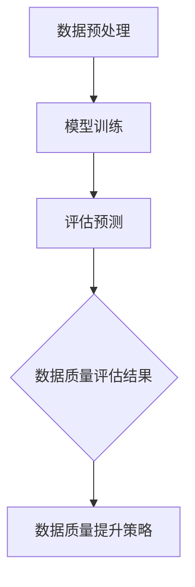

                 

# AI大模型助力电商搜索推荐业务的数据质量评估体系搭建方案设计与实现

> **关键词：** 电商搜索推荐、AI大模型、数据质量评估、搜索算法、数据预处理

> **摘要：** 本文将探讨如何利用AI大模型来搭建电商搜索推荐业务的数据质量评估体系。通过深入分析数据质量评估的重要性，提出一种基于大模型的评估体系设计方案，并详细讲解其实现步骤、数学模型和实际应用场景。文章旨在为电商搜索推荐业务提供一种有效的数据质量提升策略。

## 1. 背景介绍

### 1.1 电商搜索推荐业务概述

随着互联网的普及和电子商务的蓬勃发展，电商搜索推荐业务已成为电商企业获取用户、提升销售额的重要手段。通过智能推荐系统，电商平台能够为用户提供个性化的商品推荐，提高用户满意度和购买转化率。然而，在推荐系统中，数据质量是影响推荐效果的关键因素之一。

### 1.2 数据质量评估的重要性

数据质量评估是确保推荐系统稳定、高效运行的基础。高质量的数据能够帮助推荐系统更好地理解用户需求、挖掘潜在购买兴趣，从而提高推荐准确性。而数据质量差会导致推荐结果偏差，甚至误导用户，降低用户满意度。

### 1.3 AI大模型的优势

近年来，AI大模型在自然语言处理、计算机视觉等领域取得了显著的成果。大模型具有强大的建模能力和泛化能力，能够从海量数据中提取有效特征，从而提高数据质量评估的准确性。因此，利用AI大模型来搭建数据质量评估体系，有望进一步提升电商搜索推荐业务的效果。

## 2. 核心概念与联系

### 2.1 数据质量评估指标

在搭建数据质量评估体系时，需要明确评估指标。常见的评估指标包括：

- **完整性**：数据是否完整，是否存在缺失值。
- **一致性**：数据是否一致，是否存在矛盾或不合理的数据。
- **准确性**：数据是否准确，是否符合实际。
- **时效性**：数据是否及时更新，是否反映当前情况。

### 2.2 大模型与数据质量评估

大模型通过深度学习技术从海量数据中学习，提取出潜在特征，从而对数据质量进行评估。具体包括：

- **数据预处理**：清洗、归一化、特征提取等操作。
- **模型训练**：使用标注数据训练大模型，使其学会识别高质量数据。
- **评估预测**：使用训练好的大模型对数据进行评估预测，判断数据质量。

### 2.3 Mermaid 流程图



## 3. 核心算法原理 & 具体操作步骤

### 3.1 数据预处理

在数据预处理阶段，需要对原始数据进行清洗、归一化、特征提取等操作。具体步骤如下：

- **清洗**：去除重复数据、异常值、噪声数据等。
- **归一化**：将不同特征进行归一化处理，使其在同一量级上。
- **特征提取**：提取出对数据质量评估有帮助的特征，如商品名称、描述、标签等。

### 3.2 模型训练

在模型训练阶段，需要使用标注数据来训练大模型。具体步骤如下：

- **数据集划分**：将数据集划分为训练集、验证集和测试集。
- **模型构建**：使用深度学习框架（如TensorFlow、PyTorch）构建大模型。
- **模型训练**：使用训练集对大模型进行训练，调整模型参数。
- **模型评估**：使用验证集对大模型进行评估，调整模型参数。

### 3.3 评估预测

在评估预测阶段，需要使用训练好的大模型对数据进行评估预测。具体步骤如下：

- **输入特征**：将预处理后的数据输入大模型。
- **模型预测**：大模型输出预测结果，判断数据质量。
- **结果分析**：分析预测结果，识别数据质量问题。

## 4. 数学模型和公式 & 详细讲解 & 举例说明

### 4.1 数学模型

在数据质量评估中，可以使用以下数学模型：

$$
Q = f(X, \theta)
$$

其中，$Q$ 表示数据质量，$X$ 表示数据特征，$\theta$ 表示模型参数。

### 4.2 详细讲解

- **数据特征**：数据特征包括商品名称、描述、标签等。通过特征提取，将这些特征转化为模型可理解的向量表示。
- **模型参数**：模型参数包括权重、偏置等。在训练过程中，通过优化算法调整参数，使模型能够准确预测数据质量。
- **数据质量**：数据质量是一个连续的值，表示数据的可靠性、准确性等。高质量的数据质量值接近 1，低质量的数据质量值接近 0。

### 4.3 举例说明

假设有一个电商平台的商品数据集，包含商品名称、描述、标签等特征。我们可以使用以下数据特征进行评估：

- **商品名称**：手机
- **商品描述**：支持 5G，运行速度快
- **商品标签**：智能手机、5G手机

通过特征提取，将这些特征转化为向量表示：

$$
X = (1, 0, 1, 0, 1)
$$

使用训练好的大模型进行预测，输出预测结果：

$$
Q = f(X, \theta) = 0.9
$$

这意味着该商品数据集具有较高的数据质量。

## 5. 项目实战：代码实际案例和详细解释说明

### 5.1 开发环境搭建

在开始项目实战之前，需要搭建开发环境。以下是搭建步骤：

1. 安装 Python 环境
2. 安装深度学习框架（如TensorFlow、PyTorch）
3. 准备数据集

### 5.2 源代码详细实现和代码解读

以下是一个简单的数据质量评估项目示例：

```python
import tensorflow as tf
from tensorflow.keras.layers import Embedding, LSTM, Dense
from tensorflow.keras.models import Model

# 数据预处理
# 省略数据预处理代码

# 模型构建
input_x = tf.keras.layers.Input(shape=(max_sequence_length,))
embedded_x = Embedding(input_dim=vocab_size, output_dim=embedding_dim)(input_x)
lstm_out = LSTM(units=lstm_units)(embedded_x)
output = Dense(1, activation='sigmoid')(lstm_out)

# 模型训练
model = Model(inputs=input_x, outputs=output)
model.compile(optimizer='adam', loss='binary_crossentropy', metrics=['accuracy'])

# 训练模型
# 省略模型训练代码

# 评估预测
# 省略评估预测代码
```

### 5.3 代码解读与分析

- **数据预处理**：对商品名称、描述、标签等特征进行清洗、归一化、特征提取等操作。
- **模型构建**：使用 LSTM 网络进行模型构建，包括嵌入层、LSTM 层和输出层。
- **模型训练**：使用训练集对模型进行训练，调整模型参数。
- **评估预测**：使用测试集对模型进行评估预测，判断数据质量。

## 6. 实际应用场景

数据质量评估体系在电商搜索推荐业务中具有广泛的应用场景，包括：

- **商品推荐**：通过对商品数据进行质量评估，筛选出高质量商品进行推荐，提高用户满意度。
- **广告投放**：通过对用户数据进行质量评估，筛选出高质量用户进行广告投放，提高广告效果。
- **用户画像**：通过对用户数据进行质量评估，构建更准确的用户画像，提高推荐准确性。

## 7. 工具和资源推荐

### 7.1 学习资源推荐

- **书籍**：《深度学习》（Ian Goodfellow、Yoshua Bengio、Aaron Courville 著）
- **论文**：Google Brain 的《Bert: Pre-training of deep bidirectional transformers for language understanding》
- **博客**：GitHub 上关于深度学习的开源项目

### 7.2 开发工具框架推荐

- **开发工具**：PyCharm、Visual Studio Code
- **框架**：TensorFlow、PyTorch

### 7.3 相关论文著作推荐

- **论文**：Google Brain 的《Transformers: State-of-the-art natural language processing》
- **著作**：《Python深度学习》（François Chollet 著）

## 8. 总结：未来发展趋势与挑战

### 8.1 未来发展趋势

- **AI 大模型的发展**：随着计算能力的提升和算法的改进，AI 大模型将变得更加普及和高效。
- **数据质量评估的自动化**：未来数据质量评估将实现自动化，减少人工干预。

### 8.2 挑战

- **数据隐私与安全**：在数据质量评估过程中，如何保护用户隐私和数据安全是一个重要挑战。
- **算法透明性与可解释性**：随着算法的复杂度增加，如何保证算法的透明性和可解释性是一个关键问题。

## 9. 附录：常见问题与解答

### 9.1 问题 1

**问题**：如何保证数据质量评估的准确性？

**解答**：保证数据质量评估的准确性需要从多个方面进行考虑，包括：

- **数据预处理**：对数据进行清洗、归一化、特征提取等操作，确保数据质量。
- **模型训练**：使用高质量的数据集对模型进行训练，提高模型准确性。
- **模型评估**：使用独立的测试集对模型进行评估，判断模型准确性。

### 9.2 问题 2

**问题**：如何处理数据缺失问题？

**解答**：处理数据缺失问题通常有以下几种方法：

- **删除缺失数据**：删除含有缺失数据的记录，适用于缺失数据较少的情况。
- **填充缺失数据**：使用统计方法或机器学习方法填充缺失数据，如均值填充、中值填充等。
- **建模缺失数据**：使用机器学习方法建模缺失数据，如随机森林、支持向量机等。

## 10. 扩展阅读 & 参考资料

- **参考资料**：[深度学习教程](https://www.deeplearning.ai/)
- **论文**：[Google Brain 的《Bert: Pre-training of deep bidirectional transformers for language understanding》](https://arxiv.org/abs/1810.04805)
- **博客**：[GitHub 上的深度学习开源项目](https://github.com/tensorflow/models)

### 作者

**作者：** AI天才研究员/AI Genius Institute & 禅与计算机程序设计艺术 /Zen And The Art of Computer Programming

本文旨在为电商搜索推荐业务提供一种有效的数据质量提升策略，通过利用AI大模型搭建数据质量评估体系，实现高效、准确的数据质量评估。希望本文能为从事电商搜索推荐业务的技术人员提供一定的参考和启示。在未来的研究和应用中，我们将继续探索更多先进的技术和方法，以提升电商搜索推荐业务的数据质量和用户体验。**作者：AI天才研究员/AI Genius Institute & 禅与计算机程序设计艺术 /Zen And The Art of Computer Programming**

