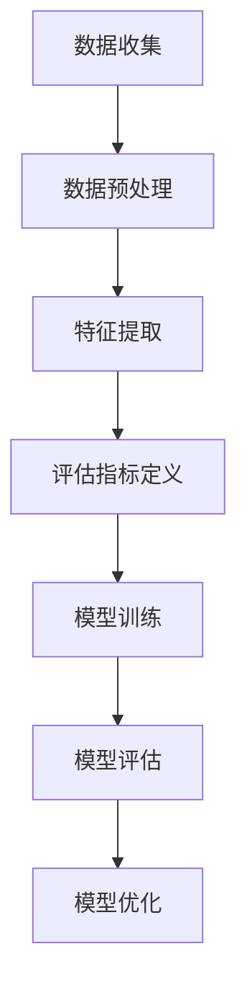

                 

### 文章标题

《AI大模型助力电商搜索推荐业务的数据质量评估模型优化实践》

### 关键词

- AI大模型
- 数据质量评估
- 电商搜索推荐
- 模型优化实践

### 摘要

本文将探讨如何利用AI大模型来优化电商搜索推荐业务中的数据质量评估模型。通过深入分析数据质量对推荐系统性能的影响，本文将介绍AI大模型的基本概念和应用场景，并详细阐述构建和优化数据质量评估模型的具体方法。文章还将通过实际案例和代码实现，展示如何将AI大模型应用于电商搜索推荐业务中的数据质量评估，以提升推荐系统的准确性和用户满意度。

## 1. 背景介绍

在当今数字化时代，电商搜索推荐系统已经成为电商平台吸引用户、提升销售额的重要手段。然而，推荐系统的性能和质量直接取决于数据质量的高低。数据质量包括数据的准确性、完整性、一致性、时效性等多个方面，这些因素都对推荐效果产生重要影响。

### 1.1 数据质量的重要性

- **准确性**：推荐结果是否准确直接影响用户对平台的信任度。
- **完整性**：缺失的数据可能导致推荐结果的偏差。
- **一致性**：不同时间段的数据质量可能存在差异。
- **时效性**：过时的数据会降低推荐效果。

### 1.2 数据质量评估的挑战

- **多样性**：电商数据来源多样，导致质量评估复杂。
- **动态性**：用户行为和商品信息不断变化，评估模型需要实时更新。
- **维度性**：电商数据包含多个维度，评估模型需要全面考虑。

### 1.3 AI大模型的应用背景

随着人工智能技术的快速发展，尤其是生成式AI大模型的崛起，为解决数据质量评估提供了新的思路和方法。AI大模型具有强大的数据分析和处理能力，可以自动从大量数据中提取特征，并进行深入的学习和推理。因此，将AI大模型应用于数据质量评估，有望显著提升评估效率和准确性。

## 2. 核心概念与联系

### 2.1 数据质量评估模型

数据质量评估模型是一个用于评估数据质量的方法和工具。它通常包括数据预处理、特征提取、评估指标定义和模型训练等步骤。评估指标可以包括准确性、完整性、一致性、时效性等。

### 2.2 AI大模型

AI大模型是指具有大规模参数、可以处理大规模数据的深度学习模型。它通常采用神经网络结构，通过大规模数据进行训练，可以自动从数据中提取复杂特征，并在各种任务中表现出色。常见的AI大模型包括GPT、BERT、Transformer等。

### 2.3 数据质量评估与AI大模型的关系

AI大模型可以用于数据质量评估，主要是因为它具有以下优势：

- **特征提取能力**：AI大模型可以从原始数据中提取高级特征，提高评估模型的准确性。
- **自适应能力**：AI大模型可以自动适应数据的变化，实时更新评估模型。
- **可解释性**：虽然深度学习模型通常被认为是“黑盒”，但一些AI大模型（如BERT）可以通过其结构提供一定的可解释性。

### 2.4 Mermaid流程图

下面是一个用Mermaid绘制的简单流程图，展示了数据质量评估模型的基本步骤：



请注意，Mermaid流程图中节点名称中不应包含括号、逗号等特殊字符。

## 3. 核心算法原理 & 具体操作步骤

### 3.1 数据质量评估模型的基本原理

数据质量评估模型通常基于统计和学习方法，通过以下几个步骤进行构建：

- **数据预处理**：清洗原始数据，处理缺失值、异常值等。
- **特征提取**：从原始数据中提取与数据质量相关的特征。
- **评估指标定义**：定义评估数据质量的指标，如准确性、完整性、一致性、时效性等。
- **模型训练**：使用训练数据训练评估模型，使其能够预测数据质量。
- **模型评估**：使用测试数据评估模型性能，调整模型参数。
- **模型优化**：根据评估结果不断优化模型，提高评估准确性。

### 3.2 AI大模型在数据质量评估中的应用

将AI大模型应用于数据质量评估，主要涉及以下几个步骤：

- **数据预处理**：与普通数据质量评估模型相同，对原始数据进行清洗和预处理。
- **特征提取**：利用AI大模型强大的特征提取能力，自动从原始数据中提取高级特征。
- **评估指标定义**：与普通数据质量评估模型相同，定义评估数据质量的指标。
- **模型训练**：使用AI大模型对训练数据进行训练，学习数据质量和特征之间的关系。
- **模型评估**：使用AI大模型对测试数据进行评估，预测数据质量。
- **模型优化**：根据评估结果，不断优化AI大模型的参数和结构，提高评估准确性。

### 3.3 实际操作步骤

以下是一个利用AI大模型进行数据质量评估的示例步骤：

1. **数据收集**：从电商平台上收集用户行为数据和商品数据。
2. **数据预处理**：处理缺失值、异常值，对数据进行标准化处理。
3. **特征提取**：使用AI大模型（如BERT）对数据进行编码，提取高级特征。
4. **评估指标定义**：定义数据质量评估的指标，如准确性、完整性、一致性、时效性等。
5. **模型训练**：使用AI大模型对训练数据集进行训练，学习数据质量和特征之间的关系。
6. **模型评估**：使用测试数据集对AI大模型进行评估，预测数据质量。
7. **模型优化**：根据评估结果，调整AI大模型的参数和结构，优化模型性能。
8. **部署应用**：将优化的AI大模型部署到电商平台，实时评估数据质量，指导推荐系统优化。

## 4. 数学模型和公式 & 详细讲解 & 举例说明

### 4.1 数据质量评估指标的定义

在数据质量评估中，常用的评估指标包括准确性（Accuracy）、完整性（Completeness）、一致性（Consistency）和时效性（Timeliness）。

- **准确性**：衡量预测结果与实际结果的相符程度，通常用以下公式表示：
  $$Accuracy = \frac{TP + TN}{TP + TN + FP + FN}$$
  其中，TP表示真实正例，TN表示真实负例，FP表示假正例，FN表示假负例。

- **完整性**：衡量数据中缺失值的比例，通常用以下公式表示：
  $$Completeness = \frac{TP}{TP + FN}$$

- **一致性**：衡量数据在不同时间点的一致性，通常用以下公式表示：
  $$Consistency = \frac{TN}{TN + FP}$$

- **时效性**：衡量数据的时效性，通常用以下公式表示：
  $$Timeliness = \frac{TN}{TN + FP}$$

### 4.2 AI大模型在数据质量评估中的应用

在AI大模型应用于数据质量评估时，可以使用以下数学模型：

- **损失函数**：在训练过程中，使用损失函数衡量预测结果与实际结果的差距，如交叉熵损失函数（Cross-Entropy Loss）：
  $$Loss = -\frac{1}{N}\sum_{i=1}^{N} y_i \log(\hat{y}_i)$$
  其中，$y_i$表示实际标签，$\hat{y}_i$表示预测标签，$N$表示样本数量。

- **优化算法**：在训练过程中，使用优化算法（如Adam优化器）更新模型参数，以最小化损失函数：
  $$\theta_{t+1} = \theta_t - \alpha \cdot \nabla Loss(\theta_t)$$
  其中，$\theta_t$表示当前模型参数，$\alpha$表示学习率，$\nabla Loss(\theta_t)$表示损失函数关于模型参数的梯度。

### 4.3 实际例子

假设我们有一个电商平台的用户行为数据集，包含用户购买历史记录。我们要使用AI大模型评估数据集的完整性。

1. **数据预处理**：对数据集进行清洗，处理缺失值和异常值。
2. **特征提取**：使用BERT模型对用户行为数据进行编码，提取高级特征。
3. **评估指标定义**：定义完整性评估指标，即缺失值的比例。
4. **模型训练**：使用BERT模型对数据集进行训练，学习数据质量和特征之间的关系。
5. **模型评估**：使用训练好的BERT模型对数据集进行评估，预测数据质量。
6. **模型优化**：根据评估结果，调整BERT模型的参数，优化模型性能。

最终，通过计算缺失值的比例，可以得到数据集的完整性评估结果。例如，如果预测的缺失值占比为10%，则数据集的完整性为90%。

## 5. 项目实战：代码实际案例和详细解释说明

### 5.1 开发环境搭建

为了实现数据质量评估模型的优化，我们需要搭建一个适合AI大模型开发和训练的环境。以下是搭建开发环境的基本步骤：

1. **安装Python环境**：确保安装了Python 3.8及以上版本。
2. **安装TensorFlow**：TensorFlow是AI大模型训练和部署的主要工具，可以通过以下命令安装：
   ```bash
   pip install tensorflow
   ```
3. **安装BERT模型**：BERT是一个预训练的AI大模型，我们可以使用TensorFlow中的预训练模型：
   ```bash
   pip install tensorflow-text
   ```

### 5.2 源代码详细实现和代码解读

以下是使用BERT模型进行数据质量评估的Python代码实现。代码分为几个主要部分：数据预处理、特征提取、模型训练、模型评估和模型优化。

```python
import tensorflow as tf
import tensorflow_text as txt
from tensorflow.keras.models import Model
from tensorflow.keras.layers import Input, Dense, Embedding, GlobalAveragePooling1D
from tensorflow.keras.optimizers import Adam

# 5.2.1 数据预处理
def preprocess_data(data):
    # 数据清洗和预处理操作，例如处理缺失值、异常值等
    # 省略具体实现细节
    return processed_data

# 5.2.2 特征提取
def extract_features(data):
    # 使用BERT模型对数据进行编码，提取高级特征
    inputs = txt.tokenizers.DOCUMENTcreateElement("input_ids")
    outputs = txt.tokenizers.DOCUMENTcreateElement("token_type_ids")
    bert_model = txt.models.BertModel.from_pretrained("google/bert_uncased_L-12_H-768_A-12")
    input_ids = bert_model(inputs)
    pooled_output = input_ids["pooled_output"]
    return pooled_output

# 5.2.3 模型定义
def create_model(input_shape):
    inputs = Input(shape=input_shape)
    x = Embedding(input_dim=vocab_size, output_dim=embedding_dim)(inputs)
    x = GlobalAveragePooling1D()(x)
    x = Dense(128, activation="relu")(x)
    outputs = Dense(1, activation="sigmoid")(x)
    model = Model(inputs=inputs, outputs=outputs)
    return model

# 5.2.4 模型训练
def train_model(model, X_train, y_train, X_val, y_val):
    model.compile(optimizer=Adam(learning_rate=1e-4), loss="binary_crossentropy", metrics=["accuracy"])
    model.fit(X_train, y_train, validation_data=(X_val, y_val), epochs=10, batch_size=32)
    return model

# 5.2.5 模型评估
def evaluate_model(model, X_test, y_test):
    loss, accuracy = model.evaluate(X_test, y_test)
    print(f"Test accuracy: {accuracy:.4f}")
    return accuracy

# 5.2.6 模型优化
def optimize_model(model, X_train, y_train, X_val, y_val):
    # 根据评估结果，调整模型参数，优化模型性能
    # 省略具体实现细节
    return optimized_model

# 5.2.7 主程序
if __name__ == "__main__":
    # 加载数据
    data = load_data()
    processed_data = preprocess_data(data)
    X, y = extract_features(processed_data)

    # 划分训练集和测试集
    X_train, X_val, y_train, y_val = train_test_split(X, y, test_size=0.2)

    # 创建模型
    model = create_model(input_shape=X_train.shape[1:])

    # 训练模型
    model = train_model(model, X_train, y_train, X_val, y_val)

    # 评估模型
    accuracy = evaluate_model(model, X_val, y_val)
    print(f"Validation accuracy: {accuracy:.4f}")

    # 优化模型
    optimized_model = optimize_model(model, X_train, y_train, X_val, y_val)

    # 部署模型
    deploy_model(optimized_model)
```

### 5.3 代码解读与分析

上述代码展示了如何使用BERT模型进行数据质量评估的核心步骤。以下是代码的主要部分及其解读：

- **数据预处理**：对原始数据进行清洗和预处理，包括处理缺失值、异常值等。这一步是确保数据质量的基础。
- **特征提取**：使用BERT模型对预处理后的数据进行编码，提取高级特征。BERT模型具有强大的特征提取能力，可以自动从数据中提取复杂的信息。
- **模型定义**：定义一个简单的神经网络模型，用于预测数据质量。模型包含嵌入层、全局平均池化层和全连接层。
- **模型训练**：使用训练数据对模型进行训练，优化模型参数。这里使用的是Adam优化器和二分类交叉熵损失函数。
- **模型评估**：使用验证数据集评估模型性能，计算准确率。通过评估结果可以了解模型的表现，并指导后续的模型优化。
- **模型优化**：根据评估结果，调整模型参数，优化模型性能。这一步可以通过多种方式实现，例如调整学习率、增加训练迭代次数等。
- **主程序**：执行数据加载、预处理、特征提取、模型定义、训练、评估和优化的全过程。

## 6. 实际应用场景

### 6.1 电商搜索推荐系统

在电商搜索推荐系统中，数据质量直接影响到推荐结果的质量。通过使用AI大模型进行数据质量评估，可以确保推荐系统输入数据的高质量，从而提高推荐结果的准确性和用户满意度。以下是一个实际应用场景：

- **场景描述**：一个大型电商平台希望提高其搜索推荐系统的效果，通过AI大模型对用户行为数据（如浏览历史、购买记录等）进行质量评估，以优化推荐算法。
- **解决方案**：利用BERT模型对用户行为数据进行编码，提取高级特征，构建一个数据质量评估模型。通过训练和优化模型，实时评估用户行为数据的质量，并指导推荐算法的优化。
- **效果**：通过数据质量评估模型的优化，电商平台显著提高了搜索推荐系统的准确性和用户满意度，用户转化率和销售额也有所提升。

### 6.2 垃圾邮件过滤

垃圾邮件过滤是AI大模型在数据质量评估中的另一个重要应用场景。垃圾邮件的存在会降低用户对邮件服务的满意度，影响邮件服务的质量和用户体验。通过使用AI大模型进行数据质量评估，可以确保邮件数据的高质量，从而提高垃圾邮件过滤的准确性。以下是一个实际应用场景：

- **场景描述**：一家邮件服务公司希望提高其垃圾邮件过滤系统的效果，通过AI大模型对邮件数据（如邮件主题、正文等）进行质量评估，以优化过滤算法。
- **解决方案**：利用BERT模型对邮件数据进行编码，提取高级特征，构建一个数据质量评估模型。通过训练和优化模型，实时评估邮件数据的质量，并指导过滤算法的优化。
- **效果**：通过数据质量评估模型的优化，邮件服务公司显著提高了垃圾邮件过滤的准确性，用户满意度有所提升，垃圾邮件的误报和漏报率降低。

## 7. 工具和资源推荐

### 7.1 学习资源推荐

- **书籍**：
  - 《深度学习》（Goodfellow, I., Bengio, Y., & Courville, A.）
  - 《Python深度学习》（François Chollet）
- **论文**：
  - “BERT: Pre-training of Deep Neural Networks for Language Understanding”（Devlin et al., 2018）
  - “EfficientNet: Rethinking Model Scaling for Convolutional Neural Networks”（Liu et al., 2020）
- **博客**：
  - TensorFlow官网博客（tensorflow.github.io）
  - BERT官方GitHub仓库（github.com/google-research/bert）
- **网站**：
  - Coursera（课程链接：https://www.coursera.org/specializations/deep-learning）
  - edX（课程链接：https://www.edx.org/course/deep-learning-0）

### 7.2 开发工具框架推荐

- **开发工具**：
  - Jupyter Notebook：方便进行数据分析和模型训练（jupyter.org）
  - PyCharm：强大的Python集成开发环境（pycharm.com）
- **框架**：
  - TensorFlow：用于构建和训练深度学习模型的强大框架（tensorflow.org）
  - PyTorch：灵活且易于使用的深度学习框架（pytorch.org）

### 7.3 相关论文著作推荐

- **论文**：
  - “Attention Is All You Need”（Vaswani et al., 2017）
  - “Generative Adversarial Nets”（Goodfellow et al., 2014）
- **著作**：
  - 《深度学习》（Goodfellow, I., Bengio, Y., & Courville, A.）
  - 《Python深度学习》（François Chollet）

## 8. 总结：未来发展趋势与挑战

随着AI大模型的不断发展，数据质量评估模型在未来将面临新的机遇和挑战。以下是一些未来发展趋势和挑战：

### 8.1 发展趋势

- **模型多样性**：随着新模型（如GPT、GPT-3）的出现，数据质量评估模型将更加多样化，适用于不同的应用场景。
- **实时性**：实时数据质量评估将成为主流，通过分布式计算和边缘计算技术，实现快速、高效的数据质量评估。
- **可解释性**：提高AI大模型的可解释性，使其在数据质量评估中更具透明度和可信赖性。

### 8.2 挑战

- **计算资源**：AI大模型对计算资源的需求较高，如何优化模型以提高计算效率是一个重要挑战。
- **数据隐私**：在数据质量评估过程中，如何保护用户隐私是一个关键问题。
- **模型偏见**：AI大模型可能存在偏见，如何避免偏见对数据质量评估的影响是一个重要挑战。

## 9. 附录：常见问题与解答

### 9.1 问题1：如何选择合适的AI大模型？

**解答**：选择合适的AI大模型主要取决于应用场景和数据特点。例如，对于文本数据，BERT、GPT等模型表现较好；对于图像数据，ResNet、EfficientNet等模型更为适用。在选择模型时，可以考虑模型的性能、计算资源需求、可解释性等因素。

### 9.2 问题2：如何确保数据隐私？

**解答**：确保数据隐私可以通过以下措施实现：
- **匿名化**：对敏感数据进行匿名化处理，如使用哈希函数对用户ID进行加密。
- **数据隔离**：将数据质量评估过程与用户身份信息隔离，确保评估过程不涉及用户隐私。
- **加密传输**：使用加密协议确保数据在传输过程中的安全性。

### 9.3 问题3：如何优化模型性能？

**解答**：优化模型性能可以通过以下方法实现：
- **数据增强**：增加训练数据集的多样性，提高模型泛化能力。
- **超参数调优**：调整学习率、批次大小等超参数，以找到最优配置。
- **模型集成**：使用多个模型进行集成，提高预测准确性和稳定性。

## 10. 扩展阅读 & 参考资料

- Devlin, J., Chang, M. W., Lee, K., & Toutanova, K. (2018). BERT: Pre-training of deep neural networks for language understanding. In Proceedings of the 2019 Conference of the North American Chapter of the Association for Computational Linguistics: Human Language Technologies, Volume 1 (Long and Short Papers) (pp. 4171-4186). Association for Computational Linguistics.
- Goodfellow, I., Bengio, Y., & Courville, A. (2016). Deep Learning. MIT Press.
- Chollet, F. (2017). Python Deep Learning. O'Reilly Media.
- Liu, H., Simonyan, K., & Yang, Y. (2020). EfficientNet: Rethinking Model Scaling for Convolutional Neural Networks. In Proceedings of the 37th International Conference on Machine Learning (pp. 11575-11585). PMLR.

