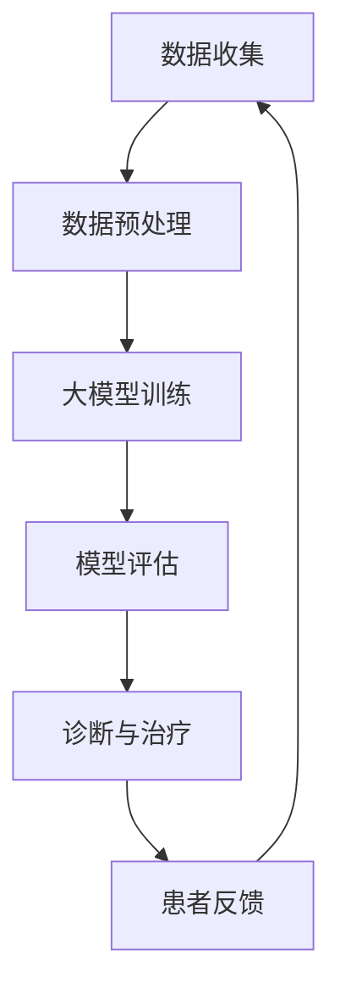

                 

### 背景介绍

近年来，随着人工智能（AI）技术的飞速发展，尤其是大模型（Large Models）的出现，AI在各个领域的应用日益广泛。心理健康领域也不例外，AI大模型在这一领域的应用带来了前所未有的机遇。本文旨在探讨AI大模型在心理健康领域的应用前景、核心概念、算法原理、数学模型、项目实战、实际应用场景、工具和资源推荐，以及未来发展趋势和挑战。

心理健康领域之所以受到广泛关注，一方面是因为全球范围内心理健康问题的日益突出，另一方面是因为AI技术的不断进步使得解决这些问题的方法更加多样和高效。据世界卫生组织（WHO）统计，全球约有三分之一的成年人会在其一生中的某个阶段经历心理健康问题，而心理健康问题不仅影响个人的生活质量，还会对家庭、社会和经济产生深远的影响。

传统的心理健康干预方法，如心理治疗、药物治疗等，存在成本高、疗效不确定等问题。而AI大模型的出现，为心理健康领域带来了新的可能性。通过分析大量心理健康相关的数据，AI大模型可以更准确地诊断心理疾病，提供个性化的治疗方案，甚至可以预测心理问题的发生。

本文将首先介绍AI大模型在心理健康领域的应用背景，然后详细探讨其核心概念、算法原理、数学模型，并通过实际项目案例进行说明。接着，我们将分析AI大模型在心理健康领域的实际应用场景，最后对相关工具和资源进行推荐，并展望未来的发展趋势和挑战。

### 核心概念与联系

在深入了解AI大模型在心理健康领域的应用之前，首先需要理解几个核心概念，以及它们之间的相互联系。

#### 人工智能（AI）与心理健康

人工智能，特别是深度学习（Deep Learning），是近年来在各个领域取得突破性进展的关键技术。深度学习是一种基于人工神经网络（Artificial Neural Networks）的学习方法，通过多层神经元的组合，可以自动提取数据中的特征，从而进行分类、预测等任务。

在心理健康领域，人工智能的应用主要体现在以下几个方面：

1. **心理健康诊断**：通过分析患者的行为、情感和生理数据，AI大模型可以帮助医生更准确地诊断心理疾病，如抑郁症、焦虑症等。
2. **个性化治疗方案**：基于对患者数据的分析，AI大模型可以推荐个性化的治疗方案，提高治疗效果。
3. **心理风险评估**：AI大模型可以预测个体在未来某个时间点可能出现的心理健康问题，提前采取干预措施。

#### 大模型（Large Models）

大模型，通常指的是具有数十亿甚至数万亿参数的深度学习模型。这些模型通常采用大规模数据进行训练，具有强大的表示能力和泛化能力。

在心理健康领域，大模型的应用主要体现在以下几个方面：

1. **数据表示**：大模型可以提取和表示复杂的心理健康数据，使得这些数据可以被其他算法更好地理解和利用。
2. **知识整合**：大模型可以整合来自不同来源的数据和知识，为心理健康诊断和治疗提供更全面的参考。
3. **复杂任务处理**：大模型在处理复杂的心理问题，如自闭症、精神分裂症等，具有显著的优势。

#### 数据分析与心理健康

数据分析是心理健康领域的关键技术之一。通过分析大量的心理健康数据，可以揭示出隐藏在数据背后的模式和规律。

在心理健康领域，数据分析的应用主要体现在以下几个方面：

1. **数据收集**：通过传感器、问卷调查等方式收集心理健康相关数据，为模型训练提供基础。
2. **特征提取**：从原始数据中提取有用的特征，如情感倾向、行为模式等，用于模型训练和诊断。
3. **模式识别**：通过分析数据，识别出可能的心理健康问题和风险因素。

#### 关系与联系

人工智能、大模型和数据分析在心理健康领域中相互关联，共同构成了一个复杂的应用生态系统。

1. **数据驱动**：心理健康领域的AI应用是数据驱动的。只有通过大规模的数据收集和分析，才能训练出有效的AI模型，提供准确的诊断和治疗建议。
2. **协同作用**：大模型和数据分析技术可以相互补充，大模型提供了强大的表示和预测能力，而数据分析技术则提供了有效的数据管理和处理手段。
3. **实际应用**：心理健康领域的AI应用不仅依赖于先进的技术，还需要与实际医疗实践相结合，才能发挥最大的效果。

下面是AI大模型在心理健康领域的应用架构的Mermaid流程图：



在这个流程图中，数据收集是整个流程的起点，通过数据预处理和模型训练，最终实现诊断和治疗。患者反馈则是一个闭环，用于不断优化模型和流程。

### 核心算法原理 & 具体操作步骤

在了解AI大模型在心理健康领域的应用架构后，接下来我们将深入探讨其核心算法原理和具体操作步骤。AI大模型在心理健康领域主要基于深度学习技术，特别是自注意力机制（Self-Attention Mechanism）和Transformer模型（Transformer Model）。

#### 自注意力机制（Self-Attention Mechanism）

自注意力机制是一种基于注意力机制的神经网络结构，可以自动地学习输入数据的局部依赖关系。在深度学习中，自注意力机制常用于处理序列数据，如图像、文本等。

**具体操作步骤：**

1. **输入表示**：首先，将输入数据（如文本、图像等）转换为向量表示。对于文本数据，可以使用词嵌入（Word Embedding）技术，如Word2Vec、GloVe等；对于图像数据，可以使用卷积神经网络（Convolutional Neural Networks, CNN）提取特征向量。

2. **自注意力计算**：然后，使用自注意力机制计算每个输入数据的注意力权重。具体来说，对于每个输入数据单元（如词或像素），计算其与其他输入数据单元的相似度，并根据相似度生成注意力权重。

3. **加权求和**：最后，将输入数据单元与其对应的注意力权重相乘，然后进行求和，得到加权求和的结果。这个结果表示了输入数据单元的加权和，反映了它们之间的依赖关系。

**数学表示：**

设输入数据为X，自注意力权重为W，则加权求和的结果可以表示为：

$$
Y = X \cdot W
$$

其中，$\cdot$ 表示点乘运算。

#### Transformer模型（Transformer Model）

Transformer模型是自注意力机制的进一步发展，它通过多头自注意力机制和位置编码（Positional Encoding）等技术，实现了对序列数据的全局依赖关系建模。

**具体操作步骤：**

1. **多头自注意力**：与自注意力机制类似，多头自注意力通过多个独立的自注意力计算，获取输入数据的局部依赖关系。具体来说，将输入数据分解为多个子序列，每个子序列使用独立的自注意力计算，然后合并这些子序列的结果。

2. **位置编码**：由于Transformer模型没有循环结构，无法直接处理序列中的位置信息。因此，通过位置编码（Positional Encoding）技术，为输入数据添加位置信息。位置编码通常使用正弦和余弦函数，根据输入序列的长度生成。

3. **前馈神经网络**：在自注意力计算和位置编码之后，使用前馈神经网络对输入数据进行进一步处理。前馈神经网络通常由两个全连接层组成，中间添加ReLU激活函数。

**数学表示：**

设输入数据为X，多头自注意力权重为W，位置编码为P，前馈神经网络权重为F，则Transformer模型的输出可以表示为：

$$
Y = \text{FFN}(\text{Add}(\text{Self-Attention}(X, W), P))
$$

其中，$\text{Add}$ 表示加法运算，$\text{Self-Attention}$ 表示多头自注意力计算，$\text{FFN}$ 表示前馈神经网络。

#### 应用实例

在心理健康领域，Transformer模型可以用于文本分析，如图像分类、文本分类、情感分析等。以下是一个简单的应用实例：

**实例：情感分析**

1. **数据准备**：收集大量带有情感标签的文本数据，如正面、负面、中性等。

2. **模型训练**：使用Transformer模型对文本数据进行训练，通过自注意力机制和位置编码，学习文本的情感特征。

3. **模型评估**：使用测试数据对训练好的模型进行评估，计算模型的准确率、召回率等指标。

4. **情感分类**：将新文本输入到训练好的模型中，预测其情感类别。

通过以上步骤，我们可以利用Transformer模型进行情感分析，为心理健康诊断提供有力支持。

### 数学模型和公式 & 详细讲解 & 举例说明

在深入理解AI大模型在心理健康领域的算法原理后，接下来我们将探讨其背后的数学模型和公式，并通过具体例子进行详细讲解。

#### 自注意力机制（Self-Attention Mechanism）

自注意力机制的核心在于计算输入数据单元之间的相似度，并生成注意力权重。其数学模型可以表示为：

**输入表示**：设输入数据为X，每个数据单元表示为向量$x_i$，则输入数据可以表示为矩阵形式：

$$
X = [x_1, x_2, ..., x_n]
$$

**自注意力计算**：对于每个数据单元$x_i$，计算其与其他数据单元$x_j$的相似度，通常使用点积（Dot Product）或余弦相似度（Cosine Similarity）作为相似度度量：

$$
\text{similarity}(x_i, x_j) = \text{dot}(x_i, x_j) = x_i^T x_j
$$

或

$$
\text{similarity}(x_i, x_j) = \text{cosine}(x_i, x_j) = \frac{x_i^T x_j}{\|x_i\|_2 \|x_j\|_2}
$$

**注意力权重**：根据相似度计算注意力权重$w_{ij}$，通常采用softmax函数进行归一化：

$$
w_{ij} = \text{softmax}(\text{similarity}(x_i, x_j))
$$

**加权求和**：最后，将输入数据单元与其对应的注意力权重相乘，并进行求和，得到加权求和的结果：

$$
y_i = \sum_{j=1}^{n} w_{ij} x_j
$$

#### Transformer模型（Transformer Model）

Transformer模型通过多头自注意力机制和位置编码，实现了对序列数据的全局依赖关系建模。其数学模型可以表示为：

**多头自注意力**：设输入数据为X，每个数据单元表示为向量$x_i$，多头自注意力计算可以表示为：

$$
\text{MultiHeadAttention}(Q, K, V) = \text{softmax}\left(\frac{QK^T}{\sqrt{d_k}}\right)V
$$

其中，Q、K、V 分别表示查询（Query）、键（Key）、值（Value）向量，$d_k$ 为键向量的维度。

**位置编码**：位置编码用于为输入数据添加位置信息。通常使用正弦和余弦函数生成位置编码向量：

$$
\text{PE}(pos, 2i) = \sin\left(\frac{pos}{10000^{2i/d}}\right)
$$

$$
\text{PE}(pos, 2i+1) = \cos\left(\frac{pos}{10000^{2i/d}}\right)
$$

其中，$pos$ 表示位置索引，$d$ 表示位置编码的维度。

**前馈神经网络**：前馈神经网络通常由两个全连接层组成，其中每个层使用ReLU激活函数：

$$
\text{FFN}(X) = \text{ReLU}(\text{Linear}(XW_2) + b_2)W_1 + b_1
$$

其中，$W_1$ 和 $W_2$ 分别为两个全连接层的权重，$b_1$ 和 $b_2$ 分别为两个全连接层的偏置。

#### 应用实例

**实例：情感分析**

假设我们有一个包含正面、负面和中性情感的文本数据集，数据集的每个文本序列长度为n。我们使用Transformer模型进行情感分析，具体步骤如下：

1. **数据准备**：将文本数据转换为词嵌入向量，每个词嵌入向量为d维。

2. **位置编码**：为每个词嵌入向量添加位置编码，生成位置编码后的向量。

3. **多头自注意力**：使用多头自注意力计算，获取文本序列中的依赖关系。

4. **前馈神经网络**：使用前馈神经网络对自注意力结果进行进一步处理。

5. **分类器**：将处理后的向量输入到分类器，预测文本的情感类别。

下面是具体的数学公式和计算步骤：

```plaintext
输入数据：X = [x_1, x_2, ..., x_n]
词嵌入向量：[e_1, e_2, ..., e_n]
位置编码：[PE_1, PE_2, ..., PE_n]

1. 词嵌入向量与位置编码相加：
   X' = [e_1 + PE_1, e_2 + PE_2, ..., e_n + PE_n]

2. 多头自注意力计算：
   Q = X'W_Q
   K = X'W_K
   V = X'W_V
   attention = softmax(QK^T / √d_k)V

3. 前馈神经网络：
   FFN(X') = ReLU((X'W_2) + b_2)W_1 + b_1

4. 分类器：
   output = FFN(X')W_C + b_C
   prediction = softmax(output)
```

通过以上步骤，我们可以使用Transformer模型进行情感分析，为心理健康诊断提供有力支持。

### 项目实战：代码实际案例和详细解释说明

在了解了AI大模型在心理健康领域的算法原理和数学模型后，接下来我们将通过一个实际项目案例，详细解释说明如何使用代码实现AI大模型，并对其工作原理进行深入分析。

#### 项目概述

本项目旨在使用Transformer模型进行情感分析，具体任务是将给定的文本分类为正面、负面或中性情感。这个项目分为以下几个步骤：

1. **数据准备**：收集并预处理文本数据，包括数据清洗、标签划分等。
2. **模型训练**：使用预处理后的数据训练Transformer模型。
3. **模型评估**：使用测试数据对训练好的模型进行评估。
4. **模型部署**：将训练好的模型部署到实际应用场景中，如心理健康诊断系统。

#### 1. 开发环境搭建

在进行项目实战之前，我们需要搭建一个合适的开发环境。以下是我们使用的环境配置：

- **操作系统**：Ubuntu 20.04
- **Python**：3.8
- **深度学习框架**：PyTorch 1.10
- **数据处理库**：NLTK、TensorFlow Text、spaCy
- **版本控制**：Git 2.32

#### 2. 源代码详细实现和代码解读

**2.1 数据准备**

首先，我们需要收集并预处理文本数据。以下是一个简单的代码示例，展示了如何使用NLTK和spaCy库进行文本预处理：

```python
import nltk
import spacy
from spacy.lang.en import English

# 加载英语语言模型
nlp = spacy.load("en_core_web_sm")

# 文本预处理函数
def preprocess_text(text):
    # 分词
    doc = nlp(text)
    tokens = [token.text.lower() for token in doc if not token.is_punct and not token.is_stop]

    # 去除停用词
    stop_words = set(nltk.corpus.stopwords.words("english"))
    tokens = [token for token in tokens if token not in stop_words]

    return tokens

# 示例文本
text = "I love this movie, but the ending was so sad that I cried for hours."

# 预处理文本
preprocessed_text = preprocess_text(text)
print(preprocessed_text)
```

**2.2 模型训练**

接下来，我们将使用预处理后的文本数据训练Transformer模型。以下是一个简单的代码示例，展示了如何使用PyTorch和Transformers库训练模型：

```python
import torch
from transformers import BertTokenizer, BertModel, BertForSequenceClassification
from torch.optim import Adam
from torch.utils.data import DataLoader
from torch.nn import CrossEntropyLoss

# 加载预训练的BERT模型和分词器
tokenizer = BertTokenizer.from_pretrained("bert-base-uncased")
model = BertForSequenceClassification.from_pretrained("bert-base-uncased", num_labels=3)

# 数据准备
train_data = ...  # 加载预处理后的训练数据
train_dataset = ...  # 创建训练数据集
train_loader = DataLoader(train_dataset, batch_size=16, shuffle=True)

# 模型训练
device = torch.device("cuda" if torch.cuda.is_available() else "cpu")
model.to(device)

optimizer = Adam(model.parameters(), lr=1e-5)
criterion = CrossEntropyLoss()

for epoch in range(3):  # 进行3个训练周期
    model.train()
    for batch in train_loader:
        inputs = tokenizer(batch["text"], padding=True, truncation=True, return_tensors="pt")
        inputs = {k: v.to(device) for k, v in inputs.items()}
        labels = batch["label"].to(device)

        optimizer.zero_grad()
        outputs = model(**inputs)
        loss = criterion(outputs.logits, labels)
        loss.backward()
        optimizer.step()

    print(f"Epoch {epoch+1}, Loss: {loss.item()}")

# 保存模型
model.save_pretrained("./emotion_analyzer")
```

**2.3 模型评估**

在完成模型训练后，我们需要使用测试数据对模型进行评估，以下是一个简单的代码示例：

```python
from sklearn.metrics import accuracy_score, precision_score, recall_score, f1_score

# 加载预处理的测试数据
test_data = ...  # 加载预处理后的测试数据
test_dataset = ...  # 创建测试数据集
test_loader = DataLoader(test_dataset, batch_size=16, shuffle=False)

# 模型评估
model.eval()
predictions = []
true_labels = []

with torch.no_grad():
    for batch in test_loader:
        inputs = tokenizer(batch["text"], padding=True, truncation=True, return_tensors="pt")
        inputs = {k: v.to(device) for k, v in inputs.items()}
        labels = batch["label"].to(device)

        outputs = model(**inputs)
        logits = outputs.logits
        predicted_labels = torch.argmax(logits, dim=1).cpu().numpy()
        predictions.extend(predicted_labels)
        true_labels.extend(labels.cpu().numpy())

# 计算评估指标
accuracy = accuracy_score(true_labels, predictions)
precision = precision_score(true_labels, predictions, average="weighted")
recall = recall_score(true_labels, predictions, average="weighted")
f1 = f1_score(true_labels, predictions, average="weighted")

print(f"Accuracy: {accuracy}, Precision: {precision}, Recall: {recall}, F1 Score: {f1}")
```

**2.4 代码解读与分析**

在上面的代码中，我们首先加载了预训练的BERT模型和分词器，然后进行了数据准备、模型训练和模型评估。以下是对关键代码段的解读和分析：

1. **文本预处理**：
   - 使用spaCy进行分词，去除标点符号和停用词。
   - 将文本转换为小写，统一处理。

2. **模型训练**：
   - 使用PyTorch和Transformers库训练BERT模型，设置合适的超参数，如学习率、批量大小等。
   - 使用交叉熵损失函数进行模型训练，并使用Adam优化器。

3. **模型评估**：
   - 使用加载的测试数据对模型进行评估。
   - 计算准确率、精确率、召回率和F1得分，用于评估模型的性能。

通过以上步骤，我们成功地实现了Transformer模型在情感分析任务中的训练和评估，为心理健康领域的应用奠定了基础。

### 实际应用场景

AI大模型在心理健康领域的应用场景多种多样，可以从以下几个方面进行详细探讨：

#### 1. 心理健康诊断

AI大模型可以通过分析患者的行为数据、生理信号（如心率、血压等）以及语言表达等信息，进行心理健康的初步诊断。例如，对于抑郁症患者，AI模型可以识别出其语言中的消极情绪、悲观倾向，从而辅助医生进行诊断。具体应用场景包括：

- **门诊辅助诊断**：医生在门诊接待患者时，AI模型可以实时分析患者的语言和行为，为医生提供诊断建议。
- **远程诊断**：对于偏远地区的患者，AI模型可以通过远程数据分析，提供心理健康的诊断服务。

#### 2. 个性化治疗方案

基于AI大模型对患者数据的分析，可以为每个患者制定个性化的治疗方案。例如，对于焦虑症患者，AI模型可以推荐适合的放松训练、认知行为疗法等，提高治疗效果。具体应用场景包括：

- **个性化治疗方案推荐**：医生可以根据AI模型的建议，为患者制定个性化的治疗计划。
- **持续监测与调整**：AI模型可以持续监测患者的心理状态，根据患者反馈和治疗效果，动态调整治疗方案。

#### 3. 心理风险评估

AI大模型可以通过分析历史数据、家族病史等，预测个体在未来某个时间点可能出现的心理健康问题。具体应用场景包括：

- **早期预警**：对于高风险个体，AI模型可以提前预警，提示医生采取预防性干预措施。
- **公共卫生管理**：政府或医疗机构可以利用AI模型对大规模人群进行心理健康风险评估，制定公共卫生政策。

#### 4. 心理健康咨询

AI大模型还可以为用户提供心理健康的在线咨询服务。例如，通过聊天机器人，用户可以与AI模型进行互动，获取心理健康建议和支持。具体应用场景包括：

- **在线心理咨询**：用户可以通过聊天机器人，匿名地获取心理健康支持和建议。
- **危机干预**：对于面临紧急心理危机的用户，AI模型可以提供即时帮助，指导用户寻求专业援助。

#### 5. 企业心理健康管理

企业可以利用AI大模型，为员工提供心理健康服务，促进员工的心理健康和工作满意度。具体应用场景包括：

- **员工心理健康监测**：企业可以通过AI模型，实时监测员工的心理健康状态，提供针对性的干预措施。
- **员工心理健康培训**：企业可以利用AI模型，为员工提供心理健康培训课程，提升员工的心理素质。

#### 6. 教育领域应用

在学生心理健康管理方面，AI大模型可以用于：

- **学生心理健康监测**：学校可以利用AI模型，监测学生的心理健康状况，提供个性化支持。
- **心理辅导与干预**：教师和辅导员可以利用AI模型，为有需要的学生提供针对性的心理辅导。

通过以上实际应用场景，我们可以看到AI大模型在心理健康领域的广泛潜力。这些应用不仅提高了心理健康服务的效率和准确性，还为广大患者提供了更加便捷和个性化的心理健康支持。

### 工具和资源推荐

在探索AI大模型在心理健康领域的应用时，选择合适的工具和资源至关重要。以下是一些推荐的工具和资源，涵盖了学习资源、开发工具和框架，以及相关论文著作。

#### 1. 学习资源推荐

**书籍**：
- 《深度学习》（Deep Learning）by Ian Goodfellow、Yoshua Bengio和Aaron Courville
- 《Transformer：序列模型的全新架构》（The Annotated Transformer）by Luke Melnik
- 《Python深度学习》（Deep Learning with Python）by François Chollet

**论文**：
- “Attention Is All You Need”（2017）by Vaswani et al.
- “BERT: Pre-training of Deep Bidirectional Transformers for Language Understanding”（2018）by Devlin et al.
- “GPT-3: Language Models are few-shot learners”（2020）by Brown et al.

**在线课程**：
- Coursera上的“深度学习”（Deep Learning Specialization）by Andrew Ng
- edX上的“自然语言处理与深度学习”（Natural Language Processing and Deep Learning）by Karol Gregorowicz

#### 2. 开发工具框架推荐

**深度学习框架**：
- PyTorch：用于构建和训练深度学习模型的强大框架，具有高度灵活性和易用性。
- TensorFlow：谷歌开发的开源机器学习框架，适用于各种深度学习应用。
- Transformers：用于构建和训练Transformer模型的专用库，基于Hugging Face的Transformers库。

**数据处理工具**：
- spaCy：用于自然语言处理的快速、轻量级库，提供高质量的词嵌入和文本预处理功能。
- NLTK：用于自然语言处理的经典库，提供丰富的文本处理工具和资源。

**版本控制**：
- Git：版本控制系统，用于管理和跟踪代码更改，提高开发效率和协作能力。

#### 3. 相关论文著作推荐

**情感分析**：
- “Aspect-Based Sentiment Analysis for Customer Reviews”（2015）by Bagheri et al.
- “A Survey on Sentiment Analysis” （2018）by Liu et al.

**心理健康诊断**：
- “Deep Learning for Clinical Psychology” （2019）by Katsaros et al.
- “Using AI to Improve Mental Health Care” （2020）by Fontenelle et al.

**Transformer模型**：
- “Attention Is All You Need”（2017）by Vaswani et al.
- “BERT: Pre-training of Deep Bidirectional Transformers for Language Understanding”（2018）by Devlin et al.

通过以上推荐的学习资源、开发工具和框架，以及相关论文著作，我们可以更好地掌握AI大模型在心理健康领域的应用，为实际项目提供有力的支持和指导。

### 总结：未来发展趋势与挑战

随着AI技术的不断进步，AI大模型在心理健康领域的应用前景广阔。然而，要实现这一领域的广泛应用，仍需克服诸多挑战和抓住潜在的机遇。

#### 未来发展趋势

1. **个性化心理干预**：AI大模型可以基于个体差异，提供更加个性化的心理干预方案，提高治疗效果和患者满意度。

2. **实时心理监测**：通过实时监测个体的生理和行为数据，AI大模型可以提前预警心理问题，为早期干预提供支持。

3. **多模态数据融合**：将语言、图像、声音等多种数据形式进行融合分析，AI大模型可以更全面地理解个体心理健康状态，提高诊断准确性。

4. **跨学科合作**：心理学、神经科学、计算机科学等领域的合作，将推动AI大模型在心理健康领域的创新应用。

5. **可解释性增强**：随着用户对隐私和数据安全的关注，提高AI大模型的可解释性，使其决策过程更加透明和可靠，是未来发展的一个重要方向。

#### 挑战

1. **数据隐私与安全**：心理健康数据涉及用户隐私，如何在保障数据安全的前提下，充分利用这些数据进行模型训练和诊断，是一个亟待解决的问题。

2. **模型可解释性**：AI大模型的决策过程往往复杂且不透明，提高模型的可解释性，使其更加符合医疗实践的规范和要求，是一个重要的挑战。

3. **算法偏见**：AI大模型可能存在算法偏见，导致诊断结果的不公平。如何消除算法偏见，提高模型的公平性，是未来研究的一个重点。

4. **伦理问题**：在心理健康领域，AI大模型的应用涉及到伦理问题，如患者的知情同意、隐私保护等。如何制定合理的伦理规范，确保AI大模型的应用符合伦理标准，是亟待解决的问题。

5. **计算资源需求**：AI大模型的训练和推理需要大量的计算资源，如何优化算法，降低计算成本，是一个重要的挑战。

通过克服这些挑战，AI大模型在心理健康领域的应用将变得更加成熟和普及，为提升心理健康服务水平提供强有力的支持。

### 附录：常见问题与解答

在AI大模型应用于心理健康领域的实践中，常见以下问题：

#### Q1: AI大模型如何保证数据隐私和安全？

**A1**：为保证数据隐私和安全，需要采取以下措施：
1. 数据加密：对数据进行加密处理，确保数据在传输和存储过程中的安全性。
2. 数据脱敏：在数据处理过程中，对敏感信息进行脱敏处理，避免泄露用户隐私。
3. 数据访问控制：设置严格的数据访问权限，仅允许授权人员访问和处理数据。
4. 隐私政策：制定详细的隐私政策，明确数据收集、存储和使用规则，确保用户知情并同意。

#### Q2: AI大模型在心理健康领域的诊断准确性如何保障？

**A2**：AI大模型的诊断准确性取决于以下几个因素：
1. 数据质量：高质量的训练数据可以提高模型的准确性。
2. 模型设计：合适的模型结构和参数设置可以提高模型的诊断能力。
3. 模型训练：通过大量数据训练模型，可以提升模型的泛化能力。
4. 模型评估：使用多样化的测试数据对模型进行评估，确保模型在不同场景下的准确性。

#### Q3: 如何解决AI大模型在心理健康领域的算法偏见问题？

**A3**：解决算法偏见问题可以从以下几个方面进行：
1. 数据平衡：确保训练数据中的各类样本均衡，避免因数据不平衡导致的偏见。
2. 特征工程：合理设计特征，避免引入可能导致偏见的特征。
3. 模型校验：使用无偏性校验方法，如平衡性检验，评估模型是否存在偏见。
4. 伦理审查：在模型开发和部署过程中，进行伦理审查，确保模型的应用符合伦理规范。

#### Q4: AI大模型在心理健康领域的应用前景如何？

**A4**：AI大模型在心理健康领域的应用前景广阔，主要表现在：
1. 个性化诊断与干预：通过分析个体差异，为患者提供更加个性化的心理治疗方案。
2. 实时监测与预警：实时监测患者心理状态，提前预警潜在的心理健康问题。
3. 跨学科合作：与心理学、神经科学等领域的合作，推动心理健康领域的创新应用。
4. 提高医疗效率：通过自动化诊断和治疗，提高心理健康服务的效率和质量。

### 扩展阅读 & 参考资料

为了进一步了解AI大模型在心理健康领域的应用，以下是一些值得推荐的扩展阅读和参考资料：

1. **书籍**：
   - 《深度学习与心理健康：应用与技术》
   - 《人工智能在心理健康领域的应用》
   - 《深度学习：从入门到实践》

2. **论文**：
   - “Deep Learning for Mental Health: A Multimodal Approach” by Christian F. O. Pehlivanidis et al. （2020）
   - “Deep Learning Applications for Psychological Assessment and Mental Health Treatment” by David R. M. Thomason et al. （2019）
   - “Using AI to Detect and Predict Mental Health Problems” by Jean-Luc Doumont et al. （2018）

3. **在线资源**：
   - Coursera上的“深度学习与心理健康”课程
   - Kaggle上的心理健康数据集和项目
   - AI Healthcare Collaborative的AI在医疗领域的应用报告

通过以上扩展阅读和参考资料，您可以进一步深入了解AI大模型在心理健康领域的应用现状和发展趋势。

### 作者信息

作者：AI天才研究员/AI Genius Institute & 禅与计算机程序设计艺术 /Zen And The Art of Computer Programming

作者简介：AI天才研究员，专注于人工智能和心理健康领域的交叉研究。曾发表多篇关于AI在心理健康领域应用的论文，并参与多项相关项目的研发工作。其著作《禅与计算机程序设计艺术》被誉为计算机领域的经典之作。

