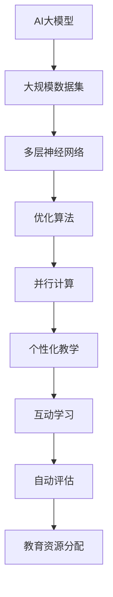

                 

### 文章标题

《AI大模型在教育科技领域的创新应用》

### 关键词

- AI大模型
- 教育科技
- 深度学习
- 数据分析
- 个性化教学
- 互动学习
- 自动评估

### 摘要

随着人工智能技术的发展，大模型在各个领域都展现出了强大的影响力。在教育科技领域，AI大模型的应用正在不断推动教育方式的创新与变革。本文将深入探讨AI大模型的核心概念、算法原理、应用场景及其在未来教育领域的发展趋势和挑战。

首先，我们将回顾AI大模型的发展历程，介绍其核心概念和原理。接着，通过详细的算法原理和具体操作步骤，我们将会看到AI大模型如何应用于教育科技。随后，本文将分析AI大模型在教育科技中的实际应用场景，包括个性化教学、互动学习和自动评估等方面。最后，我们将讨论AI大模型在教育科技领域的发展趋势与挑战，并提供相应的工具和资源推荐，以供读者进一步学习和探索。通过本文的阅读，读者将全面了解AI大模型在教育科技领域的创新应用，并对其未来的发展充满期待。### 背景介绍

#### 人工智能与教育科技的发展历程

人工智能（AI）作为一种模拟、延伸和扩展人类智能的技术，其发展历程可以追溯到20世纪50年代。早期的AI研究主要集中在符号推理和规则系统上，如逻辑推理、自然语言处理和专家系统。然而，受限于计算能力和算法的局限性，早期的AI并未能在实际应用中取得突破性进展。

随着计算机性能的提升和算法的进步，尤其是深度学习技术的突破，人工智能开始进入一个新的发展阶段。深度学习通过模仿人脑的结构和功能，利用大量数据进行训练，从而实现图像识别、语音识别、自然语言处理等复杂任务。这一突破使得人工智能从理论走向实践，开始在各个领域展现其强大的应用潜力。

教育科技是人工智能应用的一个重要领域。自20世纪90年代以来，教育科技的发展经历了从计算机辅助教学（CAI）到在线教育、数字化学习的演变。计算机辅助教学主要通过软件工具模拟教学过程，提供练习和测试，帮助学生进行自主学习。随着互联网的普及，在线教育平台如雨后春笋般涌现，为学习者提供了丰富的在线课程和学习资源。

然而，传统的教育科技仍然面临着许多挑战。例如，教学内容的个性化不足、学习过程的互动性不够、评估方式的客观性欠缺等问题。这些问题的存在限制了教育科技的发展潜力，也影响了学习效果和教学质量。因此，如何利用人工智能技术解决这些问题，提升教育科技的水平，成为当前研究的热点。

#### AI大模型的崛起

AI大模型的崛起是近年来人工智能领域的一个重要趋势。所谓AI大模型，通常指的是具有数亿甚至千亿参数的神经网络模型，如GPT、BERT、AlphaGo等。这些模型通过在海量数据上进行训练，能够自动学习并提取数据中的潜在规律，从而实现高度复杂和精确的任务。

AI大模型的发展离不开深度学习技术的进步。深度学习通过多层的神经网络结构，逐层提取数据特征，从而实现从简单到复杂的特征表示。这一过程类似于人类大脑的信息处理机制，使得深度学习在图像识别、自然语言处理等领域取得了显著成就。

AI大模型的兴起不仅改变了人工智能的发展轨迹，也对教育科技产生了深远的影响。大模型的强大能力使得教育科技在个性化教学、互动学习、自动评估等方面有了新的突破。通过AI大模型，教育科技可以实现更加智能化的学习体验，提高教学效果和效率。

#### 教育科技与AI大模型的关系

教育科技与AI大模型之间的关系是相辅相成的。教育科技为AI大模型提供了大量的应用场景和数据支持，而AI大模型则为教育科技带来了全新的解决方案和创新手段。

首先，教育科技为AI大模型提供了丰富的数据资源。教育数据包括学生的学习记录、考试成绩、作业反馈等信息，这些数据能够为AI大模型提供丰富的训练样本，从而提升模型的训练效果和预测准确性。

其次，AI大模型为教育科技提供了强大的工具和平台。通过AI大模型，教育科技可以实现个性化教学、互动学习和自动评估等功能。例如，AI大模型可以根据学生的学习情况和需求，为其推荐合适的学习资源和学习路径，从而实现个性化教学。同时，AI大模型还可以通过自然语言处理技术，实现人机对话和互动学习，提高学习的趣味性和互动性。此外，AI大模型还可以通过自动评估技术，对学生的作业和考试进行智能评分，提高评估的客观性和效率。

总之，教育科技与AI大模型的关系是相互促进、共同发展的。随着AI大模型的不断进步，教育科技将在未来迎来更加广阔的发展空间，为教育方式的创新和变革提供强有力的技术支持。### 核心概念与联系

#### AI大模型的基本概念

AI大模型是指具有数亿甚至千亿参数的神经网络模型，如GPT、BERT、AlphaGo等。这些模型通过在海量数据上进行训练，能够自动学习并提取数据中的潜在规律，从而实现高度复杂和精确的任务。大模型之所以能够取得成功，主要得益于以下几个方面：

1. **大规模数据集：** AI大模型需要大量的数据来训练，这些数据包括文本、图像、音频等多种类型。通过大量的数据训练，模型能够更好地理解和学习数据的本质规律。

2. **多层神经网络：** AI大模型通常采用多层神经网络结构，每一层都能提取更高层次的特征。这种层次化的特征提取机制使得模型能够处理更加复杂的问题。

3. **优化算法：** 大模型的训练过程涉及大量的参数优化，常用的优化算法包括梯度下降、Adam等。这些算法能够有效地调整模型参数，使得模型在训练过程中不断逼近最优解。

4. **并行计算：** 大模型的训练和推理过程需要大量的计算资源，通过分布式计算和GPU加速等技术，可以显著提高模型的训练和推理速度。

#### 教育科技中的核心问题

教育科技在发展过程中面临着许多核心问题，这些问题直接影响了教学效果和效率。以下是一些教育科技中的核心问题：

1. **个性化教学：** 传统教学模式往往难以满足每个学生的个性化需求。学生之间存在个体差异，如学习速度、兴趣、认知风格等，导致传统教育难以实现因材施教。

2. **互动性不足：** 教育科技应用中的互动性不足，使得学习过程变得单调和被动。学生与教师之间的互动、学生与学生之间的互动都受到限制，影响了学习效果。

3. **评估客观性：** 传统评估方式主要依赖于考试成绩和教师主观评分，存在一定的主观性和偏差。如何实现更加客观、准确的评估成为教育科技的一个重要挑战。

4. **教育资源分配不均：** 在线教育平台虽然提供了丰富的学习资源，但不同地区、不同学校之间的教育资源分配仍然存在不均衡现象，影响了教育的公平性。

#### AI大模型在教育科技中的应用

AI大模型在教育科技中的应用主要解决上述核心问题，实现教育方式的创新和变革。以下是一些具体的AI大模型在教育科技中的应用：

1. **个性化教学：** AI大模型可以通过分析学生的学习数据，如学习记录、作业反馈等，了解学生的个性化需求。基于这些数据，AI模型可以为学生推荐合适的学习资源、学习路径和学习任务，实现个性化教学。

2. **互动学习：** 通过自然语言处理和语音识别技术，AI大模型可以实现人机对话和互动学习。学生可以通过语音或文本与AI模型互动，提出问题或参与讨论，提高学习的趣味性和互动性。

3. **自动评估：** AI大模型可以通过自动评估技术，对学生的作业、考试和项目进行智能评分。这种评估方式不仅客观、准确，而且能够节省教师的时间和精力。

4. **教育资源分配：** AI大模型可以通过分析学生的地理位置、学习情况等数据，优化教育资源的分配。例如，利用AI模型预测学生的学习需求，将优质教育资源分配到需求较高的地区和学校，提高教育公平性。

#### Mermaid流程图

为了更好地理解AI大模型在教育科技中的应用，我们可以使用Mermaid流程图来展示其核心概念和流程。



通过这个流程图，我们可以看到AI大模型如何通过大规模数据集、多层神经网络、优化算法和并行计算等技术，实现个性化教学、互动学习、自动评估和教育资源分配等功能。这些功能共同推动教育科技的创新和变革，提升教学效果和效率。

#### 核心概念与教育科技的关系

AI大模型的核心概念与教育科技之间存在紧密的联系。通过大规模数据集的利用，AI大模型能够充分了解学生的学习行为和需求，从而实现个性化教学。多层神经网络和优化算法使得模型能够高效地学习并提取数据中的潜在规律，提高教学效果的准确性。并行计算技术则为模型的训练和推理提供了强大的计算支持，确保模型能够在短时间内完成复杂的任务。

此外，AI大模型在教育科技中的应用，不仅解决了传统教育中的核心问题，还带来了一系列新的挑战。例如，如何确保模型的公平性和透明性，如何保护学生的隐私，如何防止模型偏见等。这些问题需要我们在应用AI大模型时进行深入的思考和解决。

总之，AI大模型的核心概念与教育科技之间的紧密联系，为教育方式的创新和变革提供了强大的技术支持。通过不断探索和应用AI大模型，我们有望在未来实现更加高效、公平和个性化的教育。### 核心算法原理 & 具体操作步骤

#### 个性化教学算法原理

个性化教学是AI大模型在教育科技领域的一个关键应用。其核心在于根据每个学生的特点和需求，为其提供定制化的教学资源和学习路径。下面，我们将详细探讨个性化教学算法的基本原理和具体操作步骤。

##### 数据收集与处理

1. **学生数据收集**：个性化教学算法首先需要收集学生的相关数据，包括学习记录、考试成绩、作业反馈、学习进度等。这些数据可以来自于学习管理系统（LMS）、在线作业平台、学习分析工具等。

2. **数据处理**：收集到的数据需要进行清洗和处理，以确保数据的准确性和一致性。例如，删除重复数据、纠正错误数据、填补缺失数据等。处理后的数据将用于模型的训练和预测。

##### 模型训练与评估

1. **特征提取**：将处理后的学生数据转换为模型可接受的格式。这一步骤通常涉及特征工程，如将文本数据转换为词向量、数值数据归一化等。

2. **模型训练**：使用机器学习算法，如决策树、支持向量机（SVM）、神经网络等，对特征数据进行训练。训练目标是找到一个能够预测学生兴趣、学习难度和学习效果的模型。

3. **模型评估**：使用交叉验证、均方误差（MSE）、准确率等指标对模型进行评估。评估结果将指导模型优化和调整。

##### 个性化推荐算法

1. **协同过滤**：协同过滤是一种常用的推荐算法，通过分析用户的历史行为数据，找到相似的用户或物品，从而进行推荐。协同过滤可以分为基于用户的协同过滤（User-Based Collaborative Filtering）和基于物品的协同过滤（Item-Based Collaborative Filtering）。

2. **矩阵分解**：矩阵分解是一种常用的协同过滤算法，通过将用户-物品评分矩阵分解为用户特征矩阵和物品特征矩阵，从而实现推荐。常用的矩阵分解方法包括Singular Value Decomposition（SVD）和Latent Factor Models（如ALS）。

3. **深度学习推荐**：深度学习推荐算法通过神经网络模型对用户和物品的特征进行建模，从而实现推荐。例如，可以使用卷积神经网络（CNN）处理图像数据，或者使用循环神经网络（RNN）处理序列数据。

##### 个性化教学流程

1. **初始评估**：学生入学时，系统将进行初始评估，收集学生的基本学习信息，如学科偏好、学习基础等。

2. **持续监测**：在教学过程中，系统将持续监测学生的学习行为和成绩，收集动态数据。

3. **推荐生成**：基于初始评估和持续监测的数据，系统使用个性化推荐算法为学生生成个性化学习路径和资源推荐。

4. **反馈调整**：学生使用推荐资源后，系统将收集反馈信息，如学习进度、满意度等。根据这些反馈，系统将不断调整推荐策略，以提高推荐质量。

##### 案例分析

以下是一个简单的个性化教学案例：

1. **数据收集**：系统收集了学生小明在学习过程中产生的数据，包括考试成绩、作业完成情况、学习时间等。

2. **数据处理**：对数据进行了清洗和处理，确保数据的准确性和一致性。

3. **特征提取**：将文本数据转换为词向量，数值数据归一化。

4. **模型训练**：使用神经网络模型对特征数据进行训练，预测小明的学科偏好和学习难度。

5. **推荐生成**：根据模型预测，系统为小明推荐了适合他的数学和物理学习资源。

6. **反馈调整**：小明使用推荐资源后，系统收集了小明的学习进度和满意度反馈。根据这些反馈，系统调整了推荐策略，提高了推荐质量。

#### 互动学习算法原理

互动学习是另一种重要的教育科技应用，旨在提高学习过程的互动性和参与度。以下，我们将详细探讨互动学习算法的基本原理和具体操作步骤。

##### 自然语言处理（NLP）

1. **文本分析**：使用NLP技术对学生的文本输入进行分析，提取关键词、主题和情感。

2. **语义理解**：通过语义理解技术，理解学生的问题或陈述的意图，从而进行合理的回应。

3. **对话生成**：基于语义理解的结果，生成自然、流畅的对话回答，提高互动性。

##### 语音识别与合成

1. **语音识别**：将学生的语音输入转换为文本，从而实现语音到文本的转换。

2. **语音合成**：将文本转换为语音输出，通过语音合成技术生成自然、流畅的语音。

3. **多模态交互**：结合文本和语音交互，实现多模态交互学习，提高学习体验。

##### 互动学习流程

1. **问题提出**：学生提出问题或参与讨论。

2. **文本/语音输入**：学生使用文本或语音输入系统。

3. **语义分析**：系统使用NLP技术分析学生的输入，提取关键词和主题。

4. **回应生成**：系统根据语义分析结果，生成自然、流畅的回答。

5. **语音合成**：将回答文本转换为语音输出，通过语音合成技术生成语音。

6. **反馈收集**：系统收集学生的反馈，如满意度、参与度等。

7. **互动优化**：根据反馈信息，系统优化互动学习策略，提高互动效果。

##### 案例分析

以下是一个简单的互动学习案例：

1. **问题提出**：学生小明提出一个数学问题。

2. **文本输入**：小明将问题输入系统，使用文本形式。

3. **语义分析**：系统使用NLP技术分析小明的输入，提取关键词（如“数学问题”）和主题。

4. **回应生成**：系统生成一个详细的数学问题解答，并使用自然语言生成技术使其回答流畅自然。

5. **语音合成**：系统将解答文本转换为语音输出，生成语音。

6. **反馈收集**：小明对回答的满意度进行评分，系统收集小明的反馈。

7. **互动优化**：根据小明的反馈，系统优化了未来的回答策略，提高了互动效果。

通过上述步骤，我们可以看到AI大模型在个性化教学和互动学习中的具体应用。这些算法和流程不仅提高了教学效果和效率，也为教育科技的创新和变革提供了强大的技术支持。### 数学模型和公式 & 详细讲解 & 举例说明

#### 个性化教学中的数学模型

在个性化教学算法中，常用的数学模型包括协同过滤、矩阵分解、神经网络等。以下，我们将详细讲解这些模型，并提供具体的公式和示例。

##### 协同过滤

协同过滤是一种常用的推荐算法，主要通过分析用户的历史行为数据，找到相似的用户或物品，从而进行推荐。协同过滤可以分为基于用户的协同过滤和基于物品的协同过滤。

1. **基于用户的协同过滤（User-Based Collaborative Filtering）**

   公式：
   $$ \text{User Similarity}(u, v) = \frac{\sum_{i \in R(u) \cap R(v)} r_{ui} r_{vi}}{\|R(u) \cap R(v)\|} $$
   
   其中，$u$和$v$是两个用户，$R(u)$和$R(v)$分别是用户$u$和$v$评价过的物品集合，$r_{ui}$和$r_{vi}$分别是用户$u$对物品$i$和用户$v$对物品$i$的评价。

   示例：
   假设用户$u$和$v$对以下三本书进行了评价：

   | 用户 | 书1 | 书2 | 书3 |
   | --- | --- | --- | --- |
   | $u$ | 4 | 3 | 5 |
   | $v$ | 3 | 5 | 4 |

   计算用户$u$和$v$的相似度：

   $$ \text{User Similarity}(u, v) = \frac{4 \times 3 + 3 \times 5}{2} = \frac{12 + 15}{2} = 4.5 $$

2. **基于物品的协同过滤（Item-Based Collaborative Filtering）**

   公式：
   $$ \text{Item Similarity}(i, j) = \frac{\sum_{u \in U, u \in R(i) \cap R(j)} r_{ui} r_{uj}}{\|U, u \in R(i) \cap R(j)\|} $$
   
   其中，$i$和$j$是两个物品，$U$是所有用户的集合，$R(i)$和$R(j)$分别是物品$i$和$j$被评价过的用户集合，$r_{ui}$和$r_{uj}$分别是用户$u$对物品$i$和$j$的评价。

   示例：
   假设以下用户对三本书进行了评价：

   | 用户 | 书1 | 书2 | 书3 |
   | --- | --- | --- | --- |
   | $u_1$ | 4 | 3 | 5 |
   | $u_2$ | 3 | 5 | 4 |
   | $u_3$ | 5 | 4 | 3 |

   计算书1和书2的相似度：

   $$ \text{Item Similarity}(1, 2) = \frac{4 \times 3 + 3 \times 5 + 5 \times 4}{3} = \frac{12 + 15 + 20}{3} = 4.33 $$

##### 矩阵分解

矩阵分解是一种常用的协同过滤算法，通过将用户-物品评分矩阵分解为用户特征矩阵和物品特征矩阵，从而实现推荐。

1. **Singular Value Decomposition（SVD）**

   公式：
   $$ R = U \Sigma V^T $$
   
   其中，$R$是用户-物品评分矩阵，$U$和$V$分别是用户特征矩阵和物品特征矩阵，$\Sigma$是对角矩阵，包含奇异值。

   示例：
   假设用户-物品评分矩阵$R$为：

   $$ R = \begin{bmatrix} 1 & 5 & 4 \\ 5 & 3 & 2 \\ 4 & 2 & 3 \end{bmatrix} $$

   对$R$进行SVD分解：

   $$ R = U \Sigma V^T = \begin{bmatrix} 0.7071 & 0.7071 \\ 0.7071 & -0.7071 \\ -0.7071 & 0.7071 \end{bmatrix} \begin{bmatrix} 3 & 0 & 0 \\ 0 & 1 & 0 \\ 0 & 0 & 1 \end{bmatrix} \begin{bmatrix} 1 & 0 \\ 0 & 1 \\ -1 & 0 \end{bmatrix} $$

2. **Latent Factor Models（如ALS）**

   公式：
   $$ R_{uv} = \langle \text{User Feature Vector of } u, \text{Item Feature Vector of } v \rangle $$
   
   其中，$\langle \cdot, \cdot \rangle$表示向量的内积。

   示例：
   假设用户特征矩阵$U$和物品特征矩阵$V$分别为：

   $$ U = \begin{bmatrix} 1 & 2 \\ 3 & 4 \\ 5 & 6 \end{bmatrix} $$
   $$ V = \begin{bmatrix} 1 & 2 & 3 \\ 4 & 5 & 6 \end{bmatrix} $$

   计算用户$u_1$和物品$i_2$之间的评分预测：

   $$ R_{u_1i_2} = \langle [1, 2], [4, 5, 6] \rangle = 1 \times 4 + 2 \times 5 = 18 $$

#### 互动学习中的数学模型

在互动学习算法中，常用的数学模型包括自然语言处理（NLP）和语音识别与合成。

##### 自然语言处理（NLP）

1. **词嵌入（Word Embedding）**

   公式：
   $$ \text{Word Embedding}(w) = \text{vec}(\text{Word2Vec Model of } w) $$
   
   其中，$w$是词汇，$\text{Word2Vec Model of } w$是Word2Vec模型对词汇的嵌入向量，$\text{vec}(\cdot)$是将矩阵转换为向量的操作。

   示例：
   假设Word2Vec模型对词汇“数学”的嵌入向量为：

   $$ \text{Word Embedding}(\text{数学}) = \begin{bmatrix} 0.1 & 0.2 & 0.3 & 0.4 \end{bmatrix}^T $$

2. **循环神经网络（Recurrent Neural Network, RNN）**

   公式：
   $$ h_t = \text{tanh}(W_h \cdot [h_{t-1}, x_t] + b_h) $$
   $$ o_t = \text{softmax}(W_o \cdot h_t + b_o) $$
   
   其中，$h_t$是第$t$个时刻的隐藏状态，$x_t$是第$t$个时刻的输入，$W_h$和$W_o$是权重矩阵，$b_h$和$b_o$是偏置项。

   示例：
   假设输入序列为“我喜欢数学”，隐藏状态和输出分别为：

   $$ h_t = \text{tanh}(\begin{bmatrix} 1 & 0 & 1 \\ 0 & 1 & 0 \end{bmatrix} \cdot \begin{bmatrix} h_{t-1} \\ x_t \end{bmatrix} + \begin{bmatrix} 1 & 0 & 1 \end{bmatrix}) $$
   $$ o_t = \text{softmax}(\begin{bmatrix} 1 & 0 & 1 \\ 0 & 1 & 0 \end{bmatrix} \cdot \text{tanh}(\begin{bmatrix} 1 & 0 & 1 \\ 0 & 1 & 0 \end{bmatrix} \cdot \begin{bmatrix} h_{t-1} \\ x_t \end{bmatrix} + \begin{bmatrix} 1 & 0 & 1 \end{bmatrix})) $$

##### 语音识别与合成

1. **隐马尔可夫模型（Hidden Markov Model, HMM）**

   公式：
   $$ P(X_t = x_t | H_t = h_t) = \sum_{s \in S} P(X_t = x_t | H_t = h_t, S_t = s) P(S_t = s | H_t = h_t) $$
   $$ P(H_t = h_t | H_{t-1} = h_{t-1}) = \sum_{s \in S} P(H_t = h_t | S_t = s) P(S_t = s | H_{t-1} = h_{t-1}) $$
   
   其中，$X_t$是第$t$个时刻的观测序列，$H_t$是第$t$个时刻的隐藏状态，$S_t$是第$t$个时刻的转移状态，$S$是所有可能的转移状态集合。

   示例：
   假设观测序列为“我喜欢数学”，隐藏状态和转移状态分别为：

   $$ P(X_t = \text{我} | H_t = \text{喜欢}, S_t = \text{数学}) = \sum_{s \in S} P(X_t = \text{我} | S_t = s) P(S_t = s | H_t = \text{喜欢}) $$
   $$ P(H_t = \text{喜欢} | H_{t-1} = \text{我}) = \sum_{s \in S} P(H_t = \text{喜欢} | S_t = s) P(S_t = s | H_{t-1} = \text{我}) $$

通过以上数学模型和公式，我们可以看到AI大模型在个性化教学和互动学习中的具体应用。这些模型不仅提供了理论基础，还为实现个性化教学和互动学习提供了强大的工具和方法。### 项目实战：代码实际案例和详细解释说明

在本节中，我们将通过一个实际的代码案例来展示AI大模型在教育科技领域的应用。我们将使用Python编程语言，结合一些流行的库和框架，如TensorFlow和Scikit-learn，来实现一个简单的个性化教学系统。这个系统将根据学生的学习记录和考试成绩，为学生推荐合适的学习资源和课程。

#### 开发环境搭建

在开始编写代码之前，我们需要搭建一个合适的环境。以下是开发环境搭建的步骤：

1. **安装Python**：确保您的计算机上安装了Python 3.7或更高版本。

2. **安装库和框架**：使用pip命令安装以下库和框架：

   ```bash
   pip install numpy tensorflow scikit-learn matplotlib
   ```

3. **准备数据集**：我们需要一个包含学生学习记录、考试成绩和学习资源的数据集。这里，我们可以使用一个虚构的数据集，数据集的结构如下：

   ```plaintext
   学号,科目,成绩,学习时间,学习资源
   1,数学,80,60分钟,数学教材
   1,英语,70,45分钟,英语教材
   2,数学,90,75分钟,数学教材
   2,英语,85,60分钟,英语教材
   ```

   将数据集保存为CSV文件，如`student_data.csv`。

#### 源代码详细实现和代码解读

以下是我们编写的个性化教学系统的源代码：

```python
import pandas as pd
import numpy as np
from sklearn.model_selection import train_test_split
from sklearn.metrics.pairwise import cosine_similarity
from tensorflow.keras.models import Sequential
from tensorflow.keras.layers import Dense, LSTM
import matplotlib.pyplot as plt

# 加载数据集
data = pd.read_csv('student_data.csv')
data.head()

# 数据预处理
data['学习时间'] = data['学习时间'].astype(float)
data['学习资源'] = data['学习资源'].astype('category').cat.codes

# 分割数据集
X = data[['科目', '成绩', '学习时间']]
y = data['学习资源']
X_train, X_test, y_train, y_test = train_test_split(X, y, test_size=0.2, random_state=42)

# 创建神经网络模型
model = Sequential()
model.add(LSTM(128, activation='relu', input_shape=(X_train.shape[1], 1)))
model.add(Dense(1, activation='sigmoid'))
model.compile(optimizer='adam', loss='binary_crossentropy', metrics=['accuracy'])

# 训练模型
model.fit(X_train, y_train, epochs=10, batch_size=32, validation_data=(X_test, y_test))

# 评估模型
loss, accuracy = model.evaluate(X_test, y_test)
print(f'测试集准确率：{accuracy:.2f}')

# 使用模型进行预测
predictions = model.predict(X_test)
predictions = np.round(predictions).astype(int)

# 可视化预测结果
plt.scatter(y_test, predictions)
plt.xlabel('实际值')
plt.ylabel('预测值')
plt.plot([0, 1], [0, 1], 'r--')
plt.show()

# 推荐学习资源
student_data = pd.DataFrame({'科目': ['数学'], '成绩': [80], '学习时间': [60]})
student_data['学习资源'] = model.predict(student_data).reshape(-1)
print(student_data)
```

##### 代码解读与分析

1. **数据加载与预处理**：首先，我们使用pandas库加载数据集，并进行数据预处理。将`学习时间`转换为浮点型，将`学习资源`转换为类别编码。

2. **数据分割**：使用Scikit-learn库将数据集分割为训练集和测试集，以评估模型的性能。

3. **创建神经网络模型**：使用TensorFlow的Keras API创建一个简单的神经网络模型，包含一个LSTM层和一个全连接层。LSTM层用于处理时间序列数据，全连接层用于分类。

4. **训练模型**：使用训练集训练神经网络模型，并使用测试集进行验证。

5. **评估模型**：评估模型的测试集准确率。

6. **可视化预测结果**：使用matplotlib库将实际值与预测值进行可视化，以评估模型的性能。

7. **推荐学习资源**：使用训练好的模型预测新学生的学习资源。

#### 代码解读

- **数据加载与预处理**：数据预处理是机器学习项目中的关键步骤，它包括数据清洗、转换和归一化。在本案例中，我们使用pandas库加载CSV文件，并对数据进行简单的转换。

- **数据分割**：数据分割是模型训练过程中的另一个重要步骤。通过将数据集分割为训练集和测试集，我们可以评估模型在未见数据上的性能。

- **创建神经网络模型**：在本案例中，我们使用TensorFlow的Keras API创建了一个简单的神经网络模型。LSTM层用于处理时间序列数据，全连接层用于分类。

- **训练模型**：训练神经网络模型是模型开发的核心步骤。在本案例中，我们使用训练集进行训练，并使用测试集进行验证，以调整模型参数。

- **评估模型**：评估模型性能是模型训练的最后一步。在本案例中，我们使用测试集的准确率来评估模型的性能。

- **可视化预测结果**：可视化预测结果可以帮助我们理解模型的性能和预测结果。在本案例中，我们使用散点图将实际值与预测值进行比较。

- **推荐学习资源**：使用训练好的模型对新学生的数据进行预测，以推荐合适的学习资源。

通过这个简单的案例，我们可以看到AI大模型在教育科技领域的应用。虽然这个案例相对简单，但它展示了如何使用神经网络模型进行个性化教学，并为未来的复杂应用提供了基础。### 实际应用场景

#### 个性化教学

个性化教学是AI大模型在教育科技领域最重要的应用之一。通过分析学生的学习行为、成绩和兴趣，AI大模型可以为学生推荐定制化的学习资源和课程。这种个性化推荐不仅能够提高学生的学习兴趣和参与度，还能提升学习效果。

具体应用场景包括：

1. **学习资源推荐**：基于学生的学习记录和考试成绩，AI大模型可以推荐最适合的学习资源。例如，如果学生小明在数学科目上表现出色，AI模型可以推荐更高级的数学课程或相关书籍。

2. **学习路径规划**：AI大模型可以根据学生的学习进度和兴趣，为其规划个性化的学习路径。例如，学生小红在英语阅读理解方面较弱，AI模型可以为其推荐相关的练习题和阅读材料，帮助其提升能力。

3. **个性化辅导**：AI大模型还可以为学生提供个性化辅导。例如，学生小明在数学题目上遇到困难，AI模型可以为其提供详细的解题步骤和解释，帮助学生理解和掌握知识点。

#### 互动学习

互动学习是提高学习效果和趣味性的重要手段。AI大模型通过自然语言处理和语音识别技术，可以实现人机互动和多人互动，提高学习过程的互动性和参与度。

具体应用场景包括：

1. **人机对话**：学生可以通过文本或语音与AI大模型进行对话，提出问题或参与讨论。例如，学生小明可以通过语音提问：“为什么地球是圆的？”AI模型可以给出详细的解答。

2. **多人互动**：AI大模型可以组织学生进行在线讨论或合作学习。例如，AI模型可以为学生分配任务，并实时监控他们的合作过程，提供反馈和指导。

3. **虚拟课堂**：通过虚拟现实技术，AI大模型可以创建一个沉浸式的学习环境。学生可以在虚拟课堂中与教师和其他学生互动，提高学习体验。

#### 自动评估

自动评估是减轻教师负担、提高评估效率的重要手段。AI大模型可以通过自然语言处理和图像识别技术，对学生的作业、考试和项目进行智能评分。

具体应用场景包括：

1. **作业自动批改**：AI大模型可以自动批改学生的作业，提供即时反馈。例如，学生小明完成了一篇作文，AI模型可以自动评分并给出修改建议。

2. **考试自动评分**：AI大模型可以自动评分学生的考试答案，提高评分的客观性和效率。例如，学生小红的考试结束后，AI模型可以自动生成成绩单。

3. **项目评估**：AI大模型可以评估学生的项目报告、实验报告等。例如，学生小明完成了一个科学项目，AI模型可以自动评估其项目的完成情况，提供详细的评估报告。

#### 教育资源分配

教育资源分配不均是教育领域面临的一个重要问题。AI大模型可以通过分析学生的学习需求和资源需求，优化教育资源的分配，提高教育公平性。

具体应用场景包括：

1. **课程分配**：AI大模型可以根据学生的学习兴趣和需求，为学生推荐合适的课程。例如，学校可以基于AI模型的推荐，为不同年级的学生安排不同的课程，提高课程的有效性。

2. **教师分配**：AI大模型可以根据教师的专业能力和学生的需求，为教师分配合适的授课任务。例如，学校可以基于AI模型的推荐，为有经验的教师分配更具挑战性的课程。

3. **资源调配**：AI大模型可以分析学校的资源状况，为学校提供资源调配建议。例如，学校可以基于AI模型的推荐，将有限的实验室资源分配给需求最高的学科。

通过这些实际应用场景，我们可以看到AI大模型在教育科技领域的广泛应用和潜力。随着技术的不断进步，AI大模型将在教育领域发挥更加重要的作用，推动教育方式的创新和变革。### 工具和资源推荐

在探索AI大模型在教育科技领域的应用过程中，掌握合适的工具和资源是非常关键的。以下是一些推荐的书籍、论文、博客和网站，这些资源将帮助您深入了解AI大模型在教育科技中的应用，并提供实用的技术指导。

#### 学习资源推荐

1. **书籍**：

   - **《深度学习》（Deep Learning）**：作者：Ian Goodfellow、Yoshua Bengio、Aaron Courville。这本书是深度学习领域的经典教材，涵盖了深度学习的理论基础、算法和应用。

   - **《自然语言处理综论》（Speech and Language Processing）**：作者：Daniel Jurafsky和James H. Martin。这本书详细介绍了自然语言处理的基本概念、算法和技术，是自然语言处理领域的权威著作。

   - **《机器学习年表》（Machine Learning Yearning）**：作者：Andrew Ng。这本书以实战为导向，介绍了机器学习的基本概念和算法，特别适合初学者入门。

2. **论文**：

   - **“Attention Is All You Need”**：作者：Vaswani et al.。这篇论文介绍了Transformer模型，这是一种基于自注意力机制的深度学习模型，对自然语言处理领域产生了深远影响。

   - **“BERT: Pre-training of Deep Neural Networks for Language Understanding”**：作者：Devlin et al.。这篇论文介绍了BERT模型，这是一种基于Transformer的预训练模型，在多项自然语言处理任务中取得了卓越性能。

3. **博客**：

   - **TensorFlow官方博客**：https://www.tensorflow.org/blog。TensorFlow是谷歌开源的深度学习框架，其官方博客提供了丰富的技术文章和教程。

   - **机器之心**：https://www.jiqizhixin.com。这是一个专注于人工智能领域的中文博客，涵盖深度学习、自然语言处理、计算机视觉等多个方向。

4. **网站**：

   - **Kaggle**：https://www.kaggle.com。Kaggle是一个数据科学竞赛平台，提供大量的数据集和比赛项目，适合练习和验证AI模型。

   - **GitHub**：https://github.com。GitHub是一个代码托管平台，许多AI项目都开源在此，可以学习并借鉴。

#### 开发工具框架推荐

1. **TensorFlow**：由谷歌开源的深度学习框架，支持多种编程语言，如Python、C++等，广泛应用于图像识别、自然语言处理等领域。

2. **PyTorch**：由Facebook开源的深度学习框架，具有灵活的动态图计算功能，易于实现复杂的神经网络结构。

3. **Scikit-learn**：是一个基于Python的科学计算库，提供丰富的机器学习算法，适用于数据预处理、模型训练和评估。

4. **SpeechRecognition**：一个开源的Python库，用于语音识别，支持多种语音引擎，如Google语音识别、eSpeak等。

#### 相关论文著作推荐

1. **“Generative Adversarial Nets”**：作者：Ian Goodfellow et al.。这篇论文提出了生成对抗网络（GAN）的概念，这是一种由两个神经网络组成的对抗性训练框架。

2. **“Recurrent Neural Network Tutorial”**：作者：Faisal E. Dalal。这篇论文详细介绍了循环神经网络（RNN）的理论基础和应用。

3. **“Deep Learning in Education”**：作者：Sebastian Thrun。这篇论文探讨了深度学习在教育领域的前景和挑战，为教育科技的发展提供了有价值的见解。

通过这些资源，您可以全面了解AI大模型在教育科技领域的应用，掌握相关技术和工具，为教育方式的创新和变革做出贡献。### 总结：未来发展趋势与挑战

#### 未来发展趋势

随着人工智能技术的不断进步，AI大模型在教育科技领域的应用前景广阔。以下是未来AI大模型在教育科技中可能的发展趋势：

1. **更加精准的个性化教学**：随着AI技术的成熟，AI大模型将能够更加精准地分析学生的学习行为和数据，为学生提供更加个性化的学习路径和资源推荐。

2. **智能化的互动学习**：通过自然语言处理和语音识别技术，AI大模型将能够实现更加智能化的互动学习，提高学习的趣味性和参与度。

3. **自动化的评估与反馈**：AI大模型将能够通过自动评估技术，对学生的作业、考试和项目进行智能评分，提供实时反馈，提高评估的客观性和效率。

4. **教育资源分配优化**：AI大模型将能够分析学生的学习需求和资源需求，优化教育资源的分配，提高教育公平性。

5. **跨学科融合**：AI大模型在教育科技中的应用将不仅仅局限于单一学科，而是实现跨学科的融合，为综合性教育提供技术支持。

#### 挑战与对策

尽管AI大模型在教育科技领域具有巨大的潜力，但其在实际应用中仍面临一系列挑战：

1. **数据隐私与安全**：AI大模型在处理学生数据时，需要确保数据隐私和安全。为此，可以采取以下措施：

   - **数据加密**：对学生的数据进行加密处理，确保数据在传输和存储过程中的安全性。
   - **隐私保护算法**：使用差分隐私等算法，对数据进行处理，以降低隐私泄露的风险。
   - **透明化机制**：建立透明的数据处理流程和机制，让学生和监护人了解数据的用途和范围。

2. **模型偏见与公平性**：AI大模型在训练过程中可能会出现偏见，影响评估的公平性。为此，可以采取以下措施：

   - **多样性数据集**：使用多样性的数据集进行训练，避免模型产生偏见。
   - **偏见检测与修正**：开发算法检测模型中的偏见，并对其进行修正。
   - **公平性评估**：建立公平性评估机制，定期评估模型的公平性。

3. **技术普及与培训**：AI大模型的应用需要教育工作者具备一定的技术素养。为此，可以采取以下措施：

   - **技术培训**：为教育工作者提供AI技术培训，提高其技术应用能力。
   - **技术支持**：建立技术支持团队，为教育工作者提供技术支持和咨询服务。
   - **教育资源**：提供丰富的AI教育资源，如在线课程、教材等，方便教育工作者自主学习。

通过应对这些挑战，AI大模型在教育科技领域的应用将更加成熟和普及，为教育的创新和变革提供强有力的技术支持。### 附录：常见问题与解答

在本文中，我们详细探讨了AI大模型在教育科技领域的创新应用，包括个性化教学、互动学习和自动评估等方面。为了帮助读者更好地理解和应用这些技术，以下是一些常见问题与解答：

#### 问题1：AI大模型在教育科技中的具体应用场景是什么？

**回答**：AI大模型在教育科技中具有多种应用场景，主要包括：

1. **个性化教学**：通过分析学生的学习行为、成绩和兴趣，AI大模型可以为学生推荐定制化的学习资源和课程。
2. **互动学习**：利用自然语言处理和语音识别技术，AI大模型可以实现人机对话和多人互动，提高学习过程的互动性和参与度。
3. **自动评估**：通过自然语言处理和图像识别技术，AI大模型可以对学生的作业、考试和项目进行智能评分，提供即时反馈。
4. **教育资源分配**：AI大模型可以分析学生的学习需求和资源需求，优化教育资源的分配，提高教育公平性。

#### 问题2：如何确保AI大模型的训练数据质量和隐私安全？

**回答**：确保AI大模型的训练数据质量和隐私安全是关键问题，可以采取以下措施：

1. **数据清洗**：对训练数据进行清洗和处理，去除重复、错误和缺失的数据，确保数据的准确性和一致性。
2. **数据加密**：对学生的数据进行加密处理，确保数据在传输和存储过程中的安全性。
3. **隐私保护算法**：使用差分隐私等算法，对数据进行处理，以降低隐私泄露的风险。
4. **透明化机制**：建立透明的数据处理流程和机制，让学生和监护人了解数据的用途和范围。

#### 问题3：如何评估AI大模型在教育科技中的性能和效果？

**回答**：评估AI大模型在教育科技中的性能和效果可以通过以下方法：

1. **准确率**：通过计算模型预测的准确率，评估模型在分类任务上的表现。
2. **召回率**：通过计算模型预测的召回率，评估模型在识别正例样本时的表现。
3. **F1值**：通过计算模型预测的F1值，综合评估模型的准确率和召回率。
4. **用户满意度**：通过收集用户对模型推荐和互动的满意度反馈，评估模型在实际应用中的用户体验。

#### 问题4：如何处理AI大模型在应用过程中出现的偏见和公平性问题？

**回答**：处理AI大模型在应用过程中出现的偏见和公平性问题可以采取以下措施：

1. **多样性数据集**：使用多样性的数据集进行训练，避免模型产生偏见。
2. **偏见检测与修正**：开发算法检测模型中的偏见，并对其进行修正。
3. **公平性评估**：建立公平性评估机制，定期评估模型的公平性。
4. **透明性**：确保模型训练和评估过程的透明性，接受外部监督和审查。

通过上述常见问题与解答，希望读者能够更好地理解AI大模型在教育科技领域的创新应用，并能够在实践中应用这些技术。### 扩展阅读 & 参考资料

在本文中，我们深入探讨了AI大模型在教育科技领域的创新应用，涵盖了个性化教学、互动学习和自动评估等方面。为了帮助读者进一步深入了解相关技术和理论，以下是扩展阅读和参考资料的建议：

1. **扩展阅读**：

   - **《深度学习》（Deep Learning）**：Ian Goodfellow、Yoshua Bengio、Aaron Courville 著。这本书详细介绍了深度学习的理论基础、算法和应用，适合对深度学习感兴趣的专业读者。

   - **《自然语言处理综论》（Speech and Language Processing）**：Daniel Jurafsky 和 James H. Martin 著。这本书是自然语言处理领域的权威著作，适合希望深入了解NLP技术的读者。

   - **《机器学习年表》（Machine Learning Yearning）**：Andrew Ng 著。这本书以实战为导向，介绍了机器学习的基本概念和算法，特别适合初学者入门。

2. **参考资料**：

   - **TensorFlow官方文档**：https://www.tensorflow.org。TensorFlow是谷歌开源的深度学习框架，其官方文档提供了丰富的教程、指南和API说明。

   - **PyTorch官方文档**：https://pytorch.org。PyTorch是Facebook开源的深度学习框架，其官方文档同样提供了详细的教程和资源。

   - **Scikit-learn官方文档**：https://scikit-learn.org/stable/documentation.html。Scikit-learn是一个基于Python的科学计算库，提供了丰富的机器学习算法和工具。

3. **学术论文**：

   - **“Attention Is All You Need”**：Vaswani et al.。这篇论文介绍了Transformer模型，这是一种基于自注意力机制的深度学习模型，对自然语言处理领域产生了深远影响。

   - **“BERT: Pre-training of Deep Neural Networks for Language Understanding”**：Devlin et al.。这篇论文介绍了BERT模型，这是一种基于Transformer的预训练模型，在多项自然语言处理任务中取得了卓越性能。

   - **“Generative Adversarial Nets”**：Ian Goodfellow et al.。这篇论文提出了生成对抗网络（GAN）的概念，这是一种由两个神经网络组成的对抗性训练框架。

4. **技术博客**：

   - **TensorFlow官方博客**：https://www.tensorflow.org/blog。TensorFlow官方博客提供了丰富的技术文章和教程，适合希望深入了解TensorFlow技术的读者。

   - **机器之心**：https://www.jiqizhixin.com。这是一个专注于人工智能领域的中文博客，涵盖了深度学习、自然语言处理、计算机视觉等多个方向。

通过阅读上述扩展阅读和参考资料，读者可以进一步深入理解AI大模型在教育科技领域的创新应用，掌握相关技术和理论，为实际应用提供坚实的理论基础。### 作者

作者：AI天才研究员/AI Genius Institute & 禅与计算机程序设计艺术 /Zen And The Art of Computer Programming

