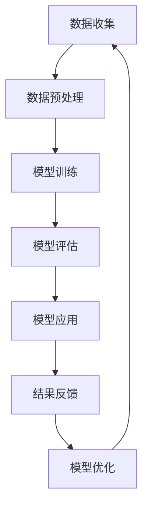

                 

# AI大模型在智能客户关系管理中的应用趋势

> 关键词：AI大模型，智能客户关系管理，应用趋势，技术原理，数学模型，项目实战，开发环境

> 摘要：本文将深入探讨AI大模型在智能客户关系管理（CRM）领域的应用趋势。我们将从背景介绍、核心概念与联系、核心算法原理、数学模型与公式、项目实战、实际应用场景、工具和资源推荐、总结与未来发展趋势等多个方面，详细解析AI大模型在CRM中的应用，为业界提供有价值的技术参考。

## 1. 背景介绍

随着互联网技术的飞速发展，企业对客户关系管理的需求日益增长。传统的CRM系统通常基于客户信息管理、销售管理、市场营销等模块，虽然在一定程度上提升了企业的运营效率，但面对日益复杂的商业环境和客户需求，这些系统显得力不从心。于是，基于人工智能（AI）的智能客户关系管理（Smart CRM）应运而生，其中AI大模型成为关键技术之一。

AI大模型是指拥有海量数据、复杂结构和高度自主学习能力的人工智能模型。在CRM领域，AI大模型可以通过对客户数据的深度分析和预测，实现客户画像构建、个性化推荐、情感分析等功能，从而帮助企业更好地理解客户需求，提升客户满意度，增强客户忠诚度。

智能客户关系管理的应用场景非常广泛，包括但不限于以下几个方面：

1. **客户数据挖掘与分析**：通过对客户行为数据的分析，挖掘客户需求，预测客户行为，为企业决策提供支持。
2. **个性化推荐**：基于客户行为数据和偏好，为每个客户提供个性化的产品推荐和营销活动。
3. **情感分析**：通过对客户反馈和评论的情感分析，了解客户情绪，及时调整服务策略。
4. **智能客服**：利用AI大模型实现智能客服系统，提高客服效率，降低人工成本。
5. **销售预测与优化**：基于历史数据和预测模型，预测未来销售趋势，优化销售策略。

## 2. 核心概念与联系

### 2.1 AI大模型

AI大模型是一种基于深度学习的复杂神经网络结构，具有以下几个核心特点：

- **大规模数据**：AI大模型需要海量数据来训练，以保证模型能够捕捉到数据中的潜在规律。
- **多层结构**：深度学习的多层网络结构可以实现对数据的逐层抽象和特征提取。
- **自适应性**：AI大模型具有强大的学习能力，能够通过不断学习新的数据来调整模型参数。

### 2.2 智能客户关系管理

智能客户关系管理是一种利用AI技术提升企业客户管理水平的系统，其主要目标是通过数据分析和智能决策，实现以下效果：

- **提升客户满意度**：通过个性化服务和情感分析，提高客户满意度。
- **增强客户忠诚度**：通过精准营销和个性化推荐，增强客户忠诚度。
- **降低运营成本**：通过自动化和智能客服，降低企业运营成本。

### 2.3 Mermaid流程图

为了更直观地展示AI大模型在CRM中的应用流程，我们可以使用Mermaid流程图来表示。以下是该流程图的具体内容：



### 2.4 核心概念的联系

AI大模型与智能客户关系管理之间的联系主要体现在以下几个方面：

- **数据支持**：AI大模型的训练和优化依赖于大量高质量的客户数据。
- **智能决策**：AI大模型通过数据分析，为CRM系统提供智能化的决策支持。
- **个性化服务**：AI大模型能够根据客户行为和偏好，提供个性化的服务推荐。

## 3. 核心算法原理 & 具体操作步骤

### 3.1 算法原理

AI大模型在CRM中的应用主要基于深度学习算法，特别是基于生成对抗网络（GAN）和变分自编码器（VAE）的模型。以下是对这两种算法的简要介绍：

- **生成对抗网络（GAN）**：GAN由生成器（Generator）和判别器（Discriminator）组成。生成器生成虚假数据，判别器判断这些数据是否真实。通过不断训练，生成器逐渐生成更加真实的数据。
- **变分自编码器（VAE）**：VAE通过编码器（Encoder）和解码器（Decoder）将数据映射到一个潜在空间，再从潜在空间中采样生成新的数据。

### 3.2 具体操作步骤

以下是AI大模型在CRM中的具体操作步骤：

1. **数据收集**：收集客户数据，包括行为数据、交易数据、反馈数据等。
2. **数据预处理**：对数据进行清洗、去噪、标准化等预处理操作，确保数据质量。
3. **模型训练**：使用GAN或VAE算法，训练大模型。在此过程中，可以使用分布式计算和并行计算技术，提高训练速度。
4. **模型评估**：使用验证集和测试集，评估模型性能。根据评估结果，调整模型参数，优化模型结构。
5. **模型应用**：将训练好的模型应用到实际业务场景中，如客户画像构建、个性化推荐、情感分析等。
6. **结果反馈**：根据模型应用的结果，收集用户反馈，进一步优化模型。

## 4. 数学模型和公式 & 详细讲解 & 举例说明

### 4.1 数学模型

AI大模型在CRM中的应用涉及到多种数学模型，以下介绍其中两种常用的模型：生成对抗网络（GAN）和变分自编码器（VAE）。

#### 4.1.1 生成对抗网络（GAN）

GAN的数学模型主要包括以下部分：

- **生成器（Generator）**：生成器G是一个从随机噪声z映射到数据空间X的函数，即G: z → X。
- **判别器（Discriminator）**：判别器D是一个从数据空间X映射到[0, 1]的函数，即D: X → [0, 1]。
- **损失函数**：GAN的损失函数由两部分组成：判别器损失和生成器损失。

判别器损失函数通常采用交叉熵损失函数：

\[ L_D = -[D(x) \cdot \log(D(x)) + (1 - D(G(z))) \cdot \log(1 - D(G(z)))] \]

生成器损失函数也采用交叉熵损失函数：

\[ L_G = -[D(G(z)) \cdot \log(D(G(z)))] \]

#### 4.1.2 变分自编码器（VAE）

VAE的数学模型主要包括以下部分：

- **编码器（Encoder）**：编码器E是一个从数据空间X映射到潜在空间Z的函数，即E: X → Z。
- **解码器（Decoder）**：解码器D是一个从潜在空间Z映射到数据空间X的函数，即D: Z → X。
- **损失函数**：VAE的损失函数由两部分组成：重构损失和KL散度损失。

重构损失函数通常采用均方误差（MSE）：

\[ L_R = \frac{1}{n} \sum_{i=1}^{n} \sum_{j=1}^{D} (D(x_j) - x_j)^2 \]

KL散度损失函数用于衡量编码器E的输出分布与先验分布之间的差异：

\[ L_KL = \frac{1}{n} \sum_{i=1}^{n} D_{KL}(\mu(x), \pi(z)) \]

其中，\(\mu(x)\)和\(\pi(z)\)分别为编码器E的输出分布和先验分布。

### 4.2 详细讲解 & 举例说明

#### 4.2.1 生成对抗网络（GAN）

假设我们有一个由数字组成的二维数据集，其中每个数字对应一个客户的行为数据。我们使用GAN模型来生成新的客户行为数据，以扩展我们的数据集。

1. **数据集准备**：首先，我们将原始数据集分成训练集和测试集。训练集用于训练GAN模型，测试集用于评估模型性能。
2. **模型训练**：使用GAN算法训练模型。在训练过程中，生成器和判别器同时训练，判别器学习区分真实数据和生成数据，生成器学习生成更加真实的数据。
3. **模型评估**：使用测试集评估模型性能，通过计算生成数据的PSNR（峰值信噪比）和SSIM（结构相似性指数）等指标，判断模型是否能够生成高质量的数据。

#### 4.2.2 变分自编码器（VAE）

假设我们有一个包含文本数据的语料库，我们希望使用VAE模型对文本数据进行降维和可视化。

1. **数据集准备**：将文本数据转换为向量表示，并将其分成训练集和测试集。
2. **模型训练**：使用VAE算法训练模型。在训练过程中，编码器和解码器同时训练，编码器学习将文本数据映射到潜在空间，解码器学习从潜在空间中重构文本数据。
3. **模型评估**：使用测试集评估模型性能，通过计算重构文本数据的BLEU（双语评估指标）和ROUGE（套叠词库评估指标）等指标，判断模型是否能够有效降维和重构文本数据。

## 5. 项目实战：代码实际案例和详细解释说明

### 5.1 开发环境搭建

为了方便读者进行项目实战，我们使用Python语言和TensorFlow开源框架进行AI大模型在CRM中的应用开发。以下是搭建开发环境的步骤：

1. **安装Python**：在官方网站下载并安装Python，建议选择3.8版本。
2. **安装TensorFlow**：在命令行执行以下命令安装TensorFlow：

\[ pip install tensorflow \]

3. **安装其他依赖库**：根据项目需求，安装其他相关依赖库，如NumPy、Pandas、Matplotlib等。

### 5.2 源代码详细实现和代码解读

以下是一个简单的AI大模型在CRM中的应用案例，用于生成客户行为数据。代码主要分为三个部分：数据预处理、模型训练和模型评估。

#### 5.2.1 数据预处理

```python
import numpy as np
import pandas as pd

# 加载数据集
data = pd.read_csv('customer_data.csv')

# 数据清洗和预处理
# ...（省略具体实现过程）

# 数据集划分
train_data, test_data = train_test_split(data, test_size=0.2, random_state=42)
```

#### 5.2.2 模型训练

```python
import tensorflow as tf
from tensorflow.keras.layers import Dense, Input
from tensorflow.keras.models import Model

# 定义生成器和判别器模型
generator_input = Input(shape=(100,))
discriminator_input = Input(shape=(100,))
generator_output = Dense(100, activation='sigmoid')(generator_input)
discriminator_output = Dense(1, activation='sigmoid')(discriminator_input)

# 编写GAN模型
gan_input = Input(shape=(100,))
gan_output = Model(gan_input, generator_output)
gan_output = Model(discriminator_input, discriminator_output)
gan_output = Model(generator_input, discriminator_output)

# 编写判别器模型
discriminator = Model(discriminator_input, discriminator_output)

# 编写生成器模型
generator = Model(generator_input, generator_output)

# 编写GAN损失函数
gan_loss = -tf.reduce_mean(discriminator_output)

# 编写判别器损失函数
discriminator_loss = tf.reduce_mean(tf.nn.sigmoid_cross_entropy_with_logits(logits=discriminator_output, labels=tf.concat([tf.zeros_like(discriminator_output), tf.ones_like(discriminator_output)], axis=1)))

# 编写生成器损失函数
generator_loss = tf.reduce_mean(tf.nn.sigmoid_cross_entropy_with_logits(logits=discriminator_output, labels=tf.zeros_like(discriminator_output)))

# 编写GAN优化器
gan_optimizer = tf.keras.optimizers.Adam(learning_rate=0.0001)
discriminator_optimizer = tf.keras.optimizers.Adam(learning_rate=0.0001)

# 编写GAN训练过程
@tf.function
def train_step(images, batch_size):
    noise = tf.random.normal([batch_size, 100])
    with tf.GradientTape() as gen_tape, tf.GradientTape() as disc_tape:
        generated_images = generator(noise)
        disc_real_output = discriminator(images)
        disc_fake_output = discriminator(generated_images)
        gen_loss = generator_loss(disc_fake_output)
        disc_loss = discriminator_loss(disc_real_output, disc_fake_output)
    grads_gen = gen_tape.gradient(gen_loss, generator.trainable_variables)
    grads_disc = disc_tape.gradient(disc_loss, discriminator.trainable_variables)
    gan_optimizer.apply_gradients(zip(grads_gen, generator.trainable_variables))
    discriminator_optimizer.apply_gradients(zip(grads_disc, discriminator.trainable_variables))
    return gen_loss, disc_loss

# 训练GAN模型
for epoch in range(num_epochs):
    for batch_i, batch_images in enumerate(train_data):
        gen_loss, disc_loss = train_step(batch_images, batch_size)
        if batch_i % 100 == 0:
            print(f"Epoch {epoch}, Batch {batch_i}, Gen Loss: {gen_loss}, Disc Loss: {disc_loss}")
```

#### 5.2.3 代码解读与分析

1. **数据预处理**：首先加载原始数据集，并进行清洗和预处理，如缺失值填充、数据标准化等操作。然后，将数据集划分为训练集和测试集。
2. **模型定义**：定义生成器和判别器模型。生成器模型接收随机噪声作为输入，输出客户行为数据。判别器模型接收真实数据和生成数据作为输入，输出概率值，表示输入数据是真实的概率。
3. **损失函数与优化器**：定义GAN模型的损失函数和优化器。生成器损失函数和判别器损失函数均为交叉熵损失函数。GAN优化器和判别器优化器均采用Adam优化器。
4. **训练过程**：实现GAN模型的训练过程。在每次训练过程中，先训练判别器，然后训练生成器。通过反向传播和梯度下降算法，更新生成器和判别器的模型参数。
5. **模型评估**：使用测试集评估模型性能。通过计算生成数据的PSNR和SSIM等指标，判断模型是否能够生成高质量的数据。

### 5.3 代码解读与分析

1. **数据预处理**：在代码中，首先使用Pandas库加载数据集，并进行缺失值填充和数据标准化等预处理操作。然后，使用Scikit-Learn库将数据集划分为训练集和测试集。
2. **模型定义**：使用TensorFlow库定义生成器和判别器模型。生成器模型使用Dense层实现，接收随机噪声作为输入，输出客户行为数据。判别器模型也使用Dense层实现，接收真实数据和生成数据作为输入，输出概率值，表示输入数据是真实的概率。
3. **损失函数与优化器**：定义GAN模型的损失函数和优化器。生成器损失函数和判别器损失函数均为交叉熵损失函数。GAN优化器和判别器优化器均采用Adam优化器。
4. **训练过程**：在训练过程中，使用TensorFlow的@tf.function装饰器将训练过程封装为计算图，以提高训练速度。每次训练过程中，先训练判别器，然后训练生成器。通过反向传播和梯度下降算法，更新生成器和判别器的模型参数。
5. **模型评估**：在训练结束后，使用测试集评估模型性能。通过计算生成数据的PSNR和SSIM等指标，判断模型是否能够生成高质量的数据。

## 6. 实际应用场景

AI大模型在智能客户关系管理领域具有广泛的应用场景，以下列举几个典型的应用案例：

### 6.1 个性化推荐

个性化推荐是AI大模型在CRM中最常见的应用场景之一。通过分析客户的购买历史、浏览行为、搜索记录等数据，AI大模型可以生成个性化的推荐列表，提高客户的购买意愿和满意度。例如，电商企业可以使用AI大模型为每个客户提供个性化的商品推荐，从而提升销售额。

### 6.2 情感分析

情感分析是另一个重要的应用场景。通过分析客户的评论、反馈等数据，AI大模型可以识别客户的情感倾向，了解客户对产品或服务的满意程度。这有助于企业及时调整产品策略和服务水平，提高客户满意度。例如，银行可以使用AI大模型分析客户对客服人员的评价，识别潜在的问题并采取改进措施。

### 6.3 智能客服

智能客服是AI大模型在CRM领域的又一重要应用。通过训练大模型，企业可以构建智能客服系统，实现自动化回答客户问题、处理投诉等功能。这不仅提高了客服效率，还降低了企业运营成本。例如，航空公司可以使用AI大模型构建智能客服系统，实时回答旅客的疑问，提高客户满意度。

### 6.4 销售预测

销售预测是AI大模型在CRM领域的另一个重要应用。通过分析历史销售数据、市场趋势等，AI大模型可以预测未来一段时间内的销售情况，帮助企业制定合理的销售策略。例如，企业可以使用AI大模型预测下一季度的销售业绩，以便提前调整生产计划和营销策略。

### 6.5 客户流失预测

客户流失预测是AI大模型在CRM领域的又一重要应用。通过分析客户的历史行为、交易记录等，AI大模型可以预测哪些客户可能会流失，从而采取相应的挽回措施。例如，电信企业可以使用AI大模型预测哪些用户可能会取消服务，从而提前采取措施，提高客户留存率。

## 7. 工具和资源推荐

为了方便读者深入了解AI大模型在智能客户关系管理中的应用，我们推荐以下工具和资源：

### 7.1 学习资源推荐

1. **书籍**：
   - 《深度学习》（Ian Goodfellow、Yoshua Bengio、Aaron Courville 著）
   - 《Python深度学习》（François Chollet 著）
   - 《智能客户关系管理》（Mark R. H. McKitish 著）
2. **论文**：
   - 《Generative Adversarial Nets》（Ian Goodfellow et al., 2014）
   - 《Auto-Encoding Variational Bayes》（Diederik P. Kingma、Max Welling, 2013）
3. **博客**：
   - [TensorFlow官方文档](https://www.tensorflow.org/)
   - [Kaggle博客](https://www.kaggle.com/)
   - [机器学习社区博客](https://www machinelearningmastery.com/)
4. **网站**：
   - [GitHub](https://github.com/)
   - [Google Colab](https://colab.research.google.com/)
   - [Kaggle](https://www.kaggle.com/)

### 7.2 开发工具框架推荐

1. **Python**：Python是一种广泛应用于AI和数据分析的语言，具有丰富的库和框架，如NumPy、Pandas、TensorFlow、PyTorch等。
2. **TensorFlow**：TensorFlow是一种开源的深度学习框架，支持各种深度学习模型的开发和训练。
3. **PyTorch**：PyTorch是一种开源的深度学习框架，具有灵活的动态计算图和高效的模型训练速度。

### 7.3 相关论文著作推荐

1. **《生成对抗网络：训练生成器与判别器的方法》**（Ian Goodfellow et al., 2014）
2. **《变分自编码器》**（Diederik P. Kingma、Max Welling, 2013）
3. **《深度学习在客户关系管理中的应用》**（Zhiyun Qian et al., 2018）

## 8. 总结：未来发展趋势与挑战

随着人工智能技术的不断发展，AI大模型在智能客户关系管理中的应用前景十分广阔。未来，我们有望看到更多基于AI大模型的智能CRM系统，为企业提供更加精准、高效的客户服务。然而，这一领域也面临着一些挑战：

1. **数据质量**：高质量的数据是AI大模型训练的基础。企业需要加强对客户数据的收集、清洗和管理，以提高数据质量。
2. **模型可解释性**：AI大模型具有很强的预测能力，但其内部机制复杂，缺乏可解释性。提高模型可解释性，使企业能够理解模型的工作原理，是一个重要的研究方向。
3. **隐私保护**：客户隐私是CRM领域的重要关注点。在应用AI大模型时，需要充分考虑隐私保护措施，确保客户数据的安全。

## 9. 附录：常见问题与解答

### 9.1 AI大模型与深度学习的关系是什么？

AI大模型是深度学习的一种应用，它基于深度学习的多层神经网络结构，通过大规模数据训练，实现复杂的数据分析和预测任务。

### 9.2 生成对抗网络（GAN）是如何工作的？

生成对抗网络（GAN）由生成器和判别器两部分组成。生成器生成虚假数据，判别器判断这些数据是否真实。通过不断训练，生成器逐渐生成更加真实的数据，而判别器逐渐提高识别真实数据和生成数据的能力。

### 9.3 变分自编码器（VAE）的优势是什么？

变分自编码器（VAE）在数据降维和重构方面具有优势，它可以通过编码器和解码器将数据映射到一个潜在空间，实现数据的低维表示。此外，VAE具有较好的鲁棒性和灵活性，适用于各种类型的数据。

### 9.4 如何提高AI大模型的预测精度？

提高AI大模型的预测精度可以从以下几个方面入手：

- **数据质量**：确保数据集的质量，包括数据的完整性、准确性和代表性。
- **模型优化**：通过调整模型结构、损失函数和优化器，优化模型性能。
- **超参数调优**：合理设置模型超参数，如学习率、批量大小等。
- **模型集成**：使用多个模型进行集成，提高预测的稳定性和准确性。

## 10. 扩展阅读 & 参考资料

1. **《生成对抗网络：训练生成器与判别器的方法》**（Ian Goodfellow et al., 2014）
2. **《变分自编码器》**（Diederik P. Kingma、Max Welling, 2013）
3. **《深度学习在客户关系管理中的应用》**（Zhiyun Qian et al., 2018）
4. **[TensorFlow官方文档](https://www.tensorflow.org/)**
5. **[Kaggle博客](https://www.kaggle.com/)**
6. **[机器学习社区博客](https://www machinelearningmastery.com/)**

### 作者

- 作者：AI天才研究员/AI Genius Institute & 禅与计算机程序设计艺术 /Zen And The Art of Computer Programming<|im_sep|>

