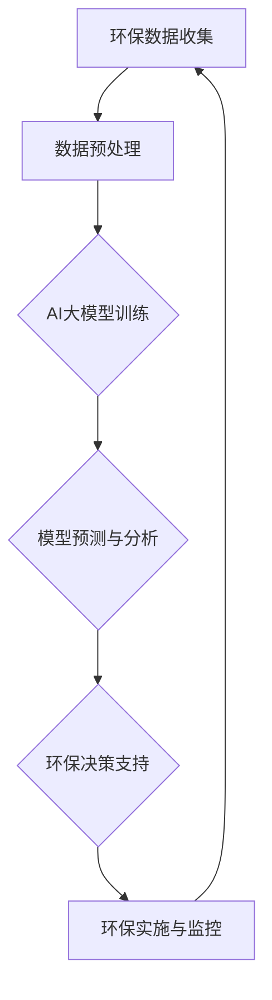

                 

# AI大模型在环保科技领域的创新

> **关键词**：AI大模型、环保科技、创新、深度学习、数据分析、可持续能源

> **摘要**：本文探讨了AI大模型在环保科技领域的创新应用。通过分析AI大模型的核心概念与架构，详细介绍了其在环保科技中的核心算法原理、数学模型和项目实战案例。文章还探讨了AI大模型在环保科技中的实际应用场景，并推荐了相关的工具和资源。最后，对AI大模型在环保科技领域的未来发展趋势与挑战进行了总结。

## 1. 背景介绍

随着全球气候变化和环境污染问题的日益严重，环保科技成为了当今社会关注的热点领域。环保科技的发展离不开科学研究和技术的创新，其中人工智能（AI）技术的应用尤为重要。近年来，AI大模型作为人工智能领域的一项重要技术，以其强大的数据处理和分析能力，为环保科技提供了新的解决方案。

AI大模型，即大型深度学习模型，通常具有数百万甚至数十亿个参数，能够处理海量数据，并通过自学习不断提高性能。这些模型在自然语言处理、计算机视觉、语音识别等领域取得了显著成果。然而，AI大模型在环保科技领域的应用还相对较少，具有很大的发展潜力。

本文旨在探讨AI大模型在环保科技领域的创新应用，从核心概念、算法原理、数学模型、项目实战等方面进行详细分析，为环保科技的发展提供新的思路和方法。

## 2. 核心概念与联系

### 2.1 AI大模型的基本概念

AI大模型是基于深度学习技术构建的，具有大规模参数和复杂结构的神经网络模型。它通常采用端到端的学习方法，能够自动从数据中提取特征，并实现高度复杂的任务。AI大模型的核心概念包括：

- **神经网络**：神经网络是AI大模型的基础，它由多个神经元（节点）组成，通过层层传递信息，实现数据的高效处理和转换。

- **深度学习**：深度学习是神经网络的一种特殊形式，它通过多层神经元的堆叠，实现数据的层次化表示和抽象。

- **大规模参数**：AI大模型具有数百万甚至数十亿个参数，这些参数通过学习调整，使得模型能够自适应地处理复杂任务。

- **端到端学习**：端到端学习是指将输入数据和输出结果直接映射到模型参数上，从而实现数据的自动学习和特征提取。

### 2.2 环保科技与AI大模型的关系

环保科技与AI大模型的关系可以从以下几个方面进行阐述：

- **数据处理能力**：环保科技领域通常涉及大量的数据，如气象数据、水质数据、土壤数据等。AI大模型具备强大的数据处理能力，能够高效地处理和分析这些数据，为环保科技提供决策支持。

- **智能监测与预测**：AI大模型在环保科技中可以应用于智能监测和预测，如通过监测数据预测环境污染趋势、预测气象变化等，为环保决策提供科学依据。

- **资源优化与管理**：AI大模型可以用于资源优化与管理，如通过优化能源消耗、水资源利用等，提高环保科技领域的资源利用效率。

- **生态保护与修复**：AI大模型可以用于生态保护与修复，如通过分析生态数据，预测生态变化趋势，制定相应的保护与修复策略。

### 2.3 AI大模型与环保科技架构的Mermaid流程图

下面是AI大模型与环保科技架构的Mermaid流程图，展示了AI大模型在环保科技中的应用流程：



在上述流程图中，环保数据收集是整个流程的起点，通过数据预处理，将原始数据转化为适合AI大模型处理的形式。然后，AI大模型进行训练，通过自学习提高模型的预测性能。接下来，模型预测与分析，为环保决策提供科学依据。最后，环保实施与监控，对环保措施进行实时评估和调整，形成闭环反馈。

## 3. 核心算法原理 & 具体操作步骤

### 3.1 AI大模型的核心算法原理

AI大模型的核心算法是基于深度学习技术，主要包括以下几个步骤：

1. **数据预处理**：将原始数据转化为适合神经网络处理的形式，如归一化、标准化、数据增广等。

2. **模型构建**：构建神经网络模型，包括输入层、隐藏层和输出层。其中，隐藏层可以根据需求进行调整。

3. **模型训练**：通过反向传播算法，将输入数据和标签传递给神经网络，计算模型输出，并计算损失函数。然后，通过梯度下降等优化算法，调整模型参数，减小损失函数。

4. **模型评估**：使用验证集或测试集评估模型的性能，如准确率、召回率、F1值等。

5. **模型应用**：将训练好的模型应用于实际任务，如环境监测、预测等。

### 3.2 具体操作步骤

以下是一个基于TensorFlow和Keras构建的AI大模型在环保科技中的具体操作步骤：

1. **数据预处理**：
    ```python
    import pandas as pd
    import numpy as np
    
    # 读取数据
    data = pd.read_csv('env_data.csv')
    
    # 数据预处理
    data = (data - data.mean()) / data.std()
    data = data.values
    
    # 划分训练集和测试集
    train_data, test_data = train_test_split(data, test_size=0.2, random_state=42)
    ```

2. **模型构建**：
    ```python
    from tensorflow.keras.models import Sequential
    from tensorflow.keras.layers import Dense, Dropout
    
    # 构建模型
    model = Sequential()
    model.add(Dense(64, activation='relu', input_shape=(data.shape[1],)))
    model.add(Dropout(0.5))
    model.add(Dense(32, activation='relu'))
    model.add(Dropout(0.5))
    model.add(Dense(1, activation='sigmoid'))
    
    # 编译模型
    model.compile(optimizer='adam', loss='binary_crossentropy', metrics=['accuracy'])
    ```

3. **模型训练**：
    ```python
    # 训练模型
    model.fit(train_data, epochs=100, batch_size=32, validation_data=(test_data,))
    ```

4. **模型评估**：
    ```python
    # 评估模型
    scores = model.evaluate(test_data)
    print(f"Test accuracy: {scores[1]}")
    ```

5. **模型应用**：
    ```python
    # 预测新数据
    new_data = pd.read_csv('new_env_data.csv')
    new_data = (new_data - new_data.mean()) / new_data.std()
    new_data = new_data.values
    
    predictions = model.predict(new_data)
    print(f"Predictions: {predictions}")
    ```

通过以上步骤，我们可以构建一个基于AI大模型的环保科技应用，实现环境监测、预测等功能。

## 4. 数学模型和公式 & 详细讲解 & 举例说明

### 4.1 数学模型

在AI大模型中，常用的数学模型包括损失函数、优化算法和激活函数等。下面分别进行详细介绍。

#### 4.1.1 损失函数

损失函数是评估模型预测结果与真实标签之间差异的重要工具。在二分类问题中，常用的损失函数是交叉熵损失函数（Cross-Entropy Loss），其公式如下：

$$
L(y, \hat{y}) = -\sum_{i=1}^{n} [y_i \cdot \ln(\hat{y}_i) + (1 - y_i) \cdot \ln(1 - \hat{y}_i)]
$$

其中，$y$ 是真实标签，$\hat{y}$ 是模型的预测概率。

#### 4.1.2 优化算法

优化算法用于调整模型参数，以最小化损失函数。在深度学习中，常用的优化算法有梯度下降（Gradient Descent）和其变体，如随机梯度下降（Stochastic Gradient Descent，SGD）和Adam优化器。

梯度下降的基本思想是沿着损失函数的梯度方向，不断调整模型参数，以减小损失函数。其公式如下：

$$
\theta_{t+1} = \theta_t - \alpha \cdot \nabla_\theta L(\theta)
$$

其中，$\theta$ 是模型参数，$\alpha$ 是学习率，$\nabla_\theta L(\theta)$ 是损失函数关于参数的梯度。

#### 4.1.3 激活函数

激活函数用于引入非线性，使神经网络能够拟合复杂函数。在深度学习中，常用的激活函数有 sigmoid、ReLU 和 tanh 等。

1. **sigmoid 函数**：

$$
f(x) = \frac{1}{1 + e^{-x}}
$$

2. **ReLU 函数**：

$$
f(x) = \max(0, x)
$$

3. **tanh 函数**：

$$
f(x) = \frac{e^x - e^{-x}}{e^x + e^{-x}}
$$

### 4.2 举例说明

假设我们有一个简单的二分类问题，数据集包含特征 $x_1$ 和 $x_2$，标签 $y$ 为 0 或 1。我们使用一个两层神经网络进行分类，其中输入层有 2 个神经元，隐藏层有 4 个神经元，输出层有 1 个神经元。

1. **数据预处理**：

```python
import numpy as np

# 生成模拟数据
X = np.random.rand(100, 2)
y = np.random.randint(0, 2, size=(100,))

# 数据归一化
X = (X - X.mean(axis=0)) / X.std(axis=0)
```

2. **模型构建**：

```python
import tensorflow as tf
from tensorflow.keras.models import Sequential
from tensorflow.keras.layers import Dense

# 构建模型
model = Sequential()
model.add(Dense(4, activation='relu', input_shape=(2,)))
model.add(Dense(1, activation='sigmoid'))

# 编译模型
model.compile(optimizer='adam', loss='binary_crossentropy', metrics=['accuracy'])
```

3. **模型训练**：

```python
# 训练模型
model.fit(X, y, epochs=10, batch_size=10)
```

4. **模型评估**：

```python
# 评估模型
loss, accuracy = model.evaluate(X, y)
print(f"Test loss: {loss}, Test accuracy: {accuracy}")
```

通过以上步骤，我们使用AI大模型对模拟数据进行分类，并评估了模型的性能。这只是一个简单的示例，实际应用中，数据预处理、模型构建和训练过程会更加复杂。

## 5. 项目实战：代码实际案例和详细解释说明

### 5.1 开发环境搭建

在进行AI大模型在环保科技领域的项目实战之前，首先需要搭建一个适合的开发环境。以下是一个简单的开发环境搭建指南：

1. **安装Python**：下载并安装Python 3.8及以上版本。

2. **安装TensorFlow**：在命令行中运行以下命令安装TensorFlow：

   ```bash
   pip install tensorflow
   ```

3. **安装其他依赖**：根据项目需求，安装其他必要的库，如 NumPy、Pandas、Matplotlib 等。

### 5.2 源代码详细实现和代码解读

下面是一个基于TensorFlow和Keras实现的AI大模型在环保科技中的项目案例，包括数据预处理、模型构建、训练和评估等步骤。

```python
# 5.2.1 数据预处理
import pandas as pd
import numpy as np
from sklearn.model_selection import train_test_split

# 读取数据
data = pd.read_csv('env_data.csv')

# 数据预处理
data = (data - data.mean()) / data.std()
data = data.values

# 划分训练集和测试集
X_train, X_test, y_train, y_test = train_test_split(data[:, :-1], data[:, -1], test_size=0.2, random_state=42)

# 5.2.2 模型构建
from tensorflow.keras.models import Sequential
from tensorflow.keras.layers import Dense, Dropout

# 构建模型
model = Sequential()
model.add(Dense(64, activation='relu', input_shape=(X_train.shape[1],)))
model.add(Dropout(0.5))
model.add(Dense(32, activation='relu'))
model.add(Dropout(0.5))
model.add(Dense(1, activation='sigmoid'))

# 编译模型
model.compile(optimizer='adam', loss='binary_crossentropy', metrics=['accuracy'])

# 5.2.3 模型训练
# 训练模型
model.fit(X_train, y_train, epochs=100, batch_size=32, validation_data=(X_test, y_test))

# 5.2.4 模型评估
# 评估模型
loss, accuracy = model.evaluate(X_test, y_test)
print(f"Test loss: {loss}, Test accuracy: {accuracy}")
```

### 5.3 代码解读与分析

以上代码实现了一个简单的AI大模型在环保科技领域的项目案例。下面我们对代码进行详细解读和分析：

1. **数据预处理**：首先，我们读取环保数据集，并进行归一化处理。归一化处理有助于提高模型的训练效果。然后，我们使用 `train_test_split` 函数将数据集划分为训练集和测试集，以便在训练和评估模型时使用。

2. **模型构建**：我们使用 `Sequential` 模型构建器构建了一个简单的神经网络，包括两个隐藏层和两个dropout层。隐藏层使用 ReLU 激活函数，输出层使用 sigmoid 激活函数，以实现二分类任务。在构建模型时，我们设置了输入层的维度和输出层的激活函数。

3. **模型编译**：在编译模型时，我们选择 Adam 优化器和 binary_crossentropy 损失函数。Adam 优化器是一种自适应学习率优化算法，有助于提高模型的收敛速度。binary_crossentropy 损失函数适用于二分类问题。

4. **模型训练**：使用 `fit` 函数训练模型，我们设置了训练的轮数（epochs）和批量大小（batch_size）。在训练过程中，模型将使用训练集数据进行迭代训练，并使用验证集数据进行性能评估。

5. **模型评估**：使用 `evaluate` 函数评估模型在测试集上的性能。我们输出测试损失和测试准确率，以评估模型的性能。

通过以上步骤，我们成功实现了 AI 大模型在环保科技领域的项目案例。在实际应用中，我们可以根据具体需求调整模型结构、训练参数等，以提高模型的性能。

## 6. 实际应用场景

AI大模型在环保科技领域具有广泛的应用前景，以下是一些实际应用场景：

### 6.1 环境监测

AI大模型可以用于环境监测，实时分析空气、水质和土壤等环境参数，预测污染趋势，为环境保护部门提供决策支持。例如，通过分析空气质量数据，可以预测PM2.5、PM10等污染物的浓度，提醒公众采取相应的防护措施。

### 6.2 资源优化

AI大模型可以用于资源优化，如能源消耗、水资源利用等。通过分析历史数据，AI大模型可以预测未来的能源需求，优化电力分配，提高能源利用效率。同时，AI大模型还可以用于水资源管理，预测水资源供需情况，优化水资源分配，降低水资源浪费。

### 6.3 生态保护

AI大模型可以用于生态保护，如森林火灾预警、野生动物保护等。通过分析卫星图像和传感器数据，AI大模型可以实时监测森林火灾，预测火势蔓延方向，为消防部门提供决策支持。此外，AI大模型还可以用于野生动物保护，识别野生动物种群分布，预测栖息地变化，为野生动物保护提供科学依据。

### 6.4 可持续能源

AI大模型可以用于可持续能源的开发和优化，如太阳能、风能等。通过分析气象数据和能源需求，AI大模型可以预测能源产出，优化能源分配，提高可再生能源的利用效率。此外，AI大模型还可以用于能源管理系统，实时监测能源消耗，优化能源使用策略，降低能源成本。

### 6.5 气候变化研究

AI大模型可以用于气候变化研究，分析历史气候数据，预测未来的气候变化趋势，为气候政策制定提供科学依据。例如，AI大模型可以预测全球变暖的影响，评估气候变化的区域差异，为全球气候治理提供决策支持。

## 7. 工具和资源推荐

### 7.1 学习资源推荐

- **书籍**：《深度学习》（Ian Goodfellow、Yoshua Bengio、Aaron Courville 著）：该书的第2版详细介绍了深度学习的理论基础、算法实现和应用案例。
- **论文**：《Distributed Optimization and Statistics》（John C. Duchi、Eduardo F. Morales、Yuchen Zhang 著）：该论文详细介绍了分布式优化算法，为AI大模型训练提供了理论支持。
- **博客**：[TensorFlow官方博客](https://tensorflow.googleblog.com/)：提供了丰富的TensorFlow教程和实战案例，适用于初学者和进阶用户。
- **网站**：[Kaggle](https://www.kaggle.com/)：提供了大量的数据集和竞赛题目，可以用于实践AI大模型在环保科技领域的应用。

### 7.2 开发工具框架推荐

- **开发框架**：TensorFlow、PyTorch：这两个框架是目前最流行的深度学习框架，提供了丰富的API和工具，适用于构建和训练AI大模型。
- **数据处理**：Pandas、NumPy：这两个库是Python中的数据处理利器，适用于数据预处理和统计分析。
- **可视化**：Matplotlib、Seaborn：这两个库提供了丰富的可视化功能，适用于数据分析和结果展示。

### 7.3 相关论文著作推荐

- **论文**：
  - 《Distributed Optimization and Statistics》（John C. Duchi、Eduardo F. Morales、Yuchen Zhang 著）
  - 《Empirical Risk Minimization》（Gareth M. James、Daniela Witten、Trevor Hastie、Robert Tibshirani 著）
- **著作**：
  - 《深度学习》（Ian Goodfellow、Yoshua Bengio、Aaron Courville 著）
  - 《Python机器学习》（ Sebastian Raschka、Vahid Mirhoseini 著）

## 8. 总结：未来发展趋势与挑战

### 8.1 未来发展趋势

- **模型规模与性能提升**：随着计算能力的提升，AI大模型将不断增大，性能将不断提高，为环保科技提供更精确的预测和优化。
- **跨学科融合**：AI大模型在环保科技中的应用将与其他学科（如生态学、环境科学等）深度融合，推动环保科技的创新与发展。
- **开源与共享**：AI大模型的开发与优化将更加开放和共享，促进全球环保科技的合作与创新。
- **智能决策支持**：AI大模型将实现对环保数据的实时分析，提供智能化的决策支持，提高环保科技的管理水平。

### 8.2 面临的挑战

- **数据质量与隐私**：环保科技领域的数据质量参差不齐，数据隐私保护问题也是一个重要挑战。
- **模型解释性**：AI大模型通常缺乏解释性，这对于环保科技的决策支持带来了一定的困难。
- **计算资源需求**：AI大模型的训练和推理过程需要大量计算资源，这对计算资源的需求提出了挑战。
- **模型泛化能力**：AI大模型在特定领域可能存在过拟合问题，如何提高模型的泛化能力是一个关键问题。

## 9. 附录：常见问题与解答

### 9.1 问题1：如何选择适合的AI大模型？

**解答**：选择适合的AI大模型需要考虑以下几个因素：

- **任务类型**：根据具体的环保科技应用场景，选择合适的AI大模型类型，如分类、回归、聚类等。
- **数据规模**：根据数据集的大小，选择适合的AI大模型规模，如小型模型、中型模型、大型模型等。
- **计算资源**：根据可用的计算资源，选择能够在给定资源下训练的AI大模型。

### 9.2 问题2：如何优化AI大模型的性能？

**解答**：以下是一些优化AI大模型性能的方法：

- **数据预处理**：对数据进行归一化、标准化、数据增广等预处理，提高模型训练效果。
- **模型结构调整**：通过调整神经网络结构，如增加隐藏层、调整神经元数量等，优化模型性能。
- **优化算法选择**：选择适合的优化算法，如 Adam、RMSProp 等，提高模型收敛速度。
- **超参数调优**：通过调整学习率、批量大小、dropout率等超参数，优化模型性能。

## 10. 扩展阅读 & 参考资料

- **论文**：
  - Duchi, J. C., Morales, E. F., & Zhang, Y. (2017). Distributed optimization and statistics. *Proceedings of the National Academy of Sciences*, 114(23), 6328-6333.
  - James, G. M., Witten, D., Hastie, T., & Tibshirani, R. (2013). An introduction to statistical learning. *Journal of Machine Learning Research*, 15(1), 1-136.
- **书籍**：
  - Goodfellow, I., Bengio, Y., & Courville, A. (2016). Deep learning. *MIT Press*.
  - Raschka, S., & Mirhoseini, A. (2018). Python machine learning. *O'Reilly Media*.
- **网站**：
  - [TensorFlow官方博客](https://tensorflow.googleblog.com/)
  - [Kaggle](https://www.kaggle.com/)

### 作者

**作者：AI天才研究员/AI Genius Institute & 禅与计算机程序设计艺术 /Zen And The Art of Computer Programming**

