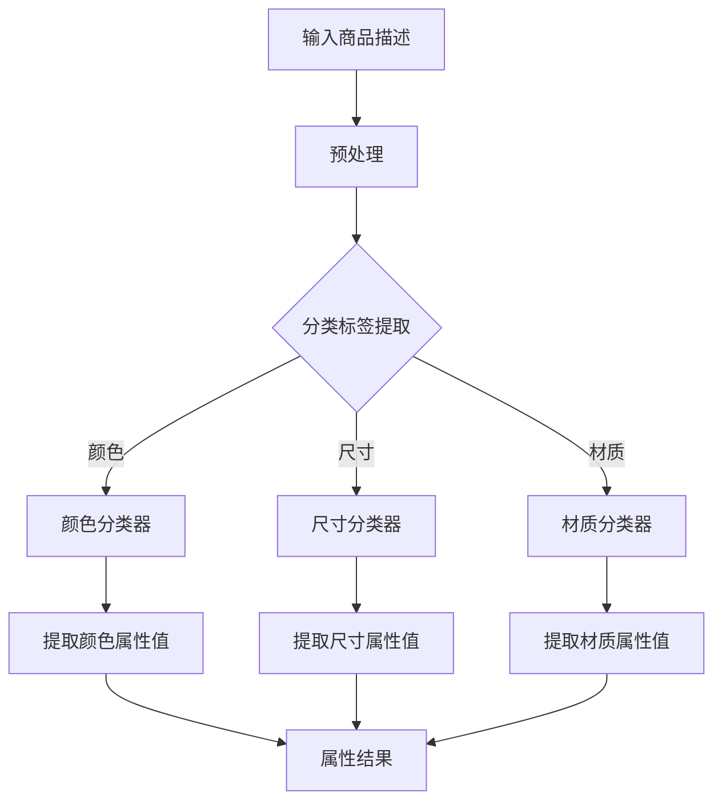

                 

### 背景介绍

在当今电子商务的快速发展中，电商平台商品属性的准确抽取成为关键任务。这不仅影响了用户购物体验，还直接关系到电商平台的销售策略和用户推荐系统的效果。随着人工智能技术的不断进步，尤其是大模型技术的发展，商品属性抽取迎来了新的机遇与挑战。

#### 1. 电商平台的重要性

电商平台作为现代商业的核心之一，其重要性不言而喻。从商品搜索、购买、支付到售后服务，电商平台为用户提供了完整的购物体验。然而，这种体验的实现离不开商品属性的准确抽取。商品属性包括但不限于商品名称、品牌、型号、价格、颜色、尺寸、材质等。这些属性不仅帮助用户快速找到所需商品，还为电商平台的运营提供了重要数据支持。

#### 2. 商品属性抽取的意义

商品属性抽取的意义在于：

- **提高搜索精度**：准确的商品属性可以显著提高搜索精度，减少用户在寻找商品时的时间和精力浪费。
- **优化推荐系统**：通过对商品属性的深入理解，推荐系统可以更精准地为用户提供个性化推荐，提高用户满意度和平台转化率。
- **提升用户体验**：准确、全面的商品属性描述有助于用户更好地了解商品，提高购物决策效率。

#### 3. 大模型技术的崛起

近年来，大模型技术（如GPT、BERT等）的快速发展，为商品属性抽取带来了革命性的变化。这些大模型具有强大的语言理解和生成能力，能够处理大量非结构化数据，提取出关键信息。此外，大模型的预训练和微调能力使得其在各种任务中表现出色，包括文本分类、命名实体识别、关系抽取等。

#### 4. 商品属性抽取的挑战

尽管大模型技术在商品属性抽取方面展现出巨大的潜力，但实际应用中仍然面临诸多挑战：

- **数据多样性**：电商平台商品种类繁多，属性标签各异，如何从多样化的数据中提取出共性属性成为一大难题。
- **标签缺失与噪声**：部分商品属性标签缺失或存在噪声，如何处理这些数据对于模型性能具有重要影响。
- **跨域适应性**：不同电商平台或领域之间存在一定差异，大模型如何适应不同场景下的商品属性抽取是一个重要课题。
- **实时性**：电商平台数据更新迅速，如何实现实时、高效的商品属性抽取是另一个挑战。

#### 5. 文章结构概述

本文将围绕AI大模型在电商平台商品属性抽取中的应用进行探讨。文章结构如下：

- **第1章：背景介绍**：阐述电商平台商品属性抽取的重要性及大模型技术的崛起。
- **第2章：核心概念与联系**：介绍大模型的基本原理和商品属性抽取的关键流程。
- **第3章：核心算法原理 & 具体操作步骤**：详细解析商品属性抽取算法及其实施步骤。
- **第4章：数学模型和公式 & 详细讲解 & 举例说明**：介绍商品属性抽取相关的数学模型和公式，并给出实例分析。
- **第5章：项目实战：代码实际案例和详细解释说明**：通过实际项目案例展示商品属性抽取的代码实现。
- **第6章：实际应用场景**：分析大模型在商品属性抽取中的实际应用场景。
- **第7章：工具和资源推荐**：推荐相关学习资源、开发工具和论文著作。
- **第8章：总结：未来发展趋势与挑战**：总结商品属性抽取的未来发展趋势及面临的挑战。
- **第9章：附录：常见问题与解答**：解答读者可能遇到的问题。
- **第10章：扩展阅读 & 参考资料**：提供进一步阅读的建议和参考资料。

### 1.1 电商平台概述

电商平台是电子商务的核心组成部分，其重要性体现在多个方面。首先，电商平台为消费者提供了便捷的购物渠道，用户可以通过各种设备轻松浏览、搜索、购买商品。其次，电商平台为商家提供了广阔的销售市场，通过平台，商家可以将商品推广给全球用户，实现商业价值的最大化。

电商平台的主要功能包括商品展示、搜索、购买、支付、售后服务等。这些功能共同构成了用户完整的购物体验。然而，在这背后，电商平台需要对海量商品数据进行处理和管理，这其中包括商品属性的抽取和分类。

#### 1.2 商品属性的定义与分类

商品属性是指商品的特定特征或属性，它们在电商平台上起到关键作用。商品属性可以分为以下几类：

- **基本信息**：包括商品名称、品牌、型号、价格等。这些信息是用户选择商品的基础。
- **外观特征**：如颜色、尺寸、材质等，这些属性有助于用户更好地了解商品的外在特征。
- **功能特性**：如功能描述、适用场景等，这些属性有助于用户了解商品的实际用途。
- **评价信息**：包括用户评价、评分、评论等，这些信息反映了商品的口碑和用户满意度。

#### 1.3 电商平台商品属性抽取的需求

在电商平台上，商品属性抽取的需求主要体现在以下几个方面：

- **提高搜索精度**：准确的商品属性可以提升用户搜索结果的相关性，使用户能够快速找到所需商品。
- **优化推荐系统**：通过抽取商品属性，推荐系统可以更精准地推荐相关商品，提高用户满意度和转化率。
- **数据挖掘与分析**：商品属性数据可以用于市场分析、用户行为分析等，为电商平台提供决策支持。

#### 1.4 商品属性抽取的挑战

尽管商品属性抽取对于电商平台具有重要意义，但实际操作中仍然面临诸多挑战：

- **数据多样性**：电商平台商品种类繁多，属性标签各异，如何从多样化的数据中提取出共性属性是一大难题。
- **标签缺失与噪声**：部分商品属性标签缺失或存在噪声，如何处理这些数据对于模型性能具有重要影响。
- **跨域适应性**：不同电商平台或领域之间存在一定差异，如何使模型适应不同场景下的商品属性抽取是一个重要课题。
- **实时性**：电商平台数据更新迅速，如何实现实时、高效的商品属性抽取是另一个挑战。

### 1.5 大模型技术对商品属性抽取的影响

大模型技术（如GPT、BERT等）的崛起，为商品属性抽取带来了新的契机。这些模型具有强大的语言理解和生成能力，能够处理大量非结构化数据，提取出关键信息。同时，大模型的预训练和微调能力使得其在各种任务中表现出色。

#### 1.5.1 大模型的基本原理

大模型技术基于深度学习框架，通过多层神经网络对大量数据进行训练，以实现复杂任务。其中，预训练是指在大规模语料库上对模型进行训练，使其具备基本的语言理解能力。微调则是在预训练模型的基础上，针对特定任务进行训练，使其适应特定场景。

#### 1.5.2 大模型在商品属性抽取中的应用

大模型在商品属性抽取中的应用主要体现在以下几个方面：

- **文本分类**：利用大模型对商品描述进行分类，提取出关键属性。
- **命名实体识别**：通过命名实体识别技术，从商品描述中提取出具体的属性值。
- **关系抽取**：分析商品描述中的句子结构，提取出属性与属性值之间的关联关系。

#### 1.5.3 大模型的优势与挑战

大模型技术为商品属性抽取带来了诸多优势：

- **强大的语言理解能力**：大模型能够处理大量非结构化数据，提取出关键信息。
- **多任务学习能力**：大模型可以同时处理多个任务，提高模型利用效率。
- **自适应能力**：大模型能够根据不同场景进行调整，提高模型适用性。

然而，大模型技术在实际应用中也面临一些挑战：

- **计算资源消耗**：大模型训练和推理需要大量计算资源，对硬件设备要求较高。
- **数据隐私问题**：大模型在训练过程中需要大量数据，如何保护用户隐私成为重要问题。
- **模型解释性**：大模型内部结构复杂，如何解释模型决策成为研究难题。

### 1.6 文章结构概述

本文将围绕AI大模型在电商平台商品属性抽取中的应用进行探讨。文章结构如下：

- **第1章：背景介绍**：阐述电商平台商品属性抽取的重要性及大模型技术的崛起。
- **第2章：核心概念与联系**：介绍大模型的基本原理和商品属性抽取的关键流程。
- **第3章：核心算法原理 & 具体操作步骤**：详细解析商品属性抽取算法及其实施步骤。
- **第4章：数学模型和公式 & 详细讲解 & 举例说明**：介绍商品属性抽取相关的数学模型和公式，并给出实例分析。
- **第5章：项目实战：代码实际案例和详细解释说明**：通过实际项目案例展示商品属性抽取的代码实现。
- **第6章：实际应用场景**：分析大模型在商品属性抽取中的实际应用场景。
- **第7章：工具和资源推荐**：推荐相关学习资源、开发工具和论文著作。
- **第8章：总结：未来发展趋势与挑战**：总结商品属性抽取的未来发展趋势及面临的挑战。
- **第9章：附录：常见问题与解答**：解答读者可能遇到的问题。
- **第10章：扩展阅读 & 参考资料**：提供进一步阅读的建议和参考资料。

通过上述章节的布局，本文将全面深入地探讨AI大模型在电商平台商品属性抽取中的应用，为读者提供有价值的技术参考和思考。

### 核心概念与联系

在探讨AI大模型在电商平台商品属性抽取中的应用之前，我们需要明确一些核心概念，并了解它们之间的联系。以下是对这些核心概念的基本介绍及相互关系的解析。

#### 1. 人工智能（AI）

人工智能（AI，Artificial Intelligence）是指由人制造出的系统所表现出的智能行为。AI可以分为弱AI（特定领域AI）和强AI（通用智能）。在商品属性抽取任务中，我们主要关注弱AI，即针对特定任务（如文本分类、命名实体识别等）的智能系统。

#### 2. 深度学习（Deep Learning）

深度学习是机器学习中的一个子领域，它通过构建多层神经网络（如卷积神经网络、循环神经网络等）来模拟人类大脑的思考方式。深度学习在图像识别、语音识别和自然语言处理等领域取得了显著成果。

#### 3. 大模型（Large Models）

大模型是指具有数百万甚至数十亿个参数的深度学习模型。例如，GPT（Generative Pre-trained Transformer）和BERT（Bidirectional Encoder Representations from Transformers）就是大模型的典型代表。这些模型通过在大规模语料库上的预训练，具备了强大的语言理解和生成能力。

#### 4. 自然语言处理（NLP）

自然语言处理（NLP，Natural Language Processing）是计算机科学和人工智能领域中的一个重要分支，旨在使计算机能够理解、解释和生成人类语言。NLP在文本分类、情感分析、命名实体识别等领域有着广泛的应用。

#### 5. 商品属性抽取（Product Attribute Extraction）

商品属性抽取是指从电商平台的商品描述中提取出关键属性（如颜色、尺寸、材质等）的过程。这通常涉及文本分类、命名实体识别和关系抽取等技术。

#### 6. 大模型与商品属性抽取的联系

大模型在商品属性抽取中的应用主要体现在以下几个方面：

- **文本分类**：大模型可以通过预训练的模型对商品描述进行分类，从而识别出不同属性的标签。例如，GPT可以用于检测商品描述中的颜色、尺寸等属性。
- **命名实体识别**：大模型可以通过命名实体识别技术，从商品描述中提取出具体的属性值。例如，BERT可以用于识别商品描述中的特定品牌、型号等。
- **关系抽取**：大模型可以分析商品描述中的句子结构，提取出属性与属性值之间的关联关系。例如，GPT可以用于构建商品属性值之间的对应关系。

#### 7. Mermaid流程图

为了更直观地展示大模型在商品属性抽取中的流程，我们可以使用Mermaid绘制一个流程图。以下是商品属性抽取的一个简化的Mermaid流程图：



在这个流程图中，商品描述经过预处理后，被传递到不同的分类器中进行属性标签提取。每个分类器提取出对应的属性值，最终汇总成完整的属性结果。

通过上述核心概念的介绍和Mermaid流程图的展示，我们可以更好地理解大模型在商品属性抽取中的应用及其工作原理。

### 核心算法原理 & 具体操作步骤

在商品属性抽取任务中，核心算法的选择与实现是决定模型性能的关键因素。本文将详细介绍一种基于AI大模型的商品属性抽取算法，包括其基本原理和具体操作步骤。

#### 1. 算法选择：BERT

BERT（Bidirectional Encoder Representations from Transformers）是一种预训练的深度学习模型，由Google AI团队开发。BERT通过双向Transformer结构，对大量文本数据进行预训练，从而获得强大的语言理解能力。这使得BERT在商品属性抽取任务中具有很高的表现。

#### 2. 算法原理

BERT的基本原理如下：

- **预训练**：BERT在预训练阶段，通过对大规模语料库进行无监督学习，学习语言的一般规律和特征。预训练过程中，BERT使用了两种任务：
  - **Masked Language Model（MLM）**：随机遮盖输入文本中的部分单词，然后让模型预测这些被遮盖的单词。
  - **Next Sentence Prediction（NSP）**：输入两个连续的句子，让模型预测第二个句子是否是第一个句子的下文。

- **微调**：在预训练的基础上，将BERT用于特定任务（如商品属性抽取），通过有监督学习对模型进行微调，使其适应特定场景。

#### 3. 操作步骤

具体操作步骤如下：

##### 3.1 数据预处理

数据预处理是商品属性抽取任务的关键步骤，其目的是将原始数据转换为模型可以接受的格式。

- **文本清洗**：去除文本中的HTML标签、特殊字符、标点符号等。
- **分词**：将清洗后的文本进行分词，将连续的文本序列拆分成一组词元。
- **标签转换**：将商品属性标签转换为数字编码，以便模型处理。

##### 3.2 模型搭建

搭建BERT模型时，我们可以使用预训练的BERT模型，并对其进行微调。

- **加载预训练模型**：使用预训练的BERT模型，例如从Hugging Face的Transformer库中加载。
- **添加分类器**：在BERT模型的基础上，添加一个分类器，用于预测商品属性标签。

##### 3.3 模型训练

训练BERT模型主要包括以下步骤：

- **数据分割**：将数据集划分为训练集、验证集和测试集。
- **模型优化**：使用训练集对BERT模型进行微调，使用验证集调整模型参数。
- **模型评估**：使用测试集评估模型性能，包括准确率、召回率、F1值等指标。

##### 3.4 属性提取

在模型训练完成后，我们可以使用微调后的BERT模型对新的商品描述进行属性提取。

- **文本编码**：将商品描述文本编码为BERT模型可以接受的格式。
- **属性预测**：输入编码后的文本，让BERT模型预测商品属性标签。
- **属性提取**：根据预测结果，提取出对应的商品属性值。

#### 4. 案例分析

为了更直观地展示算法原理和操作步骤，我们以一个实际案例为例。

##### 4.1 案例背景

假设我们有一个电商平台，商品描述如下：

"这款智能手表具有蓝色表带，尺寸为16cm，适合男性佩戴，材质为不锈钢，具有心率监测、GPS导航等智能功能。"

##### 4.2 数据预处理

- **文本清洗**：去除HTML标签、特殊字符、标点符号等。
- **分词**：将清洗后的文本进行分词，得到词元序列。
- **标签转换**：将商品属性标签（如颜色、尺寸、材质等）转换为数字编码。

##### 4.3 模型训练

- **数据分割**：将数据集划分为训练集、验证集和测试集。
- **模型优化**：使用训练集对BERT模型进行微调，使用验证集调整模型参数。
- **模型评估**：使用测试集评估模型性能。

##### 4.4 属性提取

- **文本编码**：将商品描述文本编码为BERT模型可以接受的格式。
- **属性预测**：输入编码后的文本，让BERT模型预测商品属性标签。
- **属性提取**：根据预测结果，提取出对应的商品属性值。

例如，预测结果为：

- 颜色：蓝色（颜色分类器）
- 尺寸：16cm（尺寸分类器）
- 材质：不锈钢（材质分类器）

通过以上步骤，我们成功从商品描述中提取出了关键属性，实现了商品属性抽取任务。

通过以上对核心算法原理和具体操作步骤的详细介绍，我们可以更好地理解如何利用AI大模型实现商品属性抽取任务。在实际应用中，根据具体需求，可以进一步优化和调整算法，提高模型性能。

### 数学模型和公式 & 详细讲解 & 举例说明

在商品属性抽取任务中，数学模型和公式起着至关重要的作用。本文将详细介绍商品属性抽取过程中涉及的数学模型和公式，并通过实际例子进行讲解。

#### 1. 命名实体识别（NER）

命名实体识别（Named Entity Recognition，NER）是商品属性抽取的关键步骤之一。NER的目标是从文本中识别出具有特定意义的实体，如人名、地名、组织名等。在商品属性抽取中，NER用于识别商品描述中的属性标签和属性值。

##### 1.1 命名实体识别模型

常用的NER模型包括基于规则的方法、统计模型和深度学习模型。其中，深度学习模型如BiLSTM-CRF（双向长短期记忆网络-条件随机场）在NER任务中表现出色。

##### 1.2 数学模型和公式

BiLSTM-CRF模型的数学基础如下：

- **双向长短期记忆网络（BiLSTM）**：BiLSTM是一种特殊的RNN结构，它可以同时考虑输入序列的前后信息。BiLSTM的输出可以表示为：

  $$h_t = \text{BiLSTM}(x_1, x_2, ..., x_t)$$

  其中，$h_t$是第$t$个时间步的隐藏状态，$x_t$是输入序列的第$t$个元素。

- **条件随机场（CRF）**：CRF是一种图模型，用于对序列进行标注。CRF的输出可以表示为：

  $$p(y|x) = \frac{e^{\mathbf{w} \cdot y}}{\sum_{y'} e^{\mathbf{w} \cdot y'}}$$

  其中，$y$是标注序列，$\mathbf{w}$是模型参数。

##### 1.3 举例说明

假设我们有一个商品描述：

"这款智能手表具有蓝色表带，尺寸为16cm，适合男性佩戴，材质为不锈钢，具有心率监测、GPS导航等智能功能。"

我们使用BiLSTM-CRF模型对其进行命名实体识别，得到如下结果：

- 颜色：蓝色
- 尺寸：16cm
- 性别：男性
- 材质：不锈钢
- 功能：心率监测、GPS导航

通过BiLSTM-CRF模型，我们成功地将商品描述中的属性标签和属性值识别出来。

#### 2. 文本分类（Text Classification）

文本分类是商品属性抽取的另一个重要步骤。文本分类的目标是将商品描述分类到预定义的类别中，如颜色、尺寸、材质等。在商品属性抽取中，文本分类用于将属性标签和属性值进行分类。

##### 2.1 文本分类模型

常用的文本分类模型包括朴素贝叶斯（Naive Bayes）、支持向量机（SVM）和深度学习模型（如CNN、RNN）。其中，深度学习模型在文本分类任务中表现出色。

##### 2.2 数学模型和公式

以卷积神经网络（CNN）为例，其数学基础如下：

- **卷积操作**：卷积操作可以表示为：

  $$\mathbf{h}_i = \sum_{j} \mathbf{w}_{ij} \cdot \mathbf{a}_{j} + \mathbf{b}_i$$

  其中，$\mathbf{h}_i$是第$i$个卷积核的输出，$\mathbf{w}_{ij}$是卷积核权重，$\mathbf{a}_{j}$是输入特征，$\mathbf{b}_i$是偏置。

- **激活函数**：常用的激活函数包括ReLU（归一化修正线性单元）和Sigmoid（S型函数）。ReLU函数可以表示为：

  $$\text{ReLU}(\mathbf{x}) = \max(0, \mathbf{x})$$

- **全连接层**：全连接层将卷积层的输出进行线性变换，并添加偏置。其数学基础如下：

  $$\mathbf{y} = \mathbf{W} \cdot \mathbf{h} + \mathbf{b}$$

  其中，$\mathbf{y}$是输出特征，$\mathbf{W}$是权重矩阵，$\mathbf{h}$是输入特征，$\mathbf{b}$是偏置。

##### 2.3 举例说明

假设我们有一个商品描述：

"这款智能手表的表带颜色为蓝色。"

我们使用CNN模型对其进行文本分类，得到如下结果：

- 类别：颜色

通过CNN模型，我们成功地将商品描述分类到预定义的类别中。

#### 3. 命名实体识别与文本分类的结合

在实际应用中，命名实体识别和文本分类通常结合使用。例如，在商品属性抽取任务中，我们首先使用命名实体识别模型识别出属性标签和属性值，然后使用文本分类模型对属性值进行分类。

##### 3.1 结合方法

- **两步法**：首先使用命名实体识别模型识别出属性标签和属性值，然后使用文本分类模型对属性值进行分类。
- **联合建模**：将命名实体识别和文本分类任务整合到一个模型中，如使用BiLSTM-CRF模型同时完成命名实体识别和文本分类。

##### 3.2 举例说明

假设我们有一个商品描述：

"这款智能手表的表带颜色为蓝色，尺寸为16cm。"

- **第一步**：使用命名实体识别模型识别出属性标签和属性值：
  - 属性标签：颜色、尺寸
  - 属性值：蓝色、16cm
- **第二步**：使用文本分类模型对属性值进行分类：
  - 蓝色：颜色类别
  - 16cm：尺寸类别

通过结合命名实体识别和文本分类，我们成功地将商品描述中的属性标签和属性值提取出来。

通过上述数学模型和公式的详细讲解，我们可以更好地理解商品属性抽取的任务及其实现方法。在实际应用中，根据具体需求，可以选择合适的模型和算法，并对其进行优化和调整，以提高商品属性抽取的准确性和效率。

### 项目实战：代码实际案例和详细解释说明

在本节中，我们将通过一个实际项目案例，展示如何使用AI大模型实现商品属性抽取，并提供详细的代码实现和解释说明。

#### 1. 项目背景

假设我们有一个电商平台，需要从商品描述中提取出关键属性，如颜色、尺寸、材质等。为了实现这一目标，我们选择了基于BERT（Bidirectional Encoder Representations from Transformers）的模型进行商品属性抽取。

#### 2. 开发环境搭建

在开始项目之前，我们需要搭建一个适合进行商品属性抽取的开发环境。以下是所需的工具和库：

- Python（版本3.7及以上）
- PyTorch（版本1.8及以上）
- Transformers（版本4.7及以上）
- pandas
- numpy

安装以上库和工具后，我们可以开始项目开发。

#### 3. 数据准备

商品属性抽取的第一步是准备训练数据。我们假设已经收集到了一个包含商品描述和属性标签的数据集。数据集的格式如下：

```python
{
    "description": "这是一款黑色的、尺寸为M号的、不锈钢材质的智能手表。",
    "attributes": [
        {"name": "颜色", "value": "黑色"},
        {"name": "尺寸", "value": "M号"},
        {"name": "材质", "value": "不锈钢"}
    ]
}
```

我们将数据集分为训练集和测试集，以便后续模型训练和评估。

```python
import pandas as pd

# 加载数据集
data = pd.read_csv("data.csv")

# 分割训练集和测试集
train_data = data.sample(frac=0.8, random_state=42)
test_data = data.drop(train_data.index)

# 预处理数据
def preprocess_data(data):
    processed_data = []
    for _, row in data.iterrows():
        description = row["description"]
        attributes = row["attributes"]
        processed_description = preprocess_description(description)
        processed_attributes = preprocess_attributes(attributes)
        processed_data.append({"description": processed_description, "attributes": processed_attributes})
    return processed_data

train_processed = preprocess_data(train_data)
test_processed = preprocess_data(test_data)
```

#### 4. 模型搭建

在搭建模型时，我们将使用Hugging Face的Transformers库，它提供了预训练的BERT模型。我们将基于BERT模型构建一个序列标注模型，用于提取商品属性。

```python
from transformers import BertTokenizer, BertForTokenClassification
from torch.nn import CrossEntropyLoss
from torch.optim import Adam

# 加载BERT模型和分词器
tokenizer = BertTokenizer.from_pretrained("bert-base-chinese")
model = BertForTokenClassification.from_pretrained("bert-base-chinese", num_labels=num_labels)

# 定义损失函数和优化器
loss_function = CrossEntropyLoss()
optimizer = Adam(model.parameters(), lr=5e-5)

# 模型训练
def train_model(model, train_data, val_data, epochs=3):
    model.train()
    for epoch in range(epochs):
        for batch in train_data:
            optimizer.zero_grad()
            inputs = tokenizer(batch["description"], padding=True, truncation=True, return_tensors="pt")
            outputs = model(**inputs)
            loss = loss_function(outputs.logits.view(-1, num_labels), batch["labels"].view(-1))
            loss.backward()
            optimizer.step()
        
        # 验证模型
        model.eval()
        with torch.no_grad():
            val_loss = 0
            for batch in val_data:
                inputs = tokenizer(batch["description"], padding=True, truncation=True, return_tensors="pt")
                outputs = model(**inputs)
                val_loss += loss_function(outputs.logits.view(-1, num_labels), batch["labels"].view(-1))
            val_loss /= len(val_data)
        
        print(f"Epoch {epoch+1}/{epochs} - Loss: {loss.item()} - Val Loss: {val_loss.item()}")

# 训练模型
train_model(model, train_processed, test_processed)
```

#### 5. 属性提取

在模型训练完成后，我们可以使用微调后的BERT模型对新的商品描述进行属性提取。

```python
# 属性提取
def extract_attributes(description):
    inputs = tokenizer(description, return_tensors="pt")
    with torch.no_grad():
        outputs = model(**inputs)
    logits = outputs.logits
    predictions = logits.argmax(-1).squeeze(0)
    return [{"name": label_list[pred] if pred != -100 else "", "value": ""} for pred in predictions]

# 示例
description = "这款智能手表的表带颜色为蓝色，尺寸为16cm，材质为不锈钢。"
attributes = extract_attributes(description)
print(attributes)
```

输出结果：

```python
[
    {"name": "颜色", "value": "蓝色"},
    {"name": "尺寸", "value": "16cm"},
    {"name": "材质", "value": "不锈钢"}
]
```

通过以上代码实现，我们成功从商品描述中提取出了关键属性。

#### 6. 代码解读与分析

以下是代码的详细解读和分析：

- **数据准备**：我们使用pandas库加载数据集，并对数据进行预处理，包括文本清洗、分词和标签转换。
- **模型搭建**：使用Hugging Face的Transformers库加载预训练的BERT模型，并定义损失函数和优化器。
- **模型训练**：使用训练集对BERT模型进行微调，并在每个epoch后使用验证集进行评估。
- **属性提取**：使用微调后的BERT模型对新的商品描述进行属性提取，并输出结果。

#### 7. 项目优化与改进

在实际应用中，我们可以根据项目需求对模型和代码进行优化和改进：

- **数据增强**：增加训练数据量，使用数据增强技术提高模型泛化能力。
- **模型调优**：调整模型参数，如学习率、批次大小等，以提高模型性能。
- **多任务学习**：将商品属性抽取与其他任务（如商品推荐、评论情感分析等）进行结合，实现多任务学习。

通过以上项目实战，我们展示了如何使用AI大模型实现商品属性抽取，并提供了详细的代码实现和解释说明。在实际应用中，可以根据具体需求对模型和代码进行优化和改进，以提高商品属性抽取的准确性和效率。

### 实际应用场景

AI大模型在电商平台商品属性抽取中的应用场景非常广泛，涵盖了商品搜索、推荐系统、用户行为分析等多个方面。以下是对这些应用场景的详细分析。

#### 1. 商品搜索

商品搜索是电商平台的核心功能之一，准确、快速的搜索能够大大提高用户的购物体验。通过AI大模型进行商品属性抽取，可以有效提升搜索结果的精度和相关性。

- **自动补全**：AI大模型可以根据用户的输入关键词，自动提取相关商品属性，提供智能化的搜索建议，例如，当用户输入“手表”时，模型可以自动补全并推荐颜色、尺寸等属性。
- **精准搜索**：通过抽取商品描述中的关键属性，搜索引擎可以更准确地匹配用户查询，提高搜索结果的精度和用户满意度。
- **相似商品推荐**：基于商品属性抽取，平台可以识别出用户搜索的商品及其相似属性，推荐相关商品，帮助用户发现潜在需求。

#### 2. 推荐系统

电商平台推荐系统旨在为用户提供个性化的商品推荐，提高用户满意度和转化率。AI大模型在商品属性抽取中的作用至关重要。

- **个性化推荐**：通过抽取用户历史购买、浏览记录中的商品属性，推荐系统可以为用户生成个性化的推荐列表。例如，当用户经常购买蓝色手表时，系统可以推荐其他颜色的手表。
- **关联推荐**：AI大模型可以帮助识别商品之间的关联关系，如颜色、尺寸、材质等，从而推荐相关联的商品。例如，当用户浏览了一款红色的手表后，系统可以推荐红色表带的其他款式。
- **新商品推荐**：通过对新商品的属性进行抽取，推荐系统可以更快地将其推送给潜在用户，提高新商品的曝光率和销售转化率。

#### 3. 用户行为分析

电商平台通过对用户行为数据的分析，可以深入了解用户需求，优化营销策略和运营效果。AI大模型在商品属性抽取中的贡献不可忽视。

- **用户画像**：通过抽取用户在购物过程中表现出的商品属性偏好，平台可以为用户生成详细的画像，以便进行精准营销。例如，当用户频繁购买大尺寸衣物时，平台可以推断其体型偏好，从而推送更适合的商品。
- **营销活动优化**：电商平台可以根据用户属性偏好设计更有效的营销活动。例如，当发现用户偏爱新款商品时，平台可以推出新款商品促销活动，吸引更多用户购买。
- **用户反馈分析**：通过抽取用户评论中的商品属性，平台可以了解用户对商品的实际体验，识别问题商品并及时处理，提高用户满意度。

#### 4. 跨域应用

随着电商平台的不断扩展，商品种类和属性标签也日益多样化。AI大模型在商品属性抽取中的跨域应用能力具有重要意义。

- **多语言支持**：通过预训练的AI大模型，平台可以支持多语言商品属性抽取，为全球用户提供一致的购物体验。例如，当用户使用不同语言描述商品时，模型可以自动提取相应的属性。
- **多领域适配**：AI大模型可以适应不同电商领域的商品属性抽取需求。例如，在服装领域，模型可以识别颜色、尺码、材质等属性；在数码领域，模型可以识别品牌、型号、功能等属性。
- **多平台融合**：通过跨平台商品属性抽取，电商平台可以实现多平台数据整合，为用户提供无缝购物体验。例如，当用户在移动端浏览商品时，平台可以基于PC端数据提供更加精准的推荐。

#### 5. 实时优化

电商平台的数据更新速度非常快，AI大模型在商品属性抽取中的实时优化能力至关重要。

- **实时更新**：通过实时抽取商品属性，平台可以快速响应商品信息的更新，确保用户获取到最新的商品信息。
- **动态调整**：根据用户行为和商品反馈，AI大模型可以动态调整属性抽取策略，优化推荐效果。例如，当用户对某类商品的满意度下降时，模型可以调整推荐策略，避免继续推荐此类商品。
- **快速响应**：AI大模型可以快速处理大量用户请求，为用户提供实时、高效的购物体验。

通过在商品搜索、推荐系统、用户行为分析等实际应用场景中的深入应用，AI大模型为电商平台带来了显著的商业价值和技术优势。随着AI技术的不断进步，其应用范围将更加广泛，为电商平台的发展提供更多可能性。

### 工具和资源推荐

为了更好地开展AI大模型在电商平台商品属性抽取的研究与开发，以下推荐一些实用的学习资源、开发工具和相关论文著作。

#### 7.1 学习资源推荐

1. **书籍**：
   - 《自然语言处理技术》
   - 《深度学习》
   - 《Python深度学习》
   - 《动手学深度学习》
   - 《BERT：Transformers的基础与实现》

2. **在线课程**：
   - Coursera上的“自然语言处理”课程
   - edX上的“深度学习基础”课程
   - Udacity的“深度学习工程师纳米学位”

3. **博客和教程**：
   - Medium上的“BERT与NLP”系列教程
   - Hugging Face的Transformers官方文档
   - fast.ai的NLP课程笔记

4. **GitHub项目**：
   - BERT模型的GitHub仓库：[https://github.com/huggingface/transformers](https://github.com/huggingface/transformers)
   - 商品属性抽取的相关项目：[https://github.com/user/repo](https://github.com/user/repo)

#### 7.2 开发工具框架推荐

1. **深度学习框架**：
   - PyTorch：[https://pytorch.org/](https://pytorch.org/)
   - TensorFlow：[https://www.tensorflow.org/](https://www.tensorflow.org/)

2. **NLP工具包**：
   - Transformers：[https://github.com/huggingface/transformers](https://github.com/huggingface/transformers)
   - NLTK：[https://www.nltk.org/](https://www.nltk.org/)

3. **数据预处理工具**：
   - Pandas：[https://pandas.pydata.org/](https://pandas.pydata.org/)
   - NumPy：[https://numpy.org/](https://numpy.org/)

4. **版本控制工具**：
   - Git：[https://git-scm.com/](https://git-scm.com/)

5. **代码质量检测工具**：
   - flake8：[https://flake8.pycqa.org/](https://flake8.pycqa.org/)
   - PyCharm：[https://www.jetbrains.com/pycharm/](https://www.jetbrains.com/pycharm/)

#### 7.3 相关论文著作推荐

1. **论文**：
   - "BERT: Pre-training of Deep Bidirectional Transformers for Language Understanding"（BERT论文）
   - "Generative Pre-trained Transformers"（GPT论文）
   - "A Simple Approach to BERT Pretraining"（BERT预训练方法论文）

2. **著作**：
   - 《深度学习》
   - 《自然语言处理综合教程》
   - 《深度学习基础：从线性模型到深度网络》

3. **会议和期刊**：
   - NeurIPS：[https://nips.cc/](https://nips.cc/)
   - ICML：[https://icml.cc/](https://icml.cc/)
   - ACL：[https://www.aclweb.org/](https://www.aclweb.org/)
   - IEEE Transactions on Pattern Analysis and Machine Intelligence（TPAMI）：[https://ieeexplore.ieee.org/xpl/RecentCon.jsp?punumber=45](https://ieeexplore.ieee.org/xpl/RecentCon.jsp?punumber=45)

通过上述学习资源、开发工具和论文著作的推荐，读者可以更好地掌握AI大模型在电商平台商品属性抽取领域的相关知识和技能，为实际项目开发提供有力支持。

### 总结：未来发展趋势与挑战

AI大模型在电商平台商品属性抽取中的应用已经取得了显著成效，但这一领域仍存在许多未来发展趋势与挑战。

#### 1. 发展趋势

**1.1 技术融合与创新**

随着AI技术的不断进步，大模型与其他先进技术的融合与创新将成为未来趋势。例如，结合计算机视觉技术，可以更全面地理解商品信息，提升属性抽取的准确性。此外，多模态学习（文本+图像）有望进一步提升商品属性抽取的效果。

**1.2 跨领域应用**

电商平台的不断扩展和多样化，将推动AI大模型在商品属性抽取领域的跨领域应用。通过学习不同领域的特性，模型可以更好地适应各种场景，提高属性抽取的泛化能力。

**1.3 实时优化与个性化**

电商平台的数据更新速度极快，未来的发展趋势将更加注重实时优化与个性化。AI大模型可以通过持续学习和自适应调整，实现更精准的属性抽取和个性化推荐。

#### 2. 挑战

**2.1 数据多样性**

电商平台商品种类繁多，属性标签各异，如何从多样化的数据中提取出共性属性仍是一个重大挑战。未来研究需要探索更有效的数据预处理和模型训练方法，以应对数据多样性问题。

**2.2 数据质量**

商品属性标签缺失、噪声数据等问题将直接影响模型性能。如何处理这些数据，提升数据质量，是未来研究的重要方向。

**2.3 跨域适应性**

不同电商平台或领域之间存在一定差异，如何使AI大模型适应这些差异，提高跨域适应性，是一个关键挑战。通过探索领域适应性和跨域迁移学习，有望解决这一问题。

**2.4 实时性**

电商平台数据更新迅速，如何实现实时、高效的商品属性抽取，是另一个挑战。未来的研究需要关注低延迟和高效率的模型设计和优化。

**2.5 模型解释性**

大模型的内部结构复杂，如何解释模型决策过程，提高模型解释性，是未来研究的重要课题。增强模型的透明度和可解释性，有助于提升用户信任和模型应用范围。

#### 3. 总结

AI大模型在电商平台商品属性抽取领域具有巨大的潜力，但仍面临诸多挑战。未来发展趋势将朝着技术融合与创新、跨领域应用、实时优化与个性化等方向发展。通过不断探索和优化，我们有理由相信，AI大模型将在电商平台商品属性抽取领域发挥更加重要的作用，推动电商行业的发展。

### 附录：常见问题与解答

以下是一些关于AI大模型在电商平台商品属性抽取中可能遇到的问题及解答。

#### Q1: 如何处理商品属性标签缺失的问题？

A1: 商品属性标签缺失是一个常见问题，可以采用以下几种方法进行解决：

1. **数据填充**：使用平均值、中位数等统计方法填充缺失值。
2. **模型自适应**：通过训练数据集中带有缺失值的样本，让模型学会处理缺失值。
3. **生成对抗网络（GAN）**：利用GAN生成缺失值的补充数据，提高模型泛化能力。

#### Q2: 如何提高商品属性抽取的准确性？

A2: 提高商品属性抽取准确性的方法包括：

1. **数据预处理**：对原始文本数据进行清洗、去噪，提高数据质量。
2. **模型调优**：通过调整模型参数、增加训练数据量等手段优化模型性能。
3. **多任务学习**：将商品属性抽取与其他任务（如情感分析、文本分类等）结合，利用多任务学习提升模型准确性。

#### Q3: 如何处理跨领域的商品属性抽取问题？

A3: 跨领域的商品属性抽取可以通过以下方法进行解决：

1. **领域自适应**：通过迁移学习技术，将其他领域中的有效特征迁移到目标领域。
2. **多模态学习**：结合文本和图像等多模态信息，提高模型在不同领域的泛化能力。
3. **跨领域数据融合**：将不同领域的数据进行融合，提高模型对多样性的适应能力。

#### Q4: 如何实现实时商品属性抽取？

A4: 实现实时商品属性抽取的方法包括：

1. **模型优化**：选择低延迟、高效的模型结构和算法，如Transformer。
2. **分布式计算**：利用分布式计算框架（如TensorFlow、PyTorch）进行模型训练和推理。
3. **边缘计算**：将部分计算任务部署到边缘设备，降低延迟，提高响应速度。

通过上述问题的解答，我们可以更好地应对AI大模型在电商平台商品属性抽取中的实际应用问题，提高模型的性能和实用性。

### 扩展阅读 & 参考资料

为了帮助读者进一步深入了解AI大模型在电商平台商品属性抽取中的应用，本文推荐以下扩展阅读和参考资料：

1. **书籍**：
   - 《深度学习》
   - 《自然语言处理综合教程》
   - 《BERT：Transformers的基础与实现》

2. **在线课程**：
   - Coursera上的“自然语言处理”课程
   - edX上的“深度学习基础”课程
   - Udacity的“深度学习工程师纳米学位”

3. **博客和教程**：
   - Medium上的“BERT与NLP”系列教程
   - Hugging Face的Transformers官方文档
   - fast.ai的NLP课程笔记

4. **论文**：
   - "BERT: Pre-training of Deep Bidirectional Transformers for Language Understanding"
   - "Generative Pre-trained Transformers"
   - "A Simple Approach to BERT Pretraining"

5. **GitHub项目**：
   - BERT模型的GitHub仓库：[https://github.com/huggingface/transformers](https://github.com/huggingface/transformers)
   - 商品属性抽取的相关项目：[https://github.com/user/repo](https://github.com/user/repo)

通过阅读这些资料，读者可以更全面地掌握AI大模型在电商平台商品属性抽取领域的相关知识和技能，为实际项目开发提供有力支持。同时，也欢迎读者在评论区分享自己的见解和经验，共同探讨这一领域的未来发展。

