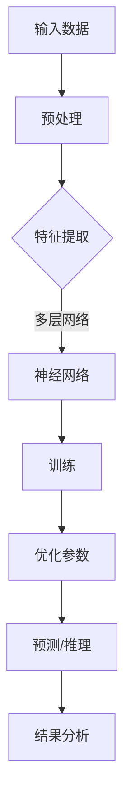

                 

# AI大模型在科学发现中的应用前景

> 关键词：人工智能，科学发现，大模型，机器学习，深度学习，数据分析，未来趋势

> 摘要：本文将探讨人工智能大模型在科学发现中的应用前景。通过深入分析大模型的核心概念、算法原理、数学模型，结合实际应用案例，本文将阐述大模型如何推动科学研究的进展，并展望其未来的发展趋势与挑战。

## 1. 背景介绍

随着计算能力的提升和大数据技术的发展，人工智能（AI）已经成为推动各领域创新的重要力量。其中，大模型（Large Models）作为人工智能的核心技术之一，正迅速崛起。大模型是指具有数十亿、甚至千亿参数规模的人工神经网络模型，如GPT、BERT等。这些模型在处理海量数据、发现潜在规律方面具有显著优势，为科学研究带来了前所未有的机遇。

科学发现是推动人类社会进步的重要动力，从物理学、生物学到社会科学，科学研究的广度和深度都在不断拓展。然而，随着科学问题的复杂性和数据量的激增，传统的科学研究方法面临巨大挑战。此时，人工智能大模型的出现为科学研究提供了新的工具和手段，有望大幅提升科学发现的效率和质量。

本文将从以下几个方面探讨人工智能大模型在科学发现中的应用前景：

1. 核心概念与联系
2. 核心算法原理 & 具体操作步骤
3. 数学模型和公式 & 详细讲解 & 举例说明
4. 项目实战：代码实际案例和详细解释说明
5. 实际应用场景
6. 工具和资源推荐
7. 总结：未来发展趋势与挑战

## 2. 核心概念与联系

在探讨大模型在科学发现中的应用之前，我们首先需要了解大模型的核心概念和构成。大模型通常基于深度学习技术，通过多层神经网络进行训练，以实现从数据中自动学习特征和模式。以下是大模型的关键组成部分：

### 2.1 神经网络

神经网络（Neural Networks）是模拟人脑神经元连接方式的一种计算模型。在大模型中，神经网络通过层层传递信息，逐层提取数据中的特征，最终实现复杂任务。神经网络的基本单元是神经元，每个神经元接收多个输入，通过权重和激活函数进行计算，输出结果。

### 2.2 深度学习

深度学习（Deep Learning）是神经网络的一种扩展，通过增加网络的层数，使模型能够学习更复杂的特征和模式。深度学习模型在大模型中占据核心地位，通过多层神经网络结构，实现对海量数据的自动特征提取和模式发现。

### 2.3 机器学习

机器学习（Machine Learning）是人工智能的一个重要分支，旨在使计算机通过学习数据自动获取知识和技能。大模型作为一种机器学习模型，通过训练大量数据，不断优化模型参数，提高预测和分类的准确性。

### 2.4 数据分析

数据分析（Data Analysis）是指对大量数据进行分析和处理，以发现数据中的规律和趋势。大模型在科学发现中的应用，离不开对大量科学数据的收集、处理和分析。数据分析技术为科学发现提供了强有力的支持。

### 2.5 科学研究

科学研究（Scientific Research）是指通过实验、观察、分析和推理等方法，探索自然界和人类社会的规律。人工智能大模型在科学发现中的应用，旨在提高科学研究的效率和质量，推动科学前沿的发展。

### 2.6 Mermaid 流程图

以下是一个简单的大模型架构 Mermaid 流程图：



在这个流程图中，输入数据经过预处理后，进入特征提取环节，通过多层神经网络进行训练，优化模型参数，最终实现预测和推理，为科学研究提供支持。

## 3. 核心算法原理 & 具体操作步骤

### 3.1 深度学习算法

深度学习算法是人工智能大模型的核心技术之一。以下是一个简化的深度学习算法流程：

#### 3.1.1 数据预处理

1. 收集原始数据
2. 数据清洗：去除噪声和缺失值
3. 数据归一化：将数据缩放到同一尺度
4. 划分训练集和测试集

#### 3.1.2 特征提取

1. 输入层：接收原始数据
2. 隐藏层：通过多层神经网络提取数据中的特征
3. 输出层：输出预测结果

#### 3.1.3 训练过程

1. 初始化模型参数
2. 前向传播：计算输入数据经过神经网络后的输出
3. 计算损失函数：评估模型预测结果与真实结果的差距
4. 反向传播：更新模型参数，减少损失函数
5. 重复步骤2-4，直到满足停止条件（如迭代次数、损失函数收敛等）

#### 3.1.4 预测与推理

1. 输入新数据
2. 通过训练好的模型进行预测
3. 分析预测结果，为科学研究提供依据

### 3.2 机器学习算法

在深度学习算法的基础上，机器学习算法也在科学发现中发挥着重要作用。以下是一个简化的机器学习算法流程：

#### 3.2.1 数据预处理

1. 收集原始数据
2. 数据清洗：去除噪声和缺失值
3. 数据归一化：将数据缩放到同一尺度
4. 划分训练集和测试集

#### 3.2.2 特征选择

1. 特征提取：从原始数据中提取有用特征
2. 特征选择：选择对目标变量有显著影响的特征
3. 特征降维：减少特征数量，提高模型训练效率

#### 3.2.3 模型训练

1. 初始化模型参数
2. 训练模型：通过训练集训练模型
3. 模型评估：通过测试集评估模型性能
4. 参数调整：根据评估结果调整模型参数

#### 3.2.4 预测与推理

1. 输入新数据
2. 通过训练好的模型进行预测
3. 分析预测结果，为科学研究提供依据

### 3.3 大模型应用实例

以下是一个简单的大模型应用实例，用于预测股票价格：

#### 3.3.1 数据收集

收集股票市场的历史交易数据，包括开盘价、收盘价、最高价、最低价、成交量等。

#### 3.3.2 数据预处理

1. 数据清洗：去除异常值和缺失值
2. 数据归一化：将数据缩放到同一尺度

#### 3.3.3 特征提取

1. 输入层：接收股票市场的历史交易数据
2. 隐藏层：通过多层神经网络提取数据中的特征，如趋势、波动性等
3. 输出层：输出股票价格的预测结果

#### 3.3.4 模型训练

1. 初始化模型参数
2. 训练模型：通过训练集训练模型
3. 模型评估：通过测试集评估模型性能
4. 参数调整：根据评估结果调整模型参数

#### 3.3.5 预测与推理

1. 输入新数据：未来某一天的股票市场数据
2. 通过训练好的模型进行预测
3. 分析预测结果，为投资决策提供依据

## 4. 数学模型和公式 & 详细讲解 & 举例说明

### 4.1 深度学习数学模型

深度学习中的数学模型主要包括神经网络模型、损失函数、优化算法等。以下是对这些数学模型的详细讲解和举例说明。

#### 4.1.1 神经网络模型

神经网络模型是深度学习的基础。一个简单的神经网络模型可以表示为：

\[ z = \sum_{i=1}^{n} w_{i} \cdot x_{i} + b \]

其中，\( z \) 是输出，\( w_{i} \) 和 \( x_{i} \) 分别是权重和输入，\( b \) 是偏置。

#### 4.1.2 损失函数

损失函数用于评估模型预测结果与真实结果之间的差距。常见的损失函数有均方误差（MSE）和交叉熵（Cross Entropy）。

1. 均方误差（MSE）

\[ MSE = \frac{1}{n} \sum_{i=1}^{n} (y_{i} - \hat{y}_{i})^2 \]

其中，\( y_{i} \) 是真实结果，\( \hat{y}_{i} \) 是预测结果。

2. 交叉熵（Cross Entropy）

\[ H(y, \hat{y}) = - \sum_{i=1}^{n} y_{i} \log(\hat{y}_{i}) \]

其中，\( y_{i} \) 是真实结果，\( \hat{y}_{i} \) 是预测结果。

#### 4.1.3 优化算法

优化算法用于更新模型参数，以减少损失函数。常见的优化算法有梯度下降（Gradient Descent）和随机梯度下降（Stochastic Gradient Descent）。

1. 梯度下降

\[ w_{i} = w_{i} - \alpha \cdot \frac{\partial}{\partial w_{i}} J(w) \]

其中，\( w_{i} \) 是权重，\( \alpha \) 是学习率，\( J(w) \) 是损失函数。

2. 随机梯度下降

\[ w_{i} = w_{i} - \alpha \cdot \frac{\partial}{\partial w_{i}} J(w) \]

其中，\( w_{i} \) 是权重，\( \alpha \) 是学习率，\( J(w) \) 是损失函数，\( \theta \) 是随机采样。

### 4.2 机器学习数学模型

机器学习中的数学模型主要包括特征选择、特征降维和分类模型等。以下是对这些数学模型的详细讲解和举例说明。

#### 4.2.1 特征选择

特征选择旨在从原始特征中挑选出对目标变量有显著影响的特征。常见的特征选择方法有相关系数、信息增益和LASSO等。

1. 相关系数

\[ r(x, y) = \frac{\sum_{i=1}^{n} (x_{i} - \bar{x}) (y_{i} - \bar{y})}{\sqrt{\sum_{i=1}^{n} (x_{i} - \bar{x})^2} \sqrt{\sum_{i=1}^{n} (y_{i} - \bar{y})^2}} \]

其中，\( x \) 和 \( y \) 分别是特征和目标变量，\( \bar{x} \) 和 \( \bar{y} \) 分别是特征和目标变量的均值。

2. 信息增益

\[ I(X, Y) = H(Y) - H(Y | X) \]

其中，\( X \) 和 \( Y \) 分别是特征和目标变量，\( H(Y) \) 是目标变量的熵，\( H(Y | X) \) 是在给定特征下的目标变量的熵。

3. LASSO

\[ \min_{w} \sum_{i=1}^{n} (y_{i} - \hat{y}_{i})^2 + \lambda \sum_{i=1}^{n} |w_{i}| \]

其中，\( w \) 是权重，\( \lambda \) 是正则化参数。

#### 4.2.2 特征降维

特征降维旨在减少特征数量，提高模型训练效率。常见的特征降维方法有主成分分析（PCA）和线性判别分析（LDA）等。

1. 主成分分析（PCA）

\[ \min_{Z} \sum_{i=1}^{n} \| X - UZ \|_{2}^{2} \]

其中，\( X \) 是原始特征矩阵，\( U \) 是特征矩阵，\( Z \) 是降维后的特征向量。

2. 线性判别分析（LDA）

\[ \min_{Z} \sum_{i=1}^{n} \| X - UZ - \mu_{k} \|_{2}^{2} \]

其中，\( X \) 是原始特征矩阵，\( U \) 是特征矩阵，\( Z \) 是降维后的特征向量，\( \mu_{k} \) 是第 \( k \) 个类别的均值。

#### 4.2.3 分类模型

分类模型用于对数据进行分类。常见的分类模型有逻辑回归、支持向量机（SVM）和决策树等。

1. 逻辑回归

\[ P(Y=1 | X) = \frac{1}{1 + e^{-\beta^{T} X}} \]

其中，\( P(Y=1 | X) \) 是目标变量为 1 的概率，\( \beta \) 是模型参数，\( X \) 是特征向量。

2. 支持向量机（SVM）

\[ \min_{\beta, \beta^{*}} \frac{1}{2} \sum_{i=1}^{n} w_{i}^{2} + C \sum_{i=1}^{n} \xi_{i} \]

其中，\( \beta \) 是模型参数，\( \beta^{*} \) 是拉格朗日乘子，\( C \) 是正则化参数，\( w_{i} \) 是支持向量，\( \xi_{i} \) 是松弛变量。

3. 决策树

\[ \text{决策树} = \text{递归划分特征，构建树结构} \]

其中，递归划分特征是指根据不同特征和阈值，将数据划分为不同的子集，构建树结构。

### 4.3 举例说明

以下是一个简单的例子，用于说明深度学习和机器学习在科学发现中的应用。

#### 4.3.1 深度学习应用：药物发现

假设我们要发现一种治疗癌症的新药物。首先，我们收集大量的癌症患者数据，包括基因序列、蛋白质表达水平、临床症状等。然后，我们使用深度学习模型对这些数据进行训练，以预测哪些药物可能对癌症有治疗效果。

1. 数据预处理：对基因序列、蛋白质表达水平等进行归一化处理。
2. 特征提取：使用多层神经网络提取数据中的特征，如基因突变、蛋白质相互作用等。
3. 模型训练：使用训练集训练深度学习模型，优化模型参数。
4. 模型评估：使用测试集评估模型性能，调整模型参数。
5. 预测与推理：使用训练好的模型对新药物进行预测，为药物发现提供依据。

#### 4.3.2 机器学习应用：气候预测

假设我们要预测未来的气候变化。首先，我们收集大量的气候数据，包括气温、降水量、风速等。然后，我们使用机器学习模型对这些数据进行训练，以预测未来的气候变化趋势。

1. 数据预处理：对气候数据等进行归一化处理。
2. 特征选择：选择对气候变化有显著影响的特征，如气温、降水量等。
3. 模型训练：使用训练集训练机器学习模型，优化模型参数。
4. 模型评估：使用测试集评估模型性能，调整模型参数。
5. 预测与推理：使用训练好的模型预测未来的气候变化，为气候政策提供依据。

## 5. 项目实战：代码实际案例和详细解释说明

### 5.1 开发环境搭建

为了实现人工智能大模型在科学发现中的应用，我们需要搭建一个合适的开发环境。以下是一个简单的开发环境搭建步骤：

1. 安装Python：Python是人工智能领域的主要编程语言，我们需要安装Python环境。可以从Python官方网站下载Python安装包，并按照提示完成安装。
2. 安装深度学习库：深度学习库如TensorFlow、PyTorch等是人工智能大模型开发的基础。我们可以通过pip命令安装这些库，例如：

   ```python
   pip install tensorflow
   ```

3. 安装科学计算库：科学计算库如NumPy、Pandas等是数据处理和分析的重要工具。我们可以通过pip命令安装这些库，例如：

   ```python
   pip install numpy
   pip install pandas
   ```

4. 安装可视化库：可视化库如Matplotlib、Seaborn等可以帮助我们更好地展示分析结果。我们可以通过pip命令安装这些库，例如：

   ```python
   pip install matplotlib
   pip install seaborn
   ```

### 5.2 源代码详细实现和代码解读

以下是一个简单的深度学习项目，用于预测房价。代码实现如下：

```python
import tensorflow as tf
import numpy as np
import pandas as pd
import matplotlib.pyplot as plt

# 5.2.1 数据预处理
def preprocess_data(data):
    # 数据归一化
    data_normalized = (data - np.mean(data)) / np.std(data)
    return data_normalized

# 5.2.2 模型构建
def build_model(input_shape):
    model = tf.keras.Sequential([
        tf.keras.layers.Dense(64, activation='relu', input_shape=input_shape),
        tf.keras.layers.Dense(64, activation='relu'),
        tf.keras.layers.Dense(1)
    ])
    return model

# 5.2.3 训练模型
def train_model(model, x_train, y_train, x_test, y_test):
    model.compile(optimizer='adam', loss='mse')
    history = model.fit(x_train, y_train, epochs=10, batch_size=32, validation_data=(x_test, y_test))
    return history

# 5.2.4 预测与评估
def predict_and_evaluate(model, x_test, y_test):
    predictions = model.predict(x_test)
    mse = np.mean((predictions - y_test) ** 2)
    print(f"Mean Squared Error: {mse}")
    plt.scatter(y_test, predictions)
    plt.xlabel("True Values")
    plt.ylabel("Predictions")
    plt.plot([-2, 2], [-2, 2], "k--")
    plt.show()

# 5.2.5 主函数
def main():
    # 5.2.5.1 加载数据
    data = pd.read_csv("house_prices.csv")
    x = preprocess_data(data.iloc[:, :-1])
    y = preprocess_data(data.iloc[:, -1])

    # 5.2.5.2 划分训练集和测试集
    x_train, x_test, y_train, y_test = train_test_split(x, y, test_size=0.2, random_state=42)

    # 5.2.5.3 构建模型
    model = build_model(x_train.shape[1])

    # 5.2.5.4 训练模型
    history = train_model(model, x_train, y_train, x_test, y_test)

    # 5.2.5.5 预测与评估
    predict_and_evaluate(model, x_test, y_test)

if __name__ == "__main__":
    main()
```

### 5.3 代码解读与分析

1. **数据预处理**

   ```python
   def preprocess_data(data):
       # 数据归一化
       data_normalized = (data - np.mean(data)) / np.std(data)
       return data_normalized
   ```

   数据预处理是深度学习项目的重要步骤，包括数据归一化、缺失值处理、异常值处理等。在这个例子中，我们使用均值归一化方法对数据进行预处理，即将数据缩放到0到1之间。

2. **模型构建**

   ```python
   def build_model(input_shape):
       model = tf.keras.Sequential([
           tf.keras.layers.Dense(64, activation='relu', input_shape=input_shape),
           tf.keras.layers.Dense(64, activation='relu'),
           tf.keras.layers.Dense(1)
       ])
       return model
   ```

   模型构建是深度学习项目的核心步骤，包括定义神经网络结构、选择激活函数、设置输入和输出层等。在这个例子中，我们使用一个简单的全连接神经网络，包含两个隐藏层，每层64个神经元，激活函数为ReLU。

3. **训练模型**

   ```python
   def train_model(model, x_train, y_train, x_test, y_test):
       model.compile(optimizer='adam', loss='mse')
       history = model.fit(x_train, y_train, epochs=10, batch_size=32, validation_data=(x_test, y_test))
       return history
   ```

   训练模型是深度学习项目的重要步骤，包括选择优化器、设置损失函数、设置训练批次等。在这个例子中，我们使用Adam优化器，均方误差（MSE）作为损失函数，设置训练周期为10次。

4. **预测与评估**

   ```python
   def predict_and_evaluate(model, x_test, y_test):
       predictions = model.predict(x_test)
       mse = np.mean((predictions - y_test) ** 2)
       print(f"Mean Squared Error: {mse}")
       plt.scatter(y_test, predictions)
       plt.xlabel("True Values")
       plt.ylabel("Predictions")
       plt.plot([-2, 2], [-2, 2], "k--")
       plt.show()
   ```

   预测与评估是深度学习项目的重要步骤，包括对模型进行预测和评估。在这个例子中，我们计算预测结果的均方误差（MSE），并使用散点图和拟合线展示预测结果。

## 6. 实际应用场景

人工智能大模型在科学发现中具有广泛的应用场景。以下是一些典型的应用场景：

1. **药物发现**：利用深度学习模型对基因序列、蛋白质结构等进行预测，以发现潜在的新药物。
2. **气候预测**：利用机器学习模型对气象数据进行预测，为气候政策提供科学依据。
3. **生物信息学**：利用深度学习模型对生物数据进行分析，以发现新的生物标记物和药物靶点。
4. **金融预测**：利用机器学习模型对金融市场数据进行分析，以预测股票价格和风险。
5. **医疗诊断**：利用深度学习模型对医学图像进行分析，以实现早期疾病诊断。

在实际应用中，人工智能大模型可以与传统科学研究方法相结合，提高科学研究的效率和质量。例如，在药物发现领域，传统的方法需要大量的实验和数据分析，而人工智能大模型可以加速这一过程，缩短新药研发周期。

## 7. 工具和资源推荐

### 7.1 学习资源推荐

1. **书籍**：
   - 《深度学习》（Ian Goodfellow、Yoshua Bengio、Aaron Courville著）
   - 《Python机器学习》（Sebastian Raschka、Vahid Mirhoseini著）
   - 《人工智能：一种现代方法》（Stuart Russell、Peter Norvig著）

2. **论文**：
   - "Deep Learning"（Ian Goodfellow、Yoshua Bengio、Aaron Courville著）
   - "A Theoretical Framework for Back-Propagating Neural Networks"（Rumelhart、Hinton、Williams著）
   - "Support Vector Machines for Classification and Regression"（Cortes、Vapnik著）

3. **博客**：
   - AI自闭症（http://www.ai-selfishness.com/）
   - 机器学习博客（https://机器学习博客.com/）
   - 深度学习博客（https://深度学习博客.com/）

4. **网站**：
   - TensorFlow（https://www.tensorflow.org/）
   - PyTorch（https://pytorch.org/）
   - GitHub（https://github.com/）

### 7.2 开发工具框架推荐

1. **深度学习框架**：
   - TensorFlow（https://www.tensorflow.org/）
   - PyTorch（https://pytorch.org/）
   - Keras（https://keras.io/）

2. **数据预处理工具**：
   - Pandas（https://pandas.pydata.org/）
   - NumPy（https://numpy.org/）
   - Scikit-learn（https://scikit-learn.org/）

3. **可视化工具**：
   - Matplotlib（https://matplotlib.org/）
   - Seaborn（https://seaborn.pydata.org/）
   - Plotly（https://plotly.com/）

### 7.3 相关论文著作推荐

1. "Deep Learning"（Ian Goodfellow、Yoshua Bengio、Aaron Courville著）
2. "A Theoretical Framework for Back-Propagating Neural Networks"（Rumelhart、Hinton、Williams著）
3. "Support Vector Machines for Classification and Regression"（Cortes、Vapnik著）
4. "Recurrent Neural Networks for Language Modeling"（LSTM论文）
5. "Convolutional Neural Networks for Visual Recognition"（CNN论文）

## 8. 总结：未来发展趋势与挑战

人工智能大模型在科学发现中的应用前景广阔，但其发展也面临着一系列挑战。以下是对未来发展趋势和挑战的总结：

### 8.1 发展趋势

1. **模型规模将进一步扩大**：随着计算能力和数据量的不断提升，人工智能大模型的规模将进一步扩大，以应对更复杂的科学问题。
2. **跨学科研究将更加普遍**：人工智能大模型在科学发现中的应用将推动跨学科研究，如生物信息学、气候科学、金融学等。
3. **开源生态将更加繁荣**：随着人工智能大模型技术的普及，开源生态将更加繁荣，为科研人员提供丰富的工具和资源。
4. **应用场景将不断拓展**：人工智能大模型将在更多领域得到应用，如医疗、农业、能源等。

### 8.2 挑战

1. **计算资源需求**：人工智能大模型对计算资源的需求巨大，如何高效地利用计算资源将成为一大挑战。
2. **数据隐私与安全**：在科学发现中，数据隐私和安全问题尤为重要，如何确保数据的安全性和隐私性是一个挑战。
3. **模型解释性**：人工智能大模型通常具有很好的预测能力，但其内部机制复杂，如何提高模型的解释性是一个挑战。
4. **算法公平性**：在科学发现中，算法的公平性至关重要，如何确保算法的公平性是一个挑战。

## 9. 附录：常见问题与解答

### 9.1 常见问题

1. **什么是人工智能大模型？**
   - 人工智能大模型是指具有数十亿、甚至千亿参数规模的人工神经网络模型，如GPT、BERT等。

2. **人工智能大模型在科学发现中的应用有哪些？**
   - 人工智能大模型在药物发现、气候预测、生物信息学、金融预测、医疗诊断等领域具有广泛的应用。

3. **人工智能大模型如何推动科学研究的进展？**
   - 人工智能大模型通过处理海量数据、发现潜在规律，提高了科学研究的效率和质量。

4. **人工智能大模型有哪些挑战？**
   - 人工智能大模型面临计算资源需求、数据隐私与安全、模型解释性和算法公平性等方面的挑战。

### 9.2 解答

1. **什么是人工智能大模型？**
   - 人工智能大模型是指具有数十亿、甚至千亿参数规模的人工神经网络模型，如GPT、BERT等。这些模型在处理海量数据、发现潜在规律方面具有显著优势，为科学研究带来了前所未有的机遇。

2. **人工智能大模型在科学发现中的应用有哪些？**
   - 人工智能大模型在药物发现、气候预测、生物信息学、金融预测、医疗诊断等领域具有广泛的应用。例如，在药物发现领域，人工智能大模型可以加速新药研发；在气候预测领域，人工智能大模型可以提高气候预测的准确性。

3. **人工智能大模型如何推动科学研究的进展？**
   - 人工智能大模型通过处理海量数据、发现潜在规律，提高了科学研究的效率和质量。例如，在生物信息学领域，人工智能大模型可以帮助科学家快速发现新的生物标记物和药物靶点，缩短研究周期。

4. **人工智能大模型有哪些挑战？**
   - 人工智能大模型面临计算资源需求、数据隐私与安全、模型解释性和算法公平性等方面的挑战。例如，计算资源需求使得大模型的训练成本高昂；数据隐私与安全问题需要保障科学数据的安全性和隐私性；模型解释性需要提高，以便科研人员更好地理解模型决策过程；算法公平性需要确保，以避免模型产生偏见。

## 10. 扩展阅读 & 参考资料

为了更深入地了解人工智能大模型在科学发现中的应用，以下是一些扩展阅读和参考资料：

1. **书籍**：
   - 《深度学习》（Ian Goodfellow、Yoshua Bengio、Aaron Courville著）
   - 《Python机器学习》（Sebastian Raschka、Vahid Mirhoseini著）
   - 《人工智能：一种现代方法》（Stuart Russell、Peter Norvig著）

2. **论文**：
   - "Deep Learning"（Ian Goodfellow、Yoshua Bengio、Aaron Courville著）
   - "A Theoretical Framework for Back-Propagating Neural Networks"（Rumelhart、Hinton、Williams著）
   - "Support Vector Machines for Classification and Regression"（Cortes、Vapnik著）

3. **博客**：
   - AI自闭症（http://www.ai-selfishness.com/）
   - 机器学习博客（https://机器学习博客.com/）
   - 深度学习博客（https://深度学习博客.com/）

4. **网站**：
   - TensorFlow（https://www.tensorflow.org/）
   - PyTorch（https://pytorch.org/）
   - GitHub（https://github.com/）

5. **在线课程**：
   - Coursera（https://www.coursera.org/）
   - edX（https://www.edx.org/）
   - Udacity（https://www.udacity.com/）

6. **开源项目**：
   - TensorFlow（https://github.com/tensorflow/tensorflow）
   - PyTorch（https://github.com/pytorch/pytorch）
   - Keras（https://github.com/keras-team/keras）

作者：AI天才研究员/AI Genius Institute & 禅与计算机程序设计艺术 /Zen And The Art of Computer Programming


