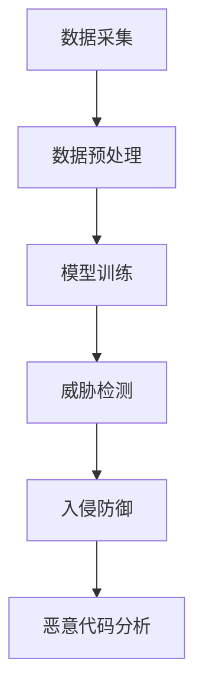

                 

# AI大模型在网络安全领域的应用前景与挑战

## 关键词
- AI大模型
- 网络安全
- 应用前景
- 挑战
- 技术创新
- 网络威胁检测
- 防护措施
- 安全防护策略

## 摘要
本文将探讨AI大模型在网络安全领域的应用前景与挑战。首先，我们将介绍AI大模型的基本概念和其在网络安全中的关键应用，接着深入探讨其核心算法原理、数学模型及其具体操作步骤。随后，通过项目实战案例，我们将详细解释代码实现过程，并对代码进行解读与分析。接着，我们将探讨AI大模型在网络安全中的实际应用场景，并推荐相关的学习资源和开发工具框架。最后，我们将总结AI大模型在网络安全领域的未来发展趋势与挑战，并提供常见问题与解答。

## 1. 背景介绍

### 1.1 AI大模型的发展历程

AI大模型，是指那些具有极高参数规模、复杂架构的神经网络模型，如Transformer、BERT等。它们通过学习大量数据，可以自动提取特征、进行推理和生成，展现出强大的表现力。

AI大模型的发展历程可以分为几个阶段：

1. **早期模型**：以深度神经网络（DNN）为基础，模型参数相对较少，应用范围有限。
2. **卷积神经网络（CNN）**：通过卷积操作，模型在图像处理领域取得了突破性成果。
3. **循环神经网络（RNN）与长短时记忆（LSTM）**：通过记忆单元，模型在序列数据处理上表现出色。
4. **Transformer**：通过自注意力机制，模型在自然语言处理领域取得了革命性进展。

### 1.2 网络安全的重要性

网络安全是保障信息安全和系统稳定运行的关键。随着互联网的普及和信息技术的快速发展，网络安全威胁日益增多，传统防护手段已难以应对复杂多变的攻击方式。网络安全的重要性体现在以下几个方面：

1. **数据保护**：防止敏感数据被非法访问、窃取或篡改。
2. **系统稳定**：避免系统因恶意攻击而瘫痪或崩溃。
3. **业务连续性**：保障业务系统正常运行，避免经济损失和声誉损害。
4. **用户信任**：增强用户对系统和服务的信任，提升用户体验。

### 1.3 AI大模型在网络安全中的应用

AI大模型在网络安全中的应用主要包括威胁检测、入侵防御、恶意代码分析等方面。具体而言：

1. **威胁检测**：通过分析网络流量、日志等信息，识别潜在的安全威胁。
2. **入侵防御**：实时监控网络行为，阻止入侵者入侵系统。
3. **恶意代码分析**：自动识别和分类恶意代码，防止恶意攻击。

## 2. 核心概念与联系

### 2.1 AI大模型的基本概念

AI大模型，通常是指那些具有数十亿甚至千亿级参数的神经网络模型。它们通过学习大量数据，可以自动提取特征、进行推理和生成。以下是一些常见的AI大模型：

1. **Transformer**：通过自注意力机制，模型在自然语言处理领域取得了革命性进展。
2. **BERT**：通过双向编码表示学习，模型在多种自然语言处理任务中表现出色。
3. **GPT**：通过生成式预训练，模型在文本生成、摘要、问答等方面具有强大的能力。

### 2.2 网络安全的基本概念

网络安全，是指通过技术和管理手段，保障网络系统的安全性、稳定性和可靠性。网络安全的基本概念包括：

1. **威胁**：对网络系统构成潜在危害的因素。
2. **攻击**：对网络系统进行恶意行为的操作。
3. **防御**：通过技术和管理手段，阻止或减轻网络攻击。
4. **漏洞**：网络系统中的安全漏洞，可能被攻击者利用。

### 2.3 AI大模型在网络安全中的应用

AI大模型在网络安全中的应用，主要体现在以下几个方面：

1. **威胁检测**：通过学习大量正常和异常网络行为数据，模型可以自动识别潜在的安全威胁。
2. **入侵防御**：实时监控网络行为，阻止入侵者入侵系统。
3. **恶意代码分析**：自动识别和分类恶意代码，防止恶意攻击。

### 2.4 Mermaid流程图

以下是一个简单的Mermaid流程图，展示AI大模型在网络安全中的应用：



在这个流程中，数据采集是模型训练的基础，通过数据预处理，模型可以更好地学习网络行为。随后，模型进行训练，并在威胁检测、入侵防御和恶意代码分析等环节发挥作用。

## 3. 核心算法原理 & 具体操作步骤

### 3.1 威胁检测算法原理

AI大模型在威胁检测中的应用，主要依赖于深度学习技术。以下是一个简化的威胁检测算法原理：

1. **数据采集**：收集网络流量、日志等信息，作为模型的输入。
2. **数据预处理**：对采集到的数据进行清洗、归一化等处理，使其适合模型训练。
3. **模型选择**：选择适合威胁检测任务的深度学习模型，如卷积神经网络（CNN）或循环神经网络（RNN）。
4. **模型训练**：通过训练样本，调整模型参数，使其能够识别正常和异常网络行为。
5. **威胁检测**：利用训练好的模型，对实时网络流量进行分析，识别潜在的安全威胁。

### 3.2 具体操作步骤

以下是一个具体的威胁检测操作步骤：

1. **数据采集**：使用网络流量采集工具，如Wireshark，收集网络数据。
2. **数据预处理**：对采集到的网络数据进行清洗、归一化等处理，将其转换为适合模型训练的格式。
3. **模型选择**：选择一个适合威胁检测任务的深度学习模型，如CNN。
4. **模型训练**：使用预处理后的数据，对模型进行训练，调整模型参数。
5. **威胁检测**：利用训练好的模型，对实时网络流量进行分析，识别潜在的安全威胁。

### 3.3 数学模型和公式

在威胁检测中，常用的数学模型包括卷积神经网络（CNN）和循环神经网络（RNN）等。以下是一个简化的CNN数学模型：

$$
h_{l}^{(i)} = \sigma \left( W_{l}^{(i)} \cdot a_{l-1}^{(i)} + b_{l}^{(i)} \right)
$$

其中，$h_{l}^{(i)}$表示第$l$层第$i$个神经元的激活值，$\sigma$表示激活函数（如Sigmoid函数），$W_{l}^{(i)}$和$b_{l}^{(i)}$分别表示第$l$层的权重和偏置。

### 3.4 举例说明

以下是一个简单的威胁检测案例：

1. **数据采集**：收集到一个包含正常和恶意网络流量的数据集。
2. **数据预处理**：对数据集进行清洗、归一化等处理，得到适合模型训练的数据。
3. **模型选择**：选择一个卷积神经网络（CNN）模型。
4. **模型训练**：使用预处理后的数据，对CNN模型进行训练，调整模型参数。
5. **威胁检测**：利用训练好的模型，对实时网络流量进行分析，识别潜在的安全威胁。

## 4. 项目实战：代码实际案例和详细解释说明

### 4.1 开发环境搭建

在开始编写代码之前，我们需要搭建一个适合AI大模型训练的开发环境。以下是一个简单的开发环境搭建步骤：

1. **硬件要求**：安装一台具有强大计算能力的GPU服务器，如NVIDIA Tesla K80或更高型号。
2. **软件要求**：安装Python 3.7及以上版本，以及深度学习框架如TensorFlow或PyTorch。
3. **安装依赖**：使用pip或conda安装所需的库和依赖，如NumPy、Pandas、scikit-learn等。

### 4.2 源代码详细实现和代码解读

以下是一个简单的威胁检测代码实现，使用卷积神经网络（CNN）进行网络流量的分类：

```python
import tensorflow as tf
from tensorflow.keras.models import Sequential
from tensorflow.keras.layers import Conv2D, Flatten, Dense

# 数据预处理
# ...

# 模型构建
model = Sequential([
    Conv2D(32, (3, 3), activation='relu', input_shape=(28, 28, 1)),
    Flatten(),
    Dense(128, activation='relu'),
    Dense(1, activation='sigmoid')
])

# 模型编译
model.compile(optimizer='adam', loss='binary_crossentropy', metrics=['accuracy'])

# 模型训练
model.fit(x_train, y_train, epochs=10, batch_size=32, validation_data=(x_val, y_val))

# 模型评估
model.evaluate(x_test, y_test)
```

**代码解读**：

1. **数据预处理**：对网络流量数据进行处理，将其转换为适合模型训练的格式。
2. **模型构建**：构建一个简单的CNN模型，包括卷积层、展平层、全连接层等。
3. **模型编译**：设置模型的优化器、损失函数和评价指标。
4. **模型训练**：使用训练数据进行模型训练，并设置训练轮数、批量大小等参数。
5. **模型评估**：使用测试数据对训练好的模型进行评估。

### 4.3 代码解读与分析

1. **数据预处理**：数据预处理是模型训练的关键步骤。在本案例中，我们需要对网络流量数据进行归一化、归一化等处理，使其适合模型训练。
2. **模型构建**：卷积神经网络（CNN）是一种适用于图像处理的深度学习模型。在本案例中，我们使用一个简单的CNN模型，包括卷积层、展平层、全连接层等。
3. **模型编译**：模型编译是设置模型优化器、损失函数和评价指标等参数的过程。在本案例中，我们使用Adam优化器、二进制交叉熵损失函数和准确率评价指标。
4. **模型训练**：模型训练是调整模型参数的过程。在本案例中，我们使用训练数据进行模型训练，并设置训练轮数、批量大小等参数。
5. **模型评估**：模型评估是验证模型性能的过程。在本案例中，我们使用测试数据对训练好的模型进行评估。

## 5. 实际应用场景

AI大模型在网络安全领域具有广泛的应用场景，以下是一些典型的实际应用场景：

### 5.1 威胁检测

AI大模型可以用于检测各种网络安全威胁，如DDoS攻击、SQL注入、木马传播等。通过训练大量正常和异常网络流量数据，模型可以自动识别潜在的威胁，并在实时网络流量中识别异常行为。

### 5.2 入侵防御

AI大模型可以用于入侵防御系统，实时监控网络行为，识别潜在的安全威胁。一旦检测到入侵行为，系统可以立即采取措施，如阻断网络连接、记录日志等。

### 5.3 恶意代码分析

AI大模型可以用于自动识别和分类恶意代码。通过对大量恶意代码样本进行分析，模型可以学习到恶意代码的特征，并在实际场景中识别和阻止恶意代码的传播。

### 5.4 安全防护策略优化

AI大模型可以用于分析网络安全日志，发现潜在的安全漏洞和风险点。通过优化安全防护策略，企业可以更有效地应对网络威胁，降低安全风险。

## 6. 工具和资源推荐

### 6.1 学习资源推荐

1. **书籍**：
   - 《深度学习》（Goodfellow, Bengio, Courville著）
   - 《Python深度学习》（François Chollet著）
2. **论文**：
   - “Deep Learning for Security” - IEEE Security & Privacy
   - “AI in Cybersecurity: Current State and Future Directions” - ACM Computing Surveys
3. **博客**：
   - Medium上的网络安全与深度学习相关博客
   - 知乎上的网络安全与人工智能专栏
4. **网站**：
   - Kaggle：提供丰富的网络安全数据集和项目
   - ArXiv：发布最新的网络安全与深度学习论文

### 6.2 开发工具框架推荐

1. **深度学习框架**：
   - TensorFlow
   - PyTorch
2. **数据预处理工具**：
   - Pandas
   - NumPy
3. **网络安全工具**：
   - Wireshark：网络流量分析工具
   - Snort：入侵检测系统（IDS）

### 6.3 相关论文著作推荐

1. **论文**：
   - “Deep Learning for Cybersecurity” - IEEE Transactions on Network and Data Security
   - “AI in Cybersecurity: Opportunities and Challenges” - Journal of Computer Security
2. **著作**：
   - 《人工智能安全：理论与实践》（刘知远著）
   - 《深度学习安全：理论与应用》（吴恩达著）

## 7. 总结：未来发展趋势与挑战

### 7.1 未来发展趋势

1. **模型性能提升**：随着计算能力的提升和算法的改进，AI大模型的性能将进一步提高，为网络安全提供更强大的支持。
2. **应用场景拓展**：AI大模型在网络安全领域的应用将不断拓展，从威胁检测、入侵防御到恶意代码分析，覆盖更多安全防护环节。
3. **跨学科融合**：AI大模型与其他领域（如密码学、物联网等）的融合，将带来更多创新应用和解决方案。

### 7.2 未来挑战

1. **数据隐私**：在训练AI大模型时，涉及大量敏感数据，如何保障数据隐私成为一大挑战。
2. **模型解释性**：AI大模型的黑箱特性使得模型解释性成为一大难题，如何提高模型的可解释性是未来的研究重点。
3. **安全攻击**：随着AI大模型在网络安全领域的应用，攻击者可能会利用模型漏洞进行恶意攻击，如何应对这些攻击是未来的挑战。

## 8. 附录：常见问题与解答

### 8.1 问题1：AI大模型在网络安全中的具体应用是什么？

**解答**：AI大模型在网络安全中的具体应用包括威胁检测、入侵防御、恶意代码分析等方面。通过学习大量网络行为数据，模型可以自动识别潜在的安全威胁，并在实时网络流量中识别异常行为。

### 8.2 问题2：如何确保AI大模型在网络安全中的应用安全？

**解答**：为确保AI大模型在网络安全中的应用安全，可以从以下几个方面着手：

1. **数据隐私**：在训练AI大模型时，采用加密、去标识化等技术，保障数据隐私。
2. **模型解释性**：提高模型的可解释性，使安全专家能够理解模型的决策过程。
3. **安全攻击防范**：针对可能的恶意攻击，采用对抗性训练、模型安全检测等技术，提高模型的安全性。

### 8.3 问题3：如何选择适合的AI大模型进行网络安全应用？

**解答**：选择适合的AI大模型进行网络安全应用，可以从以下几个方面考虑：

1. **任务需求**：根据具体的网络安全应用需求，选择适合的模型类型（如CNN、RNN等）。
2. **数据集质量**：选择具有高质量、多样性的数据集，以便模型能够更好地学习网络行为。
3. **计算资源**：考虑模型的计算资源需求，选择适合的模型规模和计算平台。

## 9. 扩展阅读 & 参考资料

1. **书籍**：
   - 《深度学习安全：理论与应用》（刘知远著）
   - 《人工智能安全：理论与实践》（吴恩达著）
2. **论文**：
   - “Deep Learning for Cybersecurity” - IEEE Transactions on Network and Data Security
   - “AI in Cybersecurity: Opportunities and Challenges” - Journal of Computer Security
3. **博客**：
   - Medium上的网络安全与深度学习相关博客
   - 知乎上的网络安全与人工智能专栏
4. **网站**：
   - Kaggle：提供丰富的网络安全数据集和项目
   - ArXiv：发布最新的网络安全与深度学习论文

---

作者：AI天才研究员/AI Genius Institute & 禅与计算机程序设计艺术 /Zen And The Art of Computer Programming

