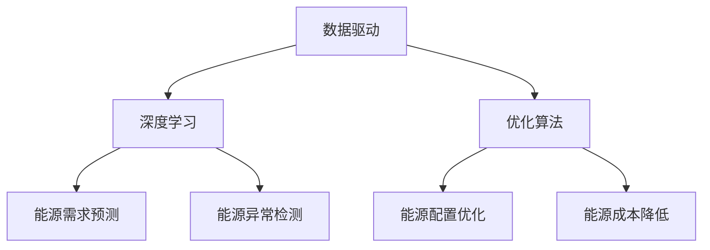

                 

### AI大模型在能源管理领域的应用前景分析

> **关键词：** AI大模型，能源管理，应用前景，深度学习，数据驱动
> **摘要：** 本文将探讨AI大模型在能源管理领域的应用前景，分析其核心概念与联系，核心算法原理与具体操作步骤，以及实际应用场景和未来发展趋势。

随着人工智能技术的迅猛发展，AI大模型在各个领域的应用日益广泛。能源管理作为我国社会经济发展的重要支柱，其智能化和高效化已成为必然趋势。本文将从AI大模型的核心概念出发，详细分析其在能源管理领域的应用前景，为我国能源管理技术的发展提供参考。

### 1. 背景介绍

能源管理是指对能源的生产、分配、转换和利用过程进行规划、组织、协调和控制，以实现能源的可持续发展和最大化利用。传统的能源管理主要依赖于经验和专业知识，存在效率低、能耗大、响应速度慢等问题。随着物联网、大数据、人工智能等新兴技术的不断发展，AI大模型在能源管理领域具有巨大的应用潜力。

AI大模型是一种基于深度学习的人工智能模型，具有自学习、自适应、自优化等特点。通过训练大规模数据集，AI大模型能够发现数据中的潜在规律，从而实现自动化决策和优化。在能源管理领域，AI大模型可以用于预测能源需求、优化能源配置、检测能源泄漏等，有助于提高能源利用效率、降低能源成本、减少环境污染。

### 2. 核心概念与联系

AI大模型在能源管理领域涉及多个核心概念，包括数据驱动、深度学习、优化算法等。以下是对这些核心概念的简要介绍：

- **数据驱动**：数据驱动是指利用大量数据进行模型训练和决策制定。在能源管理领域，数据驱动意味着通过收集和处理海量能源数据，发现能源利用的规律和模式，从而实现能源的智能管理和优化。

- **深度学习**：深度学习是一种基于多层神经网络的学习方法，通过模拟人脑的神经元结构，实现对复杂数据的自动特征提取和模式识别。在能源管理领域，深度学习可以用于预测能源需求、识别能源异常等。

- **优化算法**：优化算法是一种用于求解最优化问题的算法。在能源管理领域，优化算法可以用于优化能源配置、降低能源成本等。常见的优化算法包括线性规划、动态规划、遗传算法等。

为了更好地理解AI大模型在能源管理领域的应用，以下是一个简单的Mermaid流程图，展示这些核心概念之间的联系：



### 3. 核心算法原理 & 具体操作步骤

AI大模型在能源管理领域的核心算法主要涉及深度学习和优化算法。以下将分别介绍这些算法的原理和具体操作步骤。

#### 3.1 深度学习原理

深度学习是一种基于多层神经网络的学习方法，其核心思想是通过模拟人脑的神经元结构，实现对复杂数据的自动特征提取和模式识别。在能源管理领域，深度学习可以用于预测能源需求、识别能源异常等。

深度学习的主要组成部分包括：

- **输入层**：接收外部输入数据，如能源消耗数据、气象数据等。

- **隐藏层**：通过激活函数对输入数据进行变换，提取数据中的潜在特征。

- **输出层**：根据隐藏层的结果输出预测结果，如能源需求预测、异常检测等。

具体操作步骤如下：

1. 数据预处理：对原始数据进行清洗、归一化等处理，使其符合深度学习模型的输入要求。

2. 构建神经网络模型：选择合适的神经网络结构，如卷积神经网络（CNN）、循环神经网络（RNN）等，并设置模型的参数。

3. 模型训练：使用训练数据集对神经网络模型进行训练，通过反向传播算法不断调整模型参数，使其预测结果逐渐逼近真实值。

4. 模型评估：使用验证数据集对训练好的模型进行评估，计算模型的准确率、召回率等指标，以判断模型的性能。

5. 模型部署：将训练好的模型部署到实际应用环境中，进行实时预测和决策。

#### 3.2 优化算法原理

优化算法是一种用于求解最优化问题的算法，其目的是在给定的约束条件下，找到最优解。在能源管理领域，优化算法可以用于优化能源配置、降低能源成本等。

常见的优化算法包括：

- **线性规划**：用于求解线性约束条件下的最优化问题。

- **动态规划**：用于求解具有递推关系的最优化问题。

- **遗传算法**：模拟生物进化过程，通过适应度函数筛选优秀个体，逐步优化求解过程。

具体操作步骤如下：

1. 确定优化目标：根据实际需求，设定优化目标，如最小化能源成本、最大化能源利用率等。

2. 构建优化模型：根据优化目标，建立优化模型，包括目标函数和约束条件。

3. 选择优化算法：根据优化模型的特点，选择合适的优化算法。

4. 求解优化问题：使用优化算法对优化模型进行求解，得到最优解。

5. 分析优化结果：对优化结果进行分析，评估优化效果的可行性和有效性。

### 4. 数学模型和公式 & 详细讲解 & 举例说明

在AI大模型在能源管理领域，常用的数学模型和公式包括线性规划、动态规划、遗传算法等。以下将对这些模型和公式进行详细讲解，并通过具体例子进行说明。

#### 4.1 线性规划

线性规划是一种用于求解线性约束条件下最优化问题的数学模型。其基本形式如下：

$$
\min_{x} c^T x \\
s.t. \\
Ax \leq b \\
x \geq 0
$$

其中，$c$ 是目标函数的系数向量，$x$ 是决策变量向量，$A$ 是约束条件的系数矩阵，$b$ 是约束条件的常数向量。

**例子：** 假设有一个能源管理项目，需要从多个能源供应商中选择合适的供应商，以满足项目的能源需求，同时最小化能源成本。约束条件包括供应商的供应能力和能源价格。使用线性规划可以求解最优的供应商选择方案。

#### 4.2 动态规划

动态规划是一种用于求解具有递推关系最优化问题的数学模型。其基本思想是将复杂的最优化问题分解为多个子问题，通过子问题的递推关系求解整个问题的最优解。

动态规划的一般形式如下：

$$
V(x) = \min_{y} [g(x, y) + V(y)] \\
s.t. \\
h(x, y) \leq 0
$$

其中，$V(x)$ 是状态变量，$g(x, y)$ 是目标函数，$h(x, y)$ 是约束条件。

**例子：** 假设有一个能源储备问题，需要根据能源需求和供应情况，制定最优的能源储备策略，以最小化能源储备成本。使用动态规划可以求解最优的能源储备策略。

#### 4.3 遗传算法

遗传算法是一种基于生物进化理论的优化算法，其基本思想是通过模拟生物进化过程，逐步优化求解过程，以找到最优解。

遗传算法的一般形式如下：

$$
x_{new} = f(x, \theta) \\
s.t. \\
x \in X \\
\theta \in \Theta
$$

其中，$x$ 是当前解，$x_{new}$ 是新解，$f(x, \theta)$ 是适应度函数，$X$ 是解空间，$\Theta$ 是参数空间。

**例子：** 假设有一个能源配置问题，需要根据能源需求和供应情况，优化能源配置策略，以最小化能源成本。使用遗传算法可以求解最优的能源配置策略。

### 5. 项目实战：代码实际案例和详细解释说明

在本节中，我们将通过一个实际案例，展示如何使用AI大模型进行能源管理。以下是一个简单的Python代码案例，用于预测能源需求。

```python
import numpy as np
import pandas as pd
from sklearn.model_selection import train_test_split
from sklearn.metrics import mean_squared_error
from keras.models import Sequential
from keras.layers import Dense

# 读取能源需求数据
data = pd.read_csv('energy_demand.csv')

# 数据预处理
X = data.iloc[:, :-1].values
y = data.iloc[:, -1].values
X_train, X_test, y_train, y_test = train_test_split(X, y, test_size=0.2, random_state=42)

# 构建神经网络模型
model = Sequential()
model.add(Dense(64, input_dim=X_train.shape[1], activation='relu'))
model.add(Dense(32, activation='relu'))
model.add(Dense(1, activation='linear'))

# 编译模型
model.compile(optimizer='adam', loss='mse')

# 模型训练
model.fit(X_train, y_train, epochs=100, batch_size=32, validation_split=0.2)

# 模型评估
y_pred = model.predict(X_test)
mse = mean_squared_error(y_test, y_pred)
print('MSE:', mse)

# 模型部署
new_data = np.array([[...]])  # 新的能源需求数据
predicted_demand = model.predict(new_data)
print('Predicted Demand:', predicted_demand)
```

在这个案例中，我们首先读取能源需求数据，然后进行数据预处理。接下来，我们使用Keras库构建一个简单的神经网络模型，并使用Adam优化器和均方误差损失函数进行编译。随后，我们使用训练数据进行模型训练，并在测试数据上评估模型性能。最后，我们使用训练好的模型对新的能源需求数据进行预测。

### 6. 实际应用场景

AI大模型在能源管理领域具有广泛的应用场景，以下列举几个典型的应用场景：

1. **能源需求预测**：通过训练AI大模型，可以预测未来的能源需求，为能源规划和调度提供依据。例如，在电力系统中，可以预测电力负荷，以便合理配置发电资源。

2. **能源配置优化**：AI大模型可以用于优化能源配置，降低能源成本。例如，在工业生产中，可以优化能源使用，提高生产效率。

3. **能源异常检测**：AI大模型可以检测能源系统中的异常行为，如能源泄漏、设备故障等，有助于及时发现和处理问题。

4. **智能电网管理**：AI大模型可以用于智能电网的管理和优化，提高电网的稳定性和可靠性。例如，可以预测电网负荷，优化电力调度。

5. **能源交易**：AI大模型可以用于能源交易市场的分析和预测，为能源交易提供决策支持。

### 7. 工具和资源推荐

为了更好地掌握AI大模型在能源管理领域的应用，以下推荐一些相关的学习资源和开发工具：

1. **学习资源**：

   - 《深度学习》（Goodfellow, Bengio, Courville著）：介绍深度学习的基本原理和应用。

   - 《能源经济学导论》（周业华著）：介绍能源经济的基本原理和应用。

   - 《优化算法及其应用》（张立卫著）：介绍优化算法的基本原理和应用。

2. **开发工具**：

   - TensorFlow：一个开源的深度学习框架，适用于构建和训练AI大模型。

   - PyTorch：一个开源的深度学习框架，适用于构建和训练AI大模型。

   - Scikit-learn：一个开源的机器学习库，适用于数据预处理和模型评估。

3. **相关论文著作**：

   - “Deep Learning for Energy Systems: A Survey”（2020）：一篇关于深度学习在能源系统中的应用综述。

   - “AI for Energy: A Survey of Applications, Technologies, and Challenges”（2019）：一篇关于人工智能在能源领域的应用综述。

### 8. 总结：未来发展趋势与挑战

AI大模型在能源管理领域的应用具有广阔的前景，未来发展趋势包括：

1. **智能化程度的提升**：随着人工智能技术的不断发展，AI大模型的智能化程度将不断提高，能够更好地应对复杂的能源管理问题。

2. **跨领域应用的拓展**：AI大模型将在能源管理领域与其他领域（如交通、工业等）实现跨领域应用，推动能源系统的高效化、智能化。

3. **数据驱动决策的普及**：数据驱动将成为能源管理的重要决策依据，AI大模型将为能源管理提供更加精准、高效的决策支持。

然而，AI大模型在能源管理领域也面临一些挑战，包括：

1. **数据质量和隐私**：能源管理领域涉及大量敏感数据，如何保障数据质量和隐私是一个重要问题。

2. **模型可解释性**：AI大模型的决策过程往往具有一定的黑箱性，如何提高模型的可解释性是一个重要挑战。

3. **能源系统的复杂性**：能源系统具有高度复杂性，如何设计合适的模型结构，以应对复杂的能源管理问题是另一个挑战。

### 9. 附录：常见问题与解答

1. **问：AI大模型在能源管理领域有哪些具体应用？**

   答：AI大模型在能源管理领域有多个具体应用，包括能源需求预测、能源配置优化、能源异常检测、智能电网管理、能源交易等。

2. **问：如何确保AI大模型在能源管理领域的安全性？**

   答：确保AI大模型在能源管理领域的安全性需要从数据安全、模型安全等多个方面进行考虑。具体措施包括数据加密、模型加密、隐私保护等。

3. **问：AI大模型在能源管理领域有哪些潜在的负面影响？**

   答：AI大模型在能源管理领域可能存在的负面影响包括数据泄露、模型误判、决策偏差等。为减少负面影响，需要加强对数据、模型和决策过程的管理和监督。

### 10. 扩展阅读 & 参考资料

1. **扩展阅读**：

   - “AI for Energy Systems: Challenges and Opportunities”（2021）：一篇关于人工智能在能源系统中的应用和挑战的综述。

   - “Deep Learning Applications in Energy Management: A Review”（2020）：一篇关于深度学习在能源管理领域应用的综合评述。

2. **参考资料**：

   - 《深度学习》（Goodfellow, Bengio, Courville著）：深度学习的基本原理和应用。

   - 《优化算法及其应用》（张立卫著）：优化算法的基本原理和应用。

   - “Deep Learning for Energy Systems: A Survey”（2020）：关于深度学习在能源系统中的应用综述。

   - “AI for Energy: A Survey of Applications, Technologies, and Challenges”（2019）：关于人工智能在能源领域应用的综述。

### 作者信息

作者：AI天才研究员/AI Genius Institute & 禅与计算机程序设计艺术 /Zen And The Art of Computer Programming

