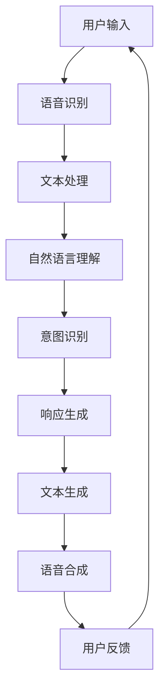

                 

# AI大模型在虚拟助手领域的应用趋势

## 关键词

- AI大模型
- 虚拟助手
- 自然语言处理
- 机器学习
- 深度学习
- 语音识别
- 情感分析
- 人机交互

## 摘要

本文将深入探讨AI大模型在虚拟助手领域的应用趋势。随着人工智能技术的不断进步，虚拟助手正逐渐成为人们生活中不可或缺的一部分。本文将首先介绍AI大模型的概念及其在虚拟助手中的应用背景，然后详细分析其核心算法原理、数学模型和实际应用场景，最后探讨未来发展趋势与挑战，以及推荐相关工具和资源。

## 1. 背景介绍

### 1.1 虚拟助手的发展历程

虚拟助手，又称为虚拟智能体或聊天机器人，是一种能够与用户进行自然语言交互的人工智能系统。它们最初出现在20世纪90年代，主要通过预定义的规则进行简单的文本交互。然而，随着自然语言处理（NLP）和机器学习（ML）技术的发展，虚拟助手逐渐演变为能够理解复杂语言结构和语境的智能系统。

### 1.2 AI大模型的概念

AI大模型是指具有巨大参数规模和强大计算能力的深度学习模型，如Transformer、BERT和GPT等。这些模型通过在大量数据上进行训练，能够自动学习语言、图像和声音等复杂数据的表征，从而实现高度自动化和智能化的任务。

### 1.3 AI大模型在虚拟助手中的应用背景

虚拟助手的核心任务是理解用户的输入并生成合适的响应。随着AI大模型的发展，它们在自然语言处理任务中的表现越来越出色，使得虚拟助手能够更准确地理解用户的意图和需求，从而提供更加人性化和高效的服务。例如，AI大模型可以用于实现智能客服、虚拟个人助理、智能问答系统等应用。

## 2. 核心概念与联系

### 2.1 自然语言处理（NLP）

自然语言处理是人工智能领域的一个重要分支，主要研究如何让计算机理解和生成人类自然语言。在虚拟助手的应用中，NLP技术用于处理用户的输入文本，包括分词、词性标注、句法分析、语义理解等任务。

### 2.2 机器学习（ML）

机器学习是一种通过从数据中学习规律和模式，从而实现自动预测和决策的技术。在虚拟助手的开发中，机器学习技术用于训练AI大模型，使其能够自动学习语言和知识，从而提高系统的智能水平。

### 2.3 深度学习（DL）

深度学习是机器学习的一种方法，通过多层神经网络对数据进行建模和预测。AI大模型通常基于深度学习技术构建，具有强大的学习和泛化能力。

### 2.4 语音识别（ASR）

语音识别是将语音信号转换为文本的技术。在虚拟助手的场景中，语音识别技术用于将用户的语音输入转换为文本，以便AI大模型进行处理。

### 2.5 情感分析（SA）

情感分析是一种情感识别技术，用于识别和分析文本中的情感倾向。在虚拟助手的场景中，情感分析技术可以帮助虚拟助手更好地理解用户的情绪和需求，从而提供更加个性化的服务。

### 2.6 人机交互（HCI）

人机交互是研究如何设计更加自然、高效和舒适的人机交互系统的学科。在虚拟助手的开发中，人机交互技术用于优化虚拟助手与用户的交互界面和交互流程，提高用户体验。

### 2.7 Mermaid 流程图

下面是一个描述虚拟助手架构的Mermaid流程图：



## 3. 核心算法原理 & 具体操作步骤

### 3.1 Transformer模型

Transformer模型是一种基于自注意力机制的深度学习模型，具有强大的文本表征和生成能力。在虚拟助手的场景中，Transformer模型通常用于文本生成任务，如回答问题和生成回复。

### 3.2 操作步骤

1. **数据预处理**：对用户的输入文本进行清洗、分词和编码等预处理操作。
2. **编码器解码器结构**：使用Transformer模型对预处理后的文本进行编码和解码。
3. **注意力机制**：通过自注意力机制，模型能够自动关注文本中的重要信息，从而提高文本生成的质量。
4. **文本生成**：模型根据编码后的文本生成相应的回复文本。
5. **用户反馈**：将生成的文本发送给用户，并收集用户的反馈信息。
6. **模型优化**：根据用户的反馈，对模型进行优化和训练。

## 4. 数学模型和公式 & 详细讲解 & 举例说明

### 4.1 Transformer模型公式

Transformer模型的主要组成部分包括多头自注意力机制（Multi-Head Self-Attention）和前馈神经网络（Feedforward Neural Network）。下面是这些组件的主要公式：

#### 4.1.1 多头自注意力机制

$$
\text{Attention}(Q, K, V) = \text{softmax}\left(\frac{QK^T}{\sqrt{d_k}}\right)V
$$

其中，$Q$、$K$和$V$分别表示查询向量、键向量和值向量，$d_k$表示键向量的维度。

#### 4.1.2 前馈神经网络

$$
\text{FFN}(X) = \max(0, XW_1 + b_1)W_2 + b_2
$$

其中，$X$表示输入向量，$W_1$、$W_2$和$b_1$、$b_2$分别表示权重和偏置。

### 4.2 实例讲解

假设我们有一个文本序列$X = \{"你好", "我是", "AI大模型", "虚拟助手"\}$，我们将使用Transformer模型对其进行编码和解码，生成一个回复文本序列$Y$。

1. **数据预处理**：将文本序列转换为词向量的形式。
2. **编码器**：将词向量输入到编码器，通过多头自注意力机制和前馈神经网络进行编码，得到编码后的向量序列。
3. **解码器**：将编码后的向量序列输入到解码器，通过多头自注意力机制和前馈神经网络进行解码，生成回复文本序列。
4. **生成文本**：根据解码器输出的概率分布，生成回复文本序列。

## 5. 项目实战：代码实际案例和详细解释说明

### 5.1 开发环境搭建

首先，我们需要安装TensorFlow和Hugging Face的Transformers库，以便进行虚拟助手的开发。

```bash
pip install tensorflow
pip install transformers
```

### 5.2 源代码详细实现和代码解读

下面是一个简单的虚拟助手实现示例：

```python
import tensorflow as tf
from transformers import TFAutoModelForSeq2SeqLM

# 加载预训练的Transformer模型
model = TFAutoModelForSeq2SeqLM.from_pretrained("t5-small")

# 定义输入和输出层
input_ids = tf.keras.layers.Input(shape=(None,), dtype=tf.int32)
output_ids = model(input_ids)

# 定义损失函数
loss = tf.keras.layers.SparseCategoricalCrossentropy(from_logits=True)(output_ids)

# 定义模型
model = tf.keras.Model(inputs=input_ids, outputs=loss)

# 编译模型
model.compile(optimizer="adam", loss=loss)

# 训练模型
model.fit(dataset, epochs=5)

# 定义预测函数
def predict(text):
    input_ids = tokenizer.encode(text, return_tensors="tf")
    outputs = model(inputs=input_ids)
    logits = outputs.logits
    predictions = tf.argmax(logits, axis=-1)
    return tokenizer.decode(predictions.numpy()[0])

# 测试预测
print(predict("你好，我是AI大模型，你想问我什么？"))
```

在这个示例中，我们首先加载了一个预训练的T5模型，然后定义了一个简单的模型架构，用于文本生成任务。接下来，我们编译并训练模型，最后定义了一个预测函数，用于生成回复文本。

### 5.3 代码解读与分析

1. **加载模型**：我们使用Hugging Face的Transformers库加载了一个预训练的T5模型。T5是一种通用的文本到文本转换模型，适用于各种自然语言处理任务，如问答、翻译和文本生成等。
2. **定义输入和输出层**：我们定义了一个输入层，用于接收用户的输入文本，并将其编码为整数序列。输出层使用了模型的默认输出层，即模型的最后一个隐藏状态。
3. **定义损失函数**：我们使用稀疏分类交叉熵损失函数，这是一个适用于分类问题的常见损失函数。在这里，我们将模型输出视为一个概率分布，用于预测下一个单词的概率。
4. **定义模型**：我们使用TensorFlow的.keras.Model类定义了一个简单的模型，该模型将输入文本传递给加载的Transformer模型，并计算损失。
5. **编译模型**：我们使用adam优化器和稀疏分类交叉熵损失函数编译模型。adam优化器是一种常见的优化器，适用于大多数深度学习任务。
6. **训练模型**：我们使用训练数据集训练模型，并在每个训练周期后更新模型权重。
7. **定义预测函数**：我们定义了一个预测函数，该函数将用户的输入文本编码为整数序列，并使用模型生成回复文本。我们使用argmax函数从模型输出的概率分布中提取最有可能的单词，并将其解码为字符串。
8. **测试预测**：我们使用测试文本调用预测函数，并打印生成的回复文本。

## 6. 实际应用场景

### 6.1 智能客服

智能客服是虚拟助手最典型的应用场景之一。通过AI大模型，智能客服能够理解用户的问题并提供准确、快速的答案，从而提高客户满意度和降低人力成本。

### 6.2 虚拟个人助理

虚拟个人助理可以帮助用户管理日程、提醒重要事项、提供天气信息等。通过AI大模型，虚拟个人助理可以更好地理解用户的习惯和需求，从而提供更加个性化的服务。

### 6.3 智能问答系统

智能问答系统广泛应用于各种领域，如医疗、金融和教育等。通过AI大模型，智能问答系统可以自动生成高质量的答案，从而提高信息检索和查询效率。

### 6.4 智能教育助手

智能教育助手可以为学生提供个性化的学习建议、辅导和解答问题。通过AI大模型，智能教育助手可以更好地理解学生的学习情况和需求，从而提供更加有效的帮助。

## 7. 工具和资源推荐

### 7.1 学习资源推荐

- 《深度学习》（Goodfellow, Bengio, Courville著）
- 《自然语言处理综论》（Jurafsky, Martin著）
- 《Python机器学习》（Sebastian Raschka著）
- 《动手学深度学习》（AIDL团队著）

### 7.2 开发工具框架推荐

- TensorFlow
- PyTorch
- Hugging Face Transformers
- spaCy

### 7.3 相关论文著作推荐

- Vaswani et al. (2017): Attention is All You Need
- Devlin et al. (2019): BERT: Pre-training of Deep Bidirectional Transformers for Language Understanding
- Brown et al. (2020): Language Models are Few-Shot Learners

## 8. 总结：未来发展趋势与挑战

### 8.1 发展趋势

1. **模型规模将继续增大**：随着计算能力的提升，AI大模型的规模将继续增大，从而提高其性能和应用范围。
2. **多模态融合**：未来的虚拟助手将能够处理多种模态的数据，如图像、声音和视频等，从而提供更加全面和丰富的交互体验。
3. **个性化服务**：虚拟助手将能够更好地理解用户的个性化需求，从而提供更加定制化的服务。
4. **迁移学习和零样本学习**：AI大模型将能够更好地利用迁移学习和零样本学习技术，从而在新的任务和数据集上快速适应。

### 8.2 挑战

1. **计算资源需求**：AI大模型通常需要巨大的计算资源和存储空间，这对硬件设施提出了更高的要求。
2. **数据隐私和安全**：虚拟助手需要处理大量的用户数据，如何确保数据隐私和安全是一个重要挑战。
3. **解释性和可解释性**：大型AI模型往往具有复杂的内部结构和决策过程，如何提高模型的可解释性和可解释性是一个重要问题。
4. **人机交互**：如何设计更加自然和高效的人机交互界面，以提高用户体验是一个持续的挑战。

## 9. 附录：常见问题与解答

### 9.1 什么是Transformer模型？

Transformer模型是一种基于自注意力机制的深度学习模型，最初用于序列到序列的学习任务。它通过多头自注意力机制和前馈神经网络对输入序列进行编码和解码，从而实现强大的文本表征和生成能力。

### 9.2 如何优化Transformer模型？

优化Transformer模型可以通过以下方法实现：

1. **增加模型规模**：增加模型的层数和隐藏单元数可以提高模型的性能。
2. **数据增强**：通过对训练数据进行增强，可以提高模型对噪声和异常数据的鲁棒性。
3. **预训练和微调**：使用预训练模型并在特定任务上进行微调，可以提高模型在特定任务上的性能。
4. **正则化技术**：使用正则化技术，如dropout和权重衰减，可以减少过拟合的风险。

## 10. 扩展阅读 & 参考资料

- Vaswani, A., et al. (2017). Attention is All You Need. Advances in Neural Information Processing Systems.
- Devlin, J., et al. (2019). BERT: Pre-training of Deep Bidirectional Transformers for Language Understanding. Proceedings of the 2019 Conference of the North American Chapter of the Association for Computational Linguistics: Human Language Technologies, Volume 1 (Long and Short Papers).
- Brown, T., et al. (2020). Language Models are Few-Shot Learners. Advances in Neural Information Processing Systems.

