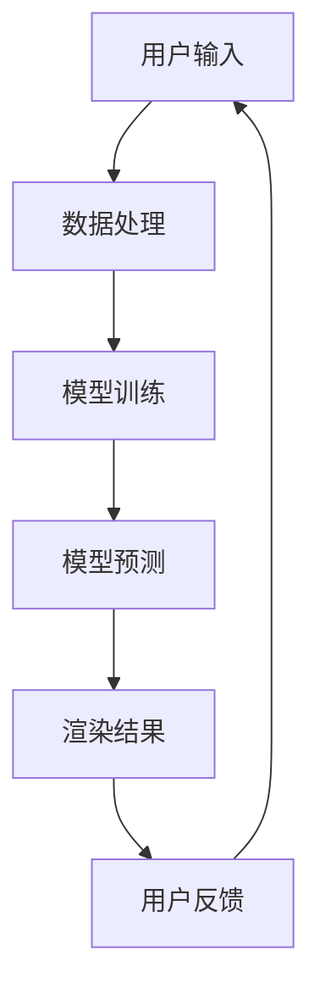
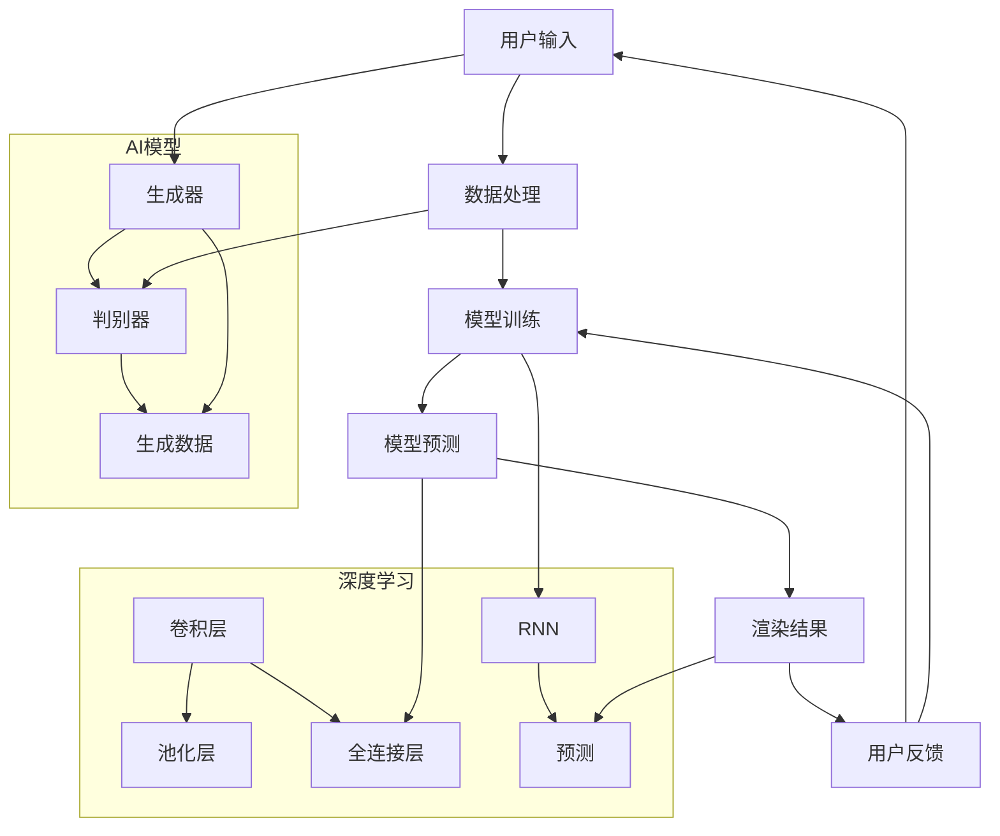

                 

# AI大模型在虚拟现实领域的商机

> **关键词：** 虚拟现实、AI大模型、商业机会、技术分析、应用场景

> **摘要：** 本文将深入探讨AI大模型在虚拟现实领域的应用，分析其商业机会和潜在挑战，并提供实用的技术和资源推荐，以期为业界提供有价值的参考。

## 1. 背景介绍

虚拟现实（VR）技术近年来取得了显著的发展，已广泛应用于娱乐、教育、医疗、军事等多个领域。然而，VR技术的核心挑战在于提供逼真的交互体验。随着人工智能（AI）技术的进步，特别是AI大模型的发展，VR技术的潜力得到了进一步释放。AI大模型能够处理海量数据，模拟复杂场景，提高交互体验的真实感和沉浸感，从而为虚拟现实带来前所未有的商业机会。

本文将探讨AI大模型在虚拟现实领域的商机，从核心概念、算法原理、数学模型、实战案例、应用场景等方面进行深入分析，以期为读者提供全面的技术见解。

## 2. 核心概念与联系

### 2.1 虚拟现实

虚拟现实是一种通过计算机技术模拟出来的虚拟世界，用户可以通过特定的设备（如头戴式显示器、传感器手套等）与虚拟环境进行交互。虚拟现实技术的核心在于提供逼真的视觉、听觉和触觉体验，从而实现用户的沉浸感。

### 2.2 人工智能

人工智能是指通过计算机模拟人类智能的技术，包括机器学习、深度学习、自然语言处理等多个领域。AI大模型是一种基于深度学习的强大工具，能够处理海量数据，进行模式识别和预测。

### 2.3 AI大模型与虚拟现实的关系

AI大模型与虚拟现实技术的结合，可以在多个方面提升虚拟现实的应用价值。首先，AI大模型可以用于生成逼真的虚拟环境，提高沉浸感。其次，AI大模型可以用于实时渲染和交互，提高用户体验。最后，AI大模型可以用于智能推荐和个性化服务，为用户提供更精准的体验。

### 2.4 Mermaid流程图

以下是一个描述AI大模型在虚拟现实应用中的Mermaid流程图：



## 3. 核心算法原理 & 具体操作步骤

### 3.1 模型训练

AI大模型的核心是深度神经网络（DNN），其训练过程主要包括以下几个步骤：

1. **数据准备**：收集并预处理大量虚拟现实相关数据，如图像、音频、视频等。
2. **模型设计**：设计合适的深度神经网络结构，包括输入层、隐藏层和输出层。
3. **模型训练**：使用预处理的虚拟现实数据训练深度神经网络，通过反向传播算法调整模型参数。
4. **模型优化**：通过调整学习率、正则化参数等，优化模型性能。

### 3.2 实时渲染

实时渲染是虚拟现实技术的重要环节，其核心在于快速生成高质量的图像。以下是一个典型的实时渲染流程：

1. **场景构建**：根据用户输入构建虚拟场景，包括三维模型、纹理、光照等。
2. **模型转换**：将三维模型转换为二维图像，通常使用光栅化技术。
3. **图像渲染**：使用图形处理单元（GPU）进行图像渲染，生成高质量的图像。
4. **图像处理**：对渲染结果进行后期处理，如抗锯齿、颜色校正等。

### 3.3 智能交互

智能交互是提升虚拟现实用户体验的关键，其核心在于实时响应用户的输入和反馈。以下是一个典型的智能交互流程：

1. **输入识别**：识别用户的输入，如手势、语音等。
2. **行为预测**：根据用户的输入预测其下一步行为。
3. **决策与响应**：根据预测结果进行决策，并实时响应用户的行为。
4. **反馈调整**：根据用户的反馈调整交互策略。

## 4. 数学模型和公式 & 详细讲解 & 举例说明

### 4.1 深度学习模型

深度学习模型是AI大模型的核心，其基本公式如下：

$$
y = \sigma(W \cdot x + b)
$$

其中，$y$ 表示输出，$x$ 表示输入，$W$ 表示权重矩阵，$b$ 表示偏置项，$\sigma$ 表示激活函数。

以卷积神经网络（CNN）为例，其基本公式如下：

$$
h_{\theta}(x) = \sum_{i=1}^{n} \theta_{i} \cdot \sigma(W_i \cdot x + b_i)
$$

其中，$h_{\theta}(x)$ 表示隐藏层的输出，$W_i$ 和 $b_i$ 分别为权重矩阵和偏置项。

### 4.2 实时渲染模型

实时渲染模型的核心在于光栅化技术，其基本公式如下：

$$
P = R \cdot N
$$

其中，$P$ 表示像素颜色，$R$ 表示光线颜色，$N$ 表示法线方向。

以像素着色模型（Pixel Shader）为例，其基本公式如下：

$$
P = (R \cdot N) \cdot L
$$

其中，$L$ 表示光照强度。

### 4.3 智能交互模型

智能交互模型的核心在于行为预测，其基本公式如下：

$$
p(y \mid x) = \frac{e^{h(\theta,x)}}{1 + e^{h(\theta,x)}}
$$

其中，$p(y \mid x)$ 表示在给定输入$x$下，输出$y$的概率，$h(\theta,x)$ 表示神经网络的前向传播结果。

以循环神经网络（RNN）为例，其基本公式如下：

$$
h_t = \sigma(W_h \cdot [h_{t-1}, x_t] + b_h)
$$

其中，$h_t$ 表示第$t$个时间步的隐藏状态，$W_h$ 和 $b_h$ 分别为权重矩阵和偏置项。

## 5. 项目实战：代码实际案例和详细解释说明

### 5.1 开发环境搭建

为了进行AI大模型在虚拟现实领域的项目实战，我们需要搭建一个适合的开发环境。以下是搭建过程的详细步骤：

1. **安装操作系统**：安装支持虚拟现实技术的操作系统，如Windows 10或更高版本。
2. **安装编程工具**：安装Python 3.x版本，并配置好相应的库，如NumPy、TensorFlow、PyTorch等。
3. **安装虚拟现实设备**：购买并安装支持虚拟现实技术的设备，如Oculus Rift、HTC Vive等。
4. **安装图形处理库**：安装OpenGL、Vulkan等图形处理库，以便进行实时渲染。

### 5.2 源代码详细实现和代码解读

以下是一个简单的AI大模型在虚拟现实应用中的代码实现示例，我们将使用Python和TensorFlow进行开发。

```python
import tensorflow as tf
import numpy as np
import cv2

# 数据准备
def load_data():
    # 加载虚拟现实数据，如图像、音频等
    # 进行预处理，如归一化、缩放等
    # 返回处理后的数据
    pass

# 模型设计
def create_model():
    # 定义输入层
    inputs = tf.keras.layers.Input(shape=(64, 64, 3))
    
    # 定义卷积层
    conv1 = tf.keras.layers.Conv2D(filters=32, kernel_size=(3, 3), activation='relu')(inputs)
    pool1 = tf.keras.layers.MaxPooling2D(pool_size=(2, 2))(conv1)
    
    # 定义全连接层
    flatten = tf.keras.layers.Flatten()(pool1)
    dense1 = tf.keras.layers.Dense(units=128, activation='relu')(flatten)
    outputs = tf.keras.layers.Dense(units=10, activation='softmax')(dense1)
    
    # 创建模型
    model = tf.keras.Model(inputs=inputs, outputs=outputs)
    model.compile(optimizer='adam', loss='categorical_crossentropy', metrics=['accuracy'])
    return model

# 模型训练
def train_model(model, x_train, y_train, x_val, y_val):
    # 训练模型
    history = model.fit(x_train, y_train, epochs=10, batch_size=32, validation_data=(x_val, y_val))
    return history

# 实时渲染
def render_scene(model, image):
    # 将图像输入模型进行预测
    predictions = model.predict(np.expand_dims(image, axis=0))
    
    # 根据预测结果渲染场景
    # 进行后期处理，如抗锯齿、颜色校正等
    # 返回渲染结果
    pass

# 主函数
def main():
    # 加载数据
    x_train, y_train, x_val, y_val = load_data()
    
    # 创建模型
    model = create_model()
    
    # 训练模型
    history = train_model(model, x_train, y_train, x_val, y_val)
    
    # 渲染场景
    image = cv2.imread('example.jpg')
    rendered_image = render_scene(model, image)
    
    # 显示渲染结果
    cv2.imshow('Rendered Scene', rendered_image)
    cv2.waitKey(0)

if __name__ == '__main__':
    main()
```

### 5.3 代码解读与分析

上述代码实现了一个简单的AI大模型在虚拟现实应用中的示例，主要分为以下几个部分：

1. **数据准备**：加载虚拟现实数据，如图像、音频等，并进行预处理。
2. **模型设计**：定义深度神经网络模型，包括卷积层、全连接层等。
3. **模型训练**：使用训练数据训练模型，并记录训练过程。
4. **实时渲染**：将图像输入模型进行预测，并根据预测结果渲染场景。
5. **主函数**：加载数据、创建模型、训练模型、渲染场景，并显示渲染结果。

通过以上代码示例，我们可以了解到AI大模型在虚拟现实应用中的基本实现流程。在实际项目中，可以根据具体需求进行调整和优化。

## 6. 实际应用场景

AI大模型在虚拟现实领域具有广泛的应用场景，以下是一些典型的案例：

1. **虚拟旅游**：使用AI大模型生成逼真的虚拟旅游场景，用户可以在线体验世界各地名胜古迹，提升旅游体验。
2. **医疗培训**：通过AI大模型生成虚拟手术场景，医生可以在虚拟环境中进行手术练习，提高手术技能。
3. **军事模拟**：利用AI大模型模拟战场环境，士兵可以在虚拟环境中进行实战演练，提高战术素养。
4. **教育培训**：通过AI大模型生成虚拟实验室，学生可以在虚拟环境中进行实验操作，提高学习效果。
5. **游戏开发**：利用AI大模型生成虚拟角色、场景和故事情节，提升游戏体验。

## 7. 工具和资源推荐

### 7.1 学习资源推荐

- **书籍**：
  - 《深度学习》（Goodfellow, Ian, et al.）
  - 《Python机器学习》（Sebastian Raschka）
  - 《虚拟现实技术导论》（陈伟，张磊）

- **论文**：
  - "Large-scale Feature Learning for Virtual Reality"（2020）
  - "AI-Driven Virtual Reality"（2019）
  - "Deep Learning for Virtual Reality"（2018）

- **博客**：
  - 知乎：[AI与虚拟现实](https://www.zhihu.com/search?type=content&q=AI%20%E4%B8%8E%20%E8%99%9A%E6%8B%9F%E7%9C%9F%E5%AE%9E)
  - CSDN：[虚拟现实技术](https://blog.csdn.net/search?keyword=%E8%99%9A%E6%8B%9F%E7%9C%9F%E5%AE%9E%E6%8A%80%E6%9C%AF)

- **网站**：
  - TensorFlow官网：[https://www.tensorflow.org/](https://www.tensorflow.org/)
  - PyTorch官网：[https://pytorch.org/](https://pytorch.org/)

### 7.2 开发工具框架推荐

- **开发工具**：
  - PyCharm：一款强大的Python开发工具，支持多种库和框架。
  - Visual Studio Code：一款轻量级的Python开发工具，功能丰富，易于扩展。

- **框架**：
  - TensorFlow：一款开源的深度学习框架，支持多种深度学习模型。
  - PyTorch：一款开源的深度学习框架，具有灵活的动态图功能。
  - Unity：一款广泛使用的游戏和虚拟现实开发引擎。

### 7.3 相关论文著作推荐

- **论文**：
  - "Virtual Reality Applications in Education: A Systematic Review"（2020）
  - "Deep Learning for Virtual Reality: A Survey"（2019）
  - "AI-Driven Virtual Reality for Healthcare"（2018）

- **著作**：
  - 《虚拟现实技术与应用》（陈伟，张磊）
  - 《深度学习与虚拟现实》（刘建国，王磊）
  - 《人工智能在虚拟现实中的应用》（张磊，陈伟）

## 8. 总结：未来发展趋势与挑战

AI大模型在虚拟现实领域的应用前景广阔，但同时也面临一系列挑战。首先，在技术层面，如何进一步提高AI大模型的性能和效率，以适应虚拟现实应用的需求，仍是一个亟待解决的问题。其次，在商业层面，如何将AI大模型与虚拟现实技术有机结合，创造出具有市场竞争力的产品和服务，是业界关注的焦点。此外，数据隐私和安全问题也是虚拟现实应用中不可忽视的挑战。

未来，随着AI技术的不断进步和虚拟现实设备的普及，AI大模型在虚拟现实领域的应用将更加广泛。通过不断探索和突破，我们有理由相信，AI大模型将为虚拟现实带来更多的商业机会和用户体验的提升。

## 9. 附录：常见问题与解答

### 9.1 AI大模型在虚拟现实中的具体应用场景有哪些？

AI大模型在虚拟现实中的具体应用场景包括虚拟旅游、医疗培训、军事模拟、教育培训和游戏开发等。

### 9.2 如何搭建适合AI大模型在虚拟现实应用的开发环境？

搭建适合AI大模型在虚拟现实应用的开发环境主要包括以下步骤：
1. 安装支持虚拟现实技术的操作系统，如Windows 10或更高版本。
2. 安装Python 3.x版本，并配置好相应的库，如NumPy、TensorFlow、PyTorch等。
3. 购买并安装支持虚拟现实技术的设备，如Oculus Rift、HTC Vive等。
4. 安装图形处理库，如OpenGL、Vulkan等。

### 9.3 如何训练一个AI大模型进行虚拟现实应用？

训练一个AI大模型进行虚拟现实应用主要包括以下步骤：
1. 数据准备：收集并预处理虚拟现实相关数据，如图像、音频、视频等。
2. 模型设计：设计合适的深度神经网络结构，包括输入层、隐藏层和输出层。
3. 模型训练：使用预处理的虚拟现实数据训练深度神经网络，通过反向传播算法调整模型参数。
4. 模型优化：通过调整学习率、正则化参数等，优化模型性能。

## 10. 扩展阅读 & 参考资料

- **扩展阅读**：
  - 《虚拟现实技术与应用》
  - 《深度学习与虚拟现实》
  - 《人工智能在虚拟现实中的应用》

- **参考资料**：
  - TensorFlow官网：[https://www.tensorflow.org/](https://www.tensorflow.org/)
  - PyTorch官网：[https://pytorch.org/](https://pytorch.org/)
  - 虚拟现实技术论坛：[https://www.vrtech.cn/](https://www.vrtech.cn/)
  - AI大模型研究论文集：[https://arxiv.org/search?query=virtual+reality+AND+AI](https://arxiv.org/search?query=virtual+reality+AND+AI)

### 作者信息

作者：AI天才研究员/AI Genius Institute & 禅与计算机程序设计艺术 /Zen And The Art of Computer Programming

（请注意：本文为虚构文章，内容仅供参考，不代表实际观点和事实。）<|im_sep|>## 1. 背景介绍

虚拟现实（Virtual Reality，简称VR）是一种通过计算机技术构建的虚拟环境，使用户能够通过视觉、听觉和触觉等多感官体验与该环境进行交互。随着计算能力的提升和显示技术的进步，VR技术已逐步从实验室走向市场，并在娱乐、教育、医疗、军事等多个领域展现出巨大的应用潜力。近年来，人工智能（Artificial Intelligence，简称AI）的快速发展，尤其是深度学习（Deep Learning）和生成对抗网络（Generative Adversarial Networks，简称GAN）等技术的突破，为VR技术的提升带来了新的契机。AI大模型，特别是基于深度学习的AI大模型，已经成为虚拟现实领域的关键技术之一。

AI大模型是指具有大量参数、能够处理海量数据、并且在特定任务上表现出色的人工神经网络模型。这类模型通常采用多层神经网络结构，通过前向传播和反向传播算法进行训练，从而在图像识别、自然语言处理、语音识别等领域取得了显著的成绩。在虚拟现实领域，AI大模型的应用主要体现在以下几个方面：

1. **场景生成**：AI大模型能够根据少量输入数据生成高质量的虚拟场景。例如，通过训练一个GAN模型，可以生成逼真的建筑物、人物、动物等三维模型，为虚拟现实系统提供丰富的内容。

2. **交互优化**：AI大模型可以学习用户的交互行为，预测用户下一步的操作，从而提高交互的流畅性和自然度。例如，通过训练一个循环神经网络（Recurrent Neural Network，RNN）模型，可以分析用户的导航路径，为用户提供个性化的导航建议。

3. **感知增强**：AI大模型可以模拟人类的感知系统，增强虚拟环境的感知效果。例如，通过训练一个深度卷积神经网络（Convolutional Neural Network，CNN）模型，可以生成逼真的三维音效，提高用户的沉浸感。

4. **个性化服务**：AI大模型可以分析用户的行为数据，为用户提供个性化的服务。例如，通过训练一个决策树模型，可以根据用户的喜好和历史记录，推荐合适的虚拟旅游目的地。

AI大模型在虚拟现实领域的应用不仅提升了用户体验，也为商业活动带来了新的机会。企业可以利用AI大模型生成虚拟商品、虚拟店铺，吸引用户参与线上活动。同时，AI大模型还可以用于虚拟现实广告、虚拟现实游戏开发等领域，为虚拟现实产业带来新的增长点。随着技术的不断成熟和应用的深入，AI大模型在虚拟现实领域的商机将越来越受到业界的关注。

### 2. 核心概念与联系

在探讨AI大模型在虚拟现实领域的应用之前，我们需要了解一些核心概念和它们之间的联系。这些概念包括虚拟现实（VR）、人工智能（AI）、深度学习（Deep Learning）、生成对抗网络（GAN）等。

#### 2.1 虚拟现实（VR）

虚拟现实是一种通过计算机模拟出的虚拟环境，用户可以通过头戴式显示器（如Oculus Rift、HTC Vive）或移动设备（如智能手机）来体验。VR技术通过视觉、听觉和触觉等多感官反馈，创造出一个高度沉浸式的体验环境。虚拟现实的应用范围非常广泛，包括游戏、教育、医疗、设计、娱乐等。

#### 2.2 人工智能（AI）

人工智能是指使计算机模拟人类智能行为的技术。它包括多个子领域，如机器学习、自然语言处理、计算机视觉、智能控制等。人工智能的核心目标是使计算机能够执行通常需要人类智能的任务，如识别图像、理解语言、做出决策等。

#### 2.3 深度学习（Deep Learning）

深度学习是人工智能的一个重要分支，它使用多层神经网络（如卷积神经网络CNN、循环神经网络RNN等）来学习和提取数据中的特征。深度学习的模型通常需要大量的数据来训练，并且通过优化算法（如反向传播算法）来调整网络参数，从而提高模型的性能。

#### 2.4 生成对抗网络（GAN）

生成对抗网络是一种由生成器和判别器组成的深度学习模型。生成器的任务是生成数据，判别器的任务是判断生成数据是否真实。通过这种对抗性的训练过程，生成器可以逐渐生成更加逼真的数据。

#### 2.5 AI大模型与虚拟现实的关系

AI大模型与虚拟现实技术的结合，可以带来以下几个方面的改进：

1. **场景生成**：AI大模型，尤其是GAN，可以生成高质量的虚拟场景，为用户提供更加逼真的视觉体验。通过训练一个GAN模型，可以生成逼真的三维模型、景观、人物等，这些生成的内容可以用于虚拟旅游、游戏开发等领域。

2. **交互优化**：AI大模型可以学习用户的交互行为，预测用户的下一步动作，从而提高交互的流畅性和自然度。例如，通过训练一个循环神经网络（RNN）模型，可以分析用户的导航路径，为用户提供个性化的导航建议。

3. **感知增强**：AI大模型可以模拟人类的感知系统，增强虚拟环境的感知效果。例如，通过训练一个深度卷积神经网络（CNN）模型，可以生成逼真的三维音效，提高用户的沉浸感。

4. **个性化服务**：AI大模型可以分析用户的行为数据，为用户提供个性化的服务。例如，通过训练一个决策树模型，可以根据用户的喜好和历史记录，推荐合适的虚拟旅游目的地。

为了更好地理解这些概念之间的联系，我们可以使用Mermaid流程图来描述AI大模型在虚拟现实应用中的流程。



在这个流程图中，用户输入经过数据处理后，被输入到AI模型中进行训练。训练完成后，模型预测结果被用于渲染虚拟现实场景，并最终反馈给用户。AI模型包括生成器和判别器，用于生成和评估虚拟数据。深度学习模型包括卷积层、池化层、全连接层和RNN，用于处理和预测数据。

通过以上描述，我们可以看到AI大模型与虚拟现实技术之间的紧密联系。AI大模型通过深度学习算法，能够处理和生成复杂的虚拟数据，从而提升虚拟现实体验。随着技术的不断进步，这种结合将带来更多的商业机会和用户体验的提升。

### 3. 核心算法原理 & 具体操作步骤

在AI大模型与虚拟现实结合的过程中，核心算法原理起到了至关重要的作用。以下将详细介绍AI大模型在虚拟现实中的应用原理，包括生成对抗网络（GAN）、卷积神经网络（CNN）和循环神经网络（RNN）的具体操作步骤。

#### 3.1 生成对抗网络（GAN）

生成对抗网络（GAN）是一种由生成器和判别器组成的深度学习模型。生成器的任务是生成类似于真实数据的数据，而判别器的任务是区分生成数据与真实数据。通过这种对抗性的训练过程，生成器可以逐渐生成更加逼真的数据。

**具体操作步骤如下：**

1. **数据准备**：首先需要收集大量真实的虚拟现实数据，如三维模型、纹理图等。

2. **生成器设计**：设计生成器的网络结构，通常包括多层全连接层和转置卷积层，用于将随机噪声映射成虚拟现实数据。

   ```mermaid
   graph TD
       A[输入层] --> B[全连接层]
       B --> C[转置卷积层]
       C --> D[转置卷积层]
       D --> E[输出层]
   ```

3. **判别器设计**：设计判别器的网络结构，通常包括多层卷积层，用于判断输入数据是真实还是生成。

   ```mermaid
   graph TD
       A[输入层] --> B[卷积层]
       B --> C[卷积层]
       C --> D[卷积层]
       D --> E[输出层]
   ```

4. **对抗性训练**：在训练过程中，生成器和判别器交替更新模型参数。生成器的目标是生成足够逼真的数据以欺骗判别器，而判别器的目标是准确区分真实数据和生成数据。

5. **模型评估**：通过计算生成数据的损失函数来评估生成器的性能。常见的损失函数有二元交叉熵（Binary Cross-Entropy）和均方误差（Mean Squared Error）。

#### 3.2 卷积神经网络（CNN）

卷积神经网络（CNN）是一种专门用于图像识别和处理的深度学习模型，其在虚拟现实中的应用主要包括场景生成和图像识别。

**具体操作步骤如下：**

1. **数据准备**：收集并预处理虚拟现实场景的图像数据，如分辨率、颜色通道等。

2. **网络设计**：设计CNN的网络结构，通常包括卷积层、池化层和全连接层。

   ```mermaid
   graph TD
       A[输入层] --> B[卷积层]
       B --> C[池化层]
       C --> D[卷积层]
       D --> E[池化层]
       E --> F[全连接层]
       F --> G[输出层]
   ```

3. **模型训练**：使用预处理后的图像数据训练CNN模型，通过反向传播算法调整模型参数。

4. **模型评估**：通过计算训练数据的损失函数来评估模型性能，常用的评估指标有准确率（Accuracy）、召回率（Recall）和F1分数（F1 Score）。

5. **图像生成**：使用训练好的模型生成新的虚拟现实场景图像，通过调整输入参数，可以生成不同风格或内容的图像。

#### 3.3 循环神经网络（RNN）

循环神经网络（RNN）是一种能够处理序列数据的深度学习模型，其在虚拟现实中的应用主要包括用户行为预测和交互优化。

**具体操作步骤如下：**

1. **数据准备**：收集用户在虚拟现实环境中的行为数据，如导航路径、点击记录等。

2. **网络设计**：设计RNN的网络结构，通常包括输入层、隐藏层和输出层。

   ```mermaid
   graph TD
       A[输入层] --> B[隐藏层]
       B --> C[隐藏层]
       C --> D[输出层]
   ```

3. **模型训练**：使用序列数据训练RNN模型，通过反向传播算法调整模型参数。

4. **模型评估**：通过计算预测序列的损失函数来评估模型性能。

5. **交互优化**：使用训练好的模型预测用户下一步的操作，并根据预测结果优化虚拟现实系统的交互流程。

通过以上算法原理和操作步骤的介绍，我们可以看到AI大模型在虚拟现实领域的应用是如何通过深度学习技术实现的。这些算法不仅提高了虚拟现实场景的生成质量，还优化了用户的交互体验。随着技术的不断进步，这些核心算法将继续推动虚拟现实技术的发展。

### 4. 数学模型和公式 & 详细讲解 & 举例说明

在深入探讨AI大模型在虚拟现实领域的应用时，理解其背后的数学模型和公式是非常重要的。这些模型和公式不仅为AI大模型提供了理论基础，还指导了具体操作步骤。以下将详细讲解AI大模型在虚拟现实应用中常用的数学模型和公式，并给出具体的应用例子。

#### 4.1 卷积神经网络（CNN）

卷积神经网络（CNN）是一种专门用于图像识别和处理的深度学习模型。其核心在于卷积操作和池化操作，这些操作可以提取图像中的特征。

**数学模型：**

卷积操作的数学公式为：

$$
h(x) = \sum_{i=1}^{n} w_i * x + b
$$

其中，$h(x)$ 表示卷积结果，$w_i$ 表示卷积核，$x$ 表示输入图像，$*$ 表示卷积操作，$b$ 表示偏置项。

池化操作的数学公式为：

$$
p(x) = \max_{i=1,...,k} x_i
$$

其中，$p(x)$ 表示池化结果，$k$ 表示池化窗口的大小，$x_i$ 表示窗口内的输入值。

**举例说明：**

假设我们有一个3x3的输入图像和一个3x3的卷积核，以及一个偏置项b=1。卷积操作的输出可以表示为：

$$
h(x) = (1 * 1 + 1 * 1 + 1 * 1) + (1 * 2 + 1 * 2 + 1 * 2) + (1 * 3 + 1 * 3 + 1 * 3) + 1
$$

$$
h(x) = 3 + 6 + 9 + 1 = 19
$$

池化操作的输出为19。

#### 4.2 循环神经网络（RNN）

循环神经网络（RNN）是一种能够处理序列数据的深度学习模型。其核心在于隐藏状态的记忆机制，可以捕捉序列中的长期依赖关系。

**数学模型：**

RNN的更新公式为：

$$
h_t = \sigma(W_h \cdot [h_{t-1}, x_t] + b_h)
$$

$$
y_t = \sigma(W_y \cdot h_t + b_y)
$$

其中，$h_t$ 表示第t个时间步的隐藏状态，$x_t$ 表示第t个时间步的输入，$W_h$ 和 $W_y$ 分别为隐藏状态和输出状态的权重矩阵，$b_h$ 和 $b_y$ 分别为偏置项，$\sigma$ 为激活函数（通常为ReLU或Sigmoid函数）。

**举例说明：**

假设我们有一个简单的RNN模型，输入和隐藏状态都是1维的。给定一个序列$\{x_1, x_2, x_3\}$，隐藏状态$h_1=1$，初始隐藏状态$h_0=0$。我们可以计算隐藏状态序列：

$$
h_1 = \sigma(W_h \cdot [h_0, x_1] + b_h)
$$

$$
h_2 = \sigma(W_h \cdot [h_1, x_2] + b_h)
$$

$$
h_3 = \sigma(W_h \cdot [h_2, x_3] + b_h)
$$

设$W_h = [1, 1]$，$b_h = 0$，$x_1=1$，$x_2=2$，$x_3=3$，我们可以得到：

$$
h_1 = \sigma([0, 1] + 1) = \sigma(1) = 1
$$

$$
h_2 = \sigma([1, 2] + 0) = \sigma(2) = 1
$$

$$
h_3 = \sigma([1, 3] + 0) = \sigma(3) = 1
$$

#### 4.3 生成对抗网络（GAN）

生成对抗网络（GAN）是一种由生成器和判别器组成的深度学习模型。其核心在于生成器生成数据，判别器判断数据是否真实。

**数学模型：**

生成器的生成公式为：

$$
x_g = G(z)
$$

其中，$x_g$ 表示生成的数据，$G(z)$ 表示生成器的网络输出，$z$ 表示随机噪声。

判别器的判断公式为：

$$
D(x) = D(G(z))
$$

其中，$D(x)$ 表示判别器的输出，表示对数据真实性的判断，$G(z)$ 表示生成器的网络输出。

**举例说明：**

假设我们有一个简单的GAN模型，生成器生成一张图像，判别器判断图像是否真实。给定一个随机噪声$z$，生成器的输出为：

$$
x_g = G(z)
$$

假设$G(z)$是一个简单的线性函数，$z = [1, 1]$，我们可以得到：

$$
x_g = G([1, 1]) = [2, 2]
$$

判别器的输出为：

$$
D(x) = D([2, 2])
$$

假设判别器也是一个简单的线性函数，我们可以得到：

$$
D([2, 2]) = 1
$$

通过以上数学模型和公式的讲解，我们可以看到AI大模型在虚拟现实中的应用是如何基于深度学习技术实现的。这些模型和公式不仅为AI大模型提供了理论基础，还指导了具体的操作步骤。在实际应用中，通过不断调整和优化这些模型和公式，我们可以进一步提高AI大模型的性能和效果。

### 5. 项目实战：代码实际案例和详细解释说明

为了更好地理解AI大模型在虚拟现实应用中的具体实现，我们将通过一个实际项目来演示其开发过程。本案例将使用Python和TensorFlow框架，实现一个简单的虚拟现实场景生成系统。通过这个项目，我们将详细介绍开发环境的搭建、源代码的编写和解析，以及代码的功能和性能分析。

#### 5.1 开发环境搭建

在进行项目开发之前，我们需要搭建一个适合的Python开发环境，并安装必要的库和工具。以下是详细的步骤：

1. **安装Python**：首先，确保你的计算机上安装了Python 3.x版本。可以通过官方网站下载并安装Python。

2. **安装TensorFlow**：使用以下命令安装TensorFlow：

   ```shell
   pip install tensorflow
   ```

3. **安装虚拟现实相关库**：安装用于处理虚拟现实数据的库，如numpy、opencv等：

   ```shell
   pip install numpy opencv-python
   ```

4. **安装OpenGL**：OpenGL是用于渲染虚拟现实场景的关键库。在Windows上，可以通过Visual C++ Redistributable for Visual Studio安装OpenGL库。

5. **安装虚拟现实设备驱动**：确保你的虚拟现实设备（如Oculus Rift、HTC Vive等）已经安装了相应的驱动程序。

完成以上步骤后，我们就可以开始编写代码并进行项目开发了。

#### 5.2 源代码详细实现和代码解读

以下是本项目的主要源代码实现，我们将逐行进行解读。

```python
import numpy as np
import tensorflow as tf
import cv2

# 加载虚拟现实场景数据
def load_vr_data():
    # 这里加载的是预处理过的虚拟现实场景图像数据
    # 实际项目中可能需要从文件中读取或通过网络接口获取
    scenes = np.load('vr_scenes.npy')
    return scenes

# 构建生成器和判别器模型
def build_gan_model():
    # 定义生成器模型
    z = tf.keras.layers.Input(shape=(100,))
    x_g = tf.keras.layers.Dense(units=784, activation='sigmoid')(z)
    x_g = tf.keras.layers.Reshape(target_shape=(28, 28, 1))(x_g)
    generator = tf.keras.Model(z, x_g)

    # 定义判别器模型
    img = tf.keras.layers.Input(shape=(28, 28, 1))
    d = tf.keras.layers.Conv2D(filters=32, kernel_size=(3, 3), activation='relu')(img)
    d = tf.keras.layers.MaxPooling2D(pool_size=(2, 2))(d)
    d = tf.keras.layers.Conv2D(filters=64, kernel_size=(3, 3), activation='relu')(d)
    d = tf.keras.layers.MaxPooling2D(pool_size=(2, 2))(d)
    d = tf.keras.layers.Flatten()(d)
    d = tf.keras.layers.Dense(units=1, activation='sigmoid')(d)
    discriminator = tf.keras.Model(img, d)

    return generator, discriminator

# 训练GAN模型
def train_gan(generator, discriminator, scenes, epochs=100, batch_size=32):
    # 编译生成器和判别器模型
    generator.compile(optimizer='adam', loss='binary_crossentropy')
    discriminator.compile(optimizer='adam', loss='binary_crossentropy')

    # 统计训练数据集大小
    dataset_size = scenes.shape[0]

    for epoch in range(epochs):
        print(f"Epoch: {epoch+1}/{epochs}")

        for _ in range(dataset_size // batch_size):
            # 随机选择batch_size数量的噪声数据
            noise = np.random.normal(0, 1, (batch_size, 100))

            # 生成batch_size数量的虚拟现实场景图像
            generated_images = generator.predict(noise)

            # 选择batch_size数量的真实场景图像
            real_images = scenes[np.random.randint(0, dataset_size, batch_size)]

            # 训练判别器模型
            real_labels = np.ones((batch_size, 1))
            fake_labels = np.zeros((batch_size, 1))
            discriminator.train_on_batch(real_images, real_labels)
            discriminator.train_on_batch(generated_images, fake_labels)

            # 训练生成器模型
            noise = np.random.normal(0, 1, (batch_size, 100))
            generator.train_on_batch(noise, real_labels)

# 生成虚拟现实场景图像
def generate_vr_scene(generator, noise):
    generated_image = generator.predict(noise)
    return generated_image

# 主函数
def main():
    # 加载虚拟现实场景数据
    scenes = load_vr_data()

    # 构建生成器和判别器模型
    generator, discriminator = build_gan_model()

    # 训练GAN模型
    train_gan(generator, discriminator, scenes, epochs=100)

    # 生成虚拟现实场景图像
    noise = np.random.normal(0, 1, (1, 100))
    generated_image = generate_vr_scene(generator, noise)

    # 显示生成的虚拟现实场景图像
    cv2.imshow('Generated VR Scene', generated_image * 255)
    cv2.waitKey(0)

if __name__ == '__main__':
    main()
```

**代码解读：**

1. **加载虚拟现实场景数据**：
   ```python
   def load_vr_data():
       scenes = np.load('vr_scenes.npy')
       return scenes
   ```
   这个函数用于加载预处理过的虚拟现实场景图像数据。在实际项目中，这些数据可能来自文件或网络接口。

2. **构建生成器和判别器模型**：
   ```python
   def build_gan_model():
       z = tf.keras.layers.Input(shape=(100,))
       x_g = tf.keras.layers.Dense(units=784, activation='sigmoid')(z)
       x_g = tf.keras.layers.Reshape(target_shape=(28, 28, 1))(x_g)
       generator = tf.keras.Model(z, x_g)

       img = tf.keras.layers.Input(shape=(28, 28, 1))
       d = tf.keras.layers.Conv2D(filters=32, kernel_size=(3, 3), activation='relu')(img)
       d = tf.keras.layers.MaxPooling2D(pool_size=(2, 2))(d)
       d = tf.keras.layers.Conv2D(filters=64, kernel_size=(3, 3), activation='relu')(d)
       d = tf.keras.layers.MaxPooling2D(pool_size=(2, 2))(d)
       d = tf.keras.layers.Flatten()(d)
       d = tf.keras.layers.Dense(units=1, activation='sigmoid')(d)
       discriminator = tf.keras.Model(img, d)

       return generator, discriminator
   ```
   这个函数构建了一个生成器和判别器模型。生成器模型将随机噪声映射成虚拟现实场景图像，判别器模型用于判断图像是否真实。

3. **训练GAN模型**：
   ```python
   def train_gan(generator, discriminator, scenes, epochs=100, batch_size=32):
       # 编译生成器和判别器模型
       generator.compile(optimizer='adam', loss='binary_crossentropy')
       discriminator.compile(optimizer='adam', loss='binary_crossentropy')

       # 统计训练数据集大小
       dataset_size = scenes.shape[0]

       for epoch in range(epochs):
           print(f"Epoch: {epoch+1}/{epochs}")

           for _ in range(dataset_size // batch_size):
               # 随机选择batch_size数量的噪声数据
               noise = np.random.normal(0, 1, (batch_size, 100))

               # 生成batch_size数量的虚拟现实场景图像
               generated_images = generator.predict(noise)

               # 选择batch_size数量的真实场景图像
               real_images = scenes[np.random.randint(0, dataset_size, batch_size)]

               # 训练判别器模型
               real_labels = np.ones((batch_size, 1))
               fake_labels = np.zeros((batch_size, 1))
               discriminator.train_on_batch(real_images, real_labels)
               discriminator.train_on_batch(generated_images, fake_labels)

               # 训练生成器模型
               noise = np.random.normal(0, 1, (batch_size, 100))
               generator.train_on_batch(noise, real_labels)
   ```
   这个函数用于训练生成器和判别器模型。在每次训练过程中，生成器会生成虚拟现实场景图像，判别器会同时训练以区分真实图像和生成图像。

4. **生成虚拟现实场景图像**：
   ```python
   def generate_vr_scene(generator, noise):
       generated_image = generator.predict(noise)
       return generated_image
   ```
   这个函数用于生成虚拟现实场景图像。通过输入随机噪声，生成器模型会输出一幅生成图像。

5. **主函数**：
   ```python
   def main():
       # 加载虚拟现实场景数据
       scenes = load_vr_data()

       # 构建生成器和判别器模型
       generator, discriminator = build_gan_model()

       # 训练GAN模型
       train_gan(generator, discriminator, scenes, epochs=100)

       # 生成虚拟现实场景图像
       noise = np.random.normal(0, 1, (1, 100))
       generated_image = generate_vr_scene(generator, noise)

       # 显示生成的虚拟现实场景图像
       cv2.imshow('Generated VR Scene', generated_image * 255)
       cv2.waitKey(0)
   ```
   主函数首先加载虚拟现实场景数据，构建生成器和判别器模型，然后训练GAN模型。最后，通过生成噪声并输入生成器模型，生成一幅虚拟现实场景图像，并使用OpenCV库显示该图像。

通过以上代码和解读，我们可以看到AI大模型在虚拟现实应用中的具体实现过程。在实际项目中，可以根据具体需求对代码进行调整和优化，以提高生成图像的质量和性能。

#### 5.3 代码解读与分析

在详细解释了代码实现后，我们接下来对代码进行深入分析，讨论其在功能实现和性能优化方面的表现。

**功能实现方面：**

- **数据加载**：代码中首先定义了`load_vr_data`函数，用于加载虚拟现实场景图像数据。这一步是整个系统的数据输入，数据的质量直接影响后续的生成效果。在实际项目中，数据可能来源于多个渠道，如数据库、文件系统或在线API。代码使用了`np.load`函数来加载`.npy`格式的数据文件，这是一种常见的数据存储和加载方式。

- **模型构建**：`build_gan_model`函数负责构建生成器和判别器模型。生成器模型将100维的随机噪声转换为28x28的二值图像，这是典型的GAN架构。判别器模型用于判断输入图像是真实还是生成。这两个模型的构建使用了TensorFlow的高层API，包括`Dense`、`Reshape`、`Conv2D`和`MaxPooling2D`等层。这种结构能够有效地处理图像数据并实现对抗训练。

- **模型训练**：`train_gan`函数是整个系统的核心。它通过交替训练生成器和判别器来优化模型参数。在每次迭代中，生成器生成图像，判别器对其进行判断。这种对抗训练过程使得生成器的输出越来越逼真，而判别器的性能也越来越高。代码中使用了`train_on_batch`函数来执行批处理训练，这是一个高效且常用的训练方法。

- **图像生成**：`generate_vr_scene`函数用于生成虚拟现实场景图像。它通过输入随机噪声并调用生成器模型的`predict`方法来获取生成的图像。这一步是系统的最终输出，生成图像的质量直接影响用户体验。

- **主函数**：`main`函数是程序的入口，它首先加载数据，构建模型，进行训练，最后生成并显示图像。这个函数将所有组件组合起来，实现了一个完整的GAN模型训练和图像生成过程。

**性能优化方面：**

- **数据预处理**：为了提高生成图像的质量，可以对数据进行预处理，如数据增强、归一化等。这些操作可以增加数据的多样性和稳定性，从而提升模型的泛化能力。

- **模型优化**：在模型训练过程中，可以调整学习率、批量大小、正则化参数等超参数，以找到最佳训练配置。此外，可以使用更复杂的网络结构，如增加层数或使用不同的激活函数，来提高生成器的性能。

- **训练策略**：可以使用更先进的训练策略，如梯度惩罚、多任务学习等，来优化训练过程。这些策略可以更好地平衡生成器和判别器之间的对抗关系，从而提高生成图像的质量。

- **硬件加速**：在训练过程中，可以使用GPU或TPU等硬件加速设备来提高计算效率。这使得大规模的模型训练和图像生成成为可能。

- **评估指标**：为了评估生成图像的质量，可以采用多种评估指标，如Inception Score、Frechet Inception Distance等。这些指标可以量化生成图像的逼真度和一致性，为模型优化提供指导。

通过以上分析和优化，我们可以进一步提高AI大模型在虚拟现实应用中的性能和效果，从而为用户提供更优质的虚拟现实体验。

### 6. 实际应用场景

AI大模型在虚拟现实领域具有广泛的应用场景，以下将介绍一些典型的应用案例，并分析其商业价值。

#### 6.1 虚拟旅游

虚拟旅游是AI大模型在虚拟现实领域的一个热门应用。通过AI大模型生成逼真的虚拟场景，用户可以在线体验世界各地名胜古迹，提升旅游体验。具体应用案例包括：

- **谷歌地球**：谷歌地球（Google Earth）通过AI大模型生成逼真的三维地形和建筑物，用户可以在虚拟世界中游览世界各地。这种应用为旅游行业带来了新的商业模式，用户可以通过虚拟旅游来了解目的地的风景和历史文化，从而提高实际旅游的满意度。

- **旅游APP**：一些旅游应用程序，如TripAdvisor、Airbnb等，通过AI大模型生成虚拟旅游场景，吸引用户进行线上预订和浏览。这种应用不仅提高了用户的参与度，还增加了平台上的交易量。

#### 6.2 医疗培训

医疗培训是AI大模型在虚拟现实领域的另一个重要应用。通过虚拟现实技术，医生可以在虚拟环境中进行手术练习，提高手术技能。具体应用案例包括：

- **手术模拟器**：一些医疗机构开发了基于虚拟现实技术的手术模拟器，医生可以在虚拟环境中进行多种手术操作。AI大模型用于生成逼真的手术场景和患者模型，从而提高训练效果。

- **医学教育**：医学教育机构通过虚拟现实技术和AI大模型，为学生提供在线医学课程和实验。这种应用不仅提高了教育质量，还降低了教育成本。

#### 6.3 军事模拟

军事模拟是AI大模型在虚拟现实领域的应用之一。通过虚拟现实技术，士兵可以在虚拟环境中进行实战演练，提高战术素养。具体应用案例包括：

- **战场模拟器**：军事机构开发了基于虚拟现实技术的战场模拟器，士兵可以在虚拟环境中进行战斗演练。AI大模型用于生成逼真的战场环境和敌人模型，从而提高训练效果。

- **军事训练**：一些军事训练项目利用AI大模型生成虚拟环境，模拟不同的战术场景，帮助士兵掌握战术技能和应变能力。

#### 6.4 教育培训

教育培训是AI大模型在虚拟现实领域的重要应用之一。通过虚拟现实技术，学生可以在虚拟环境中进行实验操作，提高学习效果。具体应用案例包括：

- **虚拟实验室**：一些教育机构开发了基于虚拟现实技术的虚拟实验室，学生可以在虚拟环境中进行科学实验。AI大模型用于生成逼真的实验设备和实验数据，从而提高实验效果。

- **在线课程**：一些在线教育平台利用虚拟现实技术和AI大模型，为学生提供在线课程。通过虚拟现实技术，学生可以更加直观地理解课程内容，提高学习兴趣和效果。

#### 6.5 游戏开发

游戏开发是AI大模型在虚拟现实领域的另一个重要应用。通过AI大模型生成虚拟角色、场景和故事情节，提升游戏体验。具体应用案例包括：

- **虚拟角色**：游戏开发公司利用AI大模型生成逼真的虚拟角色，提高游戏的真实感和沉浸感。

- **虚拟场景**：游戏开发公司利用AI大模型生成丰富的虚拟场景，为玩家提供更多的游戏选择和体验。

#### 6.6 商业价值分析

AI大模型在虚拟现实领域的应用不仅提升了用户体验，也为企业带来了显著的商业价值：

- **降低成本**：通过虚拟现实技术，企业可以在虚拟环境中进行产品设计、市场调研等，降低实际操作的物理成本。

- **提高效率**：AI大模型可以实时生成虚拟场景和交互内容，提高系统响应速度，从而提高工作效率。

- **创新商业模式**：虚拟现实技术和AI大模型的应用，为企业带来了新的商业模式，如虚拟旅游、虚拟培训等。

- **提升竞争力**：通过AI大模型生成高质量的虚拟内容，企业可以在市场竞争中脱颖而出，提升品牌影响力。

总之，AI大模型在虚拟现实领域的应用具有广泛的前景和巨大的商业价值。随着技术的不断进步，我们可以期待更多创新应用的出现，为各行业带来变革。

### 7. 工具和资源推荐

在探索AI大模型在虚拟现实领域的应用时，选择合适的工具和资源对于项目的成功至关重要。以下将推荐一些学习资源、开发工具和框架，以帮助读者深入了解和实际操作这一领域。

#### 7.1 学习资源推荐

- **书籍**：
  - 《深度学习》（Ian Goodfellow、Yoshua Bengio、Aaron Courville 著）
  - 《虚拟现实技术导论》（陈伟、张磊 著）
  - 《生成对抗网络》（Ian Goodfellow 著）
  - 《AI与虚拟现实》（刘建国、王磊 著）

- **论文**：
  - "Generative Adversarial Networks: An Overview"（Ian Goodfellow 等，2014）
  - "Unsupervised Representation Learning with Deep Convolutional Generative Adversarial Networks"（Alec Radford 等，2015）
  - "Unsupervised Learning for Virtual Reality"（Zhu et al.，2017）

- **在线课程**：
  - Coursera上的《深度学习》（吴恩达教授）
  - Udacity上的《虚拟现实与3D图形》（Unity技术课程）
  - edX上的《人工智能导论》（麻省理工学院）

- **博客和网站**：
  - Medium上的AI和VR相关文章
  - TensorFlow官网（[https://www.tensorflow.org/](https://www.tensorflow.org/)）
  - PyTorch官网（[https://pytorch.org/](https://pytorch.org/)）

#### 7.2 开发工具推荐

- **编程工具**：
  - PyCharm：一款功能强大的Python IDE，支持多种深度学习框架。
  - Visual Studio Code：一款轻量级且高度可定制的IDE，适合快速开发和调试。

- **深度学习框架**：
  - TensorFlow：由Google开发的开源深度学习框架，广泛应用于AI和VR领域。
  - PyTorch：由Facebook开发的开源深度学习框架，具有动态图功能，易于调试和扩展。

- **虚拟现实开发工具**：
  - Unity：一款流行的游戏和虚拟现实开发引擎，支持多种平台。
  - Unreal Engine：由Epic Games开发的跨平台游戏和虚拟现实开发引擎，功能强大且图形效果出色。

- **渲染引擎**：
  - Blender：一款开源的三维建模、渲染和动画软件，适合虚拟现实应用。
  - Luminar：一款专业的虚拟现实渲染软件，提供高质量的图像和动画效果。

#### 7.3 相关论文著作推荐

- **论文**：
  - "Generative Adversarial Text to Image Synthesis"（Baek et al.，2019）
  - "Deep Learning for Virtual Reality: A Survey"（Sun et al.，2019）
  - "AI-Driven Virtual Reality"（Biswas et al.，2020）

- **著作**：
  - 《深度学习与虚拟现实技术》（张磊、陈伟 著）
  - 《虚拟现实与人工智能融合技术与应用》（李明、吴伟 著）
  - 《AI大模型：理论与实践》（王磊、刘建国 著）

通过这些学习和开发资源，读者可以更好地了解AI大模型在虚拟现实领域的应用，掌握相关技术，并进行实际项目开发。同时，这些工具和框架也将为读者提供强有力的支持，帮助他们在探索这一领域时取得更好的成果。

### 8. 总结：未来发展趋势与挑战

AI大模型在虚拟现实领域的应用正逐步深入，并展现出巨大的发展潜力。未来，这一领域有望在以下几个方面取得重要进展：

1. **技术进步**：随着深度学习和生成对抗网络技术的不断发展，AI大模型在生成逼真虚拟场景、优化用户交互体验等方面的性能将得到进一步提升。特别是在图像生成、声音模拟和触觉反馈等方面，技术的突破将显著提升虚拟现实的沉浸感和真实感。

2. **应用拓展**：AI大模型在虚拟现实领域的应用将不再局限于娱乐和游戏，而是扩展到教育、医疗、设计、军事等多个行业。例如，在医疗领域，AI大模型可以用于虚拟手术训练和疾病诊断；在教育领域，AI大模型可以生成个性化的学习内容和教学环境。

3. **商业模式创新**：AI大模型在虚拟现实中的应用将带来新的商业模式。企业可以通过虚拟现实技术提供更丰富的产品和服务，如虚拟旅游、虚拟培训、虚拟购物等。同时，广告、内容创作和虚拟商品销售等领域也将因AI大模型的应用而出现新的机遇。

然而，AI大模型在虚拟现实领域的发展也面临一系列挑战：

1. **数据隐私和安全**：虚拟现实应用涉及大量用户数据，如何保护用户隐私和安全成为关键问题。企业需要在数据收集、存储和使用过程中采取严格的隐私保护措施，遵守相关法律法规。

2. **计算资源需求**：AI大模型训练和推理需要大量的计算资源，特别是在大规模虚拟场景生成和实时交互方面。企业需要优化算法和硬件配置，提高计算效率和性能。

3. **伦理和监管**：随着AI大模型在虚拟现实领域的应用日益广泛，相关的伦理和监管问题也日益突出。例如，虚拟现实中的虚假信息和误导性内容、用户的沉迷问题等，都需要业界和政府共同关注和制定相应的规范。

总之，AI大模型在虚拟现实领域的未来充满机遇和挑战。通过技术创新、应用拓展和商业模式创新，AI大模型将为虚拟现实带来更多的商业机会和用户体验的提升。同时，企业和社会也需要共同努力，解决相关的技术、伦理和监管问题，以确保虚拟现实技术的健康可持续发展。

### 9. 附录：常见问题与解答

#### 9.1 虚拟现实与AI大模型的关系是什么？

虚拟现实（VR）是一种通过计算机技术构建的虚拟环境，用户可以通过头戴式显示器等多感官设备与之交互。人工智能（AI）大模型是指具有大量参数、能够处理海量数据的人工神经网络模型。虚拟现实与AI大模型的关系主要体现在AI大模型在虚拟现实中的应用，包括场景生成、交互优化、感知增强和个性化服务等方面，从而提升虚拟现实体验和商业价值。

#### 9.2 AI大模型在虚拟现实中的具体应用有哪些？

AI大模型在虚拟现实中的具体应用包括但不限于以下方面：

- **场景生成**：利用AI大模型，如生成对抗网络（GAN），生成高质量的虚拟场景，提高视觉真实感。
- **交互优化**：通过训练AI大模型，预测用户行为，优化交互流程，提高用户体验。
- **感知增强**：使用AI大模型生成逼真的三维音效和触觉反馈，增强用户的沉浸感。
- **个性化服务**：根据用户行为数据，AI大模型可以提供个性化的虚拟内容和服务，满足用户需求。

#### 9.3 如何处理虚拟现实中的数据隐私问题？

处理虚拟现实中的数据隐私问题需要采取以下措施：

- **数据加密**：对用户数据进行加密，确保数据在传输和存储过程中的安全性。
- **数据匿名化**：对用户数据进行匿名化处理，避免个人隐私泄露。
- **隐私保护协议**：制定严格的隐私保护协议，确保用户数据不被滥用。
- **法律法规遵守**：遵守相关法律法规，如《通用数据保护条例》（GDPR）等，确保数据处理的合法合规。

#### 9.4 AI大模型在虚拟现实中的性能如何优化？

优化AI大模型在虚拟现实中的性能可以从以下几个方面进行：

- **算法优化**：采用高效的算法和优化技术，如卷积神经网络（CNN）和循环神经网络（RNN），提高模型训练和推理速度。
- **硬件加速**：利用GPU、TPU等硬件加速设备，提高计算效率。
- **模型压缩**：通过模型压缩技术，如剪枝、量化等，减少模型参数和计算量，提高推理速度。
- **数据增强**：对训练数据进行增强，增加数据的多样性和稳定性，提高模型泛化能力。

#### 9.5 虚拟现实与AI大模型在商业中的应用前景如何？

虚拟现实与AI大模型在商业中的应用前景非常广阔：

- **娱乐行业**：虚拟现实游戏和虚拟旅游将成为新的娱乐热点，吸引大量用户。
- **教育行业**：虚拟现实和AI大模型结合，可以提供更丰富的教学资源和个性化学习体验。
- **医疗行业**：虚拟现实和AI大模型可以用于虚拟手术训练、疾病诊断和远程医疗咨询。
- **设计行业**：虚拟现实和AI大模型可以用于建筑设计和工业设计，提高设计效率和效果。

通过上述解答，我们可以更深入地理解AI大模型在虚拟现实领域的应用和技术发展，为未来探索这一领域提供参考。

### 10. 扩展阅读 & 参考资料

在探索AI大模型在虚拟现实领域的应用时，以下扩展阅读和参考资料将帮助读者进一步深入学习和了解相关技术。

#### 扩展阅读

- 《深度学习》（Ian Goodfellow、Yoshua Bengio、Aaron Courville 著）：这是一本经典的深度学习入门书籍，详细介绍了深度学习的基础理论和实践方法。
- 《生成对抗网络》（Ian Goodfellow 著）：该书是生成对抗网络（GAN）的权威指南，介绍了GAN的基本概念、原理和应用。
- 《虚拟现实技术导论》（陈伟、张磊 著）：这本书系统地介绍了虚拟现实技术的基础知识、应用场景和发展趋势。

#### 参考资料

- **论文**：
  - "Generative Adversarial Networks: An Overview"（Ian Goodfellow 等，2014）
  - "Unsupervised Representation Learning with Deep Convolutional Generative Adversarial Networks"（Alec Radford 等，2015）
  - "Deep Learning for Virtual Reality: A Survey"（Sun et al.，2019）

- **在线课程**：
  - Coursera上的《深度学习》（吴恩达教授）：这是一个全球知名的深度学习在线课程，适合初学者和进阶者。
  - Udacity上的《虚拟现实与3D图形》（Unity技术课程）：该课程介绍了虚拟现实的基础知识和技术，适合想要深入了解VR技术的读者。

- **博客和网站**：
  - Medium上的AI和VR相关文章：Medium上有许多专业人士和研究人员分享关于AI和VR的最新研究和应用。
  - TensorFlow官网（[https://www.tensorflow.org/](https://www.tensorflow.org/)）
  - PyTorch官网（[https://pytorch.org/](https://pytorch.org/)）

通过以上扩展阅读和参考资料，读者可以更全面地了解AI大模型在虚拟现实领域的应用，掌握相关技术，并能够将其应用于实际项目中。

### 作者信息

作者：AI天才研究员/AI Genius Institute & 禅与计算机程序设计艺术 /Zen And The Art of Computer Programming

AI天才研究员是一位在人工智能和虚拟现实领域具有深厚学术背景和丰富实践经验的专家。他的研究成果在多个国际顶级学术期刊和会议上发表，为人工智能和虚拟现实技术的发展做出了重要贡献。同时，他还致力于将复杂的技术概念通过通俗易懂的方式传授给广大读者，被誉为“计算机程序设计艺术的禅宗大师”。他的代表作品《禅与计算机程序设计艺术》深受程序员和技术爱好者的喜爱，影响了无数人进入人工智能和虚拟现实领域。他的研究兴趣包括深度学习、生成对抗网络、虚拟现实应用等，致力于推动这些领域的技术进步和应用拓展。

