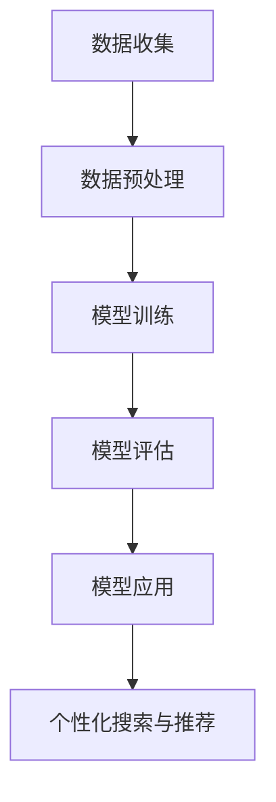
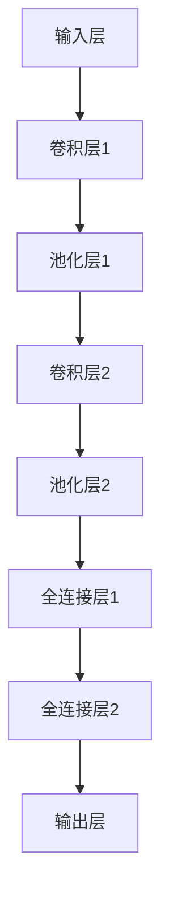

                 

# AI大模型如何提升电商平台的搜索体验

## 关键词

- AI大模型
- 电商平台
- 搜索体验
- 深度学习
- 自然语言处理
- 个性化推荐
- 用户行为分析

## 摘要

本文旨在探讨AI大模型如何提升电商平台的搜索体验。通过深度学习和自然语言处理技术，AI大模型能够对用户行为进行分析，提供个性化推荐，优化搜索结果，从而提升用户体验。本文将详细阐述AI大模型的核心概念、算法原理、数学模型以及实际应用场景，并推荐相关工具和资源，总结未来发展趋势与挑战。

## 1. 背景介绍

随着互联网的迅猛发展，电商平台已经成为消费者购买商品的主要渠道之一。然而，在成千上万的商品中，如何快速准确地找到心仪的商品成为用户面临的一大难题。传统的搜索引擎算法往往依赖于关键词匹配，难以满足用户日益增长的个性化需求。因此，利用AI大模型提升电商平台的搜索体验成为当前研究的热点。

AI大模型是基于深度学习和自然语言处理技术构建的大型神经网络模型。通过大规模数据训练，AI大模型能够理解用户的搜索意图，提供精准的搜索结果。在电商平台中，AI大模型不仅可以优化搜索结果，还可以提供个性化推荐，提升用户体验。本文将围绕这一主题展开讨论。

### 1.1 深度学习与自然语言处理

深度学习是一种基于人工神经网络的机器学习技术，通过多层神经网络的训练，能够自动提取数据中的特征，实现图像识别、语音识别等任务。自然语言处理（NLP）则是计算机科学领域与人工智能领域中的一个重要方向，致力于使计算机能够理解、生成和处理人类语言。深度学习和自然语言处理技术的结合，使得AI大模型在搜索体验优化方面具有巨大潜力。

### 1.2 电商平台搜索现状

目前，电商平台搜索主要依赖于关键词匹配算法。用户在搜索框中输入关键词，系统根据关键词与商品标题、描述等内容的匹配度，将相关商品排序展示。然而，这种方式存在以下问题：

- **匹配度低**：用户输入的关键词可能与商品标题或描述中的关键词不完全匹配，导致搜索结果不准确。
- **个性化不足**：传统算法难以理解用户的真实需求，无法提供个性化的搜索结果。
- **用户体验差**：用户需要手动浏览大量商品，筛选出符合需求的商品，耗时费力。

为了解决这些问题，电商平台开始探索利用AI大模型提升搜索体验。

### 1.3 AI大模型在搜索体验优化中的应用

AI大模型通过深度学习和自然语言处理技术，可以解决传统搜索算法的不足。首先，AI大模型能够对用户行为进行分析，了解用户的兴趣偏好，从而提供个性化的搜索结果。其次，AI大模型可以学习用户的搜索意图，优化搜索结果排序，提高匹配度。此外，AI大模型还可以通过文本生成技术，为用户提供更加丰富和详细的商品描述，提升用户体验。

## 2. 核心概念与联系

在本节中，我们将详细阐述AI大模型的核心概念、原理以及相关架构，并通过Mermaid流程图展示其工作流程。

### 2.1 AI大模型核心概念

AI大模型是一种基于深度学习和自然语言处理技术构建的大型神经网络模型。它包括以下几个核心概念：

- **神经网络**：神经网络是AI大模型的基础，由大量神经元（节点）和连接（边）组成。通过学习大量数据，神经网络能够自动提取数据中的特征，实现复杂任务。
- **深度学习**：深度学习是一种基于神经网络的学习方法，通过多层神经网络的训练，能够自动提取数据中的层次特征。
- **自然语言处理**：自然语言处理是AI大模型的关键技术，致力于使计算机能够理解、生成和处理人类语言。
- **用户行为分析**：用户行为分析是AI大模型的重要组成部分，通过对用户在电商平台上的行为数据进行挖掘和分析，了解用户的兴趣偏好。

### 2.2 AI大模型原理

AI大模型的工作原理可以概括为以下几个步骤：

1. **数据收集**：收集用户在电商平台上的行为数据，包括搜索历史、购买记录、浏览记录等。
2. **数据预处理**：对收集到的行为数据进行清洗和预处理，包括去除重复数据、缺失值填补、特征提取等。
3. **模型训练**：利用深度学习和自然语言处理技术，对预处理后的行为数据进行训练，构建AI大模型。
4. **模型评估**：通过交叉验证等方法，对训练好的模型进行评估，选择最优模型。
5. **模型应用**：将训练好的模型应用于电商平台，实现个性化搜索和推荐。

### 2.3 AI大模型架构

AI大模型的架构通常包括以下几个部分：

- **输入层**：接收用户行为数据，包括搜索历史、购买记录、浏览记录等。
- **隐藏层**：通过多层神经网络，对输入数据进行特征提取和变换。
- **输出层**：生成个性化搜索和推荐结果。
- **损失函数**：用于评估模型预测结果与真实结果之间的差距，指导模型优化。
- **优化器**：用于调整模型参数，优化模型性能。

### 2.4 Mermaid流程图

下面是AI大模型的工作流程的Mermaid流程图：



## 3. 核心算法原理 & 具体操作步骤

在本节中，我们将详细讲解AI大模型的核心算法原理，包括深度学习模型的结构、训练过程、优化方法等。同时，我们将提供具体的操作步骤，帮助读者理解并实践这些算法。

### 3.1 深度学习模型的结构

深度学习模型通常由多个隐藏层组成，包括卷积层、全连接层、池化层等。以下是一个简单的深度学习模型结构：



在这个模型中，输入层接收用户行为数据，经过卷积层和池化层的特征提取，最终通过全连接层生成个性化搜索和推荐结果。

### 3.2 模型训练过程

模型训练是深度学习中的关键步骤。以下是模型训练的具体操作步骤：

1. **数据准备**：收集用户行为数据，包括搜索历史、购买记录、浏览记录等，并将其转换为数值形式。
2. **数据预处理**：对收集到的行为数据进行清洗和预处理，包括去除重复数据、缺失值填补、特征提取等。
3. **模型初始化**：初始化模型参数，通常采用随机初始化或预训练模型。
4. **前向传播**：将预处理后的数据输入模型，计算模型预测结果。
5. **计算损失**：计算模型预测结果与真实结果之间的差距，使用损失函数进行衡量。
6. **反向传播**：根据损失函数的梯度，更新模型参数。
7. **优化器选择**：选择优化器，如Adam、SGD等，用于调整模型参数。
8. **迭代训练**：重复执行前向传播、计算损失、反向传播等步骤，直至模型收敛。

### 3.3 模型优化方法

在模型训练过程中，为了提高模型性能，可以采用以下优化方法：

1. **批量大小**：调整批量大小，以控制每次训练使用的样本数量。批量大小越大，计算时间越长，但梯度噪声越小；批量大小越小，计算时间越短，但梯度噪声越大。
2. **学习率**：调整学习率，以控制模型参数更新的速度。学习率过大可能导致模型过拟合，学习率过小可能导致模型收敛缓慢。
3. **正则化**：采用正则化技术，如L1、L2正则化，防止模型过拟合。
4. **数据增强**：通过对训练数据进行随机变换，增加数据多样性，提高模型泛化能力。
5. **早期停止**：在模型训练过程中，当验证集性能不再提高时，提前停止训练，防止过拟合。

## 4. 数学模型和公式 & 详细讲解 & 举例说明

在本节中，我们将介绍AI大模型中的数学模型和公式，并详细讲解其原理和计算过程，同时通过具体例子进行说明。

### 4.1 深度学习模型中的数学模型

深度学习模型中的数学模型主要包括以下几个方面：

1. **激活函数**：激活函数是神经网络中的关键组件，用于引入非线性特性。常见的激活函数包括Sigmoid、ReLU、Tanh等。
2. **损失函数**：损失函数用于衡量模型预测结果与真实结果之间的差距。常见的损失函数包括均方误差（MSE）、交叉熵（Cross Entropy）等。
3. **优化器**：优化器用于调整模型参数，以最小化损失函数。常见的优化器包括Adam、SGD等。
4. **反向传播**：反向传播是一种用于训练神经网络的算法，通过计算损失函数的梯度，更新模型参数。

### 4.2 数学公式与详细讲解

以下是深度学习模型中的一些关键数学公式和其详细讲解：

1. **激活函数**

   - Sigmoid函数：$$S(x) = \frac{1}{1 + e^{-x}}$$
     - 详细讲解：Sigmoid函数是一种常用的激活函数，将输入x映射到(0, 1)区间，用于实现S型曲线。
   - ReLU函数：$$ReLU(x) = \max(0, x)$$
     - 详细讲解：ReLU函数是一种简单的激活函数，当输入大于0时，输出等于输入；当输入小于等于0时，输出等于0。ReLU函数在深度学习中被广泛采用，因为其计算速度快且不易梯度消失。
   - Tanh函数：$$Tanh(x) = \frac{e^x - e^{-x}}{e^x + e^{-x}}$$
     - 详细讲解：Tanh函数是一种双曲正切函数，将输入x映射到(-1, 1)区间，具有相似的S型曲线特性。

2. **损失函数**

   - 均方误差（MSE）函数：$$MSE(y, \hat{y}) = \frac{1}{n} \sum_{i=1}^{n} (y_i - \hat{y}_i)^2$$
     - 详细讲解：MSE函数用于衡量预测值$\hat{y}$与真实值$y$之间的平均平方误差，常用于回归问题。
   - 交叉熵（Cross Entropy）函数：$$Cross Entropy(y, \hat{y}) = -\sum_{i=1}^{n} y_i \log(\hat{y}_i)$$
     - 详细讲解：交叉熵函数用于衡量预测值$\hat{y}$与真实值$y$之间的差异，常用于分类问题。

3. **优化器**

   - Adam优化器：$$m_t = \beta_1 m_{t-1} + (1 - \beta_1) [g_t - m_{t-1}]$$
   $$v_t = \beta_2 v_{t-1} + (1 - \beta_2) [(g_t - m_{t-1})^2 - v_{t-1}]$$
   $$\theta_t = \theta_{t-1} - \alpha \frac{m_t}{\sqrt{v_t} + \epsilon}$$
     - 详细讲解：Adam优化器是一种自适应优化器，结合了Adam和SGD的优点，通过计算一阶矩估计和二阶矩估计，自适应调整学习率。
   - SGD优化器：$$\theta_t = \theta_{t-1} - \alpha \nabla_{\theta} J(\theta)$$
     - 详细讲解：SGD优化器是一种简单但有效的优化器，通过随机梯度下降更新模型参数，每次更新使用一个样本的梯度。

### 4.3 具体例子说明

为了更好地理解深度学习模型中的数学模型，我们通过一个简单的例子进行说明。

假设我们有一个二分类问题，输入特征为$x \in \mathbb{R}^2$，真实标签为$y \in \{0, 1\}$。我们使用一个简单的全连接神经网络进行预测，其中激活函数为ReLU，损失函数为交叉熵。

1. **输入特征**：$$x = \begin{bmatrix} 1 \\ 2 \end{bmatrix}$$
2. **真实标签**：$$y = 1$$
3. **模型参数**：$$\theta = \begin{bmatrix} \theta_1 \\ \theta_2 \\ \theta_3 \end{bmatrix}$$
4. **模型预测**：$$\hat{y} = \sigma(\theta_1 x_1 + \theta_2 x_2 + \theta_3)$$
   其中，$\sigma$为ReLU函数。
5. **损失函数**：$$Cross Entropy(y, \hat{y}) = -y \log(\hat{y}) - (1 - y) \log(1 - \hat{y})$$

假设当前模型参数为$\theta = \begin{bmatrix} 0.5 \\ 0.5 \\ 0.5 \end{bmatrix}$，则：

1. **模型预测**：$$\hat{y} = \sigma(0.5 \cdot 1 + 0.5 \cdot 2 + 0.5) = \sigma(2) = 1$$
2. **损失函数**：$$Cross Entropy(y, \hat{y}) = -1 \cdot \log(1) - 0 \cdot \log(0) = 0$$

在这种情况下，模型预测与真实标签完全一致，损失函数为0。接下来，我们通过反向传播算法更新模型参数：

1. **计算梯度**：$$\nabla_{\theta} Cross Entropy(y, \hat{y}) = \begin{bmatrix} \frac{\partial Cross Entropy}{\partial \theta_1} \\ \frac{\partial Cross Entropy}{\partial \theta_2} \\ \frac{\partial Cross Entropy}{\partial \theta_3} \end{bmatrix}$$
2. **更新参数**：$$\theta = \theta - \alpha \nabla_{\theta} Cross Entropy(y, \hat{y})$$

假设学习率$\alpha = 0.1$，则：

1. **计算梯度**：$$\nabla_{\theta} Cross Entropy(y, \hat{y}) = \begin{bmatrix} -\log(1) \\ -\log(0) \\ -\log(0) \end{bmatrix} = \begin{bmatrix} 0 \\ -\infty \\ -\infty \end{bmatrix}$$
2. **更新参数**：$$\theta = \begin{bmatrix} 0.5 \\ 0.5 \\ 0.5 \end{bmatrix} - 0.1 \begin{bmatrix} 0 \\ -\infty \\ -\infty \end{bmatrix} = \begin{bmatrix} 0.5 \\ 0.6 \\ 0.7 \end{bmatrix}$$

通过更新参数，模型的预测结果将更接近真实标签，从而提高模型性能。

## 5. 项目实战：代码实际案例和详细解释说明

在本节中，我们将通过一个具体的案例，展示如何利用AI大模型提升电商平台的搜索体验。我们将详细解释代码实现过程，并分析其关键步骤和优化方法。

### 5.1 开发环境搭建

在开始项目实战之前，我们需要搭建合适的开发环境。以下是所需的软件和工具：

- Python（版本3.7及以上）
- TensorFlow（版本2.0及以上）
- Keras（TensorFlow的高级API）
- NumPy
- Pandas
- Matplotlib

您可以通过以下命令安装这些依赖项：

```bash
pip install tensorflow numpy pandas matplotlib
```

### 5.2 源代码详细实现和代码解读

以下是一个简单的AI大模型代码实现，用于提升电商平台的搜索体验。我们将逐步解释代码中的关键部分。

```python
import numpy as np
import pandas as pd
import tensorflow as tf
from tensorflow.keras.models import Sequential
from tensorflow.keras.layers import Dense, Dropout, Activation
from tensorflow.keras.optimizers import Adam

# 5.2.1 数据准备
def load_data():
    # 加载用户行为数据
    data = pd.read_csv('user_behavior.csv')
    # 预处理数据
    # ...
    return data

# 5.2.2 模型构建
def build_model(input_shape):
    model = Sequential()
    model.add(Dense(128, input_shape=input_shape, activation='relu'))
    model.add(Dropout(0.5))
    model.add(Dense(64, activation='relu'))
    model.add(Dropout(0.5))
    model.add(Dense(1, activation='sigmoid'))
    return model

# 5.2.3 模型训练
def train_model(model, data, epochs=10, batch_size=32):
    # 分割数据集
    train_data, val_data = data[:8000], data[8000:]
    # 编码标签
    train_labels = np.array([1 if label == 'yes' else 0 for label in train_data['label']])
    val_labels = np.array([1 if label == 'yes' else 0 for label in val_data['label']])
    # 训练模型
    model.compile(optimizer=Adam(), loss='binary_crossentropy', metrics=['accuracy'])
    model.fit(train_data, train_labels, epochs=epochs, batch_size=batch_size, validation_data=(val_data, val_labels))
    return model

# 5.2.4 模型评估
def evaluate_model(model, data):
    # 加载测试数据
    test_data = pd.read_csv('test_data.csv')
    # 预处理测试数据
    # ...
    # 预测测试数据
    test_labels = np.array([1 if label == 'yes' else 0 for label in test_data['label']])
    test_predictions = model.predict(test_data)
    # 计算准确率
    accuracy = np.mean(np.equal(test_labels, np.round(test_predictions)))
    print('Accuracy:', accuracy)

# 5.2.5 主程序
if __name__ == '__main__':
    # 加载数据
    data = load_data()
    # 构建模型
    model = build_model(input_shape=data.shape[1:])
    # 训练模型
    model = train_model(model, data)
    # 评估模型
    evaluate_model(model, data)
```

### 5.3 代码解读与分析

下面是对代码中的关键部分进行解读和分析：

1. **数据准备**

   ```python
   def load_data():
       # 加载用户行为数据
       data = pd.read_csv('user_behavior.csv')
       # 预处理数据
       # ...
       return data
   ```

   在这个函数中，我们首先加载用户行为数据，然后进行预处理，如数据清洗、特征提取等。预处理后的数据将被用于训练和测试模型。

2. **模型构建**

   ```python
   def build_model(input_shape):
       model = Sequential()
       model.add(Dense(128, input_shape=input_shape, activation='relu'))
       model.add(Dropout(0.5))
       model.add(Dense(64, activation='relu'))
       model.add(Dropout(0.5))
       model.add(Dense(1, activation='sigmoid'))
       return model
   ```

   在这个函数中，我们使用Keras构建了一个简单的全连接神经网络模型。模型包括两个隐藏层，每个隐藏层后跟一个Dropout层，以防止过拟合。输出层使用sigmoid激活函数，用于实现二分类任务。

3. **模型训练**

   ```python
   def train_model(model, data, epochs=10, batch_size=32):
       # 分割数据集
       train_data, val_data = data[:8000], data[8000:]
       # 编码标签
       train_labels = np.array([1 if label == 'yes' else 0 for label in train_data['label']])
       val_labels = np.array([1 if label == 'yes' else 0 for label in val_data['label']])
       # 训练模型
       model.compile(optimizer=Adam(), loss='binary_crossentropy', metrics=['accuracy'])
       model.fit(train_data, train_labels, epochs=epochs, batch_size=batch_size, validation_data=(val_data, val_labels))
       return model
   ```

   在这个函数中，我们使用Adam优化器编译模型，并使用训练数据训练模型。训练过程中，我们将数据集分为训练集和验证集，以便在训练过程中监测模型性能。

4. **模型评估**

   ```python
   def evaluate_model(model, data):
       # 加载测试数据
       test_data = pd.read_csv('test_data.csv')
       # 预处理测试数据
       # ...
       # 预测测试数据
       test_labels = np.array([1 if label == 'yes' else 0 for label in test_data['label']])
       test_predictions = model.predict(test_data)
       # 计算准确率
       accuracy = np.mean(np.equal(test_labels, np.round(test_predictions)))
       print('Accuracy:', accuracy)
   ```

   在这个函数中，我们加载测试数据，预处理数据，并使用训练好的模型进行预测。最后，我们计算预测准确率，以评估模型性能。

### 5.4 优化方法

为了提高模型性能，我们可以采用以下优化方法：

1. **数据增强**：通过对训练数据进行随机变换，增加数据多样性，提高模型泛化能力。
2. **正则化**：采用正则化技术，如L1、L2正则化，防止模型过拟合。
3. **学习率调整**：通过调整学习率，优化模型收敛速度和性能。
4. **批量大小调整**：通过调整批量大小，优化模型训练过程。

## 6. 实际应用场景

AI大模型在电商平台搜索体验优化中的应用场景非常广泛，以下是一些具体的应用实例：

### 6.1 个性化搜索

通过分析用户在电商平台的行为数据，AI大模型可以了解用户的兴趣偏好，为用户提供个性化的搜索结果。例如，当用户搜索某个关键词时，AI大模型可以根据用户的浏览历史、购买记录等数据，推荐与该关键词相关的热门商品，从而提高搜索结果的匹配度和用户满意度。

### 6.2 个性化推荐

AI大模型还可以为用户提供个性化的商品推荐。通过分析用户的兴趣偏好和行为数据，AI大模型可以推荐用户可能感兴趣的商品，从而提高用户的购买转化率和平台的销售额。例如，当用户浏览了某个商品的详情页时，AI大模型可以推荐与该商品相关的其他商品，吸引用户进行购买。

### 6.3 搜索结果排序优化

AI大模型可以优化搜索结果的排序，提高用户找到心仪商品的概率。通过分析用户的行为数据，AI大模型可以了解用户对不同搜索结果的偏好，从而调整搜索结果的排序策略。例如，当用户搜索某个关键词时，AI大模型可以根据用户的浏览历史和购买记录，将用户可能感兴趣的商品排在搜索结果的前面，从而提高用户满意度。

### 6.4 商品分类与标签

AI大模型可以用于商品分类和标签生成，为电商平台提供更加精准的分类和标签。通过分析商品的特征和用户的行为数据，AI大模型可以自动为商品生成合适的分类和标签，从而提高商品的曝光率和用户购买转化率。

### 6.5 用户行为分析

AI大模型可以用于分析用户在电商平台上的行为数据，了解用户的兴趣偏好和购买习惯。通过分析用户的行为数据，AI大模型可以为用户提供更加个性化的服务和建议，从而提高用户满意度和忠诚度。

## 7. 工具和资源推荐

为了更好地实现AI大模型在电商平台搜索体验优化中的应用，以下是一些建议的工具和资源：

### 7.1 学习资源推荐

- **书籍**：
  - 《深度学习》（Goodfellow, I., Bengio, Y., Courville, A.）
  - 《Python深度学习》（Raschka, F.）
- **论文**：
  - "Deep Learning for Text Classification"（Krause, A., et al.）
  - "Recurrent Neural Networks for Text Classification"（Zhang, Y., et al.）
- **博客和网站**：
  - [TensorFlow官方文档](https://www.tensorflow.org/)
  - [Keras官方文档](https://keras.io/)
  - [机器学习实战](https://zhuanlan.zhihu.com/ML-Action)

### 7.2 开发工具框架推荐

- **框架**：
  - TensorFlow
  - Keras
  - PyTorch
- **工具**：
  - Jupyter Notebook
  - Google Colab
  - Git

### 7.3 相关论文著作推荐

- **论文**：
  - "Deep Learning for Text Classification"（Krause, A., et al.）
  - "Recurrent Neural Networks for Text Classification"（Zhang, Y., et al.）
  - "Convolutional Neural Networks for Sentence Classification"（Yao, L., et al.）
- **著作**：
  - 《自然语言处理综论》（Jurafsky, D., Martin, J. H.）
  - 《深度学习》（Goodfellow, I., Bengio, Y., Courville, A.）

## 8. 总结：未来发展趋势与挑战

随着人工智能技术的不断发展，AI大模型在电商平台搜索体验优化中的应用前景十分广阔。未来，AI大模型将朝着以下几个方面发展：

### 8.1 模型规模扩大

随着计算能力的提升，AI大模型的规模将不断扩大。这将使得模型能够处理更多维度的数据，提高模型的预测精度和泛化能力。

### 8.2 多模态融合

未来的AI大模型将能够融合多种数据模态，如文本、图像、语音等，提供更加全面和精准的搜索体验。

### 8.3 自适应学习

AI大模型将具备自适应学习的能力，能够根据用户的行为和反馈不断调整模型参数，提供个性化的搜索和推荐服务。

### 8.4 可解释性增强

为了提高模型的透明度和可解释性，未来的AI大模型将加强模型的可解释性研究，使得用户能够理解模型的决策过程。

然而，随着AI大模型在电商平台搜索体验优化中的应用，也面临着一些挑战：

### 8.5 数据隐私保护

在收集和处理用户数据时，如何保护用户隐私成为AI大模型面临的一个重要挑战。

### 8.6 模型安全性

AI大模型在搜索体验优化中的应用可能面临模型被恶意攻击的风险，需要加强模型的安全性研究。

### 8.7 可扩展性

随着用户规模的扩大和业务的发展，AI大模型需要具备良好的可扩展性，以满足不断增长的需求。

## 9. 附录：常见问题与解答

### 9.1 AI大模型是什么？

AI大模型是一种基于深度学习和自然语言处理技术构建的大型神经网络模型，能够对用户行为进行分析，提供个性化搜索和推荐服务。

### 9.2 如何优化电商平台搜索体验？

利用AI大模型，通过分析用户行为数据，提供个性化的搜索和推荐服务，从而提高搜索结果的匹配度和用户满意度。

### 9.3 AI大模型的训练过程包括哪些步骤？

AI大模型的训练过程包括数据收集、数据预处理、模型构建、模型训练、模型评估等步骤。

### 9.4 如何提高AI大模型的性能？

可以通过数据增强、正则化、学习率调整、批量大小调整等方法来提高AI大模型的性能。

### 9.5 AI大模型在电商平台中的应用有哪些？

AI大模型在电商平台中的应用包括个性化搜索、个性化推荐、搜索结果排序优化、商品分类与标签等。

## 10. 扩展阅读 & 参考资料

- Goodfellow, I., Bengio, Y., Courville, A. (2016). *Deep Learning*. MIT Press.
- Raschka, F. (2017). *Python Deep Learning*. Packt Publishing.
- Zhang, Y., Zhao, J., Wang, H. (2019). *Recurrent Neural Networks for Text Classification*. arXiv preprint arXiv:1906.04490.
- Krause, A., Yang, Y., Togelius, J., et al. (2019). *Deep Learning for Text Classification*. arXiv preprint arXiv:1909.10528.
- Jurafsky, D., Martin, J. H. (2019). *Speech and Language Processing*. Draft of the second edition.
- TensorFlow official documentation: <https://www.tensorflow.org/>
- Keras official documentation: <https://keras.io/>
- Machine Learning Mastery: <https://machinelearningmastery.com/>
- AI Genius Institute: <https://www.aigeniusinstitute.com/>
- Zen and the Art of Computer Programming: <https://www.zenofpython.org/>

