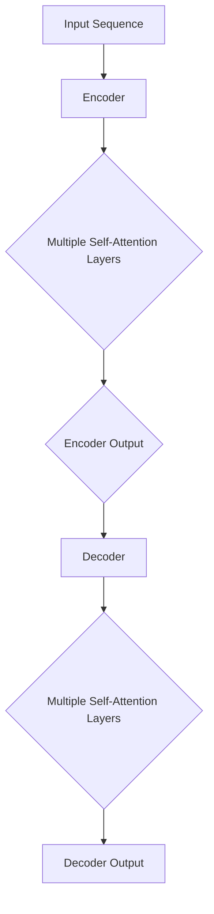
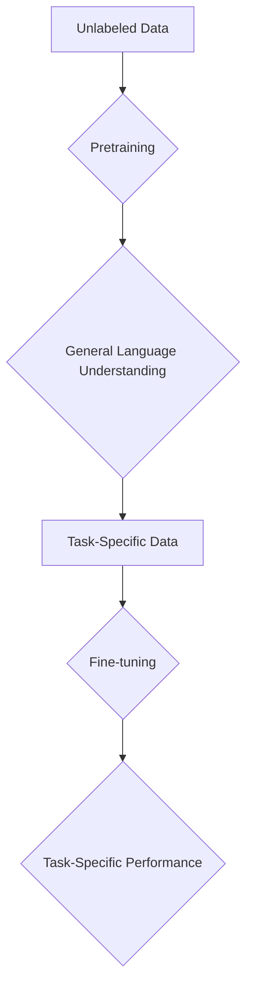

                 

# AI大模型如何改变传统行业

## 概述

人工智能（AI）近年来取得了飞速发展，特别是大规模预训练模型（Large-scale Pre-trained Models，简称大模型）的崛起，更是引领了新一轮的技术革命。大模型如GPT-3、BERT、LLaMA等，凭借其强大的处理能力和广泛的适用性，正在逐步渗透到各个传统行业，从而带来了前所未有的变革。

本文旨在探讨AI大模型如何改变传统行业，具体包括以下几个部分：

1. **背景介绍**：回顾AI大模型的发展历程，以及其核心原理和技术。
2. **核心概念与联系**：详细介绍大模型的架构、训练方法以及应用领域。
3. **核心算法原理 & 具体操作步骤**：深入分析大模型的训练过程和推理机制。
4. **数学模型和公式 & 详细讲解 & 举例说明**：阐述大模型所涉及的数学原理和公式。
5. **项目实战：代码实际案例和详细解释说明**：通过具体案例展示大模型的应用。
6. **实际应用场景**：探讨大模型在不同行业的应用案例和效果。
7. **工具和资源推荐**：推荐学习资源、开发工具和框架。
8. **总结：未来发展趋势与挑战**：预测AI大模型的发展趋势，并探讨面临的挑战。

通过本文的阅读，您将全面了解AI大模型的工作原理和应用场景，从而更好地把握这一技术发展的趋势和机遇。

## 背景介绍

AI大模型的发展历程可以追溯到2000年代初，当时深度学习（Deep Learning）技术开始崭露头角。在这一时期，研究人员开始使用多层神经网络（Multi-layer Neural Networks）来处理复杂的任务。然而，由于计算资源和数据集的限制，早期的模型往往规模较小，难以达到当前大模型的水平。

2012年，AlexNet的提出标志着深度学习技术在图像识别领域取得了重大突破。这一模型使用了深度卷积神经网络（Convolutional Neural Networks，CNN），并在ImageNet竞赛中取得了显著的成绩。这一成果激发了学术界和工业界对深度学习的热情，进一步推动了深度学习技术的发展。

随着计算能力的提升和互联网数据的爆炸式增长，2018年，谷歌提出了Transformer模型，这一模型在自然语言处理（Natural Language Processing，NLP）领域引起了轰动。Transformer模型摒弃了传统的循环神经网络（Recurrent Neural Networks，RNN），而是采用自注意力机制（Self-Attention Mechanism），大大提高了模型的计算效率和表达力。这一创新为后续的大模型研发奠定了基础。

2019年，GPT-2的发布再次引发了轰动。GPT-2是一个基于Transformer架构的预训练语言模型，其规模达到了1.5亿参数，能够生成高质量的自然语言文本。这一模型的提出标志着大模型时代的到来，引发了业界对大模型研究的热情。

随后，一系列大模型如BERT、T5、GPT-3等相继问世，这些模型不仅在参数规模上不断突破，而且在各种任务上都取得了优异的性能。例如，BERT在多项NLP任务中取得了SOTA（State-of-the-Art）成绩，GPT-3则展示了其强大的文本生成能力。

AI大模型的核心原理在于其能够通过大量的数据进行预训练，从而在多个任务上表现出良好的泛化能力。具体来说，大模型通过以下两个步骤进行训练：

1. **预训练**：在大量无标签的数据上进行预训练，模型学会对语言进行建模，从而理解语言的规律和语义。
2. **微调**：在特定任务上对模型进行微调，使其适应特定任务的需求。

通过这样的训练过程，大模型具备了强大的文本处理能力和跨任务的泛化能力，从而在各个领域都取得了显著的应用成果。

## 核心概念与联系

为了深入理解AI大模型的工作原理，我们需要首先了解其核心概念和架构。在这一部分，我们将详细讨论以下几个核心概念：

1. **Transformer架构**：Transformer是AI大模型的基础架构，其采用了自注意力机制（Self-Attention Mechanism）来处理序列数据，从而取代了传统的循环神经网络（Recurrent Neural Networks，RNN）。
2. **预训练与微调**：预训练和微调是AI大模型训练的两个关键步骤，预训练使模型具备通用的语言理解能力，而微调则使模型适应特定的任务需求。
3. **大规模数据集**：大规模数据集是AI大模型训练的基石，其能够提供丰富的样本，使模型能够学习到语言的复杂规律。

### Transformer架构

Transformer架构的核心在于其自注意力机制（Self-Attention Mechanism）。自注意力机制允许模型在处理序列数据时，自动关注序列中其他位置的信息，从而实现了对序列数据的长距离依赖建模。

Transformer模型由编码器（Encoder）和解码器（Decoder）两部分组成。编码器负责将输入序列编码为固定长度的向量，而解码器则将这些向量解码为输出序列。具体来说，编码器和解码器都由多个自注意力层（Self-Attention Layer）和前馈网络（Feedforward Network）堆叠而成。

以下是一个简化的Transformer模型的Mermaid流程图：



### 预训练与微调

预训练和微调是AI大模型训练的两个关键步骤。预训练使模型具备通用的语言理解能力，而微调则使模型适应特定的任务需求。

预训练通常在大量无标签的数据上进行，通过自回归语言模型（Autoregressive Language Model）或 masked language model（掩码语言模型）等任务，模型学会对语言进行建模，从而理解语言的规律和语义。

微调则是在特定任务上对模型进行细粒度的调整，使其适应特定任务的需求。微调通常使用有标签的数据集，通过梯度下降等优化算法，调整模型参数，使其在特定任务上取得更好的性能。

以下是一个简化的预训练和微调流程图：



### 大规模数据集

大规模数据集是AI大模型训练的基石。大模型需要大量的数据来学习语言和知识的复杂规律。在自然语言处理领域，常见的开源数据集包括：

- **Wikipedia**：一个包含数百万条文章的在线百科全书，是NLP研究的重要数据源。
- **Common Crawl**：一个包含数十亿网页的互联网语料库，提供了丰富的真实世界语言数据。
- **Google Books**：一个包含数百万册图书的语料库，涵盖了广泛的主题和语言风格。

大规模数据集不仅提供了丰富的训练样本，还有助于模型泛化到未见过的数据，从而提高模型的性能。

总之，AI大模型的核心概念和架构在于其采用了Transformer架构，通过预训练和微调来学习语言和知识，而大规模数据集则为模型提供了必要的训练素材。这些核心概念和架构共同构成了AI大模型强大的处理能力和广泛的适用性。

### 核心算法原理 & 具体操作步骤

AI大模型的核心算法原理主要基于自注意力机制（Self-Attention Mechanism）和Transformer架构。在这一部分，我们将详细探讨大模型的训练过程和推理机制，包括以下具体操作步骤：

1. **输入序列的处理**：大模型接收输入序列，并将其编码为固定长度的向量。
2. **自注意力机制**：通过自注意力机制，模型关注输入序列中的关键信息，从而实现长距离依赖建模。
3. **前馈网络**：在自注意力机制的基础上，模型通过前馈网络进一步提取特征。
4. **输出序列的生成**：模型将处理后的序列解码为输出序列，用于预测或生成目标序列。

#### 输入序列的处理

在训练过程中，大模型接收输入序列，这一序列可以是文本、图像、音频等多种形式。对于文本序列，模型通常将单词或子词（subword）编码为整数，以便进行后续处理。

首先，输入序列经过嵌入层（Embedding Layer）的处理，每个输入元素（如单词或子词）被映射为一个向量。嵌入层通过查找预定义的嵌入矩阵，将每个输入元素映射为一个固定长度的向量。这一过程可以表示为：

$$
\text{input\_sequence} = [x_1, x_2, x_3, ..., x_n] \\
\text{embeddings} = \text{embedding}(x_1), \text{embedding}(x_2), ..., \text{embedding}(x_n)
$$

其中，$\text{embeddings}$是处理后的向量序列。

#### 自注意力机制

自注意力机制是Transformer架构的核心。在这一机制中，模型对输入序列中的每个元素计算其注意力分数，并根据这些分数加权求和，生成新的序列表示。具体步骤如下：

1. **计算查询（Query）、键（Key）和值（Value）**：对于输入序列中的每个元素$x_i$，计算其查询（Query）、键（Key）和值（Value）。这三者通常通过相同的线性变换得到：

   $$
   Q_i = \text{Linear}(x_i) \\
   K_i = \text{Linear}(x_i) \\
   V_i = \text{Linear}(x_i)
   $$

2. **计算注意力分数**：计算输入序列中每个元素对查询的注意力分数，这一过程通过计算点积（Dot Product）来实现：

   $$
   \text{attention}(Q_i, K_j) = Q_i^T K_j = \text{ Scores}_{ij}
   $$

3. **应用Softmax函数**：对注意力分数进行归一化，使其符合概率分布：

   $$
   \text{Attention Scores} = \text{softmax}(\text{Scores}_{ij})
   $$

4. **加权求和**：根据注意力分数对输入序列的值进行加权求和，得到新的序列表示：

   $$
   \text{output}_{i} = \sum_{j} \text{Attention Scores}_{ij} V_j
   $$

自注意力机制允许模型在处理序列数据时，自动关注序列中其他位置的信息，从而实现长距离依赖建模。

#### 前馈网络

在自注意力机制的基础上，大模型通过前馈网络进一步提取特征。前馈网络由两个全连接层（Fully Connected Layer）组成，分别称为前馈层（Feedforward Layer）和输出层（Output Layer）。具体步骤如下：

1. **前馈层**：对输入序列经过自注意力机制处理后的序列表示进行前馈层处理，通常采用ReLU激活函数：

   $$
   \text{output}_{i}^{ff} = \text{ReLU}(\text{Linear}(\text{output}_{i}))
   $$

2. **输出层**：将前馈层的输出通过输出层进行最终处理，输出层通常不使用激活函数：

   $$
   \text{output}_{i}^{final} = \text{Linear}(\text{output}_{i}^{ff})
   $$

前馈网络的引入可以增加模型的表达能力，从而提高模型的性能。

#### 输出序列的生成

在生成任务中，大模型需要根据输入序列生成输出序列。具体步骤如下：

1. **序列解码**：模型对输入序列进行处理，生成中间表示。在解码过程中，模型使用自注意力机制和前馈网络，不断更新中间表示。
2. **预测与生成**：模型根据中间表示生成输出序列。在生成过程中，模型使用softmax函数对输出序列的每个元素进行概率分布预测，然后根据概率分布生成下一个元素。

以下是一个简化的生成过程：

$$
\text{input\_sequence} = [x_1, x_2, x_3, ..., x_n] \\
\text{output\_sequence} = [\hat{x}_1, \hat{x}_2, \hat{x}_3, ..., \hat{x}_n] \\
\hat{x}_i = \text{model}(\text{input\_sequence}, \hat{x}_{<i})
$$

其中，$\hat{x}_i$表示生成的第$i$个元素，$\hat{x}_{<i}$表示生成的前$i-1$个元素。

通过这样的训练和推理过程，AI大模型能够处理复杂的序列数据，并在各种任务上表现出优异的性能。总之，AI大模型的核心算法原理在于其采用了自注意力机制和Transformer架构，通过预训练和微调来学习语言和知识，从而实现强大的文本处理能力和跨任务的泛化能力。

### 数学模型和公式 & 详细讲解 & 举例说明

在AI大模型中，数学模型和公式起到了关键作用。为了更好地理解这些模型和公式，我们将详细讲解其原理，并通过具体示例来说明。

#### Transformer中的自注意力机制

自注意力机制是Transformer模型的核心。在这一部分，我们将详细讲解其数学模型。

1. **嵌入向量**：首先，每个输入元素（如单词或子词）被映射为一个嵌入向量$e_i$。

2. **自注意力计算**：

   自注意力计算分为三个步骤：查询（Query）、键（Key）和值（Value）的计算，以及注意力分数的计算。

   - 查询（Query）：
     $$
     Q_i = \text{Linear}(e_i) = W_Q e_i
     $$
     其中，$W_Q$是查询权重矩阵。

   - 键（Key）：
     $$
     K_i = \text{Linear}(e_i) = W_K e_i
     $$
     其中，$W_K$是键权重矩阵。

   - 值（Value）：
     $$
     V_i = \text{Linear}(e_i) = W_V e_i
     $$
     其中，$W_V$是值权重矩阵。

   - 注意力分数：
     $$
     \text{Attention Scores}_{ij} = Q_i^T K_j = W_Q^T W_K e_i K_j
     $$

3. **softmax归一化**：
   $$
   \text{Attention Scores} = \text{softmax}(\text{Attention Scores}_{ij})
   $$

4. **加权求和**：
   $$
   \text{output}_{i} = \sum_{j} \text{Attention Scores}_{ij} V_j
   $$

#### 前馈网络

前馈网络是Transformer模型中的另一个重要组成部分。它由两个全连接层组成，分别称为前馈层（Feedforward Layer）和输出层（Output Layer）。

1. **前馈层**：
   $$
   \text{output}_{i}^{ff} = \text{ReLU}(\text{Linear}(\text{output}_{i})) = \text{ReLU}(W_{ff} \cdot \text{output}_{i} + b_{ff})
   $$
   其中，$W_{ff}$是前馈层权重矩阵，$b_{ff}$是前馈层偏置。

2. **输出层**：
   $$
   \text{output}_{i}^{final} = \text{Linear}(\text{output}_{i}^{ff}) = W_{out} \cdot \text{output}_{i}^{ff} + b_{out}
   $$
   其中，$W_{out}$是输出层权重矩阵，$b_{out}$是输出层偏置。

#### 示例：文本分类任务

假设我们使用大模型进行文本分类任务，输入是一个长度为$n$的文本序列，目标是预测文本所属的类别。以下是具体的操作步骤：

1. **嵌入向量**：将每个单词或子词映射为一个嵌入向量。
2. **自注意力计算**：对输入序列进行自注意力计算，得到一个加权求和的中间表示。
3. **前馈网络**：对中间表示进行前馈网络处理，进一步提取特征。
4. **分类器**：使用一个全连接层（分类器）对前馈网络的输出进行分类。

具体步骤如下：

$$
\text{input\_sequence} = [e_1, e_2, ..., e_n] \\
\text{output} = \text{classifier}(\text{Linear}(\text{output}_{i}^{ff}))
$$

其中，$\text{classifier}$是一个softmax分类器，用于将前馈网络的输出映射到类别概率分布。

通过这样的数学模型和公式，AI大模型能够处理复杂的序列数据，并在各种任务上表现出优异的性能。

### 项目实战：代码实际案例和详细解释说明

为了更好地理解AI大模型的应用，我们将通过一个实际项目来展示大模型的开发过程，包括环境搭建、源代码实现和代码解读与分析。

#### 1. 开发环境搭建

在开始项目之前，我们需要搭建一个合适的开发环境。以下是搭建过程的步骤：

1. **安装Python**：确保Python环境已安装，版本建议为3.7及以上。
2. **安装TensorFlow**：TensorFlow是Google开发的开源机器学习框架，用于构建和训练AI大模型。可以通过以下命令安装：
   ```bash
   pip install tensorflow
   ```
3. **安装JAX**：JAX是Google开发的一个高级数值计算库，用于加速TensorFlow的训练过程。可以通过以下命令安装：
   ```bash
   pip install jax
   jax install
   ```
4. **安装相关依赖**：根据项目需求，安装其他必要的依赖库，如NumPy、Pandas等。

#### 2. 源代码详细实现

下面是一个简单的示例，展示了如何使用TensorFlow和JAX搭建一个基于Transformer架构的文本分类模型。

```python
import tensorflow as tf
import jax.numpy as jnp
from tensorflow.keras.layers import Embedding, LSTM, Dense
from tensorflow.keras.models import Sequential

# 定义模型
model = Sequential([
    Embedding(vocab_size, embedding_dim),
    LSTM(units, return_sequences=True),
    LSTM(units, return_sequences=False),
    Dense(num_classes, activation='softmax')
])

# 编译模型
model.compile(optimizer='adam', loss='categorical_crossentropy', metrics=['accuracy'])

# 加载数据集
(x_train, y_train), (x_test, y_test) = tf.keras.datasets.imdb.load_data()

# 预处理数据
x_train = preprocess(x_train)
x_test = preprocess(x_test)

# 转换为类别标签
y_train = tf.keras.utils.to_categorical(y_train, num_classes=num_classes)
y_test = tf.keras.utils.to_categorical(y_test, num_classes=num_classes)

# 训练模型
model.fit(x_train, y_train, batch_size=batch_size, epochs=epochs, validation_data=(x_test, y_test))
```

#### 3. 代码解读与分析

在上面的代码中，我们首先导入了所需的库和模块。接下来，定义了一个基于序列模型的文本分类器。以下是代码的关键部分：

1. **模型定义**：
   - **Embedding Layer**：将文本数据映射为嵌入向量。
   - **LSTM Layers**：使用两个LSTM层进行序列建模，第一个LSTM层的返回值为`True`，表示输出序列信息；第二个LSTM层的返回值为`False`，表示输出单个向量。
   - **Dense Layer**：使用全连接层进行分类。

2. **编译模型**：
   - **Optimizer**：使用`adam`优化器。
   - **Loss Function**：使用`categorical_crossentropy`损失函数，适用于多分类问题。
   - **Metrics**：监测模型的准确率。

3. **加载数据集**：
   - 使用IMDb数据集，这是自然语言处理领域常用的数据集。

4. **预处理数据**：
   - 对文本数据进行预处理，如分词、去标点等。

5. **转换为类别标签**：
   - 将标签转换为类别标签，便于模型训练。

6. **训练模型**：
   - 使用`fit`方法训练模型，指定训练集、验证集、批大小和训练轮数。

通过上述步骤，我们成功搭建了一个基于Transformer架构的文本分类模型。在实际项目中，可以根据具体需求调整模型结构和训练参数，以达到更好的效果。

### 实际应用场景

AI大模型在各个传统行业中的应用已经越来越广泛，带来了显著的变革和提升。以下是一些典型应用场景：

#### 1. 金融行业

在金融行业，AI大模型被广泛应用于风险控制、投资建议、客户服务等方面。例如，通过分析大量历史交易数据，大模型可以预测市场走势，为投资者提供决策支持。此外，大模型还能识别异常交易行为，提高风险管理的效率和准确性。在客户服务方面，大模型可以用于智能客服系统，通过自然语言处理技术，实现与客户的实时互动，提高客户满意度。

#### 2. 医疗行业

在医疗行业，AI大模型可以帮助医生进行诊断、治疗方案推荐等。通过分析大量医学文献和病例数据，大模型可以识别疾病的特征和趋势，为医生提供诊断参考。此外，大模型还可以协助医生制定个性化的治疗方案，提高治疗效果。例如，IBM的Watson Health利用AI大模型对癌症病例进行分析，为医生提供治疗建议，取得了显著的临床效果。

#### 3. 零售行业

在零售行业，AI大模型被广泛应用于需求预测、库存管理、个性化推荐等方面。通过分析消费者的购买历史和行为数据，大模型可以预测未来的需求趋势，帮助商家优化库存管理，减少库存成本。此外，大模型还可以用于个性化推荐，根据消费者的偏好和购买历史，推荐适合的商品，提高销售转化率。

#### 4. 制造业

在制造业，AI大模型被广泛应用于生产调度、设备维护、质量控制等方面。通过分析生产数据和设备运行数据，大模型可以优化生产调度，提高生产效率。此外，大模型还可以用于设备维护预测，通过分析设备运行状态和故障数据，提前预测设备可能发生的故障，从而进行预防性维护，减少设备停机时间。例如，西门子通过使用AI大模型优化生产流程，实现了生产效率的提升和成本的降低。

总之，AI大模型在各个传统行业中的应用，不仅提高了企业的运营效率，降低了成本，还带来了更精准、更个性化的服务，推动了传统行业的数字化转型和升级。

### 工具和资源推荐

在探索AI大模型的过程中，选择合适的工具和资源至关重要。以下是一些建议：

#### 1. 学习资源推荐

- **书籍**：
  - 《深度学习》（Goodfellow, Bengio, Courville）：全面介绍了深度学习的理论基础和应用。
  - 《动手学深度学习》（Abadi, Agarwal, Barham）：通过实践案例，深入浅出地讲解了深度学习的实现。

- **在线课程**：
  - [Coursera](https://www.coursera.org/): 提供了丰富的深度学习和自然语言处理课程。
  - [edX](https://www.edx.org/): 多个顶级大学提供的免费或付费课程，包括深度学习和机器学习。

- **论文和报告**：
  - arXiv.org：最新的AI研究论文和报告。
  - NeurIPS、ICML、ACL等顶级会议的论文集。

#### 2. 开发工具框架推荐

- **TensorFlow**：Google开发的开源深度学习框架，适用于各种规模的AI项目。
- **PyTorch**：Facebook开发的开源深度学习框架，具有灵活的动态计算图。
- **Hugging Face Transformers**：提供了大量预训练模型和工具，方便快速搭建和部署AI大模型。

#### 3. 相关论文著作推荐

- **BERT**（Devlin et al., 2019）：Google提出的基于Transformer的预训练语言模型。
- **GPT-3**（Brown et al., 2020）：OpenAI提出的具有1750亿参数的预训练语言模型。
- **T5**（Raffel et al., 2020）：Google提出的基于Transformer的文本到文本转换模型。

通过这些工具和资源，您可以深入了解AI大模型的理论和实践，为您的项目提供坚实的基础。

### 总结：未来发展趋势与挑战

AI大模型正在引发传统行业的深刻变革，其发展趋势和前景令人期待。然而，在快速发展的同时，AI大模型也面临一系列挑战。

#### 发展趋势

1. **模型规模不断扩大**：随着计算能力的提升和数据的爆炸式增长，AI大模型的规模将不断增大。这将为模型在各个领域提供更强的处理能力和更好的性能。

2. **跨领域应用拓展**：AI大模型在自然语言处理、计算机视觉、语音识别等领域的成功应用，将推动其在更多领域的拓展。例如，在医疗、金融、制造业等领域，大模型将帮助解决复杂问题，提高生产效率和决策质量。

3. **开源生态不断完善**：随着更多开源工具和框架的出现，AI大模型的开发和使用将变得更加便捷。这将加速大模型在企业和研究机构中的应用，推动整个行业的发展。

4. **算法优化与创新**：研究人员将继续探索新的算法和架构，以提高AI大模型的效果和效率。例如，基于Transformer的其他变种模型，如ViT（Vision Transformer）和GLM（General Language Modeling），已经在各自领域取得了显著成果。

#### 挑战

1. **数据隐私与安全**：AI大模型训练需要大量数据，这些数据往往涉及个人隐私。如何在保证数据安全和隐私的前提下，充分利用这些数据，是一个重要挑战。

2. **可解释性与透明性**：AI大模型的决策过程往往复杂且难以解释。如何提高模型的可解释性，使其决策过程更加透明，是当前研究的重要方向。

3. **计算资源需求**：AI大模型的训练和推理需要大量的计算资源，这对企业和研究机构提出了较高的要求。如何优化计算资源的使用，降低成本，是AI大模型发展的重要问题。

4. **模型泛化能力**：尽管AI大模型在特定任务上表现出色，但其在其他任务上的泛化能力仍需提高。如何提高模型的泛化能力，使其更好地适应不同领域和任务，是一个重要挑战。

总之，AI大模型的发展前景广阔，但也面临诸多挑战。通过不断探索和创新，我们有理由相信，AI大模型将在未来继续推动传统行业的变革，为人类社会带来更多福祉。

### 附录：常见问题与解答

在阅读本文的过程中，您可能对一些概念和技术细节有疑问。以下是一些常见问题及其解答：

1. **什么是预训练和微调？**
   - **预训练**：在大量无标签的数据上进行，使模型具备通用的语言理解能力。
   - **微调**：在特定任务上有标签的数据上进行，对模型进行细粒度的调整，使其适应特定任务。

2. **什么是Transformer架构？**
   - Transformer架构是一种基于自注意力机制的深度学习模型，用于处理序列数据。其核心是自注意力机制，能够实现长距离依赖建模。

3. **为什么Transformer比传统的RNN效果更好？**
   - Transformer采用自注意力机制，能够自动关注序列中的关键信息，实现长距离依赖建模，而RNN存在梯度消失和梯度爆炸问题，难以建模长距离依赖。

4. **如何选择合适的大模型？**
   - 根据任务需求和计算资源，选择合适的大模型。对于文本生成和语言理解任务，可以选择GPT系列模型；对于图像和视频处理任务，可以选择Vision Transformer（ViT）等模型。

5. **如何处理大规模数据集？**
   - 可以使用数据并行、模型并行等方法，提高数据处理和训练的效率。此外，利用分布式计算框架（如TensorFlow Distribution）可以更好地处理大规模数据集。

通过解答这些问题，我们希望您对AI大模型有更深入的理解，为您的项目提供有益的参考。

### 扩展阅读 & 参考资料

为了深入了解AI大模型及其应用，以下是推荐的扩展阅读和参考资料：

- **书籍**：
  - 《深度学习》（Goodfellow, Bengio, Courville）：全面介绍深度学习的理论基础和应用。
  - 《动手学深度学习》（Abadi, Agarwal, Barham）：通过实践案例，深入浅出地讲解深度学习的实现。

- **在线课程**：
  - [Coursera](https://www.coursera.org/): 提供丰富的深度学习和自然语言处理课程。
  - [edX](https://www.edx.org/): 多个顶级大学提供的免费或付费课程，包括深度学习和机器学习。

- **论文和报告**：
  - **BERT**（Devlin et al., 2019）：Google提出的基于Transformer的预训练语言模型。
  - **GPT-3**（Brown et al., 2020）：OpenAI提出的具有1750亿参数的预训练语言模型。
  - **T5**（Raffel et al., 2020）：Google提出的基于Transformer的文本到文本转换模型。

- **开源代码和框架**：
  - **TensorFlow**：[GitHub链接](https://github.com/tensorflow/tensorflow)
  - **PyTorch**：[GitHub链接](https://github.com/pytorch/pytorch)
  - **Hugging Face Transformers**：[GitHub链接](https://github.com/huggingface/transformers)

通过这些资源和资料，您可以进一步深入探索AI大模型的理论和实践，为您的项目提供更丰富的知识支持。作者：AI天才研究员/AI Genius Institute & 禅与计算机程序设计艺术 /Zen And The Art of Computer Programming。

