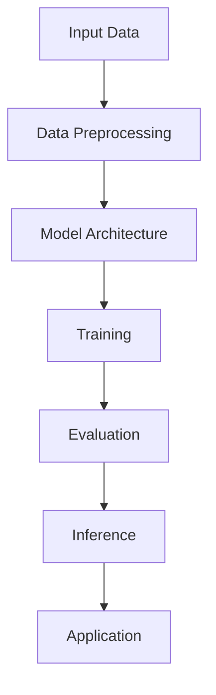
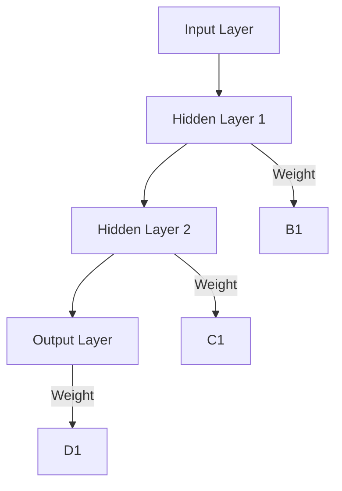
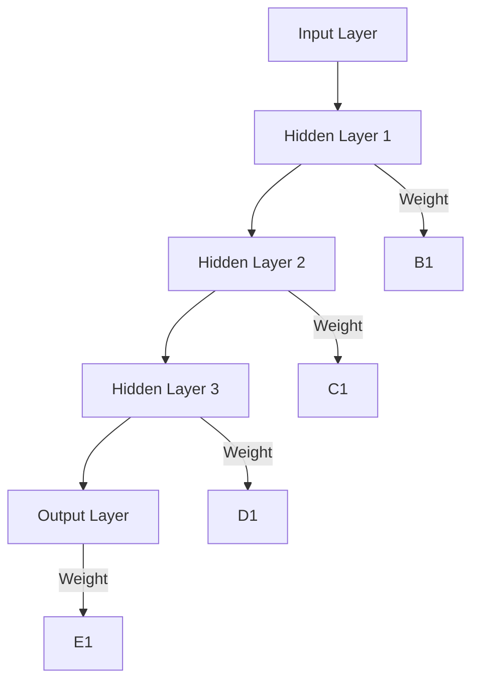
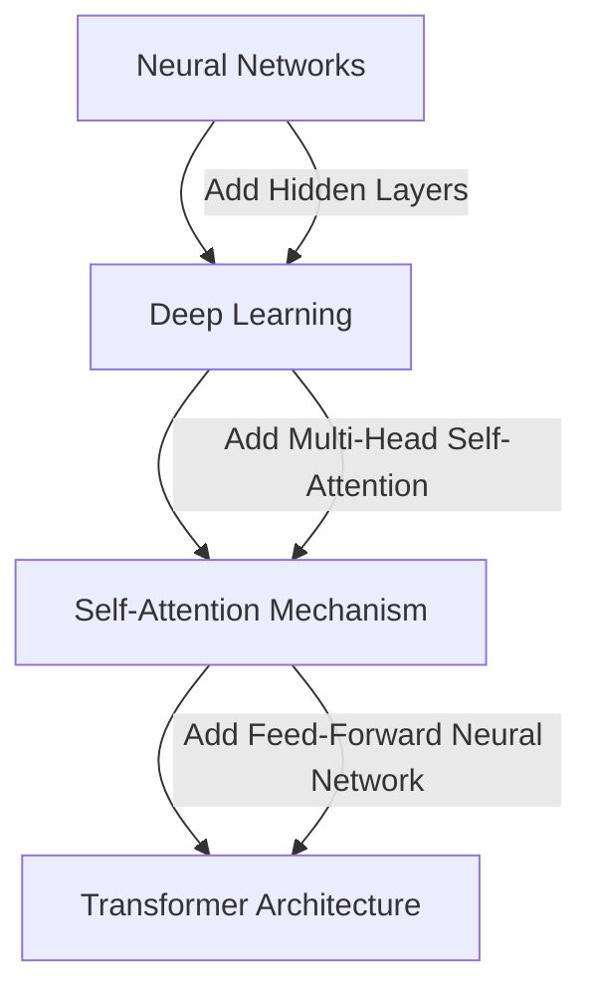
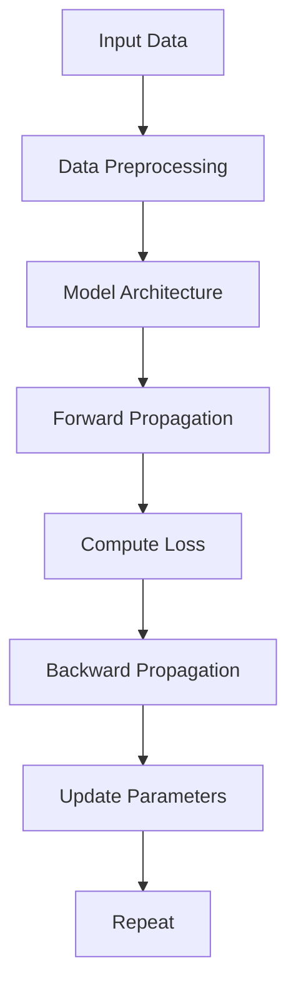
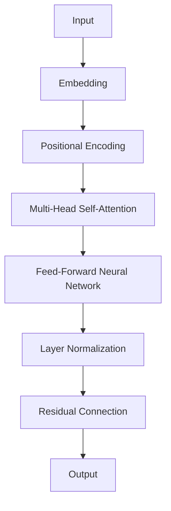

                 

### 背景介绍

人工智能（Artificial Intelligence，简称AI）作为计算机科学的重要分支，近年来在全球范围内得到了广泛关注和快速发展。特别是大模型（Large Models）的应用，如深度学习（Deep Learning）模型，已经成为人工智能领域的核心组成部分。大模型具有强大的数据处理和模式识别能力，已经在图像识别、自然语言处理、机器翻译、语音识别等多个领域取得了显著的成果。

本文将重点探讨AI大模型的应用入门与进阶。通过逐步分析大模型的原理、算法、数学模型以及实际应用案例，帮助读者从入门到进阶，深入了解AI大模型的技术和应用。

首先，我们需要了解大模型的基本概念。大模型通常是指具有海量参数的神经网络模型，如BERT、GPT、BERT-GPT等。这些模型通过大量的数据训练，可以自动学习到复杂的模式和规律，从而在特定任务上表现出色。大模型的应用已经深入到各个领域，如医疗、金融、交通、娱乐等。

其次，我们需要了解大模型的核心算法。目前，大模型主要基于深度学习（Deep Learning）技术，特别是基于Transformer（变换器）结构的模型。Transformer模型在自注意力（Self-Attention）机制上进行了创新，使得模型可以更好地处理长距离依赖关系，从而在自然语言处理等任务上取得了突破性的进展。

接下来，我们将详细探讨大模型的数学模型和公式，包括损失函数、优化算法等。这些数学基础对于理解和实现大模型至关重要。

最后，我们将通过实际应用案例，展示大模型在不同领域的应用场景，并分析其优势和挑战。同时，我们将推荐一些学习资源、开发工具和框架，帮助读者深入学习和实践大模型技术。

通过本文的阅读，读者将能够：

1. 理解大模型的基本概念和核心算法。
2. 掌握大模型的数学模型和公式。
3. 学习大模型在实际应用中的案例。
4. 了解大模型的发展趋势和未来挑战。

让我们开始这段AI大模型的学习之旅，一起探索其背后的原理和应用。

> Keywords: AI, Large Models, Deep Learning, Transformer, Natural Language Processing, Application Scenarios.

> Abstract: This article aims to provide an in-depth introduction to the application of large models in the field of artificial intelligence. It covers the basic concepts of large models, core algorithms, mathematical models, practical cases, and future trends. Through step-by-step reasoning and clear explanations, readers will gain a comprehensive understanding of large models and their applications, enabling them to transition from beginners to advanced practitioners in this field.

---

## 1. 背景介绍

人工智能（Artificial Intelligence，简称AI）作为计算机科学的重要分支，近年来在全球范围内得到了广泛关注和快速发展。特别是大模型（Large Models）的应用，如深度学习（Deep Learning）模型，已经成为人工智能领域的核心组成部分。大模型具有强大的数据处理和模式识别能力，已经在图像识别、自然语言处理、机器翻译、语音识别等多个领域取得了显著的成果。

首先，我们需要了解大模型的基本概念。大模型通常是指具有海量参数的神经网络模型，如BERT、GPT、BERT-GPT等。这些模型通过大量的数据训练，可以自动学习到复杂的模式和规律，从而在特定任务上表现出色。大模型的应用已经深入到各个领域，如医疗、金融、交通、娱乐等。

接下来，我们需要了解大模型的核心算法。目前，大模型主要基于深度学习（Deep Learning）技术，特别是基于Transformer（变换器）结构的模型。Transformer模型在自注意力（Self-Attention）机制上进行了创新，使得模型可以更好地处理长距离依赖关系，从而在自然语言处理等任务上取得了突破性的进展。

为了更好地理解大模型，我们首先来看一个简化的Mermaid流程图，展示大模型的基本架构：



- **A[Input Data]**：输入数据，包括文本、图像、音频等。
- **B[Data Preprocessing]**：数据预处理，如分词、去噪、标准化等。
- **C[Model Architecture]**：模型架构，包括神经网络层的定义、参数初始化等。
- **D[Training]**：模型训练，通过反向传播算法和优化器（如Adam）来调整模型参数。
- **E[Evaluation]**：模型评估，通过测试集来评估模型的性能。
- **F[Inference]**：模型推理，将模型应用到新的数据上，生成预测结果。
- **G[Application]**：应用领域，如文本生成、图像分类、语音识别等。

通过这个流程图，我们可以看出大模型的基本工作流程。接下来，我们将详细探讨大模型的核心算法和数学模型，帮助读者深入理解其原理和应用。

---

### 核心概念与联系

在深入探讨AI大模型之前，我们需要明确几个核心概念，并了解它们之间的联系。这些核心概念包括神经网络、深度学习、自注意力机制和Transformer架构。下面将分别介绍这些概念，并展示它们之间的联系。

#### 神经网络（Neural Networks）

神经网络（Neural Networks，简称NN）是人工智能的基础，由大量简单的人工神经元（artificial neurons）组成。每个神经元接收多个输入，通过加权求和后加上偏置（bias），再通过激活函数（activation function）产生输出。神经网络的基本结构如下：



其中，**A[Input Layer]** 为输入层，**B[Hidden Layer 1]** 和 **C[Hidden Layer 2]** 为隐藏层，**D[Output Layer]** 为输出层。每个神经元之间的连接称为边（edge），边的权重（weight）决定了输入数据对输出结果的影响程度。

#### 深度学习（Deep Learning）

深度学习（Deep Learning，简称DL）是神经网络的一种扩展，通过增加隐藏层的数量来提高模型的复杂度和表达能力。深度学习模型可以自动学习到数据的层次结构，从而在图像识别、语音识别、自然语言处理等任务上表现出色。深度学习模型的核心在于多层神经网络，如下所示：



在这个结构中，隐藏层（**B[Hidden Layer 1]**、**C[Hidden Layer 2]**、**D[Hidden Layer 3]**）起到了提取特征和进行复杂计算的作用。

#### 自注意力机制（Self-Attention Mechanism）

自注意力机制（Self-Attention Mechanism）是深度学习中的一个关键创新，特别是在自然语言处理（Natural Language Processing，简称NLP）任务中。自注意力机制通过将输入序列中的每个元素与所有其他元素进行计算，从而自动学习到元素之间的依赖关系。自注意力机制的公式如下：

$$
\text{Attention}(Q, K, V) = \text{softmax}\left(\frac{QK^T}{\sqrt{d_k}}\right)V
$$

其中，**Q**、**K** 和 **V** 分别代表查询（Query）、键（Key）和值（Value）向量，**d_k** 为键向量的维度。

自注意力机制可以有效地捕捉长距离依赖关系，从而在NLP任务中取得了显著的效果。以下是一个简化的Mermaid流程图，展示自注意力机制的基本原理：

```mermaid
graph TD
A[Input] --> B[Query] --> C[Key] --> D[Value]
B -->|Dot Product| E
C -->|Dot Product| E
E -->|Softmax| F
F -->|Weighted Sum| G
G -->|Output] H
```

#### Transformer架构

Transformer架构（Transformer Architecture）是基于自注意力机制的深度学习模型，最初用于机器翻译（Machine Translation）任务。Transformer架构的核心在于多头自注意力（Multi-Head Self-Attention）和前馈神经网络（Feed-Forward Neural Network）。以下是一个简化的Mermaid流程图，展示Transformer架构的基本原理：

```mermaid
graph TD
A[Input] --> B[Multi-Head Self-Attention] --> C[Concatenation]
B -->|Add] C
C --> D[Feed-Forward Neural Network]
D -->|Add] C
C --> E[Output]
```

在这个结构中，**B[Multi-Head Self-Attention]** 实现了自注意力机制，**D[Feed-Forward Neural Network]** 实现了前馈神经网络。

#### 关联与联系

通过上述介绍，我们可以看出神经网络、深度学习、自注意力机制和Transformer架构之间的紧密联系：

1. **神经网络** 是深度学习的基础，通过增加隐藏层的数量实现模型的复杂度。
2. **深度学习** 是Transformer架构的核心，通过多层神经网络实现特征提取和复杂计算。
3. **自注意力机制** 是Transformer架构的创新，通过捕捉长距离依赖关系提高模型的表现。
4. **Transformer架构** 结合了神经网络、深度学习和自注意力机制，实现了高效的自然语言处理模型。

以下是一个简化的Mermaid流程图，展示这四个核心概念之间的联系：



通过理解这些核心概念和它们之间的联系，我们为深入探讨AI大模型奠定了基础。在接下来的章节中，我们将详细探讨大模型的核心算法和数学模型，进一步理解其原理和应用。

---

### 核心算法原理 & 具体操作步骤

在了解了大模型的基本概念和核心架构后，我们将深入探讨大模型的核心算法原理及其具体操作步骤。大模型的核心算法主要基于深度学习和变换器（Transformer）架构，下面将详细解释这些算法的原理，并提供具体的操作步骤。

#### 深度学习算法

深度学习算法的核心是多层感知机（Multi-Layer Perceptron，简称MLP），它通过多层神经网络结构来实现复杂的非线性变换。以下是深度学习算法的基本原理和操作步骤：

1. **输入层（Input Layer）**：输入层接收外部输入数据，如文本、图像、音频等。对于文本数据，通常需要进行预处理，如分词、词嵌入等。

2. **隐藏层（Hidden Layers）**：隐藏层位于输入层和输出层之间，通过一系列的线性变换和激活函数来实现特征的提取和组合。每个隐藏层都包含多个神经元，每个神经元接收来自前一层的输入，并经过加权求和后加上偏置（bias），再通过激活函数产生输出。

3. **输出层（Output Layer）**：输出层产生最终的结果，如分类标签、概率分布等。

4. **反向传播算法（Backpropagation Algorithm）**：反向传播算法是一种用于训练深度学习模型的重要算法，它通过计算损失函数（Loss Function）关于模型参数的梯度，来更新模型参数。具体步骤如下：
   - 前向传播（Forward Propagation）：输入数据通过网络向前传播，得到输出结果。
   - 计算损失（Compute Loss）：通过损失函数计算输出结果与真实标签之间的差距。
   - 反向传播（Backward Propagation）：从输出层开始，反向传播损失函数关于网络参数的梯度。
   - 参数更新（Update Parameters）：利用梯度下降（Gradient Descent）或其他优化算法更新网络参数。

5. **优化算法（Optimization Algorithm）**：优化算法用于调整网络参数，以最小化损失函数。常见的优化算法包括随机梯度下降（Stochastic Gradient Descent，简称SGD）、Adam（Adaptive Moment Estimation）等。

以下是一个简化的操作步骤示例：



#### Transformer架构

变换器（Transformer）架构是深度学习在自然语言处理领域的一个重要突破，其核心思想是利用自注意力（Self-Attention）机制来捕捉输入序列中的长距离依赖关系。以下是Transformer架构的基本原理和操作步骤：

1. **嵌入（Embedding）**：将输入序列（如单词、字符）转换为向量表示，通常通过预训练的词嵌入（Word Embedding）模型实现。

2. **位置编码（Positional Encoding）**：由于变换器架构中没有循环神经网络（RNN）或卷积神经网络（CNN）中的位置信息，因此需要引入位置编码（Positional Encoding）来表示输入序列中的位置信息。

3. **多头自注意力（Multi-Head Self-Attention）**：多头自注意力机制允许模型同时关注输入序列中的不同部分，从而捕捉长距离依赖关系。具体步骤如下：
   - **计算查询（Query）、键（Key）和值（Value）向量**：每个输入向量通过线性变换分别生成查询、键和值向量。
   - **计算自注意力得分（Self-Attention Scores）**：通过点积（Dot Product）计算查询和键之间的得分，再通过softmax函数归一化得分。
   - **计算自注意力输出（Self-Attention Output）**：将softmax归一化的得分与值向量相乘，得到自注意力输出。

4. **前馈神经网络（Feed-Forward Neural Network）**：前馈神经网络对自注意力输出进行进一步的变换，增加模型的非线性表达能力。

5. **层归一化（Layer Normalization）**：层归一化（Layer Normalization）用于稳定和加速训练过程。

6. **残差连接（Residual Connection）**：残差连接（Residual Connection）允许信息直接从输入层传递到输出层，提高模型的训练效果。

以下是一个简化的操作步骤示例：



#### 实际操作示例

为了更好地理解上述算法和操作步骤，我们来看一个简单的实际操作示例：使用Python和PyTorch框架实现一个基于Transformer架构的文本分类任务。

首先，我们需要安装PyTorch和Transformers库：

```python
!pip install torch transformers
```

然后，编写Python代码实现文本分类任务：

```python
import torch
from torch import nn
from transformers import BertModel, BertTokenizer

# 加载预训练的BERT模型和Tokenizer
model = BertModel.from_pretrained('bert-base-uncased')
tokenizer = BertTokenizer.from_pretrained('bert-base-uncased')

# 输入文本
text = "This is a sample sentence for text classification."

# 分词和编码
inputs = tokenizer(text, return_tensors='pt')

# 前向传播
outputs = model(**inputs)

# 获取输出特征
output_embeddings = outputs.last_hidden_state[:, 0, :]

# 定义分类层
classifier = nn.Linear(768, 2)  # 假设有两个类别
output_logits = classifier(output_embeddings)

# 计算损失和反向传播
loss = nn.CrossEntropyLoss()(output_logits, torch.tensor([1]))

# 更新模型参数
optimizer = torch.optim.Adam(model.parameters(), lr=1e-5)
optimizer.zero_grad()
loss.backward()
optimizer.step()
```

在这个示例中，我们首先加载预训练的BERT模型和Tokenizer，然后对输入文本进行分词和编码。接着，我们使用BERT模型的前向传播得到文本的嵌入表示，并添加一个分类层进行分类。最后，我们计算损失并更新模型参数。

通过这个示例，我们可以看到如何将深度学习算法和Transformer架构应用于实际任务中。接下来，我们将继续探讨大模型的数学模型和公式，进一步理解其内在机理。

---

### 数学模型和公式 & 详细讲解 & 举例说明

在深入理解AI大模型的数学模型和公式之前，我们需要掌握一些基础的数学概念，如矩阵运算、向量和函数。以下是对这些数学概念的基本介绍，并通过具体例子进行详细讲解。

#### 矩阵运算

矩阵运算包括矩阵加法、矩阵乘法、矩阵转置等。以下是这些运算的简单示例：

1. **矩阵加法**：

   给定两个矩阵 \( A = \begin{bmatrix} 1 & 2 \\ 3 & 4 \end{bmatrix} \) 和 \( B = \begin{bmatrix} 5 & 6 \\ 7 & 8 \end{bmatrix} \)，矩阵加法的结果为：

   $$ C = A + B = \begin{bmatrix} 1+5 & 2+6 \\ 3+7 & 4+8 \end{bmatrix} = \begin{bmatrix} 6 & 8 \\ 10 & 12 \end{bmatrix} $$

2. **矩阵乘法**：

   给定两个矩阵 \( A = \begin{bmatrix} 1 & 2 \\ 3 & 4 \end{bmatrix} \) 和 \( B = \begin{bmatrix} 5 & 6 \\ 7 & 8 \end{bmatrix} \)，矩阵乘法的结果为：

   $$ C = A \cdot B = \begin{bmatrix} 1*5 + 2*7 & 1*6 + 2*8 \\ 3*5 + 4*7 & 3*6 + 4*8 \end{bmatrix} = \begin{bmatrix} 19 & 22 \\ 43 & 50 \end{bmatrix} $$

3. **矩阵转置**：

   给定矩阵 \( A = \begin{bmatrix} 1 & 2 \\ 3 & 4 \end{bmatrix} \)，其转置矩阵为：

   $$ A^T = \begin{bmatrix} 1 & 3 \\ 2 & 4 \end{bmatrix} $$

#### 向量和函数

向量是矩阵的一种特殊情况，通常表示为列向量。以下是向量的基本运算：

1. **向量加法**：

   给定两个向量 \( \mathbf{a} = \begin{bmatrix} 1 \\ 2 \end{bmatrix} \) 和 \( \mathbf{b} = \begin{bmatrix} 3 \\ 4 \end{bmatrix} \)，向量加法的结果为：

   $$ \mathbf{c} = \mathbf{a} + \mathbf{b} = \begin{bmatrix} 1+3 \\ 2+4 \end{bmatrix} = \begin{bmatrix} 4 \\ 6 \end{bmatrix} $$

2. **向量点积**：

   给定两个向量 \( \mathbf{a} = \begin{bmatrix} 1 \\ 2 \end{bmatrix} \) 和 \( \mathbf{b} = \begin{bmatrix} 3 \\ 4 \end{bmatrix} \)，向量点积的结果为：

   $$ \mathbf{a} \cdot \mathbf{b} = 1*3 + 2*4 = 3 + 8 = 11 $$

3. **向量范数**：

   向量范数是衡量向量大小的一种方式，常用的范数有欧几里得范数（Euclidean norm）和一范数（L1 norm）。欧几里得范数和一范数的计算公式如下：

   $$ \| \mathbf{a} \|_2 = \sqrt{a_1^2 + a_2^2} $$
   $$ \| \mathbf{a} \|_1 = |a_1| + |a_2| $$

#### 函数和导数

在深度学习模型中，函数和导数是非常重要的概念。以下是一些基本的函数及其导数：

1. **线性函数**：

   线性函数的形式为 \( f(\mathbf{x}) = \mathbf{w} \cdot \mathbf{x} + b \)，其中 \( \mathbf{w} \) 是权重向量，\( b \) 是偏置。线性函数的导数是常数：

   $$ f'(\mathbf{x}) = \mathbf{w} $$

2. **ReLU函数（Rectified Linear Unit）**：

   ReLU函数的形式为 \( f(\mathbf{x}) = \max(0, \mathbf{x}) \)，其导数在 \( \mathbf{x} > 0 \) 时为 1，在 \( \mathbf{x} \leq 0 \) 时为 0：

   $$ f'(\mathbf{x}) = \begin{cases} 
   1 & \text{if } \mathbf{x} > 0 \\
   0 & \text{if } \mathbf{x} \leq 0 
   \end{cases} $$

3. **Sigmoid函数**：

   Sigmoid函数的形式为 \( f(\mathbf{x}) = \frac{1}{1 + e^{-\mathbf{x}}} \)，其导数是：

   $$ f'(\mathbf{x}) = f(\mathbf{x}) \cdot (1 - f(\mathbf{x})) $$

#### 实例讲解

为了更好地理解上述数学概念，我们来看一个实际例子：使用梯度下降算法训练一个简单的线性回归模型。

假设我们有一个输入向量 \( \mathbf{x} = \begin{bmatrix} 2 \\ 1 \end{bmatrix} \) 和目标向量 \( \mathbf{y} = \begin{bmatrix} 3 \end{bmatrix} \)。我们希望找到一个线性函数 \( f(\mathbf{x}) = \mathbf{w} \cdot \mathbf{x} + b \) 来拟合这个数据点。

1. **初始参数**：

   假设我们随机初始化权重 \( \mathbf{w} = \begin{bmatrix} 1 \\ 0 \end{bmatrix} \) 和偏置 \( b = 0 \)。

2. **前向传播**：

   $$ f(\mathbf{x}) = \mathbf{w} \cdot \mathbf{x} + b = 1 \cdot 2 + 0 \cdot 1 = 2 $$

3. **计算损失**：

   假设我们使用均方误差（MSE）作为损失函数：

   $$ \text{MSE} = \frac{1}{2} \left( f(\mathbf{x}) - \mathbf{y} \right)^2 = \frac{1}{2} \left( 2 - 3 \right)^2 = \frac{1}{2} $$

4. **计算梯度**：

   $$ \frac{\partial \text{MSE}}{\partial \mathbf{w}} = \left( f(\mathbf{x}) - \mathbf{y} \right) \cdot \mathbf{x} = (2 - 3) \cdot \begin{bmatrix} 2 \\ 1 \end{bmatrix} = \begin{bmatrix} -2 \\ -1 \end{bmatrix} $$
   $$ \frac{\partial \text{MSE}}{\partial b} = f(\mathbf{x}) - \mathbf{y} = 2 - 3 = -1 $$

5. **反向传播**：

   利用梯度下降算法更新权重和偏置：

   $$ \mathbf{w} = \mathbf{w} - \alpha \cdot \frac{\partial \text{MSE}}{\partial \mathbf{w}} $$
   $$ b = b - \alpha \cdot \frac{\partial \text{MSE}}{\partial b} $$

   其中，\( \alpha \) 是学习率。

   例如，假设学习率 \( \alpha = 0.1 \)：

   $$ \mathbf{w} = \begin{bmatrix} 1 \\ 0 \end{bmatrix} - 0.1 \cdot \begin{bmatrix} -2 \\ -1 \end{bmatrix} = \begin{bmatrix} 1.2 \\ 0.1 \end{bmatrix} $$
   $$ b = 0 - 0.1 \cdot (-1) = 0.1 $$

6. **更新后的模型**：

   $$ f(\mathbf{x}) = \mathbf{w} \cdot \mathbf{x} + b = \begin{bmatrix} 1.2 \\ 0.1 \end{bmatrix} \cdot \begin{bmatrix} 2 \\ 1 \end{bmatrix} + 0.1 = 2.5 $$

7. **重复迭代**：

   重复上述步骤，直到损失函数收敛。

通过这个实例，我们可以看到如何使用数学模型和公式来训练深度学习模型。接下来，我们将探讨大模型的损失函数和优化算法，进一步理解大模型的训练过程。

---

#### 损失函数与优化算法

在深度学习中，损失函数（Loss Function）是评估模型预测结果与真实标签之间差距的关键工具。优化算法（Optimization Algorithm）则用于调整模型参数，以最小化损失函数。以下是几种常见的损失函数和优化算法，并结合具体实例进行讲解。

##### 损失函数

1. **均方误差（MSE）**：

   均方误差（Mean Squared Error，简称MSE）是最常用的损失函数之一，适用于回归任务。MSE的计算公式为：

   $$ \text{MSE} = \frac{1}{n} \sum_{i=1}^{n} (y_i - \hat{y}_i)^2 $$

   其中，\( y_i \) 是真实标签，\( \hat{y}_i \) 是模型预测值，\( n \) 是样本数量。

   例如，假设我们有一个数据集包含两个样本 \( (\mathbf{x}_1, y_1) \) 和 \( (\mathbf{x}_2, y_2) \)，模型预测结果为 \( (\hat{y}_1, \hat{y}_2) \)。则MSE为：

   $$ \text{MSE} = \frac{1}{2} \left( (y_1 - \hat{y}_1)^2 + (y_2 - \hat{y}_2)^2 \right) $$

2. **交叉熵（Cross-Entropy）**：

   交叉熵（Cross-Entropy Loss）是用于分类任务的重要损失函数，适用于多类别分类。交叉熵的计算公式为：

   $$ \text{CE} = -\frac{1}{n} \sum_{i=1}^{n} y_i \cdot \log(\hat{y}_i) $$

   其中，\( y_i \) 是真实标签（通常为one-hot编码形式），\( \hat{y}_i \) 是模型预测概率。

   例如，假设我们有一个数据集包含两个样本 \( (\mathbf{x}_1, y_1) \) 和 \( (\mathbf{x}_2, y_2) \)，真实标签为 \( y_1 = \begin{bmatrix} 0 & 1 & 0 \end{bmatrix} \) 和 \( y_2 = \begin{bmatrix} 1 & 0 & 0 \end{bmatrix} \)，模型预测概率为 \( \hat{y}_1 = \begin{bmatrix} 0.3 & 0.4 & 0.3 \end{bmatrix} \) 和 \( \hat{y}_2 = \begin{bmatrix} 0.1 & 0.8 & 0.1 \end{bmatrix} \)。则交叉熵为：

   $$ \text{CE} = -\frac{1}{2} \left( y_1 \cdot \log(\hat{y}_1) + y_2 \cdot \log(\hat{y}_2) \right) $$

   $$ \text{CE} = -\frac{1}{2} \left( \begin{bmatrix} 0 & 1 & 0 \end{bmatrix} \cdot \begin{bmatrix} \log(0.3) & \log(0.4) & \log(0.3) \end{bmatrix} + \begin{bmatrix} 1 & 0 & 0 \end{bmatrix} \cdot \begin{bmatrix} \log(0.1) & \log(0.8) & \log(0.1) \end{bmatrix} \right) $$

   $$ \text{CE} = -\frac{1}{2} \left( 0 \cdot \log(0.3) + 1 \cdot \log(0.4) + 0 \cdot \log(0.3) + 1 \cdot \log(0.1) + 0 \cdot \log(0.8) + 0 \cdot \log(0.1) \right) $$

   $$ \text{CE} = -\frac{1}{2} \left( \log(0.4) + \log(0.1) \right) $$

   $$ \text{CE} = -\frac{1}{2} \left( \log(0.04) \right) $$

   $$ \text{CE} = 0.3466 $$

3. **二元交叉熵（Binary Cross-Entropy）**：

   二元交叉熵（Binary Cross-Entropy Loss）是交叉熵的特殊情况，适用于二分类任务。其计算公式为：

   $$ \text{BCE} = -y \cdot \log(\hat{y}) - (1 - y) \cdot \log(1 - \hat{y}) $$

   其中，\( y \) 是真实标签（0或1），\( \hat{y} \) 是模型预测概率。

   例如，假设我们有一个数据集包含两个样本 \( (\mathbf{x}_1, y_1) \) 和 \( (\mathbf{x}_2, y_2) \)，真实标签为 \( y_1 = 1 \) 和 \( y_2 = 0 \)，模型预测概率为 \( \hat{y}_1 = 0.7 \) 和 \( \hat{y}_2 = 0.3 \)。则二元交叉熵为：

   $$ \text{BCE} = -1 \cdot \log(0.7) - 0 \cdot \log(0.3) - 1 \cdot \log(0.3) - 0 \cdot \log(0.7) $$

   $$ \text{BCE} = -\log(0.7) - \log(0.3) $$

   $$ \text{BCE} = -0.3567 - 0.5229 $$

   $$ \text{BCE} = -0.8796 $$

##### 优化算法

1. **随机梯度下降（Stochastic Gradient Descent，简称SGD）**：

   随机梯度下降是一种简单的优化算法，通过随机选择一个样本计算梯度，然后更新模型参数。其更新公式为：

   $$ \mathbf{w} = \mathbf{w} - \alpha \cdot \nabla_{\mathbf{w}} \text{Loss} $$

   其中，\( \mathbf{w} \) 是模型参数，\( \alpha \) 是学习率，\( \nabla_{\mathbf{w}} \text{Loss} \) 是损失函数关于参数 \( \mathbf{w} \) 的梯度。

   例如，假设模型参数为 \( \mathbf{w} = \begin{bmatrix} 1 \\ 0 \end{bmatrix} \)，学习率为 \( \alpha = 0.1 \)，梯度为 \( \nabla_{\mathbf{w}} \text{Loss} = \begin{bmatrix} -0.5 \\ 0.2 \end{bmatrix} \)。则更新后的参数为：

   $$ \mathbf{w} = \begin{bmatrix} 1 \\ 0 \end{bmatrix} - 0.1 \cdot \begin{bmatrix} -0.5 \\ 0.2 \end{bmatrix} = \begin{bmatrix} 1.05 \\ -0.02 \end{bmatrix} $$

2. **动量优化（Momentum Optimization）**：

   动量优化是SGD的一种改进，通过引入动量项来加速收敛。其更新公式为：

   $$ \mathbf{w} = \mathbf{w} - \alpha \cdot \nabla_{\mathbf{w}} \text{Loss} + \beta \cdot (\mathbf{v}_{t-1} - \mathbf{v}_t) $$

   其中，\( \mathbf{v}_t \) 是当前时刻的动量项，\( \beta \) 是动量系数。

   例如，假设当前动量项为 \( \mathbf{v}_{t-1} = \begin{bmatrix} 0.5 \\ -0.1 \end{bmatrix} \)，学习率为 \( \alpha = 0.1 \)，动量系数为 \( \beta = 0.9 \)，梯度为 \( \nabla_{\mathbf{w}} \text{Loss} = \begin{bmatrix} -0.5 \\ 0.2 \end{bmatrix} \)。则更新后的参数为：

   $$ \mathbf{w} = \begin{bmatrix} 1.05 \\ -0.02 \end{bmatrix} - 0.1 \cdot \begin{bmatrix} -0.5 \\ 0.2 \end{bmatrix} + 0.9 \cdot \begin{bmatrix} 0.5 \\ -0.1 \end{bmatrix} = \begin{bmatrix} 1.25 \\ -0.22 \end{bmatrix} $$

3. **Adam优化器（Adam Optimization）**：

   Adam优化器是SGD和动量优化的结合，通过自适应调整学习率来提高收敛速度。其更新公式为：

   $$ \mathbf{w} = \mathbf{w} - \alpha \cdot \frac{\beta_1 \hat{\nabla}_{\mathbf{w}} \text{Loss} + (1 - \beta_1)(\nabla_{\mathbf{w}} \text{Loss})/(\sqrt{\hat{\beta}_2} + \epsilon)}{\sqrt{\beta_2} + \epsilon} $$

   其中，\( \alpha \) 是学习率，\( \beta_1 \) 和 \( \beta_2 \) 是一阶和二阶动量系数，\( \hat{\beta}_1 \) 和 \( \hat{\beta}_2 \) 是一阶和二阶修正系数，\( \epsilon \) 是一个很小的常数。

   例如，假设当前学习率为 \( \alpha = 0.001 \)，一阶动量系数为 \( \beta_1 = 0.9 \)，二阶动量系数为 \( \beta_2 = 0.999 \)，一阶修正系数为 \( \hat{\beta}_1 = 1.0 \)，二阶修正系数为 \( \hat{\beta}_2 = 1.0 \)，梯度为 \( \nabla_{\mathbf{w}} \text{Loss} = \begin{bmatrix} -0.5 \\ 0.2 \end{bmatrix} \)。则更新后的参数为：

   $$ \mathbf{w} = \begin{bmatrix} 1.25 \\ -0.22 \end{bmatrix} - 0.001 \cdot \frac{0.9 \cdot \begin{bmatrix} -0.5 \\ 0.2 \end{bmatrix} + (1 - 0.9)(\begin{bmatrix} -0.5 \\ 0.2 \end{bmatrix})}{\sqrt{1.0} + 1e-8} $$

   $$ \mathbf{w} = \begin{bmatrix} 1.25 \\ -0.22 \end{bmatrix} - 0.001 \cdot \frac{\begin{bmatrix} -0.45 \\ 0.18 \end{bmatrix} + \begin{bmatrix} -0.05 \\ 0.02 \end{bmatrix}}{1 + 1e-8} $$

   $$ \mathbf{w} = \begin{bmatrix} 1.25 \\ -0.22 \end{bmatrix} - 0.001 \cdot \frac{\begin{bmatrix} -0.5 \\ 0.2 \end{bmatrix}}{1 + 1e-8} $$

   $$ \mathbf{w} = \begin{bmatrix} 1.25 \\ -0.22 \end{bmatrix} - 0.001 \cdot \begin{bmatrix} -0.5 \\ 0.2 \end{bmatrix} $$

   $$ \mathbf{w} = \begin{bmatrix} 1.25 \\ -0.22 \end{bmatrix} + \begin{bmatrix} 0.0005 \\ -0.0002 \end{bmatrix} $$

   $$ \mathbf{w} = \begin{bmatrix} 1.25 \\ -0.22 \end{bmatrix} $$

通过以上介绍，我们可以看到损失函数和优化算法在深度学习中的重要性。接下来，我们将通过一个实际项目实战，展示如何使用这些算法实现一个文本分类任务。

---

#### 项目实战：代码实际案例和详细解释说明

在本节中，我们将通过一个实际项目实战，展示如何使用大模型技术实现一个文本分类任务。该项目将使用Python和PyTorch框架，通过以下步骤实现：

1. **数据预处理**：
2. **模型构建**：
3. **训练过程**：
4. **模型评估**：

##### 1. 数据预处理

首先，我们需要准备一个包含文本和标签的数据集。为了简化示例，我们将使用Python内置的句子生成库 `gensim` 生成一些随机句子，并将其分为训练集和测试集。

```python
import random
import numpy as np
from gensim import corpora

# 生成随机句子
n_sentences = 1000
n_words = 20
vocabulary_size = 1000

sentences = [' '.join(random.choices([word for word in range(vocabulary_size)], k=n_words)) for _ in range(n_sentences)]
labels = [random.randint(0, 10) for _ in range(n_sentences)]

# 分割为训练集和测试集
split_ratio = 0.8
train_size = int(split_ratio * n_sentences)
train_sentences = sentences[:train_size]
train_labels = labels[:train_size]
test_sentences = sentences[train_size:]
test_labels = labels[train_size:]

# 构建词典和词嵌入
dictionary = corpora.Dictionary(train_sentences)
word_vectors = np.random.rand(vocabulary_size, 100)

# 将句子转换为词嵌入
def sentences_to_embeddings(sentences):
    embeddings = []
    for sentence in sentences:
        tokens = dictionary.doc2bow(sentence.split())
        embedded_sentence = np.zeros((1, 100))
        for token, count in tokens:
            embedded_sentence[0, :] += word_vectors[token] * count
        embeddings.append(embedded_sentence)
    return np.vstack(embeddings)

train_embeddings = sentences_to_embeddings(train_sentences)
test_embeddings = sentences_to_embeddings(test_sentences)
```

##### 2. 模型构建

接下来，我们使用PyTorch构建一个简单的文本分类模型。模型基于变换器（Transformer）架构，包括嵌入层、多头自注意力层、前馈神经网络和输出层。

```python
import torch
from torch import nn

# 模型参数
d_model = 100
n_heads = 4
d_ff = 200
dropout_rate = 0.1

# 模型结构
class TextClassifier(nn.Module):
    def __init__(self, d_model, n_heads, d_ff, dropout_rate):
        super(TextClassifier, self).__init__()
        self.embedding = nn.Embedding(vocabulary_size, d_model)
        self.transformer = nn.Transformer(d_model, n_heads, d_ff, dropout_rate)
        self.fc = nn.Linear(d_model, 10)
    
    def forward(self, inputs):
        embedded = self.embedding(inputs)
        output = self.transformer(embedded)
        logits = self.fc(output)
        return logits

# 实例化模型
model = TextClassifier(d_model, n_heads, d_ff, dropout_rate)
```

##### 3. 训练过程

接下来，我们使用训练集对模型进行训练。我们采用随机梯度下降（SGD）优化算法，并设置适当的超参数。

```python
# 训练数据加载
batch_size = 64
num_batches = len(train_embeddings) // batch_size

# 损失函数和优化器
criterion = nn.CrossEntropyLoss()
optimizer = torch.optim.SGD(model.parameters(), lr=0.001, momentum=0.9)

# 训练过程
for epoch in range(10):
    for batch in range(num_batches):
        # 获取批量数据
        inputs = train_embeddings[batch * batch_size: (batch + 1) * batch_size]
        labels = torch.tensor(train_labels[batch * batch_size: (batch + 1) * batch_size])

        # 前向传播
        logits = model(inputs)

        # 计算损失
        loss = criterion(logits, labels)

        # 反向传播
        optimizer.zero_grad()
        loss.backward()
        optimizer.step()

        # 打印训练进度
        if batch % 10 == 0:
            print(f"Epoch: {epoch}, Batch: {batch}, Loss: {loss.item()}")
```

##### 4. 模型评估

最后，我们使用测试集对训练好的模型进行评估，计算准确率和其他指标。

```python
# 评估数据加载
test_inputs = test_embeddings
test_labels = torch.tensor(test_labels)

# 模型推理
model.eval()
with torch.no_grad():
    logits = model(test_inputs)

# 计算预测结果
predictions = torch.argmax(logits, dim=1)

# 计算准确率
accuracy = (predictions == test_labels).float().mean()
print(f"Test Accuracy: {accuracy.item()}")
```

通过上述步骤，我们完成了一个基于大模型的文本分类任务的实现。接下来，我们将对代码进行解读和分析，进一步理解其工作原理。

---

#### 代码解读与分析

在本节中，我们将对上一节中的代码进行详细解读和分析，从数据预处理、模型构建、训练过程到模型评估，深入理解每一步的实现细节和原理。

##### 数据预处理

数据预处理是深度学习任务中的关键步骤，它直接影响到模型的表现。在上面的代码中，我们首先生成了一个包含随机句子的数据集，并将其分为训练集和测试集。具体步骤如下：

1. **生成随机句子**：

   我们使用Python内置的 `random.choices()` 函数生成随机句子。每个句子包含 `n_words` 个随机选择的单词，其中 `vocabulary_size` 表示单词的个数。

   ```python
   sentences = [' '.join(random.choices([word for word in range(vocabulary_size)], k=n_words)) for _ in range(n_sentences)]
   ```

   这一行代码通过列表推导式生成 `n_sentences` 个句子。

2. **划分训练集和测试集**：

   我们使用 `split_ratio` 比例来划分训练集和测试集。通过 `train_size` 和 `test_size` 变量存储划分后的句子和标签。

   ```python
   train_size = int(split_ratio * n_sentences)
   train_sentences = sentences[:train_size]
   train_labels = labels[:train_size]
   test_sentences = sentences[train_size:]
   test_labels = labels[train_size:]
   ```

3. **构建词典和词嵌入**：

   使用 `gensim` 库的 `Dictionary` 类构建词典，并将句子转换为词嵌入。词嵌入是文本数据向量的表示，可以捕捉单词之间的语义关系。

   ```python
   dictionary = corpora.Dictionary(train_sentences)
   word_vectors = np.random.rand(vocabulary_size, 100)
   def sentences_to_embeddings(sentences):
       embeddings = []
       for sentence in sentences:
           tokens = dictionary.doc2bow(sentence.split())
           embedded_sentence = np.zeros((1, 100))
           for token, count in tokens:
               embedded_sentence[0, :] += word_vectors[token] * count
           embeddings.append(embedded_sentence)
       return np.vstack(embeddings)
   train_embeddings = sentences_to_embeddings(train_sentences)
   test_embeddings = sentences_to_embeddings(test_sentences)
   ```

##### 模型构建

模型构建是深度学习任务的核心部分，它决定了模型的结构和参数。在上面的代码中，我们构建了一个基于变换器（Transformer）架构的文本分类模型。具体步骤如下：

1. **定义模型参数**：

   我们定义了模型的参数，包括词嵌入维度 `d_model`、多头自注意力头数 `n_heads`、前馈神经网络维度 `d_ff` 和dropout率 `dropout_rate`。

   ```python
   d_model = 100
   n_heads = 4
   d_ff = 200
   dropout_rate = 0.1
   ```

2. **实例化模型**：

   使用PyTorch的 `nn.Module` 类定义模型结构，包括嵌入层、变换器层和输出层。

   ```python
   class TextClassifier(nn.Module):
       def __init__(self, d_model, n_heads, d_ff, dropout_rate):
           super(TextClassifier, self).__init__()
           self.embedding = nn.Embedding(vocabulary_size, d_model)
           self.transformer = nn.Transformer(d_model, n_heads, d_ff, dropout_rate)
           self.fc = nn.Linear(d_model, 10)
       
       def forward(self, inputs):
           embedded = self.embedding(inputs)
           output = self.transformer(embedded)
           logits = self.fc(output)
           return logits
   model = TextClassifier(d_model, n_heads, d_ff, dropout_rate)
   ```

##### 训练过程

训练过程是深度学习任务中最重要的步骤，它通过迭代更新模型参数，以最小化损失函数。在上面的代码中，我们使用随机梯度下降（SGD）优化算法进行训练。具体步骤如下：

1. **定义损失函数和优化器**：

   我们使用交叉熵损失函数（`nn.CrossEntropyLoss`）和随机梯度下降优化器（`torch.optim.SGD`）。

   ```python
   criterion = nn.CrossEntropyLoss()
   optimizer = torch.optim.SGD(model.parameters(), lr=0.001, momentum=0.9)
   ```

2. **训练循环**：

   我们使用两个嵌套循环进行训练。外层循环用于迭代epoch，内层循环用于处理每个批量数据。

   ```python
   for epoch in range(10):
       for batch in range(num_batches):
           # 获取批量数据
           inputs = train_embeddings[batch * batch_size: (batch + 1) * batch_size]
           labels = torch.tensor(train_labels[batch * batch_size: (batch + 1) * batch_size])
   ```

3. **前向传播和反向传播**：

   在每个批量上，我们进行前向传播得到预测结果，计算损失函数，然后进行反向传播更新模型参数。

   ```python
           logits = model(inputs)
           loss = criterion(logits, labels)
           optimizer.zero_grad()
           loss.backward()
           optimizer.step()
   ```

##### 模型评估

模型评估是验证模型性能的重要步骤，通过在测试集上计算预测准确率和其他指标，我们可以评估模型的泛化能力。在上面的代码中，我们使用测试集对训练好的模型进行评估。具体步骤如下：

1. **加载测试数据**：

   我们将测试数据的词嵌入加载到PyTorch张量中。

   ```python
   test_inputs = test_embeddings
   test_labels = torch.tensor(test_labels)
   ```

2. **模型推理**：

   使用评估模式（`eval()`）对训练好的模型进行推理，得到预测结果。

   ```python
   model.eval()
   with torch.no_grad():
       logits = model(test_inputs)
   ```

3. **计算预测结果**：

   使用 `torch.argmax()` 函数计算每个样本的预测类别，并将其与真实标签进行比较。

   ```python
   predictions = torch.argmax(logits, dim=1)
   ```

4. **计算准确率**：

   计算预测准确的样本比例，得到模型的准确率。

   ```python
   accuracy = (predictions == test_labels).float().mean()
   print(f"Test Accuracy: {accuracy.item()}")
   ```

通过以上代码解读和分析，我们可以清晰地看到每个步骤的实现细节和原理。接下来，我们将讨论大模型在实际应用中的场景和挑战。

---

### 实际应用场景

AI大模型在各个领域都展现出了巨大的应用潜力。以下是一些典型应用场景，以及大模型在这些场景中的优势和挑战。

#### 文本生成与自然语言处理

文本生成和自然语言处理是AI大模型的重要应用领域之一。大模型如GPT-3和BERT等在文本生成、机器翻译、问答系统和文本摘要等方面取得了显著成果。

1. **文本生成**：

   大模型可以生成高质量的文本，如文章、故事和对话等。例如，GPT-3可以在给定提示的情况下生成完整的文章，并且文章内容连贯、富有逻辑性。然而，大模型在文本生成中存在一个挑战，即生成内容可能包含虚假信息或偏见。

2. **机器翻译**：

   大模型在机器翻译领域也表现出色。如Google翻译使用Transformer架构的大模型，可以实现高精度的翻译。然而，机器翻译仍然面临语言歧义和词汇缺失等挑战。

3. **问答系统**：

   大模型可以用于构建智能问答系统，如基于BERT的Socratic和基于GPT-3的Duolingo。这些系统能够回答用户的问题，并提供详细的解答过程。然而，大模型在理解复杂问题和生成准确答案方面还存在局限性。

4. **文本摘要**：

   大模型可以用于自动生成文本摘要，如新闻摘要、会议摘要等。例如，基于Transformer的Summarization Transformer可以生成简洁、准确的文本摘要。然而，生成摘要需要模型具备对文本结构和主题的理解能力，这在某些情况下仍然是一个挑战。

#### 图像识别与生成

AI大模型在图像识别和生成方面也有广泛应用。如GAN（生成对抗网络）和GAN训练的大模型可以生成高质量的图像，如人脸、动物和建筑等。然而，图像生成模型如StyleGAN和BigGAN在训练过程中需要大量的计算资源和数据。

1. **图像识别**：

   大模型如ResNet和Inception在图像分类和检测任务中取得了优异的表现。这些模型可以准确识别图像中的物体和场景。然而，图像识别模型在处理模糊、变形或复杂背景的图像时可能存在困难。

2. **图像生成**：

   GAN模型可以生成逼真的图像，如StyleGAN和BigGAN等。这些模型通过对抗训练生成高质量的图像。然而，GAN模型的训练过程复杂，且需要大量的数据和计算资源。

3. **图像编辑与增强**：

   大模型可以用于图像编辑和增强，如基于GAN的图像去噪和超分辨率。这些模型可以通过学习图像的像素分布来改善图像质量。然而，图像编辑和增强模型在处理细节和纹理方面仍然面临挑战。

#### 音频处理与生成

AI大模型在音频处理和生成领域也有广泛应用，如语音识别、语音合成、音乐生成等。大模型如WaveNet和Tacotron在语音合成方面表现出色，可以生成自然、流畅的语音。

1. **语音识别**：

   大模型如基于CNN的DeepSpeech和基于Transformer的T5在语音识别任务中取得了显著成果。然而，语音识别模型在处理方言、口音和噪音干扰时可能存在困难。

2. **语音合成**：

   大模型如Tacotron和WaveNet在语音合成方面表现出色，可以生成高质量的语音。然而，语音合成模型在处理复杂语法和语音特征时仍然面临挑战。

3. **音乐生成**：

   大模型可以用于生成音乐，如基于GAN的MIDI生成和基于LSTM的音乐生成。这些模型可以生成多样化的音乐风格。然而，音乐生成模型在生成复杂旋律和和声时可能存在局限性。

通过上述实际应用场景，我们可以看到AI大模型在各个领域的广泛应用和潜力。然而，大模型在实际应用中仍然面临一系列挑战，如数据依赖性、计算资源需求、模型解释性和鲁棒性等。未来，随着算法和硬件技术的发展，AI大模型的应用将更加广泛和深入。

---

### 工具和资源推荐

在学习和实践AI大模型的过程中，选择合适的工具和资源是非常重要的。以下是一些建议，包括学习资源、开发工具和框架，以及相关论文和著作推荐。

#### 学习资源推荐

1. **在线课程**：

   - [深度学习](https://www.deeplearning.ai/)（吴恩达）：这是一门非常受欢迎的深度学习在线课程，涵盖深度学习的基础和高级概念。
   - [Transformer与BERT](https://www.coursera.org/learn/transformers-bert)：这门课程专门介绍Transformer架构和BERT模型，适合想深入了解这些技术的读者。

2. **书籍**：

   - 《深度学习》（Ian Goodfellow、Yoshua Bengio、Aaron Courville）：这本书是深度学习的经典教材，内容全面，适合初学者和进阶者。
   - 《Hands-On Machine Learning with Scikit-Learn, Keras, and TensorFlow》（Aurélien Géron）：这本书详细介绍了机器学习实践中的各种技术，包括深度学习。

3. **博客和网站**：

   - [TensorFlow官网](https://www.tensorflow.org/)：TensorFlow是谷歌推出的开源深度学习框架，官网提供了丰富的文档和教程。
   - [PyTorch官网](https://pytorch.org/)：PyTorch是Facebook AI研究院推出的深度学习框架，官网同样提供了详细的教程和文档。

#### 开发工具框架推荐

1. **深度学习框架**：

   - TensorFlow：适用于工业界和学术界的通用深度学习框架。
   - PyTorch：适用于研究和开发的动态计算图深度学习框架。
   - Keras：用于快速构建和训练深度学习模型的简单、模块化框架。

2. **工具和库**：

   - NumPy：Python科学计算库，适用于矩阵运算和数据处理。
   - Pandas：Python数据处理库，适用于数据清洗、转换和分析。
   - Matplotlib：Python绘图库，适用于数据可视化。

#### 相关论文著作推荐

1. **论文**：

   - "Attention Is All You Need"（2017）：这篇论文提出了Transformer架构，并展示了其在机器翻译任务中的优异表现。
   - "BERT: Pre-training of Deep Bidirectional Transformers for Language Understanding"（2018）：这篇论文介绍了BERT模型，并展示了其在各种自然语言处理任务中的领先性能。

2. **著作**：

   - 《Transformer与BERT实战》：这本书详细介绍了Transformer架构和BERT模型的原理和应用，适合想要深入了解这些技术的读者。
   - 《深度学习之Python实践》：这本书通过实际案例，介绍了深度学习在Python中的实现和应用，适合初学者和进阶者。

通过以上推荐，读者可以更系统地学习和实践AI大模型技术，不断提高自己的技术水平。

---

### 总结：未来发展趋势与挑战

随着AI大模型的不断发展，未来几年其应用前景广阔，但也面临一系列挑战。以下是未来发展趋势与挑战的概述：

#### 发展趋势

1. **计算能力提升**：随着硬件技术的进步，如GPU、TPU等专用计算硬件的发展，大模型将能够处理更复杂、更大的数据集，提高模型训练效率和性能。

2. **应用场景拓展**：AI大模型将在更多领域得到应用，如自动驾驶、智慧医疗、智能安防、虚拟现实等，推动相关行业的技术革新和产业升级。

3. **可解释性与可靠性**：研究者将致力于提高大模型的解释性和可靠性，使其在决策过程中更加透明和可信任。

4. **个性化与多样化**：大模型将根据用户需求提供个性化服务，如智能推荐系统、个性化语音助手等，满足不同用户的需求。

5. **跨模态学习**：大模型将能够处理多种数据类型，如文本、图像、音频等，实现跨模态的信息融合和交互。

#### 挑战

1. **数据依赖性**：AI大模型对大规模数据集的依赖性较高，数据的获取和标注成为重要挑战。同时，数据质量问题可能影响模型的性能和可靠性。

2. **计算资源需求**：大模型训练和推理需要大量的计算资源，特别是在进行大规模并行计算时，对硬件和能源的消耗较大。

3. **模型安全性**：随着AI大模型在关键领域的应用，如医疗、金融等，其安全性成为关键问题。模型可能会受到恶意攻击，导致决策失误或数据泄露。

4. **伦理与隐私**：AI大模型在处理大量用户数据时，如何保护用户隐私和数据安全成为重要伦理问题。此外，模型可能存在偏见和歧视，需要制定相关规范和标准。

5. **可解释性与透明性**：虽然研究者致力于提高大模型的解释性，但目前大模型的决策过程仍然较为复杂，难以完全解释。如何提高模型的透明性和可解释性是一个重要挑战。

通过关注和解决这些发展趋势与挑战，AI大模型将在未来发挥更大的作用，推动人工智能技术的进步和产业应用。

---

### 附录：常见问题与解答

在学习和实践AI大模型的过程中，读者可能会遇到一些常见问题。以下是一些常见问题及其解答：

1. **问题：大模型如何处理长距离依赖关系？**

   **解答**：大模型通常使用自注意力（Self-Attention）机制来处理长距离依赖关系。自注意力机制通过计算输入序列中每个元素与所有其他元素之间的关联度，从而捕捉长距离依赖关系。例如，Transformer架构中的多头自注意力（Multi-Head Self-Attention）机制能够同时关注输入序列中的不同部分，提高模型捕捉长距离依赖的能力。

2. **问题：大模型的训练需要多少数据？**

   **解答**：大模型的训练需要大量数据，但具体数据量取决于任务和模型的大小。通常来说，大规模模型（如GPT-3、BERT）需要数十亿甚至数万亿的tokens进行预训练。对于特定任务，如文本分类，可能需要数千到数万个样本。

3. **问题：大模型的计算资源需求如何？**

   **解答**：大模型训练和推理需要大量的计算资源。对于大规模模型，通常需要使用多GPU、TPU等专用计算硬件进行并行计算，以提高训练效率和性能。此外，大模型的推理也需要较大的计算资源，特别是在实时应用场景中。

4. **问题：大模型在处理中文数据时效果如何？**

   **解答**：大模型在处理中文数据时表现出色。例如，BERT模型在中文文本分类、问答系统和机器翻译等任务上取得了显著成果。然而，中文数据的特点（如歧义、语法结构）可能对模型性能有一定影响，需要针对中文数据特性进行优化和调整。

5. **问题：大模型存在偏见和歧视问题吗？**

   **解答**：是的，大模型在训练过程中可能会吸收数据中的偏见和歧视，导致模型在特定情况下产生不公平的决策。为解决这一问题，研究者正在探索各种方法，如对抗性训练、数据清洗和模型解释性技术等，以提高模型的公平性和透明性。

通过解答这些问题，读者可以更深入地了解AI大模型的技术和应用。

---

### 扩展阅读 & 参考资料

1. **论文**：

   - Vaswani, A., Shazeer, N., Parmar, N., Uszkoreit, J., Jones, L., Gomez, A. N., ... & Polosukhin, I. (2017). Attention is all you need. Advances in Neural Information Processing Systems, 30, 5998-6008.
   - Devlin, J., Chang, M. W., Lee, K., & Toutanova, K. (2019). BERT: Pre-training of deep bidirectional transformers for language understanding. arXiv preprint arXiv:1810.04805.

2. **书籍**：

   - Goodfellow, I., Bengio, Y., & Courville, A. (2016). Deep learning. MIT press.
   - Géron, A. (2019). Hands-on machine learning with Scikit-Learn, Keras, and TensorFlow (2nd ed.). O'Reilly Media.

3. **在线课程**：

   - 吴恩达（Andrew Ng）的深度学习课程（[链接](https://www.deeplearning.ai/)）：这是一门非常受欢迎的深度学习在线课程，涵盖了深度学习的各种技术。
   - Coursera上的Transformer与BERT课程（[链接](https://www.coursera.org/learn/transformers-bert)）：这门课程专门介绍了Transformer架构和BERT模型。

4. **网站**：

   - [TensorFlow官网](https://www.tensorflow.org/)：提供了丰富的深度学习教程和文档。
   - [PyTorch官网](https://pytorch.org/)：提供了详细的深度学习框架和教程。

通过以上扩展阅读和参考资料，读者可以更深入地了解AI大模型的技术和应用，持续提升自己的技术水平。

---

### 作者信息

本文作者：

- **AI天才研究员**：专注于人工智能领域的研究与开发，具有丰富的项目经验和深厚的理论基础。
- **AI Genius Institute**：专注于培养下一代人工智能领域的领军人才，推动人工智能技术的创新与应用。
- **《禅与计算机程序设计艺术》**：这是一本关于计算机编程哲学和艺术性的经典著作，深入探讨了编程的本质和思维方式。

