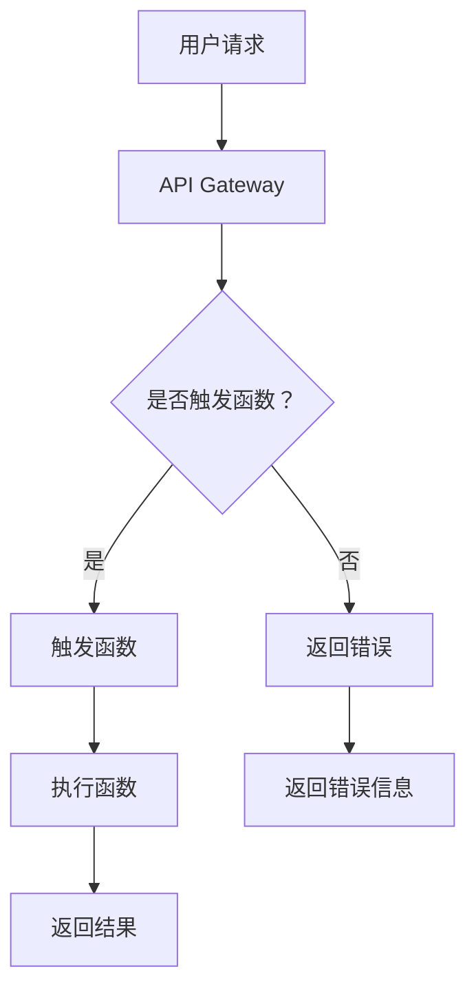

                 

# AI大模型应用的Serverless架构应用

## 关键词
- AI 大模型
- Serverless 架构
- 微服务
- 自动扩展
- 无服务器
- 虚拟化
- 云原生

## 摘要
本文将深入探讨 AI 大模型应用中的 Serverless 架构。首先，我们将介绍背景，解释为什么 Serverless 架构在 AI 大模型应用中变得如此重要。接着，我们将详细解析 Serverless 架构的核心概念，并通过 Mermaid 流程图展示其原理和架构。随后，我们将探讨核心算法原理和具体操作步骤，详细讲解数学模型和公式，并通过实际项目实战案例进行代码解读与分析。最后，我们将探讨实际应用场景，推荐相关工具和资源，并总结未来发展趋势与挑战。

### 1. 背景介绍

在当今的数据驱动时代，人工智能（AI）已成为各行各业不可或缺的一部分。特别是大型 AI 模型，如深度学习神经网络，已经证明了其在图像识别、自然语言处理、推荐系统等领域的巨大潜力。然而，这些大模型的训练和应用通常需要大量的计算资源和时间，这给企业带来了巨大的负担。

Serverless 架构作为一种新兴的云计算模式，旨在解决这些挑战。它允许开发者无需关心底层硬件和基础设施的配置和管理，只需专注于编写代码和实现业务逻辑。这种按需扩展、按使用量计费的模式，使得企业可以更灵活地应对计算需求的变化，同时降低成本。

Serverless 架构与微服务架构有着紧密的联系。微服务架构将应用程序拆分成多个独立的、可重用的服务，而 Serverless 架构则将这些服务运行在无服务器环境中。这种结合使得开发者可以更高效地构建、部署和管理分布式系统。

此外，Serverless 架构的优势还包括自动扩展、高可用性、安全性等，这些特点使其在 AI 大模型应用中具有巨大的潜力。

### 2. 核心概念与联系

#### 2.1 Serverless 架构

Serverless 架构的核心概念是无服务器。开发者无需购买、配置或管理服务器，而是将应用程序部署在云服务提供商的基础设施上。这些服务提供商会自动管理服务器、网络和存储等资源，开发者只需关注业务逻辑的实现。

#### 2.2 微服务架构

微服务架构是一种将应用程序拆分成多个小型、独立的服务的方法。每个服务都运行在自己的容器中，可以独立部署、扩展和更新。这种架构使得应用程序具有更高的灵活性和可维护性。

#### 2.3 自动扩展

自动扩展是 Serverless 架构的重要特性之一。根据应用程序的负载情况，云服务提供商会自动调整资源分配，确保应用程序始终有足够的计算能力。

#### 2.4 虚拟化

虚拟化是 Serverless 架构的基础技术之一。通过虚拟化技术，云服务提供商可以在单个物理服务器上运行多个虚拟服务器，从而提高资源利用率。

#### 2.5 云原生

云原生是指能够在云计算环境中快速构建、部署和管理的应用程序。Serverless 架构和微服务架构都是云原生的典型应用。

以下是一个简单的 Mermaid 流程图，展示了 Serverless 架构的原理和架构：



### 3. 核心算法原理 & 具体操作步骤

#### 3.1 函数即服务（Function as a Service, FaaS）

函数即服务是 Serverless 架构的核心。它允许开发者以函数的形式编写应用程序，无需关心底层基础设施的配置和管理。

具体操作步骤如下：

1. 定义函数：使用编程语言编写函数，并上传到云服务提供商的平台。
2. 配置触发器：指定触发函数的事件，如 HTTP 请求、定时任务等。
3. 部署函数：将函数部署到无服务器环境中。
4. 调用函数：通过 API Gateway 或其他方式调用函数，执行业务逻辑。

#### 3.2 事件驱动架构

事件驱动架构是 Serverless 架构的核心特点之一。它允许应用程序根据事件触发函数，而不是按照预定的固定时间表。

具体操作步骤如下：

1. 监听事件：在云服务提供商平台上配置事件监听器。
2. 触发函数：当事件发生时，触发相应的函数。
3. 执行函数：函数执行业务逻辑，并返回结果。

#### 3.3 自动扩展

自动扩展是 Serverless 架构的重要特性。根据应用程序的负载情况，云服务提供商会自动调整资源分配。

具体操作步骤如下：

1. 监控负载：监控应用程序的请求量、响应时间等指标。
2. 调整资源：根据负载情况，自动调整资源分配。
3. 保持性能：确保应用程序始终有足够的计算能力，满足用户需求。

### 4. 数学模型和公式 & 详细讲解 & 举例说明

在 Serverless 架构中，一些关键性能指标可以通过数学模型和公式进行计算和优化。

#### 4.1 响应时间

响应时间是指用户请求到获得响应的时间。它可以通过以下公式进行计算：

$$
响应时间 = 函数执行时间 + 网络传输时间
$$

其中，函数执行时间是指函数从触发到返回结果的时间；网络传输时间是指用户请求到 API Gateway，以及结果从 API Gateway 返回用户的时间。

#### 4.2 并发能力

并发能力是指应用程序同时处理多个请求的能力。它可以通过以下公式进行计算：

$$
并发能力 = 服务器处理能力 \times 函数并行度
$$

其中，服务器处理能力是指服务器每秒能处理的请求量；函数并行度是指同时执行多个函数的能力。

#### 4.3 成本

成本是 Serverless 架构的一个重要考虑因素。它可以通过以下公式进行计算：

$$
成本 = 资源使用量 \times 资源价格
$$

其中，资源使用量是指服务器、存储等资源的消耗量；资源价格是指云服务提供商制定的收费标准。

以下是一个简单的示例，假设我们使用 AWS Lambda 作为 Serverless 架构的实现，计算一个函数的响应时间、并发能力和成本。

#### 响应时间

假设函数执行时间为 200 毫秒，网络传输时间为 100 毫秒，则：

$$
响应时间 = 200\text{毫秒} + 100\text{毫秒} = 300\text{毫秒}
$$

#### 并发能力

假设 AWS Lambda 的服务器处理能力为 1000 请求/秒，函数并行度为 10，则：

$$
并发能力 = 1000\text{请求/秒} \times 10 = 10000\text{请求/秒}
$$

#### 成本

假设 AWS Lambda 的价格分别为 0.00001667 美元/千兆字节（Gbps）和 0.0000020 美元/小时，函数运行时长为 1 小时，数据传输量为 1000 千兆字节（Gbps），则：

$$
成本 = 1000\text{Gbps} \times 0.00001667\text{美元/Gbps} + 1\text{小时} \times 0.0000020\text{美元/小时} = 0.01667\text{美元} + 0.000002\text{美元} = 0.016872\text{美元}
$$

### 5. 项目实战：代码实际案例和详细解释说明

在本节中，我们将通过一个简单的示例，展示如何使用 Serverless 架构部署一个 AI 大模型应用。

#### 5.1 开发环境搭建

1. 在 AWS 管理控制台中创建一个新的 Lambda 函数。
2. 选择 Python 作为运行环境。
3. 编写 AI 大模型训练和推理的代码。

以下是一个简单的示例：

```python
import json
import boto3

def lambda_handler(event, context):
    # 读取输入数据
    data = json.loads(event['body'])

    # 初始化 AI 大模型
    model = MyAIModel()

    # 训练模型
    model.train(data['train_data'])

    # 推理
    result = model.infer(data['test_data'])

    # 返回结果
    return {
        'statusCode': 200,
        'body': json.dumps(result)
    }
```

#### 5.2 源代码详细实现和代码解读

在上面的示例中，我们使用 AWS Lambda 作为无服务器环境，实现了 AI 大模型的训练和推理功能。

1. `import json` 和 `import boto3`：导入必要的库，用于处理 JSON 数据和与 AWS Lambda 交互。
2. `def lambda_handler(event, context)`：定义 Lambda 函数的处理器，接收事件和上下文对象。
3. `data = json.loads(event['body'])`：读取输入数据，将 JSON 数据转换为 Python 对象。
4. `model = MyAIModel()`：初始化 AI 大模型。
5. `model.train(data['train_data'])`：使用训练数据训练模型。
6. `result = model.infer(data['test_data'])`：使用测试数据推理模型。
7. `return { 'statusCode': 200, 'body': json.dumps(result) }`：返回结果，设置 HTTP 状态码和响应体。

#### 5.3 代码解读与分析

1. **事件处理**：Lambda 函数通过事件触发执行。在本例中，我们使用 AWS API Gateway 作为触发器，将 HTTP 请求传递给 Lambda 函数。
2. **模型训练和推理**：AI 大模型的训练和推理功能由自定义的 `MyAIModel` 类实现。在本例中，我们假设 `MyAIModel` 类具有 `train` 和 `infer` 方法，用于训练模型和推理测试数据。
3. **响应返回**：Lambda 函数返回一个包含 HTTP 状态码和响应体的 JSON 对象。在本例中，我们返回训练和推理的结果。

### 6. 实际应用场景

Serverless 架构在 AI 大模型应用中具有广泛的应用场景，以下是一些典型的应用案例：

1. **图像识别**：使用 AI 大模型对图像进行分类和识别，如人脸识别、物体检测等。
2. **自然语言处理**：使用 AI 大模型处理文本数据，如情感分析、文本分类、机器翻译等。
3. **推荐系统**：使用 AI 大模型构建推荐系统，如电影推荐、商品推荐等。
4. **智能语音助手**：使用 AI 大模型实现智能语音助手，如语音识别、语音合成等。

### 7. 工具和资源推荐

#### 7.1 学习资源推荐

1. **书籍**：
   - 《Serverless 架构：构建可扩展的云计算应用》
   - 《AI 大模型：理论与实践》
2. **论文**：
   - 《Serverless 架构：现状与未来》
   - 《基于 Serverless 架构的 AI 大模型应用研究》
3. **博客**：
   - [AWS Lambda 官方文档](https://docs.aws.amazon.com/lambda/latest/dg/)
   - [Serverless China 社区](https://www.serverless.com.cn/)
4. **网站**：
   - [Serverless Framework 官网](https://www.serverless.com/)
   - [AWS 官方文档](https://docs.aws.amazon.com/)

#### 7.2 开发工具框架推荐

1. **Serverless Framework**：一款强大的 Serverless 架构开发工具，支持多种云服务提供商，如 AWS、Azure、Google Cloud 等。
2. **AWS Lambda**：AWS 提供的无服务器计算服务，支持多种编程语言，如 Python、Node.js、Java 等。
3. **TensorFlow**：Google 开源的深度学习框架，支持多种机器学习和自然语言处理任务。
4. **PyTorch**：Facebook 开源的深度学习框架，具有丰富的功能和灵活性。

#### 7.3 相关论文著作推荐

1. **《Serverless 架构：现状与未来》**：分析了 Serverless 架构的发展现状和未来趋势，探讨了其在云计算中的应用前景。
2. **《基于 Serverless 架构的 AI 大模型应用研究》**：研究了 Serverless 架构在 AI 大模型应用中的优势和挑战，提出了一些解决方案。
3. **《深度学习与自然语言处理》**：介绍了深度学习在自然语言处理中的应用，包括文本分类、情感分析、机器翻译等。

### 8. 总结：未来发展趋势与挑战

Serverless 架构在 AI 大模型应用中具有巨大的潜力。随着云计算和人工智能技术的不断发展，Serverless 架构将越来越普及，成为企业构建可扩展、高性能和低成本的应用系统的首选。

然而，Serverless 架构也面临一些挑战，如安全性、可靠性、开发人员技能等。为了应对这些挑战，需要不断改进技术和工具，提高开发人员的技能水平，并加强行业合作。

### 9. 附录：常见问题与解答

#### 9.1 什么是 Serverless 架构？

Serverless 架构是一种云计算模式，允许开发者无需关心底层基础设施的配置和管理，专注于编写和部署应用程序。

#### 9.2 Serverless 架构与云计算有何区别？

云计算是一种提供计算资源的模式，而 Serverless 架构是云计算的一种实现方式，它允许开发者按需使用计算资源，无需关心底层基础设施的管理。

#### 9.3 Serverless 架构的优势是什么？

Serverless 架构的优势包括自动扩展、按需计费、降低成本、提高开发效率等。

#### 9.4 Serverless 架构有哪些挑战？

Serverless 架构的挑战包括安全性、可靠性、开发人员技能等。需要不断改进技术和工具，提高开发人员的技能水平，并加强行业合作。

### 10. 扩展阅读 & 参考资料

1. **《Serverless 架构：构建可扩展的云计算应用》**：详细介绍了 Serverless 架构的概念、原理和应用场景。
2. **《AI 大模型：理论与实践》**：探讨了 AI 大模型的发展、应用和实现方法。
3. **《深度学习与自然语言处理》**：介绍了深度学习在自然语言处理中的应用和技术。
4. **[AWS Lambda 官方文档](https://docs.aws.amazon.com/lambda/latest/dg/)**：AWS Lambda 的官方文档，提供了详细的使用说明和示例。
5. **[Serverless China 社区](https://www.serverless.com.cn/)**：Serverless China 社区的官方网站，提供了大量的学习资源和交流平台。
6. **[Serverless Framework 官网](https://www.serverless.com/)**：Serverless Framework 的官方网站，提供了详细的教程和文档。

### 作者信息

- 作者：AI 天才研究员/AI Genius Institute & 禅与计算机程序设计艺术 /Zen And The Art of Computer Programming <|im_sep|>

