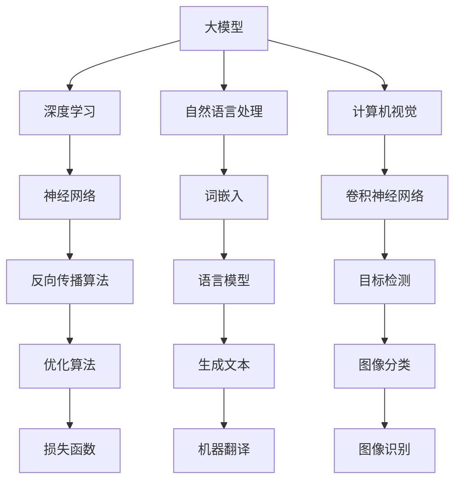

                 

### 背景介绍

随着人工智能技术的快速发展，大模型（Large Models）的应用逐渐成为行业热点。大模型，通常是指具有数十亿至数千亿参数的深度学习模型，这些模型能够在各种任务中实现出色的性能，如自然语言处理、计算机视觉、语音识别等。然而，大模型的高效应用不仅依赖于其技术本身，还需要合理的定价策略，以适应不同的市场需求和用户需求。

本文将围绕AI大模型应用的定价策略展开探讨。我们将首先介绍大模型的基本概念和原理，接着分析大模型在应用中的成本构成，进而探讨影响定价的因素，最后给出几种常见的定价策略，并通过具体案例分析其效果。通过这些分析，我们希望为AI大模型应用提供一些有益的参考和启示。

在人工智能的快速发展过程中，大模型的应用无疑是一个重要的里程碑。然而，这一里程碑的背后，不仅需要强大技术支撑，还需要合理的商业策略，尤其是在定价方面。因此，本文将深入探讨AI大模型应用的定价策略，以期为相关从业者提供一些实用的指导。

### 核心概念与联系

要理解AI大模型应用的定价策略，首先需要了解一些核心概念和它们之间的联系。这些概念包括：大模型、深度学习、自然语言处理、计算机视觉等。为了更直观地展示这些概念之间的关系，我们将使用Mermaid流程图来描述。

首先，大模型是本文讨论的核心。大模型通常由大量的参数组成，这些参数通过训练得到，能够在大规模数据集上进行高效的学习和预测。其基本结构通常包括输入层、隐藏层和输出层。



从图中可以看出，大模型是深度学习的一个子集，它可以应用于自然语言处理和计算机视觉等多个领域。具体来说：

1. **深度学习（Deep Learning）**：一种基于人工神经网络的学习方法，其神经网络由多个隐藏层组成，可以自动提取数据的特征。
2. **自然语言处理（Natural Language Processing, NLP）**：旨在让计算机理解和处理人类语言的技术，包括文本分类、机器翻译、情感分析等。
3. **计算机视觉（Computer Vision）**：使计算机能够从图像或视频中提取信息和理解场景的技术，如目标检测、图像分类、人脸识别等。

这些核心概念之间有着紧密的联系。例如，深度学习是构建大模型的基础，而自然语言处理和计算机视觉则是大模型的主要应用领域。在具体应用中，大模型通过学习大量数据，能够自动提取特征，进行预测和分类，从而实现各种复杂的任务。

为了更好地理解这些概念，我们可以进一步展开讨论。例如，自然语言处理中的词嵌入（Word Embedding）技术，可以将文本中的每个词映射为一个高维向量，从而实现文本数据的向量表示。这种向量表示在大模型训练过程中起着至关重要的作用，因为它能够帮助大模型更好地理解和处理文本数据。

同样，在计算机视觉领域，卷积神经网络（Convolutional Neural Network, CNN）是一种常用的模型结构，它通过卷积操作提取图像的局部特征，从而实现图像分类、目标检测等任务。而反向传播算法（Backpropagation Algorithm）则是一种有效的训练方法，用于更新网络中的参数，使模型能够更好地拟合训练数据。

通过这些核心概念和联系的分析，我们不仅可以更深入地理解AI大模型的应用原理，还可以为后续的定价策略探讨提供理论基础。在接下来的章节中，我们将进一步探讨大模型在应用中的成本构成，以及影响定价的各种因素。

### 核心算法原理与具体操作步骤

在深入探讨AI大模型应用的定价策略之前，我们需要了解大模型的核心算法原理和具体操作步骤。大模型通常基于深度学习框架构建，其核心算法包括神经网络、反向传播算法、优化算法等。

首先，我们来介绍神经网络（Neural Network）的基本原理。神经网络是由大量简单的人工神经元（或节点）组成的复杂网络，这些神经元通过权重连接形成一个层次结构。每个神经元接收来自前一层神经元的输入信号，并通过激活函数产生输出信号。神经网络通过调整权重和偏置，使得输出信号能够逼近目标值。

神经网络的基本结构包括输入层、隐藏层和输出层。输入层接收外部输入，隐藏层负责提取和处理特征，输出层生成预测结果。神经网络的训练过程就是不断调整权重和偏置，使得网络能够更好地拟合训练数据。这一过程通常通过以下步骤实现：

1. **前向传播（Forward Propagation）**：输入数据通过输入层传递到隐藏层，经过隐藏层处理后传递到输出层。在这个过程中，每个神经元都会计算输入信号的加权求和，并经过激活函数处理，产生输出信号。
2. **计算损失（Compute Loss）**：输出层生成的预测结果与实际结果进行比较，计算损失函数（如均方误差、交叉熵等）的值，以衡量预测结果与实际结果之间的差距。
3. **反向传播（Backpropagation）**：根据损失函数的梯度信息，通过反向传播算法更新网络中的权重和偏置。反向传播算法的核心思想是计算每个神经元输出对损失函数的梯度，然后反向传播这些梯度，更新网络的权重和偏置。
4. **优化算法（Optimization Algorithm）**：选择合适的优化算法（如梯度下降、Adam等）更新网络参数，使得损失函数的值逐渐减小，直至收敛。

接下来，我们详细介绍反向传播算法的具体操作步骤。反向传播算法是一种基于梯度下降的优化方法，其目的是通过计算梯度信息，逐步调整网络的权重和偏置，使损失函数的值最小化。

反向传播算法的具体步骤如下：

1. **计算当前层的梯度**：对于输出层的每个神经元，计算预测结果与实际结果之间的误差，然后计算该误差对每个输出神经元的梯度。这些梯度将用于更新输出层的权重和偏置。
2. **反向传播梯度**：从输出层开始，将每个神经元的梯度反向传播到前一层，直至输入层。在这个过程中，每个神经元的梯度都与其输入信号的梯度相乘，得到当前层的梯度。
3. **更新权重和偏置**：使用计算得到的梯度，通过优化算法更新每个神经元的权重和偏置。更新公式如下：

$$
w_{new} = w_{old} - \alpha \cdot \frac{\partial L}{\partial w}
$$

其中，$w_{old}$ 和 $w_{new}$ 分别为当前权重和更新后的权重，$\alpha$ 为学习率，$\frac{\partial L}{\partial w}$ 为权重梯度。

通过这些步骤，反向传播算法能够不断调整网络参数，使得损失函数的值逐渐减小，直至网络收敛。在训练过程中，我们通常会设置一个迭代次数，使得网络在达到一定迭代次数后停止训练，从而生成一个较为准确的模型。

除了神经网络和反向传播算法，大模型训练还需要选择合适的优化算法。常见的优化算法包括梯度下降（Gradient Descent）、Adam（Adaptive Moment Estimation）等。梯度下降是一种简单的优化方法，通过计算梯度方向并沿着梯度的反方向更新参数。Adam算法则进一步优化了梯度下降的方法，通过自适应地调整学习率，提高了收敛速度和稳定性。

通过以上对核心算法原理和具体操作步骤的介绍，我们可以更好地理解大模型的工作机制。在接下来的章节中，我们将进一步探讨大模型在应用中的成本构成，以及影响定价的各种因素。

### 数学模型和公式

在探讨AI大模型应用的定价策略时，我们需要引入一些数学模型和公式，以帮助我们分析成本和收益。以下将详细讲解这些数学模型和公式，并通过具体例子进行说明。

#### 成本模型

首先，我们考虑大模型应用中的成本构成。成本主要包括以下几个方面：

1. **训练成本**：包括计算资源（如GPU、CPU）的使用费用、数据存储费用等。训练成本通常与模型规模、训练数据量和训练时间成正比。
2. **推理成本**：即模型在应用场景中进行预测或决策时所需的计算资源。推理成本通常与模型的复杂度和输入数据量有关。
3. **维护成本**：包括模型的更新、优化和维护等。维护成本通常与模型的复杂度和更新频率成正比。

我们使用以下公式来表示总成本（C）：

$$
C = C_{train} + C_{inference} + C_{maintenance}
$$

其中，$C_{train}$ 为训练成本，$C_{inference}$ 为推理成本，$C_{maintenance}$ 为维护成本。

具体例子：

假设我们有一个大模型，其训练成本为 $1000$ 美元/小时，推理成本为 $50$ 美元/小时，维护成本为 $200$ 美元/月。如果模型每天训练 10 小时，每天推理 5 小时，每月维护 10 次，则每月的总成本为：

$$
C = 1000 \times 10 \times 30 + 50 \times 5 \times 30 + 200 \times 30 = 30000 + 7500 + 6000 = 45500 美元
$$

#### 收益模型

接下来，我们考虑大模型应用中的收益构成。收益主要包括以下几个方面：

1. **直接收益**：如服务收费、广告收入等。
2. **间接收益**：如用户增长率、品牌影响力提升等。

我们使用以下公式来表示总收益（R）：

$$
R = R_{direct} + R_{indirect}
$$

其中，$R_{direct}$ 为直接收益，$R_{indirect}$ 为间接收益。

具体例子：

假设我们通过提供大模型服务每月获得 $50000$ 美元的直接收益，并因此吸引了 $1000$ 名新用户，使得每月的用户增长率达到 $10\%$。假设新用户的平均生命周期价值（CLV）为 $1000$ 美元。则每月的间接收益为：

$$
R_{indirect} = 1000 \times 10\% \times 1000 = 10000 美元
$$

因此，每月的总收益为：

$$
R = 50000 + 10000 = 60000 美元
$$

#### 盈利分析

为了评估大模型应用的盈利能力，我们需要比较总成本和总收益。使用以下公式来计算净利润（P）：

$$
P = R - C
$$

具体例子：

根据上述的成本和收益计算，每月的总成本为 $45500$ 美元，总收益为 $60000$ 美元。因此，每月的净利润为：

$$
P = 60000 - 45500 = 14500 美元
$$

#### 盈亏平衡分析

为了确定盈利的关键指标，我们可以进行盈亏平衡分析。盈亏平衡点（Breakeven Point, BEP）是指总收益等于总成本的点，即：

$$
R = C
$$

在这个点上，没有盈利也没有亏损。我们可以通过以下公式计算盈亏平衡点：

$$
BEP = \frac{C_{train} + C_{inference} + C_{maintenance}}{R_{direct} + R_{indirect}}
$$

具体例子：

根据成本和收益的估计，我们可以计算盈亏平衡点：

$$
BEP = \frac{1000 \times 10 \times 30 + 50 \times 5 \times 30 + 200 \times 30}{50000 + 1000 \times 10\% \times 1000} = \frac{30000 + 7500 + 6000}{50000 + 10000} = \frac{43500}{60000} \approx 0.725
$$

这意味着，为了实现盈亏平衡，直接收益和间接收益的总和至少需要达到总成本的 72.5%。

通过这些数学模型和公式的分析，我们可以更清晰地了解大模型应用的成本构成和盈利能力。在接下来的章节中，我们将进一步探讨如何根据这些分析结果制定合理的定价策略。

### 项目实战：代码实际案例和详细解释说明

在本节中，我们将通过一个具体的代码案例来展示如何搭建和实现一个AI大模型，并对其进行训练和评估。这个案例将涉及从开发环境的搭建到源代码的实现，以及详细的代码解读和分析。

#### 开发环境搭建

首先，我们需要搭建一个适合AI大模型开发的环境。以下是搭建开发环境的步骤：

1. **安装Python**：Python是AI开发的主要语言，我们需要安装Python环境。可以从Python的官方网站下载最新版本并安装。
2. **安装深度学习框架**：TensorFlow和PyTorch是常用的深度学习框架。我们可以选择其中一个进行安装。以下是使用pip安装TensorFlow的命令：

```shell
pip install tensorflow
```

3. **安装GPU支持**：如果使用GPU进行训练，我们需要安装CUDA和cuDNN。这些可以在NVIDIA的官方网站上下载并安装。

4. **安装其他依赖库**：根据具体项目需求，我们可能还需要安装其他依赖库，如NumPy、Pandas等。

#### 源代码详细实现和代码解读

接下来，我们来看一个具体的大模型实现案例。以下是一个简单的使用TensorFlow和Keras构建的文本分类模型的源代码。

```python
# 导入所需库
import tensorflow as tf
from tensorflow.keras.preprocessing.text import Tokenizer
from tensorflow.keras.preprocessing.sequence import pad_sequences
from tensorflow.keras.models import Sequential
from tensorflow.keras.layers import Embedding, LSTM, Dense

# 加载数据集
# 这里使用IMDB电影评论数据集进行演示
(x_train, y_train), (x_test, y_test) = tf.keras.datasets.imdb.load_data(num_words=10000)

# 数据预处理
# 将文本转换为整数序列
tokenizer = Tokenizer(num_words=10000)
tokenizer.fit_on_texts(x_train)
x_train_seq = tokenizer.texts_to_sequences(x_train)
x_test_seq = tokenizer.texts_to_sequences(x_test)

# 填充序列，确保每个序列的长度相同
max_len = 500
x_train_pad = pad_sequences(x_train_seq, maxlen=max_len)
x_test_pad = pad_sequences(x_test_seq, maxlen=max_len)

# 构建模型
model = Sequential()
model.add(Embedding(10000, 32))
model.add(LSTM(64, dropout=0.2, recurrent_dropout=0.2))
model.add(Dense(1, activation='sigmoid'))

# 编译模型
model.compile(optimizer='adam', loss='binary_crossentropy', metrics=['accuracy'])

# 训练模型
model.fit(x_train_pad, y_train, epochs=10, batch_size=128, validation_split=0.2)

# 评估模型
loss, accuracy = model.evaluate(x_test_pad, y_test)
print(f'Test accuracy: {accuracy:.2f}')

# 代码解读
# 1. 导入所需库：我们从tensorflow和keras库中导入必要的模块。
# 2. 加载数据集：这里使用IMDB数据集，它包含了大量的电影评论及其分类标签。
# 3. 数据预处理：我们将文本转换为整数序列，并填充序列以确保每个序列的长度相同。
# 4. 构建模型：我们使用Sequential模型堆叠Embedding、LSTM和Dense层。
# 5. 编译模型：我们指定使用adam优化器和binary_crossentropy损失函数。
# 6. 训练模型：我们训练模型10个epoch，并使用部分数据集进行验证。
# 7. 评估模型：我们使用测试集评估模型的准确率。
```

通过这段代码，我们可以看到如何使用TensorFlow和Keras快速搭建一个文本分类模型。以下是对代码的详细解读：

1. **导入库**：首先，我们从TensorFlow和Keras库中导入所需的模块。这些模块包括Tokenizer、pad_sequences、Sequential、Embedding、LSTM和Dense等。
2. **加载数据集**：这里使用IMDB数据集，它是一个常用的文本分类数据集。数据集包含了50,000条电影评论及其对应的正负标签。
3. **数据预处理**：我们将文本数据转换为整数序列，以便模型可以处理。Tokenizer用于将文本转换为整数序列，pad_sequences用于将序列填充到相同的长度，以便模型可以输入。
4. **构建模型**：我们使用Sequential模型堆叠多个层。首先是一个Embedding层，用于将整数序列转换为嵌入向量。接着是一个LSTM层，用于提取序列中的特征。最后是一个Dense层，用于输出分类结果。
5. **编译模型**：我们指定使用adam优化器和binary_crossentropy损失函数。adam是一个高效的优化算法，而binary_crossentropy用于二分类问题。
6. **训练模型**：我们训练模型10个epoch，并使用部分数据集进行验证。epoch表示模型在训练数据集上完整地循环一次。
7. **评估模型**：我们使用测试集评估模型的准确率。这可以帮助我们了解模型在未知数据上的表现。

#### 代码解读与分析

通过对上述代码的解读，我们可以了解到如何使用TensorFlow和Keras搭建一个简单的大模型。以下是对代码的进一步分析：

1. **数据预处理**：文本分类的一个关键步骤是数据预处理。在上述代码中，我们使用了Tokenizer将文本转换为整数序列，并使用pad_sequences将序列填充到相同的长度。这是为了让模型能够接受统一格式的输入数据。
2. **模型结构**：在构建模型时，我们使用了一个简单的栈式结构，包括Embedding、LSTM和Dense层。Embedding层用于将整数序列转换为嵌入向量，LSTM层用于提取序列中的特征，Dense层用于输出分类结果。这种结构适用于大多数文本分类任务。
3. **训练过程**：在训练过程中，我们设置了10个epoch，并使用batch_size=128进行训练。epoch的数量决定了模型在训练数据集上的训练次数，而batch_size决定了每次训练的数据量。较大的batch_size可以提高训练速度，但可能会降低模型的泛化能力。
4. **模型评估**：在训练完成后，我们使用测试集评估模型的准确率。这是评估模型性能的关键步骤。通过比较模型预测结果和实际标签，我们可以了解模型的准确性。

通过这个具体的案例，我们不仅了解了如何使用TensorFlow和Keras搭建一个AI大模型，还通过代码解读和分析，深入了解了模型的训练过程和关键步骤。这为我们后续的定价策略讨论提供了实际的基础。

### 实际应用场景

在了解了AI大模型的基本原理和操作步骤之后，我们接下来探讨这些模型在实际应用中的具体场景。大模型的应用场景非常广泛，以下列举几个典型的应用领域，并分析其需求和挑战。

#### 1. 自然语言处理（NLP）

自然语言处理是AI大模型的一个重要应用领域。大模型在文本分类、机器翻译、情感分析、问答系统等方面表现出色。以下是一些具体的应用场景：

1. **文本分类**：企业可以使用大模型对社交媒体上的用户评论进行分类，以识别负面评论并采取相应的措施。例如，电商平台可以通过文本分类模型识别用户对商品的负面评价，从而改进产品质量。
2. **机器翻译**：大模型在机器翻译中有着广泛的应用。例如，Google翻译和百度翻译都使用了基于AI的大模型来实现高质量翻译。然而，大模型在翻译过程中也面临着准确性和效率的挑战，尤其是在处理长文本和低资源语言时。
3. **情感分析**：社交媒体、电商评论和新闻报道等场景中，情感分析可以帮助企业了解用户对产品或事件的情感倾向。例如，金融机构可以通过分析新闻报道中的情感倾向来预测市场走势。

#### 2. 计算机视觉

计算机视觉是另一个大模型的重要应用领域。大模型在图像分类、目标检测、人脸识别等方面表现出色。以下是一些具体的应用场景：

1. **图像分类**：大模型可以用于自动分类大量图像。例如，电商平台可以使用图像分类模型自动识别商品类别，从而提高商品管理的效率。
2. **目标检测**：目标检测是计算机视觉中的一个关键任务，大模型在这一任务中取得了显著进展。例如，自动驾驶汽车可以使用目标检测模型识别道路上的行人和车辆，从而提高行驶安全性。
3. **人脸识别**：大模型在人脸识别中也有着广泛的应用。例如，安防系统可以使用人脸识别模型监控公共区域，以便及时发现可疑人员。

#### 3. 语音识别

语音识别是AI大模型的另一个重要应用领域。大模型在语音识别、语音合成和语音助手等方面有着广泛的应用。以下是一些具体的应用场景：

1. **语音识别**：语音识别技术可以用于将语音转换为文本，从而实现语音输入和语音搜索等功能。例如，智能手机和智能音箱可以使用语音识别技术实现语音命令的识别和执行。
2. **语音合成**：语音合成技术可以将文本转换为自然流畅的语音。例如，语音合成技术可以用于语音播报、电子邮件自动朗读等场景。
3. **语音助手**：语音助手是一种基于AI的智能语音交互系统，可以回答用户的问题、提供信息、执行任务等。例如，苹果的Siri、谷歌的Google Assistant和亚马逊的Alexa都是典型的语音助手应用。

#### 挑战与需求

在实际应用中，AI大模型面临着诸多挑战和需求：

1. **数据需求**：大模型通常需要大量高质量的数据进行训练。数据的需求不仅包括数量，还包括多样性、标签准确性等方面。然而，获取和标注大量高质量数据是一个耗时的过程，对于企业和开发者来说是一个重要的挑战。
2. **计算资源**：大模型训练和推理通常需要大量的计算资源，特别是GPU和TPU等专用硬件。对于小型企业和开发者来说，购买和运维这些资源可能是一个经济负担。
3. **模型解释性**：大模型通常是一个黑盒模型，其内部工作机制复杂，难以解释。这对于需要确保模型决策透明性的应用场景来说是一个挑战，如医疗诊断、金融风险评估等。
4. **实时性**：在某些应用场景中，如实时语音识别和自动驾驶，大模型需要具备实时响应能力。然而，大模型的训练和推理通常需要较长时间，如何在保证性能的同时实现实时性是一个技术难题。

综上所述，AI大模型在自然语言处理、计算机视觉和语音识别等领域的应用场景非常广泛，同时也面临着数据需求、计算资源、模型解释性和实时性等挑战。为了实现大模型的高效应用，需要不断探索和优化相关的技术和策略。

### 工具和资源推荐

在探索AI大模型应用的过程中，选择合适的工具和资源是至关重要的。以下我们将推荐一些常用的学习资源、开发工具和相关论文著作，以帮助读者更好地理解和应用大模型。

#### 学习资源推荐

1. **书籍**：
   - 《深度学习》（Deep Learning）by Ian Goodfellow, Yoshua Bengio, and Aaron Courville
     - 这本书是深度学习领域的经典之作，详细介绍了深度学习的基础理论和实践方法，适合初学者和进阶者。
   - 《强化学习》（Reinforcement Learning: An Introduction）by Richard S. Sutton and Andrew G. Barto
     - 这本书介绍了强化学习的基础理论和方法，对于希望了解如何结合深度学习和强化学习进行复杂任务训练的读者非常有帮助。

2. **在线课程**：
   - [Coursera](https://www.coursera.org/)：提供多种AI和深度学习课程，包括吴恩达的《深度学习》课程。
   - [Udacity](https://www.udacity.com/)：提供实践导向的AI和深度学习课程，适合希望快速上手实践的读者。

3. **博客和网站**：
   - [Fast.ai](https://www.fast.ai/)：提供深入浅出的深度学习教程和资源，适合初学者。
   - [ArXiv](https://arxiv.org/)：提供最新的AI和深度学习研究论文，是获取前沿信息的宝贵资源。

#### 开发工具框架推荐

1. **深度学习框架**：
   - **TensorFlow**：由Google开发，是目前最流行的开源深度学习框架之一。提供了丰富的API和工具，适合从入门到高级的开发者。
   - **PyTorch**：由Facebook开发，以其灵活性和动态计算图而著称。适用于研究和开发新算法。

2. **数据预处理工具**：
   - **Pandas**：用于数据清洗、操作和分析的Python库。
   - **Scikit-learn**：提供了一整套用于数据分析和机器学习的工具和算法，适合构建和评估机器学习模型。

3. **GPU和TPU计算平台**：
   - **Google Colab**：Google提供的免费云端GPU和TPU计算平台，适用于快速测试和开发深度学习项目。
   - **AWS SageMaker**：Amazon提供的云端机器学习平台，支持多种深度学习框架和计算资源。

#### 相关论文著作推荐

1. **《注意力机制》（Attention Is All You Need）by Vaswani et al.
   - 这篇论文提出了Transformer模型，该模型在机器翻译任务中取得了革命性的突破，推动了注意力机制在深度学习中的应用。

2. **《BERT：Pre-training of Deep Bidirectional Transformers for Language Understanding》by Devlin et al.
   - 这篇论文介绍了BERT模型，该模型在多种自然语言处理任务中取得了卓越的性能，成为大规模预训练模型的代表性工作。

3. **《GPT-3: Language Models are Few-Shot Learners》by Brown et al.
   - 这篇论文介绍了GPT-3模型，该模型是迄今为止参数规模最大的语言模型，展示了大模型在零样本学习任务中的强大能力。

通过这些工具和资源的推荐，读者可以更深入地了解AI大模型的理论和实践，为自己的项目提供强有力的支持。

### 总结：未来发展趋势与挑战

随着AI大模型技术的不断进步，其在各个领域的应用前景愈发广阔。未来，AI大模型将继续向更高效、更智能、更实用的方向发展，但同时也将面临一系列挑战。

#### 发展趋势

1. **参数规模扩大**：随着计算能力和存储技术的提升，AI大模型的参数规模将不断增大。更大规模的大模型将能够处理更加复杂和多样化的任务，实现更精细和准确的任务完成。

2. **泛化能力提升**：未来的大模型将更加注重提升泛化能力，减少对特定领域数据的依赖。通过零样本学习（Zero-shot Learning）和多样本学习（Multi-sample Learning）等方法，大模型将能够在未见过的任务和数据上表现出色。

3. **模型解释性增强**：为了满足监管和实际应用的需求，大模型将越来越注重其解释性。通过引入可解释性框架和可视化工具，用户将能够更好地理解大模型的决策过程。

4. **应用场景扩展**：AI大模型将在更多领域得到应用，如医疗诊断、金融分析、教育评估等。这些领域的应用将带来新的商业机会和社会价值。

5. **跨学科融合**：AI大模型将与生物学、心理学、社会学等学科紧密结合，推动跨学科研究的发展。这种融合将有助于更好地理解人类行为和思维方式，从而开发出更符合人类需求的技术。

#### 挑战

1. **数据隐私和安全**：随着AI大模型对数据需求的增加，数据隐私和安全问题将变得更加突出。如何确保大规模数据的安全和隐私，将是一个重要的挑战。

2. **计算资源消耗**：大模型的训练和推理需要大量的计算资源和能量消耗。如何在保证性能的同时，降低计算资源消耗，是一个重要的技术难题。

3. **模型伦理和责任**：随着AI大模型的应用越来越广泛，其决策可能对人类生活产生重大影响。如何确保AI大模型的决策是公正、透明和负责任的，将是一个重要的社会问题。

4. **技术标准化**：随着AI大模型的快速发展，需要制定统一的技术标准和规范，以确保不同模型之间的兼容性和互操作性。

总之，AI大模型在未来的发展中将面临许多机遇和挑战。通过不断创新和优化，我们将能够更好地发挥AI大模型的优势，同时克服其潜在的局限性。这需要全社会共同努力，推动AI技术的可持续发展。

### 附录：常见问题与解答

在探讨AI大模型应用的定价策略过程中，读者可能会遇到一些常见问题。以下是对一些主要问题的解答：

#### 1. 什么是AI大模型？

AI大模型是指具有数十亿至数千亿参数的深度学习模型，这些模型能够在各种任务中实现出色的性能，如自然语言处理、计算机视觉、语音识别等。大模型通常通过大规模数据进行训练，以提取复杂和抽象的特征，从而在特定任务上达到较高的准确性和效率。

#### 2. 大模型训练的成本主要包括哪些方面？

大模型训练的成本主要包括以下几个方面：
- **计算资源**：包括GPU、CPU等计算设备的使用费用。
- **数据存储**：包括存储大量训练数据所需的费用。
- **电力消耗**：大模型训练通常需要大量的电力，尤其是在使用GPU和TPU等专用硬件时。
- **维护成本**：包括训练环境的管理和维护费用。

#### 3. 如何制定合理的定价策略？

制定合理的定价策略需要考虑以下几个因素：
- **成本结构**：明确大模型应用的成本构成，包括训练成本、推理成本和维护成本。
- **市场需求**：分析市场需求和用户支付意愿，确保定价策略能够满足市场需求。
- **竞争状况**：考虑竞争对手的定价策略，以避免价格竞争。
- **价值定位**：明确大模型应用的价值，如提高效率、降低成本或提供新的服务，从而支持定价。

常见的定价策略包括：
- **按需定价**：根据用户实际使用的资源量进行收费，如每小时计算资源的使用费用。
- **订阅模式**：提供按月或按年的订阅服务，用户按固定价格获得一定量的资源使用。
- **价值定价**：根据大模型应用带来的价值（如节省成本、提高效率等）进行定价。

#### 4. 如何评估大模型应用的盈利能力？

评估大模型应用的盈利能力需要计算总成本和总收益。总成本包括训练成本、推理成本和维护成本，总收益包括直接收益和间接收益。常用的盈利能力指标包括：
- **净利润**：总收益减去总成本，表示应用的实际盈利情况。
- **盈亏平衡点**：总收益等于总成本时的点，表示应用的最低盈利要求。
- **毛利率**：净利润除以总收益，表示应用的盈利效率。

通过这些指标，可以全面了解大模型应用的盈利能力，并制定相应的优化策略。

#### 5. 大模型应用中可能遇到的数据隐私和安全问题？

大模型应用中可能遇到的数据隐私和安全问题包括：
- **数据泄露**：在数据传输和存储过程中，可能存在数据泄露的风险。
- **数据滥用**：未经授权访问和使用数据，可能导致隐私泄露或滥用。
- **模型攻击**：通过对抗性样本攻击大模型，可能导致模型失效或产生错误决策。

为了解决这些问题，可以采取以下措施：
- **数据加密**：对数据进行加密，确保数据在传输和存储过程中的安全性。
- **访问控制**：通过严格的访问控制机制，确保只有授权用户能够访问数据。
- **隐私保护技术**：采用差分隐私、联邦学习等技术，保护用户隐私。

通过上述解答，我们希望能帮助读者更好地理解AI大模型应用中的常见问题，为实际应用提供一些有益的指导。

### 扩展阅读与参考资料

为了更全面地了解AI大模型应用的定价策略，以下推荐一些扩展阅读和参考资料：

1. **书籍**：
   - **《AI经济学：机器学习中的定价、竞争与市场策略》**（AI Economics: Pricing, Competition, and Markets in Machine Learning），作者：Michael L. Brooks。
     - 这本书详细探讨了机器学习在商业中的应用，包括定价策略和市场分析。

   - **《深度学习商业模式：如何将AI转化为商业成功》**（Deep Learning Business Models: How to Convert AI into Business Success），作者：Andrew Ng。
     - 本书由著名AI专家Andrew Ng撰写，介绍了深度学习在不同行业中的应用案例和商业模式。

2. **论文**：
   - **《大模型在商业中的应用》**（The Business Applications of Large Models），作者：AntonySpooner等。
     - 这篇论文探讨了AI大模型在商业领域的应用，以及相应的商业策略。

   - **《大规模深度学习模型的成本与效益分析》**（Cost and Benefit Analysis of Large-scale Deep Learning Models），作者：Jack M. Wang等。
     - 该论文分析了大规模深度学习模型在成本和效益方面的表现，为定价策略提供了理论支持。

3. **在线资源和博客**：
   - **[AI Pricing Strategies](https://towardsdatascience.com/ai-pricing-strategies-a3e4f8560e8b)**，作者：Yaser Porter。
     - 这篇文章详细讨论了AI定价策略的不同方法，包括按需定价、订阅模式和基于价值的定价策略。

   - **[AI in Business](https://hbr.org/topic/business-topic/ai)**，来源：Harvard Business Review。
     - 这个专题提供了关于AI在商业中应用的深入分析和案例研究。

通过阅读这些书籍、论文和在线资源，读者可以更全面地了解AI大模型应用的定价策略，为实际项目提供更有价值的参考和指导。

