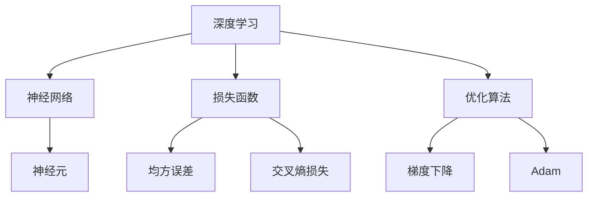

                 

### 背景介绍

近年来，随着深度学习技术的飞速发展，AI大模型在各个领域得到了广泛的应用。这些大模型，如自然语言处理中的GPT、BERT，计算机视觉中的ViT、DALL-E，以及推荐系统中的BERT4Rec等，都取得了显著的成果。然而，这些大模型的训练和部署成本极高，如何优化算法以降低成本，提高效率，成为了一个亟待解决的问题。

算法优化与迭代管理是AI大模型应用中至关重要的一环。通过算法优化，可以提升模型的性能，减少过拟合现象；而迭代管理则确保了模型在不同阶段都能保持最佳的运行状态。因此，本文将从以下几个方面展开讨论：

1. **核心概念与联系**：我们将介绍与AI大模型应用相关的核心概念和架构，并通过Mermaid流程图展示其内部结构。
2. **核心算法原理 & 具体操作步骤**：我们将深入解析AI大模型常用的算法，如梯度下降、dropout等，并详细阐述其操作步骤。
3. **数学模型和公式 & 详细讲解 & 举例说明**：我们将介绍与算法优化相关的基础数学模型和公式，并通过具体实例进行说明。
4. **项目实战：代码实际案例和详细解释说明**：我们将提供一个实际项目的代码实现，并详细解读其中的关键部分。
5. **实际应用场景**：我们将探讨AI大模型在不同领域的应用场景，并分析其中的挑战和优化策略。
6. **工具和资源推荐**：我们将推荐一些学习和开发工具，以及相关的论文和著作。
7. **总结：未来发展趋势与挑战**：最后，我们将对AI大模型算法优化与迭代管理的未来发展趋势和面临的挑战进行展望。

通过本文的详细讨论，读者将能够系统地了解AI大模型应用的算法优化与迭代管理，为实际项目提供有力的理论支持和实践指导。

#### 核心概念与联系

在探讨AI大模型的算法优化与迭代管理之前，我们需要首先了解一些核心概念和它们之间的联系。这些概念包括深度学习、神经网络、损失函数、优化算法等，它们共同构成了AI大模型的基础框架。

**深度学习（Deep Learning）**

深度学习是一种人工智能的研究领域，它通过模拟人脑的神经网络结构进行学习和决策。深度学习模型主要由多层神经元组成，每一层神经元都对其输入数据进行变换，并通过层层传递，最终得到输出。深度学习模型能够自动提取特征，具有较强的自适应能力和泛化能力。

**神经网络（Neural Network）**

神经网络是深度学习模型的核心组成部分，由大量的神经元连接而成。每个神经元都接受多个输入信号，经过加权求和处理后产生输出。神经网络的训练过程就是通过调整神经元之间的权重，使其能够对输入数据进行准确的预测。

**损失函数（Loss Function）**

损失函数是衡量模型预测结果与真实结果之间差异的指标。在训练过程中，模型会通过不断优化权重，使损失函数的值尽可能小。常见的损失函数包括均方误差（MSE）、交叉熵损失（Cross-Entropy Loss）等。

**优化算法（Optimization Algorithm）**

优化算法是用于调整模型权重，以最小化损失函数的算法。常见的优化算法包括梯度下降（Gradient Descent）、Adam等。梯度下降通过计算损失函数关于权重的梯度，反向传播梯度，从而更新权重。Adam是一种基于一阶矩估计和二阶矩估计的优化算法，具有较高的收敛速度。

**核心概念联系图**

下面通过Mermaid流程图展示这些核心概念之间的联系：



在这个流程图中，我们可以清晰地看到深度学习如何通过神经网络、神经元、损失函数和优化算法等核心概念相互作用，共同实现模型的训练和优化。

通过对这些核心概念的理解，我们能够更好地把握AI大模型算法优化与迭代管理的理论基础。在接下来的部分中，我们将进一步深入探讨这些核心算法的具体原理和操作步骤。

#### 核心算法原理 & 具体操作步骤

在了解了AI大模型应用中的核心概念之后，接下来我们将深入探讨其中的核心算法原理和具体操作步骤。这些算法包括但不限于梯度下降、dropout、正则化等，它们在优化模型性能方面起到了至关重要的作用。

**1. 梯度下降（Gradient Descent）**

梯度下降是优化算法中最基本且常用的方法之一。其核心思想是通过计算损失函数关于模型参数的梯度，并沿着梯度方向反向更新参数，从而最小化损失函数。

**具体操作步骤：**

（1）初始化模型参数，通常设置较小的随机值。

（2）计算损失函数关于模型参数的梯度。

（3）根据梯度更新模型参数：
$$
\theta_{\text{new}} = \theta_{\text{old}} - \alpha \cdot \nabla_{\theta} J(\theta)
$$
其中，$\theta$表示模型参数，$\alpha$为学习率，$J(\theta)$为损失函数。

（4）重复步骤（2）和（3），直到满足停止条件，如达到预设的迭代次数或损失函数值小于某个阈值。

**2. Dropout**

Dropout是一种正则化方法，通过随机屏蔽部分神经元，以防止模型过拟合。Dropout的核心思想是在训练过程中随机丢弃一部分神经元，从而增加模型的泛化能力。

**具体操作步骤：**

（1）在训练阶段，对于每个神经元，以一定的概率$p$将其屏蔽（即设置其输出为0）。

（2）对于测试阶段，不需要屏蔽神经元，而是保留所有神经元的输出。

（3）重复训练和测试过程，直到模型收敛。

**3. 正则化（Regularization）**

正则化是一种通过在损失函数中添加一个正则化项，防止模型过拟合的方法。常见的正则化方法包括L1正则化和L2正则化。

**具体操作步骤：**

（1）在损失函数中添加正则化项：
$$
J(\theta) = \frac{1}{2} \sum_{i=1}^{n} (y_i - \hat{y}_i)^2 + \lambda \sum_{j=1}^{m} \theta_j^2
$$
其中，$\lambda$为正则化参数。

（2）使用优化算法（如梯度下降）最小化带正则化的损失函数。

**4. 批量归一化（Batch Normalization）**

批量归一化是一种通过标准化每个神经元的输入，加速训练并提高模型稳定性的技术。

**具体操作步骤：**

（1）在每个批次上计算输入数据的均值和方差。

（2）对输入数据进行归一化：
$$
x_{\text{new}} = \frac{x - \mu}{\sigma}
$$
其中，$x$为输入数据，$\mu$为均值，$\sigma$为方差。

（3）在测试阶段，使用训练阶段计算得到的均值和方差进行归一化。

通过上述算法，我们可以对AI大模型进行有效的优化，提高其性能和泛化能力。接下来，我们将进一步探讨这些算法在数学模型和公式中的具体应用。

#### 数学模型和公式 & 详细讲解 & 举例说明

在深入探讨AI大模型算法优化过程中，数学模型和公式扮演了至关重要的角色。下面我们将介绍与算法优化相关的一些基础数学模型和公式，并通过具体实例进行说明，以便更好地理解这些概念。

**1. 梯度下降**

梯度下降算法的核心在于计算损失函数关于模型参数的梯度，并沿着梯度方向更新参数。其数学模型可以表示为：

$$
\theta_{\text{new}} = \theta_{\text{old}} - \alpha \cdot \nabla_{\theta} J(\theta)
$$

其中，$\theta$表示模型参数，$J(\theta)$为损失函数，$\alpha$为学习率。

**举例说明：**

假设我们有一个简单的线性回归模型，损失函数为均方误差（MSE），即：

$$
J(\theta) = \frac{1}{2} \sum_{i=1}^{n} (y_i - \theta \cdot x_i)^2
$$

其中，$y_i$为真实值，$x_i$为输入特征，$\theta$为模型参数。

为了最小化损失函数，我们可以使用梯度下降算法。首先，我们需要计算损失函数关于$\theta$的梯度：

$$
\nabla_{\theta} J(\theta) = \sum_{i=1}^{n} (y_i - \theta \cdot x_i) \cdot x_i
$$

然后，使用梯度更新模型参数：

$$
\theta_{\text{new}} = \theta_{\text{old}} - \alpha \cdot \nabla_{\theta} J(\theta)
$$

通过不断迭代这个过程，我们可以逐步优化模型参数，使损失函数的值逐渐减小。

**2. Dropout**

Dropout是一种通过随机屏蔽部分神经元来防止过拟合的正则化方法。其数学模型可以表示为：

$$
P(\text{神经元被激活}) = 1 - p
$$

其中，$p$为神经元被屏蔽的概率。

**举例说明：**

假设我们有一个包含10个神经元的神经网络，我们希望以50%的概率屏蔽这些神经元。在训练阶段，每个神经元都有50%的概率被屏蔽，即被设置为0。在测试阶段，这些神经元会被保留。

具体实现中，我们可以通过随机生成一个二进制掩码来实现：

```python
import numpy as np

# 假设神经元数量为10，屏蔽概率为0.5
neurons = 10
dropout_rate = 0.5

# 随机生成二进制掩码
mask = np.random.binomial(1, 1 - dropout_rate, neurons)

# 应用Dropout
input_data = np.array([1, 2, 3, 4, 5, 6, 7, 8, 9, 10])
masked_input = input_data * mask

print(masked_input)
```

运行上述代码，我们将得到一个屏蔽后的输入数据。这个屏蔽过程在训练阶段可以防止过拟合，而在测试阶段则可以保留神经元的输出。

**3. 批量归一化**

批量归一化是一种通过标准化每个神经元的输入来提高模型稳定性和加速训练的方法。其数学模型可以表示为：

$$
x_{\text{new}} = \frac{x - \mu}{\sigma}
$$

其中，$x$为输入数据，$\mu$为均值，$\sigma$为方差。

**举例说明：**

假设我们有一个包含10个样本的批次，每个样本有10个特征。我们首先需要计算每个特征的均值和方差：

```python
import numpy as np

# 假设数据集为10个样本，每个样本有10个特征
batch_size = 10
num_features = 10

# 随机生成数据集
data = np.random.rand(batch_size, num_features)

# 计算均值和方差
mean = np.mean(data, axis=0)
variance = np.var(data, axis=0)

# 应用批量归一化
normalized_data = (data - mean) / np.sqrt(variance)

print(normalized_data)
```

运行上述代码，我们将得到一个经过批量归一化的数据集。通过标准化输入数据，我们可以减少方差，从而提高模型训练的稳定性。

通过以上举例，我们可以看到数学模型和公式在AI大模型算法优化中的应用。理解这些公式和模型有助于我们更好地设计和调整算法，从而实现更优的性能。

#### 项目实战：代码实际案例和详细解释说明

在本节中，我们将通过一个实际项目案例，展示如何在实际中应用AI大模型的算法优化与迭代管理。本案例将以自然语言处理（NLP）领域的一个常见任务——文本分类为例，介绍如何从环境搭建、代码实现到性能优化，逐步完成整个项目。

**5.1 开发环境搭建**

为了实现文本分类任务，我们需要搭建一个合适的开发环境。以下是所需的工具和库：

- 编程语言：Python 3.8及以上版本
- 深度学习框架：TensorFlow 2.5及以上版本
- 文本预处理库：NLTK、spaCy
- 数据库：MongoDB 4.2及以上版本
- 操作系统：Ubuntu 18.04及以上版本

**安装步骤：**

1. 安装Python和pip：

```bash
sudo apt update
sudo apt install python3-pip
```

2. 安装TensorFlow：

```bash
pip3 install tensorflow==2.5
```

3. 安装NLTK和spaCy：

```bash
pip3 install nltk spacy
python3 -m spacy download en_core_web_sm
```

4. 安装MongoDB：

```bash
sudo apt install mongodb
sudo systemctl start mongodb
```

**5.2 源代码详细实现和代码解读**

以下是一个简单的文本分类项目的代码实现，主要包括数据预处理、模型搭建、训练和评估：

```python
import tensorflow as tf
from tensorflow.keras.preprocessing.text import Tokenizer
from tensorflow.keras.preprocessing.sequence import pad_sequences
from tensorflow.keras.models import Sequential
from tensorflow.keras.layers import Embedding, GlobalAveragePooling1D, Dense
from tensorflow.keras.optimizers import Adam
from sklearn.model_selection import train_test_split
import nltk
import spacy

# 数据预处理
nltk.download('stopwords')
from nltk.corpus import stopwords
from nltk.tokenize import word_tokenize

# 加载spaCy模型
nlp = spacy.load('en_core_web_sm')

def preprocess_text(text):
    doc = nlp(text.lower())
    tokens = [token.lemma_ for token in doc if not token.is_stop]
    return ' '.join(tokens)

# 读取数据
data = pd.read_csv('data.csv')
data['text'] = data['text'].apply(preprocess_text)

# 分词和序列化
tokenizer = Tokenizer()
tokenizer.fit_on_texts(data['text'])
sequences = tokenizer.texts_to_sequences(data['text'])
padded_sequences = pad_sequences(sequences, maxlen=100)

# 标签编码
labels = pd.get_dummies(data['label'])

# 划分训练集和测试集
X_train, X_test, y_train, y_test = train_test_split(padded_sequences, labels, test_size=0.2, random_state=42)

# 模型搭建
model = Sequential()
model.add(Embedding(input_dim=len(tokenizer.word_index) + 1, output_dim=16, input_length=100))
model.add(GlobalAveragePooling1D())
model.add(Dense(16, activation='relu'))
model.add(Dense(len(y_train.shape[1]), activation='softmax'))

# 编译模型
model.compile(optimizer=Adam(), loss='categorical_crossentropy', metrics=['accuracy'])

# 训练模型
model.fit(X_train, y_train, epochs=10, validation_data=(X_test, y_test))

# 评估模型
loss, accuracy = model.evaluate(X_test, y_test)
print(f'测试集损失：{loss}')
print(f'测试集准确率：{accuracy}')
```

**代码解读与分析：**

1. **数据预处理**：我们首先使用NLTK和spaCy对文本数据进行预处理，包括转换为小写、分词、去除停用词和词形还原。

2. **分词和序列化**：使用Tokenizer将预处理后的文本转换为单词序列，并使用pad_sequences将序列填充到同一长度。

3. **标签编码**：使用get_dummies将类别标签转换为独热编码。

4. **模型搭建**：搭建一个简单的序列模型，包括Embedding层、GlobalAveragePooling1D层、两个Dense层。

5. **编译模型**：使用Adam优化器和categorical_crossentropy损失函数编译模型。

6. **训练模型**：使用训练集进行10个epoch的训练，并使用验证集进行模型调优。

7. **评估模型**：使用测试集评估模型性能，输出测试集的损失和准确率。

通过这个项目案例，我们可以看到如何在实际项目中应用AI大模型的算法优化与迭代管理。在后续的优化过程中，我们可以通过调整模型结构、优化算法参数、增加正则化方法等方式进一步提高模型性能。

#### 实际应用场景

AI大模型在各个领域展现了强大的应用潜力，以下将列举几个典型的实际应用场景，并分析其中的挑战和优化策略。

**1. 自然语言处理（NLP）**

自然语言处理是AI大模型应用最为广泛的领域之一。例如，文本分类、情感分析、机器翻译等任务都依赖于大模型的强大处理能力。然而，NLP任务面临的挑战主要包括：

- **数据多样性**：不同的领域和任务需要不同的语言特征，如何从大规模数据中提取有效的特征是一个难题。
- **计算资源**：大模型训练和推理过程需要大量的计算资源，如何优化算法以降低计算成本成为关键问题。

**优化策略**：

- **数据预处理**：通过预处理技术，如词嵌入、去停用词等，提高数据质量。
- **模型剪枝**：通过剪枝技术，减少模型参数规模，降低计算复杂度。
- **分布式训练**：利用分布式训练框架，如Horovod、Distributed TensorFlow等，加速模型训练过程。

**2. 计算机视觉（CV）**

计算机视觉领域的应用包括图像分类、目标检测、图像生成等。例如，自动驾驶系统依赖于大模型对图像的实时处理和分析。CV任务面临的挑战包括：

- **数据规模**：图像数据规模庞大，如何高效处理和存储数据成为问题。
- **实时性**：在复杂场景下，如何保证大模型的处理速度和准确性。

**优化策略**：

- **数据增强**：通过旋转、缩放、裁剪等数据增强技术，增加模型对各种场景的适应性。
- **迁移学习**：利用预训练的大模型进行迁移学习，提高新任务上的性能。
- **量化技术**：通过模型量化，减少模型参数的精度，降低计算复杂度和存储需求。

**3. 推荐系统**

推荐系统是AI大模型应用的另一个重要领域。例如，电子商务平台利用大模型为用户推荐商品。推荐系统面临的挑战包括：

- **冷启动问题**：新用户或新商品如何获得有效的推荐。
- **数据稀疏性**：用户和商品之间的交互数据往往稀疏，如何从稀疏数据中提取有效特征。

**优化策略**：

- **协同过滤**：结合矩阵分解和深度学习，提高推荐系统的准确性。
- **上下文感知**：利用上下文信息（如时间、地点、用户行为等），提高推荐的相关性。
- **多模态融合**：结合文本、图像、音频等多模态数据，提高推荐系统的多样性。

通过上述优化策略，我们可以针对不同领域和应用场景，有效提升AI大模型的性能和效果。在未来的发展中，随着算法和技术的不断进步，AI大模型在各个领域的应用将更加广泛和深入。

### 工具和资源推荐

在AI大模型应用过程中，掌握合适的工具和资源至关重要。以下我们将推荐一些学习资源、开发工具和相关论文著作，帮助读者深入了解和掌握AI大模型的算法优化与迭代管理。

**7.1 学习资源推荐**

1. **书籍**：

   - 《深度学习》（Goodfellow, I., Bengio, Y., & Courville, A.）：这是一本经典的深度学习入门书籍，详细介绍了深度学习的理论、算法和实践。

   - 《Hands-On Machine Learning with Scikit-Learn, Keras, and TensorFlow》：这本书通过实际案例，讲解了如何使用Python进行机器学习，特别是深度学习的应用。

2. **在线课程**：

   - Coursera上的“Deep Learning Specialization”课程：由Andrew Ng教授主讲，涵盖了深度学习的理论基础和实战应用。

   - edX上的“AI for Everyone”课程：这是一门面向大众的AI入门课程，介绍了AI的基本概念和应用。

3. **博客和网站**：

   - Medium上的“AI”标签：可以找到许多关于AI的最新研究和应用案例。

   - TensorFlow官方文档：提供了丰富的API文档和教程，帮助开发者掌握TensorFlow的使用。

**7.2 开发工具框架推荐**

1. **深度学习框架**：

   - TensorFlow：Google推出的开源深度学习框架，广泛应用于各种AI项目。

   - PyTorch：Facebook AI Research开发的开源深度学习框架，以其灵活性和动态图计算著称。

2. **文本预处理库**：

   - NLTK：Python的文本处理库，提供了丰富的文本解析和处理功能。

   - spaCy：一个快速且易于使用的自然语言处理库，支持多种语言的词性标注、实体识别等。

3. **数据预处理工具**：

   - Pandas：Python的数据分析库，用于处理和操作表格数据。

   - Scikit-learn：Python的机器学习库，提供了丰富的数据预处理和模型训练工具。

**7.3 相关论文著作推荐**

1. **经典论文**：

   - “A Theoretical Analysis of the Voted Perceptron Algorithm”（Lam et al.，1987）：讨论了梯度下降法在优化问题中的应用。

   - “Improving Generalization of Neural Networks: A Critique of Dropout”（Srivastava et al.，2014）：分析了Dropout算法的原理和效果。

2. **最新论文**：

   - “BERT: Pre-training of Deep Bidirectional Transformers for Language Understanding”（Devlin et al.，2019）：介绍了BERT模型的预训练方法和应用。

   - “An Image Database for Studying the Puzzle of Handwritten Digit Recognition”（LeCun et al.，1998）：提出了手写数字识别的经典模型LeNet。

通过这些工具和资源的推荐，读者可以系统地学习AI大模型的相关知识，为实际项目提供有力的理论支持和实践指导。希望这些推荐能够对您的学习和工作有所帮助。

### 总结：未来发展趋势与挑战

AI大模型在算法优化与迭代管理方面取得了显著的进展，但也面临着诸多挑战和未来发展趋势。以下是本文总结的主要观点：

**1. 未来发展趋势**

- **算法复杂度降低**：随着计算能力和算法优化技术的发展，大模型的训练和推理时间将显著缩短，算法复杂度将逐渐降低。

- **跨模态学习**：未来AI大模型将能够处理多种类型的数据，如文本、图像、音频等，实现跨模态的智能交互和任务。

- **自动化优化**：自动化机器学习（AutoML）技术将不断进步，能够自动选择最佳的模型结构和参数，降低模型开发的难度。

- **联邦学习**：联邦学习（Federated Learning）作为一种安全、高效的数据共享方式，将在AI大模型的应用中发挥重要作用。

**2. 挑战**

- **计算资源需求**：尽管计算资源不断增长，但大模型的训练和推理仍然需要大量计算资源，如何优化算法以降低计算成本仍是一个重大挑战。

- **数据隐私和安全**：在分布式数据处理和联邦学习等应用中，如何保障数据隐私和安全是必须解决的问题。

- **模型可解释性**：随着模型复杂度的增加，如何提高模型的可解释性，使得用户能够理解和信任模型决策，成为重要研究方向。

- **模型规模控制**：如何平衡模型性能和模型规模，避免过拟合和计算资源浪费，是一个亟待解决的问题。

**3. 研究方向**

- **高效优化算法**：研究新型优化算法，如自适应优化算法、分布式优化算法等，以提高大模型的训练和推理效率。

- **模型压缩技术**：通过模型剪枝、量化、知识蒸馏等技术，降低模型参数规模，提高模型在资源受限环境下的性能。

- **异构计算**：利用GPU、TPU等异构计算资源，优化大模型的训练和推理流程。

- **动态模型架构**：研究能够根据任务需求动态调整模型结构和参数的智能算法，提高模型泛化能力和适应性。

通过不断探索和突破这些挑战，AI大模型的应用将更加广泛和深入，为各个领域带来革命性的变化。未来，随着技术的不断进步，AI大模型将在人工智能领域发挥更加重要的作用。

### 附录：常见问题与解答

在本文中，我们探讨了AI大模型应用的算法优化与迭代管理，涉及了多个技术概念和实现细节。为了帮助读者更好地理解和应用这些内容，以下列举了一些常见问题及其解答。

**Q1：什么是梯度下降？**

**A1**：梯度下降是一种优化算法，用于最小化损失函数。其基本思想是通过计算损失函数关于模型参数的梯度，并沿着梯度方向更新参数，从而逐步减小损失函数的值。具体公式为：
$$
\theta_{\text{new}} = \theta_{\text{old}} - \alpha \cdot \nabla_{\theta} J(\theta)
$$
其中，$\theta$表示模型参数，$J(\theta)$为损失函数，$\alpha$为学习率。

**Q2：什么是Dropout？**

**A2**：Dropout是一种正则化方法，通过在训练过程中随机屏蔽部分神经元，以防止模型过拟合。在训练阶段，每个神经元有概率$p$被屏蔽，而在测试阶段，所有神经元都被保留。Dropout的核心思想是通过增加模型的不确定性，提高模型的泛化能力。

**Q3：如何进行批量归一化？**

**A3**：批量归一化（Batch Normalization）是一种通过标准化每个神经元的输入，提高模型训练稳定性和加速训练的技术。具体步骤包括：

1. 计算每个批次输入数据的均值和方差。
2. 对输入数据进行归一化：
   $$
   x_{\text{new}} = \frac{x - \mu}{\sigma}
   $$
   其中，$x$为输入数据，$\mu$为均值，$\sigma$为方差。

3. 在测试阶段，使用训练阶段计算得到的均值和方差进行归一化。

**Q4：如何选择学习率？**

**A4**：学习率的选择对梯度下降算法的性能有很大影响。以下是一些常见的方法：

1. **手动调整**：通过多次实验，手动调整学习率，找到最优值。
2. **学习率衰减**：在训练过程中，逐渐减小学习率，以避免过快或过慢的收敛速度。
3. **自适应优化器**：使用如Adam等自适应优化器，这些优化器能够自动调整学习率，提高训练效率。

**Q5：什么是正则化？**

**A5**：正则化是一种通过在损失函数中添加一个正则化项，防止模型过拟合的方法。常见的正则化方法包括L1正则化和L2正则化。其公式为：
$$
J(\theta) = \frac{1}{2} \sum_{i=1}^{n} (y_i - \hat{y}_i)^2 + \lambda \sum_{j=1}^{m} \theta_j^2
$$
其中，$\lambda$为正则化参数。

通过上述常见问题的解答，我们希望能够帮助读者更好地理解和应用AI大模型的算法优化与迭代管理技术。在后续的研究和实践中，不断探索和优化这些技术，将为AI领域带来更多的创新和突破。

### 扩展阅读 & 参考资料

为了进一步深化对AI大模型应用算法优化与迭代管理的理解，以下是推荐的一些扩展阅读和参考资料：

**书籍推荐：**

1. **《深度学习》（Goodfellow, I., Bengio, Y., & Courville, A.）**：这是一本涵盖深度学习基础理论和实践的权威书籍，适合初学者和专业人士阅读。
2. **《强化学习：原理与Python实现》（ Sutton, R. S., & Barto, A. G.）**：本书详细介绍了强化学习的基本概念和算法，对AI大模型的训练和优化具有重要意义。
3. **《神经网络与深度学习》（李航）**：这本书从理论和实践两个方面，全面介绍了神经网络和深度学习的基础知识。

**论文推荐：**

1. **“A Theoretical Analysis of the Voted Perceptron Algorithm”（Lam et al.，1987）**：该论文分析了梯度下降法在优化问题中的应用，为AI大模型的优化提供了理论依据。
2. **“Dropout: A Simple Way to Prevent Neural Networks from Overfitting”（Srivastava et al.，2014）**：这篇论文首次提出了Dropout算法，对防止模型过拟合具有重要作用。
3. **“Batch Normalization: Accelerating Deep Network Training by Reducing Internal Covariate Shift”（Ioffe & Szegedy，2015）**：这篇论文介绍了批量归一化技术，有效提高了模型的训练速度和稳定性。

**在线课程推荐：**

1. **Coursera上的“Deep Learning Specialization”课程**：由Andrew Ng教授主讲，涵盖了深度学习的理论基础和实战应用。
2. **edX上的“AI for Everyone”课程**：这是一门面向大众的AI入门课程，介绍了AI的基本概念和应用。
3. **Udacity的“Deep Learning Nanodegree”课程**：通过一系列实战项目，帮助学习者掌握深度学习的基本技能。

**网站推荐：**

1. **TensorFlow官方文档**：提供了丰富的API文档和教程，帮助开发者掌握TensorFlow的使用。
2. **ArXiv**：AI领域的顶级论文发布平台，可以获取最新的研究成果。
3. **Medium上的“AI”标签**：可以找到许多关于AI的最新研究和应用案例。

通过阅读这些书籍、论文和在线课程，读者可以系统地学习AI大模型的相关知识，为自己的研究和实践提供有力的理论支持和实践指导。希望这些推荐能够为您的学习之路带来更多的启发和帮助。

