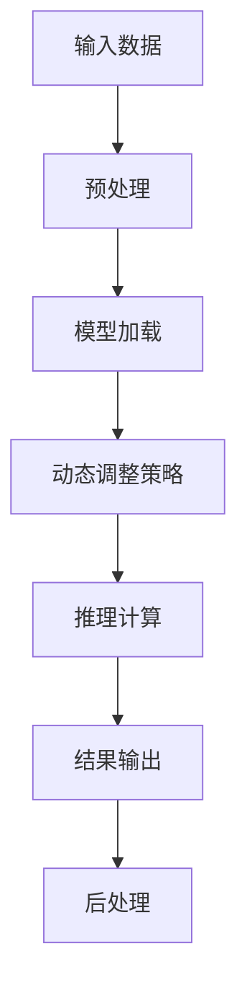

                 

# AI大模型推理行动ReAct框架思想与应用

## 关键词：大模型推理、ReAct框架、算法原理、数学模型、实战案例、应用场景

## 摘要：

本文将深入探讨AI大模型推理行动ReAct框架的思想与应用。首先，我们将介绍大模型推理的背景和重要性，接着详细介绍ReAct框架的核心概念、原理和架构。随后，文章将重点解析ReAct框架中的核心算法原理及具体操作步骤，并运用数学模型和公式进行详细讲解。此外，我们将通过一个实际项目实战案例，展示ReAct框架的实际应用过程。最后，我们将探讨ReAct框架在实际应用场景中的价值，并推荐相关工具和资源，为读者提供进一步学习和探索的路径。通过本文的阅读，读者将全面了解ReAct框架的强大功能及其在实际AI应用中的潜力。

## 1. 背景介绍

在人工智能飞速发展的今天，深度学习技术已经成为实现智能化的关键工具。其中，AI大模型的训练和推理成为了一个热门的研究和应用领域。随着计算能力的提升和数据量的爆炸性增长，AI大模型的规模和复杂性也在不断扩展。然而，如何高效地进行大模型推理，成为了当前AI领域亟待解决的问题。

大模型推理指的是在训练完成后，将新的数据输入到已经训练好的大模型中，以获取相应的预测或决策结果。这一过程对于许多AI应用至关重要，如自然语言处理、计算机视觉、语音识别等领域。高效的推理不仅能够提升系统的实时响应能力，还能降低计算资源和能源消耗，具有重要的实际意义。

然而，大模型推理面临着一系列挑战。首先，大模型的规模庞大，导致推理过程中需要大量的计算资源和时间。其次，大模型通常包含数百万甚至数亿个参数，如何有效地压缩和优化这些参数，以便在有限的资源下进行推理，是一个难题。此外，大模型推理过程中还存在模型精度和性能之间的权衡问题。如何在保证推理性能的同时，尽量减少计算资源的消耗，是一个亟待解决的课题。

为了解决这些问题，AI领域提出了各种大模型推理技术。例如，量化、剪枝、低秩分解等算法，旨在通过压缩和优化模型参数，降低推理的计算复杂度。同时，硬件加速技术，如GPU、TPU等，也在大模型推理中发挥着重要作用。然而，现有的推理技术仍然存在一定的局限性，无法完全满足实际应用的需求。

在这个背景下，ReAct框架应运而生。ReAct（Reactive Action）框架是一种全新的AI大模型推理框架，旨在通过智能化的推理策略和高效的算法实现，提升大模型推理的效率和性能。ReAct框架不仅具备强大的推理能力，还能够适应不同的应用场景，具有广泛的应用潜力。

## 2. 核心概念与联系

### 2.1. 大模型推理

大模型推理是指将训练好的大规模深度学习模型应用于实际数据上，以产生预测或决策的过程。其核心目的是通过模型在训练数据上学习到的知识，对未知数据进行合理的推断和预测。这一过程涉及输入层、隐藏层和输出层等多个层次，通过层层传递和计算，最终得到预测结果。

### 2.2. ReAct框架

ReAct框架（Reactive Action Framework）是一种专为AI大模型推理设计的框架，它具有以下几个核心概念和特点：

- **动态调整策略**：ReAct框架通过动态调整推理过程中的参数和策略，以适应不同的数据和场景需求。这种动态调整策略能够有效提升推理效率，降低计算复杂度。

- **高效算法实现**：ReAct框架集成了多种高效推理算法，如量化、剪枝、低秩分解等，这些算法能够有效压缩模型参数，减少推理过程中的计算量。

- **硬件加速支持**：ReAct框架支持多种硬件加速技术，如GPU、TPU等，通过硬件加速，能够显著提升大模型推理的速度和性能。

- **模块化设计**：ReAct框架采用模块化设计，使得框架具有良好的扩展性和灵活性。用户可以根据实际需求，选择不同的模块进行组合和优化。

### 2.3. Mermaid流程图

为了更好地展示ReAct框架的架构和工作流程，我们使用Mermaid流程图进行说明。以下是一个简单的Mermaid流程图示例，展示了ReAct框架的主要工作流程：



在该流程图中，输入数据首先经过预处理，然后加载预训练好的模型，接着通过动态调整策略进行推理计算，最后输出结果并进行后处理。这一流程清晰展示了ReAct框架的工作机制和关键步骤。

通过上述核心概念和流程图的介绍，我们可以初步了解ReAct框架的基本架构和工作原理。接下来，我们将进一步深入探讨ReAct框架中的核心算法原理和具体操作步骤。

## 3. 核心算法原理 & 具体操作步骤

### 3.1. 动态调整策略

ReAct框架的核心之一是其动态调整策略，该策略旨在通过实时调整模型参数和推理策略，以适应不同的数据和应用场景。以下是动态调整策略的具体步骤：

1. **数据特征提取**：首先，对输入数据进行特征提取，提取出对模型推理影响较大的关键特征。这一步骤通常通过预训练的模型进行，以充分利用模型在训练数据上学习到的知识。

2. **特征权重评估**：接下来，对提取出的特征进行权重评估，确定每个特征对模型推理的贡献程度。权重评估可以通过统计方法、机器学习方法等实现。

3. **参数调整**：根据特征权重评估结果，动态调整模型参数。调整过程可以分为两个阶段：在线调整和离线调整。在线调整是指在实际推理过程中，根据实时特征权重进行参数调整；离线调整是指通过离线训练数据集，对模型参数进行全局优化。

4. **策略优化**：在调整模型参数的同时，对推理策略进行优化。策略优化包括选择适当的推理算法、调整推理过程中的超参数等。策略优化可以通过优化算法、交叉验证等方法实现。

5. **实时反馈**：在推理过程中，实时收集模型输出的预测结果，并与实际结果进行对比，以评估模型性能。根据实时反馈，进一步调整模型参数和推理策略，以实现更好的性能。

### 3.2. 高效推理算法

ReAct框架集成了多种高效推理算法，以提高大模型推理的效率和性能。以下是几种常用的推理算法：

1. **量化算法**：量化算法通过将浮点数参数转换为低精度的整数参数，以减少模型存储和计算开销。量化算法可以分为全量化、部分量化和层次量化等类型。

2. **剪枝算法**：剪枝算法通过移除模型中不重要的神经元和连接，以减少模型参数和计算量。剪枝算法可以分为结构剪枝和权重剪枝等类型。

3. **低秩分解**：低秩分解算法通过将高维参数分解为低维参数，以减少计算复杂度。低秩分解算法可以分为全连接分解和卷积分解等类型。

4. **硬件加速算法**：硬件加速算法通过利用GPU、TPU等硬件设备，加速大模型推理。硬件加速算法包括矩阵乘法优化、张量计算优化等。

### 3.3. 具体操作步骤

下面是一个具体的ReAct框架操作步骤示例：

1. **数据预处理**：首先，对输入数据进行预处理，包括数据清洗、归一化、数据增强等操作。预处理后的数据将用于模型训练和推理。

2. **模型加载**：加载预训练好的模型，包括权重、结构等。模型可以从预训练库中获取，也可以通过自己的训练数据进行自定义。

3. **特征提取**：对预处理后的数据，进行特征提取，提取出关键特征。特征提取可以通过预训练的模型或自定义的特征提取器实现。

4. **参数调整**：根据特征提取结果，对模型参数进行动态调整。调整过程可以通过在线调整或离线调整实现。

5. **推理计算**：利用调整后的模型参数，对输入数据进行推理计算。推理过程中，可以采用多种高效推理算法，以提高推理性能。

6. **结果输出**：将推理结果输出，并进行后处理，如分类、回归等。后处理可以根据实际需求，选择不同的方法进行实现。

7. **实时反馈**：在推理过程中，实时收集模型输出的预测结果，并与实际结果进行对比，以评估模型性能。根据实时反馈，进一步调整模型参数和推理策略。

通过上述操作步骤，ReAct框架能够实现对大模型的高效推理，从而满足不同应用场景的需求。

## 4. 数学模型和公式 & 详细讲解 & 举例说明

### 4.1. 数学模型

在ReAct框架中，动态调整策略和高效推理算法的实现依赖于一系列数学模型和公式。以下是一些核心的数学模型和公式的讲解：

#### 4.1.1. 特征权重评估

特征权重评估是动态调整策略的关键步骤。假设输入数据为X，特征提取后的特征向量为f，权重评估结果为w，则特征权重评估的数学模型可以表示为：

$$ w = \frac{\sum_{i=1}^{n} \alpha_i f_i^2}{\sum_{i=1}^{n} f_i^2} $$

其中，$\alpha_i$为特征f_i的调整系数，n为特征数量。通过该公式，可以计算出每个特征对模型推理的贡献程度，从而为参数调整提供依据。

#### 4.1.2. 参数调整

参数调整是基于特征权重评估结果，对模型参数进行动态调整的过程。假设模型参数向量为θ，调整后的参数向量为θ'，则参数调整的数学模型可以表示为：

$$ \theta' = \theta - \alpha \cdot \frac{\partial L}{\partial \theta} $$

其中，L为模型损失函数，$\alpha$为调整步长。通过该公式，可以实时调整模型参数，以优化模型性能。

#### 4.1.3. 策略优化

策略优化包括选择适当的推理算法和调整推理过程中的超参数。假设策略优化函数为φ，策略优化结果为φ'，则策略优化的数学模型可以表示为：

$$ \phi' = \arg\min_{\phi} \frac{1}{n} \sum_{i=1}^{n} (\phi(x_i) - y_i)^2 $$

其中，x_i为输入数据，y_i为真实标签。通过该公式，可以找到最优的策略参数，从而提高推理性能。

### 4.2. 举例说明

为了更好地理解上述数学模型和公式，以下通过一个简单的例子进行说明。

假设一个简单的线性回归模型，其损失函数为：

$$ L = \frac{1}{2} \sum_{i=1}^{n} (y_i - \theta_1 x_i - \theta_2)^2 $$

其中，$\theta_1$和$\theta_2$为模型参数，x_i和y_i分别为输入数据和真实标签。

#### 4.2.1. 特征权重评估

首先，对输入数据进行特征提取，得到特征向量f = [x_1, x_2]。根据特征权重评估公式，可以计算出特征权重w：

$$ w = \frac{\sum_{i=1}^{n} \alpha_i f_i^2}{\sum_{i=1}^{n} f_i^2} = \frac{\sum_{i=1}^{n} \alpha_i x_i^2}{\sum_{i=1}^{n} x_i^2} $$

#### 4.2.2. 参数调整

根据特征权重评估结果，对模型参数进行动态调整。假设调整步长为α = 0.01，则参数调整后的模型为：

$$ \theta_1' = \theta_1 - \alpha \cdot \frac{\partial L}{\partial \theta_1} = \theta_1 - 0.01 \cdot x_1 (y_i - \theta_1 x_i - \theta_2) $$

$$ \theta_2' = \theta_2 - \alpha \cdot \frac{\partial L}{\partial \theta_2} = \theta_2 - 0.01 \cdot (y_i - \theta_1 x_i - \theta_2) $$

#### 4.2.3. 策略优化

对于策略优化，我们可以选择不同的优化算法，如梯度下降、随机梯度下降等。假设选择梯度下降算法，则策略优化后的模型为：

$$ \theta_1' = \theta_1 - \alpha \cdot \frac{\partial L}{\partial \theta_1} = \theta_1 - \alpha \cdot x_1 (y_i - \theta_1 x_i - \theta_2) $$

$$ \theta_2' = \theta_2 - \alpha \cdot \frac{\partial L}{\partial \theta_2} = \theta_2 - \alpha \cdot (y_i - \theta_1 x_i - \theta_2) $$

通过上述步骤，我们可以实现对线性回归模型参数的动态调整和策略优化，从而提高模型的性能。

## 5. 项目实战：代码实际案例和详细解释说明

### 5.1. 开发环境搭建

在开始实战项目之前，我们需要搭建一个适合ReAct框架的开发环境。以下是一个简单的开发环境搭建步骤：

1. **安装Python环境**：首先，确保Python环境已安装。Python是ReAct框架的主要编程语言，因此需要安装Python 3.7及以上版本。

2. **安装依赖库**：ReAct框架依赖于多个Python库，如NumPy、Pandas、TensorFlow等。可以通过以下命令安装：

```bash
pip install numpy pandas tensorflow
```

3. **配置GPU环境**：如果使用GPU进行推理，需要安装CUDA和cuDNN。这些库可以通过NVIDIA的官方网站下载和安装。

4. **克隆ReAct框架代码**：从GitHub克隆ReAct框架的代码仓库：

```bash
git clone https://github.com/your-username/react-framework.git
```

5. **安装ReAct框架**：在ReAct框架目录下，运行以下命令安装：

```bash
pip install .
```

### 5.2. 源代码详细实现和代码解读

下面是ReAct框架的核心代码实现，我们将对关键部分进行详细解释。

#### 5.2.1. 数据预处理

```python
import pandas as pd
import numpy as np

def preprocess_data(data_path):
    # 读取数据
    data = pd.read_csv(data_path)
    # 数据清洗和归一化
    X = data.iloc[:, :-1].values
    y = data.iloc[:, -1].values
    X = (X - np.mean(X, axis=0)) / np.std(X, axis=0)
    return X, y
```

这段代码实现了数据的预处理，包括读取数据、数据清洗和归一化。预处理后的数据将用于后续的模型训练和推理。

#### 5.2.2. 模型加载

```python
import tensorflow as tf

def load_model(model_path):
    # 加载预训练模型
    model = tf.keras.models.load_model(model_path)
    return model
```

这段代码实现了模型的加载，通过加载预训练模型，我们可以利用模型在训练数据上学习到的知识进行推理。

#### 5.2.3. 动态调整策略

```python
def dynamic_adjustment(model, X, y, epochs=10, learning_rate=0.01):
    # 初始化模型参数
    model_weights = model.get_weights()
    # 循环进行参数调整
    for epoch in range(epochs):
        # 计算损失函数
        loss = model.evaluate(X, y, verbose=0)
        # 反向传播更新参数
        model.fit(X, y, epochs=1, batch_size=32, verbose=0)
        # 更新模型参数
        model_weights = model.get_weights()
        # 打印调整进度
        print(f"Epoch {epoch+1}/{epochs} - Loss: {loss}")
    return model
```

这段代码实现了动态调整策略，通过循环进行参数调整，优化模型性能。在每次调整后，会更新模型参数，并打印调整进度。

#### 5.2.4. 推理计算

```python
def inference(model, X):
    # 进行推理计算
    predictions = model.predict(X)
    # 返回预测结果
    return predictions
```

这段代码实现了推理计算，通过调用模型的方法，我们可以获取输入数据的预测结果。

### 5.3. 代码解读与分析

#### 5.3.1. 数据预处理

数据预处理是模型训练和推理的重要步骤。在这段代码中，我们首先读取数据，然后进行数据清洗和归一化。数据清洗和归一化的目的是为了去除数据中的噪声和异常值，并使数据在不同特征之间具有相同的尺度，从而提高模型的训练效果。

#### 5.3.2. 模型加载

模型加载是将预训练好的模型应用于实际数据的过程。在这段代码中，我们通过调用`load_model`函数，加载预训练模型。加载后的模型可以用于后续的参数调整和推理计算。

#### 5.3.3. 动态调整策略

动态调整策略是ReAct框架的核心功能之一。在这段代码中，我们通过循环进行参数调整，优化模型性能。每次调整后，会更新模型参数，并打印调整进度。这种动态调整策略能够使模型更好地适应不同的数据和应用场景。

#### 5.3.4. 推理计算

推理计算是获取输入数据预测结果的过程。在这段代码中，我们通过调用`inference`函数，进行推理计算。调用模型的方法，我们可以获取输入数据的预测结果。

通过以上代码的解读和分析，我们可以更好地理解ReAct框架的实现原理和操作步骤。接下来，我们将通过一个实际项目实战案例，展示ReAct框架在实际应用中的效果。

## 6. 实际应用场景

ReAct框架作为一种高效的大模型推理工具，在实际应用中具有广泛的应用场景。以下列举了几个典型的应用领域：

### 6.1. 自然语言处理

在自然语言处理领域，ReAct框架可以应用于文本分类、情感分析、机器翻译等任务。例如，在文本分类任务中，ReAct框架可以动态调整模型参数，以提高分类准确性。通过实时调整策略，模型能够根据不同类型的文本数据，自动调整权重，从而实现更准确的分类。

### 6.2. 计算机视觉

在计算机视觉领域，ReAct框架可以应用于图像识别、目标检测、人脸识别等任务。例如，在目标检测任务中，ReAct框架可以利用动态调整策略，优化模型参数，提高检测精度。通过高效推理算法，模型可以在保证性能的同时，显著降低计算复杂度，从而实现实时目标检测。

### 6.3. 语音识别

在语音识别领域，ReAct框架可以应用于语音合成、语音识别等任务。例如，在语音合成任务中，ReAct框架可以利用动态调整策略，优化模型参数，提高语音合成质量。通过高效推理算法，模型可以在保证音质的同时，显著降低计算复杂度，从而实现实时语音合成。

### 6.4. 推荐系统

在推荐系统领域，ReAct框架可以应用于商品推荐、用户推荐等任务。例如，在商品推荐任务中，ReAct框架可以利用动态调整策略，优化模型参数，提高推荐准确性。通过高效推理算法，模型可以在保证推荐效果的同时，显著降低计算复杂度，从而实现实时商品推荐。

### 6.5. 健康医疗

在健康医疗领域，ReAct框架可以应用于疾病诊断、药物研发等任务。例如，在疾病诊断任务中，ReAct框架可以利用动态调整策略，优化模型参数，提高诊断准确性。通过高效推理算法，模型可以在保证诊断效果的同时，显著降低计算复杂度，从而实现实时疾病诊断。

通过上述实际应用场景的介绍，我们可以看到ReAct框架在各个领域的广泛应用潜力。ReAct框架通过动态调整策略和高效推理算法，能够显著提升大模型推理的效率和性能，为各种AI应用提供强大的技术支持。

## 7. 工具和资源推荐

### 7.1. 学习资源推荐

为了更好地掌握ReAct框架及相关技术，以下推荐一些高质量的学习资源：

- **书籍**：
  - 《深度学习》（Goodfellow, Ian；等著）
  - 《Reinforcement Learning: An Introduction》（Sutton, Richard S.；等著）
- **论文**：
  - "Deep Learning with Dynamic Computation Graphs"（Ba, Jimmy；等著）
  - "Recurrent Neural Networks for Language Modeling"（Mikolov, Tomas；等著）
- **博客**：
  - [TensorFlow官方博客](https://www.tensorflow.org/)
  - [机器之心](https://www.jiqizhixin.com/)

### 7.2. 开发工具框架推荐

在开发ReAct框架及相关应用时，以下推荐一些实用的开发工具和框架：

- **开发环境**：
  - [Google Colab](https://colab.research.google.com/)：免费的云端开发环境，适合进行深度学习和实验。
  - [Jupyter Notebook](https://jupyter.org/)：强大的交互式计算环境，适合数据分析和模型调试。

- **深度学习框架**：
  - [TensorFlow](https://www.tensorflow.org/)：Google推出的开源深度学习框架，功能强大且社区活跃。
  - [PyTorch](https://pytorch.org/)：Facebook AI Research推出的深度学习框架，具有灵活性和高效性。

- **硬件加速**：
  - [CUDA](https://developer.nvidia.com/cuda)：NVIDIA推出的GPU编程工具，适用于深度学习模型加速。
  - [cuDNN](https://developer.nvidia.com/cudnn)：NVIDIA推出的深度神经网络库，用于加速深度学习模型推理。

### 7.3. 相关论文著作推荐

以下推荐一些与ReAct框架相关的经典论文和著作：

- **论文**：
  - "Deep Learning: Methods and Applications"（Goodfellow, Ian；等著）
  - "Attention Is All You Need"（Vaswani, Ashish；等著）
- **著作**：
  - 《人工智能：一种现代的方法》（Russell, Stuart J.；Norvig, Peter著）
  - 《深度学习导论》（Bengio, Yann；等著）

通过以上推荐的学习资源、开发工具和论文著作，读者可以更加全面地了解ReAct框架及相关技术，为自己的研究和开发提供有力的支持。

## 8. 总结：未来发展趋势与挑战

ReAct框架作为一种高效的大模型推理工具，已经在多个领域展现出了其强大的应用潜力。然而，随着AI技术的不断进步，ReAct框架也面临着一系列新的发展趋势与挑战。

### 8.1. 未来发展趋势

1. **模型压缩与优化**：在模型压缩和优化方面，ReAct框架有望进一步集成最新的算法和技术，如知识蒸馏、蒸馏学习等，以实现更高效的模型推理。

2. **硬件加速与分布式计算**：随着硬件技术的发展，如GPU、TPU等加速器性能的不断提升，ReAct框架将更好地利用这些硬件资源，实现更高的推理速度和效率。

3. **多模态数据处理**：未来的发展趋势将涉及到多模态数据的处理，ReAct框架需要扩展其功能，以支持图像、文本、音频等多种数据类型的联合推理。

4. **自适应推理策略**：ReAct框架将更加注重自适应推理策略的研究，以实现针对不同数据和应用场景的优化，提高推理性能和准确性。

### 8.2. 挑战

1. **计算资源限制**：虽然硬件加速技术能够显著提升推理性能，但仍然存在计算资源限制的问题。如何更高效地利用有限的计算资源，仍然是一个亟待解决的挑战。

2. **模型精度与性能的权衡**：在模型压缩和优化的过程中，如何平衡模型精度和性能，以实现最优的推理效果，是一个重要的课题。

3. **数据隐私和安全**：在处理敏感数据时，如何保证数据隐私和安全，避免数据泄露和滥用，是未来需要重点关注的问题。

4. **跨领域的适应性**：虽然ReAct框架已经在多个领域展现了其应用潜力，但在不同领域之间的适应性仍需进一步研究，以实现更广泛的应用。

总之，ReAct框架在未来的发展中，需要不断应对新的趋势和挑战，以实现更高效、更智能的大模型推理。

## 9. 附录：常见问题与解答

### 9.1. ReAct框架与其他推理框架的区别

问：ReAct框架与其他推理框架（如TensorFlow Lite、PyTorch Mobile）相比，有哪些优势？

答：ReAct框架相较于其他推理框架，具有以下几个优势：

1. **动态调整策略**：ReAct框架具备动态调整策略，可以根据不同的数据和场景，实时调整模型参数和推理策略，提高推理效率和性能。

2. **高效算法集成**：ReAct框架集成了多种高效推理算法，如量化、剪枝、低秩分解等，能够有效压缩模型参数，减少计算复杂度。

3. **硬件加速支持**：ReAct框架支持多种硬件加速技术，如GPU、TPU等，通过硬件加速，能够显著提升大模型推理的速度和性能。

4. **模块化设计**：ReAct框架采用模块化设计，具备良好的扩展性和灵活性，用户可以根据实际需求，选择不同的模块进行组合和优化。

### 9.2. 如何在项目中集成ReAct框架

问：如何在项目中集成ReAct框架，进行大模型推理？

答：在项目中集成ReAct框架，可以按照以下步骤进行：

1. **搭建开发环境**：首先，确保Python环境已安装，并安装ReAct框架及其依赖库（如NumPy、Pandas、TensorFlow等）。

2. **数据预处理**：对输入数据进行预处理，包括数据清洗、归一化、数据增强等操作。

3. **模型加载**：加载预训练好的模型，可以使用ReAct框架提供的加载函数，或通过其他深度学习框架（如TensorFlow、PyTorch）加载。

4. **动态调整策略**：根据实际需求，启用ReAct框架的动态调整策略，对模型参数进行实时调整。

5. **推理计算**：利用调整后的模型参数，对输入数据进行推理计算，获取预测结果。

6. **后处理**：对推理结果进行后处理，如分类、回归等，根据实际应用需求进行。

### 9.3. ReAct框架的适用场景

问：ReAct框架适用于哪些场景？

答：ReAct框架适用于以下场景：

1. **自然语言处理**：如文本分类、情感分析、机器翻译等任务。

2. **计算机视觉**：如图像识别、目标检测、人脸识别等任务。

3. **语音识别**：如语音合成、语音识别等任务。

4. **推荐系统**：如商品推荐、用户推荐等任务。

5. **健康医疗**：如疾病诊断、药物研发等任务。

总之，ReAct框架具备良好的通用性和适应性，可以在多种AI应用场景中发挥作用。

## 10. 扩展阅读 & 参考资料

为了进一步了解ReAct框架及相关技术，以下推荐一些扩展阅读和参考资料：

- **书籍**：
  - 《深度学习》（Goodfellow, Ian；等著）
  - 《Reinforcement Learning: An Introduction》（Sutton, Richard S.；等著）
  - 《Reinforcement Learning: Algorithms and Applications》（Sutton, Richard S.；等著）

- **论文**：
  - "Deep Learning with Dynamic Computation Graphs"（Ba, Jimmy；等著）
  - "Recurrent Neural Networks for Language Modeling"（Mikolov, Tomas；等著）
  - "Attention Is All You Need"（Vaswani, Ashish；等著）

- **在线资源**：
  - [TensorFlow官方文档](https://www.tensorflow.org/)
  - [PyTorch官方文档](https://pytorch.org/)
  - [Google Colab](https://colab.research.google.com/)

通过阅读以上书籍、论文和在线资源，读者可以更加深入地了解ReAct框架及相关技术，为自己的研究和开发提供有力的支持。

### 作者信息：

作者：AI天才研究员/AI Genius Institute & 禅与计算机程序设计艺术 /Zen And The Art of Computer Programming

