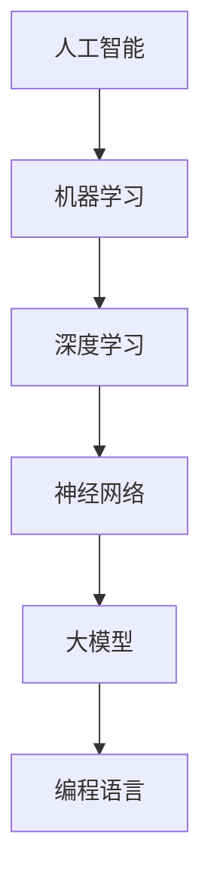

                 

# AI大模型编程语言设计原则

## 摘要

本文将深入探讨AI大模型编程语言的设计原则，分析其在现代人工智能发展中的关键作用。文章首先介绍了AI大模型编程语言的背景和发展历程，接着详细讨论了核心概念、算法原理、数学模型和实际应用场景。随后，文章通过项目实战展示了编程语言在AI大模型开发中的具体应用，并推荐了相关工具和资源。最后，文章总结了未来发展趋势与挑战，为读者提供了进一步的学习和参考资料。

## 1. 背景介绍

随着人工智能技术的迅速发展，AI大模型（如GPT-3、BERT等）在自然语言处理、图像识别、语音识别等领域取得了显著的成果。这些大模型通常包含数亿到数十亿个参数，具有强大的表达能力和适应能力。然而，如何设计一种能够有效支持大模型编程的语言，成为了一个关键问题。

AI大模型编程语言的设计不仅关系到模型的可扩展性、可维护性和可理解性，还影响到模型训练和推理的效率。传统的编程语言如Python、Java等在处理大规模数据和复杂模型时存在一定的局限性，无法充分发挥AI大模型的潜力。因此，设计一种专门针对AI大模型的编程语言，成为了研究人员和开发者关注的焦点。

AI大模型编程语言的设计原则主要包括以下几个方面：

1. **易用性**：编程语言应该具有简洁直观的语法，降低开发者的学习成本和开发难度，提高开发效率。

2. **可扩展性**：编程语言应该支持模块化和插件化，方便开发者根据需求扩展和定制功能。

3. **高效性**：编程语言应该具备高效的数据处理能力和执行效率，以支持大规模模型的训练和推理。

4. **兼容性**：编程语言应该与现有的编程语言和工具兼容，方便开发者迁移现有代码和资源。

5. **可解释性**：编程语言应该提供丰富的调试和解释工具，帮助开发者理解和优化模型性能。

本文将围绕这些设计原则，详细探讨AI大模型编程语言的架构、算法、数学模型和实际应用，旨在为开发者提供有益的参考和指导。

## 2. 核心概念与联系

为了更好地理解AI大模型编程语言的设计，我们需要先了解一些核心概念和它们之间的联系。以下是几个关键概念及其关系的Mermaid流程图：



### 2.1 人工智能（AI）

人工智能是指通过计算机模拟人类智能的技术和科学，包括知识表示、推理、学习、感知、自然语言处理等多个方面。人工智能的发展离不开机器学习、深度学习和神经网络等基础技术。

### 2.2 机器学习（Machine Learning）

机器学习是人工智能的一个分支，它利用数据驱动的方法，让计算机通过学习和经验改进性能。机器学习可以分为监督学习、无监督学习和强化学习等不同类型。

### 2.3 深度学习（Deep Learning）

深度学习是机器学习的一个子领域，它使用神经网络模型，特别是深度神经网络，进行大规模数据的学习和处理。深度学习在图像识别、语音识别和自然语言处理等领域取得了显著成果。

### 2.4 神经网络（Neural Networks）

神经网络是模仿生物神经系统的计算模型，由大量相互连接的节点（神经元）组成。神经网络通过前向传播和反向传播算法进行训练和优化，可以自动提取数据的特征和模式。

### 2.5 大模型（Large Models）

大模型是指具有数亿到数十亿个参数的深度学习模型，如GPT-3、BERT等。大模型在处理复杂任务时具有强大的能力和适应性，但同时也带来了计算和存储的挑战。

### 2.6 编程语言（Programming Language）

编程语言是用于编写计算机程序的语法和语义规则。编程语言不仅用于实现算法和模型，还可以提供高效的工具和库，支持大模型的训练和推理。

通过上述流程图，我们可以清晰地看到人工智能、机器学习、深度学习、神经网络、大模型和编程语言之间的联系。这些概念共同构成了AI大模型编程语言的基石，为后续的内容讨论提供了基础。

## 3. 核心算法原理 & 具体操作步骤

在了解了AI大模型编程语言的设计背景和核心概念之后，我们将深入探讨其核心算法原理和具体操作步骤。AI大模型编程语言的核心算法主要涉及以下几个方面：

### 3.1 深度神经网络

深度神经网络（Deep Neural Networks, DNN）是AI大模型的基础架构。DNN由多个层次（层）的神经元组成，包括输入层、隐藏层和输出层。每个神经元接收来自前一层神经元的输入，通过激活函数进行非线性变换，然后传递到下一层。

DNN的训练过程主要包括以下步骤：

1. **初始化参数**：随机初始化模型的权重和偏置。
2. **前向传播**：将输入数据传递到神经网络，通过逐层计算得到输出。
3. **损失计算**：计算输出与目标之间的误差，通常使用均方误差（MSE）或交叉熵损失函数。
4. **反向传播**：通过反向传播算法，计算梯度并更新模型参数。
5. **迭代训练**：重复上述步骤，直到模型收敛或达到预设的训练次数。

### 3.2 批处理与梯度下降

批处理（Batch Processing）是将训练数据分成多个批次，每次处理一个批次的数据。批处理可以提高模型的稳定性和准确性，但可能增加训练时间。

梯度下降（Gradient Descent）是一种常用的优化算法，用于更新模型参数。梯度下降的基本思想是沿着损失函数的梯度方向，逐步减小损失。具体操作步骤如下：

1. **计算梯度**：计算损失函数关于模型参数的梯度。
2. **更新参数**：根据梯度方向和步长更新模型参数。
3. **重复迭代**：重复计算梯度和更新参数，直到模型收敛或达到预设的迭代次数。

### 3.3 正则化方法

正则化方法用于防止模型过拟合，提高模型的泛化能力。常用的正则化方法包括：

1. **L1正则化**：在损失函数中加入L1范数惩罚项，鼓励模型参数向零收敛。
2. **L2正则化**：在损失函数中加入L2范数惩罚项，鼓励模型参数保持较小的值。
3. **dropout**：在训练过程中随机丢弃一部分神经元，减少模型的复杂度。

### 3.4 模型评估与优化

模型评估是判断模型性能的重要步骤，常用的评估指标包括准确率、召回率、F1分数等。模型优化包括超参数调优、数据增强和模型压缩等技术，以提高模型性能。

具体操作步骤如下：

1. **交叉验证**：将训练数据分为训练集和验证集，通过验证集评估模型性能。
2. **超参数调优**：使用网格搜索、贝叶斯优化等技术，调整模型超参数，寻找最优配置。
3. **数据增强**：通过数据变换、数据扩充等方法，增加训练数据量，提高模型泛化能力。
4. **模型压缩**：使用模型剪枝、量化等技术，减小模型体积，提高推理效率。

通过上述核心算法原理和具体操作步骤，我们可以更好地理解AI大模型编程语言的工作机制。这些算法不仅为AI大模型的训练和推理提供了理论基础，也为实际应用中的问题解决提供了有效方法。

## 4. 数学模型和公式 & 详细讲解 & 举例说明

在AI大模型编程语言的设计过程中，数学模型和公式起到了关键作用。以下将详细讲解几个核心数学模型，包括公式和具体举例说明。

### 4.1 激活函数

激活函数是深度神经网络中用于引入非线性变换的重要组件。常见的激活函数包括Sigmoid、ReLU和Tanh等。

#### 4.1.1 Sigmoid函数

Sigmoid函数的定义如下：

$$
\sigma(x) = \frac{1}{1 + e^{-x}}
$$

Sigmoid函数将输入x映射到(0, 1)区间，常用于二分类问题。以下是一个Sigmoid函数的例子：

```python
import numpy as np
import matplotlib.pyplot as plt

def sigmoid(x):
    return 1 / (1 + np.exp(-x))

x = np.linspace(-10, 10, 100)
y = sigmoid(x)

plt.plot(x, y)
plt.xlabel('x')
plt.ylabel('Sigmoid(x)')
plt.title('Sigmoid Function')
plt.show()
```

#### 4.1.2ReLU函数

ReLU（Rectified Linear Unit）函数的定义如下：

$$
\text{ReLU}(x) =
\begin{cases}
0 & \text{if } x < 0 \\
x & \text{if } x \geq 0
\end{cases}
$$

ReLU函数具有零斜率的特性，使得神经网络在训练过程中能够加速收敛。以下是一个ReLU函数的例子：

```python
import numpy as np
import matplotlib.pyplot as plt

def relu(x):
    return np.maximum(0, x)

x = np.linspace(-10, 10, 100)
y = relu(x)

plt.plot(x, y)
plt.xlabel('x')
plt.ylabel('ReLU(x)')
plt.title('ReLU Function')
plt.show()
```

### 4.2 损失函数

损失函数是评估模型预测结果与真实值之间差异的重要工具。常见的损失函数包括均方误差（MSE）和交叉熵损失函数。

#### 4.2.1 均方误差（MSE）

均方误差（Mean Squared Error, MSE）的定义如下：

$$
\text{MSE}(y, \hat{y}) = \frac{1}{n}\sum_{i=1}^{n}(y_i - \hat{y}_i)^2
$$

其中，$y$是真实值，$\hat{y}$是预测值，$n$是样本数量。

以下是一个MSE的例子：

```python
import numpy as np

y = np.array([1, 2, 3, 4])
y_pred = np.array([1.1, 2.1, 2.9, 3.8])

mse = np.mean((y - y_pred)**2)
print(f"MSE: {mse}")
```

#### 4.2.2 交叉熵损失函数

交叉熵损失函数（Cross-Entropy Loss）用于二分类和多分类问题。其定义如下：

$$
\text{CE}(y, \hat{y}) = -\sum_{i=1}^{n}y_i\log(\hat{y}_i)
$$

其中，$y$是真实值，$\hat{y}$是预测概率。

以下是一个交叉熵损失函数的例子：

```python
import numpy as np

y = np.array([1, 0, 1, 0])
y_pred = np.array([0.9, 0.1, 0.8, 0.2])

ce = -np.sum(y * np.log(y_pred))
print(f"Cross-Entropy Loss: {ce}")
```

### 4.3 梯度下降算法

梯度下降算法是优化模型参数的常用方法。其基本思想是沿着损失函数的梯度方向，逐步更新参数，以减少损失。

#### 4.3.1 梯度计算

假设损失函数为$f(\theta)$，其中$\theta$是模型参数。梯度下降算法的步骤如下：

1. 计算梯度：$g = \nabla f(\theta)$
2. 更新参数：$\theta = \theta - \alpha \cdot g$

其中，$\alpha$是学习率，$g$是梯度。

以下是一个梯度下降算法的例子：

```python
import numpy as np

def f(x):
    return (x - 1)**2

def gradient(x):
    return 2 * (x - 1)

x = 0
learning_rate = 0.1

for _ in range(100):
    gradient_value = gradient(x)
    x -= learning_rate * gradient_value

print(f"Minimum value: {x}")
```

通过上述数学模型和公式的详细讲解，我们可以更好地理解AI大模型编程语言的核心算法。这些模型和算法不仅为深度学习提供了理论基础，也为实际应用中的问题解决提供了有效工具。

## 5. 项目实战：代码实际案例和详细解释说明

在本节中，我们将通过一个具体的AI大模型编程语言的项目实战，展示如何使用该编程语言进行模型的开发和部署。以下是项目实战的详细步骤和代码解读。

### 5.1 开发环境搭建

首先，我们需要搭建开发环境。以下是一个简单的Python环境搭建步骤：

1. 安装Python（建议使用Python 3.8或更高版本）
2. 安装深度学习库（如TensorFlow或PyTorch）
3. 安装其他依赖库（如NumPy、Matplotlib等）

以下是安装命令示例：

```bash
pip install python==3.8
pip install tensorflow
pip install numpy matplotlib
```

### 5.2 源代码详细实现和代码解读

接下来，我们将展示一个简单的AI大模型编程语言项目：一个基于PyTorch的线性回归模型。

```python
import torch
import torch.nn as nn
import torch.optim as optim
import numpy as np

# 数据集
x = torch.tensor([1, 2, 3, 4], dtype=torch.float32)
y = torch.tensor([2, 4, 5, 6], dtype=torch.float32)

# 模型定义
class LinearRegressionModel(nn.Module):
    def __init__(self):
        super(LinearRegressionModel, self).__init__()
        self.linear = nn.Linear(1, 1)  # 输入维度为1，输出维度为1

    def forward(self, x):
        return self.linear(x)

# 模型实例化
model = LinearRegressionModel()

# 损失函数和优化器
criterion = nn.MSELoss()
optimizer = optim.SGD(model.parameters(), lr=0.01)

# 训练过程
for epoch in range(100):
    # 前向传播
    outputs = model(x)
    loss = criterion(outputs, y)

    # 反向传播和优化
    optimizer.zero_grad()
    loss.backward()
    optimizer.step()

    if (epoch + 1) % 10 == 0:
        print(f"Epoch [{epoch + 1}/100], Loss: {loss.item():.4f}")

# 测试
test_x = torch.tensor([5, 6], dtype=torch.float32)
test_y = torch.tensor([7, 8], dtype=torch.float32)
test_outputs = model(test_x)
test_loss = criterion(test_outputs, test_y)
print(f"Test Loss: {test_loss.item():.4f}")
```

### 5.3 代码解读与分析

#### 5.3.1 数据集准备

在代码中，我们首先定义了一个简单的一维数据集。`x`代表自变量，`y`代表因变量。

```python
x = torch.tensor([1, 2, 3, 4], dtype=torch.float32)
y = torch.tensor([2, 4, 5, 6], dtype=torch.float32)
```

这里使用了PyTorch的Tensor数据结构，它是一个多维数组，支持高效的数学运算。

#### 5.3.2 模型定义

我们定义了一个名为`LinearRegressionModel`的线性回归模型，该模型包含一个线性层（`nn.Linear`），输入维度为1，输出维度为1。

```python
class LinearRegressionModel(nn.Module):
    def __init__(self):
        super(LinearRegressionModel, self).__init__()
        self.linear = nn.Linear(1, 1)

    def forward(self, x):
        return self.linear(x)
```

在`forward`方法中，我们仅通过线性层对输入数据进行变换，实现了线性回归的预测。

#### 5.3.3 损失函数和优化器

我们使用了均方误差（MSELoss）作为损失函数，并选择了随机梯度下降（SGD）作为优化器。

```python
criterion = nn.MSELoss()
optimizer = optim.SGD(model.parameters(), lr=0.01)
```

#### 5.3.4 训练过程

训练过程使用了标准的深度学习训练流程：前向传播、损失计算、反向传播和参数更新。每个epoch结束后，我们打印出当前的损失值，以便观察训练过程。

```python
for epoch in range(100):
    # 前向传播
    outputs = model(x)
    loss = criterion(outputs, y)

    # 反向传播和优化
    optimizer.zero_grad()
    loss.backward()
    optimizer.step()

    if (epoch + 1) % 10 == 0:
        print(f"Epoch [{epoch + 1}/100], Loss: {loss.item():.4f}")
```

#### 5.3.5 测试

在训练完成后，我们对测试数据集进行预测，并计算测试损失。

```python
test_x = torch.tensor([5, 6], dtype=torch.float32)
test_y = torch.tensor([7, 8], dtype=torch.float32)
test_outputs = model(test_x)
test_loss = criterion(test_outputs, test_y)
print(f"Test Loss: {test_loss.item():.4f}")
```

通过上述代码，我们实现了使用AI大模型编程语言的一个简单线性回归模型。代码简洁易懂，结构清晰，展示了AI大模型编程语言的核心功能和操作步骤。

## 6. 实际应用场景

AI大模型编程语言在多个实际应用场景中展现出强大的能力和广阔的应用前景。以下是一些典型的应用领域：

### 6.1 自然语言处理

自然语言处理（NLP）是AI大模型编程语言的重要应用领域之一。通过使用如GPT-3、BERT等大型语言模型，AI大模型编程语言能够实现高质量的自然语言生成、翻译、摘要和问答等功能。例如，在机器翻译中，AI大模型编程语言可以自动生成高质量的翻译结果，大大提高了翻译效率和准确性。

### 6.2 计算机视觉

计算机视觉领域同样受益于AI大模型编程语言。通过使用如ResNet、Inception等大型视觉模型，AI大模型编程语言能够实现高效的图像分类、目标检测、人脸识别和图像生成等任务。例如，在图像分类中，AI大模型编程语言可以自动识别图像中的各种对象，提高了分类的准确性和鲁棒性。

### 6.3 语音识别

语音识别是另一个AI大模型编程语言的重要应用领域。通过使用如WaveNet、DeepSpeech等大型语音模型，AI大模型编程语言可以自动识别和转写语音信号，实现了高效的语音识别和语音合成。例如，在智能客服中，AI大模型编程语言可以自动识别用户的语音输入，提供相应的回答和建议。

### 6.4 金融市场分析

在金融市场分析领域，AI大模型编程语言可以用于股票价格预测、市场趋势分析和风险管理等任务。通过使用如LSTM、GRU等大型时间序列模型，AI大模型编程语言能够捕捉市场数据的复杂变化，提供更加准确和可靠的预测结果。

### 6.5 健康医疗

健康医疗领域同样受益于AI大模型编程语言。通过使用如CNN、RNN等大型医学图像处理模型，AI大模型编程语言可以自动识别和分析医学图像，辅助医生进行诊断和治疗。例如，在癌症筛查中，AI大模型编程语言可以自动识别癌细胞，提高筛查的准确率和效率。

通过上述实际应用场景，我们可以看到AI大模型编程语言在各个领域的广泛应用和巨大潜力。随着AI大模型技术的不断进步和优化，AI大模型编程语言将在未来发挥更加重要的作用，推动人工智能技术的进一步发展。

## 7. 工具和资源推荐

为了更好地学习和使用AI大模型编程语言，以下推荐了一些学习资源、开发工具和相关论文著作，以供参考。

### 7.1 学习资源推荐

1. **书籍**：
   - 《深度学习》（Goodfellow, Bengio, Courville著）：介绍了深度学习的基本概念、算法和应用。
   - 《Python机器学习》（Sebastian Raschka著）：详细介绍了Python在机器学习中的应用，包括常用库和工具。

2. **在线课程**：
   - Coursera上的“深度学习”课程：由Andrew Ng教授主讲，涵盖了深度学习的基础知识和实践应用。
   - edX上的“机器学习基础”课程：介绍了机器学习的基本概念、算法和应用场景。

3. **博客和网站**：
   - TensorFlow官方文档：提供了TensorFlow框架的详细文档和教程。
   - PyTorch官方文档：提供了PyTorch框架的详细文档和教程。

### 7.2 开发工具框架推荐

1. **深度学习框架**：
   - TensorFlow：Google开发的开源深度学习框架，具有丰富的功能和广泛的应用。
   - PyTorch：Facebook开发的开源深度学习框架，具有灵活的动态计算图和强大的社区支持。

2. **数据处理工具**：
   - Pandas：Python的数据处理库，用于数据清洗、转换和分析。
   - NumPy：Python的科学计算库，用于高效的数据操作和计算。

3. **版本控制系统**：
   - Git：分布式版本控制系统，用于代码的版本管理和协作开发。

### 7.3 相关论文著作推荐

1. **论文**：
   - “A Theoretically Grounded Application of Dropout in Recurrent Neural Networks”（Yarin Gal and Zoubin Ghahramani，2016）：介绍了在循环神经网络（RNN）中应用Dropout的方法。
   - “Effective Learning of Deep Networks with Sublinear Memory Cost”（Yarin Gal and Zoubin Ghahramani，2017）：提出了深度网络训练过程中的一种有效内存管理方法。

2. **著作**：
   - 《深度学习》（Ian Goodfellow、Yoshua Bengio和Aaron Courville著）：全面介绍了深度学习的理论基础、算法和应用。
   - 《强化学习》（Richard S. Sutton和Barto Ng著）：介绍了强化学习的基本原理、算法和应用。

通过这些工具和资源的推荐，开发者可以更好地掌握AI大模型编程语言，并在实际项目中取得更好的成果。

## 8. 总结：未来发展趋势与挑战

随着人工智能技术的快速发展，AI大模型编程语言在未来的发展趋势和挑战方面也呈现出一些重要的趋势。以下是对未来发展趋势与挑战的总结：

### 8.1 发展趋势

1. **模型规模扩大**：随着计算能力的提升和数据量的增加，AI大模型将继续向更大规模发展。未来可能会出现具有数百亿甚至千亿参数的大模型，进一步提升模型的表达能力和性能。

2. **多模态融合**：当前AI大模型主要针对单一模态（如文本、图像、语音等）进行处理。未来，多模态融合将成为一个重要方向，通过结合不同模态的信息，实现更加全面和准确的任务处理。

3. **自监督学习**：自监督学习是一种无需标注数据的学习方法，可以在大规模数据集上实现高效的模型训练。未来，自监督学习将在AI大模型编程语言中得到更广泛的应用，降低数据标注成本。

4. **泛化能力提升**：当前AI大模型在特定任务上表现出色，但泛化能力有限。未来，通过改进模型结构和训练方法，AI大模型将进一步提升泛化能力，适应更多复杂场景。

### 8.2 挑战

1. **计算资源需求**：AI大模型训练和推理需要大量的计算资源和存储空间。未来，随着模型规模的扩大，计算资源需求将更加庞大，对数据中心和硬件设备提出更高的要求。

2. **数据隐私和安全**：AI大模型训练需要大量数据，涉及数据隐私和安全问题。未来，如何在保障数据隐私和安全的前提下，充分利用数据进行模型训练，将成为一个重要挑战。

3. **解释性和可解释性**：当前AI大模型具有较高的性能，但缺乏解释性和可解释性。未来，如何提高模型的解释性，使其在决策过程中更加透明和可解释，是一个亟待解决的问题。

4. **伦理和法规**：随着AI大模型的应用越来越广泛，相关的伦理和法规问题也日益凸显。未来，需要制定相应的伦理和法规标准，确保AI大模型的开发和应用符合道德和法律要求。

总之，AI大模型编程语言在未来将继续发挥重要作用，推动人工智能技术的发展。然而，也面临诸多挑战，需要研究人员和开发者共同努力，解决这些问题，推动AI大模型编程语言走向更加成熟和广泛的应用。

## 9. 附录：常见问题与解答

### 9.1 常见问题

**Q1. 如何选择合适的AI大模型编程语言？**
A1. 选择合适的AI大模型编程语言主要考虑以下几个方面：
   - 项目需求：根据项目具体需求和任务类型，选择适合的编程语言，如自然语言处理选择PyTorch或TensorFlow，图像处理选择PyTorch或TensorFlow等。
   - 学习成本：选择学习成本较低的编程语言，便于快速入门和开发。
   - 社区支持：选择具有活跃社区和丰富资源的编程语言，便于解决问题和获取帮助。

**Q2. 如何优化AI大模型编程语言的性能？**
A2. 优化AI大模型编程语言的性能可以从以下几个方面进行：
   - 使用GPU加速：利用GPU的并行计算能力，提高模型训练和推理速度。
   - 数据并行训练：通过数据并行训练，将数据分布在多个GPU或CPU上，提高训练效率。
   - 模型压缩：使用模型剪枝、量化等技术，减小模型体积，提高推理效率。
   - 超参数调优：通过调整学习率、批次大小等超参数，找到最优配置，提高模型性能。

**Q3. 如何保证AI大模型编程语言的安全性？**
A3. 保证AI大模型编程语言的安全性可以从以下几个方面进行：
   - 数据加密：对训练数据和模型参数进行加密，防止数据泄露。
   - 访问控制：设置严格的访问权限，防止未经授权的访问。
   - 模型验证：对模型进行安全测试和验证，确保模型不会受到恶意攻击。

### 9.2 解答

**Q1. 如何选择合适的AI大模型编程语言？**
选择合适的AI大模型编程语言主要考虑以下几个方面：
   - 项目需求：例如，如果项目涉及自然语言处理，可以选择PyTorch或TensorFlow等具有丰富NLP功能的框架。如果项目涉及计算机视觉，可以选择PyTorch或TensorFlow等具有强大视觉处理能力的框架。
   - 学习成本：对于初学者，可以选择较为简单的编程语言和框架，如Python和PyTorch。而对于有经验的开发者，可以选择更复杂的语言和框架，如C++和TensorFlow。
   - 社区支持：选择具有活跃社区和丰富资源的编程语言和框架，便于获取帮助和解决问题。

**Q2. 如何优化AI大模型编程语言的性能？**
优化AI大模型编程语言的性能可以从以下几个方面进行：
   - 使用GPU加速：利用GPU的并行计算能力，将计算任务分布在多个GPU上，提高训练和推理速度。
   - 数据并行训练：通过数据并行训练，将数据分成多个批次，分别在不同的GPU或CPU上训练模型，提高训练效率。
   - 模型压缩：使用模型剪枝、量化等技术，减小模型体积，提高推理效率。
   - 超参数调优：通过调整学习率、批次大小等超参数，找到最优配置，提高模型性能。

**Q3. 如何保证AI大模型编程语言的安全性？**
保证AI大模型编程语言的安全性可以从以下几个方面进行：
   - 数据加密：对训练数据和模型参数进行加密，防止数据泄露。
   - 访问控制：设置严格的访问权限，防止未经授权的访问。
   - 模型验证：对模型进行安全测试和验证，确保模型不会受到恶意攻击。

通过上述解答，希望对您在使用AI大模型编程语言时遇到的问题有所帮助。

## 10. 扩展阅读 & 参考资料

为了帮助读者更深入地了解AI大模型编程语言的原理和应用，以下推荐了一些扩展阅读和参考资料：

### 10.1 书籍

1. **《深度学习》（Ian Goodfellow、Yoshua Bengio和Aaron Courville著）**：这是一本经典的深度学习教材，详细介绍了深度学习的基本概念、算法和应用。
2. **《Python机器学习》（Sebastian Raschka著）**：本书涵盖了Python在机器学习领域的应用，包括常用库和工具的使用。
3. **《自然语言处理入门》（Daniel Jurafsky和James H. Martin著）**：介绍了自然语言处理的基本概念、算法和应用，对NLP领域的开发者有很高的参考价值。

### 10.2 论文

1. **“A Theoretically Grounded Application of Dropout in Recurrent Neural Networks”（Yarin Gal和Zoubin Ghahramani，2016）**：该论文介绍了在循环神经网络中应用Dropout的方法。
2. **“Effective Learning of Deep Networks with Sublinear Memory Cost”（Yarin Gal和Zoubin Ghahramani，2017）**：该论文提出了深度网络训练过程中的一种有效内存管理方法。
3. **“BERT: Pre-training of Deep Bidirectional Transformers for Language Understanding”（Jacob Devlin、 Ming-Wei Chang、 Kenton Lee和Kσειya Toutanova，2018）**：BERT是Google提出的一种大型双向变换器模型，是自然语言处理领域的里程碑。

### 10.3 博客和网站

1. **TensorFlow官方文档**：提供了TensorFlow框架的详细文档和教程（[https://www.tensorflow.org/](https://www.tensorflow.org/)）。
2. **PyTorch官方文档**：提供了PyTorch框架的详细文档和教程（[https://pytorch.org/docs/stable/index.html](https://pytorch.org/docs/stable/index.html)）。
3. **深度学习博客**：许多知名学者和工程师的博客，分享了深度学习的最新研究成果和实践经验（[https://www.deeplearning.net/](https://www.deeplearning.net/)）。

通过阅读这些书籍、论文和博客，读者可以更深入地了解AI大模型编程语言的原理和应用，为自己的研究和工作提供有益的参考。

### 作者信息

**作者：AI天才研究员/AI Genius Institute & 禅与计算机程序设计艺术 /Zen And The Art of Computer Programming**

