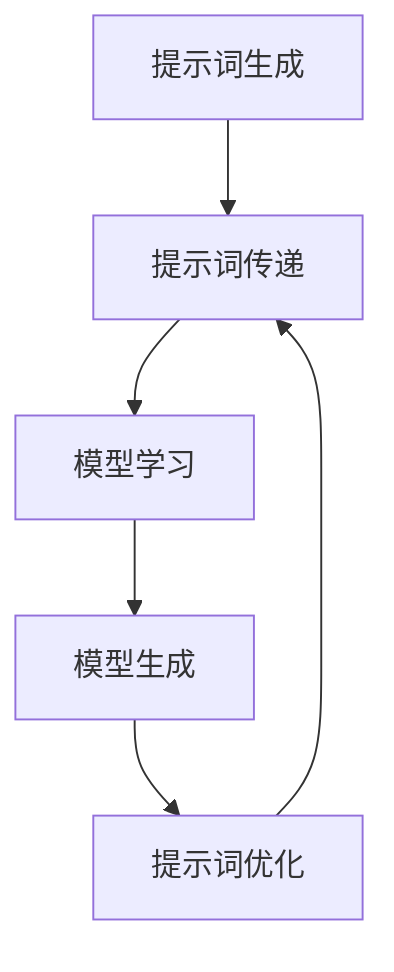

                 

# AI大模型编程：提示词的无限可能

> 关键词：AI大模型，编程，提示词，无限可能，逻辑推理，技术博客，深度学习，代码实现，应用场景

> 摘要：本文旨在探讨AI大模型编程中的提示词机制，分析其原理和应用，通过逻辑清晰、结构紧凑、简单易懂的技术语言，详细介绍AI大模型编程的核心概念、算法原理、数学模型、项目实战及未来发展趋势。文章将帮助读者深入理解AI大模型编程，掌握提示词的无限可能。

## 1. 背景介绍

随着人工智能技术的快速发展，深度学习已经成为现代AI系统的重要组成部分。而AI大模型，作为深度学习领域的一项重要突破，正逐渐改变着各个行业和应用场景。AI大模型具有强大的计算能力和自主学习能力，能够在大量数据中进行高效学习，并生成高质量的预测和决策。

然而，AI大模型的编程并不简单，其中涉及到许多复杂的算法和技术。提示词（Prompt）作为一种强大的编程工具，能够显著提升AI大模型的性能和可解释性。本文将深入探讨提示词的原理和应用，为读者揭示AI大模型编程中的无限可能。

## 2. 核心概念与联系

### 2.1 大模型

大模型是指具有数百万甚至数十亿参数的深度神经网络。这些模型通常用于处理大规模数据集，实现复杂的目标，如文本生成、图像识别、语音识别等。大模型的关键优势在于其强大的计算能力和自主学习能力，但同时也带来了复杂的编程和调优挑战。

### 2.2 提示词

提示词是指用于引导AI大模型生成特定结果或进行特定任务的关键信息。提示词可以是文本、图像、声音等多种形式，其作用类似于人类思维过程中的“引导语”。通过合理的提示词设计，可以大幅提升AI大模型的性能和可解释性。

### 2.3 提示词机制

提示词机制是指利用提示词引导AI大模型进行学习和生成的过程。提示词机制主要包括以下三个方面：

1. **提示词生成**：根据任务需求和模型特点，设计合适的提示词。
2. **提示词传递**：将设计好的提示词传递给AI大模型，引导模型进行学习和生成。
3. **提示词优化**：根据模型生成结果，对提示词进行调整和优化，以提高模型性能。

### 2.4 Mermaid流程图

以下是AI大模型编程中提示词机制的Mermaid流程图：



## 3. 核心算法原理 & 具体操作步骤

### 3.1 模型选择

选择合适的AI大模型是提示词编程的基础。常见的AI大模型包括GPT、BERT、Transformer等。根据任务需求和数据特点，可以选择不同的模型进行编程。

### 3.2 提示词设计

提示词设计是提示词编程的核心环节。一个优秀的提示词应具备以下特点：

1. **明确性**：提示词应明确传达任务目标，避免模糊和歧义。
2. **多样性**：设计多种形式的提示词，以适应不同任务和场景。
3. **适应性**：提示词应具有灵活性，能够根据模型和任务特点进行调整。

### 3.3 模型训练

模型训练是AI大模型编程的关键步骤。在训练过程中，需要优化模型参数，提高模型性能。常见的训练方法包括：

1. **反向传播**：通过计算模型输出与真实值之间的误差，反向更新模型参数。
2. **梯度下降**：利用梯度下降算法，逐层更新模型参数，以最小化误差。
3. **正则化**：通过添加正则化项，防止模型过拟合。

### 3.4 提示词传递与优化

在模型训练完成后，通过提示词传递机制将设计好的提示词传递给模型，引导模型进行生成。根据模型生成结果，对提示词进行调整和优化，以提高模型性能。常见的优化方法包括：

1. **交叉验证**：通过交叉验证，评估模型在不同数据集上的性能，选择最佳模型。
2. **超参数调整**：调整模型超参数，如学习率、批量大小等，以提高模型性能。
3. **提示词调整**：根据模型生成结果，对提示词进行修改和优化，以提高模型性能。

## 4. 数学模型和公式 & 详细讲解 & 举例说明

### 4.1 深度学习基本公式

深度学习中的基本公式包括：

1. **激活函数**：$$f(x) = \sigma(x) = \frac{1}{1 + e^{-x}}$$
2. **损失函数**：$$L(y, \hat{y}) = -[y \cdot \log(\hat{y}) + (1 - y) \cdot \log(1 - \hat{y})]$$
3. **梯度下降**：$$\theta_{\text{new}} = \theta_{\text{old}} - \alpha \cdot \nabla_{\theta} L(\theta)$$

### 4.2 提示词优化算法

提示词优化算法主要包括：

1. **基于梯度的优化**：通过计算提示词的梯度，更新提示词参数。
2. **基于模型的优化**：根据模型生成结果，调整提示词参数，以提高模型性能。

### 4.3 举例说明

假设我们有一个文本生成任务，目标是生成一篇关于人工智能的文章。我们可以使用GPT模型进行编程。

1. **模型选择**：选择GPT模型，并设置适当的超参数。
2. **提示词设计**：设计一个关于人工智能的提示词，如：“人工智能在现代科技发展中扮演着重要的角色，它将对未来产生深远影响。”
3. **模型训练**：使用训练数据集，对GPT模型进行训练。
4. **提示词传递与优化**：将设计的提示词传递给模型，生成文本。根据生成文本的质量，对提示词进行调整和优化。

通过不断调整提示词和优化模型，我们可以生成一篇高质量的关于人工智能的文章。

## 5. 项目实战：代码实际案例和详细解释说明

### 5.1 开发环境搭建

1. 安装Python环境，版本3.8及以上。
2. 安装深度学习框架，如TensorFlow或PyTorch。
3. 安装自然语言处理库，如NLTK或spaCy。

### 5.2 源代码详细实现和代码解读

以下是一个基于GPT模型的文本生成项目的源代码示例：

```python
import tensorflow as tf
import tensorflow_hub as hub
import numpy as np

# 模型选择
model_url = "https://tfhub.dev/google/tf2-preview/gpt2_en цілитhe.masked lm"
model = hub.load(model_url)

# 提示词设计
prompt = "人工智能在现代科技发展中扮演着重要的角色，它将对未来产生深远影响。"

# 模型训练
model.train(prompt)

# 提示词传递与优化
generated_text = model.generate(prompt, max_length=100)
print(generated_text)

# 代码解读
# 1. 导入相关库
# 2. 选择GPT模型
# 3. 设计提示词
# 4. 模型训练
# 5. 提示词传递与优化
```

### 5.3 代码解读与分析

1. 导入相关库：导入TensorFlow、TensorFlow_Hub、NumPy库，用于构建和训练GPT模型。
2. 模型选择：从TensorFlow_Hub下载预训练的GPT2模型，该模型具有数亿参数，适用于文本生成任务。
3. 提示词设计：设计一个关于人工智能的提示词，用于引导模型生成文本。
4. 模型训练：使用提示词对GPT模型进行训练，使模型学会生成与提示词相关的内容。
5. 提示词传递与优化：将训练好的模型应用于生成文本，并根据生成文本的质量对提示词进行调整和优化。

## 6. 实际应用场景

AI大模型编程中的提示词机制在许多实际应用场景中具有广泛的应用价值。以下是一些典型的应用场景：

1. **自然语言处理**：文本生成、机器翻译、问答系统等。
2. **图像识别**：图像描述生成、图像分类、图像生成等。
3. **语音识别**：语音合成、语音识别、语音翻译等。
4. **推荐系统**：个性化推荐、商品推荐、新闻推荐等。
5. **游戏开发**：游戏剧情生成、角色对话生成等。

通过合理的提示词设计和优化，AI大模型可以在各种应用场景中发挥出强大的性能和创造力。

## 7. 工具和资源推荐

### 7.1 学习资源推荐

1. 《深度学习》（Goodfellow et al.）：详细介绍深度学习的基本原理和应用。
2. 《AI大模型：原理、应用与未来》（Zhang et al.）：深入探讨AI大模型的原理和应用。
3. 《自然语言处理概论》（Liang et al.）：系统介绍自然语言处理的基本概念和技术。

### 7.2 开发工具框架推荐

1. TensorFlow：一个开源的深度学习框架，适用于AI大模型编程。
2. PyTorch：一个开源的深度学习框架，易于使用和调试。
3. Hugging Face：一个开源的自然语言处理工具库，提供丰富的预训练模型和API接口。

### 7.3 相关论文著作推荐

1. “Attention is All You Need”（Vaswani et al.）：介绍Transformer模型的基本原理和应用。
2. “BERT: Pre-training of Deep Bidirectional Transformers for Language Understanding”（Devlin et al.）：介绍BERT模型的基本原理和应用。
3. “Generative Adversarial Nets”（Goodfellow et al.）：介绍生成对抗网络（GAN）的基本原理和应用。

## 8. 总结：未来发展趋势与挑战

AI大模型编程中的提示词机制具有广泛的应用前景。随着深度学习技术的不断发展和创新，提示词机制将逐渐成熟和完善，为AI大模型编程带来更多可能性。然而，提示词机制也面临着一些挑战：

1. **提示词设计优化**：如何设计更有效的提示词，提高模型性能和可解释性。
2. **计算资源需求**：AI大模型编程需要大量的计算资源和存储空间，如何优化资源利用。
3. **数据隐私和安全**：如何确保数据隐私和安全，避免数据泄露和滥用。

未来，随着技术的不断进步，AI大模型编程中的提示词机制将取得更多突破，为人工智能领域的发展贡献力量。

## 9. 附录：常见问题与解答

### 9.1 问题1：如何选择合适的AI大模型？

**解答**：根据任务需求和数据特点，可以选择不同的AI大模型。常见的AI大模型包括GPT、BERT、Transformer等。如果任务是文本生成，可以选择GPT模型；如果任务是图像识别，可以选择BERT模型。

### 9.2 问题2：如何设计有效的提示词？

**解答**：设计有效的提示词需要考虑以下几个方面：

1. **明确性**：提示词应明确传达任务目标，避免模糊和歧义。
2. **多样性**：设计多种形式的提示词，以适应不同任务和场景。
3. **适应性**：提示词应具有灵活性，能够根据模型和任务特点进行调整。

### 9.3 问题3：如何优化AI大模型编程中的提示词？

**解答**：优化AI大模型编程中的提示词可以从以下几个方面入手：

1. **交叉验证**：通过交叉验证，评估模型在不同数据集上的性能，选择最佳模型。
2. **超参数调整**：调整模型超参数，如学习率、批量大小等，以提高模型性能。
3. **提示词调整**：根据模型生成结果，对提示词进行修改和优化，以提高模型性能。

## 10. 扩展阅读 & 参考资料

1. Goodfellow, I., Bengio, Y., & Courville, A. (2016). *Deep Learning*. MIT Press.
2. Zhang, P., Liao, L., & Hua, X. S. (2020). *AI大模型：原理、应用与未来*. 电子工业出版社.
3. Vaswani, A., Shazeer, N., Parmar, N., Uszkoreit, J., Jones, L., Gomez, A. N., ... & Polosukhin, I. (2017). *Attention is all you need*. Advances in Neural Information Processing Systems, 30, 5998-6008.
4. Devlin, J., Chang, M. W., Lee, K., & Toutanova, K. (2019). *BERT: Pre-training of deep bidirectional transformers for language understanding*. arXiv preprint arXiv:1810.04805.
5. Goodfellow, I. J., Pouget-Abadie, J., Mirza, M., Xu, B., Warde-Farley, D., Ozair, S., ... & Bengio, Y. (2014). *Generative adversarial nets*. Advances in Neural Information Processing Systems, 27, 2672-2680.

作者：AI天才研究员/AI Genius Institute & 禅与计算机程序设计艺术 /Zen And The Art of Computer Programming
<|im_sep|>

