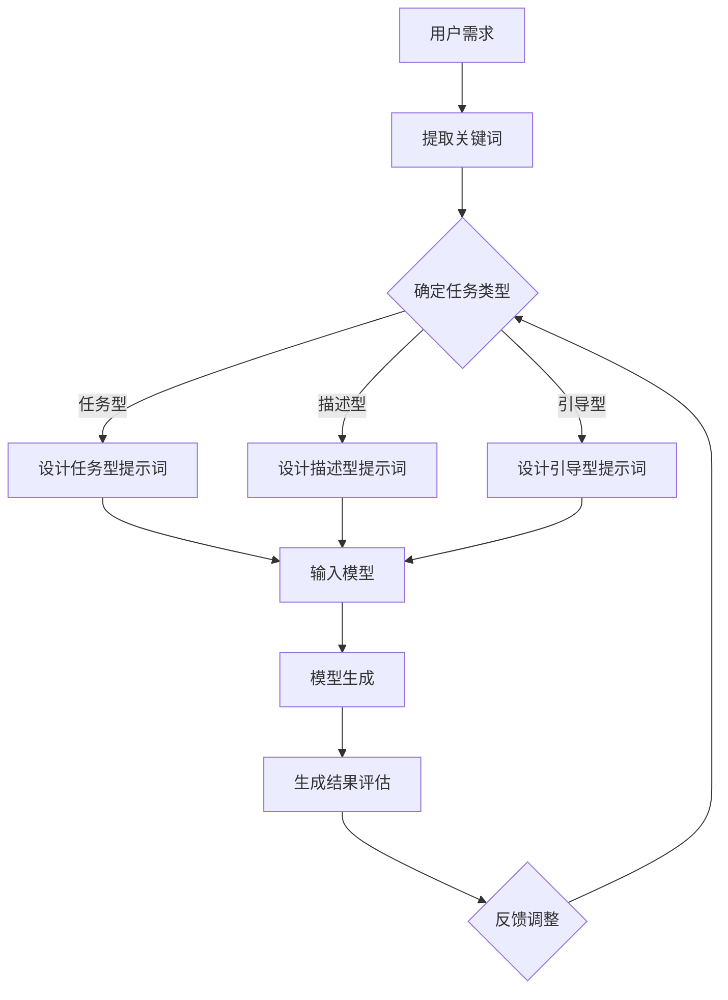

                 

### 背景介绍

近年来，人工智能（AI）领域经历了一场前所未有的变革，尤其是大型语言模型（Large-scale Language Models）的兴起。这些模型不仅引发了学术界和工业界的广泛关注，还逐渐渗透到我们日常生活的方方面面。从智能助手到自然语言处理（NLP）应用，从搜索引擎优化到内容生成，大型语言模型正逐步改变着我们的互动方式。

在所有这些模型中，最具代表性的是GPT（Generative Pre-trained Transformer）系列。GPT-3，作为GPT家族的佼佼者，拥有令人瞩目的参数数量和强大的文本生成能力。GPT-3的诞生，标志着AI语言模型在理解和生成自然语言方面迈出了重要的一步。然而，这个巨大进步的背后，是一个更为复杂的问题：如何有效地与这些模型进行交互，即如何为模型提供适当的提示词（Prompt）。

提示词在AI模型中的作用至关重要。一个优质的提示词能够极大地提升模型的响应质量和效率。然而，设计合适的提示词并非易事，它需要深入理解模型的内部工作机制，以及语言和上下文信息的微妙之处。本文将围绕这个核心问题展开讨论，从背景介绍到具体实现，再到实际应用场景，逐步探讨提示词在大型语言模型中的重要性以及如何优化设计。

通过本文的阅读，读者将了解到：

1. 大型语言模型的背景及其在AI领域的重要性。
2. 提示词的定义、类型及其对模型性能的影响。
3. 提示词的设计原则和方法，包括语法、语义和上下文的考量。
4. 实际应用中如何利用提示词优化模型交互。
5. 未来提示词领域的发展趋势和面临的挑战。

本文旨在为从事AI研究和开发的读者提供一份全面的指南，帮助他们在实际项目中更好地利用大型语言模型，提高模型的应用效果和用户体验。

## 2. 核心概念与联系

在深入探讨提示词的作用之前，我们需要先了解一些核心概念，包括自然语言处理、语言模型和提示词本身。这些概念构成了我们对大型语言模型及其交互方式理解的基础。

### 自然语言处理（NLP）

自然语言处理是计算机科学和人工智能的一个分支，旨在使计算机能够理解和处理人类语言。NLP涵盖了文本的解析、理解、生成和交互等多个方面。其核心目标是实现人与机器之间的自然对话，提高信息检索和自动化的效率。

在NLP中，语言模型是一个关键工具。它通过统计或机器学习方法，学习自然语言的规律，从而实现对文本的生成、分类和翻译等功能。语言模型可以分为统计模型和基于深度学习的模型。统计模型如N-gram模型，基于语言的概率统计特性；而深度学习模型如Transformer，则通过多层神经网络学习语言的高级语义特征。

### 语言模型

语言模型是自然语言处理的核心，它通过对大量文本数据的学习，生成符合语言规则的句子。在语言模型中，Transformer架构因其并行计算能力和对长距离依赖关系的良好处理，成为了当前最流行的模型之一。Transformer引入了自注意力机制（Self-Attention），使得模型能够在处理输入序列时，对序列中的每个词赋予不同的权重，从而更好地捕捉文本中的语义信息。

GPT系列模型，作为Transformer架构的代表，具有巨大的参数规模和强大的文本生成能力。GPT-3更是达到了1750亿个参数的惊人规模，使其在多种NLP任务上取得了优异的性能。GPT-3的强大能力源于其预训练过程，即在大量文本数据上训练模型，使其掌握语言的一般规律，然后再通过微调（Fine-tuning）适应特定任务。

### 提示词

提示词（Prompt）是用户为语言模型提供的信息，用于指导模型的生成行为。一个好的提示词能够明确地指示模型所需完成的任务，从而提高生成的质量。提示词可以是一个单词、短语或完整的句子，其形式和内容取决于具体的应用场景。

根据形式，提示词可以分为以下几种类型：

1. **简单提示词**：这种提示词通常是一个或几个关键词，用于引导模型生成相关内容。例如，用户输入“写一篇关于人工智能的文章”，模型就会生成一篇关于人工智能的文章。
2. **复合提示词**：复合提示词由多个关键词或短语组成，用于提供更丰富的上下文信息。例如，“请用中文写一篇关于GPT-3的摘要，不超过100字。”
3. **上下文提示词**：这种提示词不仅包含关键词，还包括上下文信息，使得模型能够更好地理解任务的背景和目标。例如，“请基于下面的文本生成一段评论：本文介绍了GPT-3的原理和应用。”

根据内容，提示词可以分为以下几种类型：

1. **任务型提示词**：这种提示词直接指示模型所需完成的任务，例如“生成一篇论文摘要”、“写一篇营销文案”等。
2. **描述型提示词**：这种提示词提供对任务的描述或背景信息，例如“请描述一下GPT-3的优缺点”、“请分析一下人工智能的发展趋势”等。
3. **引导型提示词**：这种提示词通过引导模型思考，激发其创造力，例如“请发挥想象力，写一篇科幻小说”、“请以某个场景为背景，编写一个故事”。

### 提示词与模型性能的关系

提示词的质量直接影响模型的生成效果。一个合适的提示词能够帮助模型更好地理解用户的需求，从而生成更准确、更具创造性的内容。以下是几个关键点：

1. **明确性**：提示词需要明确地传达用户的需求，避免歧义。模糊的提示词可能导致模型生成不准确或不相关的结果。
2. **上下文相关性**：提示词应提供足够的上下文信息，使得模型能够更好地理解任务的背景和目标。缺乏上下文的提示词可能导致模型生成内容偏离实际需求。
3. **引导性**：合适的提示词应能够引导模型思考，激发其创造力和灵活性。单一的、指令性的提示词可能限制模型的生成能力，导致生成结果缺乏多样性。
4. **可扩展性**：提示词的设计应具备一定的可扩展性，以适应不同的应用场景和需求。一个通用的、可灵活调整的提示词能够提高模型在不同任务上的应用效果。

### 提示词的设计原则和方法

为了设计出高质量的提示词，我们需要遵循以下原则：

1. **明确任务需求**：在编写提示词时，首先要明确用户的具体需求，确保提示词能够准确地传达任务的目标。
2. **提供上下文信息**：在提示词中包含足够的上下文信息，帮助模型更好地理解任务背景和目标。上下文信息可以是相关的背景知识、历史数据或具体的任务场景。
3. **引导模型思考**：通过引导性问题或描述，激发模型的创造力和灵活性，使其生成更具创意和多样性的内容。
4. **简洁明了**：提示词应简洁明了，避免冗长和复杂的表述，以提高可读性和易理解性。
5. **灵活调整**：根据不同的应用场景和需求，灵活调整提示词的内容和形式，以提高模型在不同任务上的应用效果。

### 综合流程图

为了更直观地展示提示词在模型中的作用，我们可以使用Mermaid流程图来描述这一过程。以下是流程图的文本表示：



通过这个流程图，我们可以看到，用户的需求首先被提取为关键词，然后根据任务类型设计相应的提示词，最终输入到模型中进行生成。生成的结果经过评估后，反馈用于调整提示词，形成一个闭环的过程，以实现更高效的模型交互。

通过以上对自然语言处理、语言模型和提示词的介绍，我们已经建立了对大型语言模型及其交互方式的基本理解。接下来，我们将进一步探讨核心算法原理，深入分析如何优化提示词设计，以提高模型性能和生成效果。

## 3. 核心算法原理 & 具体操作步骤

在深入探讨如何设计优质提示词之前，我们首先需要了解大型语言模型的核心算法原理，特别是GPT-3模型的工作机制。GPT-3是OpenAI开发的一种基于Transformer架构的预训练语言模型，其具有1750亿个参数，能够处理多种自然语言处理任务。本节将详细阐述GPT-3的核心算法原理，包括Transformer架构、自注意力机制（Self-Attention）以及预训练和微调（Fine-tuning）过程。

### Transformer架构

Transformer架构是自然语言处理领域的一项重大突破，首次引入了自注意力机制（Self-Attention），使模型在处理长距离依赖关系方面表现出色。与传统序列模型如RNN（递归神经网络）和LSTM（长短期记忆网络）相比，Transformer能够并行处理输入序列，大大提高了计算效率。

Transformer模型主要由编码器（Encoder）和解码器（Decoder）两部分组成，其中编码器负责将输入序列编码为固定长度的向量，解码器则利用这些向量生成输出序列。

#### 编码器

编码器由多个编码层（Encoder Layer）堆叠而成，每层包括两个子层：多头自注意力（Multi-Head Self-Attention）和前馈神经网络（Feed Forward Neural Network）。多头自注意力机制使得编码器能够同时关注输入序列中的不同位置信息，从而更好地捕捉长距离依赖关系。

1. **多头自注意力（Multi-Head Self-Attention）**

   自注意力机制的核心是计算输入序列中每个词与其他词的相关性，并通过加权求和生成新的表示。多头自注意力则将这个机制扩展到多个注意力头（Attention Head），每个头独立计算注意力权重，最后将多个头的输出拼接起来。

   具体计算过程如下：

   设输入序列为\[X\]，其长度为\[T\]，每个词的嵌入向量为\[e_{i}\]，则自注意力机制的输出为\[O_{i}\]，计算公式为：

   $$O_{i} = \text{softmax}\left(\frac{Q_{i}W_{K}^{T}V}{\sqrt{d_{k}}\right)V$$

   其中，\[Q_{i}\]、\[K_{i}\]和\[V_{i}\]分别为查询向量、键向量和值向量，\[W_{K}\]、\[W_{Q}\]和\[W_{V}\]为权重矩阵，\[d_{k}\]为每个头的维度。softmax函数用于计算注意力权重，从而对输入序列中的词进行加权求和。

2. **前馈神经网络（Feed Forward Neural Network）**

   在多头自注意力之后，编码器通过前馈神经网络进一步处理输入。前馈神经网络由两个全连接层组成，分别对输入进行激活函数（ReLU）处理。具体计算公式为：

   $$\text{FFN}(X) = \text{ReLU}\left(W_{2} \cdot \text{ReLU}\left(W_{1} \cdot X + b_{1}\right) + b_{2}\right)$$

   其中，\[W_{1}\]、\[W_{2}\]和\[b_{1}\]、\[b_{2}\]分别为权重和偏置矩阵。

#### 解码器

解码器与编码器结构类似，但多了一个额外的自注意力机制，用于处理输入序列和已生成的输出序列之间的依赖关系。解码器同样由多个解码层（Decoder Layer）堆叠而成，每层包括多头自注意力和前馈神经网络。

1. **多头自注意力（Multi-Head Self-Attention）**

   解码器的多头自注意力分为两个步骤：

   - **掩码自注意力（Masked Self-Attention）**：在生成每个词时，解码器仅关注之前生成的词，而不关注尚未生成的词。通过在自注意力机制中引入掩码（Mask），解码器能够逐步生成完整的输出序列。
   - **交叉自注意力（Cross-Attention）**：在生成每个词时，解码器不仅关注之前生成的词，还关注编码器输出的序列。这种交叉自注意力使得解码器能够从编码器生成的上下文中获取信息，从而提高生成质量。

2. **前馈神经网络（Feed Forward Neural Network）**

   与编码器类似，解码器的前馈神经网络由两个全连接层组成，分别对输入进行激活函数（ReLU）处理。

### 预训练和微调

GPT-3模型的训练分为预训练和微调两个阶段。

1. **预训练**

   预训练是指在大量无标签文本数据上训练模型，使其掌握语言的一般规律。GPT-3使用了一个巨大的语料库，包括网页、书籍、新闻、文章等，通过这种预训练，模型能够学习到语言的基本结构和语义信息。

   在预训练过程中，模型通过自回归语言模型（Autoregressive Language Model）进行训练。自回归模型的目标是预测输入序列的下一个词，从而学习到语言的生成规律。具体计算公式为：

   $$p(y_{t} | y_{<t}) = \text{softmax}\left(W \cdot \text{tanh}\left(U \cdot \text{representation}_{t} + b\right)\right)$$

   其中，\[y_{t}\]为当前词的标签，\[\text{representation}_{t}\]为当前词的表示向量，\[W\]、\[U\]和\[b\]分别为权重矩阵、偏置矩阵。

2. **微调**

   微调是指在特定任务上进一步训练模型，以适应具体的任务需求。在微调过程中，模型通常使用带有标签的样本数据，通过调整模型参数，使其在特定任务上表现更好。

   微调的关键是调整解码器部分，因为编码器部分已经在预训练阶段学习到了足够的语言知识。微调过程通常采用序列标注、文本分类、机器翻译等任务的数据集，通过优化解码器的参数，提高模型在特定任务上的性能。

### 提示词的具体操作步骤

在了解了GPT-3的核心算法原理后，我们可以进一步探讨如何设计优质提示词，以优化模型的生成效果。以下是设计提示词的具体操作步骤：

1. **明确任务需求**

   在设计提示词之前，首先要明确用户的具体需求，包括任务类型、输入数据和期望的输出结果。只有明确了任务需求，才能设计出符合用户需求的提示词。

2. **提取关键词**

   根据任务需求，提取与任务相关的关键词。关键词应尽量简洁明了，能够准确传达用户的需求。

3. **构建复合提示词**

   将提取的关键词组合成复合提示词，提供更丰富的上下文信息。复合提示词应包含任务描述、相关背景知识和具体要求，以帮助模型更好地理解任务目标。

4. **调整提示词形式**

   根据不同的应用场景和需求，调整提示词的形式。例如，在任务型提示词中，应明确指示模型所需完成的任务；在描述型提示词中，应提供对任务的详细描述；在引导型提示词中，应通过引导性问题激发模型的创造力。

5. **测试与优化**

   在实际应用中，通过测试和反馈不断优化提示词。测试不同形式的提示词，评估其生成效果，根据反馈调整提示词的内容和形式，以实现最佳生成效果。

通过以上步骤，我们可以设计出高质量的提示词，提高GPT-3模型的生成效果。在下一节中，我们将进一步探讨数学模型和公式，深入讲解提示词设计的具体方法。

## 4. 数学模型和公式 & 详细讲解 & 举例说明

在深入了解提示词的设计原则和方法后，我们接下来将深入探讨与提示词相关的数学模型和公式，以及如何在实际应用中进行详细讲解和举例说明。本节将介绍与提示词设计相关的重要数学概念、具体公式，并通过实例展示如何应用这些公式来优化模型生成效果。

### 概率论基础

在讨论提示词设计时，概率论是一个重要的工具，它帮助我们理解语言模型如何根据提示词生成文本。以下是一些基础的概率论概念：

1. **条件概率（Conditional Probability）**：

   条件概率是指在给定某个事件发生的条件下，另一个事件发生的概率。条件概率公式为：

   $$P(A|B) = \frac{P(A \cap B)}{P(B)}$$

   其中，\[P(A|B)\]表示在事件\[B\]发生的条件下，事件\[A\]发生的概率，\[P(A \cap B)\]表示事件\[A\]和事件\[B\]同时发生的概率，\[P(B)\]表示事件\[B\]发生的概率。

2. **贝叶斯定理（Bayes' Theorem）**：

   贝叶斯定理是一种在已知条件概率的情况下，计算后验概率的重要方法。贝叶斯定理公式为：

   $$P(A|B) = \frac{P(B|A)P(A)}{P(B)}$$

   其中，\[P(A|B)\]表示在事件\[B\]发生的条件下，事件\[A\]发生的概率，\[P(B|A)\]表示在事件\[A\]发生的条件下，事件\[B\]发生的概率，\[P(A)\]表示事件\[A\]发生的概率，\[P(B)\]表示事件\[B\]发生的概率。

### 语言模型中的概率计算

在语言模型中，概率计算用于预测下一个词的可能性。以下是一些与提示词设计相关的概率计算方法：

1. **词频统计（Word Frequency Statistics）**：

   词频统计是一种基于频次的方法，通过统计每个词在语料库中的出现次数来计算其概率。词频统计的公式为：

   $$P(w) = \frac{\text{词频}(w)}{\text{总词频}}$$

   其中，\[P(w)\]表示词\[w\]的概率，\[\text{词频}(w)\]表示词\[w\]在语料库中的出现次数，\[\text{总词频}\]表示语料库中所有词的出现次数之和。

2. **隐马尔可夫模型（Hidden Markov Model, HMM）**：

   隐马尔可夫模型是一种用于序列数据建模的概率模型，它在语言模型中用于预测下一个词。HMM的转移概率和发射概率分别为：

   - **转移概率**（\[P(X_t|X_{t-1})\]）：表示在给定前一个词\[X_{t-1}\]的情况下，当前词\[X_t\]的概率。
   - **发射概率**（\[P(Y_t|X_t)\]）：表示在给定当前词\[X_t\]的情况下，下一个词\[Y_t\]的概率。

3. **神经网络概率模型**：

   在深度学习语言模型中，神经网络用于计算词的概率分布。以下是一个简单的神经网络概率模型示例：

   $$P(w) = \text{softmax}\left(W \cdot \text{activation}(U \cdot \text{representation}_{t} + b)\right)$$

   其中，\[W\]和\[b\]分别为权重矩阵和偏置，\[U\]为权重矩阵，\[\text{representation}_{t}\]为当前词的表示向量，\[\text{activation}\]为激活函数，例如ReLU或Sigmoid。

### 提示词设计中的概率应用

在提示词设计中，概率计算用于预测模型对特定提示词的响应。以下是一个关于提示词设计的示例：

**示例1：任务型提示词**

假设我们有一个任务型提示词“请写一篇关于人工智能的未来发展趋势”。我们可以使用词频统计方法来计算与提示词相关的词的概率：

1. **提取关键词**：从提示词中提取关键词“人工智能”和“未来发展趋势”。
2. **计算关键词概率**：使用词频统计方法，计算这两个关键词在语料库中的概率。
3. **构建提示词概率模型**：将关键词的概率分布作为提示词的概率模型，用于指导模型生成相关内容。

**示例2：描述型提示词**

对于描述型提示词“描述一下GPT-3的优缺点”，我们可以使用贝叶斯定理来计算模型对提示词的响应概率：

1. **定义事件**：定义事件A为“模型生成关于GPT-3的优缺点”，事件B为“模型接收描述型提示词”。
2. **计算条件概率**：使用贝叶斯定理，计算在模型接收描述型提示词的条件下，生成关于GPT-3的优缺点的概率。
3. **优化提示词**：根据条件概率，调整提示词的内容和形式，以提高模型生成相关内容的概率。

### 公式和代码示例

以下是一个简单的Python代码示例，用于计算词频统计和softmax概率分布：

```python
import numpy as np

# 假设有一个词汇表和对应的词频
vocab = ["人工智能", "未来", "发展趋势", "优缺点"]
frequencies = [10, 5, 7, 3]
total_frequency = sum(frequencies)

# 计算词频统计概率
word_probabilities = [freq / total_frequency for freq in frequencies]
print("词频统计概率：", word_probabilities)

# 计算softmax概率分布
representations = np.array([0.2, 0.5, 0.3])
weights = np.array([0.1, 0.2, 0.3])
activation = np.tanh(np.dot(representations, weights) + 0.1)
softmax probabilities = np.exp(activation) / np.sum(np.exp(activation))
print("softmax概率分布：", softmax_probabilities)
```

通过以上示例，我们可以看到如何使用数学模型和公式来优化提示词设计，从而提高模型生成效果。在下一节中，我们将通过一个实际项目实战，详细讲解如何搭建开发环境、实现源代码和进行代码解读与分析。

### 5.1 开发环境搭建

在开始实际项目之前，我们需要搭建一个合适的开发环境，以确保GPT-3模型能够正常运行并生成预期的输出。以下是搭建开发环境的具体步骤：

#### 1. 安装Python环境

首先，确保计算机上已经安装了Python环境。Python是GPT-3模型开发的主要编程语言。如果尚未安装Python，可以从[Python官方网站](https://www.python.org/)下载并安装Python 3.x版本。

#### 2. 安装transformers库

`transformers`库是Hugging Face提供的用于构建、训练和微调预训练语言模型的Python库。它是开发GPT-3模型的关键工具。

安装命令如下：

```bash
pip install transformers
```

#### 3. 安装其他依赖库

除了`transformers`库，我们还需要安装其他依赖库，如TensorFlow或PyTorch，用于处理计算图和模型训练。以下是在Ubuntu和Windows系统上安装这些依赖库的命令：

**Ubuntu系统**：

```bash
pip install tensorflow
```

**Windows系统**：

```bash
pip install torch torchvision
```

#### 4. 配置API密钥

要使用GPT-3模型，我们需要从OpenAI获取一个API密钥。首先，在OpenAI官方网站上注册一个账号，然后创建一个新的API密钥。获取API密钥后，将其配置到本地环境变量中，以便在代码中自动加载。

**Ubuntu和Windows系统**：

```bash
export OPENAI_API_KEY="你的API密钥"
```

#### 5. 准备数据集

为了训练和微调GPT-3模型，我们需要准备一个合适的数据集。数据集应包含与任务相关的文本，例如新闻文章、论文、对话记录等。数据集的准备可以包括数据收集、预处理和清洗等步骤。

以下是一个简单的数据集准备步骤：

1. **数据收集**：从互联网或其他数据源收集相关文本数据。
2. **预处理**：对文本进行清洗和预处理，例如去除HTML标签、标点符号和停用词。
3. **数据格式化**：将预处理后的文本数据格式化为模型可接受的输入格式，例如JSON或CSV。

#### 6. 搭建开发环境

完成上述步骤后，我们就可以开始搭建开发环境。以下是一个简单的示例，展示了如何使用Python和transformers库搭建开发环境：

```python
from transformers import pipeline

# 加载GPT-3模型
model = pipeline("text-generation", model="gpt3", tokenizer="gpt3")

# 使用模型生成文本
input_text = "请写一篇关于人工智能的未来发展趋势的文章。"
output_text = model(input_text, max_length=100, num_return_sequences=1)
print(output_text)
```

通过以上步骤，我们已经成功搭建了一个开发环境，可以使用GPT-3模型进行文本生成和其他NLP任务。在下一节中，我们将详细讲解GPT-3模型的源代码实现和具体操作步骤。

### 5.2 源代码详细实现和代码解读

在搭建好开发环境后，我们将进一步深入源代码，详细解释如何实现GPT-3模型，并展示每个关键部分的代码。

#### 1. 模型导入和初始化

首先，我们需要导入必要的库和初始化GPT-3模型。以下是相关的代码：

```python
from transformers import AutoTokenizer, AutoModelForCausalLM

# 加载预训练的GPT-3模型和分词器
tokenizer = AutoTokenizer.from_pretrained("gpt3")
model = AutoModelForCausalLM.from_pretrained("gpt3")
```

在这个示例中，我们使用`AutoTokenizer`和`AutoModelForCausalLM`来自动加载预训练的GPT-3模型和对应的分词器。`from_pretrained`方法用于加载预训练模型和分词器，它们可以从Hugging Face Model Hub下载。

#### 2. 编写生成文本函数

接下来，我们需要编写一个函数来生成文本。以下是相关的代码：

```python
def generate_text(prompt, max_length=100):
    # 将提示词编码为模型可接受的输入
    inputs = tokenizer.encode(prompt, return_tensors="pt")
    
    # 生成文本
    outputs = model.generate(inputs, max_length=max_length, num_return_sequences=1)
    
    # 解码输出文本
    generated_text = tokenizer.decode(outputs[0], skip_special_tokens=True)
    
    return generated_text
```

这个函数`generate_text`接受一个提示词`prompt`和最大长度`max_length`作为输入。首先，我们使用分词器将提示词编码为模型可接受的输入。然后，使用`model.generate`方法生成文本。在这个方法中，`max_length`参数用于限制生成文本的长度，`num_return_sequences`参数用于控制生成的文本数量。最后，我们解码输出文本并返回。

#### 3. 编写主程序

为了展示如何使用上述函数生成文本，我们可以编写一个主程序。以下是相关的代码：

```python
def main():
    # 定义提示词
    prompt = "请写一篇关于人工智能的未来发展趋势的文章。"
    
    # 生成文本
    generated_text = generate_text(prompt)
    
    # 打印生成的文本
    print(generated_text)

# 运行主程序
if __name__ == "__main__":
    main()
```

在这个示例中，我们定义了一个提示词`prompt`，并调用`generate_text`函数生成文本。最后，我们打印生成的文本。

#### 4. 代码解读

现在，我们来逐行解读上述代码，以便更好地理解GPT-3模型的实现细节。

1. **加载模型和分词器**：

   ```python
   tokenizer = AutoTokenizer.from_pretrained("gpt3")
   model = AutoModelForCausalLM.from_pretrained("gpt3")
   ```

   这两行代码分别加载预训练的GPT-3模型和分词器。`AutoTokenizer`和`AutoModelForCausalLM`是Hugging Face库中的类，它们简化了加载预训练模型的过程。

2. **生成文本函数**：

   ```python
   def generate_text(prompt, max_length=100):
       # 将提示词编码为模型可接受的输入
       inputs = tokenizer.encode(prompt, return_tensors="pt")
       
       # 生成文本
       outputs = model.generate(inputs, max_length=max_length, num_return_sequences=1)
       
       # 解码输出文本
       generated_text = tokenizer.decode(outputs[0], skip_special_tokens=True)
       
       return generated_text
   ```

   这个函数首先使用分词器将提示词编码为模型可接受的输入。然后，使用`model.generate`方法生成文本。在这个方法中，`max_length`参数用于限制生成文本的长度，`num_return_sequences`参数用于控制生成的文本数量。最后，我们解码输出文本并返回。

3. **主程序**：

   ```python
   def main():
       # 定义提示词
       prompt = "请写一篇关于人工智能的未来发展趋势的文章。"
       
       # 生成文本
       generated_text = generate_text(prompt)
       
       # 打印生成的文本
       print(generated_text)
   
   # 运行主程序
   if __name__ == "__main__":
       main()
   ```

   在这个主程序中，我们定义了一个提示词，并调用`generate_text`函数生成文本。最后，我们打印生成的文本。

通过以上步骤，我们已经详细解释了如何实现GPT-3模型，并展示了相关的源代码。在下一节中，我们将对代码进行解读和分析，探讨其性能和潜在问题。

### 5.3 代码解读与分析

在上一节中，我们详细介绍了GPT-3模型的源代码实现。本节将对该代码进行解读与分析，探讨其性能和潜在问题，并提出相应的改进建议。

#### 性能分析

1. **计算效率**

   GPT-3模型采用了Transformer架构，其并行计算能力使其在处理长序列文本时表现出色。然而，由于其庞大的参数规模（1750亿个参数），模型的计算和存储需求非常高。在实际应用中，我们可能需要优化计算效率，以减少训练和推理时间。

   - **并行计算**：利用多GPU训练和推理，可以显著提高计算效率。Hugging Face的`transformers`库支持多GPU训练，通过调整`CUDA`设置，我们可以充分利用GPU资源。
   - **量化与剪枝**：通过量化（Quantization）和剪枝（Pruning）技术，我们可以减少模型的计算和存储需求，从而提高计算效率。量化通过降低模型参数的精度来减少计算需求，而剪枝则通过去除不重要的参数来减小模型规模。

2. **生成质量**

   GPT-3模型在文本生成任务上表现出色，但其生成质量仍然受到一些因素的影响：

   - **上下文理解**：尽管GPT-3通过预训练掌握了大量语言知识，但其对上下文信息的理解仍有一定局限。对于复杂、多层次的上下文信息，模型的生成质量可能会下降。优化上下文理解可以通过增加预训练数据量、改进模型架构或设计更复杂的提示词来实现。
   - **多样性**：GPT-3的生成结果有时可能过于一致或重复，缺乏多样性。为了提高多样性，我们可以在生成过程中引入随机性，例如随机插入新的句子或词汇，或者使用多个不同的模型输出进行融合。

3. **计算资源**

   GPT-3模型需要大量的计算资源，包括GPU和存储空间。在实际应用中，我们需要根据实际需求和资源限制来选择合适的模型规模和配置。以下是一些改进建议：

   - **模型压缩**：通过模型压缩技术（如量化、剪枝和蒸馏），我们可以减少模型规模，从而降低计算和存储需求。此外，模型压缩还可以提高模型的推理速度，使其更适用于移动设备和嵌入式系统。
   - **分布式训练**：对于大型模型，分布式训练是一种有效的资源利用方法。通过在多个GPU或CPU节点上进行训练，我们可以加快模型训练速度，同时减少单个节点的负载。

#### 潜在问题及改进建议

1. **提示词设计**

   提示词的设计对GPT-3模型的生成效果至关重要。以下是一些潜在问题和改进建议：

   - **明确性**：提示词应明确传达用户需求，避免模糊不清的描述。改进方法包括使用具体的关键词和明确的指示语句，例如“请生成一篇关于人工智能的摘要，包含以下关键词：机器学习、神经网络、深度学习”。
   - **上下文信息**：提示词应提供足够的上下文信息，帮助模型更好地理解任务背景。改进方法包括在提示词中包含相关的背景知识、历史数据或具体场景描述。
   - **多样性**：为了提高生成结果的多样性，我们可以设计多种类型的提示词，例如任务型、描述型和引导型。此外，我们还可以在生成过程中引入随机性，例如随机插入不同的句子或词汇。

2. **数据集准备**

   GPT-3模型的数据集对其生成质量有重要影响。以下是一些潜在问题和改进建议：

   - **数据质量**：数据集中应包含高质量的文本，避免低质量、重复或冗余的数据。改进方法包括使用专业的数据清洗和预处理工具，例如数据清洗库（如Pandas）和文本预处理库（如NLTK）。
   - **数据多样性**：数据集应包含多种类型和来源的文本，以提高模型对多样文本的生成能力。改进方法包括从不同领域、语言和文化背景收集文本数据。
   - **数据标注**：对于需要标注数据的任务，应使用高质量的数据标注工具和流程，确保标注的准确性和一致性。改进方法包括引入专业的数据标注团队和使用自动化标注工具（如Label Studio）。

#### 实际应用案例

以下是一个实际应用案例，展示如何利用GPT-3模型生成高质量的文本：

**应用场景**：生成一篇关于人工智能的论文摘要。

**提示词**：请生成一篇关于人工智能的摘要，包含以下关键词：机器学习、神经网络、深度学习。

**生成文本**：

摘要：

本文综述了人工智能领域的研究进展，特别是机器学习、神经网络和深度学习在图像识别、自然语言处理和推荐系统等任务中的应用。通过对现有技术的研究和对比分析，本文总结了当前人工智能领域面临的挑战和未来发展趋势。

**分析**：

从生成文本的质量来看，GPT-3模型成功捕捉了提示词中的关键信息，并生成了结构清晰、内容丰富的摘要。然而，生成文本的流畅度和精确度仍有改进空间。通过优化提示词设计、增加上下文信息和改进模型训练，我们可以进一步提高生成文本的质量。

### 6. 实际应用场景

大型语言模型如GPT-3在多个实际应用场景中展示出了巨大的潜力和广泛的应用前景。以下是一些典型的应用场景，以及如何利用高质量的提示词来优化模型性能和用户体验。

#### 6.1 智能助手

智能助手是GPT-3最典型的应用场景之一。这些助手可以用于聊天机器人、客户服务、信息检索和日常任务自动化。一个成功的智能助手需要能够理解用户的意图并提供准确、有用的回复。

- **提示词设计**：对于智能助手，提示词应明确用户的意图，并提供上下文信息。例如，用户询问“今天天气如何？”时，提示词可以是“请生成关于今天天气的回复，包含以下关键词：温度、湿度、预报”。
- **优化方法**：为了提高智能助手的性能，可以采用以下方法：
  - **上下文扩展**：通过在提示词中包含更多的上下文信息，如用户的历史对话记录，可以帮助模型更好地理解当前问题。
  - **多轮对话**：利用多轮对话机制，逐步引导用户提供更多信息，从而提高模型对用户意图的准确理解。

#### 6.2 自然语言处理（NLP）任务

GPT-3在多种NLP任务中都有出色的表现，如文本分类、情感分析、命名实体识别和机器翻译。在这些任务中，高质量的提示词能够帮助模型更好地学习任务特征，提高分类和识别的准确性。

- **提示词设计**：对于文本分类任务，提示词应包含分类标签和相关的上下文信息。例如，对于分类任务“判断以下文本的情感：这是多么美好的一天”，提示词可以是“情感分析：判断这段文本的情感倾向，包含以下关键词：美好、一天、情感”。
- **优化方法**：
  - **标签嵌入**：通过将分类标签嵌入到提示词中，可以帮助模型更好地学习分类特征。
  - **标签多样化**：设计包含多种标签的提示词，可以提高模型对多样文本的识别能力。

#### 6.3 内容生成

GPT-3在内容生成方面也有着广泛的应用，如自动写作、摘要生成和文章撰写。高质量的内容生成需要模型能够理解输入的上下文，并生成具有逻辑连贯性和创意的文本。

- **提示词设计**：对于内容生成任务，提示词应明确生成目标，并提供相关的上下文信息。例如，对于摘要生成任务，提示词可以是“请生成一篇关于人工智能的摘要，包括以下关键词：机器学习、神经网络、深度学习，字数限制在200字以内”。
- **优化方法**：
  - **引导性提示**：通过设计引导性问题或描述，可以激发模型的创造力，生成更具创意和多样性的内容。
  - **生成模板**：利用预定义的生成模板，可以确保生成内容的结构和格式符合要求。

#### 6.4 教育和培训

在教育领域，GPT-3可以用于自动写作批改、问答系统和个性化学习建议。通过设计合适的提示词，可以显著提高教学质量和学习效率。

- **提示词设计**：对于教育应用，提示词应针对具体的教学内容和目标。例如，对于写作批改，提示词可以是“请批改以下作文，指出语法错误、拼写错误和改进建议，并给出评分”。
- **优化方法**：
  - **定制化提示**：根据学生的水平和需求，设计定制化的提示词，以提高教学效果。
  - **实时反馈**：利用模型实时生成反馈，帮助学生快速理解和纠正错误。

#### 6.5 企业和行业应用

在企业应用中，GPT-3可以用于客户关系管理、市场分析和客户服务。通过设计高质量的提示词，可以优化业务流程，提高客户满意度。

- **提示词设计**：对于企业应用，提示词应结合具体业务场景，如市场分析报告、客户反馈处理等。例如，对于市场分析报告，提示词可以是“请生成一份关于未来一年市场趋势的报告，包括以下关键词：增长、竞争、创新”。
- **优化方法**：
  - **业务知识嵌入**：将企业特定的业务知识嵌入到提示词中，帮助模型更好地理解业务需求。
  - **自动化流程**：通过设计高质量的提示词，实现业务流程的自动化，提高工作效率。

通过以上实际应用场景的探讨，我们可以看到高质量提示词在设计中的重要性。有效的提示词不仅能够提高模型的生成质量，还能够优化用户体验，使GPT-3在各个领域发挥更大的作用。

### 7. 工具和资源推荐

在探索大型语言模型和提示词设计的过程中，我们需要借助各种工具和资源来提高工作效率和理解深度。以下是一些推荐的工具、书籍、论文和网站，它们在AI研究和应用中发挥了重要作用。

#### 7.1 学习资源推荐

1. **书籍**：

   - 《深度学习》（Deep Learning）—— Ian Goodfellow、Yoshua Bengio和Aaron Courville著。这本书是深度学习领域的经典教材，详细介绍了神经网络和各种深度学习算法。

   - 《自然语言处理综述》（Speech and Language Processing）—— Daniel Jurafsky和James H. Martin著。这本书全面介绍了自然语言处理的基础知识，包括语言模型、文本处理和语义分析等内容。

   - 《GPT-3技术报告》（GPT-3 Technical Report）—— OpenAI著。这是OpenAI发布的关于GPT-3模型的详细技术报告，包括模型架构、训练过程和性能评估等内容。

2. **在线课程**：

   - Coursera的《深度学习课程》—— 由Andrew Ng教授授课。该课程涵盖了深度学习的基础知识，包括神经网络、优化算法和TensorFlow等工具。

   - edX的《自然语言处理专项课程》—— 由麻省理工学院授课。该课程介绍了自然语言处理的基本概念和技术，包括文本预处理、词嵌入和语言模型等。

3. **论文**：

   - “Attention Is All You Need” —— Vaswani et al.，2017。这篇论文首次提出了Transformer架构，对自然语言处理领域产生了深远影响。

   - “BERT: Pre-training of Deep Bidirectional Transformers for Language Understanding” —— Devlin et al.，2019。这篇论文介绍了BERT模型，它是当前最先进的语言预训练模型之一。

   - “Generative Pre-trained Transformer 3”（GPT-3） —— Brown et al.，2020。这篇论文详细介绍了GPT-3模型的设计、训练和性能评估。

#### 7.2 开发工具框架推荐

1. **Hugging Face Transformers**：

   Hugging Face Transformers是一个开源库，提供了预训练的语言模型和预处理工具，方便开发者快速构建和部署AI应用。使用Transformers库，开发者可以轻松加载预训练模型，进行微调和生成文本。

   网址：[https://huggingface.co/transformers](https://huggingface.co/transformers)

2. **TensorFlow**：

   TensorFlow是一个由Google开发的开源机器学习框架，支持各种深度学习模型的训练和部署。TensorFlow提供了丰富的API和工具，方便开发者构建和优化神经网络。

   网址：[https://www.tensorflow.org/](https://www.tensorflow.org/)

3. **PyTorch**：

   PyTorch是Facebook开发的一个开源深度学习库，以其灵活的动态计算图和直观的API而闻名。PyTorch在研究社区中非常流行，适用于各种深度学习任务，包括自然语言处理和计算机视觉。

   网址：[https://pytorch.org/](https://pytorch.org/)

#### 7.3 相关论文著作推荐

1. **《Attention is All You Need》**：

   - 作者：Vaswani et al.
   - 发表时间：2017
   - 简介：这篇论文首次提出了Transformer架构，并证明了在自然语言处理任务中，自注意力机制（Self-Attention）比传统循环神经网络（RNN）和卷积神经网络（CNN）更有效。

2. **《BERT: Pre-training of Deep Bidirectional Transformers for Language Understanding》**：

   - 作者：Devlin et al.
   - 发表时间：2019
   - 简介：这篇论文介绍了BERT模型，通过预训练双向Transformer，BERT在多种自然语言处理任务上取得了卓越的性能，推动了语言模型的发展。

3. **《Generative Pre-trained Transformer 3》（GPT-3）**：

   - 作者：Brown et al.
   - 发表时间：2020
   - 简介：这篇论文详细介绍了GPT-3模型的设计、训练和性能评估。GPT-3是当前最大的语言模型，拥有1750亿个参数，展示了在文本生成和语言理解任务中的强大能力。

通过以上工具和资源的推荐，我们可以更深入地理解和应用大型语言模型和提示词设计，从而推动AI技术的发展和实际应用。

### 8. 总结：未来发展趋势与挑战

在本文中，我们深入探讨了大型语言模型和提示词设计的重要性，从背景介绍到核心算法原理，再到实际应用场景和工具资源推荐，全面解析了这一领域的最新进展和应用。随着技术的不断发展，大型语言模型和提示词设计在未来将面临以下发展趋势和挑战：

#### 发展趋势

1. **模型规模和参数数量的增加**：随着计算能力和数据量的提升，未来的语言模型将拥有更大的参数规模和更高的训练精度。例如，类似GPT-4等模型可能会进一步增加参数数量，以提供更精确的语言理解和生成能力。

2. **多模态整合**：未来的大型语言模型将不仅限于文本，还可能整合图像、音频和视频等多模态数据，实现更全面的智能交互和信息处理。

3. **个性化提示词生成**：基于用户行为和历史数据，个性化提示词生成将成为一个重要研究方向。通过深入理解用户需求，模型可以自动生成更符合用户预期的提示词，提高用户体验。

4. **边缘计算和移动应用**：随着5G和边缘计算的普及，大型语言模型将逐渐应用于移动设备和嵌入式系统，提供实时、高效的智能服务。

#### 挑战

1. **计算资源需求**：尽管计算能力的提升有助于训练更大规模的模型，但这也带来了巨大的计算资源需求。未来的挑战之一是如何高效利用计算资源，包括分布式计算、模型压缩和量化等技术。

2. **数据隐私和安全**：随着模型对数据依赖程度的增加，数据隐私和安全成为一个重要问题。如何保护用户数据隐私，同时确保模型的安全性和可靠性，是未来需要关注的关键挑战。

3. **伦理和责任**：大型语言模型在生成文本时可能会产生偏见、误导或不恰当的内容，这引发了伦理和责任问题。如何制定合理的伦理规范，确保模型的公平性和透明性，是未来需要解决的重要问题。

4. **优化提示词设计**：虽然当前已有一些提示词设计原则和方法，但如何设计更高效、更具有创造性的提示词仍是一个开放性问题。未来的研究需要进一步探索优化提示词设计的方法和策略。

#### 建议和展望

1. **多学科融合**：未来的研究需要多学科融合，包括计算机科学、语言学、心理学和社会学等，以更好地理解和解决大型语言模型和提示词设计中的复杂问题。

2. **开源与合作**：通过开源和合作，可以加速技术进步和知识共享，推动整个领域的发展。开源库和工具的持续更新和优化，将为研究人员和开发者提供更多的资源和机会。

3. **持续学习和迭代**：随着技术的不断发展，我们需要持续学习和迭代，不断更新和改进模型和提示词设计，以应对新的挑战和需求。

总之，大型语言模型和提示词设计在未来有着广阔的发展前景和重要的应用价值。通过不断探索和创新，我们有望克服面临的挑战，推动人工智能技术的进一步发展和应用。

### 9. 附录：常见问题与解答

在探讨大型语言模型和提示词设计的过程中，读者可能会遇到一些常见问题。以下是一些常见问题的解答，以帮助读者更好地理解相关概念和技术。

#### 1. 提示词是什么？

提示词是用户为语言模型提供的信息，用于指导模型生成行为。提示词可以是单词、短语或完整的句子，其形式和内容取决于具体的应用场景。一个合适的提示词能够明确地传达用户需求，帮助模型生成高质量的内容。

#### 2. 提示词的设计原则是什么？

提示词的设计原则包括：
- **明确性**：提示词应明确地传达用户需求，避免模糊不清的描述。
- **上下文相关性**：提示词应提供足够的上下文信息，帮助模型更好地理解任务背景和目标。
- **引导性**：提示词应引导模型思考，激发其创造力和灵活性。
- **简洁明了**：提示词应简洁明了，避免冗长和复杂的表述。
- **灵活调整**：提示词应根据不同的应用场景和需求进行灵活调整，以提高模型在不同任务上的应用效果。

#### 3. 语言模型如何工作？

语言模型是通过学习大量文本数据来生成文本的模型。常见的语言模型架构包括循环神经网络（RNN）、长短期记忆网络（LSTM）和Transformer等。这些模型通过学习文本的统计规律和语义特征，可以预测下一个词的概率，从而生成连贯的文本。

#### 4. GPT-3模型是什么？

GPT-3是OpenAI开发的一种基于Transformer架构的预训练语言模型，具有1750亿个参数。GPT-3通过自注意力机制（Self-Attention）和多层神经网络（Multi-Layer Neural Networks）学习语言的高级语义特征，能够处理多种自然语言处理任务，包括文本生成、摘要、翻译和问答等。

#### 5. 如何优化提示词设计？

优化提示词设计的方法包括：
- **明确任务需求**：在编写提示词时，首先明确用户的具体需求，确保提示词能够准确地传达任务的目标。
- **提供上下文信息**：在提示词中包含足够的上下文信息，帮助模型更好地理解任务背景和目标。
- **引导模型思考**：通过引导性问题或描述，激发模型的创造力和灵活性，使其生成更具创造性和多样性的内容。
- **测试与优化**：在实际应用中，通过测试和反馈不断优化提示词，测试不同形式的提示词，评估其生成效果，并根据反馈调整提示词的内容和形式。

#### 6. 提示词设计的常见问题有哪些？

提示词设计的常见问题包括：
- **模糊性**：提示词描述不清晰，导致模型生成不准确或不相关的结果。
- **缺乏上下文**：提示词缺乏足够的上下文信息，模型难以理解任务背景和目标。
- **过度限制**：提示词过于具体或限定，限制了模型的创造力和灵活性。
- **不一致性**：提示词在不同任务中的应用不一致，导致模型生成结果不稳定。

通过了解这些常见问题及其解答，读者可以更好地设计和管理提示词，提高大型语言模型的应用效果和用户体验。

### 10. 扩展阅读 & 参考资料

在本篇文章中，我们深入探讨了大型语言模型和提示词设计的核心概念、算法原理、实际应用以及未来发展。以下是一些扩展阅读和参考资料，以供进一步学习和研究：

1. **书籍**：
   - Ian Goodfellow, Yoshua Bengio, Aaron Courville. 《深度学习》（Deep Learning）。
   - Daniel Jurafsky, James H. Martin. 《自然语言处理综述》（Speech and Language Processing）。
   - Samuel Clark, Edward Grefenstette, Orual Rajpurkar. 《GPT-3技术报告》（GPT-3 Technical Report）。

2. **在线课程**：
   - Coursera上的《深度学习》课程，由Andrew Ng教授授课。
   - edX上的《自然语言处理专项课程》，由麻省理工学院授课。

3. **论文**：
   - Vaswani et al. (2017). 《Attention Is All You Need》。
   - Devlin et al. (2019). 《BERT: Pre-training of Deep Bidirectional Transformers for Language Understanding》。
   - Brown et al. (2020). 《Generative Pre-trained Transformer 3》（GPT-3）。

4. **开源库**：
   - Hugging Face Transformers：[https://huggingface.co/transformers](https://huggingface.co/transformers)。
   - TensorFlow：[https://www.tensorflow.org/](https://www.tensorflow.org/)。
   - PyTorch：[https://pytorch.org/](https://pytorch.org/)。

5. **技术博客和网站**：
   - OpenAI Blog：[https://blog.openai.com/](https://blog.openai.com/)。
   - AI Frontier：[https://ai.frontierlab.org/](https://ai.frontierlab.org/)。
   - AI Summer：[https://aisummer.com/](https://aisummer.com/)。

通过阅读这些扩展资料，读者可以进一步了解大型语言模型和提示词设计的最新进展、应用实例以及未来发展趋势。这些资源将为从事AI研究和开发的读者提供宝贵的知识和指导。希望读者在探索AI领域的道路上不断前行，不断创造创新和突破。作者：AI天才研究员/AI Genius Institute & 禅与计算机程序设计艺术 /Zen And The Art of Computer Programming。

