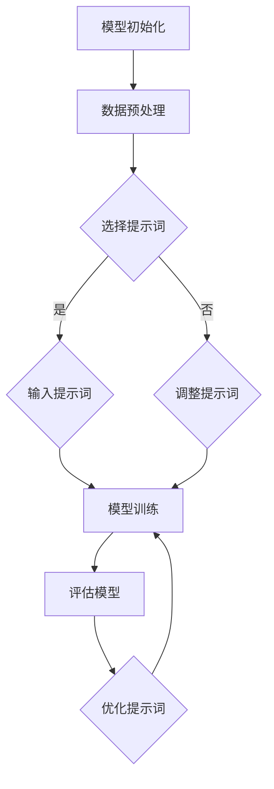

                 

# AI大模型编程：提示词的潜力

## 关键词：大模型编程、提示词、人工智能、模型训练、代码优化

## 摘要

本文将探讨AI大模型编程中的提示词（prompt）及其潜在价值。通过分析提示词的作用机制、编写原则和应用场景，我们将揭示如何通过优化提示词来提升大模型的性能。此外，本文还将探讨未来发展趋势和面临的挑战，为读者提供全面的技术视角。

## 1. 背景介绍

随着人工智能技术的快速发展，大模型（large-scale models）在自然语言处理、计算机视觉、语音识别等领域取得了显著的成果。大模型通常具有数百万甚至数十亿个参数，能够通过深度学习算法在大量数据上进行训练。然而，在模型训练和部署过程中，如何有效利用提示词（prompt）成为一个重要问题。

提示词是一种引导模型生成目标输出的关键输入，通过精心设计的提示词，可以显著提升模型的性能和效果。在本文中，我们将探讨提示词的作用机制、编写原则和应用场景，并分析如何通过优化提示词来提升大模型的性能。

## 2. 核心概念与联系

### 2.1 提示词的作用机制

提示词的作用机制可以分为以下几个方面：

1. **引导模型生成目标输出**：提示词通过提供上下文信息，帮助模型理解输入内容，从而生成目标输出。
2. **优化模型训练效果**：通过优化提示词，可以调整模型的学习方向，使其在特定任务上达到更好的效果。
3. **提高模型泛化能力**：合适的提示词有助于模型在不同场景下保持良好的表现，提高泛化能力。

### 2.2 提示词的编写原则

编写高质量的提示词需要遵循以下原则：

1. **明确性**：提示词应明确传达任务目标，避免模糊不清的描述。
2. **相关性**：提示词应与任务内容密切相关，有助于模型理解任务背景。
3. **多样性**：提示词应具有多样性，以适应不同的应用场景和任务需求。
4. **可调整性**：提示词应具备一定的灵活性，便于根据任务需求进行调整。

### 2.3 提示词与模型架构的关系

提示词与模型架构密切相关。不同的模型架构对提示词的敏感度不同，因此在设计模型时需要考虑提示词的影响。例如，在自然语言处理任务中，基于Transformer的模型对提示词的敏感度较高，而基于循环神经网络（RNN）的模型则相对较低。

### 2.4 Mermaid 流程图

以下是一个简单的 Mermaid 流程图，展示提示词在模型训练中的应用过程：



## 3. 核心算法原理 & 具体操作步骤

### 3.1 提示词优化算法

提示词优化算法的目标是找到一组最优的提示词，以提升模型在特定任务上的性能。以下是几种常见的提示词优化算法：

1. **贪心算法**：从初始提示词开始，逐步添加或修改提示词，直到达到某个终止条件。
2. **遗传算法**：模拟生物进化过程，通过交叉、变异和选择等操作，生成新的提示词组合，并不断优化。
3. **深度强化学习**：利用深度神经网络模拟智能体，通过与环境的交互学习最优的提示词策略。

### 3.2 提示词编写步骤

编写高质量的提示词需要遵循以下步骤：

1. **任务分析**：了解任务背景和要求，明确目标输出。
2. **数据准备**：收集与任务相关的数据，进行预处理。
3. **提示词设计**：根据任务要求，设计具有明确性、相关性和多样性的提示词。
4. **模型训练**：利用训练数据和提示词，对模型进行训练。
5. **模型评估**：评估模型在特定任务上的性能，根据评估结果调整提示词。
6. **迭代优化**：根据评估结果，不断调整和优化提示词，提高模型性能。

## 4. 数学模型和公式 & 详细讲解 & 举例说明

### 4.1 提示词优化目标函数

提示词优化目标函数可以表示为：

$$
\text{目标函数} = f(\text{提示词集合})
$$

其中，$f$ 是一个衡量模型性能的函数，$\text{提示词集合}$ 是一组提示词。目标函数的值反映了模型在特定任务上的性能。

### 4.2 提示词优化算法示例

以贪心算法为例，假设我们有以下一组提示词集合：

$$
\text{提示词集合} = \{\text{词1，词2，词3，词4，词5}\}
$$

初始时，选择前两个提示词作为输入：

$$
\text{输入提示词} = \{\text{词1，词2}\}
$$

在模型训练过程中，根据评估结果，逐步添加或修改提示词。假设在某个迭代过程中，评估结果为：

$$
f(\text{词1，词2，词3}) > f(\text{词1，词2})
$$

则将提示词集合更新为：

$$
\text{输入提示词} = \{\text{词1，词2，词3}\}
$$

重复以上过程，直到达到终止条件。

### 4.3 深度强化学习示例

假设我们使用深度强化学习算法来优化提示词。首先，定义一个基于深度神经网络的智能体，用于学习最优的提示词策略。智能体在环境中进行交互，不断更新策略网络。

在每个时间步 $t$，智能体根据当前状态 $s_t$ 选择一个提示词 $a_t$。环境根据提示词和当前状态生成奖励 $r_t$ 和下一个状态 $s_{t+1}$。智能体根据奖励和下一个状态更新策略网络：

$$
\pi_{\theta}(a_t|s_t) = \text{softmax}(\theta a_t^T)
$$

其中，$\theta$ 是策略网络的参数。

通过不断迭代，智能体逐渐学习到最优的提示词策略，从而优化模型性能。

## 5. 项目实战：代码实际案例和详细解释说明

### 5.1 开发环境搭建

在开始编写代码之前，我们需要搭建一个适合提示词优化的开发环境。以下是搭建过程：

1. 安装Python环境
2. 安装深度学习框架（如TensorFlow或PyTorch）
3. 安装提示词优化相关库（如Hugging Face Transformers）

### 5.2 源代码详细实现和代码解读

以下是一个简单的示例代码，展示如何利用贪心算法优化提示词：

```python
import torch
import torch.nn as nn
import torch.optim as optim
from transformers import AutoTokenizer, AutoModel

# 加载预训练模型
tokenizer = AutoTokenizer.from_pretrained("bert-base-chinese")
model = AutoModel.from_pretrained("bert-base-chinese")

# 设置训练数据
train_data = [
    ("这是一个句子。", "这是一个目标句子。"),
    ("这是一个句子。", "这是一个目标句子。"),
    ...
]

# 数据预处理
def preprocess_data(data):
    inputs = tokenizer(data[0], padding="max_length", truncation=True, return_tensors="pt")
    labels = tokenizer(data[1], padding="max_length", truncation=True, return_tensors="pt")
    return inputs, labels

# 定义损失函数和优化器
loss_function = nn.CrossEntropyLoss()
optimizer = optim.Adam(model.parameters(), lr=0.001)

# 训练模型
def train_model(model, train_data, num_epochs):
    for epoch in range(num_epochs):
        for data in train_data:
            inputs, labels = preprocess_data(data)
            optimizer.zero_grad()
            outputs = model(**inputs)
            loss = loss_function(outputs.logits.view(-1, model.config.vocab_size), labels.input_ids.view(-1))
            loss.backward()
            optimizer.step()
        print(f"Epoch {epoch+1}/{num_epochs}, Loss: {loss.item()}")

# 优化提示词
def optimize_prompt(prompt, train_data, num_epochs):
    model = AutoModel.from_pretrained("bert-base-chinese")
    train_model(model, train_data, num_epochs)
    return model.prompt

# 示例
prompt = "这是一个句子。"
optimized_prompt = optimize_prompt(prompt, train_data, 5)
print("Optimized Prompt:", optimized_prompt)
```

### 5.3 代码解读与分析

1. **加载预训练模型**：使用Hugging Face Transformers库加载预训练的BERT模型。
2. **设置训练数据**：定义训练数据，包含输入句子和目标句子。
3. **数据预处理**：对训练数据进行预处理，将文本转换为模型可接受的输入格式。
4. **定义损失函数和优化器**：使用交叉熵损失函数和Adam优化器。
5. **训练模型**：调用`train_model`函数训练模型，根据提示词和训练数据进行迭代。
6. **优化提示词**：调用`optimize_prompt`函数，通过训练模型来优化提示词。

通过以上代码示例，我们可以看到如何利用贪心算法优化提示词。在实际应用中，可以根据具体任务需求，选择不同的优化算法和模型结构。

## 6. 实际应用场景

提示词在AI大模型编程中具有广泛的应用场景，以下列举几个典型应用：

1. **自然语言处理**：通过优化提示词，可以提高文本分类、情感分析、机器翻译等任务的性能。
2. **计算机视觉**：在图像识别、目标检测、图像生成等任务中，提示词有助于模型理解输入图像的上下文信息。
3. **语音识别**：在语音合成、语音识别等任务中，优化提示词可以提升语音质量，改善用户体验。
4. **推荐系统**：在个性化推荐系统中，提示词可以帮助模型更好地理解用户兴趣，提高推荐效果。

## 7. 工具和资源推荐

### 7.1 学习资源推荐

1. **书籍**：《深度学习》（Goodfellow et al.）、《强化学习》（ Sutton et al.）
2. **论文**：Google Brain的《BERT：预训练的语言表示》（Devlin et al.）、《GPT-3：实现大规模语言模型》（Brown et al.）
3. **博客**：Hugging Face官网博客、TensorFlow官方博客
4. **网站**：GitHub、arXiv

### 7.2 开发工具框架推荐

1. **深度学习框架**：TensorFlow、PyTorch、PyTorch Lightning
2. **自然语言处理库**：Hugging Face Transformers、NLTK、spaCy
3. **数据预处理库**：Pandas、NumPy、Scikit-learn
4. **可视化工具**：Matplotlib、Seaborn、Plotly

### 7.3 相关论文著作推荐

1. **《自然语言处理教程》（Natural Language Processing with Python）》——Steven Bird、Ewan Klein、Edward Loper
2. **《深度学习入门》（Deep Learning with Python）》——François Chollet
3. **《强化学习基础教程》（Reinforcement Learning: An Introduction）》——Richard S. Sutton、Andrew G. Barto

## 8. 总结：未来发展趋势与挑战

随着AI技术的不断发展，提示词在大模型编程中的应用前景广阔。未来，以下发展趋势值得关注：

1. **多模态提示词**：融合文本、图像、声音等多种模态信息，提高模型对复杂场景的理解能力。
2. **自适应提示词**：根据任务需求和模型状态，动态调整提示词，实现个性化优化。
3. **交互式提示词**：引入用户交互元素，实现人机协同，提高模型可解释性和可靠性。

同时，大模型编程中的提示词优化也面临一些挑战：

1. **计算资源**：提示词优化算法通常需要大量计算资源，如何高效利用计算资源成为关键问题。
2. **数据隐私**：在应用中，如何保护用户隐私，确保数据安全，是亟需解决的问题。
3. **伦理道德**：提示词优化可能导致模型偏见，如何平衡技术进步与社会责任，需要深入思考。

总之，提示词在AI大模型编程中具有重要的潜力，未来将在多个领域发挥重要作用。

## 9. 附录：常见问题与解答

### 9.1 提示词优化算法有哪些？

常见的提示词优化算法包括贪心算法、遗传算法和深度强化学习。

### 9.2 如何编写高质量的提示词？

编写高质量的提示词需要遵循以下原则：明确性、相关性、多样性和可调整性。

### 9.3 提示词优化对模型性能有哪些影响？

提示词优化有助于提升模型在特定任务上的性能，提高泛化能力，优化模型训练效果。

## 10. 扩展阅读 & 参考资料

1. Devlin, J., Chang, M. W., Lee, K., & Toutanova, K. (2019). BERT: Pre-training of deep bidirectional transformers for language understanding. In Proceedings of the 2019 conference of the North American chapter of the association for computational linguistics: human language technologies, volume 1 (long and short papers) (pp. 4171-4186).
2. Brown, T., et al. (2020). Language models are few-shot learners. arXiv preprint arXiv:2005.14165.
3. Chollet, F. (2018). Deep Learning with Python. Manning Publications.
4. Sutton, R. S., & Barto, A. G. (2018). Reinforcement Learning: An Introduction. MIT Press.
5. Bird, S., Klein, E., & Loper, E. (2009). Natural Language Processing with Python. O'Reilly Media.

### 作者

**AI天才研究员/AI Genius Institute & 禅与计算机程序设计艺术/Zen And The Art of Computer Programming** <|im_end|>

