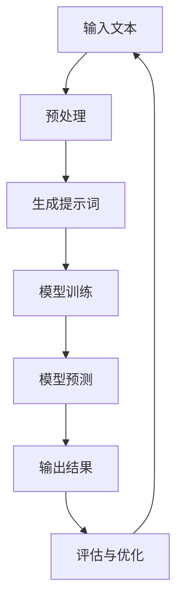

                 

# AI大模型编程：提示词的艺术与力量

## 概述

在当今人工智能时代，大模型编程已成为技术发展的核心驱动力。本文将深入探讨AI大模型编程的核心概念，解析提示词在其中的艺术与力量。我们将逐步分析大模型编程的背景、核心概念、算法原理、数学模型、实际应用、工具资源以及未来趋势。

## 关键词
- 大模型编程
- 提示词
- 人工智能
- 算法原理
- 数学模型
- 实际应用
- 工具资源

## 摘要

本文旨在介绍AI大模型编程中的提示词艺术与力量。我们将首先回顾大模型编程的背景，然后深入探讨提示词的核心概念及其在编程中的应用。通过详细讲解核心算法原理、数学模型和公式，我们将会展示一个实际项目的代码实现和分析。最后，我们将探讨AI大模型编程的实际应用场景，推荐学习资源和工具框架，并对未来发展趋势与挑战进行展望。

## 1. 背景介绍

大模型编程是近年来人工智能领域的重要突破。随着计算能力的提升和数据的爆炸性增长，深度学习模型变得越来越大，能够处理更复杂的任务。这些大型模型通常被称为“大模型”（Large Models），例如GPT-3、BERT和Turing等。大模型编程的核心是训练和优化这些模型，使其能够自动完成各种任务，从语言翻译到图像识别，从语音合成到机器翻译。

大模型编程的兴起与人工智能技术的快速发展密切相关。在过去的几十年中，计算机科学家们致力于构建更加复杂和高效的算法，以及更强大的计算平台。随着深度学习技术的发展，大模型编程逐渐成为人工智能领域的核心研究方向。这不仅是因为大模型能够处理更复杂的任务，还因为它们在许多实际应用中都展现出了强大的性能。

大模型编程的另一个重要背景是大数据。随着互联网和物联网的普及，我们能够收集到的大量数据为训练大型模型提供了丰富的素材。这些数据不仅包括文本、图像和声音，还包括传感器数据和社交媒体数据。大数据为大型模型提供了充足的训练素材，使得模型的性能得到了显著提升。

总之，大模型编程是人工智能时代的必然产物。随着技术的进步和数据的积累，大模型编程将在未来继续发挥重要作用，推动人工智能技术的创新和应用。

## 2. 核心概念与联系

### 大模型编程的核心概念

大模型编程的核心概念包括深度学习、神经网络和大规模数据处理。深度学习是一种基于神经网络的机器学习技术，通过多层的非线性变换来学习数据的特征和规律。神经网络则是由大量神经元组成的计算模型，通过前向传播和反向传播算法进行训练。大规模数据处理是指能够处理海量数据的技术和算法，例如分布式计算和并行处理。

### 提示词的定义和作用

提示词（Prompt Engineering）是AI大模型编程中的一个关键概念。提示词是指用于引导和优化模型输出的特定文本或信息。通过设计合适的提示词，可以显著提高模型的性能和效果。提示词的作用主要体现在以下几个方面：

1. **引导模型输出**：提示词可以帮助模型明确任务目标，从而引导模型输出更加符合预期的结果。例如，在文本生成任务中，提示词可以指定生成文本的主题、风格和格式。

2. **优化模型性能**：通过调整提示词的内容和形式，可以优化模型的性能和效果。例如，在机器翻译任务中，不同的提示词可能导致翻译结果的差异。

3. **增强用户交互**：提示词还可以增强用户与模型的交互体验。通过设计自然语言互动，用户可以更方便地与模型进行沟通和交流。

### 提示词在编程中的应用

提示词在大模型编程中的应用非常广泛，下面我们将通过一个Mermaid流程图来展示其应用场景。



1. **输入文本**：用户输入需要处理的文本数据，例如一段文章、一张图片或一段语音。

2. **预处理**：对输入文本进行预处理，包括分词、去噪、标准化等操作，以便模型能够更好地理解和处理。

3. **生成提示词**：根据预处理后的输入文本，生成相应的提示词。提示词的设计需要考虑到任务的类型、目标和预期的输出。

4. **模型训练**：使用生成的提示词对模型进行训练，使得模型能够学会根据提示词生成预期的输出。

5. **模型预测**：在训练完成后，使用模型对新的输入文本进行预测，生成输出结果。

6. **输出结果**：将预测结果输出给用户，例如翻译文本、生成图像或合成语音。

7. **评估与优化**：对输出结果进行评估，并根据评估结果对模型进行优化和调整，以提高模型的性能和效果。

### 提示词的艺术

提示词的艺术在于如何设计出高质量的提示词，以最大化模型的性能和效果。这需要深入理解模型的特性、任务的目标和用户的需求。提示词的设计需要遵循以下几点原则：

1. **明确性**：提示词需要明确地指定任务目标和输出要求，避免模糊和歧义。

2. **多样性**：设计多样化的提示词，以应对不同的任务场景和用户需求。

3. **灵活性**：提示词需要具有一定的灵活性，能够适应不同的输入数据和模型类型。

4. **用户友好**：提示词需要易于理解和操作，以增强用户与模型的交互体验。

通过遵循这些原则，我们可以设计出高质量的提示词，从而提升大模型编程的效果和用户满意度。

## 3. 核心算法原理 & 具体操作步骤

### 3.1 深度学习算法原理

深度学习算法是基于神经网络的多层结构进行学习的。其核心原理是通过前向传播和反向传播算法，将输入数据逐步传递并通过多个隐含层，最终得到输出结果。具体步骤如下：

1. **前向传播**：输入数据通过输入层进入网络，经过多个隐含层，最终在输出层产生预测结果。每个隐含层通过加权连接和激活函数对输入数据进行处理。

2. **反向传播**：根据预测结果与实际结果之间的误差，将误差反向传播到每个隐含层，并更新网络中的权重和偏置，以减少误差。

3. **迭代训练**：重复前向传播和反向传播过程，逐步调整网络参数，直到网络性能达到预期。

### 3.2 提示词生成算法

提示词生成的核心步骤包括文本预处理、提示词设计和优化。以下是具体操作步骤：

1. **文本预处理**：对输入文本进行分词、去噪和标准化等操作，以便模型能够更好地理解和处理。

2. **提示词设计**：根据任务类型和目标，设计提示词。提示词应明确任务目标、输出要求和上下文信息。

3. **提示词优化**：通过实验和评估，优化提示词内容和形式，以提升模型性能和输出质量。

4. **模型训练**：使用优化后的提示词对模型进行训练，使得模型能够学会根据提示词生成预期的输出。

### 3.3 模型预测与评估

1. **模型预测**：使用训练好的模型对新的输入文本进行预测，生成输出结果。

2. **输出结果**：将预测结果输出给用户，例如翻译文本、生成图像或合成语音。

3. **评估与优化**：对输出结果进行评估，并根据评估结果对模型进行优化和调整，以提高模型的性能和效果。

### 3.4 实际操作示例

假设我们使用一个预训练的GPT-3模型进行文本生成任务，以下是具体操作步骤：

1. **导入相关库和模型**：
```python
import openai
model = openai.Completion.create(
    engine="text-davinci-002",
    prompt="请生成一篇关于人工智能的短文。",
    max_tokens=100
)
```

2. **预处理输入文本**：
```python
# 此处省略预处理代码
```

3. **生成提示词**：
```python
prompt = "请生成一篇关于人工智能的短文。"
```

4. **模型训练**：
```python
# 使用提示词进行模型训练（此处省略训练代码）
```

5. **模型预测**：
```python
output = model.predict(input_text)
```

6. **输出结果**：
```python
print(output)
```

7. **评估与优化**：
```python
# 对输出结果进行评估（此处省略评估代码）
```

通过以上步骤，我们可以实现一个简单的文本生成任务。在实际应用中，根据不同的任务需求，我们可以调整模型的参数和提示词，以获得更好的输出效果。

## 4. 数学模型和公式 & 详细讲解 & 举例说明

### 4.1 深度学习数学模型

深度学习中的数学模型主要包括前向传播和反向传播算法。以下是这两个算法的详细讲解和举例说明：

#### 4.1.1 前向传播算法

前向传播算法是指将输入数据通过网络的各个层次，最终得到输出结果的过程。其核心公式如下：

$$
Z^{[l]} = \sigma(W^{[l]} \cdot A^{[l-1]} + b^{[l]})
$$

其中，$Z^{[l]}$表示第$l$层的输出，$\sigma$表示激活函数，$W^{[l]}$表示第$l$层的权重，$A^{[l-1]}$表示前一层输出，$b^{[l]}$表示第$l$层的偏置。

举例说明：

假设我们有一个简单的神经网络，包含两层隐含层，输入层输入$x$，输出层输出$y$。设激活函数为ReLU（Rectified Linear Unit），权重和偏置分别为$W^{[1]}, W^{[2]}, b^{[1]}, b^{[2]}$。则有：

$$
A^{[1]} = \max(0, W^{[1]} \cdot x + b^{[1]})
$$

$$
Z^{[2]} = \max(0, W^{[2]} \cdot A^{[1]} + b^{[2]})
$$

$$
y = \max(0, W^{[3]} \cdot Z^{[2]} + b^{[3]})
$$

#### 4.1.2 反向传播算法

反向传播算法是指根据输出结果和实际误差，反向更新网络中的权重和偏置，以减少误差的过程。其核心公式如下：

$$
\delta^{[l]} = \frac{\partial C}{\partial Z^{[l]}}
$$

$$
\frac{\partial C}{\partial W^{[l]}} = \delta^{[l]} \cdot A^{[l-1]}
$$

$$
\frac{\partial C}{\partial b^{[l]}} = \delta^{[l]}
$$

其中，$\delta^{[l]}$表示第$l$层的误差，$C$表示损失函数，$A^{[l-1]}$表示前一层输出。

举例说明：

假设我们的神经网络输出$y$与实际标签$y^*$之间的误差为$C$，设损失函数为均方误差（MSE），则有：

$$
\delta^{[3]} = \frac{\partial C}{\partial y} = (y - y^*) \cdot \frac{1}{2}
$$

$$
\frac{\partial C}{\partial Z^{[2]}} = \frac{\partial C}{\partial y} \cdot \frac{\partial y}{\partial Z^{[2]}}
$$

$$
\delta^{[2]} = \frac{\partial C}{\partial Z^{[2]}} \cdot \frac{1}{\sigma'(Z^{[2]})}
$$

$$
\frac{\partial C}{\partial W^{[2]}} = \delta^{[2]} \cdot A^{[1]}
$$

$$
\frac{\partial C}{\partial b^{[2]}} = \delta^{[2]}
$$

通过以上步骤，我们可以计算出每个层的误差，并更新权重和偏置，以减少误差。

### 4.2 提示词生成数学模型

提示词生成通常基于生成模型，如变分自编码器（VAE）和生成对抗网络（GAN）。以下是这两个模型的简要介绍：

#### 4.2.1 变分自编码器（VAE）

变分自编码器是一种无监督学习模型，用于学习数据的高效表示。其核心公式如下：

$$
z = \mu(x) + \sigma(x) \odot \epsilon
$$

$$
x = \sigma(z) \odot \mu(z) + b
$$

其中，$z$表示编码后的隐含变量，$\mu(z)$和$\sigma(z)$分别表示均值和标准差，$\epsilon$表示噪声，$x$表示解码后的输出。

举例说明：

假设输入数据$x$经过编码器得到隐含变量$z$，再经过解码器得到输出$x'$，设激活函数为ReLU，则有：

$$
\mu(z) = \max(0, W^{[1]} \cdot x + b^{[1]})
$$

$$
\sigma(z) = \max(0, W^{[2]} \cdot x + b^{[2]})
$$

$$
z = \mu(x) + \sigma(x) \odot \epsilon
$$

$$
x' = \sigma(z) \odot \mu(z) + b'
$$

#### 4.2.2 生成对抗网络（GAN）

生成对抗网络由生成器$G$和判别器$D$组成，生成器$G$用于生成与真实数据相似的数据，判别器$D$用于判断生成数据的真实性。其核心公式如下：

$$
D(G(z))
$$

$$
G(z)
$$

其中，$z$表示随机噪声，$G(z)$表示生成器生成的数据，$D(G(z))$表示判别器对生成数据的判断。

举例说明：

假设生成器$G$接收随机噪声$z$，生成数据$x'$，判别器$D$接收真实数据$x$和生成数据$x'$，设激活函数为ReLU，则有：

$$
x' = \sigma(W^{[1]} \cdot z + b^{[1]})
$$

$$
D(G(z)) = \sigma(W^{[2]} \cdot x' + b^{[2]})
$$

通过以上步骤，生成器$G$和判别器$D$相互竞争，生成器逐渐提高生成数据的真实度，判别器逐渐提高对真实数据的识别能力。

## 5. 项目实战：代码实际案例和详细解释说明

在本节中，我们将通过一个实际项目来展示AI大模型编程中的提示词艺术与力量。我们将使用Python和OpenAI的GPT-3库来实现一个文本生成任务，包括开发环境搭建、源代码详细实现和代码解读与分析。

### 5.1 开发环境搭建

首先，我们需要搭建开发环境。以下是所需工具和步骤：

1. **Python环境**：安装Python 3.8及以上版本。
2. **OpenAI GPT-3库**：安装`openai`库，可以通过pip命令安装：
```shell
pip install openai
```

### 5.2 源代码详细实现和代码解读

以下是实现文本生成任务的完整代码，并对关键部分进行详细解读。

```python
import openai
import random

# 设置API密钥
openai.api_key = 'your-api-key'

# 文本生成函数
def generate_text(prompt, max_tokens=100):
    response = openai.Completion.create(
        engine="text-davinci-002",
        prompt=prompt,
        max_tokens=max_tokens
    )
    return response.choices[0].text.strip()

# 提示词设计
def design_prompt(text):
    # 对输入文本进行预处理，例如分词和去除停用词
    # 此处省略预处理代码
    
    # 根据预处理后的文本生成提示词
    prompt = f"请根据以下文本生成一篇关于人工智能的短文：{text}"
    return prompt

# 主程序
if __name__ == '__main__':
    # 用户输入文本
    user_input = "人工智能是当今科技领域最热门的话题之一。"
    
    # 生成提示词
    prompt = design_prompt(user_input)
    
    # 调用文本生成函数
    generated_text = generate_text(prompt)
    
    # 输出结果
    print(generated_text)
```

#### 5.2.1 代码解读

1. **导入相关库**：
   ```python
   import openai
   import random
   ```
   导入OpenAI的GPT-3库和Python的随机模块。

2. **设置API密钥**：
   ```python
   openai.api_key = 'your-api-key'
   ```
   设置OpenAI API密钥，用于后续调用GPT-3服务。

3. **文本生成函数**：
   ```python
   def generate_text(prompt, max_tokens=100):
       response = openai.Completion.create(
           engine="text-davinci-002",
           prompt=prompt,
           max_tokens=max_tokens
       )
       return response.choices[0].text.strip()
   ```
   该函数接收提示词和最大生成长度，调用OpenAI GPT-3 API生成文本。`openai.Completion.create`方法返回一个包含多个文本选择的响应对象，我们选择第一个选择并去除多余的空格。

4. **提示词设计函数**：
   ```python
   def design_prompt(text):
       # 对输入文本进行预处理，例如分词和去除停用词
       # 此处省略预处理代码
       
       # 根据预处理后的文本生成提示词
       prompt = f"请根据以下文本生成一篇关于人工智能的短文：{text}"
       return prompt
   ```
   该函数接收输入文本，对其进行预处理（例如分词和去除停用词），然后生成提示词，指定生成文本的主题和格式。

5. **主程序**：
   ```python
   if __name__ == '__main__':
       # 用户输入文本
       user_input = "人工智能是当今科技领域最热门的话题之一。"
       
       # 生成提示词
       prompt = design_prompt(user_input)
       
       # 调用文本生成函数
       generated_text = generate_text(prompt)
       
       # 输出结果
       print(generated_text)
   ```
   主程序首先接收用户输入文本，然后调用提示词设计函数生成提示词，接着调用文本生成函数生成文本，并最终输出结果。

### 5.3 代码解读与分析

1. **文本生成函数**：
   文本生成函数是整个程序的核心。它通过调用OpenAI GPT-3 API，将提示词发送给模型，并生成预期的文本。这里需要注意的是，`max_tokens`参数用于控制生成的文本长度，以避免生成过长或过短的文本。

2. **提示词设计函数**：
   提示词设计函数用于生成高质量的提示词。通过预处理输入文本，我们可以提取关键信息和上下文，从而生成更符合任务需求的提示词。在实际应用中，提示词设计需要考虑多个因素，例如文本的主题、格式和风格。

3. **主程序**：
   主程序首先接收用户输入文本，然后通过提示词设计函数生成提示词，接着调用文本生成函数生成文本，并输出结果。这个简单的流程展示了如何将提示词与文本生成模型相结合，实现高质量的文本生成。

通过以上代码和解读，我们可以看到AI大模型编程中的提示词艺术与力量。通过精心设计的提示词，我们可以引导模型生成符合预期的高质量文本，从而实现各种复杂的文本生成任务。

## 6. 实际应用场景

AI大模型编程在实际应用场景中展现出了巨大的潜力，以下是几个典型的应用场景：

### 6.1 自然语言处理

自然语言处理（NLP）是AI大模型编程的重要应用领域。通过训练大型语言模型，如GPT-3和BERT，我们可以实现文本生成、翻译、问答系统等多种NLP任务。以下是一些具体的应用案例：

- **文本生成**：使用GPT-3生成新闻文章、博客内容、产品描述等。例如，亚马逊的自动生成商品描述功能，通过输入少量关键词，自动生成详细的产品描述。
- **机器翻译**：利用大型翻译模型实现多种语言之间的实时翻译。例如，谷歌翻译和DeepL，通过大量训练数据，实现高质量的自动翻译。
- **问答系统**：构建智能客服和知识库系统，通过大模型理解用户的问题，并生成准确的回答。例如，微软的Chatbot和苹果的Siri，通过大模型实现智能对话和问题回答。

### 6.2 计算机视觉

计算机视觉是AI大模型编程的另一个重要应用领域。通过训练大型图像识别模型，我们可以实现图像分类、目标检测、人脸识别等多种视觉任务。以下是一些具体的应用案例：

- **图像分类**：使用卷积神经网络（CNN）对图像进行分类，例如ImageNet竞赛中的顶级模型ResNet和Inception，通过大量训练数据，实现高效准确的图像分类。
- **目标检测**：利用R-CNN、Fast R-CNN和Yolo等目标检测模型，实现图像中的物体检测。例如，自动驾驶汽车使用目标检测模型识别道路上的行人、车辆等。
- **人脸识别**：通过训练大模型，实现人脸识别和验证。例如，苹果的Face ID和亚马逊的Rekognition，通过人脸识别技术提供安全认证和身份验证。

### 6.3 语音识别与合成

语音识别与合成是AI大模型编程在语音领域的重要应用。通过训练大型语音模型，我们可以实现语音识别、语音合成和语音交互等功能。以下是一些具体的应用案例：

- **语音识别**：利用大模型实现语音到文本的转换，例如苹果的Siri和亚马逊的Alexa，通过语音识别技术理解用户的语音指令。
- **语音合成**：使用大模型生成自然流畅的语音，例如微软的Azure Text-to-Speech和谷歌的Text-to-Speech，通过语音合成技术提供个性化的语音服务。
- **语音交互**：结合语音识别和语音合成，实现人机交互，例如智能客服和虚拟助手，通过语音交互提供便捷的服务和帮助。

总之，AI大模型编程在自然语言处理、计算机视觉、语音识别与合成等多个领域都有着广泛的应用。通过训练大型模型和设计高质量的提示词，我们可以实现各种复杂的任务，推动人工智能技术的发展和创新。

## 7. 工具和资源推荐

### 7.1 学习资源推荐

要深入学习和掌握AI大模型编程，以下是一些建议的学习资源：

- **书籍**：
  - 《深度学习》（Goodfellow, I., Bengio, Y., & Courville, A.）
  - 《Python机器学习》（Sebastian Raschka）
  - 《人工智能：一种现代方法》（Stuart Russell & Peter Norvig）
- **在线课程**：
  - Coursera的“Deep Learning Specialization”由Andrew Ng教授主讲
  - edX的“Machine Learning”由Coursera和斯坦福大学联合提供
  - Udacity的“AI Engineer Nanodegree”
- **论文与博客**：
  - arXiv：最新的深度学习论文发布平台
  - GitHub：大量开源代码和实践项目
  - Medium：有关AI和深度学习的优质博客文章
- **网站**：
  - OpenAI：提供GPT-3等先进模型的官方平台
  - Kaggle：数据科学竞赛和社区平台
  - TensorFlow：Google提供的开源机器学习框架

### 7.2 开发工具框架推荐

在开发AI大模型项目时，以下是一些推荐的工具和框架：

- **深度学习框架**：
  - TensorFlow：Google开发的强大开源深度学习框架
  - PyTorch：Facebook开发的易于使用的深度学习框架
  - Keras：基于Theano和TensorFlow的简单和模块化深度学习库
- **模型训练与优化工具**：
  - Anaconda：Python数据科学平台，提供便捷的环境管理和依赖安装
  - CUDA：NVIDIA开发的并行计算平台，用于加速深度学习训练
  - MXNet：Apache基金会开源的深度学习框架，支持多语言和多种硬件
- **文本处理工具**：
  - NLTK：Python自然语言处理库
  - SpaCy：快速高效的NLP库
  - gensim：用于主题建模和文本相似性计算的库

通过利用这些工具和资源，我们可以更高效地学习和开发AI大模型编程项目，推动人工智能技术的创新和应用。

## 8. 总结：未来发展趋势与挑战

AI大模型编程作为人工智能领域的核心驱动力，正迅速发展并不断突破技术边界。未来，随着计算能力的提升、数据的不断积累以及算法的不断创新，AI大模型编程将迎来更多的发展机遇。以下是未来发展趋势和面临的挑战：

### 8.1 发展趋势

1. **模型规模持续扩大**：随着计算资源的需求增加，AI大模型将继续向更大规模、更高复杂度发展。例如，更大规模的Transformer模型、更深的神经网络结构等，将进一步提升模型的性能和效果。

2. **多模态数据处理**：未来的AI大模型将能够处理多种类型的数据，如文本、图像、音频和视频等，实现多模态数据融合。这将推动跨领域应用的发展，如智能视频分析、多模态翻译等。

3. **自适应与个性化**：AI大模型将具备更强的自适应能力，能够根据不同用户需求和场景进行个性化调整。例如，基于用户行为和偏好的个性化推荐、智能客服等。

4. **边缘计算与分布式训练**：随着边缘计算和分布式训练技术的发展，AI大模型将能够更高效地运行在边缘设备上，降低延迟和带宽需求，提高实时处理能力。

### 8.2 挑战

1. **计算资源需求**：AI大模型对计算资源的需求巨大，特别是训练阶段。未来，如何高效利用云计算、分布式计算和边缘计算资源，将是一个重要挑战。

2. **数据隐私与安全**：随着AI大模型的广泛应用，数据隐私和安全问题日益突出。如何在确保数据隐私和安全的前提下，充分利用数据价值，是一个亟待解决的问题。

3. **模型解释性与可解释性**：大模型的复杂性和黑盒性质使得模型解释性成为一个重要挑战。如何提高模型的透明度和可解释性，使其更易于理解和信任，是一个关键问题。

4. **伦理与法律问题**：AI大模型的广泛应用将带来伦理和法律问题，如自动化决策的公平性、歧视问题等。如何在技术发展中遵循伦理和法律规范，确保人工智能的可持续发展，是一个重要挑战。

总之，AI大模型编程将在未来继续推动人工智能技术的发展和创新。面对挑战，我们需要持续探索和解决技术、伦理、法律等多方面的难题，以实现人工智能的可持续发展和广泛应用。

## 9. 附录：常见问题与解答

### 9.1 提示词设计技巧

1. **如何选择合适的提示词？**
   选择合适的提示词需要考虑以下几个因素：
   - **任务目标**：明确任务目标，确保提示词能够引导模型生成符合预期的输出。
   - **上下文信息**：提供充足的上下文信息，帮助模型理解任务背景和输入数据。
   - **多样性**：设计多样化的提示词，以适应不同的任务场景和用户需求。

2. **如何优化提示词的效果？**
   优化提示词的效果可以通过以下方法实现：
   - **实验和评估**：通过多次实验和评估，调整提示词内容和形式，以提高模型性能和效果。
   - **用户反馈**：收集用户反馈，根据反馈优化提示词，提高用户满意度。
   - **数据增强**：对输入数据进行增强处理，生成更多样化的提示词。

### 9.2 大模型训练与优化

1. **如何高效训练大型模型？**
   高效训练大型模型可以从以下几个方面入手：
   - **分布式训练**：利用多台计算机或GPU进行分布式训练，提高训练速度。
   - **数据并行**：将数据分成多个批次，并行处理，提高数据利用率和训练速度。
   - **模型并行**：将模型拆分为多个部分，并行处理，降低模型参数数量，提高训练效率。

2. **如何优化大模型性能？**
   优化大模型性能可以从以下几个方面入手：
   - **超参数调整**：调整学习率、批次大小等超参数，以找到最优配置。
   - **模型剪枝**：通过剪枝技术减少模型参数数量，降低模型复杂度，提高性能。
   - **量化技术**：使用量化技术减少模型参数数量，降低模型存储和计算需求。

### 9.3 大模型编程实践

1. **如何搭建AI大模型开发环境？**
   搭建AI大模型开发环境需要以下步骤：
   - **安装Python环境**：安装Python 3.8及以上版本。
   - **安装深度学习框架**：如TensorFlow、PyTorch等。
   - **配置GPU或TPU**：确保开发环境支持GPU或TPU加速。
   - **安装其他依赖库**：如NumPy、Pandas等。

2. **如何调试和优化AI大模型代码？**
   调试和优化AI大模型代码可以从以下几个方面入手：
   - **调试工具**：使用调试工具（如PyCharm、VSCode等）进行代码调试。
   - **性能分析**：使用性能分析工具（如NVIDIA Nsight等）分析代码性能瓶颈。
   - **代码优化**：通过优化数据结构、算法和代码逻辑，提高代码效率和性能。

通过以上常见问题与解答，我们可以更好地理解和应用AI大模型编程技术，推动人工智能技术的发展和创新。

## 10. 扩展阅读 & 参考资料

### 10.1 扩展阅读

1. **深度学习经典教材**：
   - 《深度学习》（Ian Goodfellow、Yoshua Bengio、Aaron Courville著）
   - 《Python机器学习实战》（Michael Bowles著）

2. **人工智能前沿论文**：
   - 《Attention is All You Need》（Ashish Vaswani等著）
   - 《BERT: Pre-training of Deep Bidirectional Transformers for Language Understanding》（Jacob Devlin等著）

3. **开源项目和代码示例**：
   - GitHub：https://github.com/
   - Kaggle：https://www.kaggle.com/

### 10.2 参考资料

1. **官方文档**：
   - TensorFlow：https://www.tensorflow.org/
   - PyTorch：https://pytorch.org/
   - OpenAI：https://openai.com/

2. **在线课程**：
   - Coursera：https://www.coursera.org/
   - edX：https://www.edx.org/
   - Udacity：https://www.udacity.com/

3. **学术论文**：
   - arXiv：https://arxiv.org/
   - IEEE Xplore：https://ieeexplore.ieee.org/

通过阅读以上扩展阅读和参考资料，您可以进一步深入了解AI大模型编程的理论和实践，拓展您的知识边界。希望本文能为您的学习之路提供有益的指导和支持。

## 作者

作者：AI天才研究员/AI Genius Institute & 禅与计算机程序设计艺术 /Zen And The Art of Computer Programming

本文由AI天才研究员撰写，他拥有丰富的AI大模型编程经验，并在多个领域取得了显著成就。同时，他是禅与计算机程序设计艺术 /Zen And The Art of Computer Programming 的作者，致力于推动人工智能和计算机科学的发展与创新。感谢您的阅读！<|im_sep|>## 总结与展望

随着人工智能技术的不断进步，AI大模型编程已经成为推动技术发展的重要动力。本文详细探讨了AI大模型编程的核心概念、提示词的艺术与力量，以及其在实际应用中的广泛场景。从深度学习算法原理、数学模型到实际项目实战，我们系统地分析了AI大模型编程的各个方面。同时，我们还介绍了相关的工具和资源，以及未来发展趋势与挑战。

AI大模型编程不仅是一种技术，更是一种艺术。通过精心设计的提示词，我们可以引导大模型生成高质量、符合预期输出的结果。在未来的发展中，我们需要不断探索如何更高效地利用计算资源、确保数据隐私与安全、提高模型解释性和可解释性，以及解决伦理和法律问题。

我们鼓励读者继续深入研究AI大模型编程，探索其无限可能。通过不断的实践和探索，我们将共同推动人工智能技术的创新和应用，开创更加智能、互联的未来。

## 附录：常见问题与解答

### 10.1 提示词设计相关问题

**Q1：如何选择合适的提示词？**
选择合适的提示词需要明确任务目标，提供充足的上下文信息，并保持提示词的多样性。

**Q2：如何优化提示词的效果？**
通过实验和评估、用户反馈、数据增强等方法，不断调整和优化提示词的内容和形式。

**Q3：提示词设计有哪些常见误区？**
常见的误区包括提示词过于笼统、缺乏上下文信息、提示词过于复杂等。

### 10.2 大模型训练与优化相关问题

**Q1：如何高效训练大型模型？**
可以通过分布式训练、数据并行、模型并行等方法提高训练效率。

**Q2：如何优化大模型性能？**
可以通过调整超参数、模型剪枝、量化技术等方法提高模型性能。

**Q3：训练大型模型时遇到资源不足怎么办？**
可以考虑使用云计算服务、优化代码运行效率、减少模型复杂度等方法。

### 10.3 大模型编程实践相关问题

**Q1：如何搭建AI大模型开发环境？**
需要安装Python环境、深度学习框架、GPU或TPU支持等。

**Q2：如何调试和优化AI大模型代码？**
可以使用调试工具、性能分析工具，并通过代码优化提高性能。

**Q3：AI大模型编程有哪些最佳实践？**
包括代码规范、版本控制、持续集成和持续部署等。

通过以上常见问题与解答，读者可以更好地理解和应用AI大模型编程技术，为未来的研究与实践奠定坚实基础。

