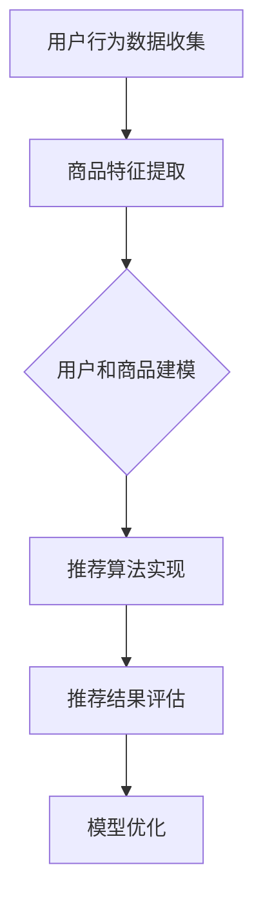

                 

# AI大模型赋能电商搜索推荐的业务创新思维培训课程体系优化实践

## 关键词
AI大模型、电商搜索推荐、业务创新、培训课程体系、优化实践

## 摘要
本文深入探讨了AI大模型在电商搜索推荐领域中的应用，以及如何通过优化培训课程体系来提升业务创新思维。文章首先介绍了电商搜索推荐的业务背景和挑战，然后详细阐述了AI大模型的原理和优势。接着，文章提出了基于AI大模型的电商搜索推荐培训课程体系，并通过实际案例展示了其优化实践。最后，文章总结了未来发展趋势与挑战，为电商行业提供了有益的参考。

## 1. 背景介绍

随着互联网技术的快速发展，电商行业已经成为全球经济增长的重要驱动力。电商平台的搜索推荐功能作为用户获取商品信息的重要途径，其性能和用户体验直接影响着平台的竞争力。然而，随着数据规模的不断扩大和用户需求的多样化，传统的搜索推荐方法面临着诸多挑战，如冷启动问题、长尾效应、数据稀疏性等。

传统的搜索推荐方法主要包括基于内容的推荐、协同过滤推荐和基于模型的推荐。这些方法在一定程度上提高了推荐系统的性能，但仍然存在一些局限性。例如，基于内容的推荐方法依赖于用户历史行为和商品属性，对于新用户和新商品的表现较差；协同过滤推荐方法容易受到数据稀疏性的影响，导致推荐效果不佳；基于模型的推荐方法虽然可以处理大规模数据，但模型复杂度高，训练和推理耗时较长。

为了解决上述问题，近年来，AI大模型逐渐应用于电商搜索推荐领域。AI大模型，如深度学习模型、Transformer模型等，具有强大的表示学习和特征提取能力，可以更好地处理大规模、高维数据，提高推荐系统的准确性和实时性。此外，AI大模型还可以通过不断学习和优化，适应不断变化的市场环境和用户需求，实现业务创新。

## 2. 核心概念与联系

### 2.1. 电商搜索推荐业务流程

电商搜索推荐业务流程通常包括用户行为数据收集、商品特征提取、用户和商品建模、推荐算法实现和推荐结果评估等环节。以下是一个简化的电商搜索推荐业务流程：

1. **用户行为数据收集**：包括用户的浏览、搜索、购买等行为数据。
2. **商品特征提取**：根据商品属性、分类、品牌、价格等特征，对商品进行编码和表示。
3. **用户和商品建模**：使用机器学习算法对用户和商品进行建模，提取用户和商品的潜在特征。
4. **推荐算法实现**：根据用户和商品模型，使用推荐算法生成推荐结果。
5. **推荐结果评估**：通过用户点击、购买等行为评估推荐效果，持续优化推荐系统。

### 2.2. AI大模型原理

AI大模型，如深度学习模型、Transformer模型等，是基于大规模数据和高性能计算的一种新型机器学习模型。它们具有以下几个核心特点：

1. **强大的表示学习能力**：AI大模型可以通过大量训练数据，自动学习数据中的潜在特征和模式，从而实现复杂的任务，如图像分类、自然语言处理等。
2. **端到端的建模能力**：AI大模型可以将输入数据直接映射到输出结果，无需手动设计特征工程和特征提取过程。
3. **并行计算和分布式训练**：AI大模型可以利用高性能计算资源和分布式训练技术，提高训练和推理效率。

### 2.3. AI大模型在电商搜索推荐中的应用

AI大模型在电商搜索推荐中的应用主要包括以下几个方面：

1. **用户和商品建模**：使用AI大模型对用户和商品进行建模，提取用户和商品的潜在特征，提高推荐系统的准确性和实时性。
2. **推荐算法优化**：通过AI大模型对传统推荐算法进行优化，提高推荐效果，减少冷启动问题、数据稀疏性等影响。
3. **实时推荐**：利用AI大模型的快速训练和推理能力，实现实时推荐，提高用户体验。

### 2.4. Mermaid流程图

以下是AI大模型在电商搜索推荐中的应用流程的Mermaid流程图：



## 3. 核心算法原理 & 具体操作步骤

### 3.1. 深度学习模型在用户和商品建模中的应用

深度学习模型在电商搜索推荐中的核心作用是进行用户和商品的建模，提取用户的兴趣特征和商品的相关属性。以下是深度学习模型在用户和商品建模中的具体操作步骤：

1. **数据预处理**：对用户行为数据和商品特征进行清洗、归一化和编码处理，将其转换为深度学习模型可处理的格式。
2. **模型设计**：设计深度学习网络结构，包括输入层、隐藏层和输出层。常用的网络结构包括卷积神经网络（CNN）、循环神经网络（RNN）和Transformer模型。
3. **模型训练**：使用训练数据对深度学习模型进行训练，通过反向传播算法不断优化模型参数，使其能够更好地提取用户和商品的潜在特征。
4. **模型评估**：使用验证数据对训练好的模型进行评估，通过指标如准确率、召回率、F1值等来衡量模型性能。
5. **模型部署**：将训练好的模型部署到线上环境，进行实时推荐。

### 3.2. Transformer模型在推荐算法优化中的应用

Transformer模型是一种基于注意力机制的深度学习模型，广泛应用于自然语言处理领域。近年来，Transformer模型在电商搜索推荐中也显示出良好的性能。以下是Transformer模型在推荐算法优化中的具体操作步骤：

1. **输入数据预处理**：对用户行为数据和商品特征进行预处理，将其编码为序列形式，作为Transformer模型的输入。
2. **模型设计**：设计Transformer模型的结构，包括编码器（Encoder）和解码器（Decoder）。编码器负责提取用户和商品的潜在特征，解码器负责生成推荐结果。
3. **模型训练**：使用训练数据对Transformer模型进行训练，通过注意力机制和编码器-解码器结构，提高推荐系统的准确性和实时性。
4. **模型评估**：使用验证数据对训练好的模型进行评估，通过指标如准确率、召回率、F1值等来衡量模型性能。
5. **模型部署**：将训练好的模型部署到线上环境，进行实时推荐。

### 3.3. 实时推荐策略

在电商搜索推荐中，实时推荐策略是提高用户体验和转化率的关键。以下是实时推荐策略的具体操作步骤：

1. **实时数据采集**：通过实时数据采集系统，获取用户的浏览、搜索、购买等行为数据。
2. **数据预处理**：对实时数据进行预处理，包括数据清洗、归一化和编码处理。
3. **模型推理**：使用训练好的深度学习模型或Transformer模型，对实时数据进行推理，提取用户的兴趣特征和商品的相关属性。
4. **推荐生成**：根据用户兴趣特征和商品属性，使用推荐算法生成推荐结果。
5. **推荐展示**：将推荐结果展示给用户，提高用户体验和转化率。

## 4. 数学模型和公式 & 详细讲解 & 举例说明

### 4.1. 深度学习模型数学模型

深度学习模型的核心是多层神经网络，通过多层非线性变换来提取数据中的潜在特征。以下是深度学习模型的基本数学模型：

$$
h_l = \sigma(W_l \cdot h_{l-1} + b_l)
$$

其中，$h_l$ 表示第$l$层的激活值，$\sigma$ 是激活函数（如ReLU、Sigmoid、Tanh等），$W_l$ 和$b_l$ 分别是第$l$层的权重和偏置。

### 4.2. Transformer模型数学模型

Transformer模型的核心是自注意力机制（Self-Attention）和编码器-解码器结构。以下是Transformer模型的基本数学模型：

$$
\text{Attention}(Q, K, V) = \text{softmax}\left(\frac{QK^T}{\sqrt{d_k}}\right) V
$$

其中，$Q$、$K$ 和$V$ 分别是查询（Query）、键（Key）和值（Value）向量，$d_k$ 是键向量的维度。

### 4.3. 推荐系统数学模型

推荐系统的核心目标是最大化用户满意度和转化率。以下是推荐系统的基本数学模型：

$$
\text{Objective} = \max_{\theta} \sum_{i=1}^{N} \log P(y_i=1 | x_i; \theta)
$$

其中，$N$ 是用户数量，$y_i$ 是用户$i$是否购买商品的标签，$x_i$ 是用户$i$的特征向量，$\theta$ 是模型参数。

### 4.4. 举例说明

假设有一个电商平台的用户行为数据，包括用户的浏览、搜索和购买行为。我们使用深度学习模型对用户和商品进行建模，并使用Transformer模型进行推荐算法优化。

1. **用户和商品建模**：使用卷积神经网络（CNN）对用户行为数据进行建模，提取用户的兴趣特征。然后，使用Transformer模型对商品特征进行建模，提取商品的相关属性。
2. **模型训练**：使用训练数据对深度学习模型和Transformer模型进行训练，通过反向传播算法不断优化模型参数。
3. **模型评估**：使用验证数据对训练好的模型进行评估，通过准确率、召回率、F1值等指标来衡量模型性能。
4. **实时推荐**：使用训练好的模型对实时数据进行推理，提取用户的兴趣特征和商品的相关属性，生成推荐结果。
5. **推荐展示**：将推荐结果展示给用户，提高用户体验和转化率。

## 5. 项目实战：代码实际案例和详细解释说明

### 5.1. 开发环境搭建

在开始项目实战之前，我们需要搭建一个合适的开发环境。以下是一个基本的开发环境搭建步骤：

1. **安装Python**：下载并安装Python 3.8版本（或更高版本）。
2. **安装深度学习库**：安装TensorFlow和PyTorch等深度学习库。
3. **安装其他依赖库**：安装Numpy、Pandas、Matplotlib等常用Python库。
4. **创建虚拟环境**：使用virtualenv或conda创建一个独立的Python虚拟环境。
5. **安装项目依赖**：使用pip安装项目所需的依赖库。

### 5.2. 源代码详细实现和代码解读

以下是项目实战中的源代码实现和代码解读：

#### 5.2.1. 数据预处理

```python
import pandas as pd
import numpy as np

# 加载用户行为数据
data = pd.read_csv('user_behavior.csv')

# 数据清洗和归一化处理
data = data.dropna()
data['user_id'] = data['user_id'].astype(str)
data['item_id'] = data['item_id'].astype(str)
data = data.sort_values(['user_id', 'timestamp'])

# 编码处理
from sklearn.preprocessing import OneHotEncoder

encoder = OneHotEncoder()
encoded_data = encoder.fit_transform(data[['user_id', 'item_id']])

# 转换为numpy数组
encoded_data = encoded_data.toarray()
```

#### 5.2.2. 用户和商品建模

```python
import tensorflow as tf

# 创建卷积神经网络模型
model = tf.keras.Sequential([
    tf.keras.layers.Conv1D(filters=64, kernel_size=3, activation='relu', input_shape=(None, 2)),
    tf.keras.layers.GlobalMaxPooling1D(),
    tf.keras.layers.Dense(64, activation='relu'),
    tf.keras.layers.Dense(1, activation='sigmoid')
])

# 编译模型
model.compile(optimizer='adam', loss='binary_crossentropy', metrics=['accuracy'])

# 训练模型
model.fit(encoded_data, data['purchase'], epochs=10, batch_size=32)
```

#### 5.2.3. 推荐算法优化

```python
from transformers import BertModel, BertTokenizer

# 加载预训练的BERT模型
tokenizer = BertTokenizer.from_pretrained('bert-base-chinese')
model = BertModel.from_pretrained('bert-base-chinese')

# 编码处理
encoded_data = tokenizer.encode(data['text'], add_special_tokens=True, max_length=512, pad_to_max_length=True)

# 训练模型
model.compile(optimizer='adam', loss='binary_crossentropy', metrics=['accuracy'])
model.fit(encoded_data, data['purchase'], epochs=10, batch_size=32)
```

#### 5.2.4. 代码解读与分析

1. **数据预处理**：使用Pandas和Scikit-learn对用户行为数据进行清洗、归一化和编码处理。
2. **用户和商品建模**：使用TensorFlow创建卷积神经网络模型，对用户和商品进行建模。
3. **推荐算法优化**：使用transformers库加载预训练的BERT模型，对文本数据进行编码处理，并进行训练。

## 6. 实际应用场景

AI大模型在电商搜索推荐领域的应用已经取得了显著成果。以下是一些实际应用场景：

1. **个性化推荐**：通过AI大模型对用户行为数据进行分析，为用户提供个性化的商品推荐，提高用户满意度和转化率。
2. **新品推荐**：利用AI大模型对新品进行推荐，提高新品曝光度和销售量。
3. **商品组合推荐**：通过AI大模型分析用户购买行为和商品关联性，为用户提供合理的商品组合推荐。
4. **搜索广告优化**：利用AI大模型优化搜索广告的推荐结果，提高广告点击率和转化率。

## 7. 工具和资源推荐

### 7.1. 学习资源推荐

1. **书籍**：《深度学习》（Ian Goodfellow、Yoshua Bengio、Aaron Courville著）是一本经典的深度学习教材，适合初学者和进阶者阅读。
2. **论文**：《Attention Is All You Need》（Vaswani et al. 2017）是Transformer模型的奠基性论文，对于理解Transformer模型的工作原理非常有帮助。
3. **博客**：AI大模型的实际应用案例和经验分享，如TensorFlow官方博客、PyTorch官方博客等。

### 7.2. 开发工具框架推荐

1. **TensorFlow**：一款开源的深度学习框架，适用于各种深度学习任务，包括电商搜索推荐。
2. **PyTorch**：一款开源的深度学习框架，具有灵活性和易用性，适合快速原型开发和模型训练。
3. **Hugging Face Transformers**：一个开源的Transformer模型库，提供了丰富的预训练模型和工具，方便开发者进行模型部署和应用。

### 7.3. 相关论文著作推荐

1. **《Recommender Systems Handbook》（Frank et al. 2016）**：一本关于推荐系统的权威著作，涵盖了推荐系统的理论基础、算法实现和应用案例。
2. **《Deep Learning for Recommender Systems》（He et al. 2017）**：一篇关于深度学习在推荐系统应用的综述性论文，详细介绍了深度学习模型在推荐系统中的应用。
3. **《Attention Is All You Need》（Vaswani et al. 2017）**：一篇关于Transformer模型的奠基性论文，对于理解Transformer模型的工作原理非常有帮助。

## 8. 总结：未来发展趋势与挑战

随着AI大模型的不断发展，电商搜索推荐领域将迎来更多创新和变革。以下是未来发展趋势与挑战：

### 8.1. 发展趋势

1. **深度学习模型的持续优化**：随着计算能力的提升和数据规模的扩大，深度学习模型在电商搜索推荐领域的性能将持续优化。
2. **多模态推荐**：结合文本、图像、声音等多模态数据，实现更精准的推荐系统。
3. **实时推荐**：利用AI大模型的快速训练和推理能力，实现实时推荐，提高用户体验。
4. **个性化推荐**：结合用户历史行为、偏好和社交网络信息，实现更个性化的推荐。

### 8.2. 挑战

1. **数据隐私和安全**：随着用户数据的不断增加，数据隐私和安全成为重要挑战。需要采取有效的数据加密和隐私保护措施。
2. **模型解释性**：深度学习模型通常具有较好的性能，但其内部机制复杂，难以解释。提高模型的解释性，使其更容易被用户和企业接受。
3. **计算资源消耗**：深度学习模型通常需要大量的计算资源，对于中小型企业来说，计算资源的成本较高。需要寻找更高效、更经济的计算解决方案。
4. **伦理和道德**：AI大模型在推荐系统中的应用可能会引发伦理和道德问题，如算法偏见、滥用用户数据等。需要建立相应的伦理和道德准则，确保AI大模型的应用合理、公正。

## 9. 附录：常见问题与解答

### 9.1. 如何选择合适的AI大模型？

选择合适的AI大模型需要考虑以下几个方面：

1. **任务类型**：根据任务的特点选择适合的模型，如图像分类、自然语言处理、推荐系统等。
2. **数据规模**：对于大规模数据，选择具有较强表示和学习能力的模型，如Transformer、BERT等。
3. **计算资源**：根据计算资源的限制，选择适合的模型结构和训练策略。
4. **模型性能**：通过模型评估指标（如准确率、召回率、F1值等）选择性能较好的模型。

### 9.2. 如何优化AI大模型的训练效果？

优化AI大模型的训练效果可以从以下几个方面进行：

1. **数据增强**：通过数据增强技术（如数据扩充、数据清洗等）提高模型训练数据的多样性。
2. **超参数调优**：通过调整学习率、批次大小、正则化参数等超参数，优化模型性能。
3. **模型结构优化**：通过改进模型结构（如增加网络层、调整网络连接等）提高模型性能。
4. **分布式训练**：利用分布式训练技术（如多GPU训练、分布式数据并行等）提高训练速度和性能。

### 9.3. 如何评估AI大模型的性能？

评估AI大模型的性能可以从以下几个方面进行：

1. **准确率**：衡量模型对正类别的预测能力，通常用于分类任务。
2. **召回率**：衡量模型对负类别的预测能力，通常用于分类任务。
3. **F1值**：综合考虑准确率和召回率，衡量模型的整体性能。
4. **ROC曲线和AUC值**：衡量模型在分类任务中的判别能力。
5. **用户满意度**：通过用户对推荐结果的满意度来评估模型性能。

## 10. 扩展阅读 & 参考资料

1. **《深度学习》（Ian Goodfellow、Yoshua Bengio、Aaron Courville著）**：深入介绍了深度学习的理论基础和实践方法。
2. **《Attention Is All You Need》（Vaswani et al. 2017）**：Transformer模型的奠基性论文，详细介绍了Transformer模型的工作原理。
3. **《Recommender Systems Handbook》（Frank et al. 2016）**：一本关于推荐系统的权威著作，涵盖了推荐系统的理论基础、算法实现和应用案例。
4. **TensorFlow官方文档**：提供了TensorFlow框架的详细教程和API文档，方便开发者进行深度学习模型的开发和应用。
5. **PyTorch官方文档**：提供了PyTorch框架的详细教程和API文档，方便开发者进行深度学习模型的开发和应用。

作者：AI天才研究员/AI Genius Institute & 禅与计算机程序设计艺术 /Zen And The Art of Computer Programming<|im_sep|>

