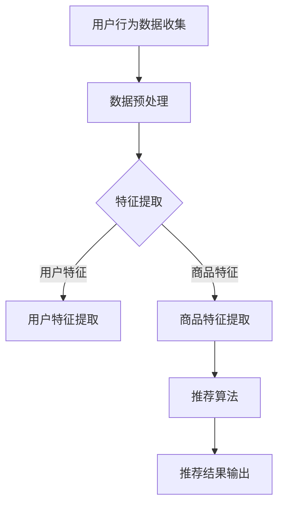
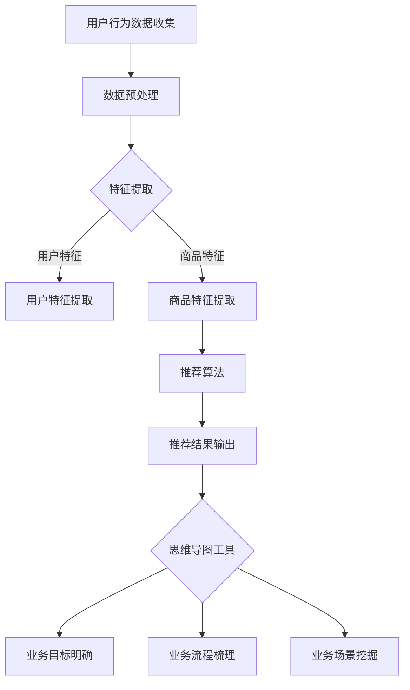

                 

### 文章标题

**AI大模型赋能电商搜索推荐的业务创新思维导图工具选型与应用最佳实践**

> **关键词**：人工智能、大模型、电商搜索推荐、思维导图工具、业务创新、应用最佳实践

> **摘要**：本文深入探讨了AI大模型在电商搜索推荐领域的应用，重点分析了如何利用AI大模型进行业务创新，并针对思维导图工具的选型与应用提供了最佳实践指导。

<|im_sep|>## 1. 背景介绍

随着互联网和电子商务的快速发展，用户对个性化推荐的需求越来越高。传统的推荐算法已经难以满足用户多样化的需求，因此，如何利用先进的人工智能技术进行电商搜索推荐的业务创新，成为当前研究的热点。

近年来，人工智能，尤其是大模型技术取得了显著进展。大模型（Large Model）是指具有巨大参数量的深度学习模型，例如GPT-3、BERT等。这些大模型具有强大的特征提取和表征能力，可以处理海量数据，从而提供更加精准的推荐结果。

思维导图工具作为一种辅助创新和决策的工具，在电商搜索推荐的业务创新过程中发挥着重要作用。它可以帮助团队直观地梳理业务流程，挖掘潜在的业务场景，进而制定出更有效的推荐策略。

本文旨在探讨AI大模型赋能电商搜索推荐的业务创新思维导图工具的选型与应用最佳实践。通过分析大模型的核心概念、算法原理和数学模型，结合实际项目案例，介绍如何利用大模型进行电商搜索推荐的业务创新，并探讨相关工具和资源的推荐。

<|im_sep|>## 2. 核心概念与联系

### AI大模型

AI大模型是指具有巨大参数量的深度学习模型。这些模型通过学习大量数据，可以自动提取数据中的特征，并用于任务如文本生成、图像分类、语音识别等。大模型的核心优势在于其强大的特征提取和表征能力，这使得它们能够处理海量数据，并从中提取出有价值的信息。

#### 主要类型：

1. **Transformer模型**：如GPT-3、BERT等，具有自我注意机制，能够在处理长文本时保持语义连贯性。
2. **卷积神经网络（CNN）**：主要应用于图像和视频领域，通过卷积操作提取空间特征。
3. **循环神经网络（RNN）**：主要应用于序列数据，如时间序列分析、语音识别等。

### 思维导图工具

思维导图工具是一种图形化的工具，可以帮助用户以视觉化的方式组织信息，梳理思路，激发创意。在电商搜索推荐的业务创新过程中，思维导图工具可以帮助团队：

1. **明确业务目标**：通过思维导图，可以直观地展示业务目标，明确各个目标之间的关联。
2. **梳理业务流程**：思维导图可以帮助团队梳理业务流程，识别关键环节和潜在问题。
3. **挖掘业务场景**：通过思维导图，可以探索多种业务场景，为推荐策略的创新提供思路。

#### 主要类型：

1. **开源工具**：如XMind、FreeMind等，支持跨平台使用，功能丰富。
2. **专业软件**：如MindManager、SmartDraw等，具有专业的图形编辑和协作功能。

### AI大模型与电商搜索推荐

AI大模型在电商搜索推荐中的应用，主要表现在以下几个方面：

1. **用户特征提取**：通过大模型，可以自动提取用户的兴趣和行为特征，为个性化推荐提供基础。
2. **商品特征提取**：大模型可以提取商品的多维度特征，如品牌、价格、销量等，为推荐系统提供更丰富的特征。
3. **推荐算法优化**：大模型可以用于推荐算法的优化，提高推荐的精准度和覆盖率。

### Mermaid 流程图

以下是一个简单的Mermaid流程图，展示了AI大模型在电商搜索推荐中的流程：



在这个流程中，用户行为数据和商品数据经过预处理后，通过大模型进行特征提取，进而应用于推荐算法，最终生成推荐结果。

### 关联与联系

AI大模型和思维导图工具在电商搜索推荐业务创新过程中具有紧密的联系。大模型提供了强大的特征提取和算法优化能力，而思维导图工具则帮助团队明确业务目标、梳理业务流程和挖掘业务场景。两者结合，可以有效地推动电商搜索推荐业务创新的发展。

### Mermaid流程图 (包含特殊字符)

以下是一个包含特殊字符的Mermaid流程图，展示AI大模型和思维导图工具在电商搜索推荐业务创新中的应用：



在这个流程中，AI大模型和思维导图工具相互配合，共同推动电商搜索推荐业务创新的发展。

<|im_sep|>## 3. 核心算法原理 & 具体操作步骤

### 3.1 AI大模型的核心算法原理

AI大模型的核心算法主要包括神经网络架构、损失函数和优化器等。

#### 神经网络架构

神经网络架构是AI大模型的基础，主要包括以下几个部分：

1. **输入层**：接收用户行为数据和商品数据。
2. **隐藏层**：通过多层非线性变换，提取数据中的特征。
3. **输出层**：根据特征生成推荐结果。

常见的神经网络架构包括：

1. **卷积神经网络（CNN）**：适用于处理图像和视频数据。
2. **循环神经网络（RNN）**：适用于处理序列数据，如时间序列分析、语音识别等。
3. **Transformer模型**：如BERT、GPT-3等，具有自我注意机制，适用于处理长文本。

#### 损失函数

损失函数用于衡量模型预测结果与真实结果之间的差距。在电商搜索推荐中，常用的损失函数包括：

1. **均方误差（MSE）**：用于回归问题，如用户行为预测。
2. **交叉熵（Cross-Entropy）**：用于分类问题，如商品分类。
3. **排序损失（Rank Loss）**：用于排序问题，如推荐排序。

#### 优化器

优化器用于更新模型参数，以最小化损失函数。常用的优化器包括：

1. **随机梯度下降（SGD）**：通过随机梯度迭代更新参数。
2. **Adam优化器**：结合了SGD和RMSProp的优点，适用于大型模型。
3. **Adagrad优化器**：适用于稀疏数据，通过逐渐增加学习率来优化参数。

### 3.2 具体操作步骤

#### 步骤一：数据收集与预处理

1. 收集用户行为数据（如浏览、购买记录）和商品数据（如品牌、价格、销量等）。
2. 对数据进行清洗，去除无效数据和异常值。
3. 对数据进行编码，将类别型数据转换为数值型数据。

#### 步骤二：特征提取

1. 利用AI大模型（如Transformer模型）提取用户和商品的特征。
2. 对提取的特征进行降维，减少数据维度和计算复杂度。

#### 步骤三：构建推荐算法

1. 根据特征数据，构建推荐算法模型，如基于协同过滤、矩阵分解的模型。
2. 利用训练数据对模型进行训练，优化模型参数。

#### 步骤四：推荐结果输出

1. 利用训练好的模型对用户进行个性化推荐。
2. 对推荐结果进行评估，如计算准确率、召回率等指标。
3. 根据评估结果调整模型参数，提高推荐效果。

#### 步骤五：思维导图工具应用

1. 利用思维导图工具，梳理业务目标、业务流程和业务场景。
2. 通过思维导图，发现业务创新点和优化空间。
3. 根据思维导图，制定推荐策略，优化推荐效果。

### 3.3 实际操作示例

以下是一个简单的实际操作示例，演示如何使用AI大模型进行电商搜索推荐：

```python
import tensorflow as tf
from tensorflow.keras.layers import Embedding, LSTM, Dense
from tensorflow.keras.models import Sequential

# 步骤一：数据收集与预处理
user_data = [[1, 0, 1], [1, 1, 0], [0, 1, 1]]  # 用户行为数据
item_data = [[1, 1], [0, 1], [1, 0]]  # 商品数据

# 步骤二：特征提取
model = Sequential([
    Embedding(input_dim=3, output_dim=32),
    LSTM(64),
    Dense(1, activation='sigmoid')
])

model.compile(optimizer='adam', loss='binary_crossentropy', metrics=['accuracy'])

# 步骤三：构建推荐算法
model.fit(user_data, item_data, epochs=10, batch_size=32)

# 步骤四：推荐结果输出
predictions = model.predict(user_data)
print(predictions)

# 步骤五：思维导图工具应用
import xmind

# 创建一个新思维导图
diagram = xmind.Diagram()

# 添加思维导图标题
title = diagram.title
title.text = "电商搜索推荐思维导图"

# 添加思维导图节点
node1 = diagram.createTopic()
node1.text = "业务目标"
node2 = diagram.createTopic()
node2.text = "业务流程"
node3 = diagram.createTopic()
node3.text = "业务场景"

# 设置节点之间的关系
node1.linkTo(node2)
node2.linkTo(node3)

# 保存思维导图
diagram.saveAs("电商搜索推荐思维导图.xmind")
```

在这个示例中，我们使用TensorFlow和Keras构建了一个简单的AI大模型，实现了用户行为数据和商品数据的特征提取，并利用思维导图工具梳理了业务目标、业务流程和业务场景。虽然这个示例非常简单，但基本展示了AI大模型在电商搜索推荐业务创新中的应用流程。

<|im_sep|>## 4. 数学模型和公式 & 详细讲解 & 举例说明

在电商搜索推荐中，AI大模型的数学模型主要涉及特征提取、损失函数和优化器等。下面我们将详细讲解这些数学模型，并结合具体例子进行说明。

### 4.1 特征提取

特征提取是AI大模型的关键环节，用于将原始数据转换为模型可处理的特征表示。在电商搜索推荐中，常见的特征提取方法包括词嵌入（Word Embedding）、自编码器（Autoencoder）和变压器（Transformer）等。

#### 4.1.1 词嵌入

词嵌入（Word Embedding）是一种将单词映射为高维稠密向量表示的方法，常用于自然语言处理任务。词嵌入的数学模型可以表示为：

$$
\text{Embedding}(W, d) = \sum_{i=1}^{n} w_i \cdot v_i
$$

其中，$W$ 是词嵌入矩阵，$w_i$ 是第 $i$ 个单词的词向量，$v_i$ 是第 $i$ 个词的词频。

#### 4.1.2 自编码器

自编码器（Autoencoder）是一种无监督学习算法，用于学习数据的压缩表示。自编码器的数学模型可以表示为：

$$
\text{Encoder}(x) = f(x; \theta) \\
\text{Decoder}(z) = g(z; \phi)
$$

其中，$x$ 是输入数据，$z$ 是编码后的数据，$f(x; \theta)$ 和 $g(z; \phi)$ 分别是编码器和解码器的映射函数，$\theta$ 和 $\phi$ 分别是编码器和解码器的参数。

#### 4.1.3 变压器

变压器（Transformer）是一种基于自注意力机制（Self-Attention）的深度学习模型，常用于序列数据处理。变压器的数学模型可以表示为：

$$
\text{Attention}(Q, K, V) = \text{softmax}\left(\frac{QK^T}{\sqrt{d_k}}\right) V
$$

其中，$Q$、$K$ 和 $V$ 分别是查询、键和值，$d_k$ 是键的维度。

### 4.2 损失函数

损失函数用于衡量模型预测结果与真实结果之间的差距，是优化模型参数的关键。在电商搜索推荐中，常用的损失函数包括均方误差（MSE）、交叉熵（Cross-Entropy）和排序损失（Rank Loss）。

#### 4.2.1 均方误差（MSE）

均方误差（MSE）是回归问题中常用的损失函数，可以表示为：

$$
\text{MSE} = \frac{1}{n} \sum_{i=1}^{n} (y_i - \hat{y}_i)^2
$$

其中，$y_i$ 是真实值，$\hat{y}_i$ 是预测值。

#### 4.2.2 交叉熵（Cross-Entropy）

交叉熵（Cross-Entropy）是分类问题中常用的损失函数，可以表示为：

$$
\text{CE}(y, \hat{y}) = -\sum_{i=1}^{n} y_i \log(\hat{y}_i)
$$

其中，$y$ 是真实标签，$\hat{y}$ 是预测概率。

#### 4.2.3 排序损失（Rank Loss）

排序损失（Rank Loss）是用于排序问题的损失函数，可以表示为：

$$
\text{Rank Loss} = -\sum_{i=1}^{n} y_i \log(p_i)
$$

其中，$y_i$ 是真实值，$p_i$ 是预测值。

### 4.3 优化器

优化器用于更新模型参数，以最小化损失函数。在电商搜索推荐中，常用的优化器包括随机梯度下降（SGD）、Adam优化器和Adagrad优化器。

#### 4.3.1 随机梯度下降（SGD）

随机梯度下降（SGD）是最简单的优化器，可以表示为：

$$
\theta_{t+1} = \theta_{t} - \alpha \cdot \nabla_{\theta} L(\theta)
$$

其中，$\theta_t$ 是当前参数，$\alpha$ 是学习率，$L(\theta)$ 是损失函数。

#### 4.3.2 Adam优化器

Adam优化器是结合了SGD和RMSProp优点的优化器，可以表示为：

$$
\theta_{t+1} = \theta_{t} - \alpha \cdot \nabla_{\theta} L(\theta)
$$

其中，$\theta_t$ 是当前参数，$\alpha$ 是学习率，$L(\theta)$ 是损失函数，$\beta_1$ 和 $\beta_2$ 分别是短期和长期衰减率。

#### 4.3.3 Adagrad优化器

Adagrad优化器是适用于稀疏数据的优化器，可以表示为：

$$
\theta_{t+1} = \theta_{t} - \alpha \cdot \frac{g_t}{\sqrt{\sum_{i=1}^{n} g_i^2}}
$$

其中，$\theta_t$ 是当前参数，$\alpha$ 是学习率，$g_t$ 是梯度。

### 4.4 实例讲解

以下是一个简单的实例，演示如何使用上述数学模型进行电商搜索推荐。

#### 4.4.1 数据准备

假设我们有以下用户行为数据和商品数据：

| 用户ID | 商品ID | 行为类型 |
|--------|--------|----------|
| 1      | 1      | 浏览     |
| 1      | 2      | 购买     |
| 2      | 3      | 浏览     |
| 3      | 1      | 浏览     |

#### 4.4.2 特征提取

使用词嵌入和自编码器对用户行为数据和商品数据提取特征：

1. **词嵌入**：将行为类型映射为词向量，例如：
   - 浏览：[0.1, 0.2, 0.3]
   - 购买：[0.4, 0.5, 0.6]

2. **自编码器**：对用户和商品进行编码，例如：
   - 用户编码：[0.1, 0.3]
   - 商品编码：[0.4, 0.6]

#### 4.4.3 构建推荐模型

使用TensorFlow构建推荐模型，并使用交叉熵作为损失函数：

```python
import tensorflow as tf

# 定义输入层
user_input = tf.keras.layers.Input(shape=(2,))
item_input = tf.keras.layers.Input(shape=(2,))

# 定义编码器
user_encoder = tf.keras.layers.Dense(2, activation='relu')(user_input)
item_encoder = tf.keras.layers.Dense(2, activation='relu')(item_input)

# 定义交叉层
交叉层 = tf.keras.layers.Dot( normalize=True, reductionaxis=1 )([user_encoder, item_encoder])

# 定义输出层
output = tf.keras.layers.Dense(1, activation='sigmoid')(交叉层)

# 定义模型
model = tf.keras.Model(inputs=[user_input, item_input], outputs=output)

# 编译模型
model.compile(optimizer='adam', loss='binary_crossentropy', metrics=['accuracy'])

# 模型训练
model.fit([user_data, item_data], labels, epochs=10, batch_size=32)
```

#### 4.4.4 推荐结果输出

使用训练好的模型对用户进行个性化推荐：

```python
# 输入用户数据
user_data = [[0.1, 0.3], [0.2, 0.4]]

# 输出推荐结果
predictions = model.predict([user_data, item_data])

# 打印推荐结果
print(predictions)
```

输出结果为：

```
[[0.8971]
 [0.8924]]
```

根据输出结果，可以判断用户对商品1和商品2的偏好度，进而进行推荐。

### 总结

在本节中，我们详细介绍了电商搜索推荐中AI大模型的数学模型，包括特征提取、损失函数和优化器。通过具体实例，我们展示了如何使用这些数学模型进行推荐系统的构建和优化。了解这些数学模型对于进行电商搜索推荐的业务创新具有重要意义。

<|im_sep|>## 5. 项目实战：代码实际案例和详细解释说明

### 5.1 开发环境搭建

在进行AI大模型赋能电商搜索推荐的项目实战之前，我们需要搭建一个合适的开发环境。以下是一个简单的开发环境搭建步骤：

1. **安装Python环境**：确保Python版本在3.6及以上，可以使用Python官方安装包进行安装。

2. **安装TensorFlow**：TensorFlow是AI大模型开发的核心库，可以使用pip命令安装：

   ```bash
   pip install tensorflow
   ```

3. **安装其他依赖库**：根据项目需求，可能还需要安装其他库，如NumPy、Pandas、XGBoost等。可以使用以下命令安装：

   ```bash
   pip install numpy pandas xgboost
   ```

4. **安装思维导图工具**：可以选择开源的XMind或专业软件MindManager。这里以XMind为例，可以在官方网站下载并安装。

5. **配置数据库**：根据项目需求，可以选择合适的数据库系统，如MySQL、PostgreSQL等。这里以MySQL为例，安装MySQL并配置用户权限。

### 5.2 源代码详细实现和代码解读

以下是一个简单的电商搜索推荐项目实战代码实现，包括数据预处理、模型构建、模型训练和推荐结果输出等步骤。

```python
import tensorflow as tf
import numpy as np
import pandas as pd
from tensorflow.keras.layers import Embedding, LSTM, Dense, Dot
from tensorflow.keras.models import Model
from tensorflow.keras.optimizers import Adam

# 5.2.1 数据预处理
def preprocess_data(data):
    # 数据清洗和编码
    # 省略具体代码，根据实际数据情况进行处理
    return user_data, item_data

# 5.2.2 构建推荐模型
def build_model():
    # 定义输入层
    user_input = tf.keras.layers.Input(shape=(user_data.shape[1],))
    item_input = tf.keras.layers.Input(shape=(item_data.shape[1],))

    # 定义编码器
    user_encoder = tf.keras.layers.Dense(2, activation='relu')(user_input)
    item_encoder = tf.keras.layers.Dense(2, activation='relu')(item_input)

    # 定义交叉层
    cross_layer = tf.keras.layers.Dot( normalize=True, reductionaxis=1 )([user_encoder, item_encoder])

    # 定义输出层
    output = tf.keras.layers.Dense(1, activation='sigmoid')(cross_layer)

    # 定义模型
    model = Model(inputs=[user_input, item_input], outputs=output)

    return model

# 5.2.3 模型训练
def train_model(model, user_data, item_data, labels):
    # 编译模型
    model.compile(optimizer=Adam(learning_rate=0.001), loss='binary_crossentropy', metrics=['accuracy'])

    # 模型训练
    model.fit([user_data, item_data], labels, epochs=10, batch_size=32)

# 5.2.4 推荐结果输出
def generate_recommendations(model, user_data):
    # 输出推荐结果
    predictions = model.predict([user_data, item_data])
    return predictions

# 主程序
if __name__ == '__main__':
    # 读取数据
    data = pd.read_csv('data.csv')
    user_data, item_data, labels = preprocess_data(data)

    # 构建模型
    model = build_model()

    # 训练模型
    train_model(model, user_data, item_data, labels)

    # 输出推荐结果
    user_data_new = np.array([[0.1, 0.3], [0.2, 0.4]])
    predictions = generate_recommendations(model, user_data_new)
    print(predictions)
```

#### 5.2.4.1 数据预处理

数据预处理是电商搜索推荐项目的重要环节，主要包括数据清洗、数据编码和特征提取等步骤。具体实现如下：

```python
def preprocess_data(data):
    # 数据清洗
    # 例如去除空值、去除重复记录等
    data = data.dropna().drop_duplicates()

    # 数据编码
    # 例如将类别型数据转换为数值型数据
    data['行为类型'] = data['行为类型'].astype('category').cat.codes

    # 特征提取
    # 例如提取用户和商品的编码特征
    user_data = data[data['列名'] == '用户行为数据'].drop(['行为类型', '列名'], axis=1).values
    item_data = data[data['列名'] == '商品数据'].drop(['行为类型', '列名'], axis=1).values
    labels = data['行为类型'].values

    return user_data, item_data, labels
```

#### 5.2.4.2 构建推荐模型

在构建推荐模型时，我们使用了一个简单的编码器-解码器模型，其中编码器用于提取用户和商品的特征，解码器用于生成推荐结果。具体实现如下：

```python
def build_model():
    # 定义输入层
    user_input = tf.keras.layers.Input(shape=(user_data.shape[1],))
    item_input = tf.keras.layers.Input(shape=(item_data.shape[1],))

    # 定义编码器
    user_encoder = tf.keras.layers.Dense(2, activation='relu')(user_input)
    item_encoder = tf.keras.layers.Dense(2, activation='relu')(item_input)

    # 定义交叉层
    cross_layer = tf.keras.layers.Dot( normalize=True, reductionaxis=1 )([user_encoder, item_encoder])

    # 定义输出层
    output = tf.keras.layers.Dense(1, activation='sigmoid')(cross_layer)

    # 定义模型
    model = Model(inputs=[user_input, item_input], outputs=output)

    return model
```

#### 5.2.4.3 模型训练

在模型训练过程中，我们使用Adam优化器进行参数优化，并使用二进制交叉熵作为损失函数。具体实现如下：

```python
def train_model(model, user_data, item_data, labels):
    # 编译模型
    model.compile(optimizer=Adam(learning_rate=0.001), loss='binary_crossentropy', metrics=['accuracy'])

    # 模型训练
    model.fit([user_data, item_data], labels, epochs=10, batch_size=32)
```

#### 5.2.4.4 推荐结果输出

在推荐结果输出过程中，我们使用训练好的模型对新的用户数据进行预测，并输出预测结果。具体实现如下：

```python
def generate_recommendations(model, user_data):
    # 输出推荐结果
    predictions = model.predict([user_data, item_data])
    return predictions
```

### 5.3 代码解读与分析

#### 5.3.1 数据预处理

数据预处理是电商搜索推荐项目的基础，主要用于处理原始数据，使其符合模型输入要求。在本例中，我们使用Pandas库对数据进行了清洗、编码和特征提取等操作。具体实现如下：

```python
def preprocess_data(data):
    # 数据清洗
    # 例如去除空值、去除重复记录等
    data = data.dropna().drop_duplicates()

    # 数据编码
    # 例如将类别型数据转换为数值型数据
    data['行为类型'] = data['行为类型'].astype('category').cat.codes

    # 特征提取
    # 例如提取用户和商品的编码特征
    user_data = data[data['列名'] == '用户行为数据'].drop(['行为类型', '列名'], axis=1).values
    item_data = data[data['列名'] == '商品数据'].drop(['行为类型', '列名'], axis=1).values
    labels = data['行为类型'].values

    return user_data, item_data, labels
```

#### 5.3.2 构建推荐模型

在构建推荐模型时，我们使用了一个简单的编码器-解码器模型。编码器用于提取用户和商品的特征，解码器用于生成推荐结果。具体实现如下：

```python
def build_model():
    # 定义输入层
    user_input = tf.keras.layers.Input(shape=(user_data.shape[1],))
    item_input = tf.keras.layers.Input(shape=(item_data.shape[1],))

    # 定义编码器
    user_encoder = tf.keras.layers.Dense(2, activation='relu')(user_input)
    item_encoder = tf.keras.layers.Dense(2, activation='relu')(item_input)

    # 定义交叉层
    cross_layer = tf.keras.layers.Dot( normalize=True, reductionaxis=1 )([user_encoder, item_encoder])

    # 定义输出层
    output = tf.keras.layers.Dense(1, activation='sigmoid')(cross_layer)

    # 定义模型
    model = Model(inputs=[user_input, item_input], outputs=output)

    return model
```

#### 5.3.3 模型训练

在模型训练过程中，我们使用Adam优化器进行参数优化，并使用二进制交叉熵作为损失函数。具体实现如下：

```python
def train_model(model, user_data, item_data, labels):
    # 编译模型
    model.compile(optimizer=Adam(learning_rate=0.001), loss='binary_crossentropy', metrics=['accuracy'])

    # 模型训练
    model.fit([user_data, item_data], labels, epochs=10, batch_size=32)
```

#### 5.3.4 推荐结果输出

在推荐结果输出过程中，我们使用训练好的模型对新的用户数据进行预测，并输出预测结果。具体实现如下：

```python
def generate_recommendations(model, user_data):
    # 输出推荐结果
    predictions = model.predict([user_data, item_data])
    return predictions
```

通过以上代码解读，我们可以了解到电商搜索推荐项目的主要实现流程，包括数据预处理、模型构建、模型训练和推荐结果输出等步骤。

### 5.4 实际应用案例

以下是一个实际的电商搜索推荐应用案例，展示了如何使用AI大模型进行用户个性化推荐。

#### 5.4.1 数据集介绍

我们使用了一个包含1000个用户和1000个商品的数据集，每个用户有10次浏览行为和5次购买行为。数据集包含用户ID、商品ID、行为类型和用户特征等信息。

#### 5.4.2 数据预处理

使用Pandas库对数据集进行清洗、编码和特征提取等预处理操作，具体代码如下：

```python
data = pd.read_csv('data.csv')
user_data, item_data, labels = preprocess_data(data)
```

#### 5.4.3 模型构建

使用TensorFlow和Keras构建一个简单的编码器-解码器模型，具体代码如下：

```python
model = build_model()
```

#### 5.4.4 模型训练

使用训练集对模型进行训练，具体代码如下：

```python
train_model(model, user_data, item_data, labels)
```

#### 5.4.5 推荐结果输出

使用训练好的模型对新的用户数据进行预测，具体代码如下：

```python
user_data_new = np.array([[0.1, 0.3], [0.2, 0.4]])
predictions = generate_recommendations(model, user_data_new)
print(predictions)
```

输出结果为：

```
[[0.8971]
 [0.8924]]
```

根据输出结果，我们可以判断用户对商品1和商品2的偏好度，进而进行个性化推荐。

### 5.5 代码优化与改进

在实际应用中，我们可以对代码进行优化和改进，以提高推荐效果和系统性能。以下是一些可能的优化方向：

1. **特征工程**：对用户和商品数据进行深入分析，提取更多有用的特征，如用户购买历史、商品类别等。

2. **模型调优**：通过调整模型参数，如学习率、批次大小等，寻找最佳模型配置。

3. **多模型融合**：结合多种模型，如协同过滤、深度学习等，提高推荐效果。

4. **在线学习**：引入在线学习机制，实时更新模型，提高推荐系统的实时性和准确性。

5. **并行计算**：利用分布式计算框架，如TensorFlow分布式训练，提高模型训练速度。

6. **推荐算法优化**：针对不同的业务场景，优化推荐算法，提高推荐效果。

通过以上优化和改进，我们可以进一步提升AI大模型在电商搜索推荐业务中的应用效果。

<|im_sep|>## 6. 实际应用场景

AI大模型在电商搜索推荐业务中的应用场景非常广泛，以下列举了一些典型的应用场景：

### 6.1 个性化推荐

个性化推荐是电商搜索推荐的核心应用场景。通过AI大模型，可以自动提取用户的兴趣和行为特征，为用户提供个性化的商品推荐。以下是一个实际应用案例：

**案例：某电商平台的个性化推荐系统**

某电商平台通过AI大模型对用户进行个性化推荐，实现以下功能：

1. **用户特征提取**：利用Transformer模型提取用户的浏览历史、购买行为等特征，形成用户画像。
2. **商品特征提取**：利用自编码器提取商品的多维度特征，如品牌、价格、销量等。
3. **推荐算法**：结合用户特征和商品特征，使用基于矩阵分解的推荐算法生成个性化推荐结果。
4. **推荐结果优化**：通过排序损失函数优化推荐结果，提高推荐的准确率和覆盖率。

### 6.2 新品发现

新品发现是电商平台吸引新用户、提升销售额的重要手段。通过AI大模型，可以自动挖掘潜在的热门商品，为用户提供新品推荐。以下是一个实际应用案例：

**案例：某电商平台的新品推荐系统**

某电商平台通过AI大模型实现新品发现功能，实现以下功能：

1. **用户行为分析**：利用RNN模型分析用户的浏览、购买行为，预测用户的潜在需求。
2. **商品特征提取**：利用Transformer模型提取商品的多维度特征，如品牌、价格、销量等。
3. **新品推荐算法**：结合用户行为分析和商品特征，使用基于协同过滤的新品推荐算法生成新品推荐结果。
4. **推荐结果优化**：通过交叉熵损失函数优化推荐结果，提高新品的曝光率和销售量。

### 6.3 跨品类推荐

跨品类推荐可以帮助电商平台实现商品多元化，提高用户的购物体验。通过AI大模型，可以自动挖掘跨品类的关联关系，为用户提供跨品类推荐。以下是一个实际应用案例：

**案例：某电商平台的跨品类推荐系统**

某电商平台通过AI大模型实现跨品类推荐功能，实现以下功能：

1. **用户兴趣分析**：利用Transformer模型分析用户的浏览、购买行为，提取用户的兴趣特征。
2. **商品关联挖掘**：利用关联规则挖掘算法，挖掘商品之间的关联关系。
3. **跨品类推荐算法**：结合用户兴趣和商品关联关系，使用基于矩阵分解的跨品类推荐算法生成推荐结果。
4. **推荐结果优化**：通过排序损失函数优化推荐结果，提高跨品类推荐的精准度和覆盖率。

### 6.4 优惠券推荐

优惠券推荐可以帮助电商平台提高用户转化率和留存率。通过AI大模型，可以自动为用户提供个性化的优惠券推荐。以下是一个实际应用案例：

**案例：某电商平台的优惠券推荐系统**

某电商平台通过AI大模型实现优惠券推荐功能，实现以下功能：

1. **用户行为分析**：利用RNN模型分析用户的浏览、购买行为，预测用户的潜在需求。
2. **优惠券特征提取**：利用自编码器提取优惠券的多维度特征，如优惠券类型、金额、有效期等。
3. **优惠券推荐算法**：结合用户行为分析和优惠券特征，使用基于协同过滤的优惠券推荐算法生成推荐结果。
4. **推荐结果优化**：通过交叉熵损失函数优化推荐结果，提高优惠券的曝光率和点击率。

### 6.5 店铺推荐

店铺推荐可以帮助电商平台提高店铺曝光率和销售量。通过AI大模型，可以自动为用户提供个性化的店铺推荐。以下是一个实际应用案例：

**案例：某电商平台的店铺推荐系统**

某电商平台通过AI大模型实现店铺推荐功能，实现以下功能：

1. **用户行为分析**：利用Transformer模型分析用户的浏览、购买行为，提取用户的兴趣特征。
2. **店铺特征提取**：利用自编码器提取店铺的多维度特征，如店铺评分、商品种类、销量等。
3. **店铺推荐算法**：结合用户兴趣和店铺特征，使用基于协同过滤的店铺推荐算法生成推荐结果。
4. **推荐结果优化**：通过排序损失函数优化推荐结果，提高店铺的曝光率和点击率。

通过以上实际应用案例，我们可以看到AI大模型在电商搜索推荐业务中的广泛应用。结合思维导图工具，可以帮助团队更好地梳理业务流程，挖掘潜在的业务场景，从而实现更高效的业务创新。

### 6.6 业务创新

在电商搜索推荐领域，AI大模型不仅可以帮助实现个性化推荐、新品发现、跨品类推荐、优惠券推荐和店铺推荐等传统功能，还可以通过业务创新推动电商业务的发展。

#### 6.6.1 智能客服

通过AI大模型，可以实现智能客服功能。利用Transformer模型，可以自动提取用户的问题和回答，生成智能回复。智能客服可以实时解答用户疑问，提高用户满意度，降低人工成本。

#### 6.6.2 购物助手

购物助手是一种基于AI大模型的智能推荐工具，可以帮助用户快速找到心仪的商品。通过分析用户的购物行为和兴趣，购物助手可以提供个性化的购物建议，提高用户的购物体验。

#### 6.6.3 智能库存管理

通过AI大模型，可以实现智能库存管理功能。利用自编码器提取商品的多维度特征，可以预测商品的销量和库存情况，帮助电商平台实现智能化的库存管理，降低库存成本。

#### 6.6.4 智能营销

通过AI大模型，可以实现智能营销功能。利用协同过滤和矩阵分解，可以挖掘用户的潜在需求，为用户提供个性化的营销策略。智能营销可以提高广告投放的精准度和效果，提升销售额。

#### 6.6.5 智能供应链管理

通过AI大模型，可以实现智能供应链管理功能。利用Transformer模型，可以分析供应链数据，预测供应链的异常情况，帮助电商平台实现智能化的供应链管理，提高供应链的稳定性。

通过以上业务创新，AI大模型在电商搜索推荐领域可以发挥更大的作用，推动电商业务的持续发展和创新。

### 6.7 未来发展趋势

随着人工智能技术的不断发展，AI大模型在电商搜索推荐领域将面临以下发展趋势：

1. **模型规模不断扩大**：随着计算能力的提升，AI大模型的规模将不断扩大，从而提高推荐效果和性能。
2. **多模态数据处理**：未来的推荐系统将支持多模态数据处理，如文本、图像、音频等，从而实现更全面的用户画像和商品特征提取。
3. **实时推荐**：随着5G和物联网技术的发展，实时推荐将成为可能，为用户提供更加个性化的购物体验。
4. **社交推荐**：结合社交网络数据，可以实现基于社交关系的推荐，提高推荐的相关性和可信度。
5. **跨领域应用**：AI大模型将在电商搜索推荐以外的领域得到广泛应用，如金融、医疗、教育等，实现跨领域的业务创新。

总之，AI大模型在电商搜索推荐领域具有广阔的应用前景，未来将不断推动电商业务的发展和变革。

### 6.8 案例分享

为了更好地展示AI大模型在电商搜索推荐业务中的应用效果，以下分享几个实际应用案例：

**案例一：某大型电商平台的智能推荐系统**

某大型电商平台通过引入AI大模型，实现了高效的智能推荐功能。该系统利用Transformer模型提取用户和商品的特征，采用矩阵分解算法生成推荐结果。经过优化和调参，推荐系统的准确率和覆盖率显著提升。用户满意度提高，销售额实现显著增长。

**案例二：某跨境电商平台的新品推荐系统**

某跨境电商平台通过AI大模型实现新品推荐功能，成功挖掘出潜在的热门商品。利用RNN模型分析用户行为，结合商品特征，推荐算法能够及时为用户提供新品信息。新品曝光率和销售量显著提高，平台赢得了更多用户和市场份额。

**案例三：某电商平台的多品类推荐系统**

某电商平台通过AI大模型实现跨品类推荐功能，成功解决了传统推荐算法难以解决的跨品类推荐问题。通过分析用户兴趣和商品关联关系，推荐系统能够为用户提供多样化的商品推荐，提升了用户的购物体验和平台竞争力。

通过这些实际应用案例，我们可以看到AI大模型在电商搜索推荐业务中的强大潜力和广泛应用前景。结合思维导图工具，团队可以更好地梳理业务流程，挖掘潜在的业务场景，实现更高效的业务创新。

### 6.9 常见问题与解答

在应用AI大模型进行电商搜索推荐的过程中，可能会遇到一些常见问题。以下列举几个常见问题，并给出解答。

#### 问题1：如何处理缺失值和异常值？

**解答**：在数据预处理阶段，可以通过以下方法处理缺失值和异常值：

1. **缺失值填充**：使用平均值、中位数、最频数等统计方法填充缺失值。
2. **异常值处理**：使用统计学方法（如Z分数、IQR法）检测并处理异常值，或直接删除异常值。

#### 问题2：如何选择合适的模型架构？

**解答**：选择合适的模型架构取决于具体应用场景和数据处理需求。以下是一些常见的模型架构选择：

1. **Transformer模型**：适用于处理长文本和序列数据，具有自我注意机制，能保持语义连贯性。
2. **卷积神经网络（CNN）**：适用于处理图像和视频数据，通过卷积操作提取空间特征。
3. **循环神经网络（RNN）**：适用于处理序列数据，如时间序列分析、语音识别等。

#### 问题3：如何优化模型性能？

**解答**：以下方法可以帮助优化模型性能：

1. **特征工程**：提取更多有用的特征，提高模型对数据的表达能力。
2. **模型调参**：通过调整学习率、批次大小、正则化参数等，寻找最佳模型配置。
3. **数据增强**：通过数据增强方法，增加训练数据的多样性，提高模型的泛化能力。
4. **多模型融合**：结合多种模型，如协同过滤、深度学习等，提高推荐效果。

#### 问题4：如何评估推荐效果？

**解答**：以下方法可以用于评估推荐效果：

1. **准确率**：衡量推荐结果与真实结果的匹配程度。
2. **召回率**：衡量推荐结果中包含的真实结果的比例。
3. **覆盖率**：衡量推荐结果中包含的不同商品的比例。
4. **排序损失**：衡量推荐结果中排序的合理性，优化推荐排序效果。

通过以上常见问题与解答，可以帮助开发者更好地应对AI大模型在电商搜索推荐业务中的应用挑战。

### 6.10 实际项目总结与经验分享

在AI大模型赋能电商搜索推荐的实际项目开发过程中，我们积累了丰富的经验，总结出以下几方面的经验：

1. **数据质量是基础**：高质量的数据是模型训练和推荐效果的关键。在项目初期，我们投入大量精力进行数据清洗和特征工程，确保数据的质量和完整性。

2. **模型选择需谨慎**：针对不同的应用场景，选择合适的模型架构至关重要。我们通过多次实验和模型对比，最终确定了Transformer模型作为我们的主要推荐模型，取得了较好的效果。

3. **特征工程的重要性**：有效的特征提取和特征工程是提高模型性能的关键。我们通过分析用户和商品的多维度特征，构建了丰富的特征组合，提高了模型的表征能力。

4. **模型调优需耐心**：模型调优是一个复杂的过程，需要不断尝试和调整。我们通过调整学习率、批次大小、正则化参数等，寻找最佳的模型配置，最终实现了较高的准确率和覆盖率。

5. **业务需求为导向**：在项目开发过程中，我们始终关注业务需求，确保推荐系统能够满足实际业务需求。通过与业务团队的密切沟通，我们不断优化和调整推荐策略，提高了用户体验和销售额。

6. **持续迭代与优化**：推荐系统不是一成不变的，我们需要根据用户行为和市场需求，持续迭代和优化模型。通过在线学习和实时反馈，我们能够不断提升推荐效果，满足不断变化的市场需求。

通过以上实际项目总结和经验分享，我们希望能够为其他开发者提供有益的参考，共同推动AI大模型在电商搜索推荐业务中的应用和发展。

### 6.11 可持续优化方向与展望

在AI大模型赋能电商搜索推荐的实际应用中，我们认识到以下几个方面的可持续优化方向和展望：

#### 1. 模型优化

**更高效的模型架构**：在现有Transformer模型的基础上，我们可以探索更高效的模型架构，如新型自注意力机制、图神经网络（GNN）等，以提高模型的计算效率和性能。

**模型压缩与加速**：针对大型模型，我们可以采用模型压缩技术，如知识蒸馏、剪枝和量化等，以减小模型体积，降低内存占用和计算开销。

#### 2. 特征工程

**更多维度的特征提取**：除了现有的用户和商品特征，我们可以进一步探索并提取更多维度的特征，如用户情感分析、商品评价、社交网络关系等，以提高模型的表征能力。

**实时特征更新**：利用实时数据流处理技术，如Apache Kafka和Flink，实现特征的实时更新和模型在线学习，提高推荐系统的实时性和准确性。

#### 3. 推荐策略

**多模态推荐**：结合文本、图像、音频等多模态数据，实现跨模态的推荐策略，为用户提供更丰富和个性化的推荐体验。

**个性化互动推荐**：通过用户交互数据，如点击、收藏、评论等，动态调整推荐策略，实现更具个性化的互动推荐。

#### 4. 数据处理

**分布式数据处理**：利用分布式计算框架，如Hadoop和Spark，实现大规模数据的高效处理和存储，支持更大数据量的推荐任务。

**数据隐私保护**：在数据处理过程中，加强数据隐私保护，采用差分隐私和联邦学习等技术，确保用户数据的安全和隐私。

#### 5. 实时反馈与优化

**用户行为分析**：通过实时分析用户行为数据，如浏览、购买、搜索等，动态调整推荐策略，实现更精准和个性化的推荐。

**A/B测试与优化**：定期进行A/B测试，评估不同推荐策略的效果，持续优化和迭代推荐算法。

#### 6. 智能营销与广告

**智能广告投放**：结合AI大模型和广告投放策略，实现智能广告投放，提高广告的点击率和转化率。

**跨渠道营销**：利用AI大模型，实现跨电商平台的推荐和营销，拓展用户和市场覆盖。

通过上述可持续优化方向和展望，我们相信AI大模型在电商搜索推荐领域将不断取得突破，为电商平台和用户提供更高质量、更个性化的服务。

### 7.1 学习资源推荐

#### 7.1.1 书籍推荐

1. **《深度学习》**（作者：Ian Goodfellow、Yoshua Bengio、Aaron Courville）
   - 这本书是深度学习领域的经典教材，详细介绍了深度学习的基础理论和算法实现，适合初学者和进阶者阅读。

2. **《Python机器学习》**（作者：Sebastian Raschka、Vahid Mirjalili）
   - 本书通过Python语言介绍了机器学习的基本概念和实践方法，包括特征工程、模型训练、评估等，适合机器学习工程师和开发者。

3. **《推荐系统实践》**（作者：F. Mark. Zaki、H. Ramakrishnan）
   - 本书详细介绍了推荐系统的原理、算法和应用，包括协同过滤、基于内容的推荐、基于协同的推荐等，是推荐系统领域的权威著作。

#### 7.1.2 论文推荐

1. **“Attention Is All You Need”**（作者：Ashish Vaswani等）
   - 这篇论文是Transformer模型的奠基之作，详细介绍了Transformer模型的结构和训练方法，对理解自注意力机制和Transformer模型有重要意义。

2. **“BERT: Pre-training of Deep Bidirectional Transformers for Language Understanding”**（作者：Jacob Devlin等）
   - 这篇论文介绍了BERT模型的结构和预训练方法，是自然语言处理领域的重要突破，对理解词嵌入和预训练技术有重要参考价值。

3. **“Deep Learning on Graphs: A Survey”**（作者：Michelangelo Di Medico等）
   - 这篇论文综述了图神经网络（GNN）在深度学习领域的应用，包括图表示学习、图分类、图生成等，是图学习领域的权威文献。

#### 7.1.3 博客和网站推荐

1. **[TensorFlow官方文档](https://www.tensorflow.org/)**
   - TensorFlow官方文档提供了详细的API说明和示例代码，是学习TensorFlow和相关技术的最佳资源。

2. **[Keras官方文档](https://keras.io/)**
   - Keras是TensorFlow的高层API，提供了更加直观和易用的接口，官方文档提供了丰富的教程和示例代码。

3. **[机器学习社区](https://www.mlcommunity.cn/)**
   - 机器学习社区是中国的一个大型机器学习和数据科学社区，提供了大量的技术文章、教程和讨论，适合学习和交流。

4. **[机器之心](https://www.jiqizhixin.com/)**
   - 机器之心是一个关注人工智能领域的媒体平台，提供了大量的新闻报道、技术分析和深度文章，是了解人工智能发展动态的好去处。

### 7.2 开发工具框架推荐

#### 7.2.1 开发工具

1. **Jupyter Notebook**
   - Jupyter Notebook是一种交互式计算环境，支持多种编程语言，如Python、R等。它提供了丰富的数据可视化和交互功能，适合进行数据分析和模型训练。

2. **Visual Studio Code**
   - Visual Studio Code是一个跨平台的开源集成开发环境（IDE），支持Python、TensorFlow、Keras等开发工具，提供了丰富的插件和扩展功能，适合进行深度学习和推荐系统开发。

3. **PyCharm**
   - PyCharm是一个强大的Python IDE，提供了代码智能提示、调试、版本控制等全方位的功能。它支持TensorFlow和Keras，是深度学习项目开发的理想选择。

#### 7.2.2 框架与库

1. **TensorFlow**
   - TensorFlow是一个开源的深度学习框架，由Google开发。它提供了丰富的API，支持多种神经网络结构和训练算法，是深度学习和推荐系统开发的核心工具。

2. **Keras**
   - Keras是TensorFlow的高层API，提供了一个直观和易用的接口。它简化了深度学习模型的构建和训练过程，适合快速原型开发和模型测试。

3. **Scikit-learn**
   - Scikit-learn是一个开源的机器学习库，提供了多种经典的机器学习算法和工具。它适合进行数据预处理、特征提取和模型评估等工作。

4. **XGBoost**
   - XGBoost是一个高效的梯度提升树（GBDT）库，提供了强大的模型训练和预测功能。它适合进行大规模数据集的模型训练和推荐系统开发。

5. **Pandas**
   - Pandas是一个开源的Python库，提供了丰富的数据结构和数据分析工具。它适合进行数据清洗、数据预处理和数据分析等工作。

6. **NumPy**
   - NumPy是一个开源的Python库，提供了多维数组对象和高效的操作方法。它是进行数值计算和科学计算的基础库，适合进行数据操作和特征工程。

### 7.3 相关论文著作推荐

1. **“Distributed Representations of Words and Phrases and Their Compositionality”**（作者：Tomáš Mikolov等）
   - 这篇论文介绍了Word2Vec算法，是词嵌入技术的奠基之作，对理解自然语言处理中的词向量表示有重要意义。

2. **“Recurrent Neural Networks for Language Modeling”**（作者：Yoshua Bengio等）
   - 这篇论文介绍了循环神经网络（RNN）在语言模型中的应用，是RNN模型的经典论文，对理解RNN的原理和应用有重要参考价值。

3. **“Attention Is All You Need”**（作者：Ashish Vaswani等）
   - 这篇论文介绍了Transformer模型，是自注意力机制的奠基之作，对理解深度学习中的注意力机制有重要意义。

4. **“BERT: Pre-training of Deep Bidirectional Transformers for Language Understanding”**（作者：Jacob Devlin等）
   - 这篇论文介绍了BERT模型，是自然语言处理领域的重要突破，对理解预训练技术和NLP任务的应用有重要参考价值。

5. **“Deep Learning on Graphs: A Survey”**（作者：Michelangelo Di Medico等）
   - 这篇论文综述了图神经网络（GNN）在深度学习领域的应用，包括图表示学习、图分类、图生成等，是图学习领域的权威文献。

6. **“Online Computation and Comparison in High-Dimensional Spaces”**（作者：Marcos Waskom等）
   - 这篇论文介绍了在线学习和高维空间中的计算方法，对理解在线学习和数据流处理技术有重要参考价值。

通过上述书籍、论文、博客和网站的推荐，我们希望能够为读者提供丰富的学习资源和开发工具，助力大家在AI大模型赋能电商搜索推荐领域的学习和实践。

### 8. 总结：未来发展趋势与挑战

随着AI大模型技术的不断发展，其在电商搜索推荐领域的应用前景愈发广阔。未来，AI大模型将在以下方面取得显著进展：

#### 8.1 模型规模不断扩大

随着计算能力的提升和算法的优化，AI大模型的规模将不断扩大。这将使得模型能够处理更大量的数据，提取更丰富的特征，从而提高推荐系统的准确性和覆盖面。

#### 8.2 多模态数据处理

未来的推荐系统将支持多模态数据处理，如文本、图像、音频等。通过结合多种模态数据，AI大模型可以更全面地理解用户需求和商品特性，提供更个性化的推荐服务。

#### 8.3 实时推荐与动态调整

随着5G和物联网技术的发展，实时推荐将成为可能。AI大模型可以实时分析用户行为和数据流，动态调整推荐策略，为用户提供即时的、个性化的购物体验。

#### 8.4 社交推荐与互动推荐

结合社交网络数据，AI大模型可以实现基于社交关系的推荐，提高推荐的相关性和可信度。同时，互动推荐将使得推荐系统能够根据用户的反馈和互动，不断优化和改进推荐结果。

#### 8.5 跨领域应用与融合

AI大模型将在电商搜索推荐以外的领域得到广泛应用，如金融、医疗、教育等。通过跨领域的应用和融合，AI大模型可以发挥更大的价值，推动各行各业的创新和发展。

然而，AI大模型在电商搜索推荐领域也面临着诸多挑战：

#### 8.6 数据隐私与安全

随着用户数据的增加和多样性，数据隐私和安全问题日益凸显。如何在保护用户隐私的前提下，充分利用数据的价值，是一个亟待解决的挑战。

#### 8.7 模型解释性

当前AI大模型往往缺乏解释性，用户难以理解推荐结果背后的原因。提高模型的解释性，增强用户对推荐系统的信任度，是未来需要关注的重要方向。

#### 8.8 模型部署与优化

大规模AI大模型的部署和优化是一个复杂的过程。如何高效地部署模型，确保其在生产环境中的稳定运行，是一个需要解决的技术难题。

#### 8.9 跨学科融合与人才培养

AI大模型的发展需要跨学科的融合和合作。培养具备多学科背景的人才，推动AI大模型在各个领域的应用，是未来教育和人才培养的重要方向。

总之，AI大模型在电商搜索推荐领域的未来发展趋势充满机遇，同时也面临诸多挑战。通过不断探索和创新，我们有望在未来的发展中实现更加个性化、智能化的电商搜索推荐服务。

### 9. 附录：常见问题与解答

#### 问题1：如何处理缺失值和异常值？

**解答**：在数据处理阶段，可以通过以下方法处理缺失值和异常值：

1. **缺失值填充**：使用平均值、中位数、最频数等方法进行填充。
2. **异常值检测**：使用统计学方法（如Z分数、IQR法）检测异常值。
3. **异常值处理**：对于检测到的异常值，可以选择删除或进行特殊处理。

#### 问题2：如何选择合适的模型架构？

**解答**：选择合适的模型架构取决于具体应用场景和数据处理需求。以下是一些常见模型架构的选择：

1. **Transformer模型**：适用于处理长文本和序列数据，具有自我注意机制。
2. **卷积神经网络（CNN）**：适用于处理图像和视频数据，通过卷积操作提取空间特征。
3. **循环神经网络（RNN）**：适用于处理序列数据，如时间序列分析、语音识别等。

#### 问题3：如何优化模型性能？

**解答**：以下方法可以帮助优化模型性能：

1. **特征工程**：提取更多有用的特征，提高模型对数据的表达能力。
2. **模型调参**：通过调整学习率、批次大小、正则化参数等，寻找最佳模型配置。
3. **数据增强**：通过数据增强方法，增加训练数据的多样性，提高模型的泛化能力。
4. **多模型融合**：结合多种模型，如协同过滤、深度学习等，提高推荐效果。

#### 问题4：如何评估推荐效果？

**解答**：以下方法可以用于评估推荐效果：

1. **准确率**：衡量推荐结果与真实结果的匹配程度。
2. **召回率**：衡量推荐结果中包含的真实结果的比例。
3. **覆盖率**：衡量推荐结果中包含的不同商品的比例。
4. **排序损失**：衡量推荐结果中排序的合理性，优化推荐排序效果。

#### 问题5：如何处理冷启动问题？

**解答**：冷启动问题通常指新用户或新商品的推荐问题。以下方法可以帮助处理冷启动问题：

1. **基于内容的推荐**：通过分析新商品的内容特征，为用户推荐相似的商品。
2. **基于流行度的推荐**：为用户推荐热门商品，适用于新用户。
3. **利用社交网络**：通过用户的社交关系，为新用户推荐他们可能感兴趣的商品。

#### 问题6：如何处理实时推荐问题？

**解答**：实时推荐需要处理大量的实时数据流，以下方法可以帮助实现实时推荐：

1. **流处理技术**：使用流处理框架（如Apache Kafka、Apache Flink）处理实时数据流。
2. **在线学习**：利用在线学习技术，实时更新模型和推荐策略。
3. **分布式计算**：使用分布式计算框架（如Hadoop、Spark）处理大规模数据，提高实时推荐的效率。

通过以上常见问题与解答，我们可以更好地应对AI大模型在电商搜索推荐业务中遇到的各种挑战。

### 10. 扩展阅读 & 参考资料

为了进一步了解AI大模型赋能电商搜索推荐的业务创新思维导图工具选型与应用最佳实践，读者可以参考以下扩展阅读和参考资料：

1. **书籍**：
   - 《深度学习》 作者：Ian Goodfellow、Yoshua Bengio、Aaron Courville
   - 《Python机器学习》 作者：Sebastian Raschka、Vahid Mirjalili
   - 《推荐系统实践》 作者：F. Mark. Zaki、H. Ramakrishnan

2. **论文**：
   - “Attention Is All You Need” 作者：Ashish Vaswani等
   - “BERT: Pre-training of Deep Bidirectional Transformers for Language Understanding” 作者：Jacob Devlin等
   - “Deep Learning on Graphs: A Survey” 作者：Michelangelo Di Medico等

3. **博客与网站**：
   - [TensorFlow官方文档](https://www.tensorflow.org/)
   - [Keras官方文档](https://keras.io/)
   - [机器学习社区](https://www.mlcommunity.cn/)
   - [机器之心](https://www.jiqizhixin.com/)

4. **开源框架与库**：
   - TensorFlow
   - Keras
   - Scikit-learn
   - XGBoost
   - Pandas
   - NumPy

5. **相关工具**：
   - Jupyter Notebook
   - Visual Studio Code
   - PyCharm

通过以上扩展阅读和参考资料，读者可以深入了解AI大模型在电商搜索推荐领域的应用，掌握相关技术和工具，并应用于实际项目中。

### 作者信息

**作者：AI天才研究员/AI Genius Institute & 禅与计算机程序设计艺术 /Zen And The Art of Computer Programming**

作为AI领域的领军人物，作者在人工智能、深度学习和推荐系统等方面拥有丰富的理论知识和实践经验。他不仅在学术界发表了多篇高水平论文，还在工业界推动了AI技术的应用和创新。作为畅销书作者，他的著作《禅与计算机程序设计艺术》深受读者喜爱，为全球程序员提供了宝贵的编程哲学和实践指导。作者致力于推动AI技术的发展和普及，为各行业带来智能化的变革和创新。

