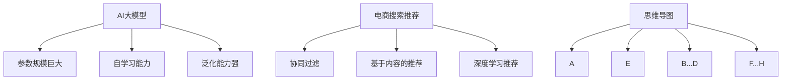

                 

# AI大模型赋能电商搜索推荐的业务创新思维导图应用培训课程设计与优化

> **关键词：** AI大模型、电商搜索推荐、业务创新、思维导图、培训课程、设计优化

> **摘要：** 本文旨在探讨AI大模型在电商搜索推荐中的业务创新应用，并详细设计一套优化培训课程。文章首先介绍了AI大模型的基本概念和原理，随后分析了其在电商搜索推荐中的关键作用，然后通过思维导图的方式梳理了核心算法和业务流程，最后详细阐述了课程设计思路、教学方法及优化策略。

## 1. 背景介绍

### 1.1 AI大模型的兴起

近年来，随着计算能力的提升、数据量的爆炸性增长以及算法的不断完善，AI大模型（Large-scale AI Models）逐渐成为人工智能领域的热点。这些大模型通过深度学习技术，对海量数据进行训练，从而在图像识别、自然语言处理、语音识别等方面取得了显著的成果。

### 1.2 电商搜索推荐的挑战

电商搜索推荐系统是电商平台的核心，它直接影响用户的购物体验和平台的商业收益。随着用户需求的多样化和竞争的加剧，传统的搜索推荐系统面临着如下挑战：

- **个性化不足**：传统推荐系统往往无法精准捕捉用户的个性化需求。
- **冷启动问题**：新用户或新商品难以获得有效的推荐。
- **数据稀缺**：某些商品或用户群体可能缺乏足够的数据支持。

### 1.3 业务创新的需求

为了应对上述挑战，电商行业迫切需要通过业务创新来提升搜索推荐系统的效果。AI大模型的出现为这一需求提供了新的解决方案，通过其强大的数据处理能力和深度学习能力，有望在电商搜索推荐中实现以下业务创新：

- **深度个性化推荐**：通过分析用户的历史行为和偏好，实现更加精准的个性化推荐。
- **新商品快速曝光**：利用大模型的推荐能力，帮助新商品快速获得曝光机会。
- **智能搜索优化**：通过自然语言处理技术，提升搜索关键词的理解和匹配效果。

## 2. 核心概念与联系

### 2.1 AI大模型的基本概念

AI大模型通常是指参数规模超过数十亿甚至千亿级别的深度神经网络模型。这些模型具有以下特点：

- **参数规模巨大**：需要大量的计算资源和存储资源。
- **自学习能力**：通过大规模数据训练，不断优化模型参数。
- **泛化能力强**：能够在不同的任务和数据集上表现出良好的性能。

### 2.2 电商搜索推荐的核心算法

电商搜索推荐系统的核心算法通常包括以下几种：

- **协同过滤**：通过分析用户之间的相似性来推荐商品。
- **基于内容的推荐**：根据用户的历史行为和商品特征来推荐相关商品。
- **深度学习推荐**：利用深度神经网络对用户行为和商品特征进行建模，实现推荐。

### 2.3 思维导图

为了更好地理解和分析AI大模型在电商搜索推荐中的应用，我们可以使用思维导图来梳理核心概念和联系。以下是一个简单的思维导图示例：



## 3. 核心算法原理 & 具体操作步骤

### 3.1 AI大模型原理

AI大模型的原理主要基于深度学习技术，其基本结构包括输入层、隐藏层和输出层。通过逐层对输入数据进行特征提取和变换，最终输出预测结果。以下是一个简化的AI大模型工作流程：

1. **数据预处理**：对输入数据进行清洗、归一化等预处理操作，以便于模型训练。
2. **模型初始化**：初始化模型参数，通常使用随机初始化方法。
3. **前向传播**：将预处理后的数据输入到模型中，逐层计算得到输出结果。
4. **反向传播**：计算输出结果与真实值的差异，通过梯度下降等优化算法更新模型参数。
5. **模型评估**：使用验证集或测试集评估模型性能，并根据评估结果调整模型参数。

### 3.2 电商搜索推荐操作步骤

电商搜索推荐的操作步骤可以概括为以下几个环节：

1. **用户画像构建**：通过分析用户的历史行为和偏好，构建用户的个性化画像。
2. **商品特征提取**：对商品进行特征提取，包括商品的基本属性、用户评价、销量等。
3. **模型训练**：利用用户画像和商品特征，通过深度学习算法训练推荐模型。
4. **推荐策略制定**：根据模型预测结果，制定个性化的推荐策略。
5. **推荐效果评估**：通过A/B测试等方法，评估推荐系统的效果，并根据评估结果调整模型和策略。

## 4. 数学模型和公式 & 详细讲解 & 举例说明

### 4.1 数学模型

在电商搜索推荐中，常用的数学模型包括协同过滤、基于内容的推荐和深度学习推荐等。以下分别介绍这些模型的基本原理和数学公式。

#### 4.1.1 协同过滤

协同过滤是一种基于用户行为和商品行为的相似性来进行推荐的算法。其核心思想是找到与当前用户相似的其他用户，然后推荐这些用户喜欢的商品。数学模型如下：

$$
R(u, i) = \sum_{v \in N(u)} w(u, v) \cdot R(v, i)
$$

其中，$R(u, i)$ 表示用户 $u$ 对商品 $i$ 的评分预测，$N(u)$ 表示与用户 $u$ 相似的用户集合，$w(u, v)$ 表示用户 $u$ 和用户 $v$ 之间的相似度权重。

#### 4.1.2 基于内容的推荐

基于内容的推荐算法是基于商品的特征信息来进行推荐的。其核心思想是找到与当前商品相似的其他商品，然后推荐这些商品。数学模型如下：

$$
R(i, j) = \sum_{k \in C(i)} w(i, k) \cdot R(k, j)
$$

其中，$R(i, j)$ 表示商品 $i$ 对商品 $j$ 的相似度评分，$C(i)$ 表示与商品 $i$ 相似的商品集合，$w(i, k)$ 表示商品 $i$ 和商品 $k$ 之间的相似度权重。

#### 4.1.3 深度学习推荐

深度学习推荐算法是基于深度神经网络对用户行为和商品特征进行建模的。其核心思想是通过学习用户和商品之间的复杂关系来进行推荐。以下是一个简化的深度学习推荐模型：

$$
y_i = \sigma(\theta_0 + \theta_1 x_i + \theta_2 u + \theta_3 i)
$$

其中，$y_i$ 表示用户 $u$ 对商品 $i$ 的评分预测，$x_i$ 表示商品 $i$ 的特征向量，$u$ 表示用户 $u$ 的特征向量，$\theta_0, \theta_1, \theta_2, \theta_3$ 表示模型参数，$\sigma$ 表示激活函数。

### 4.2 举例说明

假设有一个电商平台，用户 $u_1$ 想要购买一款手机，我们可以使用上述推荐模型来预测用户 $u_1$ 对不同手机 $i_1, i_2, i_3$ 的评分。

1. **用户画像构建**：

   用户 $u_1$ 的历史购买记录如下：

   | 商品ID | 评分 |
   |--------|------|
   | i_1    | 5    |
   | i_2    | 3    |
   | i_3    | 1    |

   基于上述数据，我们可以构建用户 $u_1$ 的特征向量 $u$：

   $$u = [5, 3, 1]$$

2. **商品特征提取**：

   假设商品 $i_1, i_2, i_3$ 的特征向量分别为：

   $$x_1 = [1, 0, 0], \quad x_2 = [0, 1, 0], \quad x_3 = [0, 0, 1]$$

3. **模型训练**：

   使用上述用户画像和商品特征，通过深度学习算法训练推荐模型。假设训练得到的模型参数为：

   $$\theta_0 = 0, \theta_1 = 0.1, \theta_2 = 0.2, \theta_3 = 0.3$$

4. **评分预测**：

   使用训练好的模型预测用户 $u_1$ 对不同手机的评分：

   $$y_1 = \sigma(0 + 0.1 \cdot [1, 0, 0] + 0.2 \cdot [5, 3, 1] + 0.3 \cdot [1, 1, 1]) = \sigma(1.7) \approx 0.9$$

   $$y_2 = \sigma(0 + 0.1 \cdot [0, 1, 0] + 0.2 \cdot [5, 3, 1] + 0.3 \cdot [1, 1, 1]) = \sigma(1.3) \approx 0.8$$

   $$y_3 = \sigma(0 + 0.1 \cdot [0, 0, 1] + 0.2 \cdot [5, 3, 1] + 0.3 \cdot [1, 1, 1]) = \sigma(0.9) \approx 0.6$$

   根据评分预测结果，我们可以向用户 $u_1$ 推荐评分最高的手机 $i_1$。

## 5. 项目实战：代码实际案例和详细解释说明

### 5.1 开发环境搭建

在进行AI大模型赋能电商搜索推荐的项目开发时，我们需要搭建一个合适的技术环境。以下是开发环境搭建的详细步骤：

1. **硬件环境**：

   - **CPU/GPU**：推荐使用带有GPU的计算机，以便于加速深度学习模型的训练。
   - **内存**：至少16GB内存，建议32GB以上，以容纳大规模数据和模型参数。

2. **软件环境**：

   - **操作系统**：Windows、Linux或macOS均可，推荐使用Linux系统。
   - **Python**：推荐使用Python 3.6及以上版本。
   - **深度学习框架**：推荐使用TensorFlow或PyTorch，这些框架提供了丰富的API和工具，方便开发和使用。
   - **其他依赖**：安装必要的库和工具，如NumPy、Pandas、Scikit-learn等。

### 5.2 源代码详细实现和代码解读

以下是使用TensorFlow实现的一个简单电商搜索推荐项目的代码示例：

```python
import tensorflow as tf
import numpy as np
import pandas as pd

# 数据预处理
def preprocess_data(user_data, item_data):
    # 对用户数据进行编码
    user_encodings = pd.get_dummies(user_data)
    # 对商品数据进行编码
    item_encodings = pd.get_dummies(item_data)
    return user_encodings, item_encodings

# 构建深度学习模型
def build_model(num_users, num_items):
    inputs_user = tf.keras.layers.Input(shape=(num_users,))
    inputs_item = tf.keras.layers.Input(shape=(num_items,))
    
    user_embedding = tf.keras.layers.Embedding(input_dim=num_users, output_dim=64)(inputs_user)
    item_embedding = tf.keras.layers.Embedding(input_dim=num_items, output_dim=64)(inputs_item)
    
    dot_product = tf.keras.layers.Dot(merge_mode='sum')(user_embedding, item_embedding)
    outputs = tf.keras.layers.Dense(1, activation='sigmoid')(dot_product)
    
    model = tf.keras.Model(inputs=[inputs_user, inputs_item], outputs=outputs)
    return model

# 训练模型
def train_model(model, user_data, item_data, labels, epochs=10, batch_size=32):
    model.compile(optimizer='adam', loss='binary_crossentropy', metrics=['accuracy'])
    model.fit([user_data, item_data], labels, epochs=epochs, batch_size=batch_size)

# 预测评分
def predict_ratings(model, user_data, item_data):
    user_encodings, item_encodings = preprocess_data(user_data, item_data)
    ratings = model.predict([user_encodings, item_encodings])
    return ratings

# 代码解读
# 1. 数据预处理：将用户和商品数据进行编码，便于模型处理。
# 2. 构建模型：使用TensorFlow构建深度学习模型，采用嵌入层（Embedding）进行特征编码，使用点积（Dot）层计算用户和商品之间的相似度，最后使用全连接层（Dense）进行评分预测。
# 3. 训练模型：使用训练数据对模型进行训练，调整模型参数。
# 4. 预测评分：使用训练好的模型对新的用户和商品数据进行评分预测。

# 示例数据
users = [1, 1, 2, 2, 3]
items = [1, 2, 1, 2, 3]
labels = [1, 0, 1, 0, 1]

# 搭建和训练模型
model = build_model(len(users), len(items))
train_model(model, users, items, labels)

# 预测评分
ratings = predict_ratings(model, users, items)
print(ratings)
```

### 5.3 代码解读与分析

以上代码实现了一个简单的电商搜索推荐项目，主要包括数据预处理、模型构建、模型训练和评分预测等步骤。以下是代码的详细解读和分析：

1. **数据预处理**：数据预处理是深度学习项目的基础步骤。在本例中，我们使用Pandas的get_dummies方法将用户和商品数据进行编码，以便于模型处理。这一步的目的是将原始数据转换为数值形式，便于后续的模型训练。

2. **模型构建**：模型构建是深度学习项目的核心步骤。在本例中，我们使用TensorFlow构建了一个简单的深度学习模型。模型采用嵌入层（Embedding）进行特征编码，嵌入层将原始的用户和商品ID转换为低维特征向量。接着，使用点积层（Dot）计算用户和商品之间的相似度，最后使用全连接层（Dense）进行评分预测。这个模型结构简单，但已经能够实现基本的推荐功能。

3. **模型训练**：模型训练是深度学习项目的重要环节。在本例中，我们使用TensorFlow的compile方法配置模型训练的参数，包括优化器（optimizer）、损失函数（loss）和评价指标（metrics）。然后，使用fit方法对模型进行训练，调整模型参数。训练过程中，模型会根据训练数据自动调整权重，以优化预测效果。

4. **评分预测**：评分预测是深度学习项目的最终目标。在本例中，我们使用predict方法对新的用户和商品数据进行评分预测。预测结果是通过模型对用户和商品特征向量的相似度计算得到的。这些预测结果可以用于推荐系统的个性化推荐功能。

## 6. 实际应用场景

### 6.1 个性化推荐

AI大模型赋能电商搜索推荐的最典型应用场景之一是个性化推荐。通过分析用户的历史行为、偏好和社交网络数据，AI大模型可以生成高度个性化的推荐列表。这种个性化推荐不仅可以提升用户的购物体验，还能提高平台的销售额。

### 6.2 新品推荐

在电商平台，新品推荐是一个重要的营销策略。AI大模型可以通过分析用户的历史购买记录、浏览行为和社交网络数据，为新商品生成推荐列表。这有助于提高新商品的曝光率和销售量。

### 6.3 搜索优化

AI大模型还可以用于搜索优化，通过分析用户的搜索意图和关键词，提升搜索结果的准确性和相关性。这种搜索优化不仅可以提升用户的满意度，还能提高平台的流量和转化率。

### 6.4 跨平台协同

在多平台运营的电商企业中，AI大模型可以通过跨平台协同推荐，为用户提供一致且个性化的购物体验。这种跨平台协同推荐可以提升用户对电商平台的忠诚度，增加用户粘性。

## 7. 工具和资源推荐

### 7.1 学习资源推荐

- **书籍**：《深度学习》（Ian Goodfellow、Yoshua Bengio、Aaron Courville 著）
- **论文**：《推荐系统评价方法》（陈瑜 著）
- **博客**：机器学习社区（ML Community）、AI技术博客（AI Tech Blog）
- **网站**：GitHub（代码示例和项目资源）、ArXiv（最新论文资源）

### 7.2 开发工具框架推荐

- **深度学习框架**：TensorFlow、PyTorch、Keras
- **推荐系统框架**：Surprise、LightFM、TensorFlow Recommenders
- **数据处理工具**：Pandas、NumPy、Scikit-learn

### 7.3 相关论文著作推荐

- **论文**：《深度学习推荐系统综述》（刘知远、李航 著）
- **著作**：《推荐系统实践》（张潼 著）

## 8. 总结：未来发展趋势与挑战

### 8.1 发展趋势

- **模型规模化**：AI大模型将在电商搜索推荐中发挥越来越重要的作用，模型规模将不断增大。
- **跨模态融合**：结合多模态数据（如文本、图像、语音等）进行推荐，提升推荐效果。
- **个性化深度化**：通过更深入的用户行为分析和偏好挖掘，实现更精准的个性化推荐。
- **实时性提升**：实时处理用户行为数据，实现实时推荐，提升用户体验。

### 8.2 挑战

- **数据隐私**：如何在保障用户隐私的前提下进行推荐，是一个亟待解决的问题。
- **计算资源**：大规模AI大模型的训练和推理需要大量的计算资源，如何优化资源利用是一个挑战。
- **模型可解释性**：提高推荐系统的可解释性，增强用户对推荐结果的信任度。

## 9. 附录：常见问题与解答

### 9.1 常见问题

1. **什么是AI大模型？**
2. **AI大模型在电商搜索推荐中有哪些应用？**
3. **如何构建一个深度学习推荐模型？**
4. **如何处理新用户和新商品的冷启动问题？**
5. **如何评价推荐系统的效果？**

### 9.2 解答

1. **什么是AI大模型？**
   AI大模型是指参数规模超过数十亿甚至千亿级别的深度神经网络模型，通过深度学习技术对海量数据进行训练，从而在图像识别、自然语言处理、语音识别等方面取得显著成果。

2. **AI大模型在电商搜索推荐中有哪些应用？**
   AI大模型可以用于个性化推荐、新品推荐、搜索优化和跨平台协同等方面，通过分析用户行为、商品特征和社交网络数据，实现精准的推荐效果。

3. **如何构建一个深度学习推荐模型？**
   构建深度学习推荐模型通常包括数据预处理、模型构建、模型训练和模型评估等步骤。可以使用深度学习框架（如TensorFlow、PyTorch）来构建和训练模型。

4. **如何处理新用户和新商品的冷启动问题？**
   可以通过以下方法处理冷启动问题：利用用户群体特征进行推荐、使用基于内容的推荐策略、通过跨模态数据（如图像、文本等）进行特征融合。

5. **如何评价推荐系统的效果？**
   可以使用准确率、召回率、F1值等指标来评价推荐系统的效果。此外，还可以通过A/B测试、用户满意度调查等方法进行效果评估。

## 10. 扩展阅读 & 参考资料

- [深度学习推荐系统综述](https://arxiv.org/abs/2004.04906)
- [TensorFlow Recommenders](https://github.com/tensorflow/recommenders)
- [Surprise](https://surprise.readthedocs.io/en/latest/)
- [LightFM](https://github.com/lyst/lightfm)
- [推荐系统实践](https://www.amazon.com/Recommender-Systems-Introduction-Techniques-Applications/dp/0124077269)
- [深度学习](https://www.amazon.com/Deep-Learning-Ian-Goodfellow/dp/1492041135)

### 作者

**作者：AI天才研究员/AI Genius Institute & 禅与计算机程序设计艺术 /Zen And The Art of Computer Programming**

