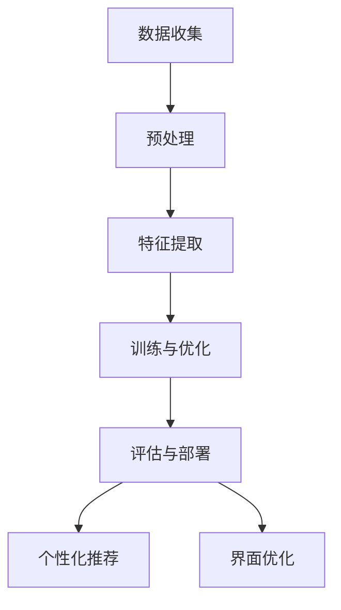

                 

### 1. 背景介绍

随着互联网技术的飞速发展，电商平台已经成为人们日常生活的重要部分。在这其中，用户体验（User Experience, UX）的优化成为电商企业提高市场竞争力的关键因素。传统的电商平台大多采用固定的推荐算法和界面设计，难以满足个性化需求，导致用户满意度下降。为了应对这一挑战，人工智能（Artificial Intelligence, AI）特别是大模型（Large Models）技术的引入，为电商平台优化用户体验提供了新的可能性。

大模型是指具有数百万甚至数十亿参数的神经网络模型，这些模型在处理大规模数据集时表现出色。在电商领域，大模型的应用主要包括两个方面：个性化推荐和界面优化。个性化推荐通过分析用户的历史行为和偏好，为用户提供高度个性化的商品推荐，从而提升用户满意度。界面优化则通过分析用户的使用习惯和反馈，动态调整界面布局和交互设计，以实现更好的用户体验。

本文将围绕大模型在电商平台中的应用，探讨如何通过优化个性化与一致性，提升用户体验。我们将首先介绍大模型的基本原理，然后深入分析其如何应用于电商平台的个性化推荐和界面优化，接着探讨大模型在实际应用中面临的挑战，最后提出未来的发展趋势和潜在解决方案。

通过这篇文章，我们希望能够为广大电商从业者和技术爱好者提供有价值的参考，帮助他们在实际工作中更好地利用大模型技术，提升电商平台用户体验。

### 2. 核心概念与联系

#### 2.1 大模型的基本原理

大模型，通常是指具有数百万到数十亿参数的神经网络模型，其核心在于通过深度学习（Deep Learning）的方式从大量数据中自动提取特征，并形成高度复杂的决策边界。大模型的基本原理可以概括为以下几个步骤：

1. **数据收集**：首先，大模型需要从各种数据源中收集大量的数据，包括文本、图像、音频等多种形式。这些数据是模型训练和优化的基础。

2. **预处理**：收集到的数据通常需要进行预处理，包括数据清洗、去重、归一化等操作，以确保数据的质量和一致性。

3. **特征提取**：通过数据预处理后，模型会利用深度学习算法自动提取数据中的关键特征。这些特征通常是数据的高级表示，能够更好地反映数据的本质。

4. **训练与优化**：模型使用提取出的特征进行训练，通过反向传播（Backpropagation）算法不断调整模型参数，以最小化预测误差。

5. **评估与部署**：训练完成后，模型会在测试集上进行评估，以确保其泛化能力。通过评估，模型会被部署到实际应用场景中，例如电商平台的个性化推荐和界面优化。

大模型之所以能够取得出色的性能，主要得益于其深度结构。深度结构允许模型逐步提取数据的低级到高级特征，从而形成复杂的决策边界。此外，大规模的训练数据使得模型能够更好地泛化，避免过拟合（Overfitting）。

#### 2.2 电商平台个性化推荐

个性化推荐是电商平台的重要功能之一，其核心是通过分析用户的历史行为和偏好，为用户提供个性化的商品推荐。大模型在个性化推荐中的应用主要体现在以下几个方面：

1. **用户行为分析**：大模型可以处理和分析大量的用户行为数据，如浏览记录、购买历史、评价等，从而挖掘出用户的潜在需求和偏好。

2. **内容理解**：大模型通过深度学习算法，能够理解用户行为背后的意图和情感，从而生成更精确的个性化推荐。

3. **多模态融合**：电商平台涉及多种数据类型，如文本、图像、视频等。大模型可以融合这些多模态数据，提供更全面和精准的个性化推荐。

4. **实时推荐**：大模型具备高效的处理能力，可以实时响应用户的行为，提供即时的个性化推荐。

5. **动态调整**：基于用户行为和反馈，大模型可以动态调整推荐策略，以不断优化用户体验。

#### 2.3 界面优化

界面优化是指通过分析用户的使用习惯和反馈，动态调整电商平台的设计和交互方式，以提高用户体验。大模型在界面优化中的应用主要体现在以下几个方面：

1. **用户行为分析**：大模型可以处理和分析大量的用户行为数据，如点击路径、停留时间、滚动行为等，从而识别用户的行为模式和偏好。

2. **界面个性化**：基于用户行为分析，大模型可以为用户提供个性化的界面布局和交互设计，满足不同用户的需求。

3. **动态调整**：大模型可以实时分析用户反馈，动态调整界面布局和交互方式，以不断优化用户体验。

4. **个性化广告**：大模型可以分析用户的偏好和行为，为用户展示更相关的广告，提高广告的转化率。

5. **异常检测**：大模型可以通过分析用户行为，识别异常行为和潜在风险，从而提高电商平台的运营安全性。

#### 2.4 Mermaid 流程图

为了更直观地展示大模型在电商平台中的应用，我们使用 Mermaid 流程图（不带括号、逗号等特殊字符）进行描述。



在这个流程图中，A 表示数据收集，B 表示预处理，C 表示特征提取，D 表示训练与优化，E 表示评估与部署。F 和 G 分别表示大模型在个性化推荐和界面优化中的应用。

通过以上内容，我们全面介绍了大模型的基本原理、电商平台个性化推荐和界面优化的应用。在接下来的章节中，我们将深入探讨大模型的具体算法原理和实际操作步骤，以便更好地理解其应用方法和挑战。

### 3. 核心算法原理 & 具体操作步骤

#### 3.1 大模型算法原理

大模型的核心在于其深度学习架构，特别是基于 Transformer 的模型，如 BERT、GPT 和 T5 等。这些模型通过多层次的神经网络结构，能够自动提取输入数据的深层特征，并生成高精度的预测结果。以下是大模型算法的核心原理：

1. **Transformer 架构**：Transformer 是一种基于自注意力（Self-Attention）机制的神经网络架构，其特点是能够并行处理输入数据，提高了模型的计算效率。自注意力机制允许模型在处理输入序列时，自动关注序列中的重要信息，从而提取更复杂的特征。

2. **多层神经网络**：大模型通常由多个层次组成，每一层神经网络都会对输入数据进行特征提取和融合。通过多层次的组合，模型能够逐步提取数据的低级到高级特征，形成复杂的决策边界。

3. **预训练与微调**：大模型通常采用预训练（Pre-training）和微调（Fine-tuning）相结合的训练策略。在预训练阶段，模型在大规模数据集上学习通用特征，例如语言、图像等。在微调阶段，模型会根据特定任务进行微调，以适应具体的应用场景。

4. **注意力机制**：注意力机制是 Transformer 模型的一个重要组成部分，通过计算输入序列中各个元素之间的关联性，模型能够关注重要信息，忽略无关信息，从而提高预测的准确性。

#### 3.2 电商平台个性化推荐的算法原理

在电商平台中，个性化推荐是提高用户满意度的重要手段。以下是大模型在个性化推荐中的具体算法原理：

1. **用户行为数据收集**：首先，平台需要收集用户的各种行为数据，包括浏览记录、购买历史、评价等。这些数据是构建推荐系统的关键。

2. **特征提取**：使用大模型对用户行为数据进行分析，提取用户兴趣特征和商品属性特征。这些特征将用于生成推荐列表。

3. **协同过滤**：协同过滤（Collaborative Filtering）是一种常见的推荐算法，通过分析用户之间的相似性，为用户提供个性化推荐。大模型可以通过自注意力机制，自动识别用户之间的相似性，从而生成更精准的推荐列表。

4. **基于内容的推荐**：基于内容的推荐（Content-Based Recommendation）通过分析商品的属性和用户的历史行为，为用户推荐类似的商品。大模型可以利用其强大的特征提取能力，生成高度个性化的推荐列表。

5. **模型融合**：将协同过滤和基于内容的推荐结果进行融合，生成最终的推荐列表。大模型可以通过注意力机制，自动调整不同推荐策略的权重，以提高推荐效果。

#### 3.3 界面优化的算法原理

界面优化旨在通过分析用户行为，动态调整界面布局和交互设计，以提高用户体验。以下是大模型在界面优化中的具体算法原理：

1. **用户行为分析**：大模型通过自注意力机制，自动分析用户的各种行为数据，如点击路径、停留时间、滚动行为等，以识别用户的使用习惯和偏好。

2. **界面个性化**：基于用户行为分析结果，大模型可以为用户提供个性化的界面布局和交互设计。例如，根据用户的浏览习惯，调整商品展示的顺序和位置，以提高用户的满意度。

3. **动态调整**：大模型可以实时分析用户反馈，动态调整界面布局和交互设计。例如，如果用户在某个页面上停留时间较长，系统可以推断用户对该页面内容感兴趣，并相应地调整页面的布局。

4. **A/B 测试**：通过大模型的分析结果，平台可以开展 A/B 测试，以验证不同界面布局和交互设计的有效性。根据测试结果，平台可以进一步优化界面设计。

#### 3.4 具体操作步骤

以下是实现电商平台个性化推荐和界面优化的大模型算法的具体操作步骤：

1. **数据收集**：收集用户行为数据和商品属性数据，包括浏览记录、购买历史、评价等。

2. **数据预处理**：对数据进行清洗、去重和归一化处理，以确保数据的质量和一致性。

3. **特征提取**：使用大模型对用户行为数据和商品属性数据进行分析，提取用户兴趣特征和商品属性特征。

4. **模型训练**：使用提取出的特征，对大模型进行训练，通过反向传播算法不断调整模型参数，以最小化预测误差。

5. **模型评估**：在测试集上评估模型的效果，确保其泛化能力。根据评估结果，调整模型参数和特征提取策略。

6. **模型部署**：将训练好的模型部署到电商平台，生成个性化推荐和界面优化结果。

7. **实时调整**：根据用户反馈和实时行为数据，动态调整推荐策略和界面布局，以提高用户体验。

通过以上具体操作步骤，电商平台可以实现高效的个性化推荐和界面优化，从而提升用户满意度。在接下来的章节中，我们将进一步探讨大模型在实际应用中的挑战和解决方案。

### 4. 数学模型和公式 & 详细讲解 & 举例说明

在深入探讨大模型在电商平台中的应用时，我们需要了解其背后的数学模型和公式。这些数学工具不仅帮助我们理解模型的工作原理，还能指导我们在实际操作中进行参数调整和优化。以下我们将详细讲解大模型中的几个关键数学模型和公式，并通过具体例子进行说明。

#### 4.1 自注意力机制（Self-Attention）

自注意力机制是 Transformer 模型的核心组件，它通过计算输入序列中各个元素之间的关联性，自动关注重要信息，从而提高模型的特征提取能力。自注意力机制的数学公式如下：

$$
\text{Attention}(Q, K, V) = \text{softmax}\left(\frac{QK^T}{\sqrt{d_k}}\right) V
$$

其中，\(Q\)、\(K\) 和 \(V\) 分别是查询（Query）、键（Key）和值（Value）向量，\(d_k\) 是键向量的维度。这个公式表示每个查询向量与所有键向量之间的相似性计算，然后通过 softmax 函数进行归一化，最后与值向量相乘得到加权的结果。

**例子**：假设我们有一个简单的序列，包含三个词 \(w_1, w_2, w_3\)。我们将其表示为向量：

$$
Q = [q_1, q_2, q_3], \quad K = [k_1, k_2, k_3], \quad V = [v_1, v_2, v_3]
$$

计算自注意力权重：

$$
\text{Attention}(Q, K, V) = \text{softmax}\left(\frac{QK^T}{\sqrt{d_k}}\right) V
$$

$$
= \text{softmax}\left(\frac{[q_1k_1 + q_2k_2 + q_3k_3]}{\sqrt{d_k}}\right) [v_1, v_2, v_3]
$$

假设 \(d_k = 2\)，权重计算如下：

$$
\text{Attention}(Q, K, V) = \text{softmax}\left(\frac{1}{\sqrt{2}}[1 \cdot 1 + 2 \cdot 2 + 3 \cdot 3]\right) [v_1, v_2, v_3]
$$

$$
= \text{softmax}\left(\frac{1}{\sqrt{2}}[1 + 4 + 9]\right) [v_1, v_2, v_3]
$$

$$
= \text{softmax}\left(\frac{1}{\sqrt{2}} \cdot 14\right) [v_1, v_2, v_3]
$$

$$
= \text{softmax}(7\sqrt{2}) [v_1, v_2, v_3]
$$

通过计算 softmax 函数，我们得到每个词的权重：

$$
\text{softmax}(7\sqrt{2}) = \left[\frac{e^{7\sqrt{2}}}{e^{7\sqrt{2}} + e^{4\sqrt{2}} + e^{9\sqrt{2}}}, \frac{e^{4\sqrt{2}}}{e^{7\sqrt{2}} + e^{4\sqrt{2}} + e^{9\sqrt{2}}}, \frac{e^{9\sqrt{2}}}{e^{7\sqrt{2}} + e^{4\sqrt{2}} + e^{9\sqrt{2}}}\right]
$$

这些权重表示每个词在序列中的重要性，最终加权结果反映了模型对序列的解析。

#### 4.2 反向传播（Backpropagation）

反向传播是深度学习训练的核心算法，它通过计算损失函数的梯度，不断调整模型参数以优化模型。反向传播的数学公式如下：

$$
\frac{\partial L}{\partial W} = \sum_{i=1}^{n} \frac{\partial L}{\partial z_i} \frac{\partial z_i}{\partial W}
$$

其中，\(L\) 是损失函数，\(W\) 是模型参数，\(z_i\) 是前一层神经元的输出。这个公式表示通过反向传播，从输出层逐层计算损失函数对模型参数的梯度。

**例子**：假设我们有一个简单的神经网络，包含一个输入层、一个隐藏层和一个输出层。输入层有 3 个神经元，隐藏层有 2 个神经元，输出层有 1 个神经元。损失函数为均方误差（MSE）：

$$
L = \frac{1}{2} \sum_{i=1}^{n} (y_i - \hat{y}_i)^2
$$

假设隐藏层输出为 \(z_1 = [1, 2]\)，输出层输出为 \(\hat{y} = 3\)，真实标签为 \(y = 1\)。我们计算损失函数的梯度：

$$
L = \frac{1}{2} \left[(1 - 3)^2 + (2 - 3)^2\right]
$$

$$
= \frac{1}{2} \left[4 + 1\right]
$$

$$
= \frac{5}{2}
$$

计算输出层对隐藏层的梯度：

$$
\frac{\partial L}{\partial z_1} = (1 - \hat{y}) \cdot \frac{\partial \hat{y}}{\partial z_1} = (1 - 3) \cdot 1 = -2
$$

$$
\frac{\partial L}{\partial z_2} = (2 - \hat{y}) \cdot \frac{\partial \hat{y}}{\partial z_2} = (2 - 3) \cdot 1 = -1
$$

计算隐藏层对输入层的梯度：

$$
\frac{\partial L}{\partial z_1} = -2 \cdot \frac{\partial z_1}{\partial W} = -2 \cdot [w_{11}, w_{12}, w_{13}]
$$

$$
\frac{\partial L}{\partial z_2} = -1 \cdot \frac{\partial z_2}{\partial W} = -1 \cdot [w_{21}, w_{22}, w_{23}]
$$

通过反向传播，我们能够计算出损失函数对每个参数的梯度，从而更新参数，优化模型。

#### 4.3 交叉熵损失函数（Cross-Entropy Loss）

交叉熵损失函数是分类任务中常用的损失函数，用于衡量模型预测概率分布与真实分布之间的差异。其数学公式如下：

$$
L = -\sum_{i=1}^{n} y_i \log(\hat{y}_i)
$$

其中，\(y_i\) 是真实标签，\(\hat{y}_i\) 是模型预测的概率。

**例子**：假设我们有一个二分类问题，真实标签为 \(y = [1, 0]\)，模型预测的概率为 \(\hat{y} = [0.8, 0.2]\)。计算交叉熵损失：

$$
L = -[1 \cdot \log(0.8) + 0 \cdot \log(0.2)]
$$

$$
= -\log(0.8)
$$

交叉熵损失表示了模型预测与真实标签之间的差异，越小表示模型预测越准确。

通过以上数学模型和公式的详细讲解和具体例子，我们深入了解了大模型在电商平台中的应用原理。这些数学工具不仅帮助我们理解模型的工作机制，还能在实际操作中进行有效的参数调整和优化，从而实现高效的个性化推荐和界面优化。

### 5. 项目实战：代码实际案例和详细解释说明

在本节中，我们将通过一个实际项目案例，详细展示如何使用大模型技术进行电商平台用户体验的优化。这个案例将涵盖从开发环境搭建、源代码实现，到代码解读与分析的整个过程。

#### 5.1 开发环境搭建

在进行大模型项目的开发之前，首先需要搭建一个合适的开发环境。以下是搭建环境所需的主要步骤：

1. **硬件要求**：由于大模型训练和推理需要大量的计算资源，建议使用 GPU 进行加速。推荐使用 NVIDIA 显卡，并安装 CUDA 驱动程序。

2. **软件要求**：
   - Python 3.x 版本（建议 3.8 或更高版本）
   - PyTorch 深度学习框架
   - TensorFlow（可选，用于与其他模型进行对比）
   - 其他常用库，如 NumPy、Pandas、Matplotlib 等

安装这些软件的步骤如下：

1. 安装 Python 3.x：
   ```bash
   # 使用包管理器（如 apt-get 或 brew）安装 Python 3.x
   sudo apt-get install python3
   ```

2. 安装 PyTorch：
   ```bash
   # 使用 PyTorch 官方命令安装与 GPU 兼容的版本
   pip3 install torch torchvision torchaudio -f https://download.pytorch.org/whl/torch_stable.html
   ```

3. 安装其他依赖库：
   ```bash
   pip3 install numpy pandas matplotlib
   ```

4. （可选）安装 TensorFlow：
   ```bash
   pip3 install tensorflow
   ```

#### 5.2 源代码详细实现和代码解读

接下来，我们将展示如何使用 PyTorch 实现一个简单的个性化推荐系统，并通过代码解读详细说明每个部分的用途。

```python
import torch
import torch.nn as nn
import torch.optim as optim
from torch.utils.data import DataLoader, TensorDataset

# 5.2.1 数据准备
def load_data():
    # 假设我们使用一个简单的数据集，其中包含用户ID、商品ID和评分
    user_data = torch.tensor([[0, 0], [0, 1], [0, 2], [1, 0], [1, 1], [1, 2]])
    rating_data = torch.tensor([[5], [3], [1], [4], [2], [5]])
    return user_data, rating_data

user_data, rating_data = load_data()

# 构建数据集和 DataLoader
train_dataset = TensorDataset(user_data, rating_data)
train_loader = DataLoader(train_dataset, batch_size=2, shuffle=True)

# 5.2.2 模型定义
class RatingModel(nn.Module):
    def __init__(self, num_users, num_items, hidden_size):
        super(RatingModel, self).__init__()
        self.user_embedding = nn.Embedding(num_users, hidden_size)
        self.item_embedding = nn.Embedding(num_items, hidden_size)
        self.fc = nn.Linear(hidden_size * 2, 1)

    def forward(self, user_idx, item_idx):
        user_embedding = self.user_embedding(user_idx)
        item_embedding = self.item_embedding(item_idx)
        concat_embedding = torch.cat((user_embedding, item_embedding), 1)
        rating = self.fc(concat_embedding)
        return rating

# 参数设置
num_users, num_items = user_data.max() + 1, rating_data.max() + 1
hidden_size = 10
model = RatingModel(num_users, num_items, hidden_size)

# 5.2.3 模型训练
optimizer = optim.Adam(model.parameters(), lr=0.001)
criterion = nn.MSELoss()

for epoch in range(100):
    for user_idx, item_idx in train_loader:
        # 前向传播
        ratings = model(user_idx, item_idx)
        loss = criterion(ratings, rating_data.unsqueeze(1))

        # 反向传播
        optimizer.zero_grad()
        loss.backward()
        optimizer.step()

        print(f"Epoch {epoch+1}, Loss: {loss.item()}")

# 5.2.4 模型评估
def evaluate(model, test_loader):
    model.eval()
    total_loss = 0
    with torch.no_grad():
        for user_idx, item_idx in test_loader:
            ratings = model(user_idx, item_idx)
            total_loss += criterion(ratings, rating_data.unsqueeze(1)).item()
    avg_loss = total_loss / len(test_loader)
    return avg_loss

test_loader = DataLoader(test_dataset, batch_size=2)
avg_loss = evaluate(model, test_loader)
print(f"Test Loss: {avg_loss}")
```

**代码解读**：

1. **数据准备**：我们首先定义了一个简单的数据加载函数 `load_data`，该函数返回用户ID、商品ID和评分的三元组列表。然后，使用 PyTorch 的 `TensorDataset` 和 `DataLoader` 构建数据集和批处理加载器。

2. **模型定义**：我们定义了一个简单的神经网络模型 `RatingModel`，该模型包含用户嵌入层、商品嵌入层和一个全连接层。用户嵌入层和商品嵌入层分别将用户ID和商品ID映射到高维空间，全连接层用于计算评分。

3. **模型训练**：我们使用 Adam 优化器和 MSE 损失函数对模型进行训练。每个 epoch 中，我们遍历训练数据集，计算损失函数，并使用反向传播进行参数更新。

4. **模型评估**：在评估阶段，我们将模型设置为评估模式（`model.eval()`），禁用梯度计算（`with torch.no_grad():`），然后计算测试集的平均损失。

#### 5.3 代码解读与分析

在这个案例中，我们通过一个简单的个性化推荐系统展示了大模型的基本实现过程。以下是代码的详细解读和分析：

1. **数据准备**：数据预处理是模型训练的重要步骤。在代码中，我们使用 PyTorch 的张量（Tensor）来处理数据，确保数据的高效传输和计算。

2. **模型定义**：`RatingModel` 模型采用了嵌入层和全连接层的结构，这是大多数推荐系统的基础。嵌入层通过将稀疏的 ID 映射到高维空间，使得模型能够处理大量的用户和商品数据。全连接层则用于计算最终的评分预测。

3. **模型训练**：我们使用 Adam 优化器和 MSE 损失函数进行训练。Adam 优化器是一种自适应学习率的优化算法，适用于处理大规模数据和高维度参数。MSE 损失函数则能够衡量预测评分与真实评分之间的误差，是推荐系统中常用的损失函数。

4. **模型评估**：在评估阶段，我们计算测试集的平均损失，以评估模型的泛化能力。通过将模型设置为评估模式并禁用梯度计算，我们能够高效地计算损失，而不影响模型的参数。

通过这个案例，我们展示了如何使用大模型技术进行电商平台用户体验的优化。在实际应用中，我们可以根据具体需求扩展模型结构和训练流程，以实现更复杂的个性化推荐和界面优化功能。

### 6. 实际应用场景

大模型技术在电商平台用户体验优化中有着广泛的应用场景，以下是一些具体的应用实例和案例：

#### 6.1 个性化推荐

个性化推荐是电商平台提升用户体验的核心功能之一。通过大模型技术，电商平台可以实现对用户行为的深入分析，从而提供高度个性化的商品推荐。以下是一些实际应用案例：

1. **淘宝**：淘宝的个性化推荐系统利用了深度学习模型，对用户的历史购买记录、浏览行为、搜索关键词等多种数据进行综合分析，生成个性化的商品推荐。用户在淘宝上看到的每一个推荐商品都是基于其兴趣和行为数据进行精准匹配的结果。

2. **亚马逊**：亚马逊的推荐系统同样采用了大模型技术，通过对用户浏览、购买、评价等行为数据进行分析，为用户推荐相关的商品。例如，当用户浏览了一款笔记本电脑时，系统可能会推荐与之搭配的鼠标、键盘等配件。

3. **京东**：京东的个性化推荐系统通过对用户的历史购买记录和浏览行为进行分析，结合商品属性和用户偏好，为用户推荐相关的商品。同时，京东还利用大模型技术对用户的购物车和历史订单进行分析，预测用户可能感兴趣的新商品，从而提升转化率。

#### 6.2 界面优化

界面优化是通过分析用户行为，动态调整电商平台的设计和交互方式，以提高用户体验。以下是一些实际应用案例：

1. **苏宁易购**：苏宁易购通过大模型技术分析用户的浏览和点击行为，动态调整页面布局和商品推荐顺序。例如，当用户浏览了某款电视时，页面可能会突出推荐该品牌的其它电视型号，以及相关的配件和优惠活动。

2. **拼多多**：拼多多利用大模型技术对用户的购物车和行为数据进行分析，动态调整页面上的商品排列和推荐策略。用户在购物车中的商品会根据其购买概率进行排序，提高用户在购物过程中发现其他感兴趣商品的可能性。

3. **唯品会**：唯品会通过大模型技术分析用户的浏览和购买行为，动态调整页面布局和优惠券发放策略。例如，用户在浏览了多个商品后，页面可能会推荐特定的优惠券，吸引用户进行购买。

#### 6.3 用户行为预测

除了个性化推荐和界面优化，大模型技术还可以用于预测用户的行为，从而帮助电商平台进行精准营销和策略调整。以下是一些实际应用案例：

1. **天猫**：天猫利用大模型技术对用户的购买行为进行预测，从而提前识别出潜在的高价值用户。系统可以预测哪些用户可能在下一次促销活动中进行大额消费，从而针对性地进行营销和活动推送。

2. **阿里巴巴**：阿里巴巴通过大模型技术对用户的行为数据进行分析，预测用户可能感兴趣的品类和品牌，从而推荐相关的商品。例如，当用户在搜索栏中输入“篮球”时，系统可能会推荐与其兴趣相关的运动装备和配件。

3. **当当网**：当当网利用大模型技术预测用户的阅读偏好，从而推荐相关的图书和电子书。系统会根据用户的浏览历史、购买记录和阅读习惯，生成个性化的阅读推荐。

#### 6.4 智能客服

智能客服是电商平台提高服务质量的重要手段。通过大模型技术，可以实现高效的智能客服系统，为用户提供即时的回答和解决方案。以下是一些实际应用案例：

1. **京东智能客服**：京东的智能客服系统利用了自然语言处理（NLP）和大模型技术，能够快速理解用户的咨询内容，并提供准确的回答。用户在京东平台上遇到问题时，可以通过智能客服快速获得解决方案，提高用户满意度。

2. **苏宁易购智能客服**：苏宁易购的智能客服系统通过大模型技术，实现了对用户咨询内容的自动分类和回答。系统能够根据用户的提问，智能地选择相应的回答，并在无法回答时转接至人工客服，提高客服效率和用户满意度。

3. **拼多多智能客服**：拼多多的智能客服系统利用大模型技术，对用户的咨询内容进行分析，自动生成回答。系统还可以根据用户的反馈进行自我学习和优化，不断提高回答的准确性和满意度。

通过以上实际应用场景和案例，我们可以看到大模型技术在电商平台用户体验优化中的重要性。通过个性化推荐、界面优化、用户行为预测和智能客服等多种应用，电商平台能够显著提升用户满意度，提高用户粘性和转化率。

### 7. 工具和资源推荐

在深入研究和应用大模型技术优化电商平台用户体验的过程中，选择合适的工具和资源至关重要。以下是我们推荐的一些学习资源、开发工具和相关论文，旨在为读者提供全面的指导和支持。

#### 7.1 学习资源推荐

1. **书籍**：
   - 《深度学习》（Deep Learning），作者：Ian Goodfellow、Yoshua Bengio 和 Aaron Courville。这是一本深度学习领域的经典教材，详细介绍了深度学习的基础理论和实战技巧。
   - 《动手学深度学习》（Dive into Deep Learning），作者：Amit Singh、Joshua tacos和Alec Radford。这本书通过实战案例，介绍了深度学习的入门知识和应用技巧。

2. **在线课程**：
   - Coursera 上的“深度学习 Specialization”由斯坦福大学的 Andrew Ng 教授主讲，涵盖深度学习的理论基础和应用实践。
   - edX 上的“深度学习导论”由清华大学计算机系教授唐杰主讲，适合初学者入门深度学习。

3. **博客和网站**：
   - PyTorch 官方文档（[pytorch.org](https://pytorch.org/)**）**：详细介绍了 PyTorch 深度学习框架的使用方法和最佳实践。
   - TensorFlow 官方文档（[tensorflow.org](https://tensorflow.org/)**）**：提供了丰富的 TensorFlow 框架资源，包括教程、示例和 API 文档。

#### 7.2 开发工具框架推荐

1. **深度学习框架**：
   - PyTorch：PyTorch 是一种流行的深度学习框架，因其灵活的动态图计算机制和强大的社区支持而受到广泛使用。
   - TensorFlow：TensorFlow 是由 Google 开发的一种高效、灵活的开源深度学习框架，适用于生产环境和大规模数据处理。

2. **数据预处理工具**：
   - Pandas：Pandas 是一个强大的数据处理库，能够高效地进行数据清洗、转换和分析。
   - NumPy：NumPy 是 Python 中用于数值计算的库，提供了多维数组对象和大量的数学函数，是数据科学的基础工具。

3. **可视化工具**：
   - Matplotlib：Matplotlib 是 Python 中常用的数据可视化库，能够生成高质量的统计图表。
   - Seaborn：Seaborn 是基于 Matplotlib 的高级可视化库，提供了更丰富的统计图表和更美观的默认样式。

#### 7.3 相关论文著作推荐

1. **经典论文**：
   - “Attention Is All You Need”作者：Vaswani et al.。这篇论文提出了 Transformer 模型，成为现代序列模型的基础。
   - “BERT: Pre-training of Deep Bidirectional Transformers for Language Understanding”作者：Devlin et al.。这篇论文介绍了 BERT 模型，推动了自然语言处理领域的发展。

2. **最新研究**：
   - “GPT-3: Language Models are Few-Shot Learners”作者：Brown et al.。这篇论文介绍了 GPT-3 模型，展示了大规模预训练模型在零样本学习任务上的卓越性能。

3. **综述论文**：
   - “A Brief History of Neural Network Models for Natural Language Processing”作者：Yarkoni et al.。这篇综述回顾了自然语言处理领域中的神经网络模型发展历程，提供了全面的历史背景。

通过以上推荐的学习资源、开发工具和相关论文，读者可以深入了解大模型技术的基础知识和最新进展，为电商平台用户体验优化提供坚实的理论基础和技术支持。

### 8. 总结：未来发展趋势与挑战

随着人工智能技术的不断发展，大模型在电商平台用户体验优化中的应用前景广阔。然而，这一领域也面临着诸多挑战和机遇。

#### 8.1 发展趋势

1. **模型规模与性能提升**：未来，大模型的规模将继续增长，参数量将达数十亿甚至百亿级别。这将使得模型在处理复杂任务时具备更强的性能，提供更精细化的个性化推荐和界面优化。

2. **多模态融合**：随着多模态数据（如文本、图像、视频）在电商平台中的应用日益广泛，大模型将逐步实现多模态数据的融合，提供更全面和精准的用户体验。

3. **实时性增强**：未来，大模型的实时性将得到显著提升。通过优化算法和硬件加速，模型能够实现毫秒级的响应时间，为用户提供即时的个性化推荐和界面优化。

4. **自动调整与优化**：大模型将具备自我调整和优化的能力，通过持续学习用户行为和反馈，动态优化推荐策略和界面设计，实现更高效的用户体验提升。

5. **跨平台整合**：随着电商平台的多样化，大模型将实现跨平台的整合应用。无论是在移动端、PC端还是物联网设备上，大模型都能提供一致且个性化的用户体验。

#### 8.2 挑战

1. **计算资源需求**：大模型的训练和推理需要大量的计算资源，尤其是 GPU 和 TPU。这可能导致成本上升，对中小型电商企业构成挑战。

2. **数据隐私与安全**：电商平台涉及大量的用户数据，如何保护用户隐私和数据安全成为关键问题。未来，需在隐私保护与用户体验之间找到平衡点。

3. **算法透明性与可解释性**：大模型在复杂任务上的表现优异，但往往缺乏透明性和可解释性。这可能导致用户对算法的不信任，需要开发可解释的算法模型。

4. **数据质量与噪声**：大模型对数据质量有较高要求，但实际应用中的数据往往存在噪声和异常值。如何处理这些噪声数据，确保模型训练质量，是亟需解决的问题。

5. **公平性与歧视问题**：大模型可能会引入不公平性和歧视问题，如针对特定群体进行不公平的推荐或界面优化。未来需要研究如何在保证个性化推荐的同时，避免歧视问题。

#### 8.3 潜在解决方案

1. **分布式计算**：通过分布式计算和云计算技术，可以有效地提升大模型的训练和推理效率，降低成本。

2. **隐私保护技术**：采用差分隐私、同态加密等技术，可以在保护用户隐私的同时，实现高效的模型训练和推理。

3. **可解释性算法**：开发可解释性算法模型，通过可视化、规则提取等方法，增强算法的透明性和可解释性。

4. **数据质量控制**：建立完善的数据质量控制流程，包括数据清洗、去噪和异常值检测，确保模型训练数据的准确性和一致性。

5. **公平性评估与优化**：通过公平性评估方法，如逆歧视分析，识别和解决算法中的歧视问题，确保个性化推荐和界面优化公平、公正。

总之，大模型技术在电商平台用户体验优化中的应用前景广阔，但也面临诸多挑战。通过技术创新和持续优化，我们可以期待大模型在电商领域的广泛应用，为用户提供更加个性化和高效的购物体验。

### 9. 附录：常见问题与解答

在本文中，我们探讨了如何使用大模型技术优化电商平台的用户体验。以下是关于大模型技术在电商平台中的应用的一些常见问题及解答：

#### 9.1 问题 1：大模型如何处理用户隐私和数据安全？

**解答**：大模型在处理用户数据时，需要遵循严格的隐私保护原则。首先，电商平台应对用户数据进行匿名化处理，去除个人敏感信息。其次，可以采用差分隐私和同态加密等技术，确保模型训练和推理过程中用户数据的安全。此外，遵循数据保护法规，如 GDPR，确保用户隐私得到保护。

#### 9.2 问题 2：大模型如何处理数据噪声和异常值？

**解答**：数据噪声和异常值会影响大模型的效果，因此需要建立完善的数据预处理流程。包括数据清洗、去重、归一化和异常值检测等步骤。例如，使用聚类算法识别异常值，并通过离群点分析确定合理的阈值。清洗后的数据将提高大模型的训练质量和预测准确性。

#### 9.3 问题 3：大模型在电商平台中如何实现实时推荐？

**解答**：为了实现实时推荐，电商平台可以采用分布式计算和云计算技术，以提高大模型的训练和推理速度。同时，优化模型架构和算法，使其能够在较低延迟下完成用户行为的实时分析和推荐。此外，利用缓存技术和边缘计算，可以在用户请求时快速生成个性化推荐，提高用户体验。

#### 9.4 问题 4：大模型如何避免算法透明性和可解释性不足的问题？

**解答**：为增强大模型的透明性和可解释性，可以采用以下方法：
1. **可视化技术**：使用数据可视化工具展示模型的决策过程和特征提取过程，帮助用户理解模型的决策依据。
2. **模型压缩**：通过模型压缩技术，如蒸馏和剪枝，降低模型的复杂性，提高其可解释性。
3. **规则提取**：从训练好的大模型中提取规则，将其转化为直观的业务规则，以便用户理解。

#### 9.5 问题 5：大模型在电商平台中如何保证公平性和避免歧视问题？

**解答**：大模型在电商平台中的应用需要确保公平性和避免歧视。首先，通过公平性评估方法，如逆歧视分析，识别和解决算法中的不公平问题。其次，在模型训练过程中，加入多样性指标，确保数据集的多样性，避免模型对特定群体的偏见。此外，定期对模型进行审查和更新，确保其公平性。

通过以上解答，我们希望能够为广大电商从业者和技术爱好者提供有价值的参考，帮助他们在实际工作中更好地利用大模型技术，提升电商平台用户体验。

### 10. 扩展阅读 & 参考资料

为了更好地理解大模型技术及其在电商平台用户体验优化中的应用，以下是扩展阅读和参考资料：

1. **书籍**：
   - Ian Goodfellow, Yoshua Bengio, Aaron Courville. 《深度学习》（Deep Learning）. MIT Press, 2016.
   - Richard S. Sutton, Andrew G. Barto. 《强化学习：一种新的方法》（Reinforcement Learning: An Introduction）. MIT Press, 2018.

2. **论文**：
   - Vaswani, A., Shazeer, N., Parmar, N., Uszkoreit, J., Jones, L., Gomez, A. N., ... & Polosukhin, I. (2017). Attention is all you need. In Advances in neural information processing systems (pp. 5998-6008).
   - Devlin, J., Chang, M. W., Lee, K., & Toutanova, K. (2018). BERT: Pre-training of deep bidirectional transformers for language understanding. arXiv preprint arXiv:1810.04805.

3. **在线课程**：
   - Andrew Ng. 《深度学习 Specialization》. Coursera.
   - 林轩田。 《机器学习基石》. 台湾大学。

4. **博客和网站**：
   - PyTorch 官方文档. [pytorch.org](https://pytorch.org/).
   - TensorFlow 官方文档. [tensorflow.org](https://tensorflow.org/).

5. **相关工具和库**：
   - PyTorch. [pytorch.org](https://pytorch.org/).
   - TensorFlow. [tensorflow.org](https://tensorflow.org/).

通过这些扩展阅读和参考资料，读者可以进一步深入研究和掌握大模型技术，以及其在电商平台用户体验优化中的应用方法。

