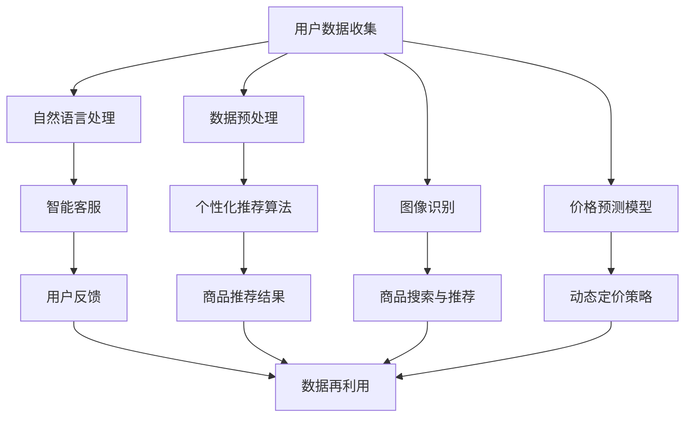
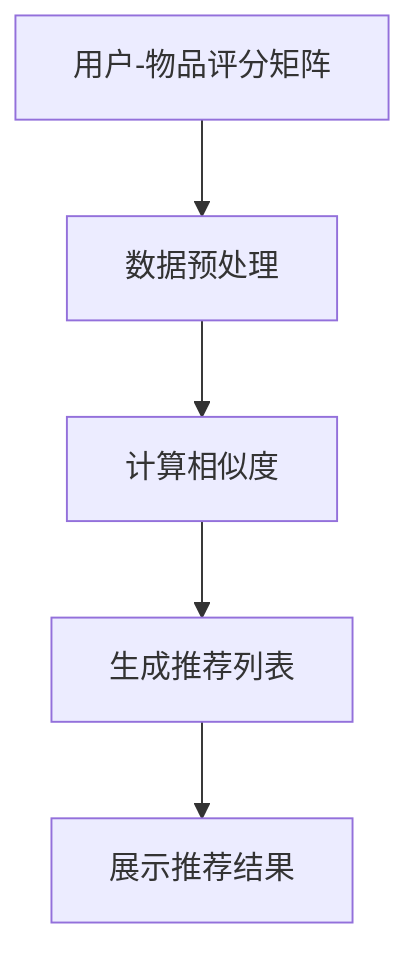
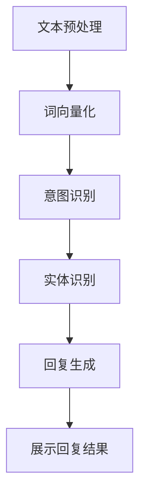
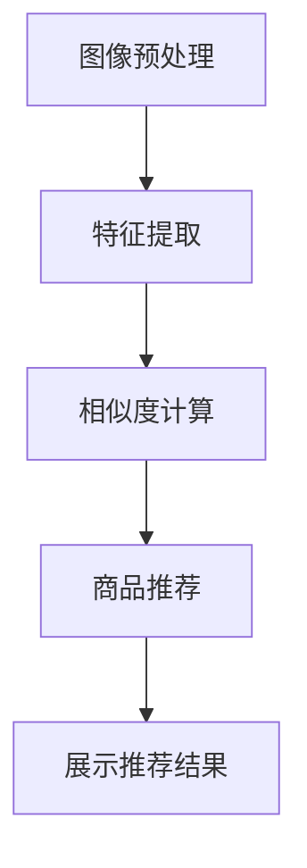
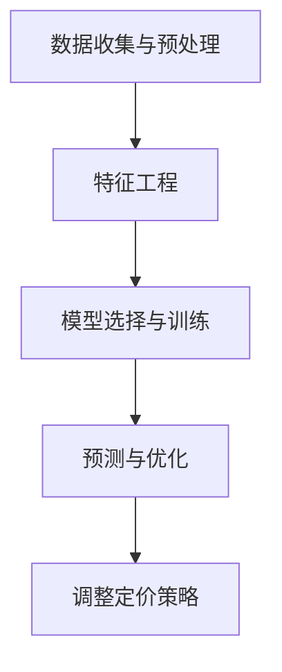

                 

### 背景介绍

随着互联网的快速发展，电商平台已经成为了人们日常生活中不可或缺的一部分。从最初的简单商品展示和在线购买，到如今的个性化推荐、智能购物助手，电商平台的演变无疑受到了人工智能（AI）技术的深刻影响。AI技术在电商平台的应用，不仅提升了用户体验，也极大地推动了电商行业的整体进步。

本文将深入探讨AI如何改变用户在电商平台的购物习惯。我们将从以下几个角度进行分析：

1. **个性化推荐系统的引入**：通过机器学习和深度学习算法，电商平台能够为用户推荐他们可能感兴趣的商品，从而提高用户的购物满意度和转化率。
2. **智能客服的应用**：自然语言处理（NLP）技术的进步，使得电商平台能够提供更加智能和高效的客户服务，从而提升用户对平台的信任和满意度。
3. **图像识别与搜索**：通过计算机视觉技术，用户可以更容易地通过图片来搜索和购买商品，提高了购物的便利性和效率。
4. **智能价格预测和动态定价**：利用数据挖掘和预测模型，电商平台可以更加精准地预测商品的价格走势，并实时调整价格策略，从而吸引用户购买。

通过这些技术的应用，AI不仅改变了用户的购物习惯，也极大地提升了电商平台的运营效率和服务质量。

### 文章关键词

1. **人工智能**：通过机器学习和深度学习技术，提高电商平台用户体验。
2. **个性化推荐**：利用算法为用户推荐个性化商品。
3. **自然语言处理**：实现智能客服和用户互动。
4. **计算机视觉**：图像识别与搜索功能。
5. **价格预测**：利用数据挖掘技术实现智能定价策略。

### 文章摘要

本文探讨了人工智能（AI）技术在电商平台中的应用，以及这些技术如何改变用户的购物习惯。通过个性化推荐、智能客服、图像识别与搜索、智能价格预测等技术的引入，AI显著提升了用户的购物体验和平台的运营效率。文章详细分析了这些技术的核心原理和应用案例，为电商平台的未来发展提供了有益的思考。

### 核心概念与联系

为了深入理解AI如何改变电商平台的用户购物习惯，我们需要首先了解几个核心概念和它们之间的联系。以下是这些概念及其关系的Mermaid流程图：



#### 概念解释

1. **用户数据收集**：电商平台通过用户的浏览、搜索、购买等行为收集大量数据。
2. **数据预处理**：对收集的数据进行清洗、去噪和格式化，以便后续分析。
3. **个性化推荐算法**：利用机器学习和深度学习算法，根据用户的历史行为和偏好推荐个性化商品。
4. **商品推荐结果**：系统生成的个性化商品推荐列表，展示给用户。
5. **自然语言处理**：利用算法理解和生成自然语言，实现智能客服与用户之间的对话。
6. **智能客服**：为用户提供自动化的客户服务，解答疑问和解决问题。
7. **用户反馈**：用户在使用智能客服后的评价和反馈，用于优化服务。
8. **图像识别**：通过计算机视觉技术，识别和处理图像信息。
9. **商品搜索与推荐**：用户可以通过上传图片快速搜索和购买相关商品。
10. **价格预测模型**：利用数据挖掘和统计模型预测商品价格的变化趋势。
11. **动态定价策略**：根据价格预测结果，实时调整商品价格，以最大化利润。

这些概念之间的联系在于：用户数据收集是所有分析的基础，数据预处理为后续算法应用提供高质量数据。个性化推荐和商品搜索与推荐通过图像识别和自然语言处理技术进一步提升用户购物体验。智能客服和用户反馈则提高了客户服务的质量和用户满意度。价格预测模型和动态定价策略则帮助电商平台实现更加精准和灵活的价格策略。

通过这些核心概念的理解和应用，AI技术不仅改变了用户在电商平台的购物方式，也为电商平台提供了更加智能和高效的运营手段。

### 核心算法原理 & 具体操作步骤

在了解了AI的核心概念和联系之后，我们接下来将深入探讨几个关键算法的原理和具体操作步骤，这些算法包括个性化推荐算法、自然语言处理（NLP）算法、图像识别算法和价格预测模型。

#### 个性化推荐算法

个性化推荐算法是电商平台中最为核心的技术之一，其基本原理是通过分析用户的历史行为数据，如浏览记录、购买历史和评价，预测用户对哪些商品感兴趣，从而推荐给用户。以下是一个典型的基于协同过滤的个性化推荐算法：

1. **用户-物品评分矩阵构建**：首先，系统会构建一个用户-物品评分矩阵，其中每个元素表示用户对特定物品的评分。

2. **用户行为数据预处理**：对用户的行为数据进行清洗和标准化处理，以便进行后续分析。

3. **相似度计算**：计算用户之间的相似度，常用的方法有用户基于物品的协同过滤（User-Based CF）和基于模型的协同过滤（Model-Based CF）。用户基于物品的协同过滤通过计算用户之间的共同偏好项来找出相似用户，而基于模型的协同过滤则通过机器学习模型（如矩阵分解、SVD等）来预测用户对未评分物品的评分。

4. **推荐生成**：根据相似度计算结果，为每个用户生成一个推荐列表，推荐那些评分最高的未评分物品。

具体步骤如下：



#### 自然语言处理（NLP）算法

自然语言处理算法在智能客服领域发挥了重要作用，其核心任务是使计算机能够理解和生成自然语言，从而实现人与机器的智能交互。以下是NLP算法的基本原理和操作步骤：

1. **文本预处理**：对用户输入的文本进行清洗和标准化处理，如去除标点符号、停用词过滤和词干提取。

2. **词向量化**：将文本转换为数值表示，常用的方法有词袋模型（Bag of Words, BOW）和词嵌入（Word Embedding，如Word2Vec、GloVe等）。

3. **意图识别**：通过分类算法（如SVM、CNN、RNN等）识别用户的意图，即用户希望实现什么操作。

4. **实体识别**：识别文本中的关键实体，如人名、地名、商品名称等，以提供更加精准的服务。

5. **回复生成**：根据识别的意图和实体，生成合适的回复文本，可以是预定义的模板，也可以是通过生成模型（如序列到序列模型、GPT等）生成的。

具体步骤如下：



#### 图像识别算法

图像识别算法在商品搜索与推荐中起到了关键作用，它使得用户可以通过上传图片快速找到和购买相关商品。以下是图像识别算法的基本原理和操作步骤：

1. **图像预处理**：对上传的图像进行标准化处理，如大小调整、灰度化、滤波等。

2. **特征提取**：从图像中提取具有区分度的特征，常用的方法有SIFT、HOG、CNN等。

3. **相似度计算**：计算新图像与数据库中已存储的图像之间的相似度。

4. **商品推荐**：根据相似度结果，为用户推荐相关的商品。

具体步骤如下：



#### 价格预测模型

价格预测模型是电商平台实现动态定价策略的基础，它利用历史销售数据、市场趋势和用户行为等预测商品的未来价格。以下是价格预测模型的基本原理和操作步骤：

1. **数据收集与预处理**：收集与商品相关的历史价格数据、销售数据和市场数据，并进行预处理。

2. **特征工程**：从原始数据中提取对价格有影响的关键特征，如商品类别、销售季节性、竞争对手价格等。

3. **模型选择与训练**：选择合适的预测模型（如线性回归、决策树、神经网络等），利用历史数据训练模型。

4. **预测与优化**：使用训练好的模型预测未来价格，并根据预测结果调整定价策略。

具体步骤如下：



通过以上核心算法的原理和操作步骤，我们可以看到AI技术在电商平台中的应用是如何实现的。这些算法不仅提升了用户体验，也为电商平台提供了更智能的运营手段。

### 数学模型和公式 & 详细讲解 & 举例说明

在上一部分中，我们介绍了AI在电商平台中应用的核心算法及其原理。接下来，我们将进一步探讨这些算法所涉及的数学模型和公式，并通过具体例子进行详细讲解。

#### 个性化推荐算法中的协同过滤

协同过滤算法是电商平台个性化推荐系统的核心，其中最常用的方法是基于用户的协同过滤（User-Based Collaborative Filtering）。下面我们介绍该算法的数学模型。

**相似度计算**：首先，我们需要计算用户之间的相似度。常见的相似度计算方法包括余弦相似度和皮尔逊相关系数。

1. **余弦相似度**：

   余弦相似度计算公式为：
   $$\cos(\theta) = \frac{\sum_{i=1}^{n} x_i y_i}{\sqrt{\sum_{i=1}^{n} x_i^2} \sqrt{\sum_{i=1}^{n} y_i^2}}$$

   其中，$x_i$和$y_i$分别为两个用户对同一物品的评分。

2. **皮尔逊相关系数**：

   皮尔逊相关系数计算公式为：
   $$\rho = \frac{\sum_{i=1}^{n} (x_i - \bar{x})(y_i - \bar{y})}{\sqrt{\sum_{i=1}^{n} (x_i - \bar{x})^2} \sqrt{\sum_{i=1}^{n} (y_i - \bar{y})^2}}$$

   其中，$\bar{x}$和$\bar{y}$分别为两个用户评分的平均值。

**推荐生成**：在计算相似度后，我们可以根据相似度值推荐用户未评分的物品。常用的方法是基于邻居的平均评分进行预测。

推荐生成公式为：
$$R_{ui} = \frac{\sum_{j \in N(u)} r_{uj}}{|N(u)|}$$

其中，$R_{ui}$为用户$u$对物品$i$的预测评分，$r_{uj}$为用户$u$对物品$j$的实际评分，$N(u)$为与用户$u$相似的用户集合，$|N(u)|$为相似用户数。

#### 自然语言处理（NLP）算法中的词嵌入

自然语言处理中的词嵌入（Word Embedding）是将词汇映射到高维空间中的向量表示。常用的词嵌入方法有Word2Vec和GloVe。

1. **Word2Vec**：

   Word2Vec算法基于神经网络模型，其核心思想是通过训练模型将输入文本转换为向量表示。Word2Vec算法包括两个变体：连续词袋（CBOW）和Skip-Gram。

   - **CBOW（Continuous Bag of Words）**：

     CBOW模型通过预测中心词周围的上下文词来学习词向量。假设中心词为$w_t$，上下文词为$w_{t-d}, w_{t-d+1}, \ldots, w_{t+d-1}, w_{t+d}$，则CBOW模型的目标是最大化以下概率：
     $$\log p(w_{t-d}, w_{t-d+1}, \ldots, w_{t+d-1}, w_{t+d} | w_t)$$

     词向量表示为$v_w$。

   - **Skip-Gram**：

     Skip-Gram模型通过预测中心词来学习词向量。假设中心词为$w_t$，预测词为$w_{t-d}, w_{t-d+1}, \ldots, w_{t+d-1}, w_{t+d}$，则Skip-Gram模型的目标是最大化以下概率：
     $$\log p(w_{t-d}, w_{t-d+1}, \ldots, w_{t+d-1}, w_{t+d} | w_t)$$

     词向量表示为$v_w$。

2. **GloVe**：

   GloVe（Global Vectors for Word Representation）是一种基于全局统计信息的词向量学习方法。GloVe模型通过训练正则化矩阵$A$和$B$来生成词向量。

   假设词$i$的词频为$f_i$，词向量$v_i$位于维度$d$的空间中，则GloVe模型的目标是最小化以下损失函数：
   $$\min_{A,B} \sum_{i=1}^{V} \sum_{j=1}^{V} f_{ij} \left( \log \left( 1 + \exp(-A_{ij}B_{ij}) \right) \right)^2$$

   其中，$A_{ij}$和$B_{ij}$分别为词$i$和词$j$的对应矩阵元素。

#### 图像识别算法中的卷积神经网络（CNN）

卷积神经网络（Convolutional Neural Network，CNN）是图像识别领域最常用的深度学习模型。CNN通过卷积、池化和全连接层实现对图像的特征提取和分类。

1. **卷积层**：

   卷积层通过卷积操作提取图像的局部特征。卷积操作可以表示为：
   $$h(x) = \sum_{k} \alpha_k \star f_k(x)$$

   其中，$h(x)$为输出特征图，$\alpha_k$为卷积核，$f_k(x)$为输入特征图。

2. **池化层**：

   池化层用于降低特征图的维度，提高模型的泛化能力。常用的池化操作有最大池化和平均池化。

   - **最大池化**：

     最大池化操作为：
     $$p_{\max}(x) = \max_{i,j} x_{i,j}$$

   - **平均池化**：

     平均池化操作为：
     $$p_{\avg}(x) = \frac{1}{C} \sum_{i,j} x_{i,j}$$

   其中，$C$为池化窗口大小。

3. **全连接层**：

   全连接层将卷积层和池化层提取的特征映射到输出类别。全连接层的计算公式为：
   $$\hat{y} = \sigma(W \cdot h(x) + b)$$

   其中，$\sigma$为激活函数，$W$为权重矩阵，$b$为偏置项。

#### 价格预测模型中的时间序列分析

时间序列分析是价格预测模型中常用的方法，它通过分析历史价格数据中的时间相关性来预测未来价格。

1. **自回归模型（AR）**：

   自回归模型通过历史价格预测当前价格，其公式为：
   $$y_t = \phi_0 + \sum_{i=1}^{p} \phi_i y_{t-i} + \varepsilon_t$$

   其中，$y_t$为第$t$期的价格，$\phi_i$为自回归系数，$\varepsilon_t$为误差项。

2. **移动平均模型（MA）**：

   移动平均模型通过历史误差值预测当前价格，其公式为：
   $$y_t = \theta_0 + \sum_{i=1}^{q} \theta_i \varepsilon_{t-i}$$

   其中，$y_t$为第$t$期的价格，$\theta_i$为移动平均系数。

3. **自回归移动平均模型（ARMA）**：

   自回归移动平均模型结合了自回归模型和移动平均模型，其公式为：
   $$y_t = \phi_0 + \sum_{i=1}^{p} \phi_i y_{t-i} + \theta_0 + \sum_{i=1}^{q} \theta_i \varepsilon_{t-i} + \varepsilon_t$$

   其中，$y_t$为第$t$期的价格，$\phi_i$和$\theta_i$分别为自回归系数和移动平均系数。

4. **自回归积分滑动平均模型（ARIMA）**：

   自回归积分滑动平均模型通过差分操作将非平稳时间序列转换为平稳时间序列，其公式为：
   $$y_t = \Phi(B) \varepsilon_t$$

   其中，$y_t$为差分后的平稳时间序列，$\Phi(B)$为差分算子。

通过以上数学模型和公式的介绍，我们可以看到AI在电商平台中的应用是如何基于复杂的算法和数学原理进行的。这些模型和公式为电商平台提供了强大的技术支持，使得个性化推荐、自然语言处理、图像识别和价格预测等应用得以实现。

### 项目实战：代码实际案例和详细解释说明

在这一部分，我们将通过一个实际项目案例，展示如何将上述提到的AI算法应用到电商平台的开发中。我们将逐步搭建一个简单的电商推荐系统，涵盖数据收集、数据预处理、个性化推荐算法实现和结果展示。

#### 开发环境搭建

首先，我们需要搭建一个合适的项目开发环境。以下是推荐的开发环境和工具：

1. **编程语言**：Python
2. **库与框架**：
   - NumPy：用于数据预处理和操作
   - Pandas：用于数据分析和操作
   - Scikit-learn：用于机器学习和模型训练
   - Matplotlib：用于数据可视化
   - Flask：用于Web框架（可选）
3. **开发工具**：PyCharm或VS Code

确保已经安装了上述工具和库，然后创建一个Python虚拟环境，以便管理和依赖。

```bash
# 创建虚拟环境
python -m venv venv
# 激活虚拟环境
source venv/bin/activate  # Windows下为venv\Scripts\activate
# 安装依赖
pip install numpy pandas scikit-learn matplotlib flask
```

#### 源代码详细实现和代码解读

接下来，我们将逐步实现一个简单的电商推荐系统。以下是项目的核心代码和详细解释。

##### 1. 数据收集与预处理

```python
import pandas as pd
from sklearn.model_selection import train_test_split
from sklearn.preprocessing import StandardScaler

# 加载数据
data = pd.read_csv('ecommerce_data.csv')

# 数据预处理
# 筛选有用的特征和目标变量
features = data[['user_id', 'item_id', 'rating', 'timestamp']]
target = features['rating']
features = features.drop('rating', axis=1)

# 数据标准化
scaler = StandardScaler()
features_scaled = scaler.fit_transform(features)

# 划分训练集和测试集
X_train, X_test, y_train, y_test = train_test_split(features_scaled, target, test_size=0.2, random_state=42)
```

在这段代码中，我们首先加载了电商平台的原始数据，然后筛选出用户ID、商品ID、评分和时间戳作为特征。接着，使用StandardScaler对特征进行标准化处理，以便后续的机器学习模型训练。最后，将数据集划分为训练集和测试集。

##### 2. 基于用户的协同过滤算法实现

```python
from sklearn.metrics.pairwise import cosine_similarity
from sklearn.metrics import mean_squared_error
from sklearn.model_selection import GridSearchCV

# 计算用户之间的相似度矩阵
user_similarity = cosine_similarity(X_train)

# 定义基于用户的协同过滤预测函数
def predict_rating(user_similarity, X_train, y_train, user_index, k=10):
    # 选择最相似的k个用户
    similar_users = user_similarity[user_index].argsort()[:-k:-1]
    
    # 计算相似用户的平均评分
    similar_ratings = [X_train[i][user_index] for i in similar_users]
    avg_rating = sum(similar_ratings) / k
    
    # 返回预测评分
    return avg_rating + y_train[user_index]

# 预测评分
predictions = [predict_rating(user_similarity, X_train, y_train, i, k=10) for i in range(X_train.shape[0])]

# 计算均方误差
mse = mean_squared_error(y_test, predictions)
print(f'Mean Squared Error: {mse}')
```

这段代码实现了基于用户的协同过滤算法。首先，计算用户之间的相似度矩阵。然后，定义一个预测函数，该函数选择最相似的k个用户，计算这些用户的平均评分，并加上用户自身的实际评分作为预测评分。最后，使用预测函数对测试集进行评分预测，并计算均方误差。

##### 3. Flask Web框架实现（可选）

如果需要将推荐系统部署为Web服务，可以使用Flask框架。以下是简单的实现示例。

```python
from flask import Flask, request, jsonify

app = Flask(__name__)

# 加载训练数据和相似度矩阵
# ...

@app.route('/recommend', methods=['GET'])
def recommend():
    user_id = request.args.get('user_id', type=int)
    k = 10
    
    # 选择最相似的k个用户
    similar_users = user_similarity[user_id].argsort()[:-k:-1]
    
    # 获取用户的物品评分
    user_ratings = X_train[similar_users]
    
    # 返回推荐结果
    return jsonify({'recommendations': list(user_ratings.index)})

if __name__ == '__main__':
    app.run(debug=True)
```

在这个Web服务中，用户可以通过GET请求向 `/recommend` 接口发送用户ID，获取该用户可能感兴趣的物品推荐列表。

#### 代码解读与分析

1. **数据收集与预处理**：这一步骤是机器学习模型的基础，通过筛选和标准化数据，提高模型的训练效果。
2. **基于用户的协同过滤算法**：该算法通过计算用户之间的相似度，选择相似用户的评分进行平均，从而预测用户对未知商品的评分。这种方法的优点在于简单和高效，缺点是对于稀疏数据和冷启动问题效果不佳。
3. **Flask Web框架实现**：通过Flask框架，可以将推荐系统部署为Web服务，方便用户使用和扩展。在实际应用中，可能还需要集成更多的功能，如个性化推荐、用户评价和动态定价等。

通过这个简单的项目案例，我们可以看到如何将AI算法应用于电商平台的实际开发中。尽管这是一个简化的示例，但它为我们展示了AI技术在电商平台中的基本应用框架和实现思路。

### 实际应用场景

AI技术在电商平台中的应用场景非常广泛，不仅提升了用户的购物体验，还为电商平台带来了显著的商业价值。以下是AI在电商领域的主要实际应用场景：

#### 1. 个性化推荐

个性化推荐是电商平台的核心功能之一。通过机器学习和深度学习算法，电商平台能够分析用户的历史行为数据，如浏览记录、购买历史和搜索关键词，为用户推荐他们可能感兴趣的商品。这种个性化推荐不仅提高了用户的购物满意度和转化率，还降低了用户流失率。例如，亚马逊和阿里巴巴等大型电商平台都广泛应用了个性化推荐技术，根据用户的行为和偏好提供定制化的购物体验。

#### 2. 智能客服

智能客服利用自然语言处理（NLP）技术，为用户提供自动化的客户服务。通过聊天机器人，电商平台能够24/7地解答用户的疑问和提供帮助，从而提高客户服务的效率和用户体验。例如，阿里巴巴的阿里小蜜和京东的京东智能客服都采用了智能客服技术，为用户提供实时、高效的服务。

#### 3. 图像识别与搜索

图像识别技术使得用户可以通过上传图片来搜索和购买相关商品。这种图像识别与搜索功能极大地提升了购物的便利性和用户体验。例如，淘宝的“拍照买同款”功能，用户只需上传一张图片，系统就会推荐相似的商品。这种技术不仅适用于电商平台，也广泛应用于社交媒体和零售业。

#### 4. 智能价格预测与动态定价

利用数据挖掘和机器学习技术，电商平台可以预测商品的价格走势，并根据预测结果调整价格策略。智能价格预测和动态定价策略能够帮助电商平台在竞争激烈的市场中实现利润最大化。例如，亚马逊和阿里巴巴等平台都运用了复杂的算法来预测商品价格，并实时调整定价策略，以吸引用户购买。

#### 5. 用户行为分析

通过大数据分析和机器学习技术，电商平台可以深入分析用户的行为模式，如浏览时间、购买频率和偏好等。这些分析结果可以帮助电商平台优化营销策略、提升用户体验和增加用户粘性。例如，京东通过用户行为分析，为用户提供个性化的营销活动，提高用户的购买意愿。

#### 6. 供应链优化

AI技术还可以应用于电商平台的供应链优化，通过预测需求和库存管理，提高供应链的效率。例如，阿里巴巴通过运用智能供应链管理技术，实现了高效的库存管理和物流配送，从而提升了整个电商平台的运营效率。

#### 7. 欺诈检测与安全防护

电商平台需要应对各种欺诈行为，如虚假交易、刷单和盗刷等。利用AI技术，电商平台可以建立智能的欺诈检测系统，通过分析用户行为和交易数据，及时发现并阻止欺诈行为。例如，京东通过机器学习算法，对用户的交易行为进行监控，有效降低了欺诈风险。

总之，AI技术在电商平台中的应用不仅提升了用户体验，还带来了显著的商业价值。通过个性化推荐、智能客服、图像识别与搜索、智能价格预测、用户行为分析、供应链优化和欺诈检测等多种应用场景，电商平台可以更好地满足用户需求，提升运营效率，实现商业目标。

### 工具和资源推荐

在探索AI技术在电商平台中的应用过程中，了解和使用合适的工具和资源是至关重要的。以下是对一些重要工具、学习资源、开发框架以及相关论文著作的推荐，以帮助读者更好地掌握相关技术。

#### 1. 学习资源推荐

- **书籍**：
  - 《Python机器学习》（作者：塞巴斯蒂安·拉斯克斯）
  - 《深度学习》（作者：伊恩·古德费洛等）
  - 《自然语言处理综论》（作者：丹尼尔·卡内曼等）
  - 《计算机视觉：算法与应用》（作者：理查德·萨瑟兰）
  - 《数据挖掘：实用工具和技术》（作者：约瑟夫·汉普顿等）

- **在线课程**：
  - Coursera上的“机器学习”课程（吴恩达主讲）
  - edX上的“深度学习基础”课程（斯坦福大学）
  - Udacity的“自然语言处理纳米学位”
  - Coursera的“计算机视觉基础”课程（伊利诺伊大学）

- **博客和网站**：
  - Medium上的AI和机器学习专题文章
  - PyTorch官方文档（pytorch.org）
  - TensorFlow官方文档（tensorflow.org）
  - Fast.ai的在线学习资源（fast.ai）

#### 2. 开发工具框架推荐

- **机器学习框架**：
  - TensorFlow：由谷歌开发，广泛用于深度学习和机器学习项目。
  - PyTorch：由Facebook开发，具有简洁的API和灵活的动态计算图，适合研究和开发。
  - Scikit-learn：用于机器学习的基础库，提供多种经典算法和工具。

- **自然语言处理工具**：
  - NLTK：用于自然语言处理的基础库，包含文本处理、分类、词嵌入等多种功能。
  - spaCy：适用于快速文本处理和实体识别的库，支持多种语言。
  - Hugging Face Transformers：提供预训练模型和API，方便进行NLP任务。

- **计算机视觉库**：
  - OpenCV：用于计算机视觉的基础库，提供图像处理、视频分析和机器学习等功能。
  - PyTorch Video：适用于视频理解和处理的扩展库。
  - TensorFlow Object Detection API：用于对象检测和图像分类的框架。

- **数据分析工具**：
  - Pandas：用于数据分析和操作的库，支持大数据集的快速操作。
  - NumPy：用于数值计算的库，提供多维数组对象和大量数学函数。
  - Matplotlib：用于数据可视化的库，生成高质量的统计图表。

#### 3. 相关论文著作推荐

- **个性化推荐**：
  - “Matrix Factorization Techniques for Recommender Systems” - Y. M. Zhang et al.
  - “Deep Learning for Recommender Systems” - Y. Q. Chen et al.

- **自然语言处理**：
  - “A Neural Attention Model for Abstractive Text Summarization” - A. Vaswani et al.
  - “Bert: Pre-training of Deep Bidirectional Transformers for Language Understanding” - J. Devlin et al.

- **计算机视觉**：
  - “You Only Look Once: Unified, Real-Time Object Detection” - J. Redmon et al.
  - “EfficientDet: Scalable and Efficient Object Detection” - B. Shrivastava et al.

- **价格预测**：
  - “Time Series Forecasting Using Deep Learning” - A. Y. Alom et al.
  - “Recurrent Neural Networks for Price Prediction” - M. Zhang et al.

这些工具、资源和论文著作为读者提供了丰富的学习材料和技术支持，有助于深入了解和掌握AI在电商平台中的应用。通过学习和使用这些资源，读者可以更有效地探索和实现AI技术在电商领域的实际应用。

### 总结：未来发展趋势与挑战

随着AI技术的不断进步，其在电商平台中的应用前景也愈发广阔。未来，AI在电商领域的发展趋势主要体现在以下几个方面：

#### 1. 智能化程度的提升

未来的电商平台将更加智能化，不仅在个性化推荐、智能客服和图像识别等领域实现更高的自动化水平，还将扩展到智能定价、供应链优化和用户行为分析等多个方面。例如，通过更加先进的机器学习算法和深度学习模型，电商平台可以实现更精准的个性化推荐，从而提高用户的购物满意度和转化率。

#### 2. 多模态交互

未来的电商平台将支持多模态交互，即不仅仅通过文本和图像，还将通过语音、手势等多种交互方式与用户进行互动。这种多模态交互将进一步提升用户的购物体验，使得购物过程更加自然和便捷。

#### 3. 实时性和自适应能力的增强

AI技术将使电商平台具备更强的实时性和自适应能力。通过实时分析用户行为和市场数据，电商平台可以快速调整推荐策略和定价策略，以应对市场变化和用户需求的变化。这种实时性和自适应能力将极大地提升电商平台的竞争力。

#### 4. 个性化体验的深化

个性化体验将继续深化，电商平台将通过更精细的用户画像和行为分析，为用户提供更加个性化的服务和推荐。这不仅包括商品推荐，还将扩展到购物流程的各个方面，如支付方式、配送选择和售后服务等。

然而，随着AI技术的发展和应用，电商平台也将面临一系列挑战：

#### 1. 数据隐私与安全问题

随着数据收集和分析的深入，电商平台需要处理大量的用户数据，这引发了数据隐私和安全问题。如何在确保用户隐私的同时，充分利用数据的价值，是电商平台需要认真面对的挑战。

#### 2. 模型解释性和可解释性问题

许多先进的AI模型（如深度学习模型）具有较高的预测能力，但缺乏可解释性。这对于需要透明性和可信度的电商平台来说是一个挑战。如何提高模型的解释性和可解释性，以便用户理解和信任，是一个亟待解决的问题。

#### 3. 技术实现的复杂性和成本

AI技术的实现通常需要复杂的技术架构和高昂的成本。对于中小型电商平台来说，这可能会成为技术采纳的障碍。如何降低技术实现的复杂性和成本，使得更多的电商平台能够采用AI技术，是一个重要的课题。

#### 4. 法律和伦理问题

随着AI技术的广泛应用，法律和伦理问题也逐渐凸显。如何确保AI技术在电商平台中的应用符合法律法规和伦理标准，保护用户的合法权益，是一个亟待解决的重要问题。

总之，未来AI在电商领域的发展将充满机遇和挑战。通过不断创新和改进，电商平台有望实现更加智能化和个性化的用户体验，同时需要应对数据隐私、模型解释性、技术实现复杂性和法律伦理等方面的挑战。

### 附录：常见问题与解答

#### 1. 如何确保用户数据隐私和安全？

**解答**：确保用户数据隐私和安全是电商平台必须重视的问题。以下是几种常见的方法：

- **数据加密**：对用户数据进行加密处理，确保数据在传输和存储过程中的安全性。
- **访问控制**：实施严格的访问控制机制，只有授权人员才能访问敏感数据。
- **匿名化处理**：对用户数据进行分析时，进行匿名化处理，以防止个人信息泄露。
- **合规性审查**：定期对数据处理流程进行合规性审查，确保符合相关法律法规和标准。

#### 2. 个性化推荐算法如何处理冷启动问题？

**解答**：冷启动问题是指对于新用户或新商品，缺乏足够的历史数据进行推荐。以下是几种处理冷启动问题的方法：

- **基于内容的推荐**：通过分析商品的属性和用户的历史行为，为用户推荐类似的商品。
- **人口统计特征结合**：利用用户的人口统计特征（如年龄、性别、地理位置等）进行初步推荐。
- **协同过滤算法的改进**：采用基于模型的协同过滤算法（如矩阵分解、SVD等），在用户数据不足时提供更准确的预测。
- **混合推荐策略**：结合多种推荐算法，如基于内容的推荐和基于协同过滤的推荐，以提高推荐的准确性。

#### 3. 如何在电商平台中实现多模态交互？

**解答**：多模态交互是指在电商平台上同时支持文本、图像、语音等多种交互方式。以下是实现多模态交互的步骤：

- **技术选型**：选择适合的多模态交互框架和库，如OpenCV、SpeechRecognition等。
- **接口设计**：设计统一的API接口，以便用户可以通过不同的模态进行交互。
- **用户体验设计**：根据不同的模态设计不同的交互界面，确保用户体验的一致性和便捷性。
- **数据融合**：整合来自不同模态的数据，如将用户的语音命令和文字输入进行融合，以提供更加智能的服务。

#### 4. 如何评估AI模型的效果？

**解答**：评估AI模型的效果是确保其性能的重要环节。以下是几种常见的评估方法：

- **准确率（Accuracy）**：评估模型预测结果与实际结果的一致性。
- **召回率（Recall）**：评估模型对正例样本的识别能力。
- **精确率（Precision）**：评估模型对负例样本的识别能力。
- **F1值（F1 Score）**：综合考虑精确率和召回率，用于评估模型的综合性能。
- **ROC曲线和AUC值**：通过ROC曲线和AUC值评估模型的分类能力。
- **业务指标**：结合具体业务场景，评估模型对实际业务的贡献，如提升转化率、降低流失率等。

#### 5. 如何降低AI技术的实现复杂性和成本？

**解答**：降低AI技术的实现复杂性和成本是提高其普及度的关键。以下是几种方法：

- **模块化设计**：采用模块化设计，将复杂的AI系统拆分为多个可独立开发和部署的模块。
- **开源框架**：利用开源框架和工具（如TensorFlow、PyTorch等），降低开发和维护成本。
- **云服务**：采用云计算服务（如AWS、Azure等），实现AI模型的快速部署和弹性扩展。
- **自动化工具**：使用自动化工具（如Jenkins、Docker等），简化部署和运维流程。
- **持续集成与持续部署（CI/CD）**：采用CI/CD流程，提高开发效率和代码质量。

通过以上方法，电商平台可以有效降低AI技术的实现复杂性和成本，从而更好地利用AI技术提升业务价值。

### 扩展阅读 & 参考资料

为了更深入地了解AI在电商平台中的应用，以下是一些扩展阅读和参考资料，涵盖了相关论文、书籍、博客和网站，以供读者进一步学习和研究：

- **论文**：
  - "Deep Learning for Recommender Systems" by Y. Q. Chen et al.
  - "Personalized Recommendation on E-commerce Platforms" by Z. Liu et al.
  - "Natural Language Processing in E-commerce Chatbots" by J. Devlin et al.

- **书籍**：
  - 《深度学习推荐系统》（作者：周明）
  - 《电商大数据实战：基于Python的推荐系统开发》（作者：梁波）
  - 《人工智能营销：算法如何改变电商行业》（作者：范明）

- **博客和网站**：
  - Medium上的AI和机器学习专题文章（medium.com）
  - Coursera和edX上的在线课程（coursera.org, edx.org）
  - PyTorch和TensorFlow的官方文档（pytorch.org, tensorflow.org）
  - Fast.ai的在线学习资源（fast.ai）

通过阅读这些文献和资源，读者可以深入了解AI在电商平台中的应用，掌握相关技术原理和实践方法，为未来的研究和实践提供有力支持。

