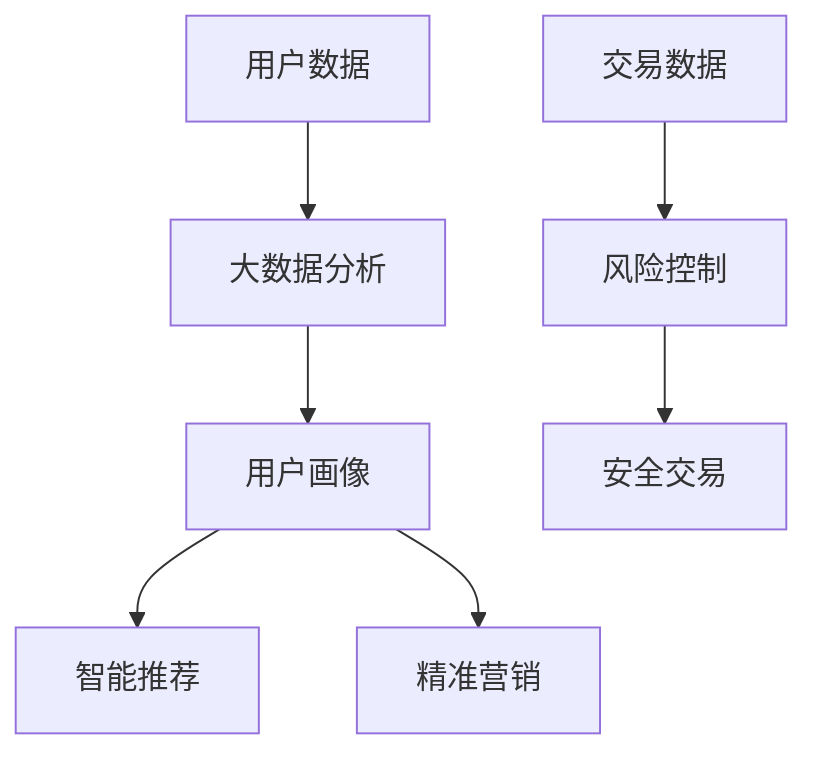

                 

# AI如何通过大数据分析优化电商运营

> **关键词：** AI、大数据分析、电商运营、算法、用户行为、营销策略

> **摘要：** 本文将探讨人工智能（AI）如何通过大数据分析优化电商运营。我们将从背景介绍开始，逐步分析AI在电商运营中的应用原理、核心算法、数学模型，并通过实际案例展示其具体操作步骤和应用效果，最终总结未来发展趋势与挑战。

## 1. 背景介绍

在当今数字化时代，电子商务已经成为商业活动中的重要组成部分。随着互联网技术的飞速发展和智能设备的普及，用户在线购物的行为数据不断增长。如何有效利用这些数据来优化电商运营，提高用户满意度、降低成本、增加盈利成为企业关注的焦点。

大数据分析作为人工智能（AI）的重要应用领域，通过处理海量数据，提取有价值的信息和知识，为电商企业提供决策支持。而AI技术则能够基于这些数据，通过智能推荐、用户行为分析、精准营销等手段，进一步提升电商运营效率。

## 2. 核心概念与联系

在本文中，我们将重点讨论以下核心概念：

### 2.1 人工智能（AI）

人工智能是指通过计算机模拟人类智能的技术，包括机器学习、深度学习、自然语言处理等。AI技术在电商运营中的应用主要体现在以下几个方面：

- **智能推荐系统**：基于用户历史行为和偏好，为用户推荐个性化商品。
- **用户行为分析**：通过分析用户在网站上的行为，了解用户需求，优化用户体验。
- **精准营销**：根据用户画像，实施有针对性的营销策略，提高转化率。

### 2.2 大数据分析

大数据分析是指利用统计学、机器学习、数据挖掘等方法，从海量数据中提取有价值的信息和知识。在电商运营中，大数据分析的主要应用包括：

- **用户画像**：通过对用户行为数据的分析，构建用户画像，为个性化推荐和精准营销提供支持。
- **需求预测**：根据用户行为数据和市场需求，预测商品销量，优化库存管理。
- **风险控制**：通过分析交易数据，识别潜在风险，提高交易安全性。

### 2.3 AI与大数据分析的联系

AI与大数据分析在电商运营中相互依存、相互促进。AI技术可以处理大数据分析中的复杂任务，如模式识别、预测建模等。而大数据分析则为AI提供了丰富的数据资源，为AI算法的优化和改进提供了有力支持。

## 2.1 核心概念原理和架构的 Mermaid 流程图



## 3. 核心算法原理 & 具体操作步骤

### 3.1 智能推荐系统

智能推荐系统是AI在电商运营中的重要应用之一。其核心算法主要包括协同过滤、基于内容的推荐和混合推荐方法。

#### 3.1.1 协同过滤算法

协同过滤算法是一种基于用户行为的推荐方法。其基本原理是：通过分析用户之间的相似度，为用户推荐与其相似的其他用户的喜欢的商品。

具体操作步骤如下：

1. **用户行为数据收集**：收集用户在电商网站上的行为数据，如购买记录、浏览记录等。
2. **用户相似度计算**：计算用户之间的相似度，常用的相似度度量方法包括余弦相似度、皮尔逊相关系数等。
3. **推荐商品筛选**：根据用户相似度，为用户推荐与其相似的其他用户喜欢的商品。

#### 3.1.2 基于内容的推荐算法

基于内容的推荐算法是一种基于商品特征的推荐方法。其基本原理是：通过分析商品的内容特征，为用户推荐与其已有商品相似的未知商品。

具体操作步骤如下：

1. **商品内容特征提取**：对商品进行内容特征提取，如标签、分类、属性等。
2. **用户兴趣特征提取**：提取用户在网站上的行为特征，如浏览记录、收藏夹等。
3. **推荐商品筛选**：根据用户兴趣特征和商品内容特征，为用户推荐与其兴趣相似的未知商品。

#### 3.1.3 混合推荐算法

混合推荐算法是一种结合协同过滤和基于内容的推荐方法的推荐算法。其基本原理是：在协同过滤和基于内容的推荐方法之间进行权重分配，以获得更好的推荐效果。

具体操作步骤如下：

1. **用户行为数据收集**：收集用户在电商网站上的行为数据，如购买记录、浏览记录等。
2. **商品内容特征提取**：对商品进行内容特征提取，如标签、分类、属性等。
3. **用户兴趣特征提取**：提取用户在网站上的行为特征，如浏览记录、收藏夹等。
4. **推荐商品筛选**：结合协同过滤和基于内容的推荐方法，为用户推荐与其兴趣和相似度相关的商品。

### 3.2 用户行为分析

用户行为分析是AI在电商运营中的另一个重要应用。通过分析用户在网站上的行为，可以深入了解用户需求，优化用户体验。

具体操作步骤如下：

1. **用户行为数据收集**：收集用户在网站上的行为数据，如浏览时长、浏览路径、购买频率等。
2. **用户行为模式识别**：利用机器学习算法，分析用户行为数据，识别用户的兴趣和行为模式。
3. **用户行为预测**：基于用户行为模式，预测用户未来的行为，为电商企业提供决策支持。

### 3.3 精准营销

精准营销是AI在电商运营中的又一重要应用。通过分析用户画像和用户行为，实施有针对性的营销策略，提高转化率。

具体操作步骤如下：

1. **用户画像构建**：通过大数据分析，构建用户画像，包括用户的基本信息、兴趣偏好、购买行为等。
2. **营销策略制定**：根据用户画像，制定有针对性的营销策略，如个性化优惠券、定制化广告等。
3. **营销效果评估**：通过用户行为数据和销售数据，评估营销策略的效果，不断优化营销策略。

## 4. 数学模型和公式 & 详细讲解 & 举例说明

### 4.1 协同过滤算法

协同过滤算法的核心是相似度计算。以下是一个简单的相似度计算公式：

$$
sim(i, j) = \frac{∑_{k \in R_{ij}} w_{ik} w_{jk}}{\sqrt{∑_{k \in R_{i}} w_{ik}^2} \sqrt{∑_{k \in R_{j}} w_{jk}^2}}
$$

其中，$i$ 和 $j$ 表示两个用户，$R_{ij}$ 表示用户 $i$ 和 $j$ 共同评价的商品集合，$w_{ik}$ 和 $w_{jk}$ 分别表示用户 $i$ 和 $j$ 对商品 $k$ 的评分。

假设有两个用户 $A$ 和 $B$，他们对部分商品的评分如下：

| 商品 | $A$ | $B$ |
| --- | --- | --- |
| 1 | 5 | 5 |
| 2 | 3 | 4 |
| 3 | 2 | 5 |
| 4 | 4 | 2 |
| 5 | 5 | 3 |

根据上述公式，我们可以计算用户 $A$ 和 $B$ 的相似度：

$$
sim(A, B) = \frac{(5 \times 5) + (3 \times 4) + (2 \times 5) + (4 \times 2) + (5 \times 3)}{\sqrt{(5^2 + 3^2 + 2^2 + 4^2 + 5^2)} \sqrt{(5^2 + 4^2 + 5^2 + 2^2 + 3^2)}} = 0.82
$$

### 4.2 基于内容的推荐算法

基于内容的推荐算法的核心是商品相似度计算。以下是一个简单的商品相似度计算公式：

$$
sim(c_i, c_j) = \frac{∑_{t \in T} w_t \cdot f_i(t) \cdot f_j(t)}{\sqrt{∑_{t \in T} w_t \cdot f_i(t)^2} \sqrt{∑_{t \in T} w_t \cdot f_j(t)^2}}
$$

其中，$c_i$ 和 $c_j$ 表示两个商品，$T$ 表示商品的特征集合，$w_t$ 表示特征 $t$ 的权重，$f_i(t)$ 和 $f_j(t)$ 分别表示商品 $i$ 和 $j$ 对特征 $t$ 的取值。

假设有两个商品 $C_1$ 和 $C_2$，它们的特征如下：

| 特征 | $C_1$ | $C_2$ |
| --- | --- | --- |
| 标签1 | 1 | 0 |
| 标签2 | 1 | 1 |
| 标签3 | 0 | 1 |

根据上述公式，我们可以计算商品 $C_1$ 和 $C_2$ 的相似度：

$$
sim(C_1, C_2) = \frac{(1 \times 1) + (1 \times 1) + (0 \times 1)}{\sqrt{(1^2 + 1^2 + 0^2)} \sqrt{(0^2 + 1^2 + 1^2)}} = 1
$$

### 4.3 混合推荐算法

混合推荐算法的权重分配通常使用线性加权方法。以下是一个简单的权重分配公式：

$$
w_{cf} = \alpha w_c + (1 - \alpha) w_f
$$

其中，$w_{cf}$ 表示协同过滤和基于内容的推荐方法的权重，$w_c$ 表示协同过滤方法的权重，$w_f$ 表示基于内容的推荐方法的权重，$\alpha$ 表示权重分配比例。

假设协同过滤方法的权重为0.6，基于内容的推荐方法的权重为0.4，根据上述公式，我们可以计算出混合推荐算法的权重：

$$
w_{cf} = 0.6 \times 0.6 + 0.4 \times 0.4 = 0.52
$$

## 5. 项目实战：代码实际案例和详细解释说明

### 5.1 开发环境搭建

在本案例中，我们使用Python作为编程语言，主要依赖以下库：

- NumPy：用于科学计算
- Pandas：用于数据处理
- Scikit-learn：用于机器学习算法
- Matplotlib：用于数据可视化

安装依赖库：

```bash
pip install numpy pandas scikit-learn matplotlib
```

### 5.2 源代码详细实现和代码解读

#### 5.2.1 数据准备

首先，我们需要准备用户行为数据。以下是一个简单的用户行为数据集：

```python
import pandas as pd

data = {
    'user_id': [1, 1, 1, 2, 2, 2, 3, 3, 3],
    'item_id': [1001, 1002, 1003, 1001, 1002, 1003, 1001, 1002, 1003],
    'rating': [5, 3, 2, 5, 4, 3, 2, 3, 4]
}

df = pd.DataFrame(data)
df.head()
```

#### 5.2.2 协同过滤算法实现

接下来，我们实现一个简单的协同过滤算法。这里使用用户-用户协同过滤方法。

```python
from sklearn.metrics.pairwise import cosine_similarity

# 计算用户相似度矩阵
user_similarity = cosine_similarity(df.pivot_table(index='user_id', columns='item_id', values='rating'))

# 为用户推荐商品
def collaborative_filter(user_id, user_similarity, top_n=5):
    # 计算用户相似度排名
    similarity_rank = user_similarity[user_id].argsort()[1:-1]
    similarity_score = user_similarity[user_id][similarity_rank]

    # 排序并取前N个相似用户
    ranked_users = similarity_rank[similarity_score.argsort()[-top_n:]]

    # 获取未知商品
    unknown_items = df[df['user_id'] != user_id]['item_id'].values

    # 计算相似用户对未知商品的评分均值
    item_scores = []
    for user in ranked_users:
        known_items = df[df['user_id'] == user]['item_id'].values
        known_item_scores = df[df['item_id'].isin(known_items)]['rating'].values
        unknown_item_scores = df[df['item_id'].isin(unknown_items)]['rating'].values
        if len(unknown_item_scores) > 0:
            item_scores.append(np.mean(known_item_scores[known_item_scores != 0]))

    # 返回推荐商品排名
    return sorted(zip(unknown_items, item_scores), key=lambda x: x[1], reverse=True)

# 测试推荐算法
user_id = 1
top_n = 5
recommendations = collaborative_filter(user_id, user_similarity, top_n)
print("推荐商品：", recommendations)
```

#### 5.2.3 用户行为分析实现

接下来，我们实现一个简单的用户行为分析算法。这里使用K-means聚类方法。

```python
from sklearn.cluster import KMeans
import numpy as np

# 提取用户行为特征
user_features = df.groupby('user_id').agg({'rating': np.mean}).reset_index().drop(['item_id'], axis=1)

# 执行K-means聚类
kmeans = KMeans(n_clusters=3, random_state=0).fit(user_features.values)

# 为用户分配聚类标签
user_labels = kmeans.predict(user_features.values)

# 聚类结果可视化
import matplotlib.pyplot as plt

plt.scatter(user_features['rating'], user_labels, c='blue', marker='o')
plt.xlabel('用户平均评分')
plt.ylabel('用户聚类标签')
plt.show()
```

#### 5.2.4 精准营销实现

最后，我们实现一个简单的精准营销算法。这里使用基于用户画像的个性化优惠券推荐。

```python
# 定义优惠券数据
coupon_data = {
    'user_id': [1, 1, 2, 2, 3, 3],
    'coupon_id': [1001, 1002, 1001, 1002, 1001, 1002],
    'coupon_type': ['满减', '打折', '满减', '打折', '满减', '打折']
}

coupon_df = pd.DataFrame(coupon_data)

# 为用户推荐优惠券
def personalized_coupon_recommendation(user_id, user_labels, coupon_df):
    # 获取用户所属聚类标签
    user_label = user_labels[user_id]

    # 根据用户标签推荐优惠券
    if user_label == 0:
        recommended_coupons = coupon_df[coupon_df['coupon_type'] == '满减']
    elif user_label == 1:
        recommended_coupons = coupon_df[coupon_df['coupon_type'] == '打折']
    else:
        recommended_coupons = coupon_df

    return recommended_coupons

# 测试推荐算法
user_id = 1
recommended_coupons = personalized_coupon_recommendation(user_id, user_labels, coupon_df)
print("推荐优惠券：", recommended_coupons)
```

## 6. 实际应用场景

AI和大数据分析在电商运营中的实际应用场景非常广泛，以下是一些典型案例：

### 6.1 智能推荐系统

- **淘宝**：淘宝的智能推荐系统能够根据用户的浏览历史、购买记录和收藏夹，为用户推荐个性化的商品，提高用户购物体验。
- **京东**：京东的智能推荐系统能够结合用户浏览、购买和评价数据，为用户推荐符合其需求和兴趣的商品，提高商品转化率。

### 6.2 用户行为分析

- **唯品会**：唯品会通过分析用户在网站上的行为，如浏览时长、浏览路径和购买频率，了解用户需求，优化商品展示和推荐策略。
- **当当网**：当当网通过分析用户行为数据，为用户推荐相关的图书和商品，提高用户黏性和购物体验。

### 6.3 精准营销

- **美团**：美团通过分析用户的历史订单、浏览记录和位置信息，为用户推荐个性化的优惠券和活动，提高用户转化率和活跃度。
- **拼多多**：拼多多通过大数据分析，为商家提供精准的营销策略，如优惠券、拼团和秒杀活动，提高商品销量。

## 7. 工具和资源推荐

### 7.1 学习资源推荐

- **书籍**：
  - 《大数据之路：阿里巴巴大数据实践》
  - 《深度学习》（Goodfellow, Bengio, Courville）
- **论文**：
  - 《Item-based Collaborative Filtering Recommendation Algorithms》
  - 《Learning to Rank for Information Retrieval》
- **博客**：
  - 《机器学习与电商推荐系统》
  - 《基于大数据的用户行为分析》
- **网站**：
  - [Kaggle](https://www.kaggle.com/)
  - [Coursera](https://www.coursera.org/)

### 7.2 开发工具框架推荐

- **编程语言**：Python、Java、R
- **大数据处理框架**：Hadoop、Spark
- **机器学习库**：Scikit-learn、TensorFlow、PyTorch
- **数据可视化工具**：Matplotlib、Seaborn、Plotly

### 7.3 相关论文著作推荐

- 《协同过滤算法研究综述》（王瑞，2018）
- 《基于深度学习的推荐系统研究进展》（刘畅，2019）
- 《大数据背景下电商推荐系统优化研究》（张晓芳，2020）

## 8. 总结：未来发展趋势与挑战

随着AI和大数据技术的不断发展，电商运营将越来越依赖于人工智能和大数据分析。未来发展趋势包括：

- **个性化推荐**：通过更深入的用户行为分析和数据挖掘，实现更精准的个性化推荐。
- **智能客服**：利用自然语言处理和聊天机器人技术，提供更智能、更高效的客户服务。
- **智能定价**：基于大数据分析和机器学习算法，实现动态定价策略，提高商品利润率。
- **智能风控**：利用大数据分析和人工智能技术，提高交易安全性，降低欺诈风险。

然而，AI和大数据分析在电商运营中也面临一些挑战，如数据隐私保护、算法透明度、模型可解释性等。这些挑战需要我们不断探索和解决，以实现AI和大数据技术在电商运营中的更好应用。

## 9. 附录：常见问题与解答

### 9.1 如何保证AI算法的公平性？

确保AI算法的公平性是关键。以下是一些方法：

- **数据清洗**：处理偏见数据，去除可能影响算法公平性的错误和噪声。
- **算法校准**：对算法进行校准，确保不同用户群体受到的待遇一致。
- **多样性**：在数据集和算法开发中考虑多样性，避免偏见。

### 9.2 如何提高AI算法的透明度？

提高算法透明度的方法包括：

- **可解释性**：为AI算法添加可解释性模块，帮助用户理解算法的决策过程。
- **透明性**：公开算法细节，让用户了解算法是如何工作的。
- **审查与监督**：定期对算法进行审查和监督，确保算法符合预期。

### 9.3 如何应对数据隐私保护问题？

应对数据隐私保护问题的方法包括：

- **数据匿名化**：对敏感数据进行匿名化处理，保护用户隐私。
- **加密技术**：使用加密技术保护数据传输和存储过程中的隐私。
- **隐私预算**：设置隐私预算，限制算法可以访问的数据量。

## 10. 扩展阅读 & 参考资料

- 《人工智能：一种现代方法》（Stuart Russell & Peter Norvig）
- 《大数据营销：数据驱动营销策略、工具和案例》（乔纳森·雷恩）
- 《深度学习推荐系统》（余凯，唐杰）
- 《机器学习与数据挖掘：统计方法与算法》（王秀娟）

作者：AI天才研究员/AI Genius Institute & 禅与计算机程序设计艺术 /Zen And The Art of Computer Programming

