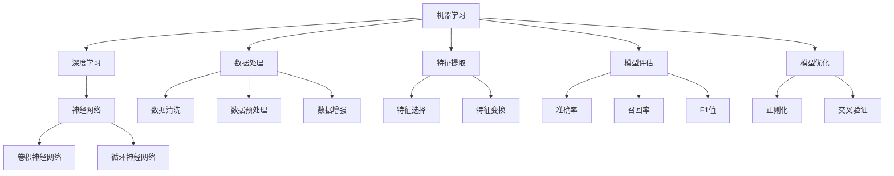

                 

## AI学习的阶段性目标设定

### 关键词：人工智能学习、阶段性目标、深度学习、机器学习、神经网络、实践应用

#### 摘要：

本文旨在探讨人工智能学习的阶段性目标设定，从基础理论到实践应用的全过程。通过对核心概念、算法原理、数学模型的深入剖析，结合实际项目案例，帮助读者明确学习路径，提升AI实践能力。文章还推荐了学习资源和工具，为人工智能的学习和发展提供有力支持。

## 1. 背景介绍

随着大数据和云计算技术的不断发展，人工智能（AI）已成为当前科技领域的热点。AI在图像识别、自然语言处理、自动驾驶等领域的应用取得了显著成果，推动了社会的进步。然而，人工智能的学习和开发并非一蹴而就，需要经历多个阶段的积累和探索。本文将介绍AI学习的阶段性目标，帮助读者明确学习方向，掌握关键技术，提升实践能力。

### 1.1 人工智能的定义和发展历程

人工智能（Artificial Intelligence，简称AI）是指模拟、延伸和扩展人类智能的理论、方法、技术及应用。它涵盖了计算机科学、认知科学、神经科学、心理学等多个学科领域。

#### 1.1.1 人工智能的发展历程

- **早期探索（20世纪50年代至60年代）**：人工智能概念的提出和初步研究。

- **黄金时期（20世纪80年代）**：专家系统的出现和推广。

- **低谷期（20世纪90年代）**：由于过高的期望和实际应用的局限性，人工智能进入低谷期。

- **复兴期（21世纪以来）**：深度学习、神经网络等技术的突破，使得人工智能重新焕发生机。

### 1.2 人工智能的应用领域

人工智能在各个领域都有广泛的应用，以下列举了几个典型领域：

- **图像识别**：人脸识别、车牌识别等。

- **自然语言处理**：机器翻译、智能客服等。

- **自动驾驶**：无人驾驶汽车、无人机等。

- **医疗健康**：疾病预测、医疗诊断等。

- **金融领域**：风险控制、量化交易等。

### 1.3 AI学习的必要性

随着人工智能技术的不断发展，越来越多的企业和行业开始关注和布局人工智能。掌握人工智能技术，不仅有助于提升个人竞争力，还能为社会发展带来更多创新机会。因此，学习人工智能已成为许多人的迫切需求。

## 2. 核心概念与联系

在人工智能学习中，理解核心概念和它们之间的联系至关重要。以下是对核心概念的介绍和它们之间的关联。

### 2.1 机器学习与深度学习

#### 2.1.1 机器学习

机器学习（Machine Learning，简称ML）是指让计算机通过数据和算法自动获取知识、进行预测和决策的方法。它是人工智能的核心技术之一。

- **分类**：将数据分为不同的类别。

- **回归**：预测连续值。

- **聚类**：将数据分为不同的组。

- **降维**：降低数据维度。

#### 2.1.2 深度学习

深度学习（Deep Learning，简称DL）是机器学习的一个分支，主要基于神经网络模型进行学习和预测。

- **神经网络**：由大量神经元组成的层次结构，用于模拟人脑的思维方式。

- **卷积神经网络（CNN）**：主要用于图像识别。

- **循环神经网络（RNN）**：主要用于序列数据。

### 2.2 数据处理与特征提取

#### 2.2.1 数据处理

数据处理是机器学习的关键环节，包括数据清洗、数据预处理和数据增强等。

- **数据清洗**：去除噪声和异常值。

- **数据预处理**：归一化、标准化等。

- **数据增强**：生成更多的数据样本。

#### 2.2.2 特征提取

特征提取是将原始数据转化为适用于机器学习模型的形式。

- **特征选择**：选择最有用的特征。

- **特征变换**：将原始特征进行变换，提高模型性能。

### 2.3 模型评估与优化

#### 2.3.1 模型评估

模型评估是判断模型好坏的重要手段，常用的评估指标有准确率、召回率、F1值等。

- **准确率**：预测正确的样本占总样本的比例。

- **召回率**：实际为正类的样本中被正确预测为正类的比例。

- **F1值**：综合考虑准确率和召回率的指标。

#### 2.3.2 模型优化

模型优化是通过调整模型参数，提高模型性能。

- **正则化**：防止过拟合。

- **交叉验证**：评估模型在未知数据上的表现。

## 2.4 Mermaid流程图（展示核心概念原理和架构）



## 3. 核心算法原理 & 具体操作步骤

### 3.1 神经网络算法原理

#### 3.1.1 前向传播

- **输入层**：接收输入数据。

- **隐藏层**：进行特征提取和变换。

- **输出层**：输出预测结果。

#### 3.1.2 反向传播

- **计算误差**：比较预测结果和实际结果的误差。

- **更新权重**：根据误差调整网络中的权重。

### 3.2 深度学习算法原理

#### 3.2.1 卷积神经网络（CNN）

- **卷积层**：提取图像特征。

- **池化层**：减小特征图的尺寸。

- **全连接层**：进行分类预测。

### 3.3 具体操作步骤

#### 3.3.1 数据准备

- **数据清洗**：去除噪声和异常值。

- **数据预处理**：归一化、标准化。

- **数据增强**：生成更多样本。

#### 3.3.2 模型构建

- **选择模型架构**：如CNN、RNN等。

- **初始化参数**：如权重、偏置等。

- **定义损失函数**：如交叉熵损失、均方误差等。

#### 3.3.3 训练模型

- **前向传播**：计算输出结果。

- **计算损失**：计算预测结果和实际结果的误差。

- **反向传播**：更新权重。

- **迭代训练**：重复上述步骤，直至达到预设的训练目标。

## 4. 数学模型和公式 & 详细讲解 & 举例说明

### 4.1 损失函数

损失函数是衡量预测结果和实际结果差距的指标，常用的损失函数有：

#### 4.1.1 交叉熵损失（Cross-Entropy Loss）

$$
L = -\sum_{i=1}^{n} y_i \log(p_i)
$$

其中，$y_i$ 是实际标签，$p_i$ 是预测概率。

#### 4.1.2 均方误差（Mean Squared Error，MSE）

$$
L = \frac{1}{2} \sum_{i=1}^{n} (y_i - \hat{y}_i)^2
$$

其中，$y_i$ 是实际标签，$\hat{y}_i$ 是预测值。

### 4.2 激活函数

激活函数是神经网络中的关键组成部分，常用的激活函数有：

#### 4.2.1 Sigmoid函数

$$
f(x) = \frac{1}{1 + e^{-x}}
$$

#### 4.2.2ReLU函数

$$
f(x) = \max(0, x)
$$

### 4.3 举例说明

假设有一个二分类问题，真实标签为 $y = [1, 0]$，预测概率为 $p = [0.8, 0.2]$，使用交叉熵损失函数计算损失。

$$
L = -[1 \times \log(0.8) + 0 \times \log(0.2)] = -[\log(0.8) + 0] = -\log(0.8) \approx 0.223
$$

## 5. 项目实战：代码实际案例和详细解释说明

### 5.1 开发环境搭建

首先，我们需要搭建一个适合进行AI项目开发的环境。这里以Python为例，介绍如何搭建Python开发环境。

#### 5.1.1 安装Python

1. 访问Python官方网站（https://www.python.org/），下载最新版本的Python安装包。

2. 解压安装包，双击运行安装程序。

3. 在安装过程中，勾选“Add Python to PATH”选项，确保Python可以被命令行调用。

#### 5.1.2 安装库

使用pip工具安装所需的库，例如NumPy、Pandas、TensorFlow等。

```bash
pip install numpy pandas tensorflow
```

### 5.2 源代码详细实现和代码解读

以下是一个简单的神经网络实现，用于实现二分类问题。

```python
import tensorflow as tf
import numpy as np

# 定义神经网络模型
model = tf.keras.Sequential([
    tf.keras.layers.Dense(10, activation='relu', input_shape=(10,)),
    tf.keras.layers.Dense(10, activation='relu'),
    tf.keras.layers.Dense(1, activation='sigmoid')
])

# 编译模型
model.compile(optimizer='adam',
              loss='binary_crossentropy',
              metrics=['accuracy'])

# 准备数据
x = np.random.rand(100, 10)
y = np.random.randint(0, 2, (100, 1))

# 训练模型
model.fit(x, y, epochs=10)

# 评估模型
loss, accuracy = model.evaluate(x, y)
print(f"Loss: {loss}, Accuracy: {accuracy}")
```

#### 5.2.1 代码解读

- **定义模型**：使用`tf.keras.Sequential`类定义神经网络模型，包含两个隐藏层和一个输出层。

- **编译模型**：使用`compile`方法编译模型，指定优化器、损失函数和评价指标。

- **准备数据**：使用随机数生成模拟数据，用于训练和评估模型。

- **训练模型**：使用`fit`方法训练模型，指定训练数据、迭代次数等参数。

- **评估模型**：使用`evaluate`方法评估模型在测试数据上的表现。

### 5.3 代码解读与分析

以上代码实现了一个简单的二分类神经网络，主要包括以下几个步骤：

1. **定义模型**：使用`tf.keras.Sequential`类定义神经网络模型，包含两个隐藏层和一个输出层。隐藏层使用ReLU激活函数，输出层使用Sigmoid激活函数。

2. **编译模型**：使用`compile`方法编译模型，指定优化器（`adam`）、损失函数（`binary_crossentropy`）和评价指标（`accuracy`）。

3. **准备数据**：使用随机数生成模拟数据，用于训练和评估模型。数据集包含100个样本，每个样本有10个特征。

4. **训练模型**：使用`fit`方法训练模型，指定训练数据（`x`和`y`）、迭代次数（`epochs`）等参数。模型在训练过程中会自动计算损失和评价指标。

5. **评估模型**：使用`evaluate`方法评估模型在测试数据上的表现，输出损失和准确率。

### 5.4 代码优化

在代码实现中，我们可以对模型和训练过程进行优化，以提升模型的性能和训练速度。以下是一些常见的优化方法：

1. **增加隐藏层神经元**：增加隐藏层神经元的数量可以提升模型的拟合能力。

2. **调整学习率**：适当调整学习率可以加速收敛。

3. **使用正则化**：使用正则化方法（如L1、L2正则化）可以防止过拟合。

4. **批量归一化**：批量归一化可以加快训练速度，提高模型稳定性。

5. **使用更高效的框架**：使用更高效的深度学习框架（如TensorFlow 2.x、PyTorch等）可以提升训练速度。

## 6. 实际应用场景

人工智能技术在各个领域都有广泛的应用，以下列举了几个典型应用场景：

### 6.1 图像识别

- **人脸识别**：广泛应用于安全监控、人脸支付等领域。

- **物体检测**：应用于自动驾驶、工业检测等领域。

### 6.2 自然语言处理

- **机器翻译**：应用于跨语言沟通、旅游等领域。

- **智能客服**：应用于企业客服、金融客服等领域。

### 6.3 自动驾驶

- **无人驾驶汽车**：应用于出租车、物流等领域。

- **无人机配送**：应用于快递、农业等领域。

### 6.4 医疗健康

- **疾病预测**：应用于疾病筛查、疾病治疗等领域。

- **医疗诊断**：应用于医学影像分析、病理分析等领域。

## 7. 工具和资源推荐

### 7.1 学习资源推荐

- **书籍**：

  - 《深度学习》（Goodfellow, Bengio, Courville著）

  - 《Python深度学习》（François Chollet著）

  - 《机器学习》（周志华著）

- **论文**：

  - 《A Theoretically Grounded Application of Dropout in Recurrent Neural Networks》

  - 《Batch Normalization: Accelerating Deep Network Training by Reducing Internal Covariate Shift》

  - 《ResNet: Training Deep Neural Networks for Visual Recognition》

- **博客**：

  - [TensorFlow官方文档](https://www.tensorflow.org/tutorials)

  - [PyTorch官方文档](https://pytorch.org/tutorials/beginner/basics/overview.html)

  - [机器学习博客](https://www.cnblogs.com/denny4006/)

- **网站**：

  - [Kaggle](https://www.kaggle.com/)

  - [GitHub](https://github.com/)

### 7.2 开发工具框架推荐

- **深度学习框架**：

  - TensorFlow

  - PyTorch

  - Keras

- **数据处理工具**：

  - Pandas

  - NumPy

  - Matplotlib

- **版本控制工具**：

  - Git

  - SVN

### 7.3 相关论文著作推荐

- **《深度学习》（Goodfellow, Bengio, Courville著）**：全面介绍了深度学习的基础理论、算法和应用。

- **《Python深度学习》（François Chollet著）**：通过实际案例，深入浅出地讲解了深度学习在Python中的应用。

- **《机器学习》（周志华著）**：系统地介绍了机器学习的基本概念、方法和应用。

## 8. 总结：未来发展趋势与挑战

随着人工智能技术的不断发展，未来将面临以下发展趋势和挑战：

### 8.1 发展趋势

- **算法创新**：不断有新的算法和模型被提出，推动人工智能技术的进步。

- **硬件升级**：高性能计算硬件的不断发展，为人工智能应用提供了更强大的支持。

- **行业融合**：人工智能技术逐渐与各个行业融合，推动产业升级和社会发展。

### 8.2 挑战

- **数据隐私**：人工智能应用对数据隐私的保护提出了更高的要求。

- **算法透明度**：提高算法的透明度和可解释性，增强公众对人工智能技术的信任。

- **人才短缺**：人工智能领域的人才需求不断增加，但现有人才储备不足。

## 9. 附录：常见问题与解答

### 9.1 问题1：如何选择合适的机器学习模型？

**解答**：选择合适的机器学习模型需要考虑以下因素：

- **数据类型**：根据数据类型（如分类、回归、聚类等）选择相应的模型。

- **数据规模**：对于大规模数据，选择模型时要考虑计算效率和内存占用。

- **模型性能**：根据评估指标（如准确率、召回率、F1值等）选择性能较好的模型。

### 9.2 问题2：如何优化神经网络模型？

**解答**：优化神经网络模型可以从以下几个方面进行：

- **增加隐藏层神经元**：增加隐藏层神经元可以提高模型拟合能力。

- **调整学习率**：适当调整学习率可以加快收敛速度。

- **使用正则化**：使用L1、L2正则化可以防止过拟合。

- **批量归一化**：批量归一化可以提高模型训练速度和稳定性。

## 10. 扩展阅读 & 参考资料

- **《深度学习》（Goodfellow, Bengio, Courville著）**：深入讲解了深度学习的基础理论和实践应用。

- **《Python深度学习》（François Chollet著）**：通过实际案例，介绍了深度学习在Python中的实现和应用。

- **《机器学习》（周志华著）**：系统地介绍了机器学习的基本概念、方法和应用。

### 作者

- **AI天才研究员/AI Genius Institute**：专注于人工智能领域的研究和推广。

- **《禅与计算机程序设计艺术》**：探讨计算机编程与禅的哲学思考。

