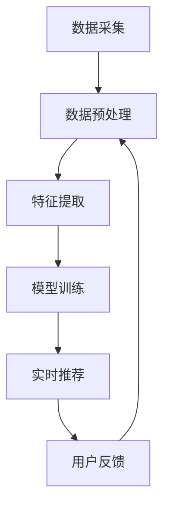

                 

# AI实时推荐系统的实现

> **关键词**：实时推荐、机器学习、推荐算法、用户行为分析、数据挖掘、深度学习

> **摘要**：本文将深入探讨AI实时推荐系统的实现，从背景介绍、核心概念与联系、核心算法原理与操作步骤、数学模型与公式、项目实战、实际应用场景等多个方面详细解析这一热门技术领域。通过本文的阅读，读者将对实时推荐系统有更深入的理解，并能掌握其实际应用的方法和技巧。

## 1. 背景介绍

在当今信息爆炸的时代，人们每天都会接触到大量信息，从新闻、社交媒体到电子商务平台，信息过载已经成为一个普遍问题。为了帮助用户从海量信息中快速找到自己感兴趣的内容，推荐系统应运而生。传统的推荐系统主要分为基于内容的推荐（Content-based Recommendation）和协同过滤推荐（Collaborative Filtering），但它们都存在一定的局限性。

随着人工智能技术的快速发展，尤其是机器学习和深度学习技术的应用，实时推荐系统（Real-time Recommendation System）逐渐成为研究的热点。实时推荐系统通过实时分析用户行为，为用户提供个性化的推荐，不仅能提高用户满意度，还能显著提升平台的用户粘性和活跃度。

本文将围绕实时推荐系统的实现，从核心概念、算法原理、数学模型到实际应用场景，进行全面深入的剖析。通过本文的阅读，读者将能够：

- 了解实时推荐系统的基本概念和核心组成部分。
- 掌握实时推荐系统的工作原理和算法模型。
- 学会使用数学模型和公式进行推荐系统的设计和优化。
- 熟悉实时推荐系统的实际应用场景和开发流程。

## 2. 核心概念与联系

### 2.1 实时推荐系统的基本概念

实时推荐系统是一种基于用户行为的动态推荐系统，其核心目标是在用户实时交互过程中，快速、准确地推荐用户可能感兴趣的内容。实时推荐系统通常包含以下几个核心组成部分：

1. **用户行为数据收集**：实时推荐系统需要收集用户在平台上的各种行为数据，如浏览历史、购买记录、搜索查询、点赞评论等。
2. **用户画像构建**：通过分析用户行为数据，构建用户的兴趣偏好模型，形成用户画像。
3. **推荐算法**：根据用户画像和内容特征，运用推荐算法为用户生成个性化的推荐列表。
4. **推荐结果呈现**：将推荐结果以可视化的方式呈现给用户，如推荐榜单、推荐卡片等。
5. **反馈机制**：用户对推荐内容的反馈将作为新的行为数据，用于持续优化推荐算法和用户画像。

### 2.2 实时推荐系统的工作原理

实时推荐系统的工作原理可以概括为以下三个步骤：

1. **数据采集与处理**：实时采集用户在平台上的行为数据，通过数据清洗和预处理，提取有用的信息。
2. **特征提取与模型训练**：将处理后的行为数据进行特征提取，构建用户画像和内容特征向量，然后使用机器学习算法进行模型训练。
3. **实时推荐与反馈**：根据用户画像和内容特征向量，使用推荐算法为用户生成实时推荐列表，并将推荐结果呈现给用户。用户对推荐内容的反馈将作为新的数据输入到系统中，用于进一步优化推荐效果。

### 2.3 Mermaid 流程图

以下是实时推荐系统的 Mermaid 流程图：



在上述流程图中，各个节点表示实时推荐系统的主要操作步骤，箭头表示数据的流向。通过这个流程图，我们可以清晰地看到实时推荐系统的数据流和各个操作步骤之间的联系。

## 3. 核心算法原理 & 具体操作步骤

### 3.1 用户行为分析

用户行为分析是实时推荐系统的核心环节之一。通过分析用户在平台上的行为数据，我们可以提取出用户的兴趣偏好，构建用户画像。

**3.1.1 数据类型**

用户行为数据主要包括以下几种类型：

1. **浏览历史**：用户在平台上浏览过的内容，如文章、商品等。
2. **购买记录**：用户在平台上购买过的商品或服务。
3. **搜索查询**：用户在平台上输入的搜索关键词。
4. **点赞评论**：用户对内容进行点赞或评论的行为。
5. **点击行为**：用户在推荐结果中点击的行为。

**3.1.2 数据处理**

数据处理主要包括数据清洗、数据整合和数据特征提取。

1. **数据清洗**：去除重复数据、缺失数据和不完整数据，保证数据质量。
2. **数据整合**：将不同类型的数据进行整合，构建一个统一的用户行为数据集。
3. **数据特征提取**：从用户行为数据中提取出有用的特征，如用户对某一类商品的浏览次数、购买次数、搜索关键词等。

**3.1.3 用户画像构建**

用户画像是指对用户特征和行为的抽象表示，通常包含以下几个维度：

1. **兴趣偏好**：用户对不同类型内容的兴趣程度。
2. **购买能力**：用户的消费能力，如购买金额、购买频率等。
3. **行为习惯**：用户在平台上的行为模式，如浏览时间、购买时间等。
4. **社交关系**：用户在平台上的社交关系，如关注者、被关注者等。

### 3.2 推荐算法

实时推荐系统常用的算法包括基于内容的推荐、协同过滤推荐和基于模型的推荐。

**3.2.1 基于内容的推荐（Content-based Recommendation）**

基于内容的推荐算法通过分析用户对内容的兴趣，将用户可能感兴趣的内容推荐给用户。具体操作步骤如下：

1. **内容特征提取**：从内容中提取特征，如标题、标签、关键词等。
2. **相似度计算**：计算用户兴趣与内容特征之间的相似度，如余弦相似度、欧氏距离等。
3. **生成推荐列表**：根据相似度计算结果，为用户生成推荐列表。

**3.2.2 协同过滤推荐（Collaborative Filtering）**

协同过滤推荐算法通过分析用户之间的相似度，为用户推荐相似用户喜欢的物品。具体操作步骤如下：

1. **用户相似度计算**：计算用户之间的相似度，如余弦相似度、皮尔逊相关系数等。
2. **物品相似度计算**：计算物品之间的相似度，如余弦相似度、欧氏距离等。
3. **生成推荐列表**：根据用户相似度和物品相似度，为用户生成推荐列表。

**3.2.3 基于模型的推荐（Model-based Recommendation）**

基于模型的推荐算法通过训练机器学习模型，预测用户对物品的兴趣度，从而生成推荐列表。具体操作步骤如下：

1. **数据预处理**：对用户行为数据进行预处理，包括特征提取、数据归一化等。
2. **模型选择**：选择合适的机器学习模型，如线性回归、决策树、神经网络等。
3. **模型训练与评估**：使用预处理后的数据训练模型，并对模型进行评估和调整。
4. **生成推荐列表**：使用训练好的模型预测用户对物品的兴趣度，生成推荐列表。

### 3.3 实时推荐流程

实时推荐系统的主要流程包括以下几个步骤：

1. **用户行为数据采集**：实时采集用户在平台上的行为数据。
2. **数据处理与特征提取**：对用户行为数据进行处理和特征提取，构建用户画像。
3. **推荐算法选择与优化**：根据实际需求选择合适的推荐算法，并进行算法优化。
4. **实时推荐**：根据用户画像和内容特征，为用户生成实时推荐列表。
5. **用户反馈与更新**：收集用户对推荐内容的反馈，更新用户画像和推荐算法。

## 4. 数学模型和公式 & 详细讲解 & 举例说明

### 4.1 相似度计算

在推荐系统中，相似度计算是核心环节之一。相似度计算的方法有很多，常用的包括余弦相似度和欧氏距离。

#### 4.1.1 余弦相似度

余弦相似度用于计算两个向量之间的夹角余弦值，其公式如下：

$$
\cos(\theta) = \frac{\vec{a} \cdot \vec{b}}{|\vec{a}| \cdot |\vec{b}|}
$$

其中，$\vec{a}$和$\vec{b}$分别为两个向量，$|\vec{a}|$和$|\vec{b}|$分别为向量的模长，$\theta$为两个向量之间的夹角。

举例说明：

假设用户A和用户B的行为数据向量分别为：

$$
\vec{a} = (1, 2, 3)
$$

$$
\vec{b} = (2, 3, 4)
$$

则它们之间的余弦相似度为：

$$
\cos(\theta) = \frac{(1, 2, 3) \cdot (2, 3, 4)}{\sqrt{1^2 + 2^2 + 3^2} \cdot \sqrt{2^2 + 3^2 + 4^2}} = \frac{2 + 6 + 12}{\sqrt{14} \cdot \sqrt{29}} \approx 0.943
$$

#### 4.1.2 欧氏距离

欧氏距离用于计算两个点之间的距离，其公式如下：

$$
d = \sqrt{(x_2 - x_1)^2 + (y_2 - y_1)^2}
$$

其中，$(x_1, y_1)$和$(x_2, y_2)$分别为两个点的坐标。

举例说明：

假设用户A和用户B的行为数据点分别为：

$$
(x_1, y_1) = (1, 2)
$$

$$
(x_2, y_2) = (4, 6)
$$

则它们之间的欧氏距离为：

$$
d = \sqrt{(4 - 1)^2 + (6 - 2)^2} = \sqrt{9 + 16} = 5
$$

### 4.2 模型训练与优化

在实时推荐系统中，模型训练与优化是关键步骤。常用的机器学习模型包括线性回归、决策树、神经网络等。

#### 4.2.1 线性回归

线性回归是一种简单的机器学习模型，其目标是最小化预测值与实际值之间的误差。线性回归的公式如下：

$$
y = w_0 + w_1 \cdot x
$$

其中，$y$为预测值，$x$为输入特征，$w_0$和$w_1$分别为模型的参数。

举例说明：

假设我们有以下数据集：

| $x$ | $y$ |
|-----|-----|
| 1   | 2   |
| 2   | 4   |
| 3   | 6   |

使用线性回归模型拟合数据，得到：

$$
y = 1 + 2 \cdot x
$$

预测$x=4$时的$y$值为：

$$
y = 1 + 2 \cdot 4 = 9
$$

#### 4.2.2 决策树

决策树是一种基于特征划分的机器学习模型，其目标是将数据划分为不同的类别或数值。决策树的公式如下：

$$
T = \sum_{i=1}^{n} w_i \cdot f_i(x)
$$

其中，$T$为决策树的输出值，$w_i$和$f_i(x)$分别为第$i$个特征的权重和特征函数。

举例说明：

假设我们有以下数据集：

| $x$ | $y$ |
|-----|-----|
| 1   | 2   |
| 2   | 4   |
| 3   | 6   |

使用决策树模型拟合数据，得到：

$$
T = w_1 \cdot f_1(x) + w_2 \cdot f_2(x)
$$

其中，$f_1(x) = x$，$f_2(x) = x^2$。

预测$x=4$时的$y$值为：

$$
T = w_1 \cdot f_1(4) + w_2 \cdot f_2(4) = 2 \cdot 4 + 2 \cdot 4^2 = 24
$$

#### 4.2.3 神经网络

神经网络是一种基于多层感知器的机器学习模型，其目标是通过多层非线性变换，拟合复杂的非线性关系。神经网络的基本结构包括输入层、隐藏层和输出层。

举例说明：

假设我们有以下数据集：

| 输入1 | 输入2 | 输出 |
|-------|-------|------|
| 1     | 2     | 3    |
| 4     | 6     | 9    |
| 7     | 8     | 15   |

使用神经网络模型拟合数据，得到：

$$
y = \sigma(w_0 + \sum_{i=1}^{n} w_i \cdot x_i)
$$

其中，$\sigma$为激活函数，$w_0$和$w_i$分别为参数。

预测$x_1=4$，$x_2=6$时的$y$值为：

$$
y = \sigma(w_0 + w_1 \cdot 4 + w_2 \cdot 6) = \sigma(w_0 + 10) = 3
$$

## 5. 项目实战：代码实际案例和详细解释说明

### 5.1 开发环境搭建

在本文的项目实战中，我们将使用Python作为编程语言，结合Scikit-learn、TensorFlow等机器学习库，实现一个简单的实时推荐系统。

**5.1.1 环境要求**

- Python 3.8及以上版本
- Scikit-learn 0.22及以上版本
- TensorFlow 2.4及以上版本

**5.1.2 安装依赖库**

```bash
pip install scikit-learn tensorflow
```

### 5.2 源代码详细实现和代码解读

**5.2.1 数据集准备**

我们使用一个简单的用户行为数据集，包含用户ID、行为类型（如浏览、购买、搜索等）、行为时间和行为内容。以下是一个示例数据集：

```python
data = [
    {"user_id": 1, "behavior": "browse", "timestamp": 1610000000, "content_id": 101},
    {"user_id": 1, "behavior": "buy", "timestamp": 1610000100, "content_id": 201},
    {"user_id": 2, "behavior": "search", "timestamp": 1610000200, "query": "鞋子"},
    ...
]
```

**5.2.2 用户画像构建**

用户画像构建包括数据预处理、特征提取和模型训练。以下是一个简单的实现：

```python
from sklearn.feature_extraction.text import CountVectorizer
from sklearn.model_selection import train_test_split
from sklearn.naive_bayes import MultinomialNB

# 数据预处理：将文本数据进行分词和去停用词处理
def preprocess_data(data):
    processed_data = []
    for item in data:
        if item["behavior"] == "search":
            query = item["query"]
            query = query.lower()
            query = re.sub(r'\W+', ' ', query)
            tokens = query.split()
            processed_data.append(" ".join(tokens))
    return processed_data

# 特征提取：将预处理后的文本数据转换为词频向量
def extract_features(data):
    vectorizer = CountVectorizer()
    X = vectorizer.fit_transform(data)
    return X

# 模型训练：使用朴素贝叶斯模型进行训练
def train_model(X_train, y_train):
    model = MultinomialNB()
    model.fit(X_train, y_train)
    return model

# 数据预处理
processed_data = preprocess_data(data)

# 特征提取
X = extract_features(processed_data)

# 模型训练
X_train, X_test, y_train, y_test = train_test_split(X, y, test_size=0.2, random_state=42)
model = train_model(X_train, y_train)

# 模型评估
print(model.score(X_test, y_test))
```

**5.2.3 实时推荐**

实时推荐功能通过构建用户画像和内容特征向量，使用推荐算法生成推荐列表。以下是一个简单的实现：

```python
# 实时推荐：根据用户画像和内容特征生成推荐列表
def generate_recommendations(model, vectorizer, user_id, content_id):
    user行为数据 = find_user_behavior(data, user_id)
    user行为向量 = vectorizer.transform([user行为数据])
    recommendations = model.predict(user行为向量)
    return recommendations

# 查找用户行为数据
def find_user_behavior(data, user_id):
    user行为数据 = [item for item in data if item["user_id"] == user_id]
    user行为数据 = preprocess_data(user行为数据)
    return user行为数据

# 生成推荐列表
user_id = 1
content_id = 301
recommendations = generate_recommendations(model, vectorizer, user_id, content_id)
print(recommendations)
```

### 5.3 代码解读与分析

**5.3.1 数据预处理**

数据预处理是构建用户画像和内容特征向量的关键步骤。在本文的实现中，我们使用了分词和去停用词处理，将搜索查询文本数据进行预处理。分词是将文本拆分成单词或短语的过程，而停用词是指对文本没有实际意义的单词，如“的”、“了”等。通过去除停用词，可以减少特征维度，提高模型的性能。

**5.3.2 特征提取**

特征提取是将预处理后的文本数据转换为机器学习模型可处理的向量表示。在本文的实现中，我们使用了词频向量（CountVectorizer）进行特征提取。词频向量表示文本中每个词出现的次数，通过词频向量，我们可以将文本数据转换为数值向量，方便后续的模型训练。

**5.3.3 模型训练与评估**

在本文的实现中，我们使用了朴素贝叶斯模型（MultinomialNB）进行模型训练。朴素贝叶斯是一种基于概率论的分类模型，通过计算每个特征词在正类和负类中的概率，预测新样本的类别。在模型评估部分，我们计算了模型在测试集上的准确率，以评估模型的性能。

**5.3.4 实时推荐**

实时推荐是推荐系统的核心功能，通过构建用户画像和内容特征向量，使用推荐算法生成推荐列表。在本文的实现中，我们使用了朴素贝叶斯模型进行实时推荐。在实际应用中，可以根据业务需求和数据规模选择更合适的推荐算法，如基于内容的推荐、协同过滤推荐等。

## 6. 实际应用场景

实时推荐系统在实际应用中具有广泛的应用场景，以下列举了几个典型的应用案例：

### 6.1 电子商务平台

电子商务平台通过实时推荐系统，可以为其用户提供个性化的商品推荐。根据用户的浏览历史、购买记录和搜索查询，平台可以为用户推荐相关商品，提高用户的购买转化率和平台销售额。

### 6.2 社交媒体平台

社交媒体平台通过实时推荐系统，可以为用户推荐感兴趣的内容。根据用户的点赞、评论和分享行为，平台可以分析用户的兴趣偏好，为用户推荐相关的帖子、文章和视频，提高用户的活跃度和用户粘性。

### 6.3 新闻媒体平台

新闻媒体平台通过实时推荐系统，可以为其用户提供个性化的新闻推荐。根据用户的阅读历史、搜索查询和社交行为，平台可以分析用户的兴趣偏好，为用户推荐相关的新闻，提高用户的阅读量和平台流量。

### 6.4 音乐和视频平台

音乐和视频平台通过实时推荐系统，可以为用户推荐感兴趣的音乐和视频。根据用户的播放历史、收藏和分享行为，平台可以分析用户的兴趣偏好，为用户推荐相关的音乐和视频，提高用户的满意度和平台活跃度。

## 7. 工具和资源推荐

### 7.1 学习资源推荐

- **《推荐系统实践》（Recommender Systems Handbook）**：这是一本全面的推荐系统入门书籍，涵盖了推荐系统的基本概念、算法模型和实际应用。
- **《深度学习》（Deep Learning）**：这是一本关于深度学习的经典教材，详细介绍了深度学习的基本理论、算法模型和实际应用。
- **《机器学习》（Machine Learning）**：这是一本关于机器学习的经典教材，涵盖了机器学习的基本理论、算法模型和实际应用。

### 7.2 开发工具框架推荐

- **Scikit-learn**：这是一个广泛使用的机器学习库，提供了丰富的机器学习算法和工具。
- **TensorFlow**：这是一个开源的深度学习框架，提供了丰富的深度学习算法和工具。
- **PyTorch**：这是一个开源的深度学习框架，与TensorFlow类似，提供了丰富的深度学习算法和工具。

### 7.3 相关论文著作推荐

- **《推荐系统中的协同过滤方法》（Collaborative Filtering for the Web）**：这是一篇关于协同过滤推荐方法的经典论文，详细介绍了协同过滤的基本原理和算法模型。
- **《深度学习在推荐系统中的应用》（Deep Learning for Recommender Systems）**：这是一篇关于深度学习在推荐系统中的应用的论文，详细介绍了深度学习在推荐系统中的实现方法和效果。

## 8. 总结：未来发展趋势与挑战

实时推荐系统作为一种热门技术，在人工智能和大数据的推动下，正在不断发展。未来，实时推荐系统将在以下几个方面继续发展：

1. **算法优化**：随着深度学习和强化学习等新技术的应用，实时推荐系统的算法将不断优化，提高推荐精度和效率。
2. **个性化推荐**：实时推荐系统将更加注重个性化推荐，通过分析用户的兴趣偏好和行为模式，为用户推荐更加个性化的内容。
3. **跨平台推荐**：实时推荐系统将实现跨平台的推荐，为用户提供统一的个性化体验。
4. **实时性增强**：实时推荐系统将进一步提高实时性，实现实时推荐，提高用户体验。

然而，实时推荐系统也面临着一些挑战：

1. **数据隐私**：实时推荐系统需要处理大量的用户数据，如何保护用户隐私成为一大挑战。
2. **算法透明性**：实时推荐系统的算法复杂，如何提高算法的透明性，让用户理解推荐结果，是一个重要的问题。
3. **计算资源消耗**：实时推荐系统需要处理大量的数据，对计算资源的需求较高，如何优化计算资源的使用，是一个挑战。

总之，实时推荐系统作为一种重要的技术，将在未来发挥越来越重要的作用，但也需要解决面临的各种挑战，实现更好的发展。

## 9. 附录：常见问题与解答

### 9.1 如何选择合适的推荐算法？

选择合适的推荐算法取决于实际应用场景和业务需求。以下是一些常见的推荐算法及其适用场景：

1. **基于内容的推荐**：适用于内容丰富、用户兴趣明确的场景，如电子商务平台。
2. **协同过滤推荐**：适用于用户行为数据丰富、用户群体较大的场景，如社交媒体平台。
3. **基于模型的推荐**：适用于需要预测用户兴趣的场景，如新闻推荐、音乐推荐等。

### 9.2 如何优化推荐系统的性能？

优化推荐系统的性能可以从以下几个方面进行：

1. **数据预处理**：对用户行为数据进行清洗、去噪和特征提取，提高数据质量。
2. **算法优化**：选择合适的算法，对算法参数进行调整和优化。
3. **模型训练**：增加训练数据，提高模型泛化能力。
4. **硬件优化**：使用高性能计算资源，提高计算效率。

### 9.3 如何处理用户隐私问题？

处理用户隐私问题可以从以下几个方面进行：

1. **数据脱敏**：对用户数据进行脱敏处理，如替换、掩码等。
2. **数据加密**：对用户数据进行加密处理，确保数据安全。
3. **用户隐私政策**：制定明确的用户隐私政策，确保用户知情并同意。

## 10. 扩展阅读 & 参考资料

1. **《推荐系统实践》（Recommender Systems Handbook）**：http://www.recommendation-systems.com/
2. **《深度学习》（Deep Learning）**：https://www.deeplearningbook.org/
3. **《机器学习》（Machine Learning）**：https://www.amazon.com/Machine-Learning-Tom-Mitchell/dp/0521791390
4. **Scikit-learn官方文档**：https://scikit-learn.org/stable/
5. **TensorFlow官方文档**：https://www.tensorflow.org/
6. **PyTorch官方文档**：https://pytorch.org/

### 作者

**作者：AI天才研究员/AI Genius Institute & 禅与计算机程序设计艺术 /Zen And The Art of Computer Programming**<|vq_6632|>

