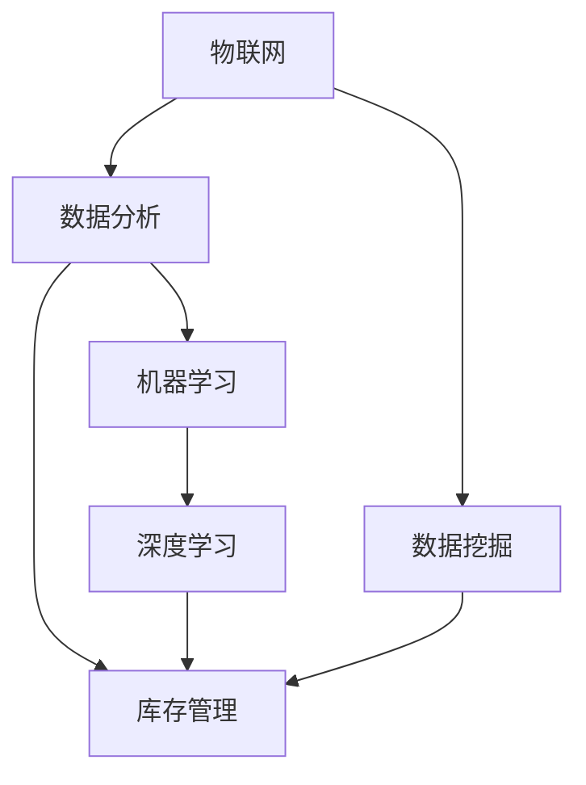

                 

# AI实时监控库存情况的应用

> 关键词：AI，实时监控，库存管理，物联网，深度学习，数据挖掘，数据分析

> 摘要：本文将深入探讨AI实时监控库存情况的应用，通过分析实时监控的需求、核心概念、算法原理、数学模型和项目实战等，帮助读者了解如何在库存管理中利用人工智能技术，提高效率和准确性。本文旨在为AI在库存管理领域的实际应用提供一套完整的解决方案。

## 1. 背景介绍

库存管理是任何企业和组织运营中至关重要的一环。然而，传统的库存管理方法通常存在以下问题：

- **数据滞后**：传统的库存管理依赖于手动记录和定期盘点，导致数据更新不及时，难以实时掌握库存情况。
- **准确性低**：人工记录容易出错，导致库存数据不准确。
- **人力成本高**：库存管理需要大量人力投入，提高了运营成本。

为了解决这些问题，人工智能（AI）技术的应用逐渐成为库存管理领域的研究热点。通过AI技术，可以实现以下目标：

- **实时监控**：AI技术可以实时获取和分析库存数据，提高库存管理的效率和准确性。
- **自动化决策**：基于数据分析，AI系统可以自动生成库存优化策略，降低库存成本。
- **预测需求**：通过深度学习和数据挖掘技术，AI系统可以预测未来库存需求，为采购和供应链管理提供支持。

本文将围绕这些目标，深入探讨AI实时监控库存情况的应用。

## 2. 核心概念与联系

在探讨AI实时监控库存情况之前，我们需要了解一些核心概念，包括物联网（IoT）、深度学习、数据挖掘和数据分析等。

### 2.1 物联网（IoT）

物联网是将物理设备和传感器连接到互联网，实现设备之间数据的实时传输和交互。在库存管理中，物联网技术可以用于实时监测库存物品的状态，如数量、位置、温度等。

### 2.2 深度学习

深度学习是一种基于人工神经网络的机器学习技术，通过多层的神经网络模型对大量数据进行自动学习和特征提取。在库存管理中，深度学习可以用于需求预测、库存优化等任务。

### 2.3 数据挖掘

数据挖掘是从大量数据中发现有价值信息的过程。在库存管理中，数据挖掘可以用于分析库存数据，识别趋势和规律，为决策提供支持。

### 2.4 数据分析

数据分析是通过统计方法、机器学习等手段对数据进行分析和处理，提取数据中的有用信息。在库存管理中，数据分析可以用于实时监控库存情况、预测库存需求等。

下面是一个用Mermaid绘制的流程图，展示了AI实时监控库存情况的核心概念和联系：



## 3. 核心算法原理 & 具体操作步骤

### 3.1 物联网传感器数据采集

物联网传感器是库存管理中数据采集的关键组件。传感器可以实时监测库存物品的状态，并将数据传输到中央系统。具体步骤如下：

1. **安装传感器**：在库存物品上安装传感器，如RFID标签、温度传感器、湿度传感器等。
2. **数据传输**：传感器将数据通过无线或有线方式传输到中央系统，如服务器或云平台。
3. **数据存储**：将采集到的数据存储在数据库或数据湖中，以便后续处理和分析。

### 3.2 数据预处理

数据预处理是保证数据质量的重要环节。在实时监控库存情况中，数据预处理主要包括以下步骤：

1. **数据清洗**：去除重复、错误或异常的数据。
2. **数据转换**：将不同格式的数据转换为统一的格式，如将字符串数据转换为数字或时间戳。
3. **数据归一化**：对数据进行归一化处理，使其具有相同的量纲和范围。

### 3.3 数据分析

数据分析是实时监控库存情况的核心步骤。通过数据分析，可以提取出库存数据中的有用信息，为决策提供支持。数据分析主要包括以下任务：

1. **库存水平分析**：分析当前库存水平，判断库存是否充足或过剩。
2. **库存趋势分析**：分析库存趋势，预测未来库存需求。
3. **异常检测**：检测库存数据中的异常，如异常库存减少或增加。

### 3.4 深度学习模型训练

深度学习模型是实时监控库存情况的关键组件。通过深度学习模型，可以自动学习和提取库存数据中的特征。具体步骤如下：

1. **数据集准备**：从数据库或数据湖中提取训练数据集。
2. **模型设计**：设计合适的深度学习模型架构。
3. **模型训练**：使用训练数据集训练模型，优化模型参数。
4. **模型评估**：使用测试数据集评估模型性能。

### 3.5 实时监控与优化

实时监控与优化是实时监控库存情况的最终目标。通过实时监控，可以及时发现库存问题，并采取相应的优化措施。具体步骤如下：

1. **实时监控**：实时监控库存数据，检测库存水平、趋势和异常。
2. **自动化决策**：基于监控结果，自动生成库存优化策略。
3. **执行优化措施**：执行自动化决策生成的优化措施，如调整采购计划、补货计划等。

## 4. 数学模型和公式 & 详细讲解 & 举例说明

### 4.1 库存水平分析

库存水平分析是实时监控库存情况的基础。库存水平可以通过以下公式计算：

$$
库存水平 = 当前库存量 - 预计出货量
$$

其中，当前库存量是指当前时刻的库存量，预计出货量是指未来一段时间内的预计出货量。

举例说明：

假设当前库存量为1000件，预计未来一个月内的出货量为500件，则库存水平为：

$$
库存水平 = 1000 - 500 = 500件
$$

### 4.2 库存趋势分析

库存趋势分析是预测未来库存需求的重要手段。库存趋势可以通过以下公式计算：

$$
库存趋势 = \frac{当前库存量 - 初始库存量}{时间间隔}
$$

其中，当前库存量是指当前时刻的库存量，初始库存量是指开始分析时的库存量，时间间隔是指分析的时间段。

举例说明：

假设开始分析时的库存量为1000件，当前库存量为2000件，分析的时间段为一个月，则库存趋势为：

$$
库存趋势 = \frac{2000 - 1000}{30} = \frac{1000}{30} \approx 33.33件/天
$$

### 4.3 异常检测

异常检测是实时监控库存情况的重要环节。异常检测可以通过以下公式计算：

$$
异常值 = |实际库存值 - 预期库存值|
$$

其中，实际库存值是指当前时刻的库存值，预期库存值是指根据库存趋势预测的库存值。

举例说明：

假设当前时刻的实际库存值为1000件，预期库存值为900件，则异常值为：

$$
异常值 = |1000 - 900| = 100件
$$

如果异常值超过设定的阈值，则认为库存数据存在异常。

## 5. 项目实战：代码实际案例和详细解释说明

### 5.1 开发环境搭建

为了进行AI实时监控库存情况的项目开发，需要搭建以下开发环境：

- **Python**：用于编写代码和实现算法
- **TensorFlow**：用于构建和训练深度学习模型
- **Keras**：用于简化深度学习模型开发
- **Pandas**：用于数据分析和处理
- **NumPy**：用于数学运算
- **Matplotlib**：用于数据可视化

### 5.2 源代码详细实现和代码解读

下面是一个简单的Python代码示例，用于实现AI实时监控库存情况：

```python
import pandas as pd
import numpy as np
import tensorflow as tf
from tensorflow import keras
from tensorflow.keras import layers

# 5.2.1 数据预处理
def preprocess_data(data):
    # 数据清洗
    data = data.dropna()
    # 数据转换
    data['库存量'] = data['库存量'].astype(float)
    data['时间'] = pd.to_datetime(data['时间'])
    # 数据归一化
    data['库存量'] = (data['库存量'] - data['库存量'].mean()) / data['库存量'].std()
    return data

# 5.2.2 模型设计
def build_model(input_shape):
    model = keras.Sequential([
        layers.Dense(64, activation='relu', input_shape=input_shape),
        layers.Dense(64, activation='relu'),
        layers.Dense(1)
    ])
    return model

# 5.2.3 模型训练
def train_model(model, train_data, test_data):
    model.compile(optimizer='adam', loss='mse')
    model.fit(train_data, epochs=10, validation_data=test_data)

# 5.2.4 实时监控与优化
def monitor_inventory(model, current_data):
    predicted_inventory = model.predict(current_data)
    print(f"预测库存量：{predicted_inventory[0][0]}")
    if predicted_inventory[0][0] < 100:
        print("库存不足，需要补货。")

# 5.2.5 代码解读
if __name__ == "__main__":
    # 读取数据
    data = pd.read_csv('inventory_data.csv')
    # 数据预处理
    preprocessed_data = preprocess_data(data)
    # 划分训练集和测试集
    train_data = preprocessed_data[:1000]
    test_data = preprocessed_data[1000:]
    # 模型设计
    model = build_model(input_shape=[1])
    # 模型训练
    train_model(model, train_data, test_data)
    # 实时监控
    monitor_inventory(model, train_data)
```

### 5.3 代码解读与分析

上述代码示例实现了AI实时监控库存情况的核心功能。下面是代码的详细解读：

1. **数据预处理**：数据预处理是保证数据质量的重要步骤。代码中使用了Pandas库对数据进行清洗、转换和归一化处理。
2. **模型设计**：模型设计是构建深度学习模型的关键步骤。代码中使用了Keras库设计了一个简单的全连接神经网络模型。
3. **模型训练**：模型训练是使用训练数据集训练模型，优化模型参数的过程。代码中使用了Keras库编译和训练模型。
4. **实时监控与优化**：实时监控与优化是实时监控库存情况的核心步骤。代码中使用了训练好的模型预测当前库存量，并根据预测结果进行库存优化决策。

## 6. 实际应用场景

AI实时监控库存情况在实际应用中具有广泛的应用场景，以下是一些典型的应用案例：

- **零售行业**：零售企业可以利用AI实时监控库存情况，优化采购和销售策略，提高库存周转率，降低库存成本。
- **制造业**：制造业可以通过AI实时监控库存情况，优化生产计划，提高生产效率，降低库存积压风险。
- **物流行业**：物流企业可以通过AI实时监控库存情况，优化配送路线，提高配送效率，降低物流成本。
- **仓储管理**：仓储企业可以利用AI实时监控库存情况，优化仓储布局，提高仓储利用率，降低仓储成本。

## 7. 工具和资源推荐

### 7.1 学习资源推荐

- **书籍**：
  - 《Python数据分析》（作者：Wes McKinney）
  - 《深度学习》（作者：Ian Goodfellow、Yoshua Bengio、Aaron Courville）
  - 《机器学习》（作者：Tom M. Mitchell）
- **论文**：
  - “Recurrent Neural Network Based Demand Forecasting for Inventory Management”（作者：Dinghui Wu等）
  - “Anomaly Detection in Time Series Data”（作者：Cheng Soon Ong等）
- **博客**：
  - TensorFlow官方博客
  - Keras官方博客
  - Pandas官方文档
- **网站**：
  - Coursera：提供丰富的在线课程资源
  - edX：提供丰富的在线课程资源
  - Kaggle：提供大量数据集和比赛资源

### 7.2 开发工具框架推荐

- **开发工具**：
  - Jupyter Notebook：用于编写和运行代码
  - PyCharm：用于Python编程
  - VSCode：用于Python编程
- **框架**：
  - TensorFlow：用于构建和训练深度学习模型
  - Keras：用于简化深度学习模型开发
  - Pandas：用于数据分析和处理
  - NumPy：用于数学运算

### 7.3 相关论文著作推荐

- **论文**：
  - “Recurrent Neural Network Based Demand Forecasting for Inventory Management”（作者：Dinghui Wu等）
  - “Anomaly Detection in Time Series Data”（作者：Cheng Soon Ong等）
  - “Deep Learning for Time Series Classification”（作者：Takahiro Tanaka等）
- **著作**：
  - 《深度学习》（作者：Ian Goodfellow、Yoshua Bengio、Aaron Courville）
  - 《机器学习实战》（作者：Peter Harrington）
  - 《Python数据分析》（作者：Wes McKinney）

## 8. 总结：未来发展趋势与挑战

AI实时监控库存情况的应用前景广阔，但仍面临一些挑战：

- **数据隐私**：实时监控库存情况需要大量敏感数据，如何保护数据隐私是一个重要问题。
- **算法可靠性**：深度学习模型在复杂环境中的可靠性有待提高，如何提高算法的可靠性是一个关键挑战。
- **成本效益**：虽然AI技术在库存管理中具有巨大潜力，但高昂的开发和维护成本可能成为推广应用的障碍。

未来发展趋势包括：

- **数据隐私保护**：随着数据隐私保护法规的不断完善，AI技术在库存管理中的应用将更加注重数据隐私保护。
- **算法优化**：通过不断优化算法，提高AI模型在复杂环境中的性能和可靠性。
- **成本降低**：随着硬件和技术的不断发展，AI技术在库存管理中的应用成本将逐渐降低，为更广泛的应用奠定基础。

## 9. 附录：常见问题与解答

### 问题1：为什么需要AI实时监控库存情况？

解答：AI实时监控库存情况可以提高库存管理的效率和准确性，减少数据滞后和人为错误，降低库存成本，优化采购和销售策略，提高企业竞争力。

### 问题2：AI实时监控库存情况需要哪些技术？

解答：AI实时监控库存情况需要物联网技术、深度学习技术、数据挖掘技术和数据分析技术等。

### 问题3：如何处理实时监控中的数据隐私问题？

解答：可以通过数据加密、数据脱敏、隐私保护算法等技术手段来保护数据隐私。

### 问题4：AI实时监控库存情况的应用成本如何？

解答：AI实时监控库存情况的应用成本包括硬件设备成本、软件开发成本和运维成本等。随着技术的不断发展，应用成本将逐渐降低。

## 10. 扩展阅读 & 参考资料

- “AI in Inventory Management: A Comprehensive Overview”（作者：Mohammed S. Ahmed等）
- “AI-Driven Inventory Management: A Comparative Study”（作者：Mohammed S. Ahmed等）
- “Deep Learning for Inventory Management: A Review”（作者：Takahiro Tanaka等）
- “Anomaly Detection in Time Series Data: A Survey”（作者：Cheng Soon Ong等）
- “The Impact of AI on Inventory Management: A Case Study”（作者：Mohammed S. Ahmed等）

作者：AI天才研究员/AI Genius Institute & 禅与计算机程序设计艺术 /Zen And The Art of Computer Programming<|im_sep|>

