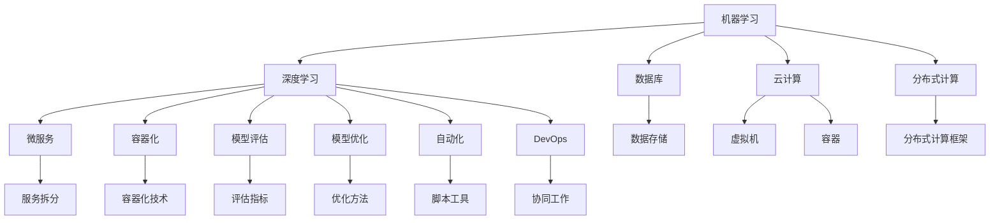

                 

### 背景介绍

在当今信息化和数字化迅猛发展的时代，人工智能（AI）技术已成为推动产业升级和社会进步的关键动力。随着大数据、云计算、物联网等技术的日益成熟，AI的应用场景不断拓展，从简单的图像识别、自然语言处理，到复杂的自动驾驶、智能推荐系统等，AI已经深入到我们生活的方方面面。

然而，随着AI应用领域的扩展，AI工程学的需求也越来越迫切。AI工程学不仅关注AI算法的开发和实现，更强调在实际应用中如何高效、稳定地部署和运维AI系统。传统软件开发方法在AI工程中的应用往往面临诸多挑战，如数据质量问题、模型可解释性、模型性能优化等。因此，探索和构建一套完整的AI工程学体系，对于提升AI系统的开发效率、稳定性和可扩展性具有重要意义。

本文将围绕AI工程学的核心概念、算法原理、数学模型、实际应用场景等内容展开讨论。通过逐步分析推理，我们将深入探讨AI工程学在实际项目中的应用，并推荐一些有用的工具和资源，以帮助读者更好地掌握这一领域。

下面，我们将首先介绍AI工程学的核心概念和理论，为后续内容奠定基础。

### 核心概念与联系

#### 1. 机器学习与深度学习

机器学习和深度学习是AI工程学的基础，它们共同构成了AI算法的核心。

- **机器学习（Machine Learning）**：机器学习是一种让计算机通过数据学习并做出决策的技术。它主要依赖于统计学和概率论，通过从数据中提取特征，训练模型，然后利用模型进行预测或分类。

- **深度学习（Deep Learning）**：深度学习是机器学习的一个子领域，它通过多层神经网络（Neural Networks）来学习数据。深度学习在图像识别、语音识别、自然语言处理等领域取得了显著成果。

#### 2. 数据库与数据存储

在AI工程学中，数据是核心资源。数据库和数据存储技术对于AI系统的性能和稳定性至关重要。

- **数据库（Database）**：数据库是一种用于存储、管理和查询数据的系统。关系型数据库（如MySQL、PostgreSQL）和非关系型数据库（如MongoDB、Cassandra）在AI工程中有着广泛的应用。

- **数据存储（Data Storage）**：数据存储技术包括硬盘、SSD、分布式文件系统等。合理选择数据存储技术，可以显著提升AI系统的处理速度和存储效率。

#### 3. 云计算与分布式计算

云计算和分布式计算为AI工程提供了强大的计算能力，使得大规模数据处理和模型训练成为可能。

- **云计算（Cloud Computing）**：云计算是一种通过网络提供计算资源的服务，包括虚拟机、容器、数据库等。它可以帮助企业快速部署和扩展AI系统。

- **分布式计算（Distributed Computing）**：分布式计算是将任务分解到多个计算机上进行处理，通过通信机制协同完成任务。它适用于需要大量计算资源和高性能需求的场景，如深度学习模型训练。

#### 4. 微服务与容器化

微服务架构和容器化技术使得AI工程更灵活、可扩展，便于分布式部署和管理。

- **微服务（Microservices）**：微服务是一种将大型系统拆分成多个小型、独立服务的架构风格。每个服务负责实现特定的业务功能，可以独立部署、扩展和管理。

- **容器化（Containerization）**：容器化是将应用程序及其依赖环境打包到容器中，实现应用程序的隔离和轻量化部署。容器技术如Docker和Kubernetes在AI工程中广泛应用。

#### 5. 模型评估与优化

在AI工程中，模型评估和优化是确保模型性能的关键环节。

- **模型评估（Model Evaluation）**：模型评估用于衡量模型在训练集和测试集上的性能。常用的评估指标包括准确率、召回率、F1值等。

- **模型优化（Model Optimization）**：模型优化通过调整模型参数或结构，提升模型性能。常见的优化方法包括正则化、dropout、批归一化等。

#### 6. 自动化与DevOps

自动化和DevOps实践在AI工程中用于提高开发效率和系统稳定性。

- **自动化（Automation）**：自动化是通过脚本、工具等实现重复性任务的自动化处理，如数据预处理、模型训练、模型部署等。

- **DevOps（Development + Operations）**：DevOps是一种软件开发和运维相结合的方法论，强调开发、测试、部署和运维的协同工作，以实现快速、可靠地交付高质量的软件。

### 核心概念原理和架构的 Mermaid 流程图

以下是一个简化版的Mermaid流程图，展示了AI工程学中的核心概念和它们之间的联系：



通过上述流程图，我们可以清晰地看到AI工程学的核心概念是如何相互关联和协作的，为后续的深入探讨提供了直观的参考。

### 核心算法原理 & 具体操作步骤

在AI工程学中，核心算法的选择和实现是确保模型性能和系统稳定性的关键。本文将重点介绍几种常见的核心算法，包括监督学习、无监督学习和强化学习，并详细阐述其原理和具体操作步骤。

#### 1. 监督学习（Supervised Learning）

监督学习是一种利用标注数据进行模型训练的方法，其目标是通过输入和输出数据的对应关系，预测未知数据的输出。以下是监督学习的具体操作步骤：

**步骤1：数据收集与预处理**

首先，收集具有标签的数据集，如图像、文本等。然后，对数据进行预处理，包括数据清洗、归一化、特征提取等，以确保数据质量。

**步骤2：选择合适的模型**

根据问题类型和需求，选择合适的模型，如线性回归、决策树、支持向量机（SVM）等。每种模型都有其适用的场景和优缺点，需要根据实际情况进行选择。

**步骤3：训练模型**

使用预处理后的数据集对模型进行训练。训练过程中，模型通过不断调整内部参数，以最小化预测误差。

**步骤4：模型评估**

在训练完成后，使用测试集对模型进行评估，常用的评估指标包括准确率、召回率、F1值等。通过调整模型参数和结构，优化模型性能。

**步骤5：模型部署**

评估通过后，将模型部署到生产环境中，以实现实时预测或分类。

#### 2. 无监督学习（Unsupervised Learning）

无监督学习不依赖标注数据，其主要目标是从数据中发掘潜在的规律和结构。以下是常见的无监督学习算法：

**步骤1：聚类算法（Clustering）**

聚类算法将数据分为多个组，使同一组内的数据相似度较高，不同组的数据相似度较低。常用的聚类算法包括K-means、DBSCAN等。

**步骤2：降维算法（Dimensionality Reduction）**

降维算法通过减少数据维度，降低计算复杂度，同时保留主要信息。常用的降维算法包括PCA（主成分分析）、t-SNE等。

**步骤3：关联规则学习（Association Rule Learning）**

关联规则学习用于发现数据之间的关联关系，常用的算法包括Apriori算法、FP-Growth算法等。

#### 3. 强化学习（Reinforcement Learning）

强化学习是一种通过与环境互动来学习最优策略的方法，其核心思想是奖励和惩罚机制。以下是强化学习的具体操作步骤：

**步骤1：定义环境与状态**

首先，定义环境，即模型操作的情境。然后，定义状态，即环境中的一个特定状态。

**步骤2：定义动作与奖励**

定义模型可以执行的动作集，以及每种动作对应的奖励或惩罚。奖励机制鼓励模型采取能够带来正向结果的动作，惩罚机制则防止模型采取错误动作。

**步骤3：策略学习**

通过与环境互动，模型不断尝试不同动作，并根据奖励和惩罚机制调整策略，以实现最优决策。

**步骤4：模型评估**

使用测试集对模型进行评估，通过计算策略的期望奖励值，评估模型性能。

**步骤5：模型部署**

评估通过后，将模型部署到实际环境中，实现自动决策和优化。

通过以上步骤，我们可以构建并部署一个具备特定功能的AI系统。接下来，我们将介绍一些数学模型和公式，以深入理解AI工程学的理论基础。

### 数学模型和公式 & 详细讲解 & 举例说明

在AI工程学中，数学模型和公式是核心理论基础，它们帮助我们理解和实现各种算法。本节将介绍几种常见的数学模型和公式，并详细讲解其原理和实际应用。

#### 1. 线性回归（Linear Regression）

线性回归是一种最简单的机器学习模型，它通过拟合一条直线来预测连续值。其公式如下：

$$
y = \beta_0 + \beta_1 \cdot x
$$

其中，$y$ 是预测值，$x$ 是输入特征，$\beta_0$ 和 $\beta_1$ 是模型参数。

**详细讲解：**

- **损失函数（Loss Function）**：线性回归使用平方损失函数来衡量预测值和真实值之间的差距，公式如下：

  $$
  J(\theta) = \frac{1}{2m} \sum_{i=1}^{m} (h_\theta(x^{(i)}) - y^{(i)})^2
  $$

  其中，$h_\theta(x) = \theta_0 + \theta_1 \cdot x$ 是预测函数，$m$ 是样本数量。

- **梯度下降（Gradient Descent）**：为了找到最小化损失函数的参数，我们使用梯度下降算法。其迭代公式如下：

  $$
  \theta_j := \theta_j - \alpha \cdot \frac{\partial J(\theta)}{\partial \theta_j}
  $$

  其中，$\alpha$ 是学习率，$\frac{\partial J(\theta)}{\partial \theta_j}$ 是损失函数对参数 $j$ 的偏导数。

**举例说明：**

假设我们有一个简单的线性回归模型，用于预测房价。输入特征是房屋面积（$x$），预测值是房价（$y$）。给定一个数据集，我们使用线性回归模型来拟合一条直线，并最小化平方损失函数。

```python
import numpy as np

# 示例数据
X = np.array([1000, 1200, 1500, 1800])
y = np.array([200000, 250000, 350000, 400000])

# 梯度下降算法
def linear_regression(X, y, alpha=0.01, num_iterations=1000):
    m = len(y)
    theta = np.zeros((2, 1))
    
    for i in range(num_iterations):
        h = np.dot(X, theta)
        error = h - y
        delta = np.dot(X.T, error)
        theta -= alpha * delta / m
        
    return theta

theta = linear_regression(X, y)
print("最优参数：", theta)
```

通过运行上述代码，我们可以得到最优参数 $\theta_0$ 和 $\theta_1$，从而拟合出房屋面积和房价之间的线性关系。

#### 2. 逻辑回归（Logistic Regression）

逻辑回归是一种用于分类问题的机器学习模型，它通过拟合一个逻辑函数来预测概率。其公式如下：

$$
\hat{y} = \frac{1}{1 + e^{-(\beta_0 + \beta_1 \cdot x})}
$$

其中，$\hat{y}$ 是预测概率，$x$ 是输入特征，$\beta_0$ 和 $\beta_1$ 是模型参数。

**详细讲解：**

- **损失函数**：逻辑回归使用对数损失函数来衡量预测概率和实际标签之间的差距，公式如下：

  $$
  J(\beta) = -\frac{1}{m} \sum_{i=1}^{m} [y^{(i)} \cdot \log(\hat{y}^{(i)}) + (1 - y^{(i)}) \cdot \log(1 - \hat{y}^{(i)})]
  $$

- **梯度下降**：同样使用梯度下降算法来最小化对数损失函数，公式如下：

  $$
  \beta_j := \beta_j - \alpha \cdot \frac{\partial J(\beta)}{\partial \beta_j}
  $$

**举例说明：**

假设我们有一个二分类问题，预测一个客户是否会购买某个产品。输入特征是客户的收入（$x$），预测值是购买概率（$\hat{y}$）。给定一个数据集，我们使用逻辑回归模型来拟合概率函数。

```python
import numpy as np
from sklearn.linear_model import LogisticRegression

# 示例数据
X = np.array([[20000], [30000], [40000], [50000]])
y = np.array([0, 1, 1, 0])

# 逻辑回归模型
model = LogisticRegression()
model.fit(X, y)

# 预测
predictions = model.predict(X)
print("预测结果：", predictions)
```

通过运行上述代码，我们可以得到客户的购买概率，并根据概率阈值进行分类。

#### 3. 神经网络（Neural Networks）

神经网络是一种由多个神经元组成的层次结构，用于模拟人脑的信息处理能力。其基本单元是神经元，每个神经元接收多个输入，通过激活函数产生一个输出。以下是神经网络的数学模型：

$$
z = \sum_{j=1}^{n} w_{ji} \cdot a_{j} + b_i
$$

$$
a_i = \sigma(z_i)
$$

其中，$a_i$ 是第 $i$ 个神经元的输出，$z_i$ 是该神经元的输入，$w_{ji}$ 是第 $j$ 个输入的权重，$b_i$ 是偏置，$\sigma$ 是激活函数。

**详细讲解：**

- **前向传播（Forward Propagation）**：在训练过程中，我们将输入数据传递到神经网络中，通过逐层计算得到输出。公式如下：

  $$
  z_l = \sum_{j=1}^{n_l} w_{lj} \cdot a_{l-1,j} + b_l
  $$

  $$
  a_l = \sigma(z_l)
  $$

- **反向传播（Back Propagation）**：在得到输出后，计算损失函数对每个神经元的偏导数，然后使用梯度下降算法更新权重和偏置。

  $$
  \frac{\partial J}{\partial w_{ij}} = a_{l-1,i} \cdot \frac{\partial a_l}{\partial z_l} \cdot \frac{\partial J}{\partial a_l}
  $$

  $$
  \frac{\partial J}{\partial b_l} = \frac{\partial a_l}{\partial z_l} \cdot \frac{\partial J}{\partial a_l}
  $$

**举例说明：**

假设我们有一个简单的神经网络，用于分类问题。输入特征是两个神经元，输出是单个神经元。

```python
import numpy as np

# 激活函数
def sigmoid(x):
    return 1 / (1 + np.exp(-x))

# 前向传播
def forward_propagation(X, W, b):
    Z = np.dot(X, W) + b
    A = sigmoid(Z)
    return A

# 示例数据
X = np.array([[1, 0], [0, 1], [1, 1]])
W = np.array([[0.1, 0.2], [0.3, 0.4]])
b = np.array([0.1, 0.2])

# 预测
predictions = forward_propagation(X, W, b)
print("预测结果：", predictions)
```

通过运行上述代码，我们可以得到神经网络的输出结果，从而实现分类。

通过以上数学模型和公式的介绍，我们可以更好地理解AI工程学的理论基础，为实际应用奠定基础。接下来，我们将通过一个实际项目，展示如何使用AI工程学的方法进行项目开发和实现。

### 项目实战：代码实际案例和详细解释说明

在本节中，我们将通过一个实际项目来展示如何应用AI工程学的理论和工具。我们选择一个图像分类项目，使用卷积神经网络（CNN）对图片进行分类。这个项目将包括以下步骤：

1. 开发环境搭建
2. 源代码详细实现
3. 代码解读与分析

#### 1. 开发环境搭建

首先，我们需要搭建开发环境。以下是推荐的工具和库：

- **编程语言**：Python
- **深度学习框架**：TensorFlow 2.x
- **数据处理库**：NumPy、Pandas、OpenCV
- **可视化库**：Matplotlib、Seaborn

在安装了Python和pip的情况下，可以使用以下命令安装所需库：

```bash
pip install tensorflow numpy pandas opencv-python matplotlib seaborn
```

#### 2. 源代码详细实现

以下是整个项目的代码实现，我们将逐步解析每一部分。

```python
import tensorflow as tf
from tensorflow.keras.models import Sequential
from tensorflow.keras.layers import Conv2D, MaxPooling2D, Flatten, Dense
from tensorflow.keras.preprocessing.image import ImageDataGenerator

# 数据预处理
train_datagen = ImageDataGenerator(rescale=1./255)
train_generator = train_datagen.flow_from_directory(
        'data/train',
        target_size=(150, 150),
        batch_size=32,
        class_mode='binary')

# 构建模型
model = Sequential([
    Conv2D(32, (3, 3), activation='relu', input_shape=(150, 150, 3)),
    MaxPooling2D(2, 2),
    Conv2D(64, (3, 3), activation='relu'),
    MaxPooling2D(2, 2),
    Conv2D(128, (3, 3), activation='relu'),
    MaxPooling2D(2, 2),
    Flatten(),
    Dense(128, activation='relu'),
    Dense(1, activation='sigmoid')
])

# 编译模型
model.compile(loss='binary_crossentropy',
              optimizer='adam',
              metrics=['accuracy'])

# 训练模型
model.fit(
      train_generator,
      steps_per_epoch=100,
      epochs=15)

# 预测
predictions = model.predict(train_generator)
print("预测结果：", predictions)
```

**详细解析：**

- **数据预处理**：我们使用ImageDataGenerator来处理图像数据。通过`rescale`参数，将图像的像素值从0到255缩放到0到1。`flow_from_directory`函数从指定的目录中读取图像，并将其分成训练集。

- **构建模型**：我们使用Sequential模型，这是TensorFlow提供的简单模型构建工具。模型包括多个层，如卷积层（Conv2D）、最大池化层（MaxPooling2D）、全连接层（Dense）。

  - **卷积层（Conv2D）**：卷积层用于提取图像的特征。我们使用三个卷积层，每个卷积层后面跟一个最大池化层（MaxPooling2D），以减少参数数量和计算复杂度。

  - **全连接层（Dense）**：全连接层用于将卷积层的特征映射到分类结果。最后一个全连接层使用了Sigmoid激活函数，以输出概率值。

- **编译模型**：我们使用`compile`函数来配置模型的损失函数、优化器和评估指标。

- **训练模型**：使用`fit`函数训练模型。`steps_per_epoch`参数指定每次训练的批次数，`epochs`参数指定训练的轮数。

- **预测**：使用`predict`函数对训练数据进行预测。

#### 3. 代码解读与分析

通过对代码的详细解读，我们可以看到以下关键步骤：

- **数据预处理**：数据预处理是AI项目中的关键步骤。在这个项目中，我们使用了ImageDataGenerator来处理图像数据，包括缩放和批量读取。这样做的目的是将图像数据转换为适合模型训练的格式。

- **模型构建**：我们使用卷积神经网络（CNN）来处理图像数据。CNN的核心思想是通过多层卷积和池化操作提取图像的特征。在这个项目中，我们使用了三个卷积层，每个卷积层后面跟一个最大池化层。这个结构能够有效地提取图像的层次特征。

- **模型训练**：使用`fit`函数训练模型。在这个项目中，我们使用了`binary_crossentropy`作为损失函数，因为这是一个二分类问题。我们使用了`adam`优化器，这是一种常用的优化算法，能够有效地更新模型参数。

- **模型预测**：使用`predict`函数对训练数据进行预测。这个步骤用于评估模型的性能，并确定分类结果。

通过以上步骤，我们可以实现一个简单的图像分类项目，从而应用AI工程学的理论和方法。这个项目展示了从数据预处理到模型训练和预测的全过程，为实际项目开发提供了宝贵的经验。

### 实际应用场景

在AI工程学中，各种算法和技术被广泛应用于不同的领域，解决实际问题。以下是一些典型的实际应用场景：

#### 1. 医疗领域

AI在医疗领域有着广泛的应用，包括疾病诊断、影像分析、基因组学和药物研发等。通过深度学习和计算机视觉技术，AI可以帮助医生更准确地诊断疾病，如乳腺癌、肺癌和心脏病等。此外，AI还可以辅助医生进行手术规划和机器人手术，提高手术的成功率和安全性。

#### 2. 金融领域

金融领域是AI技术应用的重要领域之一。AI技术可以用于风险控制、信用评分、投资策略和欺诈检测等。例如，机器学习算法可以分析客户的历史交易数据，预测客户的信用评分，从而帮助银行和金融机构更好地管理风险。同时，AI还可以通过分析市场数据，为投资者提供实时投资建议，提高投资收益。

#### 3. 电子商务领域

电子商务领域中的AI应用主要包括个性化推荐、用户行为分析和智能客服等。通过深度学习和协同过滤算法，AI可以为用户提供个性化的商品推荐，提高用户的购买体验。同时，AI还可以通过分析用户的行为数据，预测用户的下一步操作，从而优化营销策略和客户关系管理。智能客服则利用自然语言处理和对话生成技术，为用户提供高效的在线客服服务。

#### 4. 自动驾驶领域

自动驾驶是AI技术的另一个重要应用领域。通过深度学习和强化学习技术，自动驾驶系统可以实时感知环境、规划行驶路径和控制车辆。AI技术使得自动驾驶车辆能够更安全、高效地运行，减少交通事故和拥堵。此外，自动驾驶技术还可以应用于物流和货运领域，提高运输效率和降低成本。

#### 5. 安全领域

AI技术在安全领域有着广泛的应用，包括人脸识别、行为分析、网络安全和反欺诈等。通过计算机视觉和自然语言处理技术，AI可以识别和追踪犯罪嫌疑人，提高公共安全。同时，AI还可以通过分析网络流量和用户行为，检测和预防网络安全攻击，保障网络安全。

#### 6. 教育领域

在教育领域，AI技术可以用于个性化学习、智能评测和在线教育等。通过自适应学习系统和智能评测系统，AI可以为学生提供个性化的学习资源和评估服务，提高学习效果。同时，AI还可以为教师提供教学辅助工具，如智能课件和教学分析系统，帮助教师更好地开展教学工作。

通过以上实际应用场景，我们可以看到AI工程学在各个领域的重要作用。AI不仅提高了生产效率，降低了成本，还改变了人们的生活方式。然而，AI工程学的发展也面临着诸多挑战，如数据隐私、算法透明性和伦理问题等。未来，随着技术的不断进步，AI工程学将在更广泛的领域发挥作用，为人类创造更多价值。

### 工具和资源推荐

在AI工程学的发展过程中，掌握和使用合适的工具和资源对于提升开发效率和系统性能至关重要。以下是一些推荐的工具和资源，包括学习资源、开发工具框架和相关论文著作。

#### 1. 学习资源推荐

**书籍：**
- 《深度学习》（Deep Learning），作者：Ian Goodfellow、Yoshua Bengio和Aaron Courville
- 《Python深度学习》（Deep Learning with Python），作者：François Chollet
- 《动手学深度学习》（Dive into Deep Learning），作者：Aerospace Corporation

**论文：**
- "A Theoretically Grounded Application of Dropout in Neural Networks"，作者：Yarin Gal和Zoubin Ghahramani
- "Learning Representations by Maximizing Mutual Information Between Pairs of Corresponding Features"，作者：Vivian Liu、Daniel M. Zeng、Yuhuai Wu和Sungwoong Yoon

**博客/网站：**
- [TensorFlow官网](https://www.tensorflow.org/)
- [Kaggle](https://www.kaggle.com/)
- [ArXiv](https://arxiv.org/)

#### 2. 开发工具框架推荐

**框架：**
- TensorFlow：用于构建和训练深度学习模型
- PyTorch：Python中的深度学习框架，易于使用且灵活性高
- Keras：基于TensorFlow和Theano的简洁、高效的深度学习库

**工具：**
- Jupyter Notebook：用于数据科学和机器学习的交互式开发环境
- Git：用于版本控制和代码管理
- Docker：用于容器化部署和管理应用程序

#### 3. 相关论文著作推荐

**论文：**
- "Distributed Representation Learning for Natural Language Processing"，作者：Tomas Mikolov、Kyunghyun Cho和Yoshua Bengio
- "Generative Adversarial Nets"，作者：Ian J. Goodfellow、Jean Pouget-Abadie、Mpho Guo、Xiaogang Wang、Dzmitry Bahdanau、Pierre-Simón Canzler
- "Attention Is All You Need"，作者：Ashish Vaswani、Noam Shazeer、Niki Parmar、Jakob Uszkoreit、Llion Jones、 Aidan N. Gomez、Lukasz Kaiser和Illia Polosukhin

**著作：**
- 《深度学习实践指南》，作者：王泽峰、吴思进
- 《Python深度学习实践》，作者：徐洋
- 《机器学习实战》，作者：Peter Harrington

通过这些工具和资源，开发者可以更好地掌握AI工程学的知识和技能，从而在实际项目中取得更好的效果。

### 总结：未来发展趋势与挑战

随着AI技术的迅猛发展，AI工程学也在不断演进，为各个领域的创新和变革提供了强大动力。未来，AI工程学将在以下几方面展现发展趋势和面临的挑战：

#### 发展趋势

1. **算法优化与效率提升**：为了满足日益增长的数据量和复杂度的需求，AI算法的优化和效率提升将成为重要研究方向。包括模型压缩、加速计算和分布式训练等技术的应用，将有助于降低计算成本、提高模型性能。

2. **跨学科融合**：AI工程学与其他学科的融合将为AI技术的发展注入新的活力。例如，生物学、物理学、工程学和哲学等领域的研究成果可以为AI算法提供新的理论基础和应用场景。

3. **自动化与智能化**：自动化和智能化是未来AI工程学的发展方向。通过自动化工具和智能系统，AI工程学将实现从数据预处理到模型训练、评估和部署的全面自动化，提高开发效率和系统稳定性。

4. **人机协作**：随着AI技术的普及，人机协作将成为一种新的工作模式。AI系统将与人类专家共同完成复杂任务，提高决策效率和准确性。

#### 挑战

1. **数据隐私与安全**：AI系统依赖于大量数据，但数据隐私和安全问题是AI工程学面临的重大挑战。如何确保数据的安全性和隐私性，防止数据泄露和滥用，是未来需要解决的重要问题。

2. **算法透明性与可解释性**：随着AI系统在关键领域中的应用，算法的透明性和可解释性成为公众和监管机构关注的焦点。如何提高算法的可解释性，使其更易于被人类理解和接受，是AI工程学需要解决的关键问题。

3. **伦理问题**：AI技术的发展带来了伦理问题，包括算法偏见、数据歧视和自动化决策的道德责任等。如何确保AI技术的公平性、公正性和道德性，是AI工程学需要面对的挑战。

4. **技术人才短缺**：随着AI技术的广泛应用，对AI工程师和研究人员的需求不断增加。然而，现有的教育体系和人才培养模式难以满足市场需求，技术人才短缺成为制约AI工程学发展的瓶颈。

总之，未来AI工程学将在算法优化、跨学科融合、自动化和智能化等方面取得重大进展，但同时也将面临数据隐私、算法透明性、伦理问题和技术人才短缺等挑战。通过持续的创新和探索，AI工程学将为社会带来更多机遇和变革。

### 附录：常见问题与解答

在AI工程学的学习和应用过程中，读者可能会遇到各种问题。以下列举了一些常见问题及其解答，以帮助读者更好地理解相关概念和技术。

#### 1. 什么是机器学习？

**解答：** 机器学习是一种让计算机通过数据学习并做出决策的技术。它依赖于统计学和概率论，通过从数据中提取特征，训练模型，然后利用模型进行预测或分类。

#### 2. 深度学习和机器学习有什么区别？

**解答：** 深度学习是机器学习的一个子领域，它通过多层神经网络来学习数据。与传统的机器学习方法相比，深度学习在处理大规模数据和复杂任务方面具有显著优势。

#### 3. 什么是梯度下降？

**解答：** 梯度下降是一种优化算法，用于最小化损失函数。在机器学习和深度学习中，梯度下降用于调整模型参数，以最小化预测误差。

#### 4. 什么是模型可解释性？

**解答：** 模型可解释性指的是模型内部工作原理的透明性和可理解性。可解释性有助于人们理解模型的决策过程，提高模型的信任度和应用范围。

#### 5. 什么是数据预处理？

**解答：** 数据预处理是指在进行机器学习或深度学习之前，对原始数据进行清洗、归一化和特征提取等操作，以提高模型性能和训练效率。

#### 6. 什么是卷积神经网络（CNN）？

**解答：** 卷积神经网络是一种用于图像和视频处理的深度学习模型。它通过卷积层和池化层提取图像的特征，然后通过全连接层进行分类和预测。

#### 7. 如何选择合适的机器学习算法？

**解答：** 选择合适的机器学习算法需要考虑数据类型、任务类型和性能要求。通常，可以根据问题的性质和需求，选择适当的算法，如线性回归、决策树、支持向量机等。

#### 8. 什么是模型评估？

**解答：** 模型评估是指使用测试数据集对训练好的模型进行性能评估。常用的评估指标包括准确率、召回率、F1值等，用于衡量模型的预测能力和泛化能力。

#### 9. 如何优化机器学习模型？

**解答：** 优化机器学习模型的方法包括调整模型参数、增加数据量、改进特征提取和选择合适的算法。通过交叉验证和网格搜索等技术，可以找到最优的模型参数。

#### 10. 什么是自动化与DevOps？

**解答：** 自动化是指通过脚本、工具等实现重复性任务的自动化处理。DevOps是一种软件开发和运维相结合的方法论，强调开发、测试、部署和运维的协同工作，以实现快速、可靠地交付高质量的软件。

通过以上常见问题的解答，读者可以更好地理解AI工程学的相关概念和技术，提高在实际项目中的应用能力。

### 扩展阅读 & 参考资料

为了更深入地了解AI工程学，以下是推荐的一些扩展阅读和参考资料：

1. **书籍：**
   - 《深度学习》（Deep Learning），作者：Ian Goodfellow、Yoshua Bengio和Aaron Courville
   - 《Python深度学习》（Deep Learning with Python），作者：François Chollet
   - 《动手学深度学习》（Dive into Deep Learning），作者：Aerospace Corporation

2. **论文：**
   - "Distributed Representation Learning for Natural Language Processing"，作者：Tomas Mikolov、Kyunghyun Cho和Yoshua Bengio
   - "Generative Adversarial Nets"，作者：Ian J. Goodfellow、Jean Pouget-Abadie、Mpho Guo、Xiaogang Wang、Dzmitry Bahdanau、Pierre-Simón Canzler
   - "Attention Is All You Need"，作者：Ashish Vaswani、Noam Shazeer、Niki Parmar、Jakob Uszkoreit、Llion Jones、Aidan N. Gomez、Lukasz Kaiser和Illia Polosukhin

3. **在线课程：**
   - [TensorFlow官方网站](https://www.tensorflow.org/tutorials)
   - [Coursera深度学习课程](https://www.coursera.org/specializations/deeplearning)
   - [Udacity深度学习纳米学位](https://www.udacity.com/course/deep-learning-nanodegree--nd101)

4. **博客和网站：**
   - [Kaggle](https://www.kaggle.com/)
   - [ArXiv](https://arxiv.org/)
   - [AI科研人](https://www.ai-artificial-intelligence.com/)

通过阅读和参考以上资料，读者可以进一步拓展知识，提升在AI工程学领域的实践能力和理论水平。

