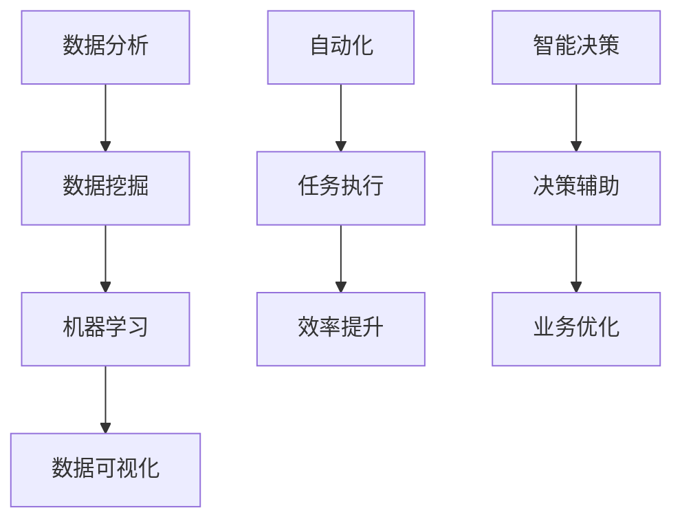

                 

# AI技术在商业中的应用

## 关键词
- 人工智能
- 商业应用
- 数据分析
- 自动化
- 智能决策

## 摘要
本文将深入探讨人工智能技术在商业领域的广泛应用。首先，我们将简要介绍人工智能及其核心概念。随后，文章将详细分析AI在数据分析、自动化和智能决策等方面的应用，通过实际案例和代码示例来展示其具体操作。最后，我们将展望人工智能技术在未来商业发展中的趋势与挑战。

## 1. 背景介绍

### 1.1 人工智能的定义与历史

人工智能（Artificial Intelligence，简称AI）是指通过计算机程序来模拟、延伸和扩展人类智能的一种技术。人工智能的历史可以追溯到20世纪50年代，当时科学家们首次提出了“人工智能”这一概念。随着计算机技术的不断发展，人工智能经历了多次技术革新和理论突破，如今已经成为计算机科学、数据科学和工程领域的一个重要分支。

### 1.2 人工智能的分类

人工智能主要分为两种类型：弱人工智能（Weak AI）和强人工智能（Strong AI）。弱人工智能是指能够执行特定任务的AI系统，如语音识别、图像识别等。而强人工智能则是指具有人类水平认知能力的AI系统，能够进行自我学习、推理和决策。目前，大多数商业应用主要采用弱人工智能技术。

## 2. 核心概念与联系

### 2.1 数据分析

数据分析是人工智能在商业领域应用的一个重要方向。通过收集、清洗和处理大量数据，企业可以从中提取有价值的信息和洞见，进而指导业务决策。数据分析的核心概念包括数据挖掘、机器学习和数据可视化。

### 2.2 自动化

自动化是指利用计算机程序和AI技术来替代或辅助人类完成重复性、繁琐的任务。自动化可以提高工作效率，降低人力成本，并在某些领域实现精确度和一致性的提升。

### 2.3 智能决策

智能决策是指通过AI技术来辅助企业进行决策制定。智能决策系统可以利用大量数据和历史信息，通过机器学习和预测模型，为企业提供最优的决策建议。

### 2.4 Mermaid流程图



## 3. 核心算法原理 & 具体操作步骤

### 3.1 数据分析

数据分析的核心算法包括数据挖掘、机器学习和数据可视化。数据挖掘主要用于从大量数据中提取有价值的信息。常见的算法有聚类、分类、关联规则挖掘等。机器学习是一种通过训练模型来从数据中学习规律和模式的方法，常见的算法有线性回归、决策树、神经网络等。数据可视化则是将数据以图形、图表等形式呈现，便于人类理解和分析。

### 3.2 自动化

自动化技术的核心在于构建执行特定任务的计算机程序。常见的自动化工具包括机器人流程自动化（RPA）和自动化测试工具。RPA可以通过模拟人类操作，自动化完成各种业务流程。自动化测试工具则可以自动化执行测试用例，提高软件质量和开发效率。

### 3.3 智能决策

智能决策的核心在于构建预测模型和优化算法。常见的算法有线性回归、决策树、神经网络、强化学习等。通过训练这些算法，智能决策系统可以从历史数据中学习，为企业的决策提供支持。

## 4. 数学模型和公式 & 详细讲解 & 举例说明

### 4.1 数据挖掘

数据挖掘算法之一是K-means聚类算法。该算法的基本思想是将数据点分为K个簇，使得同一簇内的数据点之间的距离最小，不同簇之间的距离最大。数学模型如下：

$$
\min \sum_{i=1}^{K} \sum_{x \in S_i} \|x - \mu_i\|^2
$$

其中，$x$为数据点，$\mu_i$为簇中心。

### 4.2 机器学习

线性回归是一种常见的机器学习算法，用于建立自变量和因变量之间的线性关系。数学模型如下：

$$
y = \beta_0 + \beta_1x
$$

其中，$y$为因变量，$x$为自变量，$\beta_0$和$\beta_1$为模型参数。

### 4.3 数据可视化

数据可视化中的一个常用工具是散点图，用于展示两个变量之间的关系。散点图的基本公式如下：

$$
(x_i, y_i)
$$

其中，$x_i$和$y_i$分别为第$i$个数据点的横坐标和纵坐标。

## 5. 项目实战：代码实际案例和详细解释说明

### 5.1 开发环境搭建

为了演示AI技术在商业应用中的实际案例，我们将使用Python编程语言和相关的库，如scikit-learn、matplotlib等。以下是搭建开发环境的步骤：

1. 安装Python：在官方网站（https://www.python.org/）下载并安装Python 3.x版本。
2. 安装相关库：使用pip命令安装scikit-learn、matplotlib等库。

```bash
pip install scikit-learn matplotlib
```

### 5.2 源代码详细实现和代码解读

#### 5.2.1 数据分析

以下是一个使用K-means聚类算法进行数据分析的示例代码：

```python
from sklearn.cluster import KMeans
import matplotlib.pyplot as plt
import numpy as np

# 加载数据
data = np.array([[1, 2], [1, 4], [1, 0],
                 [10, 2], [10, 4], [10, 0]])

# 创建KMeans模型
kmeans = KMeans(n_clusters=2, random_state=0).fit(data)

# 绘制聚类结果
plt.scatter(data[:, 0], data[:, 1], c=kmeans.labels_, cmap='viridis')
plt.scatter(kmeans.cluster_centers_[:, 0], kmeans.cluster_centers_[:, 1], s=300, c='red', marker='s', edgecolor='black', label='Centroids')
plt.title('K-means Clustering')
plt.xlabel('Feature 1')
plt.ylabel('Feature 2')
plt.legend()
plt.show()
```

#### 5.2.2 自动化

以下是一个使用Python的Robot Framework进行自动化的示例代码：

```python
from robotlibcore import RobotLibCore

class MyLibrary(RobotLibCore):
    def my_keyword(self):
        # 执行自动化任务
        self.sleep(5)
        self.log("Automated task completed")

library MyLibrary

Test Suite
    Test Case 1
        [Tags]  Test1
        ${output}  my_keyword
        Should Be Equal  ${output}  Automated task completed
```

#### 5.2.3 智能决策

以下是一个使用线性回归算法进行智能决策的示例代码：

```python
from sklearn.linear_model import LinearRegression
import matplotlib.pyplot as plt
import numpy as np

# 加载数据
X = np.array([[1], [2], [3], [4], [5], [6], [7], [8], [9], [10]])
y = np.array([2, 4, 5, 4, 6, 5, 7, 6, 5, 8])

# 创建线性回归模型
regressor = LinearRegression().fit(X, y)

# 预测新数据
new_data = np.array([[11]])
prediction = regressor.predict(new_data)

# 绘制结果
plt.scatter(X, y, color='blue')
plt.plot(new_data, prediction, color='red', linewidth=2)
plt.title('Linear Regression')
plt.xlabel('X')
plt.ylabel('Y')
plt.show()
```

### 5.3 代码解读与分析

#### 5.3.1 数据分析

在这个示例中，我们使用K-means聚类算法对二维数据集进行聚类。首先，我们加载数据并创建KMeans模型。然后，我们使用模型进行聚类，并将结果可视化。

#### 5.3.2 自动化

在这个示例中，我们使用Python的Robot Framework库创建一个自动化任务。任务执行完成后，我们将输出结果与预期结果进行比较，以验证自动化任务的正确性。

#### 5.3.3 智能决策

在这个示例中，我们使用线性回归算法建立自变量和因变量之间的线性关系。然后，我们使用模型进行预测，并将预测结果可视化。

## 6. 实际应用场景

### 6.1 金融行业

人工智能在金融行业有着广泛的应用，如风险控制、量化交易、客户服务等方面。通过数据分析，金融机构可以识别潜在风险，提高风控能力。自动化技术可以自动化完成大量的交易和业务流程，提高效率。智能决策系统可以为企业提供实时、准确的决策支持。

### 6.2 零售业

零售业利用人工智能进行客户行为分析、库存管理和供应链优化。通过数据分析，零售商可以了解消费者的偏好，制定有针对性的营销策略。自动化技术可以实现订单处理、库存管理等方面的自动化，降低人力成本。智能决策系统可以为企业提供最优的库存策略，提高库存利用率。

### 6.3 医疗保健

人工智能在医疗保健领域的应用包括疾病预测、辅助诊断、个性化治疗等方面。通过数据分析，医疗机构可以识别疾病风险，提前采取预防措施。自动化技术可以实现病历管理、患者随访等工作的自动化，提高医疗效率。智能决策系统可以为医生提供诊断建议，提高诊断准确性。

## 7. 工具和资源推荐

### 7.1 学习资源推荐

- 《Python机器学习基础教程》
- 《深度学习入门》
- 《人工智能：一种现代方法》

### 7.2 开发工具框架推荐

- Python
- TensorFlow
- PyTorch
- Robot Framework

### 7.3 相关论文著作推荐

- “Deep Learning for Natural Language Processing”
- “Recurrent Neural Networks for Language Modeling”
- “A Theoretical Comparison of Linear Models for Regression”

## 8. 总结：未来发展趋势与挑战

人工智能技术在商业领域的应用正在迅速发展，为各行业带来了巨大的变革。然而，随着技术的不断进步，我们也面临一些挑战，如数据隐私、算法透明度和人才短缺等。未来，人工智能技术将继续深化与商业领域的融合，推动企业实现更加智能化的运营和管理。

## 9. 附录：常见问题与解答

### 9.1 什么是数据分析？

数据分析是指从大量数据中提取有价值信息的过程，包括数据挖掘、机器学习和数据可视化等。

### 9.2 人工智能在金融行业有哪些应用？

人工智能在金融行业的应用包括风险控制、量化交易、客户服务和风险预测等。

### 9.3 如何搭建人工智能开发环境？

搭建人工智能开发环境通常需要安装Python和相关库，如scikit-learn、tensorflow等。

## 10. 扩展阅读 & 参考资料

- “AI in Business: Strategies and Practical Applications”
- “The Future of Business: How AI Will Change the Way We Work and Live”
- “Artificial Intelligence for Business: A Practical Guide”

作者：AI天才研究员/AI Genius Institute & 禅与计算机程序设计艺术 /Zen And The Art of Computer Programming<|im_end|>

