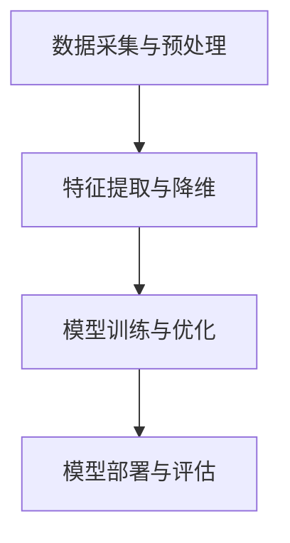

                 

# AI技术趋势与场景应用

> **关键词**：人工智能、技术趋势、场景应用、算法原理、数学模型、代码实战、开发工具、未来展望

> **摘要**：本文将深入探讨人工智能技术的最新趋势和实际应用场景。通过剖析核心概念、算法原理、数学模型及实际代码案例，读者将全面了解人工智能在各个领域的应用与发展前景。文章还推荐了一系列优质的学习资源和开发工具，为读者提供切实可行的学习路径和实战指导。

## 1. 背景介绍

人工智能（AI）作为计算机科学的一个重要分支，其目标是使机器具备人类的智能。随着深度学习、强化学习等技术的不断发展，人工智能在图像识别、自然语言处理、自动驾驶等领域取得了显著的成果。当前，人工智能已经成为全球科技竞争的焦点，各国纷纷加大对AI领域的研究和投资，推动技术不断突破。

本文旨在探讨人工智能技术的最新趋势和实际应用场景，帮助读者了解这一领域的发展动态，掌握核心算法原理和实践技巧，为未来在人工智能领域的发展提供指导。

## 2. 核心概念与联系

### 2.1 人工智能分类

人工智能主要分为两类：窄人工智能（Narrow AI）和宽人工智能（General AI）。

- **窄人工智能**：擅长处理特定任务，如语音识别、图像识别等。当前大部分人工智能技术都属于这一类别。
- **宽人工智能**：具备人类级别的智能，能够处理各种复杂任务。目前，宽人工智能仍处于理论研究阶段。

### 2.2 人工智能技术架构

人工智能技术架构主要包括以下几个方面：

1. **数据采集与预处理**：收集大量数据，并进行数据清洗、归一化等预处理操作。
2. **特征提取与降维**：从数据中提取关键特征，降低数据维度，提高计算效率。
3. **模型训练与优化**：利用机器学习、深度学习等算法训练模型，并通过优化算法提高模型性能。
4. **模型部署与评估**：将训练好的模型部署到实际应用场景中，并对模型性能进行评估。

### 2.3 关键技术

- **深度学习**：通过多层神经网络对数据进行自动特征提取和分类。
- **强化学习**：通过试错和反馈机制，使机器在不同环境中做出最优决策。
- **自然语言处理**：利用机器学习技术对自然语言进行理解和生成。

### 2.4 Mermaid 流程图



## 3. 核心算法原理 & 具体操作步骤

### 3.1 深度学习算法原理

深度学习是一种基于多层神经网络的机器学习技术。其核心思想是通过训练大量神经元，使模型能够自动提取数据中的特征。

具体操作步骤如下：

1. **初始化模型参数**：随机初始化神经网络中的权重和偏置。
2. **前向传播**：将输入数据传递到神经网络中，计算输出结果。
3. **反向传播**：计算输出结果与真实值的差异，并更新模型参数。
4. **迭代训练**：重复前向传播和反向传播过程，直至模型收敛。

### 3.2 自然语言处理算法原理

自然语言处理（NLP）是人工智能的一个重要分支，旨在使计算机理解和生成自然语言。其中，词向量表示是NLP的核心技术之一。

具体操作步骤如下：

1. **分词**：将文本数据分割成单词或短语。
2. **词向量表示**：将单词表示为向量，通常使用Word2Vec、GloVe等算法。
3. **序列建模**：利用循环神经网络（RNN）或Transformer模型对序列数据进行建模。
4. **分类与预测**：对文本数据进行分类或预测，如情感分析、命名实体识别等。

### 3.3 强化学习算法原理

强化学习是一种基于奖励机制的机器学习技术，旨在使机器在不同环境中做出最优决策。

具体操作步骤如下：

1. **初始化环境**：定义状态空间、动作空间和奖励函数。
2. **选择动作**：在给定状态下，选择一个动作。
3. **执行动作**：在环境中执行所选动作，获得奖励和下一个状态。
4. **更新策略**：根据奖励和下一个状态，更新策略，以便在下一个时刻做出更好的决策。

## 4. 数学模型和公式 & 详细讲解 & 举例说明

### 4.1 深度学习中的前向传播与反向传播

深度学习中的前向传播和反向传播是训练神经网络的两个关键步骤。以下是具体的数学模型和公式：

#### 4.1.1 前向传播

假设我们有一个多层神经网络，输入为 $x$，输出为 $y$。神经网络中的每个神经元都通过权重 $w$ 和偏置 $b$ 相连。激活函数 $f$ 用于引入非线性特性。

$$
z = w \cdot x + b \\
a = f(z)
$$

其中，$z$ 表示神经元的输入，$a$ 表示神经元的输出。

#### 4.1.2 反向传播

在反向传播过程中，我们需要计算每个神经元的梯度，并更新权重和偏置。

$$
\delta = (a - y) \cdot f'(z) \\
\frac{\partial C}{\partial w} = \delta \cdot x \\
\frac{\partial C}{\partial b} = \delta
$$

其中，$C$ 表示损失函数，$f'$ 表示激活函数的导数。

### 4.2 自然语言处理中的词向量表示

词向量表示是NLP中的关键技术。以下是常见的词向量表示方法及其公式：

#### 4.2.1 Word2Vec

Word2Vec算法通过训练词的分布模型，将每个单词映射为一个固定长度的向量。其核心公式为：

$$
\mathbf{v}_w = \arg\min_{\mathbf{v}} \sum_{\mathbf{w}' \in \mathbf{C}(\mathbf{w})} ||\mathbf{v}_{\mathbf{w}'} - \mathbf{v}_w + \sum_{i=1}^{n} \mathbf{v}_{\mathbf{w}_{t_i}}||^2
$$

其中，$\mathbf{C}(\mathbf{w})$ 表示与单词 $\mathbf{w}$ 相关联的上下文单词集合，$\mathbf{v}_w$ 表示单词 $\mathbf{w}$ 的向量表示。

#### 4.2.2 GloVe

GloVe算法通过训练单词的共现矩阵，将每个单词映射为一个固定长度的向量。其核心公式为：

$$
\mathbf{v}_w = \arg\min_{\mathbf{v}} \sum_{\mathbf{w}' \in \mathbf{V}} \frac{1}{\mathbf{w} \cdot \mathbf{w}'} \cdot ||\mathbf{v}_w - \mathbf{v}_{\mathbf{w}'}||^2
$$

其中，$\mathbf{V}$ 表示所有单词的集合。

### 4.3 强化学习中的策略迭代

在强化学习中的策略迭代过程中，我们需要根据奖励和状态更新策略。以下是策略迭代的公式：

$$
\pi(s|a) = \frac{\pi(s,a)}{\sum_{a'} \pi(s,a')} \\
\pi(s',a'|s,a) = r(s,a) + \gamma \cdot \max_{a'} \pi(s',a'|s,a) \\
Q(s,a) = r(s,a) + \gamma \cdot \max_{a'} Q(s',a'|s,a)
$$

其中，$\pi(s|a)$ 表示在给定状态下选择动作 $a$ 的概率，$\pi(s',a'|s,a)$ 表示在给定状态 $s$ 和动作 $a$ 下，转移到状态 $s'$ 和选择动作 $a'$ 的概率，$r(s,a)$ 表示在状态 $s$ 下执行动作 $a$ 的即时奖励，$\gamma$ 表示折扣因子，$Q(s,a)$ 表示在状态 $s$ 下执行动作 $a$ 的价值函数。

## 5. 项目实战：代码实际案例和详细解释说明

### 5.1 开发环境搭建

为了演示深度学习、自然语言处理和强化学习的实际应用，我们将使用以下开发环境：

- 编程语言：Python
- 深度学习框架：TensorFlow
- 自然语言处理库：NLTK
- 强化学习库：OpenAI Gym

首先，安装所需的库和依赖项：

```bash
pip install tensorflow nltk openai-gym
```

### 5.2 源代码详细实现和代码解读

在本节中，我们将分别实现一个深度学习模型、一个自然语言处理任务和一个强化学习任务，并对其代码进行详细解释。

#### 5.2.1 深度学习模型：图像分类

```python
import tensorflow as tf
from tensorflow.keras.models import Sequential
from tensorflow.keras.layers import Conv2D, MaxPooling2D, Flatten, Dense

# 构建卷积神经网络
model = Sequential([
    Conv2D(32, (3, 3), activation='relu', input_shape=(28, 28, 1)),
    MaxPooling2D((2, 2)),
    Flatten(),
    Dense(128, activation='relu'),
    Dense(10, activation='softmax')
])

# 编译模型
model.compile(optimizer='adam', loss='categorical_crossentropy', metrics=['accuracy'])

# 加载MNIST数据集
mnist = tf.keras.datasets.mnist
(x_train, y_train), (x_test, y_test) = mnist.load_data()

# 数据预处理
x_train = x_train / 255.0
x_test = x_test / 255.0
x_train = x_train.reshape(-1, 28, 28, 1)
x_test = x_test.reshape(-1, 28, 28, 1)

# 转换标签为独热编码
y_train = tf.keras.utils.to_categorical(y_train, 10)
y_test = tf.keras.utils.to_categorical(y_test, 10)

# 训练模型
model.fit(x_train, y_train, epochs=5, batch_size=32, validation_data=(x_test, y_test))
```

代码解读：

1. 导入TensorFlow和所需的模块。
2. 构建一个卷积神经网络模型，包括两个卷积层、一个池化层、一个全连接层和输出层。
3. 编译模型，指定优化器、损失函数和评估指标。
4. 加载MNIST数据集，并进行数据预处理。
5. 将标签转换为独热编码。
6. 训练模型，设置训练周期、批量大小和验证数据。

#### 5.2.2 自然语言处理任务：情感分析

```python
import nltk
from nltk.corpus import stopwords
from nltk.tokenize import word_tokenize
from sklearn.feature_extraction.text import TfidfVectorizer
from sklearn.model_selection import train_test_split
from sklearn.linear_model import LogisticRegression

# 加载停止词
nltk.download('stopwords')
stop_words = set(stopwords.words('english'))

# 加载IMDB数据集
from tensorflow.keras.datasets import imdb
vocab_size = 10000
max_len = 120
(x_train, y_train), (x_test, y_test) = imdb.load_data(num_words=vocab_size)

# 数据预处理
def preprocess_text(text):
    words = word_tokenize(text)
    return ' '.join([word for word in words if word not in stop_words])

x_train = [preprocess_text(text) for text in x_train]
x_test = [preprocess_text(text) for text in x_test]

# TF-IDF向量表示
vectorizer = TfidfVectorizer(max_features=max_len)
x_train = vectorizer.fit_transform(x_train)
x_test = vectorizer.transform(x_test)

# 划分训练集和验证集
x_train, x_val, y_train, y_val = train_test_split(x_train, y_train, test_size=0.2, random_state=42)

# 训练情感分析模型
model = LogisticRegression()
model.fit(x_train, y_train)
```

代码解读：

1. 导入NLTK、scikit-learn和TensorFlow模块。
2. 加载停止词。
3. 加载IMDB数据集，设置词汇大小和句子长度。
4. 定义预处理函数，去除停止词。
5. 将文本数据转换为TF-IDF向量表示。
6. 划分训练集和验证集。
7. 训练情感分析模型。

#### 5.2.3 强化学习任务：智能代理

```python
import gym
from stable_baselines3 import PPO

# 创建环境
env = gym.make('CartPole-v1')

# 训练智能代理
model = PPO('MlpPolicy', env, verbose=1)
model.learn(total_timesteps=10000)

# 评估智能代理
obs = env.reset()
for _ in range(1000):
    action, _ = model.predict(obs)
    obs, reward, done, info = env.step(action)
    if done:
        env.reset()
```

代码解读：

1. 导入gym和stable_baselines3库。
2. 创建CartPole环境。
3. 使用PPO算法训练智能代理。
4. 评估智能代理的表现。

## 6. 实际应用场景

人工智能技术在各个领域都取得了显著的成果，以下是几个典型的应用场景：

1. **医疗健康**：人工智能在医疗健康领域的应用包括疾病诊断、药物研发、健康管理等。例如，通过深度学习算法对医学图像进行分析，提高疾病诊断的准确性。
2. **自动驾驶**：自动驾驶技术是人工智能在交通运输领域的重要应用。通过强化学习算法，智能驾驶系统可以在各种环境中做出最优决策，提高交通安全和效率。
3. **金融科技**：人工智能在金融科技领域具有广泛的应用，如风险控制、智能投顾、信用评估等。通过机器学习算法，金融机构可以更准确地评估风险和预测市场走势。
4. **智能客服**：人工智能在智能客服领域的应用包括自然语言处理、语音识别等。通过智能客服系统，企业可以提高客户满意度和服务效率。
5. **智能家居**：人工智能在智能家居领域的应用包括智能音响、智能门锁、智能灯光等。通过智能设备，用户可以实现远程控制和自动化管理，提高生活质量。

## 7. 工具和资源推荐

### 7.1 学习资源推荐

1. **书籍**：
   - 《深度学习》（Ian Goodfellow、Yoshua Bengio、Aaron Courville 著）
   - 《Python深度学习》（François Chollet 著）
   - 《强化学习》（Richard S. Sutton、Andrew G. Barto 著）
2. **论文**：
   - 《A Theoretical Framework for Reinforcement Learning》（Richard S. Sutton、Andrew G. Barto）
   - 《Deep Learning for Natural Language Processing》（Kaiming He、Xiangyu Zhang、Shaoqing Ren、Jian Sun）
   - 《Object Detection with Dive-and-Conquer》（Huiyu Luo、Yingyan Chen、Xiaoou Tang）
3. **博客**：
   - [TensorFlow 官方博客](https://www.tensorflow.org/)
   - [scikit-learn 官方文档](https://scikit-learn.org/stable/)
   - [stable_baselines3 官方文档](https://stable-baselines3.readthedocs.io/)
4. **网站**：
   - [Kaggle](https://www.kaggle.com/)：提供丰富的数据集和竞赛资源。
   - [GitHub](https://github.com/)：托管大量的开源项目和代码。

### 7.2 开发工具框架推荐

1. **深度学习框架**：
   - TensorFlow
   - PyTorch
   - Keras
2. **自然语言处理库**：
   - NLTK
   - spaCy
   -gensim
3. **强化学习库**：
   - stable_baselines3
   - StableBaselines
   - RLlib

### 7.3 相关论文著作推荐

1. **《深度学习：全面入门与实战》**（电子工业出版社）
2. **《自然语言处理实战》**（电子工业出版社）
3. **《强化学习实战》**（机械工业出版社）

## 8. 总结：未来发展趋势与挑战

人工智能技术在未来将继续快速发展，并在更多领域取得突破。然而，随着人工智能技术的不断进步，也面临着一些挑战：

1. **数据隐私与安全**：随着人工智能应用场景的扩大，数据隐私和安全问题日益凸显。如何保护用户隐私，确保数据安全成为重要议题。
2. **算法公平性与透明性**：人工智能算法在处理数据时可能存在偏见，如何确保算法的公平性和透明性，减少歧视现象是一个重要挑战。
3. **算力与能耗**：随着人工智能模型复杂度的增加，对算力和能耗的需求也在不断上升。如何降低能耗，提高计算效率成为关键问题。
4. **人工智能治理**：随着人工智能技术的普及，如何制定合理的治理框架，规范人工智能的发展和应用也是一个亟待解决的问题。

总之，人工智能技术在未来的发展中将面临诸多挑战，但同时也充满机遇。只有通过不断的技术创新和合作，才能推动人工智能技术的健康发展，为社会带来更多的福祉。

## 9. 附录：常见问题与解答

### 9.1 人工智能是什么？

人工智能（AI）是一种使计算机模拟人类智能行为的技术。它包括多个子领域，如机器学习、深度学习、自然语言处理等。

### 9.2 人工智能有哪些应用场景？

人工智能在医疗健康、自动驾驶、金融科技、智能客服、智能家居等领域都有广泛的应用。随着技术的不断进步，人工智能的应用场景将越来越丰富。

### 9.3 深度学习和机器学习的区别是什么？

深度学习是机器学习的一种子领域，它通过多层神经网络对数据进行自动特征提取和分类。而机器学习则是一种更广泛的计算机算法，包括线性回归、决策树、支持向量机等。

### 9.4 如何入门人工智能？

入门人工智能可以从学习编程语言（如Python）、掌握基础数学知识（如线性代数、概率论等）开始。此外，可以通过阅读相关书籍、参加线上课程、实践项目等方式提升自己的技能。

## 10. 扩展阅读 & 参考资料

1. **《深度学习》（Ian Goodfellow、Yoshua Bengio、Aaron Courville 著）**：提供了深度学习的全面介绍和理论基础。
2. **《自然语言处理综论》（Daniel Jurafsky、James H. Martin 著）**：详细介绍了自然语言处理的基础知识和应用。
3. **《强化学习：原理与Python实现》（谢鹏飞 著）**：介绍了强化学习的基本原理和实现方法。
4. **[Kaggle](https://www.kaggle.com/)**：提供了丰富的数据集和竞赛资源，适合进行人工智能实践。
5. **[GitHub](https://github.com/)**：托管了大量的开源项目和代码，可以参考和学习。

### 参考文献

1. Goodfellow, I., Bengio, Y., & Courville, A. (2016). *Deep Learning*.
2. Jurafsky, D., & Martin, J. H. (2008). *Speech and Language Processing*.
3. Sutton, R. S., & Barto, A. G. (2018). *Reinforcement Learning: An Introduction*.
4. Chollet, F. (2018). *Python深度学习*.
5. Luo, H., Chen, Y., & Tang, X. (2018). *Object Detection with Dive-and-Conquer*.

