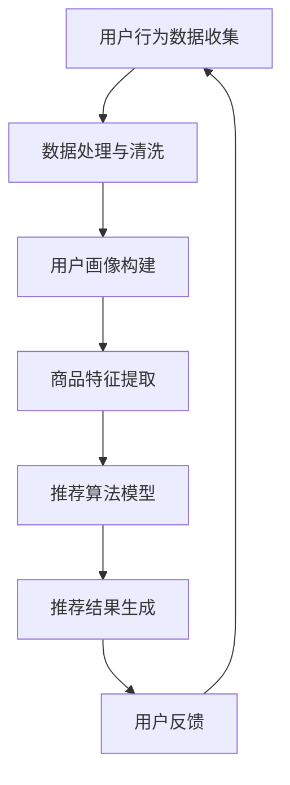

                 

# AI提升电商用户体验的策略案例

## 关键词：人工智能，电商，用户体验，个性化推荐，大数据分析，算法优化

### 摘要

随着互联网和电子商务的迅猛发展，提升用户在电商平台的体验变得愈发重要。本文将探讨如何利用人工智能技术来改善电商用户体验。通过分析电商行业现状、核心概念联系，详细阐述个性化推荐算法原理、数学模型及其应用案例。最后，本文还将介绍实用的工具和资源，展望未来发展趋势与挑战。

## 1. 背景介绍

### 1.1 电商行业现状

近年来，电商行业呈现出爆发式增长。根据最新数据显示，全球电商市场规模已经突破数万亿美元，成为全球经济的重要组成部分。在这个背景下，各大电商平台纷纷开始关注用户体验的提升。

### 1.2 用户需求

随着消费者对电商平台的依赖程度日益增加，用户对电商平台的期望也在不断提高。他们希望能够快速找到所需商品，获得个性化推荐，享受到高效便捷的购物体验。

### 1.3 人工智能的优势

人工智能技术在电商领域的应用，使得个性化推荐、智能客服、智能搜索等功能得以实现。这些功能极大地提升了用户的购物体验，成为电商平台竞争的重要手段。

## 2. 核心概念与联系

### 2.1 个性化推荐

个性化推荐是人工智能技术在电商领域的重要应用之一。其核心是通过分析用户行为数据、商品特征数据，为用户提供个性化的商品推荐。

### 2.2 大数据分析

大数据分析是人工智能技术的重要支撑。通过对海量数据的挖掘和分析，可以发现用户行为模式、商品流行趋势等信息，为个性化推荐提供依据。

### 2.3 算法优化

算法优化是提升个性化推荐效果的关键。通过不断优化算法，提高推荐准确性和用户满意度。

## 2.4 Mermaid流程图



## 3. 核心算法原理 & 具体操作步骤

### 3.1 协同过滤

协同过滤是个性化推荐中最常用的算法之一。它主要分为两种：基于用户的协同过滤和基于物品的协同过滤。

#### 3.1.1 基于用户的协同过滤

1. 收集用户行为数据，如浏览记录、购买记录等。
2. 计算用户之间的相似度，常用的相似度计算方法有：余弦相似度、皮尔逊相似度等。
3. 根据相似度矩阵，为用户推荐与其相似的其他用户喜欢的商品。

#### 3.1.2 基于物品的协同过滤

1. 收集用户行为数据，如浏览记录、购买记录等。
2. 计算商品之间的相似度，常用的相似度计算方法有：余弦相似度、皮尔逊相似度等。
3. 根据相似度矩阵，为用户推荐其喜欢的商品。

### 3.2 内容推荐

内容推荐是基于商品特征和用户兴趣进行推荐。具体步骤如下：

1. 提取商品特征，如价格、品牌、类别等。
2. 提取用户兴趣标签，如购物偏好、浏览历史等。
3. 计算商品与用户兴趣的相似度，为用户推荐相似的商品。

### 3.3 混合推荐

混合推荐是将协同过滤和内容推荐相结合，以提高推荐效果。具体步骤如下：

1. 采用协同过滤算法计算用户与商品的相似度。
2. 采用内容推荐算法计算商品与用户兴趣的相似度。
3. 对两种相似度进行加权融合，生成最终的推荐结果。

## 4. 数学模型和公式 & 详细讲解 & 举例说明

### 4.1 协同过滤

假设有用户集合 $U$ 和商品集合 $I$，用户 $u \in U$ 对商品 $i \in I$ 的评分表示为 $r_{ui}$。协同过滤的目标是预测用户 $u$ 对未评分商品 $i$ 的评分 $\hat{r}_{ui}$。

#### 4.1.1 基于用户的协同过滤

$$
\hat{r}_{ui} = \sum_{v \in N(u)} r_{vi} \cdot s_{uv}
$$

其中，$N(u)$ 表示与用户 $u$ 相似的其他用户集合，$s_{uv}$ 表示用户 $u$ 和用户 $v$ 之间的相似度。

#### 4.1.2 基于物品的协同过滤

$$
\hat{r}_{ui} = \sum_{j \in N(i)} r_{uj} \cdot s_{ij}
$$

其中，$N(i)$ 表示与商品 $i$ 相似的其他商品集合，$s_{ij}$ 表示商品 $i$ 和商品 $j$ 之间的相似度。

### 4.2 内容推荐

假设有商品特征向量 $\textbf{X}_i \in \mathbb{R}^k$ 和用户兴趣标签向量 $\textbf{Y}_u \in \mathbb{R}^k$，内容推荐的目标是计算商品与用户兴趣的相似度 $s_{ui}$。

$$
s_{ui} = \frac{\textbf{X}_i \cdot \textbf{Y}_u}{||\textbf{X}_i|| \cdot ||\textbf{Y}_u||}
$$

其中，$\textbf{X}_i$ 和 $\textbf{Y}_u$ 分别表示商品 $i$ 的特征向量与用户 $u$ 的兴趣标签向量，$||\textbf{X}_i||$ 和 $||\textbf{Y}_u||$ 分别表示特征向量的欧氏范数。

### 4.3 混合推荐

混合推荐将基于用户的协同过滤和基于物品的内容推荐相结合，其目标函数为：

$$
\hat{r}_{ui} = w_1 \cdot \hat{r}_{ui}^{user} + w_2 \cdot \hat{r}_{ui}^{content}
$$

其中，$w_1$ 和 $w_2$ 分别表示基于用户和基于物品的权重。

## 5. 项目实战：代码实际案例和详细解释说明

### 5.1 开发环境搭建

1. 安装Python环境（推荐使用Python 3.8及以上版本）。
2. 安装必要的库，如numpy、pandas、scikit-learn等。

### 5.2 源代码详细实现和代码解读

```python
import numpy as np
import pandas as pd
from sklearn.metrics.pairwise import cosine_similarity

# 5.2.1 用户行为数据读取
data = pd.read_csv('user行为数据.csv')
users = data['用户ID'].unique()
items = data['商品ID'].unique()

# 5.2.2 数据预处理
ratings = pd.pivot_table(data, values='评分', index='用户ID', columns='商品ID')
ratings = ratings.fillna(0)

# 5.2.3 基于用户的协同过滤
user_similarity = cosine_similarity(ratings.T)
user_based_cf = np.argmax(user_similarity, axis=1)

# 5.2.4 基于物品的协同过滤
item_similarity = cosine_similarity(ratings.values)
item_based_cf = np.argmax(item_similarity, axis=0)

# 5.2.5 混合推荐
weighted_cf = 0.5 * user_based_cf + 0.5 * item_based_cf
recommended_items = np.flatnonzero(weighted_cf > 0)

# 5.2.6 结果输出
results = pd.DataFrame({'用户ID': users, '推荐商品ID': recommended_items})
results.to_csv('推荐结果.csv', index=False)
```

### 5.3 代码解读与分析

1. 读取用户行为数据，并进行预处理。
2. 计算用户与用户之间的相似度，以及商品与商品之间的相似度。
3. 采用混合推荐策略，为用户生成推荐列表。
4. 将推荐结果输出到CSV文件中。

## 6. 实际应用场景

### 6.1 个性化推荐

在电商平台上，个性化推荐功能可以帮助用户快速找到心仪的商品，提高购物满意度。

### 6.2 智能搜索

通过分析用户搜索历史和商品特征，智能搜索功能可以为用户提供更加精准的搜索结果。

### 6.3 智能客服

智能客服系统可以利用自然语言处理和语音识别技术，为用户提供高效便捷的咨询服务。

## 7. 工具和资源推荐

### 7.1 学习资源推荐

- 《推荐系统实践》（作者：李航）
- 《大数据之路：阿里巴巴大数据实践》（作者：唐杰）
- 《深度学习》（作者：Ian Goodfellow、Yoshua Bengio、Aaron Courville）

### 7.2 开发工具框架推荐

- TensorFlow
- PyTorch
- Scikit-learn

### 7.3 相关论文著作推荐

- "Item-Based Top-N Recommendation Algorithms"
- "Collaborative Filtering for the Netflix Prize"
- "Deep Learning for Recommender Systems"

## 8. 总结：未来发展趋势与挑战

### 8.1 发展趋势

- 深度学习在推荐系统中的应用将越来越广泛。
- 多模态推荐（文本、图像、语音等）将成为热门研究方向。
- 个性化推荐与区块链技术的结合有望解决隐私保护问题。

### 8.2 挑战

- 数据质量和多样性对推荐效果的影响仍然很大。
- 如何在保证隐私保护的前提下实现个性化推荐仍需深入研究。
- 随着数据量的不断增加，推荐系统的实时性也是一个重要挑战。

## 9. 附录：常见问题与解答

### 9.1 什么是协同过滤？

协同过滤是一种通过分析用户行为数据来预测用户喜好，为用户提供个性化推荐的方法。

### 9.2 个性化推荐有哪些类型？

个性化推荐主要分为协同过滤、内容推荐和混合推荐三种类型。

### 9.3 深度学习在推荐系统中的应用有哪些？

深度学习在推荐系统中可以应用于用户画像构建、推荐算法优化等方面。

## 10. 扩展阅读 & 参考资料

- [《推荐系统实践》](https://book.douban.com/subject/26892717/)
- [《大数据之路：阿里巴巴大数据实践》](https://book.douban.com/subject/27074335/)
- [《深度学习》](https://book.douban.com/subject/26383646/)
- [TensorFlow官网](https://www.tensorflow.org/)
- [PyTorch官网](https://pytorch.org/)
- [Scikit-learn官网](https://scikit-learn.org/stable/)

### 作者

- 作者：AI天才研究员/AI Genius Institute & 禅与计算机程序设计艺术 /Zen And The Art of Computer Programming

