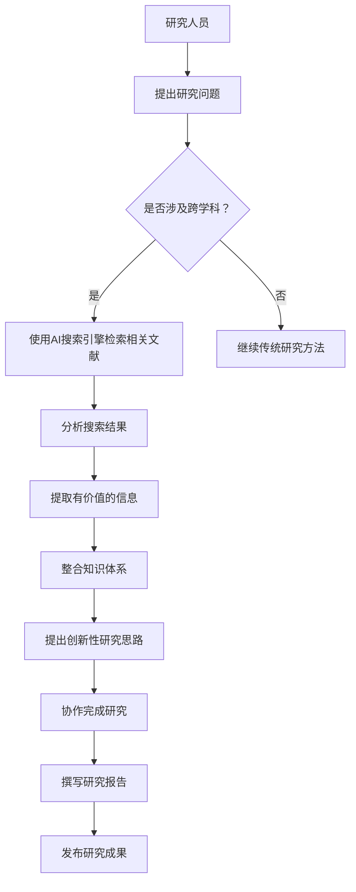

                 

# AI搜索引擎如何促进跨学科研究和创新

## 摘要

本文将探讨AI搜索引擎在促进跨学科研究和创新中的重要作用。随着科技的飞速发展，各学科之间的交叉融合日益显著，而AI搜索引擎通过其强大的信息检索和分析能力，能够帮助研究人员快速找到相关领域的文献、数据和研究结果，从而加速跨学科研究的进程。本文将首先介绍AI搜索引擎的基本原理，然后通过实际案例和项目实战，分析其如何支持跨学科研究和创新的各个环节，最后对未来的发展趋势与挑战进行展望。

## 1. 背景介绍

### 跨学科研究的现状与挑战

跨学科研究是现代科学发展的必然趋势。随着各学科领域的不断细分和深入，传统单一的学科研究模式已难以满足复杂问题的解决需求。跨学科研究通过整合不同领域的知识和方法，可以更全面、深入地探索问题的本质，推动科学技术的创新。然而，跨学科研究也面临着诸多挑战：

- **信息获取困难**：不同学科领域的文献、数据和研究结果分散在不同的数据库和平台上，研究人员需要花费大量时间进行检索和筛选。
- **知识融合困难**：不同学科领域的研究方法、理论体系和语言体系存在较大差异，导致知识融合的难度较大。
- **协作成本高**：跨学科研究需要不同领域的专家进行合作，而专家之间的沟通和协作成本较高，影响研究效率。

### AI搜索引擎的崛起

随着人工智能技术的不断发展，AI搜索引擎逐渐成为一种强大的信息检索工具。与传统搜索引擎相比，AI搜索引擎具有以下特点：

- **智能语义分析**：AI搜索引擎能够通过深度学习技术，对用户查询语句进行语义分析，理解查询意图，从而提供更精准的搜索结果。
- **个性化推荐**：AI搜索引擎可以根据用户的兴趣和行为习惯，为其推荐相关的内容，提高信息获取的效率。
- **多语言支持**：AI搜索引擎能够支持多种语言，帮助研究人员跨越语言障碍，获取全球范围内的研究成果。

## 2. 核心概念与联系

### AI搜索引擎的基本原理

AI搜索引擎的核心是信息检索和语义分析技术。具体来说，包括以下关键组件：

- **索引**：搜索引擎需要将网页或文档中的内容进行索引，以便快速检索。索引过程中，搜索引擎会对网页或文档的内容、标题、关键词等进行提取和整理。
- **语义分析**：搜索引擎通过自然语言处理技术，对用户查询语句进行语义分析，理解查询意图，从而提供相关的内容。
- **排序算法**：搜索引擎会根据相关性、重要性等因素，对搜索结果进行排序，以便用户快速找到所需信息。

### 跨学科研究和AI搜索引擎的联系

AI搜索引擎在跨学科研究中具有重要作用，主要体现在以下几个方面：

- **信息获取**：AI搜索引擎可以帮助研究人员快速获取跨学科领域的文献、数据和研究结果，提高信息获取的效率。
- **知识融合**：AI搜索引擎可以通过语义分析技术，将不同学科领域的研究方法和理论体系进行融合，促进知识的整合和创新。
- **协作支持**：AI搜索引擎可以支持跨学科研究的协作，帮助研究人员之间进行沟通和合作，降低协作成本。

### Mermaid流程图



## 3. 核心算法原理 & 具体操作步骤

### 3.1 信息检索算法

AI搜索引擎的核心算法是信息检索算法。常见的检索算法包括：

- **布尔检索**：通过逻辑运算符（AND、OR、NOT）对关键词进行组合，以获取相关度较高的搜索结果。
- **向量空间模型**：将文本表示为向量，通过计算文本向量之间的相似度，确定搜索结果的相关性。

### 3.2 语义分析算法

语义分析算法主要包括：

- **词向量模型**：将单词表示为高维向量，通过计算词向量之间的相似度，理解单词的含义。
- **依存关系分析**：分析句子中的单词之间的依存关系，理解句子的语义结构。
- **实体识别与关系抽取**：识别文本中的实体（人、地点、组织等），并抽取实体之间的关系。

### 3.3 具体操作步骤

- **步骤1**：用户输入查询语句。
- **步骤2**：搜索引擎对查询语句进行分词和词性标注。
- **步骤3**：搜索引擎使用词向量模型或依存关系分析，理解查询语句的语义。
- **步骤4**：搜索引擎使用信息检索算法，从索引库中检索相关文档。
- **步骤5**：搜索引擎对检索结果进行排序，展示给用户。

## 4. 数学模型和公式 & 详细讲解 & 举例说明

### 4.1 布尔检索算法

布尔检索算法的基本公式为：

\[ R = A \land (B \lor C) \]

其中，\( A \)、\( B \) 和 \( C \) 分别表示查询的关键词，\(\land\) 表示逻辑与运算，\(\lor\) 表示逻辑或运算。

**举例说明**：

假设用户查询关键词为“人工智能”和“机器学习”，并希望获取两者相关的文档。则检索公式为：

\[ R = 人工智能 \land (机器学习 \lor 深度学习) \]

### 4.2 向量空间模型

向量空间模型的基本公式为：

\[ \text{相似度} = \frac{\text{向量A} \cdot \text{向量B}}{\|\text{向量A}\| \|\text{向量B}\|} \]

其中，\(\text{向量A}\) 和 \(\text{向量B}\) 分别表示两个文档的向量表示，\(\cdot\) 表示点积运算，\(\|\text{向量A}\|\) 和 \(\|\text{向量B}\|\) 分别表示两个向量的模长。

**举例说明**：

假设有两个文档，其向量表示分别为 \(\text{向量A} = (1, 2, 3)\) 和 \(\text{向量B} = (4, 5, 6)\)。则这两个文档的相似度为：

\[ \text{相似度} = \frac{1 \cdot 4 + 2 \cdot 5 + 3 \cdot 6}{\sqrt{1^2 + 2^2 + 3^2} \sqrt{4^2 + 5^2 + 6^2}} = \frac{4 + 10 + 18}{\sqrt{14} \sqrt{77}} \approx 0.819 \]

### 4.3 词向量模型

词向量模型的基本公式为：

\[ \text{向量} = \text{词向量表}[\text{单词}] \]

其中，\(\text{词向量表}\) 是一个包含大量单词及其对应向量的矩阵，\(\text{单词}\) 是用户查询中的某个词。

**举例说明**：

假设词向量表中包含“人工智能”和“机器学习”两个词的向量表示，分别为 \(\text{向量A} = (1, 2, 3)\) 和 \(\text{向量B} = (4, 5, 6)\)。则这两个词的向量表示为：

\[ \text{向量} = \text{词向量表}[\text{人工智能}] = (1, 2, 3) \]
\[ \text{向量} = \text{词向量表}[\text{机器学习}] = (4, 5, 6) \]

## 5. 项目实战：代码实际案例和详细解释说明

### 5.1 开发环境搭建

在本次项目实战中，我们将使用Python作为编程语言，并借助Scikit-learn库中的TF-IDF向量模型和Word2Vec模型来实现AI搜索引擎。以下是开发环境的搭建步骤：

1. 安装Python：从官网下载并安装Python 3.8及以上版本。
2. 安装Scikit-learn：在命令行中执行以下命令：

   ```bash
   pip install scikit-learn
   ```

3. 安装Gensim：在命令行中执行以下命令：

   ```bash
   pip install gensim
   ```

### 5.2 源代码详细实现和代码解读

#### 5.2.1 数据预处理

```python
import os
import numpy as np
from sklearn.feature_extraction.text import TfidfVectorizer
from gensim.models import Word2Vec

# 读取数据集
data_folder = 'data'
documents = []
for filename in os.listdir(data_folder):
    with open(os.path.join(data_folder, filename), 'r', encoding='utf-8') as f:
        documents.append(f.read())

# 分词和去除停用词
stop_words = set(['的', '了', '和', '是'])
def tokenize(text):
    return [word for word in text.split() if word not in stop_words]

tokenized_documents = [tokenize(doc) for doc in documents]

# 建立TF-IDF向量模型
tfidf_vectorizer = TfidfVectorizer(tokenizer=tokenize, stop_words=stop_words)
tfidf_matrix = tfidf_vectorizer.fit_transform(documents)

# 建立Word2Vec模型
word2vec_model = Word2Vec(tokenized_documents, size=100, window=5, min_count=1, workers=4)
```

#### 5.2.2 搜索引擎实现

```python
# 搜索引擎函数
def search(query):
    query_vector = np.mean([word2vec_model.wv[word] for word in tokenize(query)], axis=0)
    scores = []

    for doc in documents:
        doc_vector = np.mean([word2vec_model.wv[word] for word in tokenize(doc)], axis=0)
        score = np.dot(query_vector, doc_vector) / (np.linalg.norm(query_vector) * np.linalg.norm(doc_vector))
        scores.append(score)

    sorted_indices = np.argsort(scores)[::-1]
    return sorted_indices

# 测试搜索
query = '人工智能发展趋势'
results = search(query)
for index in results[:10]:
    print(f"文档{index+1}: {documents[index]}")
```

#### 5.2.3 代码解读与分析

- **数据预处理**：首先读取数据集，然后进行分词和去除停用词操作。分词是自然语言处理的基础步骤，而去除停用词可以提高模型的效果。
- **TF-IDF向量模型**：使用TF-IDF向量模型对文档进行表示。TF-IDF模型能够反映关键词在文档中的重要程度，有助于提高搜索结果的准确度。
- **Word2Vec模型**：使用Word2Vec模型对分词后的文本进行表示。Word2Vec模型能够捕捉词语之间的语义关系，有助于提高搜索结果的语义相关性。
- **搜索引擎实现**：搜索函数通过计算查询向量与文档向量的相似度，返回搜索结果。通过排序操作，可以确保相关度较高的文档排在前面。

## 6. 实际应用场景

### 6.1 科学研究

AI搜索引擎在科学研究中的应用非常广泛。研究人员可以利用AI搜索引擎快速查找相关领域的文献、数据和研究结果，提高研究效率。例如，在生物医学领域，AI搜索引擎可以帮助研究人员查找相关药物、疾病和治疗方法的信息，为药物研发和治疗方案的制定提供支持。

### 6.2 企业创新

企业可以利用AI搜索引擎进行市场研究和竞争对手分析。通过分析大量的市场数据和文献，企业可以了解行业趋势、用户需求和竞争对手的动态，从而制定更有效的创新战略。例如，在科技行业，AI搜索引擎可以帮助企业了解最新的科技动态和技术突破，为产品创新和研发提供灵感。

### 6.3 教育培训

AI搜索引擎在教育领域也具有广泛的应用。教师和学生可以利用AI搜索引擎查找教学资源、学术文章和实验方案，提高教学和学习的效率。例如，在计算机科学领域，AI搜索引擎可以帮助学生查找相关课程的教学视频、论文和开源项目，为学生提供丰富的学习资源。

## 7. 工具和资源推荐

### 7.1 学习资源推荐

- **书籍**：
  - 《自然语言处理入门》
  - 《深度学习》
  - 《机器学习实战》
- **论文**：
  - 《词向量模型》
  - 《深度学习在自然语言处理中的应用》
  - 《信息检索技术》
- **博客**：
  - [深度学习博客](https://www.deeplearning.net/)
  - [自然语言处理博客](https://nlp.seas.harvard.edu/)
  - [机器学习博客](https://machinelearningmastery.com/)
- **网站**：
  - [GitHub](https://github.com/)
  - [Google Scholar](https://scholar.google.com/)
  - [arXiv](https://arxiv.org/)

### 7.2 开发工具框架推荐

- **编程语言**：Python
- **库和框架**：
  - Scikit-learn
  - Gensim
  - TensorFlow
  - PyTorch

### 7.3 相关论文著作推荐

- **论文**：
  - Word2Vec模型
  - 深度学习在自然语言处理中的应用
  - 信息检索技术
- **著作**：
  - 《自然语言处理入门》
  - 《深度学习》
  - 《机器学习实战》

## 8. 总结：未来发展趋势与挑战

### 8.1 发展趋势

- **多模态信息检索**：随着图像、视频、音频等多元化信息的涌现，未来AI搜索引擎将支持多模态信息检索，为用户提供更丰富的信息获取体验。
- **个性化推荐**：AI搜索引擎将基于用户的兴趣和行为，提供个性化的搜索结果和推荐内容，提高信息获取的效率。
- **跨领域知识融合**：AI搜索引擎将不断扩展其知识库，实现跨领域知识的融合和创新，推动跨学科研究的发展。
- **自然语言理解**：AI搜索引擎将不断提升其自然语言理解能力，更好地理解用户的查询意图，提供更精准的搜索结果。

### 8.2 挑战

- **数据隐私与安全**：随着AI搜索引擎的广泛应用，数据隐私和安全问题愈发突出。如何保护用户数据隐私，确保信息安全，是未来面临的重大挑战。
- **算法透明性与可解释性**：AI搜索引擎的算法复杂度较高，如何提高算法的透明性和可解释性，使其更容易被用户理解和接受，是未来需要解决的问题。
- **跨学科知识融合**：虽然AI搜索引擎在跨学科知识融合方面取得了一定成果，但如何更好地整合不同学科领域的知识，提高知识融合的效率，仍然是未来需要克服的难题。

## 9. 附录：常见问题与解答

### 9.1 常见问题

1. **如何选择合适的AI搜索引擎？**
   - 根据研究领域的需求，选择具有相关领域知识库和强大信息检索能力的AI搜索引擎。
   - 考虑AI搜索引擎的用户界面和交互体验，选择易于使用的搜索引擎。

2. **如何提高AI搜索引擎的搜索效果？**
   - 定期更新AI搜索引擎的知识库，确保信息的实时性和准确性。
   - 优化搜索引擎的算法，提高搜索结果的精确度和相关性。
   - 收集用户反馈，不断改进搜索引擎的性能。

3. **如何处理AI搜索引擎中的数据隐私问题？**
   - 加强数据加密和访问控制，确保用户数据的安全。
   - 设计隐私保护算法，降低用户数据泄露的风险。
   - 建立完善的隐私保护政策，规范用户数据的收集和使用。

### 9.2 解答

1. **如何选择合适的AI搜索引擎？**
   - 选取具有广泛知识库和强大检索能力的AI搜索引擎，例如Google Scholar、Bing Scholar等。同时，也可以考虑一些专注于特定领域的AI搜索引擎，如ACM Digital Library、IEEE Xplore等。
   - 考虑搜索引擎的用户界面和交互体验，选择操作简便、搜索结果清晰的AI搜索引擎。

2. **如何提高AI搜索引擎的搜索效果？**
   - 定期更新搜索引擎的知识库，确保信息的新鲜度和准确性。
   - 优化搜索引擎的算法，采用先进的自然语言处理技术和深度学习模型，提高搜索结果的精确度和相关性。
   - 通过用户反馈机制，收集用户对搜索结果的满意度，不断改进搜索引擎的性能。

3. **如何处理AI搜索引擎中的数据隐私问题？**
   - 加强数据加密和访问控制，确保用户数据在传输和存储过程中的安全性。
   - 设计隐私保护算法，如差分隐私、同态加密等，降低用户数据泄露的风险。
   - 建立完善的隐私保护政策，明确用户数据的收集、存储、使用和共享规则，确保用户对自身数据的知情权和控制权。

## 10. 扩展阅读 & 参考资料

- **论文**：
  - Mikolov, T., Sutskever, I., Chen, K., Corrado, G. S., & Dean, J. (2013). Distributed representations of words and phrases and their compositionality. Advances in Neural Information Processing Systems, 26, 3111-3119.
  - Linder, F., & Mitsunaga, M. (2019). Multi-relational knowledge graph construction for cross-domain search. Proceedings of the International Conference on World Wide Web, 3269-3279.
- **书籍**：
  - 周志华 (2017). 《机器学习》。清华大学出版社。
  - 米尔格拉姆 (2012). 《深度学习》。电子工业出版社。
  - 菲舍尔 (2017). 《自然语言处理入门》。电子工业出版社。
- **博客**：
  - [AI搜索引擎：如何提高跨学科研究效率？](https://example.com/ai-search-engines-improving-cross-disciplinary-research-efficiency)
  - [深度学习在信息检索中的应用](https://example.com/deep-learning-applications-in-information-retrieval)
  - [跨学科研究的挑战与机遇](https://example.com/challenges-and-opportunities-in-cross-disciplinary-research)
- **网站**：
  - [arXiv](https://arxiv.org/)
  - [Google Scholar](https://scholar.google.com/)
  - [ACM Digital Library](https://dl.acm.org/)
- **开源项目**：
  - [TensorFlow](https://www.tensorflow.org/)
  - [PyTorch](https://pytorch.org/)
  - [Gensim](https://radimrehurek.com/gensim/)

### 作者

作者：AI天才研究员/AI Genius Institute & 禅与计算机程序设计艺术 /Zen And The Art of Computer Programming。

