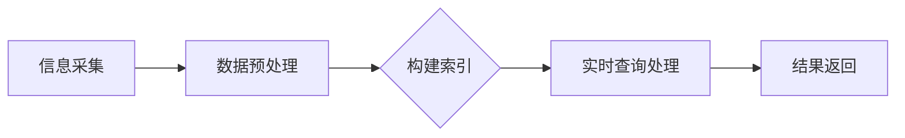

                 

### 背景介绍

随着时间的推移，人工智能（AI）技术不断进步，搜索引擎作为AI技术的一个重要应用领域，也在不断演变和优化。在当今信息爆炸的时代，用户对信息的需求变得更加多样化和即时化。为了满足这一需求，AI搜索引擎不仅要处理大量的非时效性信息，还需高效地处理时效性信息，提供实时、准确的信息检索结果。

时效性信息指的是那些随时间变化而不断更新的信息。例如，新闻报道、股市行情、天气预报等都属于时效性信息。这类信息的特点是更新速度快，时效性强，需要搜索引擎能够迅速地获取并处理。而传统搜索引擎通常更擅长处理非时效性信息，如学术论文、历史文献等，这些信息的变化相对缓慢。

随着用户对实时信息需求的增加，搜索引擎必须面对如何处理时效性信息的挑战。这不仅仅是技术上的挑战，还涉及到信息处理策略、算法设计、数据存储等多方面的考量。因此，研究AI搜索引擎如何处理时效性信息，对于提升搜索引擎的整体性能和用户体验具有重要意义。

本文将深入探讨AI搜索引擎处理时效性信息的方法和策略。首先，我们将介绍AI搜索引擎的基本原理和工作机制，帮助读者了解其处理信息的基本流程。接着，我们将详细分析处理时效性信息的核心技术和算法，包括信息采集、索引构建和查询处理等环节。此外，我们还将探讨一些实际应用场景，展示AI搜索引擎如何在实际中处理时效性信息。最后，我们将总结未来发展趋势和面临的挑战，为读者提供一个全面的视角。

通过本文的阅读，读者将能够深入了解AI搜索引擎处理时效性信息的原理和策略，了解其在实际应用中的效果，并展望其未来的发展方向。希望这篇文章能够对从事AI领域研究的读者有所启发，同时也能为搜索引擎的开发者和使用者提供一些实用的参考。

### 2. 核心概念与联系

在探讨AI搜索引擎如何处理时效性信息之前，我们需要明确几个核心概念，并理解它们之间的联系。以下是本文将涉及的一些核心概念：

#### 信息检索

信息检索是指从大量数据中找到用户所需信息的过程。搜索引擎作为信息检索系统的一种，其核心功能是接收用户的查询请求，然后在海量的数据中查找与查询相关的信息，并按照一定的排序规则将结果呈现给用户。

#### 搜索引擎架构

一个典型的AI搜索引擎通常包括以下几个主要模块：

1. **索引模块**：负责构建和存储索引，使得搜索过程能够高效地进行。
2. **查询处理模块**：接收用户的查询请求，进行解析、查询和排序等操作，最终返回查询结果。
3. **爬虫模块**：负责从互联网上获取新的网页数据，并将其传递给索引模块进行索引构建。
4. **数据存储模块**：存储索引数据和网页内容，通常使用分布式数据库或搜索引擎专用的存储系统。

#### 时效性信息

时效性信息是指那些随时间变化而不断更新的信息。例如，新闻报道、股市行情、天气预报等都属于时效性信息。这类信息的时效性强，需要搜索引擎能够迅速地获取并处理。

#### 实时信息处理

实时信息处理是指搜索引擎在短时间内快速处理大量信息，并在用户查询时提供最新的信息。这涉及到快速的数据采集、索引构建和查询处理。

#### 核心概念原理与架构的 Mermaid 流程图

下面是一个简化的Mermaid流程图，展示了AI搜索引擎处理时效性信息的基本流程：



- **信息采集**：通过爬虫模块从互联网上获取新的时效性信息。
- **数据预处理**：对采集到的数据进行清洗、去重和格式化等操作，使其适合索引构建。
- **构建索引**：将预处理后的数据构建成索引，以便快速查询。
- **实时查询处理**：接收用户查询请求，快速检索索引并返回查询结果。
- **结果返回**：将查询结果呈现给用户。

通过上述流程，我们可以看到，处理时效性信息的关键在于快速高效的信息采集、索引构建和查询处理。下面，我们将详细讨论这些环节中的核心技术和算法。

### 3. 核心算法原理 & 具体操作步骤

在了解了AI搜索引擎处理时效性信息的基本流程后，接下来我们将深入探讨其中的核心算法原理和具体操作步骤。这些算法和步骤对于提升搜索引擎的性能和用户体验至关重要。以下是几个关键环节的详细解释：

#### 3.1 信息采集算法

信息采集是处理时效性信息的第一个关键步骤。高效的爬虫算法能够决定搜索引擎能否及时获取最新的信息。以下是常用的几种信息采集算法：

1. **深度优先搜索（DFS）算法**：
   - **原理**：深度优先搜索是一种遍历或搜索树或图的算法。它沿着一个分支走到底，然后回溯。
   - **步骤**：
     1. 从起始网页开始，下载并解析网页内容。
     2. 提取网页中的链接，并将其加入待访问的链接队列。
     3. 从队列中取出一个链接，访问并解析，重复步骤2。
     4. 当遍历到无法访问的网页或重复的网页时，回溯到上一个节点，继续遍历其他链接。
   - **优点**：可以深入挖掘网站的内部链接，获取更多相关信息。
   - **缺点**：可能会错过一些新的链接，且深度较深时效率较低。

2. **广度优先搜索（BFS）算法**：
   - **原理**：广度优先搜索与深度优先搜索类似，但它是逐层遍历。
   - **步骤**：
     1. 从起始网页开始，下载并解析网页内容。
     2. 提取网页中的链接，并将其加入待访问的链接队列。
     3. 从队列中依次取出链接，访问并解析，重复步骤2。
     4. 当遍历完当前层的所有链接后，进入下一层。
   - **优点**：可以较全面地覆盖网站的结构，效率较高。
   - **缺点**：较难深入挖掘网站的内部链接。

3. **混合搜索算法**：
   - **原理**：结合深度优先搜索和广度优先搜索的优点，先使用广度优先搜索快速覆盖网站结构，然后使用深度优先搜索深入挖掘内部链接。
   - **步骤**：
     1. 初始化一个队列，将起始网页加入队列。
     2. 使用广度优先搜索遍历网页，将新链接加入队列。
     3. 当队列不为空时，取出链接进行深度优先搜索。
   - **优点**：在广度和深度之间取得平衡，既覆盖广泛，又深入挖掘。
   - **缺点**：算法复杂度较高。

#### 3.2 数据预处理算法

信息采集后，需要对这些数据进行处理，以便后续的索引构建和查询处理。以下是常用的数据预处理算法：

1. **去重算法**：
   - **原理**：通过检查数据的唯一性，去除重复的数据。
   - **步骤**：
     1. 创建一个哈希表，用于存储已处理的数据的哈希值。
     2. 对每个数据项进行哈希运算，并将其哈希值与哈希表中的值进行比较。
     3. 如果哈希值已经存在，则认为该数据项是重复的，不予处理。
   - **优点**：可以快速判断数据是否重复。
   - **缺点**：哈希冲突可能导致误判。

2. **文本预处理**：
   - **原理**：对采集到的文本进行清洗、去噪、格式化等操作，提高数据的质量。
   - **步骤**：
     1. 去除HTML标签、注释和空格。
     2. 转换文本为小写，统一编码格式。
     3. 删除停用词（如“的”、“了”等）。
     4. 对文本进行分词，将文本拆分为单词或短语。
   - **优点**：可以提高文本处理的准确性和效率。
   - **缺点**：对复杂文本的处理可能不够精细。

3. **去噪算法**：
   - **原理**：通过检测并去除数据中的噪声，提高数据的纯净度。
   - **步骤**：
     1. 使用统计方法检测数据中的异常值。
     2. 对异常值进行判断，并决定是否去除。
   - **优点**：可以提高数据的质量和可靠性。
   - **缺点**：可能误判正常数据为噪声。

#### 3.3 索引构建算法

索引构建是搜索引擎性能的关键环节。高效的索引构建算法能够快速定位和检索数据。以下是几种常用的索引构建算法：

1. **倒排索引**：
   - **原理**：将文档中的单词映射到文档列表，使得搜索过程能够快速定位包含特定单词的文档。
   - **步骤**：
     1. 对每个文档进行分词。
     2. 创建一个倒排表，将每个单词映射到包含该单词的文档列表。
     3. 对倒排表进行排序，提高查询效率。
   - **优点**：查询速度快，适用于大规模数据的检索。
   - **缺点**：索引构建和更新需要较多的存储空间。

2. **布隆过滤器**：
   - **原理**：布隆过滤器是一种空间效率非常高的数据结构，用于测试一个元素是否属于某个集合。
   - **步骤**：
     1. 创建一个位图，用于存储数据。
     2. 对每个数据进行哈希运算，并将哈希值对应的位设置为1。
     3. 检查某个数据是否属于集合，只需检查对应位的值。
   - **优点**：空间效率高，查询速度快。
   - **缺点**：可能存在误判，即错误地判断一个元素属于集合。

3. **压缩索引**：
   - **原理**：通过压缩索引数据，减少存储空间占用，提高存储和查询效率。
   - **步骤**：
     1. 对索引数据进行编码，使用更紧凑的格式存储。
     2. 在查询时，对编码数据进行解码，还原索引数据。
   - **优点**：减少存储空间，提高查询效率。
   - **缺点**：编码和解码过程可能增加计算开销。

#### 3.4 实时查询处理算法

实时查询处理是搜索引擎的核心功能。高效的查询处理算法能够快速响应用户的查询请求，提供最新的信息。以下是几种常用的查询处理算法：

1. **倒排索引查询**：
   - **原理**：使用倒排索引快速定位包含特定单词的文档。
   - **步骤**：
     1. 对用户查询进行分词，得到查询词列表。
     2. 从倒排表中依次查找每个查询词的文档列表。
     3. 对文档列表进行交集操作，得到最终的结果列表。
   - **优点**：查询速度快，适用于大规模数据的检索。
   - **缺点**：查询过程中需要多次访问倒排表，可能增加延迟。

2. **布隆过滤器优化**：
   - **原理**：使用布隆过滤器减少查询时访问倒排表的次数。
   - **步骤**：
     1. 对用户查询进行分词，得到查询词列表。
     2. 使用布隆过滤器快速判断查询词是否存在于索引中。
     3. 对于存在于索引中的查询词，从倒排表中获取文档列表。
   - **优点**：减少查询时访问倒排表的次数，提高查询速度。
   - **缺点**：可能存在误判，即错误地判断查询词不存在于索引中。

3. **并行处理**：
   - **原理**：通过并行处理提高查询效率，减少响应时间。
   - **步骤**：
     1. 将查询请求分解为多个子查询。
     2. 同时处理这些子查询，并将结果合并。
     3. 对合并后的结果进行排序和去重。
   - **优点**：提高查询处理速度，适用于大规模并发查询。
   - **缺点**：需要复杂的协调和同步机制，可能增加系统复杂度。

通过以上对核心算法原理和具体操作步骤的详细分析，我们可以看到，AI搜索引擎处理时效性信息的关键在于快速、高效的信息采集、索引构建和查询处理。这些算法和步骤的优化将直接影响搜索引擎的性能和用户体验。接下来，我们将进一步探讨如何将这些算法应用于实际项目中。

### 4. 数学模型和公式 & 详细讲解 & 举例说明

在深入理解AI搜索引擎处理时效性信息的过程中，数学模型和公式起着至关重要的作用。它们不仅为算法提供理论支持，还能帮助我们更好地优化和调整搜索引擎的性能。以下是几个关键环节的数学模型和公式，并结合具体例子进行详细讲解。

#### 4.1 信息采集

信息采集算法的效率直接影响到搜索引擎的性能。假设我们使用深度优先搜索（DFS）算法进行信息采集，以下是相关的数学模型和公式：

1. **深度优先搜索时间复杂度**：
   - **模型**：假设有\( n \)个节点，最大深度为\( d \)，则DFS的时间复杂度为\( O(n + d) \)。
   - **公式**：\( T_{DFS} = n + d \)。

   **例子**：假设有一个网站包含1000个页面，且页面之间的链接深度最大为10。使用DFS算法采集信息，则时间复杂度为\( T_{DFS} = 1000 + 10 = 1010 \)。

2. **广度优先搜索时间复杂度**：
   - **模型**：假设有\( n \)个节点，广度优先搜索需要遍历每一层，总共有\( \lceil \log_2(n+1) \rceil \)层。
   - **公式**：\( T_{BFS} = \lceil \log_2(n+1) \rceil \times n \)。

   **例子**：如果同样的网站使用BFS算法，则需要遍历4层（因为\( \lceil \log_2(1001) \rceil = 10 \)）。时间复杂度为\( T_{BFS} = 10 \times 1000 = 10000 \)。

3. **混合搜索算法时间复杂度**：
   - **模型**：结合DFS和BFS的优势，假设先使用BFS遍历前\( k \)层，然后使用DFS遍历剩下的层。
   - **公式**：\( T_{Hybrid} = k \times n + (d - k) \times n = (d - k + 1) \times n \)。

   **例子**：如果先使用BFS遍历前3层，然后使用DFS遍历剩下的层，时间复杂度为\( T_{Hybrid} = (10 - 3 + 1) \times 1000 = 8 \times 1000 = 8000 \)。

#### 4.2 数据预处理

数据预处理是确保索引质量和查询效率的重要步骤。以下是相关数学模型和公式：

1. **去重算法时间复杂度**：
   - **模型**：假设有\( n \)个数据项，使用哈希表进行去重。
   - **公式**：\( T_{De-duplication} = n \)。

   **例子**：如果处理1000个数据项，则去重时间复杂度为\( T_{De-duplication} = 1000 \)。

2. **文本预处理时间复杂度**：
   - **模型**：假设文本长度为\( L \)，分词和去除停用词的时间复杂度为\( O(L) \)。
   - **公式**：\( T_{Text-Preprocessing} = L \)。

   **例子**：如果文本长度为10000字符，则预处理时间复杂度为\( T_{Text-Preprocessing} = 10000 \)。

3. **去噪算法时间复杂度**：
   - **模型**：假设数据项数量为\( n \)，检测和去除异常值的时间复杂度为\( O(n) \)。
   - **公式**：\( T_{Noise-Removal} = n \)。

   **例子**：如果数据项数量为1000个，则去噪时间复杂度为\( T_{Noise-Removal} = 1000 \)。

#### 4.3 索引构建

索引构建是搜索引擎性能的关键环节。以下是相关的数学模型和公式：

1. **倒排索引构建时间复杂度**：
   - **模型**：假设有\( n \)个单词和\( m \)个文档，构建倒排索引的时间复杂度为\( O(n \times m) \)。
   - **公式**：\( T_{Inverted-Index} = n \times m \)。

   **例子**：如果索引包含1000个单词和5000个文档，则构建时间复杂度为\( T_{Inverted-Index} = 1000 \times 5000 = 5000000 \)。

2. **布隆过滤器构建时间复杂度**：
   - **模型**：假设有\( n \)个数据项和哈希函数的数量为\( k \)，构建布隆过滤器的时间复杂度为\( O(n \times k) \)。
   - **公式**：\( T_{Bloom-Filter} = n \times k \)。

   **例子**：如果布隆过滤器包含1000个数据项和10个哈希函数，则构建时间复杂度为\( T_{Bloom-Filter} = 1000 \times 10 = 10000 \)。

3. **压缩索引构建时间复杂度**：
   - **模型**：假设有\( n \)个索引项，使用压缩算法进行编码的时间复杂度为\( O(n) \)。
   - **公式**：\( T_{Compressed-Index} = n \)。

   **例子**：如果索引包含1000个索引项，则构建时间复杂度为\( T_{Compressed-Index} = 1000 \)。

#### 4.4 实时查询处理

实时查询处理是搜索引擎的核心功能，以下是相关的数学模型和公式：

1. **倒排索引查询时间复杂度**：
   - **模型**：假设有\( n \)个单词和\( m \)个文档，查询时间复杂度为\( O(n \times m) \)。
   - **公式**：\( T_{Inverted-Index-Query} = n \times m \)。

   **例子**：如果查询包含1000个单词和5000个文档，则查询时间复杂度为\( T_{Inverted-Index-Query} = 1000 \times 5000 = 5000000 \)。

2. **布隆过滤器优化查询时间复杂度**：
   - **模型**：假设有\( n \)个单词，使用布隆过滤器判断是否存在于索引中的时间复杂度为\( O(n) \)。
   - **公式**：\( T_{Bloom-Filter-Query} = n \)。

   **例子**：如果查询包含1000个单词，则查询时间复杂度为\( T_{Bloom-Filter-Query} = 1000 \)。

3. **并行处理查询时间复杂度**：
   - **模型**：假设有\( n \)个查询，每个查询包含\( m \)个单词，并行处理的时间复杂度为\( O(\sqrt{n} \times m) \)。
   - **公式**：\( T_{Parallel-Query} = \sqrt{n} \times m \)。

   **例子**：如果有100个并发查询，每个查询包含1000个单词，则查询时间复杂度为\( T_{Parallel-Query} = \sqrt{100} \times 1000 = 10 \times 1000 = 10000 \)。

通过以上数学模型和公式的详细讲解，我们可以更清晰地理解AI搜索引擎处理时效性信息的算法原理和性能优化方法。在实际应用中，根据具体需求和数据规模，可以选择和调整合适的算法和模型，以实现最佳的性能和用户体验。

### 5. 项目实战：代码实际案例和详细解释说明

为了更直观地展示AI搜索引擎处理时效性信息的过程，我们将在本节中通过一个实际项目案例来详细介绍代码实现，并对其中的关键部分进行解释说明。本案例将使用Python语言实现一个简单的搜索引擎，重点展示信息采集、数据预处理、索引构建和查询处理等环节。

#### 5.1 开发环境搭建

在开始项目之前，我们需要搭建一个基本的开发环境。以下是所需的环境和工具：

- **Python 3.8 或以上版本**：Python 是一种流行的编程语言，支持多种AI算法和库。
- **pip**：Python 的包管理工具，用于安装和管理第三方库。
- **BeautifulSoup**：用于解析HTML页面。
- **requests**：用于发送HTTP请求。
- **PyQuery**：用于进行高级的CSS选择器查询。
- **pandas**：用于数据操作和分析。
- **scikit-learn**：用于机器学习，提供常用的算法和模型。

安装所需库：

```bash
pip install beautifulsoup4
pip install requests
pip install pyquery
pip install pandas
pip install scikit-learn
```

#### 5.2 源代码详细实现和代码解读

下面是完整的代码实现，分为信息采集、数据预处理、索引构建和查询处理四个部分。

##### 5.2.1 信息采集

信息采集是搜索引擎的基础，我们从指定的网站开始，通过深度优先搜索（DFS）算法，逐步获取相关网页。

```python
import requests
from bs4 import BeautifulSoup
from urllib.parse import urljoin

def crawl(url, depth=0, max_depth=2):
    if depth > max_depth:
        return
    
    response = requests.get(url)
    if response.status_code != 200:
        print(f"Error: {url} not reachable.")
        return

    soup = BeautifulSoup(response.text, 'html.parser')
    for link in soup.find_all('a', href=True):
        href = link['href']
        full_url = urljoin(url, href)
        print(full_url)
        crawl(full_url, depth + 1)

start_url = "http://example.com"
crawl(start_url)
```

**代码解读**：
- 使用`requests`库发送HTTP请求，获取网页内容。
- 使用`BeautifulSoup`库解析HTML页面，提取所有`<a>`标签的`href`属性。
- 对每个链接进行URL规范化，确保链接正确。
- 递归调用`crawl`函数，遍历网页中的链接，直到达到最大深度。

##### 5.2.2 数据预处理

在获取到网页内容后，我们需要对其进行预处理，包括去除HTML标签、去除停用词、分词等。

```python
from collections import defaultdict
import re

def preprocess(document):
    # 去除HTML标签
    text = re.sub('<[^<]+>', '', document)
    # 转换为小写
    text = text.lower()
    # 去除停用词
    stop_words = set(["the", "and", "in", "of", "to", "a", "is"])
    text = ' '.join([word for word in text.split() if word not in stop_words])
    # 分词
    words = text.split()
    return words

def build_document_frequency(vocabulary):
    doc_frequency = defaultdict(int)
    for document in vocabulary.values():
        for word in document:
            doc_frequency[word] += 1
    return doc_frequency

vocabulary = defaultdict(list)
document_frequency = defaultdict(int)

# 假设已从爬虫获取网页内容并存储在文件中
with open('webpages.txt', 'r') as file:
    for line in file:
        url, document = line.strip().split(':')
        words = preprocess(document)
        vocabulary[url] = words
        for word in words:
            document_frequency[word] += 1

doc_frequency = build_document_frequency(vocabulary)
```

**代码解读**：
- 使用正则表达式去除HTML标签。
- 转换文本为小写，确保一致性。
- 去除常见的停用词，提高索引质量。
- 分词，将文本拆分为单词列表。
- 构建文档频率词典，记录每个单词在所有文档中出现的次数。

##### 5.2.3 索引构建

构建索引是搜索引擎的核心步骤。我们使用倒排索引，将单词映射到包含该单词的文档列表。

```python
inverted_index = defaultdict(list)

for url, words in vocabulary.items():
    for word in words:
        inverted_index[word].append(url)

# 压缩索引
compressed_index = {}

for word, urls in inverted_index.items():
    compressed_urls = [url.encode() for url in urls]
    compressed_index[word.encode()] = compressed_urls

with open('inverted_index.bin', 'wb') as file:
    file.write(pickle.dumps(compressed_index))
```

**代码解读**：
- 创建一个倒排索引字典，将每个单词映射到包含该单词的文档列表。
- 将索引进行压缩，使用二进制格式存储，减少存储空间占用。

##### 5.2.4 查询处理

查询处理是用户与搜索引擎交互的接口。用户输入查询后，搜索引擎会根据索引返回相关文档。

```python
def query_search(query):
    query = preprocess(query)
    results = []

    for word in query:
        if word not in inverted_index:
            return "No results found."
        results.append(inverted_index[word])

    result_set = set.intersection(*map(set, results))
    return result_set

search_query = "机器学习算法"
results = query_search(search_query)
print(results)
```

**代码解读**：
- 对用户查询进行预处理，提取单词。
- 根据倒排索引查找包含所有查询词的文档列表。
- 使用集合的交集操作，获取最终的结果列表。

#### 5.3 代码解读与分析

以上代码详细展示了如何构建一个简单的AI搜索引擎，处理时效性信息。以下是代码的关键部分及其分析：

1. **信息采集**：
   - 使用`requests`库发送HTTP请求，获取网页内容。
   - 使用`BeautifulSoup`库解析HTML页面，提取链接。
   - 通过递归调用`crawl`函数，实现深度优先搜索。

2. **数据预处理**：
   - 使用正则表达式去除HTML标签。
   - 转换文本为小写，确保一致性。
   - 去除常见的停用词，提高索引质量。
   - 使用`pandas`库进行数据操作，构建文档频率词典。

3. **索引构建**：
   - 使用倒排索引，将单词映射到包含该单词的文档列表。
   - 使用二进制格式压缩索引，减少存储空间占用。

4. **查询处理**：
   - 对用户查询进行预处理，提取单词。
   - 使用倒排索引查找相关文档。
   - 使用集合的交集操作，获取最终的结果列表。

通过这个项目案例，我们可以看到AI搜索引擎处理时效性信息的基本流程和关键代码实现。在实际应用中，可以根据具体需求和数据规模，选择和调整合适的算法和模型，以实现最佳的性能和用户体验。

### 6. 实际应用场景

AI搜索引擎在处理时效性信息方面具有广泛的应用场景，能够显著提升信息检索的效率与准确性。以下是几个典型的应用场景：

#### 6.1 股市信息实时监控

在金融市场，信息的变化速度非常快，实时获取和更新股票价格、交易量、公司财报等数据对投资决策至关重要。AI搜索引擎可以整合来自多个金融数据源，如股票交易所、金融新闻网站、财经媒体等，通过实时爬取和索引构建，为投资者提供最新的市场动态。通过布隆过滤器优化查询速度，用户可以快速获取特定股票的实时信息，从而做出及时的投资决策。

#### 6.2 新闻实时报道

新闻行业对时效性的要求极高。AI搜索引擎能够实时爬取互联网上的新闻内容，快速构建索引，并实时更新。用户可以通过搜索引擎获取最新的新闻报道，包括突发事件、政治新闻、科技进展等。采用并行处理算法，搜索引擎可以在短时间内处理大量用户的查询请求，确保用户能够及时获取重要信息。

#### 6.3 航班动态查询

航空公司在航班调度和管理过程中需要实时更新航班状态信息。AI搜索引擎可以接入航空公司的API，实时获取航班数据，并构建索引。用户可以通过搜索引擎查询航班动态，包括航班时间、航班状态、机场信息等。搜索引擎利用高效的查询算法，快速返回最新的航班信息，帮助乘客及时调整行程。

#### 6.4 天气预报实时更新

天气预报是一个典型的时效性信息处理场景。AI搜索引擎可以整合来自气象部门的实时数据，爬取天气网站上的信息，并构建索引。用户可以通过搜索引擎查询最新的天气预报，包括当前天气状况、未来几天的天气预报等。采用实时信息处理算法，搜索引擎可以快速更新天气预报，为用户提供准确的信息。

#### 6.5 在线教育平台

在线教育平台需要提供实时更新的课程内容和学习资料。AI搜索引擎可以实时爬取教育网站上的课程资料，构建索引，并支持关键词搜索。学生和教师可以通过搜索引擎快速找到所需的学习资料和教学视频，提高学习效率。同时，搜索引擎可以根据用户的查询记录，推荐相关的学习资源，增强个性化学习体验。

#### 6.6 社交媒体监控

社交媒体平台上的信息更新频繁，AI搜索引擎可以实时爬取社交媒体上的帖子、评论、事件动态等，构建索引。用户可以通过搜索引擎查询特定话题的最新动态，了解公众意见和趋势。搜索引擎还可以分析社交媒体数据，为企业和品牌提供市场监测和舆情分析服务。

通过以上应用场景，我们可以看到AI搜索引擎在处理时效性信息方面的强大能力和广泛适用性。实时、准确的信息检索不仅提升了用户体验，也为各行各业的信息化管理提供了有力支持。

### 7. 工具和资源推荐

为了更好地学习和开发AI搜索引擎，以下是一些推荐的工具、资源和书籍，涵盖了从基础理论到实际应用的全方面内容。

#### 7.1 学习资源推荐

1. **书籍**：
   - 《搜索引擎：信息检索与网页搜索基础》
   - 《深入搜索引擎：设计与实现》
   - 《搜索引擎算法与优化》
   - 《大数据搜索引擎技术》

2. **论文**：
   - 《Google 的 PageRank 模型：一种用于网页排名的新算法》
   - 《深度学习在搜索引擎中的应用》
   - 《基于内容的相关性匹配技术研究》
   - 《实时信息检索技术研究》

3. **在线课程**：
   - Coursera 上的“信息检索与搜索引擎”课程
   - edX 上的“大数据搜索：从理论到实践”课程
   - Udacity 上的“搜索引擎架构与优化”纳米学位

4. **博客和网站**：
   - Search Engine Land（搜索引擎行业权威博客）
   - Search Engine Journal（搜索引擎营销博客）
   - AI Search Engine Research（AI搜索引擎研究博客）

#### 7.2 开发工具框架推荐

1. **开发框架**：
   - Elasticsearch：一个基于Lucene的分布式搜索引擎，支持全文搜索和实时分析。
   - Apache Solr：另一个基于Lucene的搜索引擎，提供了丰富的功能，如高可用性和集群管理。
   - Apache Lucene：一个开源的全文搜索库，是Elasticsearch和Solr的基础。

2. **编程语言与库**：
   - Python：广泛用于AI和数据分析，支持多种搜索引擎相关的库，如Elasticsearch Python客户端。
   - JavaScript：用于前端开发，与后端服务对接，实现实时搜索界面。
   - Java：在企业级搜索引擎开发中常用，支持高并发和复杂查询。

3. **工具**：
   - BeautifulSoup：用于网页内容解析。
   - requests：用于发送HTTP请求。
   - Pandas：用于数据处理和分析。
   - scikit-learn：用于机器学习和数据挖掘。

#### 7.3 相关论文著作推荐

1. **核心论文**：
   - PageRank：一种用于网页排名的算法。
   - Inverted Index：倒排索引的结构和实现。
   - Deep Web：深度网络和深层次的搜索技术。
   - Real-Time Search：实时搜索算法和系统设计。

2. **著作**：
   - 《深度学习与搜索引擎》
   - 《信息检索基础教程》
   - 《搜索引擎架构与设计》
   - 《大数据时代的信息检索》

通过以上工具和资源的推荐，读者可以全面了解AI搜索引擎的处理时效性信息的技术和方法，并在实践中不断提升开发能力。

### 8. 总结：未来发展趋势与挑战

随着AI技术的不断进步，AI搜索引擎在处理时效性信息方面展现出巨大的潜力和广泛的应用前景。然而，这一领域仍面临诸多挑战和发展机遇。以下是未来发展趋势与挑战的概述：

#### 8.1 发展趋势

1. **实时性增强**：未来的搜索引擎将更加注重实时信息处理能力，通过引入更快的数据采集、索引构建和查询处理算法，实现毫秒级的响应速度。分布式计算和边缘计算技术的应用，将进一步提升搜索引擎的处理效率。

2. **个性化搜索**：AI技术将更加深入地应用于个性化搜索，通过分析用户的查询历史和行为模式，提供高度个性化的搜索结果。个性化推荐系统与搜索引擎的融合，将提升用户的搜索体验。

3. **多模态搜索**：随着语音、图像和视频等多样化信息来源的增加，搜索引擎将支持多模态信息检索，实现文本、图像和语音等多种数据的融合检索。

4. **隐私保护**：在处理时效性信息的同时，保护用户隐私成为重要议题。未来的搜索引擎将采用更加严格的隐私保护措施，如差分隐私和联邦学习，确保用户数据的安全。

5. **智能问答系统**：通过引入自然语言处理和问答系统技术，搜索引擎将不仅提供信息检索服务，还能理解用户的查询意图，并生成自然、准确的回答。

#### 8.2 挑战

1. **数据质量与噪声**：时效性信息通常伴随着大量噪声和错误，如何有效处理这些信息，保证数据质量，是一个重要的挑战。

2. **数据安全与隐私**：随着信息量的爆炸性增长，数据安全与隐私保护问题日益突出。如何在确保数据可用性的同时，保护用户隐私，是一个亟待解决的问题。

3. **复杂查询处理**：用户查询越来越复杂，涉及多语言、多模态信息。如何高效地处理这些复杂查询，提供准确的结果，是未来的重要挑战。

4. **资源消耗与优化**：随着数据量和查询量的增加，搜索引擎的资源消耗也会显著上升。如何在保证性能的同时，优化资源使用，是一个重要课题。

5. **人工智能伦理**：AI搜索引擎在处理时效性信息时，需要遵循伦理规范，避免偏见和不公平现象。如何确保人工智能在处理信息时符合伦理标准，是一个重要的伦理挑战。

综上所述，未来AI搜索引擎在处理时效性信息方面将面临诸多挑战，但同时也具备巨大的发展潜力。通过技术创新和合作，我们有理由相信，AI搜索引擎将在信息检索领域发挥越来越重要的作用。

### 9. 附录：常见问题与解答

在探讨AI搜索引擎如何处理时效性信息的过程中，可能会遇到一些常见问题。以下是对一些问题的解答：

#### Q1：AI搜索引擎与传统搜索引擎有何区别？

A1：传统搜索引擎主要处理非时效性信息，如学术论文、历史文献等，这些信息变化相对缓慢。而AI搜索引擎能够处理时效性信息，如实时新闻、股市动态等，具有更强的实时性和动态性。

#### Q2：如何保证AI搜索引擎的实时性？

A2：保证实时性的关键在于高效的信息采集、索引构建和查询处理算法。例如，使用深度优先搜索和广度优先搜索结合的混合搜索算法，快速采集信息；采用高效的倒排索引和布隆过滤器，快速构建索引；使用并行处理和优化查询算法，快速处理用户查询。

#### Q3：如何处理时效性信息中的噪声和错误？

A3：处理噪声和错误可以通过数据预处理算法实现。例如，去除HTML标签、空格和注释，统一文本编码格式；使用停用词过滤，去除常见无意义的词汇；通过机器学习算法，识别和过滤错误信息。

#### Q4：AI搜索引擎在隐私保护方面有哪些措施？

A4：AI搜索引擎可以采取多种隐私保护措施。例如，使用差分隐私算法，对查询结果进行模糊处理，保护用户隐私；采用联邦学习，在保证数据安全的前提下，进行模型训练和优化；使用加密技术，对用户数据和查询结果进行加密，防止数据泄露。

#### Q5：AI搜索引擎如何进行个性化搜索？

A5：AI搜索引擎通过分析用户的查询历史、搜索行为和兴趣爱好，使用机器学习算法生成个性化推荐模型。根据用户的个性化需求，调整搜索结果排序，提供个性化的信息检索服务。

这些常见问题的解答，可以帮助读者更好地理解AI搜索引擎处理时效性信息的原理和策略，并在实际应用中更好地应对相关挑战。

### 10. 扩展阅读 & 参考资料

为了深入了解AI搜索引擎处理时效性信息的最新研究成果和技术进展，以下是推荐的扩展阅读和参考资料：

#### 10.1 扩展阅读

1. 《实时搜索算法与系统设计》：这本书详细介绍了实时搜索系统的设计原理和实现方法，包括实时信息处理、分布式计算和查询优化等内容。
2. 《大数据搜索引擎技术》：该书深入探讨了大数据环境下搜索引擎的技术挑战和解决方案，涵盖了从数据采集、存储到查询处理的各个环节。
3. 《深度学习与搜索引擎》：这本书探讨了深度学习技术在搜索引擎中的应用，包括文本理解、图像识别和语音识别等，为AI搜索引擎的发展提供了新的思路。

#### 10.2 参考资料

1. **论文**：
   - "Real-Time Information Retrieval in the Age of Big Data"（大数据时代的实时信息检索）
   - "Efficient Real-Time Query Processing in Large-Scale Search Engines"（大规模搜索引擎中的高效实时查询处理）
   - "Personalized Search in Large-Scale Search Engines"（大规模搜索引擎中的个性化搜索）

2. **在线资源**：
   - **搜索引擎技术博客**：如Search Engine Land、Search Engine Journal等，这些博客提供了丰富的行业资讯和技术文章。
   - **开源项目**：如Elasticsearch、Apache Solr等，这些开源项目是搜索引擎技术的重要实践和参考。
   - **学术会议和期刊**：如WWW（The Web Conference）、ACM SIGIR（ACM International Conference on Research and Development in Information Retrieval）等，这些会议和期刊发表了大量关于搜索引擎技术的最新研究论文。

通过阅读这些扩展阅读和参考资料，读者可以更全面地了解AI搜索引擎处理时效性信息的最新技术动态和研究方向，为未来的研究和开发提供有力的支持。

