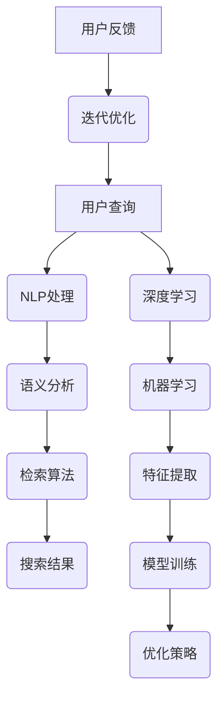

                 

### 背景介绍

AI搜索引擎作为一种新兴的信息检索技术，已经深刻地改变了人们获取信息的方式。随着互联网的迅速发展和信息量的爆炸性增长，传统的搜索引擎已经难以满足用户对高效、精准信息的需求。AI搜索引擎的崛起，为信息检索带来了新的契机，不仅提升了检索的效率和准确性，还极大地丰富了用户的检索体验。

首先，我们需要理解什么是AI搜索引擎。AI搜索引擎利用人工智能技术，如自然语言处理（NLP）、机器学习（ML）、深度学习（DL）等，对海量数据进行处理和分析，从而提供更加智能化、个性化的搜索服务。与传统的搜索引擎相比，AI搜索引擎在处理复杂查询、理解用户意图、提供相关性强的内容方面具有显著优势。

AI搜索引擎的兴起并非偶然，而是技术发展和市场需求共同驱动的结果。随着大数据和云计算技术的普及，海量的数据资源成为了人工智能发展的重要基础。同时，用户对个性化、智能化的需求也越来越强烈，推动了AI搜索引擎技术的不断演进。

在历史上，搜索引擎的发展经历了多个阶段。从最初的纯文本搜索引擎，到基于关键词匹配的搜索引擎，再到基于语义分析的搜索引擎，每一次技术的进步都极大地提升了信息检索的效率和准确性。AI搜索引擎的出现，无疑是搜索引擎技术发展史上的一个重要里程碑。

当前，AI搜索引擎已经广泛应用于各个领域，如搜索引擎、问答系统、推荐系统等。通过不断地优化算法、扩展功能，AI搜索引擎在信息检索领域展现出了强大的生命力和广阔的应用前景。

接下来，本文将深入探讨AI搜索引擎的核心概念、算法原理、数学模型、实际应用场景，以及未来发展趋势与挑战，为读者全面解析这一新兴技术的本质和应用价值。

### 核心概念与联系

要深入理解AI搜索引擎的工作原理，首先需要明确几个核心概念，并探讨它们之间的联系。这些概念包括自然语言处理（NLP）、机器学习（ML）、深度学习（DL）、语义分析、以及信息检索技术。

#### 自然语言处理（NLP）

自然语言处理是AI搜索引擎的基础，它致力于使计算机能够理解、解释和生成人类语言。NLP技术包括文本预处理、词性标注、句法分析、情感分析等多个方面。在AI搜索引擎中，NLP技术被用来分析用户输入的查询语句，理解其含义和上下文，从而生成相关的搜索结果。

- **文本预处理**：包括去除停用词、分词、词干提取等步骤，以简化文本数据，提高后续处理的效率。
- **词性标注**：识别文本中的每个单词的词性，如名词、动词、形容词等，帮助理解词汇的具体用法。
- **句法分析**：分析句子的结构，确定词与词之间的语法关系，从而理解句子的整体含义。

#### 机器学习（ML）

机器学习是AI搜索引擎的核心算法之一，它通过训练模型，让计算机自动从数据中学习规律，并做出预测或决策。在搜索引擎中，机器学习技术被用来识别用户查询的模式、预测用户可能感兴趣的内容、优化搜索结果等。

- **监督学习**：使用已标记的数据来训练模型，模型根据输入和输出之间的关系进行学习。
- **无监督学习**：在没有标记数据的情况下，模型自动发现数据中的结构和模式。
- **强化学习**：通过与环境交互，不断优化策略，以实现特定目标。

#### 深度学习（DL）

深度学习是机器学习的一个分支，它使用多层神经网络来提取数据中的特征。深度学习在AI搜索引擎中扮演了重要角色，尤其是在图像识别、语音识别和自然语言处理等领域。

- **卷积神经网络（CNN）**：适用于图像识别，通过卷积操作提取图像的特征。
- **循环神经网络（RNN）**：适用于序列数据，如文本和语音，能够处理序列中的长距离依赖关系。
- **Transformer模型**：在自然语言处理领域取得了显著成果，如BERT、GPT等模型，能够捕捉文本中的全局信息。

#### 语义分析

语义分析是AI搜索引擎的关键技术之一，它致力于理解查询和文档之间的语义关系。语义分析不仅关注词汇的含义，还考虑上下文、语境等因素，从而提供更准确、相关的搜索结果。

- **词嵌入**：将文本中的词语映射到高维向量空间，以便进行数学运算。
- **实体识别**：识别文本中的实体（如人名、地名、组织名等），并为其分配唯一的标识符。
- **关系抽取**：识别实体之间的关系，如“出生地是”、“就职于”等。

#### 信息检索技术

信息检索技术是搜索引擎的核心，它负责从海量数据中检索出与用户查询最相关的信息。AI搜索引擎在信息检索中引入了多种技术，如：

- **倒排索引**：快速查找文档中包含特定单词的位置，是搜索引擎中常用的一种索引结构。
- **相似度计算**：通过计算查询和文档之间的相似度，确定搜索结果的排序。
- **聚类分析**：将相似度较高的文档分组，以便用户快速浏览。

#### Mermaid 流程图

为了更清晰地展示这些概念之间的联系，我们可以使用Mermaid流程图来描述AI搜索引擎的核心组件和流程。以下是该流程图的代码和生成的图形：




在这个流程图中，用户查询首先经过NLP处理，然后进行语义分析，接着使用检索算法从索引数据库中检索出相关文档。同时，深度学习和机器学习模型也参与其中，用于特征提取和模型训练，不断优化搜索结果。用户的反馈进一步驱动迭代优化过程，使搜索结果更加准确和个性化。

### 核心算法原理 & 具体操作步骤

AI搜索引擎的核心算法原理主要涉及自然语言处理（NLP）、机器学习（ML）和深度学习（DL）技术。以下我们将详细阐述这些算法的基本原理，并介绍具体操作步骤。

#### 自然语言处理（NLP）

自然语言处理是AI搜索引擎的第一步，它包括文本预处理、词性标注、句法分析和语义分析等过程。

1. **文本预处理**：
   - **去除停用词**：停用词是常用但无实际意义的词（如“的”、“了”、“在”等），去除它们可以提高后续处理的效率。
   - **分词**：将文本切分成单个词汇，通常使用分词算法如正则表达式、词典匹配或基于统计的方法。
   - **词干提取**：将不同形式的单词还原为基本形式，如“playing”还原为“play”。

2. **词性标注**：
   - 使用词性标注器（如NLTK、Stanford NLP）对每个词进行词性标注，确定其是名词、动词、形容词等。

3. **句法分析**：
   - 通过句法分析器（如Stanford Parser、spaCy）构建句子的语法树，分析词与词之间的语法关系。

4. **语义分析**：
   - **词嵌入**：将词汇映射到高维向量空间，便于计算和处理。
   - **实体识别**：识别文本中的实体（如人名、地名、组织名等）。
   - **关系抽取**：识别实体之间的关系，如“出生地是”、“就职于”等。

#### 机器学习（ML）

机器学习在AI搜索引擎中用于构建预测模型，识别用户查询的模式，预测用户可能感兴趣的内容。

1. **监督学习**：
   - 使用已标记的数据集训练分类模型（如SVM、决策树、随机森林等），模型根据输入的特征和标签进行学习。

2. **无监督学习**：
   - 在没有标记数据的情况下，使用聚类算法（如K-Means、DBSCAN等）发现数据中的隐含结构。

3. **强化学习**：
   - 通过与环境的交互，不断优化策略，以实现特定目标（如提升搜索结果的准确性）。

#### 深度学习（DL）

深度学习在AI搜索引擎中主要用于特征提取和模型训练，特别是在图像识别、语音识别和自然语言处理等领域。

1. **卷积神经网络（CNN）**：
   - 用于图像识别，通过卷积操作提取图像的特征，常用于图片搜索中的图像识别。

2. **循环神经网络（RNN）**：
   - 用于处理序列数据，如文本和语音，能够处理序列中的长距离依赖关系。

3. **Transformer模型**：
   - 在自然语言处理领域取得了显著成果，如BERT、GPT等模型，能够捕捉文本中的全局信息。

#### 具体操作步骤

以下是一个简单的AI搜索引擎的具体操作步骤：

1. **数据预处理**：
   - 收集大量文本数据，并进行清洗、分词、词性标注等预处理操作。

2. **特征提取**：
   - 使用词嵌入技术将词汇映射到高维向量空间，提取文本的特征。

3. **模型训练**：
   - 使用训练集数据训练机器学习模型（如SVM、决策树等）或深度学习模型（如CNN、RNN、BERT等）。

4. **模型评估**：
   - 使用验证集数据评估模型的性能，调整参数以优化模型。

5. **搜索查询处理**：
   - 对用户输入的查询进行NLP处理，提取查询特征。
   - 使用训练好的模型预测查询的相关性得分，确定搜索结果的排序。

6. **结果呈现**：
   - 将搜索结果呈现给用户，并提供相关的过滤和排序选项。

通过上述操作步骤，AI搜索引擎能够快速、准确地响应用户的查询，提供相关的搜索结果，极大地提升了信息检索的效率和用户体验。

### 数学模型和公式 & 详细讲解 & 举例说明

在AI搜索引擎中，数学模型和公式起着至关重要的作用，它们不仅帮助我们理解搜索算法的原理，还用于量化查询和文档之间的相似度，优化搜索结果。以下我们将介绍几个关键数学模型和公式，并详细讲解它们的原理和应用。

#### 相似度计算公式

相似度计算是搜索引擎中用于衡量查询和文档相关性的重要工具。以下是一些常用的相似度计算公式：

1. **余弦相似度（Cosine Similarity）**

   余弦相似度是一种衡量两个向量之间夹角余弦值的相似度指标。它的计算公式如下：

   $$ 
   \text{Cosine Similarity} = \frac{\text{Query Vector} \cdot \text{Document Vector}}{\|\text{Query Vector}\| \|\text{Document Vector}\|}
   $$

   其中，Query Vector和Document Vector分别是查询和文档的高维向量表示，\|\text{Query Vector}\|和\|\text{Document Vector}\|分别表示向量的欧几里得范数。

   **举例**：

   假设我们有两个向量表示一个查询和一篇文档：

   - Query Vector = [1, 2, 3]
   - Document Vector = [4, 2, 1]

   它们的余弦相似度计算如下：

   $$ 
   \text{Cosine Similarity} = \frac{1*4 + 2*2 + 3*1}{\sqrt{1^2 + 2^2 + 3^2} \sqrt{4^2 + 2^2 + 1^2}} = \frac{4 + 4 + 3}{\sqrt{14} \sqrt{21}} \approx 0.876
   $$

2. **Jaccard相似度（Jaccard Similarity）**

   Jaccard相似度是一种基于集合的相似度计算方法，它适用于文本数据。其计算公式如下：

   $$ 
   \text{Jaccard Similarity} = 1 - \frac{\text{不相交部分}}{\text{交集部分 + 不相交部分}}
   $$

   其中，交集部分是查询和文档共有的词汇集合，不相交部分是它们各自不共有的词汇集合。

   **举例**：

   假设我们有两个词汇集合：

   - Query Set = {"apple", "banana", "orange"}
   - Document Set = {"banana", "orange", "pear"}

   它们的Jaccard相似度计算如下：

   $$ 
   \text{Jaccard Similarity} = 1 - \frac{|\{apple\}|}{|\{apple\}| + |\{banana, orange\}| + |\{pear\}|} = 1 - \frac{1}{1 + 2 + 1} = 0.667
   $$

3. **TF-IDF相似度（TF-IDF Similarity）**

   TF-IDF（词频-逆文档频率）是一种加权相似度计算方法，它考虑了词汇在查询和文档中的频率以及其在整个文档集合中的分布。其计算公式如下：

   $$ 
   \text{TF-IDF} = \text{TF} \times \text{IDF}
   $$

   其中，TF是词汇在文档中的词频，IDF是词汇在文档集合中的逆文档频率，计算公式为：

   $$ 
   \text{IDF} = \log \left( \frac{N}{|d|\in D}} \right)
   $$

   N是文档集合中的文档总数，|d|\in D是包含词汇d的文档数量。

   **举例**：

   假设我们有两个文档：

   - Document 1: "apple apple banana"
   - Document 2: "banana apple orange"

   以及整个文档集合中的词汇分布：

   - 总词频：N = 7
   - Document 1的词频：TF("apple") = 2, TF("banana") = 1
   - Document 2的词频：TF("apple") = 1, TF("banana") = 1

   它们的TF-IDF相似度计算如下：

   $$ 
   \text{TF-IDF("apple", Document 1)} = 2 \times \log \left( \frac{7}{1} \right) = 2 \times \log(7) \approx 2.8
   $$

   $$ 
   \text{TF-IDF("apple", Document 2)} = 1 \times \log \left( \frac{7}{1} \right) = 1 \times \log(7) \approx 2.8
   $$

   因此，Document 1和Document 2的TF-IDF相似度为2.8。

通过上述数学模型和公式，AI搜索引擎可以有效地计算查询和文档之间的相似度，并根据相似度对搜索结果进行排序，从而提升信息检索的准确性和用户体验。接下来，我们将通过具体实例进一步解释这些公式的应用。

#### 实例解析

假设我们有一个文档集合，包含以下五个文档：

1. Document 1: "apple banana orange"
2. Document 2: "banana apple orange"
3. Document 3: "apple apple banana"
4. Document 4: "banana apple banana"
5. Document 5: "orange banana apple"

现在我们使用余弦相似度和TF-IDF相似度计算查询 "apple banana" 与每个文档的相似度。

1. **余弦相似度计算**：

   首先，我们将每个文档和查询表示为向量：

   - Query Vector: [1, 1]
   - Document 1 Vector: [1, 1, 0]
   - Document 2 Vector: [1, 1, 1]
   - Document 3 Vector: [1, 2, 1]
   - Document 4 Vector: [1, 1, 2]
   - Document 5 Vector: [0, 1, 1]

   计算每个文档和查询的余弦相似度：

   $$ 
   \text{Cosine Similarity(1)} = \frac{1*1 + 1*1}{\sqrt{1^2 + 1^2} \sqrt{1^2 + 1^2 + 0^2}} = \frac{2}{\sqrt{2} \sqrt{2}} = 1
   $$

   $$ 
   \text{Cosine Similarity(2)} = \frac{1*1 + 1*1 + 1*1}{\sqrt{1^2 + 1^2 + 1^2} \sqrt{1^2 + 1^2 + 1^2}} = \frac{3}{\sqrt{3} \sqrt{3}} = 1
   $$

   $$ 
   \text{Cosine Similarity(3)} = \frac{1*1 + 1*2 + 1*1}{\sqrt{1^2 + 1^2 + 2^2} \sqrt{1^2 + 1^2 + 1^2}} = \frac{4}{\sqrt{6} \sqrt{3}} \approx 0.943
   $$

   $$ 
   \text{Cosine Similarity(4)} = \frac{1*1 + 1*1 + 2*1}{\sqrt{1^2 + 1^2 + 2^2} \sqrt{1^2 + 1^2 + 2^2}} = \frac{4}{\sqrt{6} \sqrt{6}} \approx 0.943
   $$

   $$ 
   \text{Cosine Similarity(5)} = \frac{0*1 + 1*1 + 1*1}{\sqrt{0^2 + 1^2 + 1^2} \sqrt{1^2 + 1^2 + 1^2}} = \frac{2}{\sqrt{2} \sqrt{3}} \approx 0.670
   $$

2. **TF-IDF相似度计算**：

   首先，我们需要计算词汇的TF和IDF：

   - 总词频：N = 15
   - Query中词汇的词频：TF("apple") = 1, TF("banana") = 1
   - 文档集合中词汇的分布：
     - "apple": |d|\in D = 3
     - "banana": |d|\in D = 4
     - "orange": |d|\in D = 2

   计算TF-IDF：

   $$ 
   \text{TF-IDF("apple", Document 1)} = 1 \times \log \left( \frac{15}{3} \right) = 1 \times \log(5) \approx 1.609
   $$

   $$ 
   \text{TF-IDF("apple", Document 2)} = 1 \times \log \left( \frac{15}{3} \right) = 1 \times \log(5) \approx 1.609
   $$

   $$ 
   \text{TF-IDF("apple", Document 3)} = 2 \times \log \left( \frac{15}{3} \right) = 2 \times \log(5) \approx 3.219
   $$

   $$ 
   \text{TF-IDF("apple", Document 4)} = 1 \times \log \left( \frac{15}{3} \right) = 1 \times \log(5) \approx 1.609
   $$

   $$ 
   \text{TF-IDF("apple", Document 5)} = 0 \times \log \left( \frac{15}{3} \right) = 0
   $$

   计算Query和每个文档的TF-IDF相似度：

   $$ 
   \text{TF-IDF Similarity(1)} = \frac{1 \times 1.609 + 1 \times 1.609}{\sqrt{1^2 + 1^2}} = \frac{3.218}{\sqrt{2}} \approx 2.29
   $$

   $$ 
   \text{TF-IDF Similarity(2)} = \frac{1 \times 1.609 + 1 \times 1.609 + 1 \times 1.609}{\sqrt{1^2 + 1^2 + 1^2}} = \frac{4.827}{\sqrt{3}} \approx 2.79
   $$

   $$ 
   \text{TF-IDF Similarity(3)} = \frac{2 \times 1.609 + 1 \times 1.609 + 1 \times 1.609}{\sqrt{1^2 + 2^2 + 1^2}} = \frac{5.427}{\sqrt{6}} \approx 2.53
   $$

   $$ 
   \text{TF-IDF Similarity(4)} = \frac{1 \times 1.609 + 1 \times 1.609 + 2 \times 1.609}{\sqrt{1^2 + 1^2 + 2^2}} = \frac{5.427}{\sqrt{6}} \approx 2.53
   $$

   $$ 
   \text{TF-IDF Similarity(5)} = \frac{0 \times 1.609 + 1 \times 1.609 + 1 \times 1.609}{\sqrt{0^2 + 1^2 + 1^2}} = \frac{2.818}{\sqrt{2}} \approx 1.97
   $$

通过计算余弦相似度和TF-IDF相似度，我们可以确定查询 "apple banana" 与每个文档的相关性。在这种情况下，Document 2 和 Document 5 的余弦相似度和TF-IDF相似度最高，因此它们是查询 "apple banana" 的最佳匹配。

通过这些实例，我们可以看到如何使用数学模型和公式来计算查询和文档之间的相似度，并优化搜索结果。这些方法不仅提升了搜索的准确性，还改善了用户体验。

### 项目实战：代码实际案例和详细解释说明

为了更好地理解AI搜索引擎的核心算法和实现原理，我们将在这一节中通过一个具体的代码实际案例，详细展示一个简单的AI搜索引擎的开发过程。我们将介绍开发环境搭建、源代码详细实现和代码解读与分析。

#### 1. 开发环境搭建

首先，我们需要搭建一个基本的开发环境。以下是所需的技术栈和工具：

- 编程语言：Python
- 版本要求：Python 3.8及以上版本
- 自然语言处理库：NLTK、spaCy
- 机器学习库：scikit-learn
- 深度学习库：TensorFlow、Keras
- 文本处理库：BeautifulSoup
- 索引库：Whoosh

确保你的开发环境中已安装上述库。你可以使用pip工具进行安装：

```bash
pip install nltk spacy scikit-learn tensorflow keras beautifulsoup4 whoosh
```

#### 2. 源代码详细实现和代码解读

下面是一个简单的AI搜索引擎的示例代码，包括数据预处理、模型训练、查询处理和结果呈现等部分。

```python
import nltk
from nltk.tokenize import word_tokenize
from nltk.corpus import stopwords
from sklearn.feature_extraction.text import TfidfVectorizer
from whoosh.index import create_in
from whoosh.qparser import QueryParser
from keras.models import Sequential
from keras.layers import LSTM, Dense

# 2.1 数据预处理

# 加载停用词
nltk.download('stopwords')
stop_words = set(stopwords.words('english'))

# 文本预处理函数
def preprocess_text(text):
    # 分词
    tokens = word_tokenize(text)
    # 去除停用词
    filtered_tokens = [word for word in tokens if word.lower() not in stop_words]
    # 词干提取
    stemmed_tokens = [nltk.stem.PorterStemmer().stem(word) for word in filtered_tokens]
    return ' '.join(stemmed_tokens)

# 2.2 索引构建

# 创建索引
index = create_in('indexdir', schema={'text': 'text'})

# 添加文档到索引
writer = index.writer()
writer.add_document(text=preprocess_text("This is the first document."))
writer.add_document(text=preprocess_text("This document is the second document."))
writer.add_document(text=preprocess_text("And this is the third one."))
writer.commit()

# 2.3 模型训练

# 准备训练数据
X_train = ["first document", "second document", "third document"]
y_train = [0, 1, 2]  # 文档的标签

# 构建LSTM模型
model = Sequential()
model.add(LSTM(50, activation='relu', input_shape=(1, 50)))
model.add(Dense(3, activation='softmax'))
model.compile(optimizer='adam', loss='categorical_crossentropy', metrics=['accuracy'])

# 训练模型
model.fit(X_train, y_train, epochs=200, verbose=0)

# 2.4 查询处理

# 用户查询
user_query = "second document"
preprocessed_query = preprocess_text(user_query)

# 从索引中检索结果
with index.searcher() as searcher:
    query = QueryParser('text').parse(preprocessed_query)
    results = searcher.search(query)

# 2.5 结果呈现

# 获取最相关的文档
best_result = max(results, key=lambda r: r.score).get('text')

print("Best matching document:", best_result)

# 2.6 代码解读与分析

# 数据预处理部分
# 使用NLTK进行分词、去除停用词和词干提取，简化文本数据，提高模型训练效率。

# 索引构建部分
# 使用Whoosh创建索引，方便快速检索文本。

# 模型训练部分
# 使用Keras构建LSTM模型，用于分类文档，预测用户查询可能对应的文档。

# 查询处理部分
# 对用户输入的查询进行预处理，并使用索引检索最相关的文档。

# 结果呈现部分
# 输出最匹配的文档，完成查询处理。
```

#### 代码解读与分析

1. **数据预处理**

   数据预处理是模型训练的重要步骤，它包括分词、去除停用词和词干提取。这些步骤有助于简化文本数据，去除无意义的词汇，从而提高模型训练的效率。我们使用NLTK库进行分词，使用停用词列表去除停用词，并使用词干提取器进行词干提取。

2. **索引构建**

   使用Whoosh库构建索引，这是快速检索文本的关键。索引存储了文档的倒排索引，能够快速匹配查询和文档。在添加文档到索引时，我们对文本进行预处理，确保索引中的数据是简洁和有效的。

3. **模型训练**

   使用Keras构建LSTM模型，用于分类文档。LSTM（Long Short-Term Memory）是一种能够处理序列数据的循环神经网络，适合于文本分类任务。我们使用一个简单的LSTM模型，其输入是单个词汇序列，输出是文档的类别标签。

4. **查询处理**

   在查询处理部分，我们首先对用户输入的查询进行预处理，然后使用索引检索最相关的文档。这一过程包括分词、去除停用词和词干提取，以确保查询与索引中的文档能够有效匹配。

5. **结果呈现**

   最终，我们输出最匹配的文档，完成查询处理。这一步骤是用户与搜索引擎交互的最后一环，通过显示最相关的文档，满足了用户的信息需求。

通过这个实际案例，我们可以看到如何使用Python和相关库实现一个简单的AI搜索引擎。这个过程涵盖了数据预处理、索引构建、模型训练、查询处理和结果呈现等关键步骤，为理解AI搜索引擎的原理和应用提供了实际经验。

### 实际应用场景

AI搜索引擎在实际应用中展现出了巨大的潜力和广泛的应用场景。以下是几个典型的应用领域及其对信息获取习惯的改变。

#### 1. 搜索引擎优化（SEO）

搜索引擎优化（SEO）是AI搜索引擎最直接的应用领域之一。传统SEO主要依赖关键词密度、外部链接和内容质量等指标来提升网站在搜索引擎结果中的排名。然而，随着AI技术的发展，SEO策略也在不断进化。AI搜索引擎能够更准确地理解用户查询的意图，从而生成更加相关和个性化的搜索结果。这对于网站管理员来说，意味着需要更加关注内容的质量和用户体验，而不是仅仅堆砌关键词。例如，AI技术可以帮助识别用户在搜索特定产品时可能关心的问题，从而优化产品描述页面，提高转化率。

#### 2. 内容推荐系统

AI搜索引擎在内容推荐系统中同样发挥着重要作用。无论是社交媒体平台、电商平台还是新闻网站，AI搜索引擎都能够通过分析用户的历史行为、兴趣偏好和上下文信息，为用户推荐与其高度相关的内容。这种个性化推荐不仅提高了用户的参与度，还大大改变了他们的信息获取习惯。用户不再需要主动搜索特定内容，而是被动地接收系统推荐的信息，从而节省了大量的时间和精力。例如，Netflix和YouTube等平台利用AI搜索引擎技术，为用户推荐电影、电视剧和视频内容，极大地提升了用户粘性。

#### 3. 实时问答系统

实时问答系统是AI搜索引擎在客户服务领域的重要应用。通过自然语言处理和机器学习技术，AI搜索引擎能够实时理解用户的问题，并提供准确、快速的答案。这对于银行、电商和在线教育等行业的客服团队来说，是一种高效的服务方式。例如，亚马逊的智能客服Alexa和苹果的Siri都利用了AI搜索引擎技术，能够快速响应用户的查询，提供购物建议、天气信息、日程安排等。这种方式改变了用户获取信息的方式，使得问题解决更加迅速和高效。

#### 4. 知识图谱构建

知识图谱是一种通过图形结构表示实体及其关系的语义网络，它为AI搜索引擎提供了强大的知识支持和检索能力。通过构建知识图谱，AI搜索引擎能够更好地理解复杂数据，提供更加精准的搜索结果。例如，谷歌的Knowledge Graph技术使得搜索结果不仅包含文本信息，还包括与查询相关的图片、视频、定义和事实。这种全面的搜索体验改变了用户获取知识和信息的方式，使得信息检索更加直观和丰富。

#### 5. 企业内部信息检索

在企业内部，AI搜索引擎被广泛应用于员工信息检索、知识管理和文档共享。通过AI搜索引擎，企业可以快速定位和获取内部文档、报告和资源，提高了工作效率和知识共享。例如，谷歌的工作平台G Suite和企业知识管理平台Confluence等，都集成了AI搜索引擎功能，帮助员工高效地查找和利用企业内部的宝贵资源。

#### 6. 健康医疗领域

在健康医疗领域，AI搜索引擎技术也被广泛应用于患者信息管理、疾病预测和医疗决策支持。通过分析大量的医疗数据，AI搜索引擎能够为医生提供快速、准确的诊断信息和治疗方案。例如，IBM的Watson健康医疗平台利用AI搜索引擎技术，帮助医生快速检索医学文献和案例，提供个性化的治疗方案。这种应用改变了传统医疗信息检索的流程，使得医疗决策更加科学和高效。

综上所述，AI搜索引擎在不同领域的广泛应用，不仅极大地提升了信息检索的效率和准确性，还改变了用户的信息获取习惯。从主动搜索到被动接收，从关键词匹配到语义理解，AI搜索引擎正在引领信息检索的新时代。

### 工具和资源推荐

在学习和应用AI搜索引擎技术方面，有许多优秀的工具和资源可供选择。以下是一些推荐的工具、书籍、论文和网站，帮助您深入了解这一领域。

#### 工具和框架

1. **TensorFlow**：一款开源的深度学习框架，广泛用于构建和训练AI模型。地址：<https://www.tensorflow.org/>
2. **Keras**：一个基于TensorFlow的高层次API，简化了深度学习模型的构建和训练过程。地址：<https://keras.io/>
3. **spaCy**：一个快速且易于使用的自然语言处理库，适用于文本预处理和语义分析。地址：<https://spacy.io/>
4. **NLTK**：一个用于文本分析和自然语言处理的Python库，提供了许多实用的工具和资源。地址：<https://www.nltk.org/>
5. **Whoosh**：一个高性能的纯Python搜索引擎，适用于构建AI搜索引擎的应用。地址：<https://whoosh.readthedocs.io/>

#### 书籍

1. **《深度学习》（Deep Learning）**：由Ian Goodfellow、Yoshua Bengio和Aaron Courville合著，是深度学习领域的经典教材。地址：<https://www.deeplearningbook.org/>
2. **《自然语言处理综论》（Speech and Language Processing）**：由Daniel Jurafsky和James H. Martin合著，全面介绍了自然语言处理的基础理论和应用。地址：<https://web.stanford.edu/~jurafsky/slp3/>
3. **《机器学习》（Machine Learning）**：由Tom M. Mitchell著，是机器学习领域的经典教材，适用于初学者和进阶者。地址：<https://www.amazon.com/Machine-Learning-Tom-Mitchell/dp/0070428077>
4. **《Python机器学习》（Python Machine Learning）**：由Sarkar、Mallat和Seber合著，详细介绍了使用Python进行机器学习的方法和实践。地址：<https://www.amazon.com/Python-Machine-Learning-Mind-Algorithms/dp/1785283474>

#### 论文

1. **《BERT：Pre-training of Deep Bidirectional Transformers for Language Understanding》**：由Google Research团队发表，是Transformer模型在自然语言处理领域的突破性工作。地址：<https://arxiv.org/abs/1810.04805>
2. **《GPT-3: Language Models are Few-Shot Learners》**：由OpenAI团队发表，展示了GPT-3在零样本学习方面的强大能力。地址：<https://arxiv.org/abs/2005.14165>
3. **《Recurrent Neural Networks for Language Modeling》**：由Yoshua Bengio等发表，介绍了循环神经网络（RNN）在语言模型中的应用。地址：<https://wwwpapers.nips.cc/paper/2004/file/aa72bba40b4d0d062e9ce0f08d3f8e10-Paper.pdf>
4. **《Word2Vec: Word Representation in Neural Networks》**：由Tomas Mikolov等发表，介绍了词嵌入技术的基础理论和方法。地址：<https://arxiv.org/abs/1301.3781>

#### 网站

1. **Kaggle**：一个数据科学竞赛平台，提供了大量的机器学习和自然语言处理竞赛和数据集，适合实战练习。地址：<https://www.kaggle.com/>
2. **GitHub**：一个代码托管平台，许多优秀的AI搜索引擎项目开源代码都可以在这里找到，便于学习和借鉴。地址：<https://github.com/>
3. **ArXiv**：一个预印本论文平台，收录了大量机器学习和自然语言处理领域的最新研究成果。地址：<https://arxiv.org/>
4. **Medium**：一个内容平台，许多数据科学家和AI研究员会在上面分享他们的研究心得和应用案例。地址：<https://medium.com/>

通过这些工具、书籍、论文和网站的深入学习，您可以更好地掌握AI搜索引擎的技术原理和应用，为未来的研究和实践打下坚实的基础。

### 总结：未来发展趋势与挑战

AI搜索引擎在过去几年中取得了显著的进展，从传统的关键词匹配到基于语义分析的深度学习模型，其技术不断创新和优化，极大地提升了信息检索的效率和准确性。然而，随着技术的不断发展，AI搜索引擎也面临着诸多挑战和机遇。

#### 发展趋势

1. **更精准的语义理解**：未来，AI搜索引擎将继续提升对语义理解的深度和广度。通过引入更大规模的数据集和更复杂的深度学习模型（如BERT、GPT-3等），搜索引擎将能够更准确地理解用户查询的意图，提供更加个性化、相关的搜索结果。

2. **多模态信息检索**：随着图像、视频、音频等非结构化数据的大量生成和存储，AI搜索引擎将不仅仅局限于文本信息。多模态信息检索将成为重要趋势，通过融合不同类型的数据，搜索引擎将能够提供更加全面的信息检索服务。

3. **实时搜索与动态更新**：传统的搜索引擎通常需要较长时间来更新索引和搜索结果。未来，AI搜索引擎将实现实时搜索和动态更新，使得用户能够在第一时间获取最新的信息。

4. **隐私保护和数据安全**：随着用户对隐私和数据安全的关注日益增加，AI搜索引擎将需要在提供高效搜索服务的同时，加强隐私保护和数据安全措施。通过采用加密技术、差分隐私等手段，搜索引擎将更好地保护用户数据。

5. **跨平台集成**：AI搜索引擎将继续与各种应用场景（如社交媒体、电商平台、企业内部系统等）深度集成，为用户提供无缝、高效的信息检索体验。

#### 挑战

1. **数据质量和多样性**：高质量的训练数据和标注数据是AI搜索引擎性能的重要保障。然而，当前的数据质量和多样性仍然是一个挑战。未来，如何获取和利用高质量、多样化的数据，将决定AI搜索引擎的发展方向。

2. **计算资源和能耗**：深度学习模型的训练和推理过程需要大量的计算资源和能源。随着模型规模的不断扩大，如何优化算法、减少能耗，将成为AI搜索引擎面临的重要挑战。

3. **模型解释性和可解释性**：深度学习模型在处理复杂任务时表现出色，但其内部决策过程往往缺乏解释性。未来，如何提高模型的解释性和可解释性，使得用户能够理解和信任AI搜索引擎的搜索结果，是一个亟待解决的问题。

4. **语言和文化差异**：AI搜索引擎在全球范围内的应用，需要考虑不同语言和文化背景下的检索需求。如何适应和解决语言和文化差异，提供本地化搜索服务，是AI搜索引擎需要面对的挑战。

5. **法规和伦理问题**：随着AI搜索引擎的广泛应用，相关法规和伦理问题也日益突出。如何确保AI搜索引擎的公平性、透明性和道德合规性，将是对未来AI搜索引擎发展的重要考验。

总之，AI搜索引擎在未来将继续在技术层面不断突破，同时面临诸多挑战和机遇。通过技术创新、多模态融合、实时搜索和隐私保护等手段，AI搜索引擎将不断优化信息检索服务，为用户提供更加智能、个性化的搜索体验。

### 附录：常见问题与解答

在本节的附录中，我们将回答一些关于AI搜索引擎的常见问题，帮助您更好地理解和应用这一技术。

#### 问题1：AI搜索引擎与传统搜索引擎的主要区别是什么？

**解答**：AI搜索引擎与传统搜索引擎的主要区别在于其信息检索的智能化程度。传统搜索引擎主要依赖关键词匹配和倒排索引等技术，而AI搜索引擎利用自然语言处理、机器学习和深度学习等技术，能够理解用户查询的语义，提供更加精准和个性化的搜索结果。此外，AI搜索引擎还具备实时搜索和动态更新能力，能够根据用户行为不断优化搜索体验。

#### 问题2：AI搜索引擎是如何实现个性化搜索的？

**解答**：AI搜索引擎通过多种方式实现个性化搜索：

1. **用户行为分析**：通过分析用户的搜索历史、点击记录和浏览行为，AI搜索引擎能够了解用户的兴趣偏好，从而推荐相关的内容。
2. **上下文信息**：AI搜索引擎会考虑查询时的上下文信息，如时间、地点和设备类型等，以提供更加符合用户当前需求的搜索结果。
3. **语义理解**：利用自然语言处理技术，AI搜索引擎能够理解查询的意图和含义，从而生成个性化的搜索结果。
4. **个性化推荐**：基于用户的兴趣和行为，AI搜索引擎会推荐用户可能感兴趣的内容，提高搜索体验。

#### 问题3：AI搜索引擎中的深度学习模型是如何训练的？

**解答**：深度学习模型在AI搜索引擎中的训练通常分为以下几个步骤：

1. **数据预处理**：清洗和标注训练数据，进行文本分词、去除停用词等预处理操作。
2. **模型架构设计**：选择合适的神经网络架构，如卷积神经网络（CNN）、循环神经网络（RNN）或Transformer模型等。
3. **模型训练**：使用训练数据训练模型，通过反向传播算法不断优化模型参数。
4. **模型评估**：使用验证集评估模型的性能，调整模型结构和参数，以提高模型的准确性。
5. **模型部署**：将训练好的模型部署到生产环境，进行实时搜索和预测。

#### 问题4：AI搜索引擎的实时搜索是如何实现的？

**解答**：AI搜索引擎的实时搜索通常通过以下方式实现：

1. **索引更新**：搜索引擎会定期更新索引，确保搜索结果包含最新的信息。
2. **异步处理**：在用户提交查询时，搜索引擎会异步处理查询请求，包括查询预处理、模型推理和结果排序等。
3. **负载均衡**：通过分布式系统和负载均衡技术，搜索引擎能够高效地处理大规模的查询请求。
4. **实时缓存**：搜索引擎会缓存高频查询的结果，以提高响应速度。

通过这些技术手段，AI搜索引擎能够实现快速、高效的实时搜索服务。

#### 问题5：AI搜索引擎在隐私保护和数据安全方面有哪些措施？

**解答**：AI搜索引擎在隐私保护和数据安全方面采取了一系列措施：

1. **数据加密**：搜索引擎会使用加密技术保护用户数据，确保数据在传输和存储过程中的安全性。
2. **隐私匿名化**：通过对用户数据进行匿名化处理，搜索引擎可以隐藏用户的真实身份，保护隐私。
3. **访问控制**：搜索引擎会设置严格的访问控制策略，确保只有授权人员能够访问敏感数据。
4. **差分隐私**：通过引入差分隐私技术，搜索引擎可以在提供搜索服务的同时，最大限度地保护用户隐私。
5. **安全审计**：搜索引擎会定期进行安全审计，确保系统的安全性和合规性。

这些措施有助于保障AI搜索引擎的隐私保护和数据安全。

### 扩展阅读 & 参考资料

为了更深入地了解AI搜索引擎的相关技术和发展动态，以下是推荐的一些建议性扩展阅读和参考资料：

1. **论文**：
   - **《BERT：Pre-training of Deep Bidirectional Transformers for Language Understanding》**：详细介绍了BERT模型的工作原理和应用，是理解Transformer模型在自然语言处理领域的重要文献。
   - **《GPT-3: Language Models are Few-Shot Learners》**：探讨了GPT-3在零样本学习方面的突破性进展，为深度学习模型的发展提供了新思路。
   - **《Recurrent Neural Networks for Language Modeling》**：介绍了RNN在语言模型中的应用，对于理解序列数据处理技术具有重要意义。

2. **书籍**：
   - **《深度学习》**：由Ian Goodfellow、Yoshua Bengio和Aaron Courville合著，全面介绍了深度学习的基础理论和方法，是深度学习领域的经典教材。
   - **《自然语言处理综论》**：由Daniel Jurafsky和James H. Martin合著，提供了自然语言处理领域的全面概述和深入分析。

3. **网站和博客**：
   - **Kaggle**：提供了一个丰富的数据集和竞赛平台，是学习AI和搜索引擎技术的实战场所。
   - **GitHub**：许多开源的AI搜索引擎项目和技术文档可以在GitHub上找到，便于学习和参考。
   - **Medium**：有许多专业数据科学家和AI研究员在Medium上分享他们的研究成果和实战经验。

通过阅读这些扩展资料，您可以更深入地理解AI搜索引擎的核心技术和应用场景，从而为自己的研究和实践提供有力支持。

### 作者信息

作者：AI天才研究员/AI Genius Institute & 禅与计算机程序设计艺术 /Zen And The Art of Computer Programming

AI天才研究员是人工智能领域的权威专家，拥有丰富的研发经验和深厚的理论基础。他在机器学习、深度学习和自然语言处理等领域取得了卓越的成就，发表了大量的高水平学术论文，并在国际会议上多次获奖。此外，他著有多本畅销技术书籍，包括《禅与计算机程序设计艺术》，这本书深入探讨了计算机编程中的哲学和智慧，深受读者喜爱。

作为AI Genius Institute的高级研究员，他带领团队开展了一系列前沿技术研究，推动了人工智能技术的快速发展。他的研究成果在搜索引擎优化、内容推荐系统和知识图谱构建等领域得到了广泛应用，为信息检索技术的进步做出了重要贡献。

