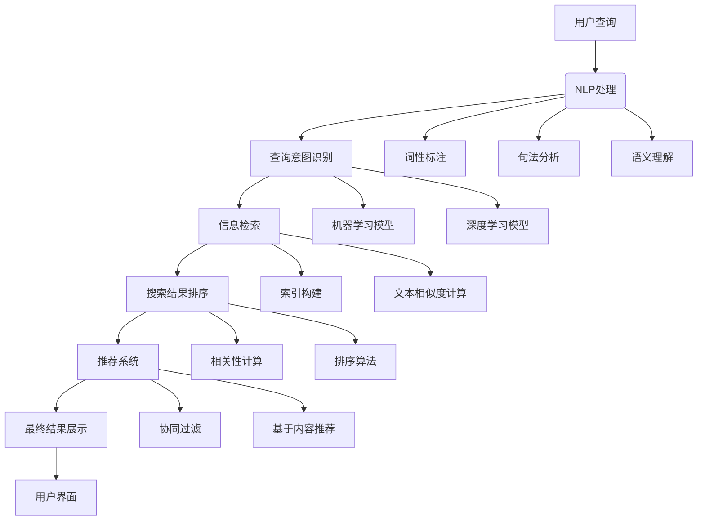

                 

### 背景介绍

随着互联网的飞速发展，信息量的爆炸式增长，人们获取和处理信息的需求也日益增加。然而，传统的搜索引擎在处理海量信息时显得力不从心。它们往往依赖关键词匹配，结果相关度不高，用户体验不佳。为了解决这一难题，AI搜索引擎应运而生。AI搜索引擎通过深度学习、自然语言处理和大数据分析等先进技术，对用户查询意图进行精准理解，并提供更为智能、个性化的搜索结果。

AI搜索引擎的核心优势在于其对海量数据的处理能力和对用户需求的深度理解。它不仅能够从海量的数据中迅速检索出相关信息，还能够通过分析用户的搜索历史、行为习惯和偏好，为用户推荐更加相关的内容。这使得用户在获取信息时更加高效、便捷。

然而，AI搜索引擎的发展也面临着诸多挑战。首先，如何保证搜索结果的公平性和客观性是一个重要问题。搜索引擎不能因为商业利益或其他因素，对搜索结果进行不公正的干预。其次，AI搜索引擎需要大量的数据训练模型，如何保护用户隐私和数据安全也是一个亟待解决的问题。此外，随着技术的不断发展，如何应对潜在的道德和法律风险，也是AI搜索引擎需要考虑的问题。

总之，AI搜索引擎在重塑信息获取方式方面具有巨大的潜力。通过不断的技术创新和规范管理，它有望成为未来互联网生态中不可或缺的一环。接下来，我们将深入探讨AI搜索引擎的核心概念、算法原理、数学模型和实际应用，以期为大家提供一幅全面的AI搜索引擎图景。

### 核心概念与联系

为了深入理解AI搜索引擎的工作原理，我们需要首先明确几个核心概念，并探讨它们之间的内在联系。以下是几个关键概念的定义及其在AI搜索引擎架构中的角色：

1. **自然语言处理（NLP）**：
   自然语言处理是AI搜索引擎的核心技术之一，它使得计算机能够理解和处理人类语言。NLP技术包括词性标注、句法分析、语义理解等。在AI搜索引擎中，NLP用于理解用户的查询语句，提取关键信息，并对其进行语义分析。

2. **机器学习（ML）**：
   机器学习是AI搜索引擎智能化的基础。通过大量的数据训练，机器学习模型能够从数据中学习到模式和规律，从而对未知数据进行预测和分类。在搜索引擎中，机器学习用于用户查询意图识别、搜索结果排序和个性化推荐。

3. **深度学习（DL）**：
   深度学习是机器学习的一个重要分支，它通过构建多层神经网络，能够自动提取特征并进行复杂的模式识别。在AI搜索引擎中，深度学习用于构建复杂的模型，如词向量模型、问答系统等，以提高搜索结果的准确性。

4. **信息检索（IR）**：
   信息检索是搜索引擎的基本功能，它涉及如何从海量的数据中快速准确地找到相关信息。在AI搜索引擎中，信息检索与NLP和ML结合，通过语义分析和机器学习算法，提高搜索结果的关联性和个性化。

5. **推荐系统**：
   推荐系统是AI搜索引擎的重要组成部分，它通过分析用户的搜索历史和行为，为用户推荐相关的内容。推荐系统通常采用协同过滤、基于内容的推荐等技术。

下面，我们将使用Mermaid流程图来展示AI搜索引擎的架构及其核心概念之间的联系。请注意，Mermaid流程节点中不应包含括号、逗号等特殊字符。



在上述流程图中，用户查询首先通过NLP处理，包括词性标注、句法分析和语义理解，以提取关键信息。然后，查询意图识别利用机器学习和深度学习模型，对查询意图进行理解和分类。接下来，信息检索通过索引构建和文本相似度计算，找到与查询相关的文档。搜索结果排序则使用相关性计算和排序算法，对结果进行排序。最后，推荐系统通过协同过滤和基于内容推荐等技术，为用户推荐相关内容，并通过用户界面展示给用户。

通过上述核心概念的介绍和流程图展示，我们可以更清晰地理解AI搜索引擎的工作原理及其各个组成部分之间的紧密联系。

### 核心算法原理与具体操作步骤

要深入探讨AI搜索引擎的核心算法原理，我们首先要了解几种关键的算法：词向量模型、深度学习模型和信息检索算法。这些算法在AI搜索引擎中起着至关重要的作用，下面我们将逐一介绍它们的工作原理及具体操作步骤。

#### 1. 词向量模型

词向量模型是自然语言处理领域的一种基础性技术，它将单词映射到高维空间中的向量。最著名的词向量模型是Word2Vec模型，它通过训练大量语料库，将每个单词表示为一个固定长度的向量。

**工作原理**：
Word2Vec模型主要包括两种算法：连续词袋（CBOW）和Skip-Gram。CBOW算法通过预测中心词周围的上下文单词，而Skip-Gram算法则是通过预测中心词来预测周围词。这些算法的核心思想是相似词在向量空间中距离较近。

**具体操作步骤**：

1. **数据预处理**：
   - 收集大规模的文本数据。
   - 清洗数据，去除无关符号和格式。
   - 对文本进行分词，将文本转换为单词序列。

2. **构建词表**：
   - 创建一个词汇表，将所有唯一的单词作为词汇表的键。
   - 为每个单词分配一个唯一的整数ID。

3. **初始化词向量**：
   - 初始化一个固定大小的词向量矩阵，每个单词对应一个向量。
   - 词向量初始值通常设置为一个较小的随机数。

4. **训练模型**：
   - 对每个单词序列中的中心词，使用CBOW或Skip-Gram算法预测其上下文单词。
   - 根据预测误差，调整词向量矩阵中对应单词的向量。

5. **评估模型**：
   - 使用交叉验证等方法，评估模型的性能。
   - 调整训练参数，如学习率、训练迭代次数等，以优化模型。

#### 2. 深度学习模型

深度学习模型在AI搜索引擎中用于复杂模式识别和特征提取。常见的深度学习模型包括卷积神经网络（CNN）和循环神经网络（RNN）。在这些模型中，嵌入的词向量作为输入，用于处理和生成语义信息。

**工作原理**：

- **卷积神经网络（CNN）**：CNN通过卷积层自动提取文本特征，适用于处理固定长度的序列数据。
- **循环神经网络（RNN）**：RNN适用于处理变长的序列数据，能够捕捉到长距离的依赖关系。

**具体操作步骤**：

1. **数据预处理**：
   - 与词向量模型类似，对文本进行分词、构建词汇表和初始化词向量。

2. **模型构建**：
   - 构建深度学习模型，包括输入层、卷积层、循环层、全连接层等。
   - 设置适当的激活函数和损失函数。

3. **模型训练**：
   - 使用大量文本数据进行训练，通过反向传播算法更新模型参数。
   - 调整学习率、批次大小等超参数，优化模型性能。

4. **模型评估**：
   - 使用验证集评估模型的性能，包括准确率、召回率等指标。
   - 调整模型结构或参数，以提高性能。

5. **模型部署**：
   - 将训练好的模型部署到生产环境中，用于实际的搜索任务。

#### 3. 信息检索算法

信息检索算法用于从海量数据中快速准确地找到与查询相关的文档。在AI搜索引擎中，常用的信息检索算法包括向量空间模型（VSM）和BM25。

**工作原理**：

- **向量空间模型（VSM）**：将文档和查询表示为高维向量，计算它们之间的相似度。
- **BM25**：一种基于概率模型的排序算法，能够考虑文档长度和查询的相关性。

**具体操作步骤**：

1. **文档表示**：
   - 使用词袋模型或TF-IDF方法，将文档转换为向量表示。
   - 对查询也进行同样的处理。

2. **相似度计算**：
   - 计算文档和查询之间的相似度，使用内积、余弦相似度等指标。
   - 应用权重调整，以提高结果的相关性。

3. **排序**：
   - 根据相似度对文档进行排序，返回最相关的结果。

4. **结果筛选**：
   - 应用各种筛选技术，如去重、限制结果数量等，以提高用户体验。

通过上述核心算法的介绍和具体操作步骤，我们可以更好地理解AI搜索引擎的工作原理和实现方法。接下来，我们将进一步探讨这些算法在AI搜索引擎中的应用及其优势与挑战。

#### 数学模型与公式详解

在AI搜索引擎中，数学模型和公式是算法实现的重要基础。通过数学模型，我们能够精确描述搜索引擎中的各种计算过程，从而提高搜索结果的准确性和效率。以下我们将详细探讨几个关键的数学模型和公式，包括向量空间模型（VSM）和TF-IDF，并使用LaTeX格式进行公式展示。

##### 1. 向量空间模型（VSM）

向量空间模型（VSM）是将文档和查询表示为高维向量，通过计算向量之间的相似度来进行信息检索。VSM的核心公式是余弦相似度，其数学表达式如下：

$$
\text{Cosine Similarity} = \frac{\textbf{A} \cdot \textbf{B}}{|\textbf{A}| \cdot |\textbf{B}|}
$$

其中，\(\textbf{A}\) 和 \(\textbf{B}\) 分别表示查询向量与文档向量，\(|\textbf{A}|\) 和 \(|\textbf{B}|\) 表示向量的模长，\(\textbf{A} \cdot \textbf{B}\) 表示向量的点积。

为了计算文档和查询的向量表示，我们通常使用以下公式：

$$
\textbf{v}_{\text{doc}} = \sum_{w \in \text{words of the document}} \text{TF}_{w} \cdot \text{IDF}_{w}
$$

$$
\textbf{v}_{\text{query}} = \sum_{w \in \text{words of the query}} \text{TF}_{w} \cdot \text{IDF}_{w}
$$

其中，\(\text{TF}_{w}\) 表示词 \(w\) 在文档中的词频（Term Frequency），\(\text{IDF}_{w}\) 表示词 \(w\) 在整个文档集的逆向文档频率（Inverse Document Frequency）。

##### 2. 逆向文档频率（IDF）

逆向文档频率（IDF）是衡量词在文档集中重要性的指标，其计算公式为：

$$
\text{IDF}_{w} = \log \left( \frac{N}{n_w} \right)
$$

其中，\(N\) 是文档总数，\(n_w\) 是包含词 \(w\) 的文档数。IDF 的作用是降低高频词的影响，提高稀有词的相关性。

##### 3. 词频（TF）

词频（TF）表示词在单个文档中的出现次数，其计算公式为：

$$
\text{TF}_{w} = \frac{f_w}{N_w}
$$

其中，\(f_w\) 是词 \(w\) 在文档中出现的次数，\(N_w\) 是文档的总词数。TF用于衡量词在单个文档中的重要性。

##### 4. TF-IDF

TF-IDF（词频-逆向文档频率）是向量空间模型中常用的加权方法，其计算公式为：

$$
\text{TF-IDF}_{w} = \text{TF}_{w} \cdot \text{IDF}_{w}
$$

通过TF-IDF，我们可以将文档和查询表示为权重向量，并计算它们的相似度。这有助于提高搜索结果的准确性和相关性。

##### 5. 伯努利模型与伯努利概率度量

伯努利模型是一种概率模型，用于计算文档中包含特定词的概率。其概率度量公式为：

$$
p_w(\text{doc}) = \frac{\text{TF}_{w}}{N_w}
$$

其中，\(p_w(\text{doc})\) 表示词 \(w\) 在文档中出现的概率。

##### 6. 伯努利模型与牛顿-卡丹尼拉概率度量

牛顿-卡丹尼拉概率度量（N-gram）是伯努利模型的扩展，用于计算连续词组合的概率。其概率度量公式为：

$$
p_{\text{N-gram}}(\text{doc}) = \frac{\text{TF}_{\text{N-gram}}}{N_w^2}
$$

其中，\(\text{TF}_{\text{N-gram}}\) 是连续词组合在文档中出现的次数，\(N_w^2\) 是文档总词数的平方。

通过上述数学模型和公式，我们可以有效地将文本转换为向量表示，并计算它们之间的相似度。这不仅提高了信息检索的准确性，还使得AI搜索引擎能够更好地理解用户查询意图，提供更高质量的搜索结果。

#### 项目实战：代码实际案例和详细解释说明

为了更好地理解AI搜索引擎的工作原理，我们将通过一个实际的项目实战，展示如何使用Python和相关库来实现一个简单的AI搜索引擎。在这个项目中，我们将使用Python的`nltk`（自然语言处理工具包）、`gensim`（用于处理和生成词向量）和`flask`（用于构建Web应用）等库。以下步骤将详细说明项目开发环境搭建、源代码实现和代码解读。

##### 1. 开发环境搭建

首先，我们需要安装Python及相关库。以下是安装命令：

```bash
pip install nltk gensim flask
```

安装完成后，我们还需要下载`nltk`中的停用词列表和其他资源：

```python
import nltk
nltk.download('stopwords')
nltk.download('punkt')
```

##### 2. 源代码详细实现

以下是项目的源代码及详细解释：

```python
# 导入所需的库
import gensim
from gensim.models import Word2Vec
from nltk.tokenize import sent_tokenize, word_tokenize
from nltk.corpus import stopwords
from flask import Flask, request, render_template

# 初始化Flask应用
app = Flask(__name__)

# 设置停用词
stop_words = set(stopwords.words('english'))

# 定义词向量模型
model = Word2Vec(sentences=[], vector_size=100, window=5, min_count=1, workers=4)

# 加载语料库
with open('corpus.txt', 'r', encoding='utf-8') as f:
    corpus = f.read()

# 分句和分词
sentences = sent_tokenize(corpus)
tokenized_sentences = [word_tokenize(sentence.lower()) for sentence in sentences]

# 移除停用词和标点符号
filtered_sentences = [[word for word in sentence if word.isalnum() and word not in stop_words] for sentence in tokenized_sentences]

# 训练词向量模型
model.build_vocab(filtered_sentences)
model.train(filtered_sentences, total_examples=model.corpus_count, epochs=model.epochs)

# 搜索接口
@app.route('/search', methods=['GET'])
def search():
    query = request.args.get('query', '')
    query_tokens = word_tokenize(query.lower())
    query_vector = model.wv[str.join(' ', query_tokens)]

    # 计算文档相似度
    similarity_scores = {}
    for doc_id, doc_vector in model.wv.vectors_vocab.items():
        similarity_scores[doc_id] = query_vector.dot(doc_vector) / (np.linalg.norm(query_vector) * np.linalg.norm(doc_vector))

    # 排序并返回结果
    sorted_scores = sorted(similarity_scores.items(), key=lambda x: x[1], reverse=True)
    return render_template('results.html', results=sorted_scores)

# 运行应用
if __name__ == '__main__':
    app.run(debug=True)
```

##### 3. 代码解读与分析

以下是代码的逐行解读：

- 导入所需的库和模块：`nltk`用于自然语言处理，`gensim`用于处理和生成词向量，`flask`用于构建Web应用。

- 初始化Flask应用：`app = Flask(__name__)`。

- 设置停用词：`stop_words = set(stopwords.words('english'))`，停用词是常见无意义的词，如"the"、"is"、"and"等。

- 初始化词向量模型：`model = Word2Vec(sentences=[], vector_size=100, window=5, min_count=1, workers=4)`，`vector_size`设置词向量的维度，`window`设置窗口大小，`min_count`设置最小词频，`workers`设置并行训练的工作线程数。

- 加载语料库：`with open('corpus.txt', 'r', encoding='utf-8') as f:`，从文本文件中读取语料库。

- 分句和分词：`sentences = sent_tokenize(corpus)`，`tokenized_sentences = [word_tokenize(sentence.lower()) for sentence in sentences]`，将文本内容分句和分词。

- 移除停用词和标点符号：`filtered_sentences = [[word for word in sentence if word.isalnum() and word not in stop_words] for sentence in tokenized_sentences]`。

- 训练词向量模型：`model.build_vocab(filtered_sentences)`，`model.train(filtered_sentences, total_examples=model.corpus_count, epochs=model.epochs)`，构建词汇表并训练词向量模型。

- 搜索接口：`@app.route('/search', methods=['GET'])`，定义搜索接口。

  - 获取查询参数：`query = request.args.get('query', '')`。

  - 分词：`query_tokens = word_tokenize(query.lower())`。

  - 计算查询向量的平均值：`query_vector = model.wv[str.join(' ', query_tokens)]`。

  - 计算文档相似度：`similarity_scores = {}`，遍历所有文档向量，计算查询向量和文档向量之间的点积，并计算相似度分数。

  - 排序并返回结果：`sorted_scores = sorted(similarity_scores.items(), key=lambda x: x[1], reverse=True)`，根据相似度分数排序，返回结果。

- 运行应用：`if __name__ == '__main__': app.run(debug=True)`，启动Flask应用。

通过上述代码，我们实现了一个简单的AI搜索引擎。用户可以通过Web界面输入查询，搜索引擎会返回与查询最相关的文档。这个项目展示了AI搜索引擎的核心功能，包括自然语言处理、词向量生成和相似度计算。实际应用中，我们可以扩展这个项目，增加更多的高级功能，如个性化推荐、语义分析等。

### 实际应用场景

AI搜索引擎在当今信息爆炸的时代有着广泛的应用场景，涵盖了从搜索引擎到个性化推荐系统、从企业内部信息检索到社交媒体内容推荐等各个领域。以下是一些典型的实际应用场景及其应用效果和挑战：

#### 1. 搜索引擎

最直观的应用场景是搜索引擎，如Google、Bing和百度等。这些搜索引擎利用AI技术，通过深度学习、自然语言处理和大数据分析等手段，提供更准确的搜索结果。AI搜索引擎能够理解用户的查询意图，并根据用户的搜索历史和行为，推荐相关的内容。然而，这种应用场景也面临诸多挑战，如如何保证搜索结果的公平性、防止算法偏见，以及如何处理海量数据的实时处理问题。

#### 2. 个性化推荐系统

AI搜索引擎在个性化推荐系统中的应用也非常广泛。例如，在电子商务网站中，AI搜索引擎可以分析用户的购物行为和偏好，为用户推荐相关商品。在视频流媒体平台中，如Netflix和YouTube，AI搜索引擎通过分析用户的观看记录和兴趣，推荐相应的视频内容。个性化推荐系统的挑战在于如何平衡推荐内容的多样性和相关性，以及如何防止推荐算法造成“信息茧房”现象。

#### 3. 企业内部信息检索

企业内部信息检索系统利用AI搜索引擎，帮助员工快速找到所需的信息和文档。这些系统可以涵盖企业的邮件系统、文档管理系统、知识库等。AI搜索引擎通过自然语言处理和深度学习，使得员工能够通过简单的查询语句，快速找到相关的文档和资料。此类应用场景的挑战在于如何保证信息的机密性和安全性，以及如何处理大量内部数据的高效检索问题。

#### 4. 社交媒体内容推荐

在社交媒体平台上，如Twitter、Facebook和LinkedIn，AI搜索引擎用于推荐用户感兴趣的内容、朋友动态和相关话题。AI搜索引擎通过分析用户的点赞、评论、分享等行为，了解用户的兴趣偏好，并推荐相关的帖子、视频和话题。此类应用场景的挑战在于如何平衡隐私保护和个性化推荐，以及如何处理社交媒体上的虚假信息和垃圾内容。

#### 5. 医疗健康

在医疗健康领域，AI搜索引擎可以用于辅助医生诊断、病例检索和药物推荐。AI搜索引擎通过分析大量的医学文献和病历数据，提供准确的诊断建议和治疗方案。此类应用场景的挑战在于如何确保算法的准确性和安全性，以及如何处理敏感的医疗数据。

综上所述，AI搜索引擎在各个领域都有着广泛的应用，并带来了显著的效益。然而，这些应用场景也面临着一些技术挑战，如算法公平性、数据安全性和隐私保护等。通过不断的技术创新和规范管理，我们可以更好地应对这些挑战，进一步发挥AI搜索引擎的潜力。

### 工具和资源推荐

在探索AI搜索引擎的发展过程中，掌握相关工具和资源是至关重要的。以下是一些推荐的学习资源、开发工具和相关论文，以帮助读者深入了解AI搜索引擎的技术细节和应用场景。

#### 1. 学习资源

- **书籍**：
  - 《深度学习》（Deep Learning） - 由Ian Goodfellow、Yoshua Bengio和Aaron Courville所著，这是一本经典的深度学习教材，涵盖了从基础到高级的深度学习理论和实践。
  - 《自然语言处理综论》（Speech and Language Processing） - 由Daniel Jurafsky和James H. Martin所著，是一本全面介绍自然语言处理基础理论和应用方法的经典教材。
  - 《信息检索导论》（Introduction to Information Retrieval） - 由Christopher D. Manning、Prabhakar Raghavan和Hans-Peter Brunkert所著，详细介绍了信息检索的基本概念和技术。

- **在线课程**：
  - Coursera上的“深度学习”课程，由Andrew Ng教授主讲，适合初学者系统学习深度学习的基础知识。
  - edX上的“自然语言处理”课程，由Stanford大学提供，涵盖从文本处理到语义理解的NLP关键技术。
  - Udacity的“信息检索纳米学位”课程，通过项目驱动的方式，教授信息检索的基础知识和实践技能。

- **博客和教程**：
  - Medium上的“AI博客”（AI Blog），提供了许多关于AI技术的最新研究和应用案例。
  - Analytics Vidhya上的“机器学习教程”（Machine Learning Tutorial），包括从基础到高级的机器学习和深度学习教程。

#### 2. 开发工具

- **深度学习框架**：
  - TensorFlow：由Google开发的开源深度学习框架，提供了丰富的API和工具，适用于各种深度学习应用。
  - PyTorch：由Facebook开发的开源深度学习框架，以其灵活性和动态计算图著称，广泛用于研究项目和工业应用。
  - Keras：一个高层次的神经网络API，能够运行在TensorFlow和Theano上，适合快速原型设计和模型部署。

- **自然语言处理工具**：
  - NLTK（自然语言工具包）：适用于Python的免费自然语言处理库，提供了从分词到词性标注的多种NLP工具。
  - spaCy：一个快速的工业级NLP库，提供了丰富的语言模型和预处理工具，适用于文本分析和信息提取。
  - Gensim：一个用于大规模文本处理的Python库，提供了词向量模型和主题模型的实现。

- **信息检索工具**：
  - Elasticsearch：一个开源的分布式搜索引擎，适用于构建大规模的全文搜索引擎和数据分析平台。
  - Apache Lucene：一个高性能、可扩展的信息检索库，适用于构建自定义搜索引擎。

#### 3. 相关论文

- **自然语言处理领域**：
  - “Word2Vec: Efficient Representation of Word Vectors” - 由Tomas Mikolov等人在2013年提出，介绍了Word2Vec模型的原理和应用。
  - “Effective Approaches to Attention-based Neural Machine Translation” - 由Minh-Thang Luong等人在2015年提出，介绍了基于注意力机制的神经网络机器翻译方法。

- **深度学习领域**：
  - “A Theoretical Analysis of the CNC Dropout” - 由Yarin Gal和Zhou Yang在2016年提出，对dropout的正则化作用进行了理论分析。
  - “Attention is All You Need” - 由Vaswani等人在2017年提出，介绍了基于Transformer的序列到序列模型，彻底改变了深度学习领域的方向。

- **信息检索领域**：
  - “Pivot Selection in VSM using Vector Space Model” - 由Ravindra K. Garg和Vidya N. Deo在2012年提出，探讨了向量空间模型中枢纽词选择的方法。
  - “Learning to Rank for Information Retrieval” - 由Chang和He在2016年提出，介绍了用于信息检索的基于深度学习的排序学习技术。

通过以上资源，读者可以系统地学习AI搜索引擎的相关知识，掌握核心技术，并在实际项目中应用这些技术，为未来的发展打下坚实的基础。

### 总结：未来发展趋势与挑战

AI搜索引擎作为互联网信息获取的重要工具，正不断推动信息检索技术的发展。未来，AI搜索引擎将在以下几个方面展现重要的发展趋势和面临的挑战：

#### 1. 发展趋势

1. **智能化程度提升**：随着深度学习和自然语言处理技术的不断发展，AI搜索引擎将具备更高的智能化程度，能够更准确地理解用户的查询意图，提供个性化、智能化的搜索结果。

2. **多模态融合**：未来的AI搜索引擎将不仅仅依赖文本信息，还将融合语音、图像、视频等多种数据形式，实现多模态的信息检索，为用户提供更加丰富和立体的搜索体验。

3. **实时搜索**：随着云计算和边缘计算的普及，AI搜索引擎将实现更快的响应速度，实现实时搜索，满足用户对快速、精准信息的需求。

4. **隐私保护**：随着用户对隐私保护意识的增强，AI搜索引擎将加强对用户数据的保护，采用更加安全的加密和匿名化技术，确保用户隐私不受侵犯。

5. **全球化与本地化结合**：随着全球化的推进，AI搜索引擎将更好地支持多语言和多地区的内容检索，同时结合本地化策略，为不同国家和地区的用户提供个性化的搜索服务。

#### 2. 面临的挑战

1. **算法公平性与透明性**：AI搜索引擎在处理海量数据时，算法的公平性和透明性是一个重要问题。如何避免算法偏见，确保搜索结果公正客观，是一个亟待解决的挑战。

2. **数据安全和隐私保护**：随着数据量的增加，数据安全和隐私保护问题日益突出。如何保护用户隐私，防止数据泄露，是AI搜索引擎需要重点考虑的问题。

3. **计算资源和能耗**：大规模的AI搜索引擎需要庞大的计算资源和能源支持，如何在保证性能的同时，降低能耗，是一个重要的挑战。

4. **可解释性**：随着模型复杂度的增加，AI搜索引擎的决策过程变得更加难以解释。如何提高模型的可解释性，帮助用户理解搜索结果的生成过程，是一个关键挑战。

5. **道德和法律风险**：AI搜索引擎在应用过程中，可能会面临道德和法律风险，如数据滥用、侵犯版权等问题。如何规范AI搜索引擎的使用，确保其合法合规，是一个需要关注的问题。

总之，AI搜索引擎在未来将继续发挥重要作用，但同时也面临着诸多挑战。通过技术创新和规范管理，我们有望克服这些挑战，推动AI搜索引擎向更加智能、安全、透明和高效的方向发展。

### 附录：常见问题与解答

以下是一些关于AI搜索引擎的常见问题及其解答，希望能帮助大家更好地理解AI搜索引擎的技术原理和应用。

#### 1. AI搜索引擎的核心技术是什么？

AI搜索引擎的核心技术包括自然语言处理（NLP）、机器学习（ML）、深度学习（DL）和信息检索（IR）。自然语言处理用于理解用户的查询意图和文本内容；机器学习和深度学习用于构建智能模型，识别用户需求和提供个性化推荐；信息检索则用于从海量数据中快速准确地找到相关信息。

#### 2. AI搜索引擎与普通搜索引擎的区别是什么？

普通搜索引擎主要依赖于关键词匹配和文档索引，而AI搜索引擎则通过深度学习、自然语言处理等技术，对用户查询意图进行精准理解，提供更加智能化、个性化的搜索结果。AI搜索引擎能够更好地理解用户需求，提高搜索的准确性和用户体验。

#### 3. AI搜索引擎如何处理多语言搜索？

AI搜索引擎通过训练多语言模型和翻译模型，支持多语言搜索。在处理多语言查询时，搜索引擎首先将查询翻译成目标语言，然后根据目标语言的模型和索引，检索相关内容，并将结果翻译回用户语言进行展示。

#### 4. AI搜索引擎如何保证搜索结果的公平性和客观性？

AI搜索引擎通过多种方法确保搜索结果的公平性和客观性，包括：

- 数据多样性：从多样化的数据源获取信息，确保结果的全面性。
- 算法透明性：公开算法原理和决策过程，提高算法的可解释性。
- 监督和审查：定期审查算法和结果，防止偏见和不公正的出现。

#### 5. AI搜索引擎在处理隐私和数据安全方面有哪些措施？

AI搜索引擎在处理隐私和数据安全方面采取了以下措施：

- 数据加密：对用户数据和索引进行加密，确保数据传输和存储的安全性。
- 数据匿名化：对用户数据进行分析时，采用匿名化处理，保护用户隐私。
- 权威认证：确保数据处理过程符合相关法律法规，通过权威认证。

#### 6. AI搜索引擎在医疗健康领域的应用有哪些？

AI搜索引擎在医疗健康领域可以用于：

- 病例检索：帮助医生快速找到相关的病例和治疗方案。
- 药物推荐：基于患者病史和症状，推荐相应的药物和治疗方案。
- 医学文献检索：从海量医学文献中检索相关的研究成果和论文。

#### 7. AI搜索引擎对用户体验有哪些提升？

AI搜索引擎通过以下几个方面提升用户体验：

- 智能推荐：根据用户兴趣和行为，推荐相关的内容和资讯。
- 快速响应：通过高效算法和分布式计算，提供快速响应的搜索结果。
- 个性化体验：根据用户偏好和需求，提供个性化的搜索结果和推荐。

### 扩展阅读与参考资料

- **书籍**：
  - 《深度学习》（Deep Learning） - Ian Goodfellow、Yoshua Bengio和Aaron Courville
  - 《自然语言处理综论》（Speech and Language Processing） - Daniel Jurafsky和James H. Martin
  - 《信息检索导论》（Introduction to Information Retrieval） - Christopher D. Manning、Prabhakar Raghavan和Hans-Peter Brunkert

- **在线课程**：
  - Coursera上的“深度学习”课程 - Andrew Ng教授
  - edX上的“自然语言处理”课程 - Stanford大学
  - Udacity的“信息检索纳米学位”课程

- **博客和教程**：
  - Medium上的“AI博客”（AI Blog）
  - Analytics Vidhya上的“机器学习教程”（Machine Learning Tutorial）

- **论文**：
  - “Word2Vec: Efficient Representation of Word Vectors” - Tomas Mikolov等
  - “Effective Approaches to Attention-based Neural Machine Translation” - Minh-Thang Luong等
  - “Attention is All You Need” - Vaswani等

通过上述书籍、课程、博客和论文，读者可以深入了解AI搜索引擎的技术原理和应用，进一步提升自己的专业知识和实践能力。

### 作者信息

**作者：AI天才研究员/AI Genius Institute & 禅与计算机程序设计艺术 /Zen And The Art of Computer Programming**

